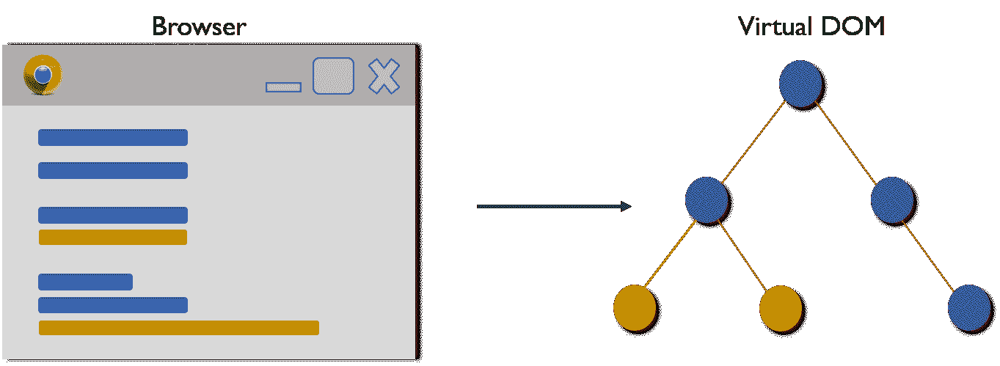
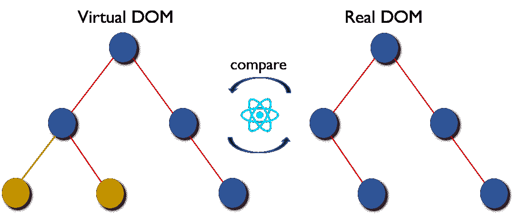
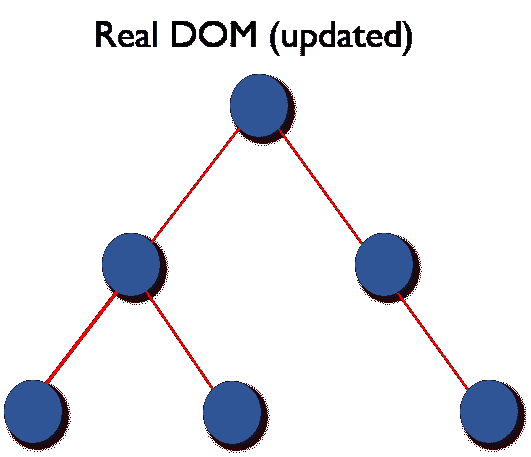
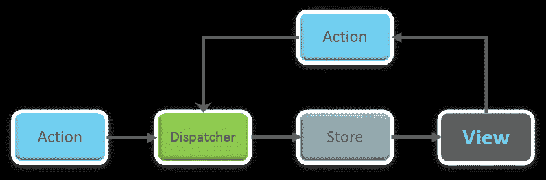
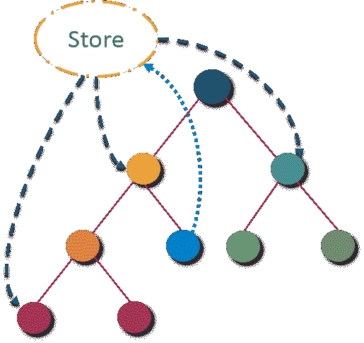
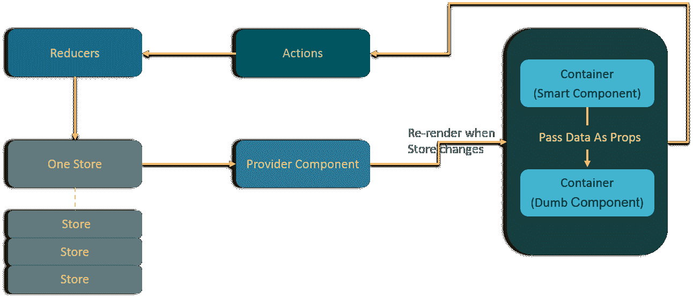

# 2023 年你必须准备的 50 个 React 面试问题

> 原文：<https://www.edureka.co/blog/interview-questions/react-interview-questions/>

选择合适的技术来开发应用程序或网站正变得越来越具有挑战性。其中，React 被认为是发展最快的 Javascript 框架。缓慢而稳定地，JavaScript 工具在市场上扎下了根，对 [***React 认证***](https://www.edureka.co/reactjs-redux-certification-training) 的需求呈指数级增长。凭借快速的学习曲线、可重用的组件和清晰的抽象，React 对于全球的前端开发人员来说是一个明显的胜利。所以，如果你是一名有抱负的前端开发人员，正在准备面试，那么这篇关于***50 大面试问题*** 的博客就是为你准备的。

让我们先来看看一些最常被问到的**反应面试问题** **:**

1.[区分真实 DOM 和虚拟 DOM。](#Difference-Real-Virtual) 2。[什么是 React？](#What-is-react) 3。[React 有什么特点？](#Features-of-React) 4。列出 React 的一些主要优势。 5。[React 有哪些局限性？](#Limitations-of-React) 6。[什么是 JSX？](#JSX)77。[你所理解的虚拟 DOM 是什么？解释它的工作原理。](#What-is-Virtual-DOM) 8。[为什么浏览器读不出 JSX？](#Browser-Read-JSX) 9。与 ES5 相比，React 的 ES6 语法有什么不同？ 10。[React 和 Angular 有什么不同？](#Difference-React-Angular)

到今天为止，Github 上大约有 1000 名贡献者。像虚拟 DOM 和可重用组件这样的独特特性吸引了前端开发人员的注意。尽管它只是 MVC(模型-视图-控制器)中“视图”的一个库，但它给成熟的框架如 Angular、Meteor、Vue 等带来了强大的竞争。看看下面的 2w 图，它显示了流行的 JS 框架的趋势:


**React Interview Questions**

所以，这里是**最有可能被面试官问及的前 50 个面试问题和答案**。为了方便您访问，我将 React 面试问题进行了分类，即:

*   [一般反应面试问题](#1)
*   [反应组件面试题](#2)
*   [React Redux 面试问题](#3)
*   [React 路由器面试问题](#4)

## **一般反应过来——反应过来面试问题**

### **1。区分真实 DOM 和虚拟 DOM。**

 <caption>#### 真实 DOM vs 虚拟 DOM</caption> 
| **真正的 DOM** | **虚拟 DOM** |
| 1。它更新很慢。 | 1。它更新更快。 |
| 2。可以直接更新 HTML。 | 2。不能直接更新 HTML。 |
| 3。如果元素更新，创建一个新的 DOM。 | 3。如果元素更新，则更新 JSX。 |
| 4。DOM 操作非常昂贵。 | 4。DOM 操作非常容易。 |
| 5。太多的内存浪费。 | 5。没有内存浪费。 |

### **2。什么是反应？**

*   React 是脸书在 2011 年开发的前端 JavaScript 库。
*   它遵循基于组件的方法，有助于构建可重用的 UI 组件。
*   用于开发复杂的交互式 web 和移动 UI。
*   尽管它在 2015 年才开源，但它拥有最大的社区之一来支持它。

### **3。React 有什么特点？**

React 的主要特性如下:

1.  它使用了虚拟 DOM 而不是真实的 DOM。
2.  使用**服务器端渲染**。
3.  遵循**单向数据流**或数据绑定。

### **4。列出 React 的一些主要优势。**

React 的一些主要优势是:

1.  它提高了应用程序的性能
2.  既可以在客户端使用，也可以在服务器端使用
3.  由于 JSX，代码的可读性增加了
4.  React 易于与其他框架集成，如 Meteor、Angular 等
5.  使用 React，编写 UI 测试用例变得极其容易

### **5。React 的局限性是什么？**

React 的局限性列举如下:

1.  React 只是一个库，不是一个成熟的框架
2.  它的库非常大，需要时间去理解
3.  对于编程新手来说，理解可能有点困难
4.  编码变得复杂，因为它使用内联模板和 JSX

## **2023 年 React 面试问答| Edureka**


[//www.youtube.com/embed/39ZiaKb1bSA?rel=0&showinfo=0](//www.youtube.com/embed/39ZiaKb1bSA?rel=0&showinfo=0)

### **6。什么是 JSX？**

JSX 是 JavaScript XML 的简称。这是 React 使用的一种文件类型，它利用了 JavaScript 的表达能力以及类似 HTML 的模板语法。这使得 HTML 文件非常容易理解。这个文件使应用程序更加健壮，并提高了它的性能。下面是 JSX 的一个例子:

```
render(){
    return(        

<div>

<h1> Hello World from Edureka!!</h1>

         </div>

    );
}

```

### **7。你所理解的虚拟 DOM 是什么？解释其作品。**

虚拟 DOM 是一个轻量级的 JavaScript 对象，最初只是真实 DOM 的副本。它是一个节点树，将元素、它们的属性和内容作为对象及其属性列出。 React 的渲染功能在 React 组件外创建一个节点树。然后，它更新该树，以响应由用户或系统所做的各种动作引起的数据模型中的突变。在线查看 [Web 开发人员课程](https://www.edureka.co/masters-program/full-stack-developer-training)以了解更多关于 react 的信息。

这个虚拟 DOM 只需要三个简单的步骤。

1.  每当任何底层数据改变时，整个 UI 都以虚拟 DOM 表示重新呈现。
2.  然后计算之前的 DOM 表示和新的之间的差异。【T2
3.  一旦计算完成，真正的 DOM 将只更新实际上已经改变的内容。

### **8。为什么浏览器不能读取 JSX？**

浏览器只能读取 JavaScript 对象，但 JSX 不能读取普通的 JavaScript 对象。因此，要使浏览器能够读取 JSX，首先，我们需要使用像巴别塔这样的 JSX 转换器将 JSX 文件转换成 JavaScript 对象，然后将它传递给浏览器。

### **9。与 ES5 相比，React 的 ES6 语法有什么不同？**

语法从 ES5 到 ES6 有如下变化:

1.  要求 vs 导入

    ```
    // ES5
    var React = require('react');

    // ES6
    import React from 'react';
    ```

2.  出口 vs 出口出口

    ```
    // ES5
    module.exports = Component;

    // ES6
    export default Component;
    ```

3.  ```
    // ES5
    var MyComponent = React.createClass({
        render: function() {
            return 

    <h3>Hello Edureka!</h3>
    ;
        }
    });

    // ES6
    class MyComponent extends React.Component {
        render() {
            return 

    <h3>Hello Edureka!</h3>
    ;
        }
    }
    ```

4.  道具

    ```
    // ES5
    var App = React.createClass({
        propTypes: { name: React.PropTypes.string },
        render: function() {
            return 

    <h3>Hello, {this.props.name}!</h3>
    ;
        }
    });

    // ES6
    class App extends React.Component {
        render() {
            return 

    <h3>Hello, {this.props.name}!</h3>
    ;
        }
    }
    ```

5.  状态

    ```
    // ES5
    var App = React.createClass({
        getInitialState: function() {
            return { name: 'world' };
        },
        render: function() {
            return 

    <h3>Hello, {this.state.name}!</h3>
    ;
        }
    });

    // ES6
    class App extends React.Component {
        constructor() {
            super();
            this.state = { name: 'world' };
        }
        render() {
            return 

    <h3>Hello, {this.state.name}!</h3>
    ;
        }
    }
    ```

### **10。React 和 Angular 有什么不同？**

 <caption>#### 反应与角度</caption> 
| **题目** | **反应过来** |  |
| *1。建筑* | 只有 MVC 的视图 | 完成 MVC |
| *2。效果图* | 服务器端渲染 | 客户端渲染 |
| *3。DOM* | 使用虚拟 DOM | 使用真实 DOM |
| *4。数据绑定* | 单向数据绑定 | 双向数据绑定 |
| *5。调试* | 编译时调试 | 运行时调试 |
| *6。作者* | 脸书 | 谷歌 |

## **React 组件—React 面试问题**

### **11。"在 React 中，一切都是组件."解释一下。**

组件是 React 应用程序用户界面的组成部分。这些组件将整个 UI 分割成独立的、可重用的小块。然后，它使这些组件相互独立，而不影响 UI 的其余部分。

### **12。渲染的目的是什么()在作出反应。**

每个 React 组件必须强制拥有一个【render】。它返回一个 React 元素，这个元素是原生 DOM 组件的表示。如果需要呈现多个 HTML 元素，那么必须将它们组合在一个封闭标签中，例如 **< form >、< group >、< div >** 等。这个函数必须保持纯净，也就是说，它必须在每次被调用时返回相同的结果。

### **13。如何将两个或更多组件嵌入到一个组件中？**

我们可以通过以下方式将组件嵌入其中:

```
class MyComponent extends React.Component{
    render(){
        return(          

<div>

<h1>Hello</h1>

                <Header/>
            </div>

        );
    }
}
class Header extends React.Component{
    render(){
        return 

<h1>Header Component</h1>

   };
}
ReactDOM.render(
    <MyComponent/>, document.getElementById('content')
);
```

### **14。什么是道具？**

Props 是 React 中属性的简称。它们是只读组件，必须保持纯净，即不可变。在整个应用程序中，它们总是从父组件传递到子组件。子组件永远不能将道具发送回父组件。这有助于维护单向数据流，通常用于呈现动态生成的数据。

### **15。React 中的状态是什么，如何使用？**

状态是 React 组件的核心。状态是数据的来源，必须尽可能保持简单。基本上，状态是决定组件呈现和行为的对象。与道具不同，它们是可变的，并创建动态和交互式的组件。通过 **this.state() 访问。**

### **16。区分状态和道具。**

 <caption>#### 状态 vs 道具</caption> 
| **条件** | **状态** | **道具** |
| 1。从父组件接收初始值 | 是 | 是 |
| 2。父组件可以改变值 | 否 | 是 |
| 3。在组件中设置默认值 | 是 | 是 |
| 4。组件内部的变化 | 是 | 否 |
| 5。设置子组件的初始值 | 是 | 是 |
| 6。子组件内部的变化 | 否 | 是 |

### **17。如何更新组件的状态？**

使用 this.setState()可以更新组件的状态。

```
class MyComponent extends React.Component {
    constructor() {
        super();
        this.state = {
            name: 'Maxx',
            id: '101'
        }
    }
    render()
        {
            setTimeout(()=>{this.setState({name:'Jaeha', id:'222'})},2000)
            return (                                 

<div>

<h1>Hello {this.state.name}</h1>

<h2>Your Id is {this.state.id}</h2>

                   </div>

            );
        }
    }
ReactDOM.render(
    <MyComponent/>, document.getElementById('content')
);

```

### **18。React 中的箭头功能是什么？如何使用？**

箭头函数更多的是编写函数表达式的简洁语法。它们也被称为*‘胖箭*’(**=>**)的功能。这些函数允许正确绑定组件的上下文，因为在 ES6 中，自动绑定在默认情况下是不可用的。箭头函数在处理高阶函数时最有用。

```
//General way
render() {    
    return(
        <MyInput onChange={this.handleChange.bind(this) } />
    );
}
//With Arrow Function
render() {  
    return(
        <MyInput onChange={ (e) => this.handleOnChange(e) } />
    );
}
```

### **19。区分有状态和无状态组件。**

 <caption>#### 有状态 vs 无状态</caption> 
| **有状态组件** | **无状态成分** |
| 1。在存储器中存储关于组件状态变化的信息 | 1。计算组件的内部状态 |
| 2。有权改变状态 | 2。无权改变状态 |
| 3。包含状态的过去、当前和未来可能变化的知识 | 3。不包含过去、当前和可能的未来状态变化的知识 |
| 4。无状态组件通知它们关于状态改变的需求，然后它们发送道具给它们。 | 4。它们接收来自有状态组件的属性，并把它们当作回调函数。 |

### **20。React 组件生命周期的不同阶段是什么？**

React 组件的生命周期有三个不同的阶段:

1.  *初始渲染阶段 :* 这是组件即将开始其生命之旅并走向 DOM 的阶段。
2.  *更新阶段 :* 一旦组件被添加到 DOM 中，只有当属性或状态发生变化时，它才可能更新和重新呈现。那只发生在这个阶段。
3.  *卸载阶段 :* 这是组件生命周期的最后一个阶段组件被销毁并从 DOM 中删除。

Want to upskill yourself to get ahead in your career? Check out this video

## **2023 年要学的十大技术| Edureka**


[https://www.youtube.com/embed/M2NyXKxyUGc](https://www.youtube.com/embed/M2NyXKxyUGc)

### **21。详细解释 React 组件的生命周期方法。**

一些最重要的生命周期方法有:

1.  ***组件将挂载******()***–在客户端和服务器端渲染之前执行。
2.  ***componentidmount******()***–仅在第一次渲染后在客户端执行。
3.  ***componentWillReceiveProps******()***–从父类收到道具后，在调用另一个渲染之前调用。
4.  ***shouldcomponentwupdate******()***–根据特定条件返回真值或假值。如果你想要你的组件更新，返回**真**否则返回**假**。默认情况下，它返回 false。
5.  ***componentWillUpdate******()***–在 DOM 中进行渲染之前调用。
6.  ***componentDidUpdate******()***–渲染发生后立即调用。
7.  ***组件将卸载******()***–从 DOM 中卸载组件后调用。它用于清理内存空间。

### **22。React 中的事件是什么？**

在 React 中，事件是对鼠标悬停、鼠标点击、按键等特定动作的触发反应。处理这些事件类似于处理 DOM 元素中的事件。但是有一些句法上的不同，比如:

1.  事件的命名使用大小写字母，而不仅仅是小写字母。
2.  事件是作为函数而不是字符串传递的。

事件参数包含一组特定于事件的属性。每个事件类型都包含自己的属性和行为，只能通过其事件处理程序进行访问。

### **23。如何在 React 中创建事件？**

```
class Display extends React.Component({    
    show(evt) {
        // code   
    },   
    render() {      
        // Render the div with an onClick prop (value is a function)        
        return (            

<div onClick={this.show}>Click Me!</div>

        );    
    }
});
```

### **24。React 中的合成事件是什么？**

合成事件是作为浏览器本地事件的跨浏览器包装器的对象。它们将不同浏览器的行为组合到一个 API 中。这样做是为了确保事件在不同的浏览器中显示一致的属性。

### **25。React 中的 refs 是什么意思？**

Refs 是 React 中 References 的简称。该属性有助于存储对特定 React 元素或组件的引用，该引用将由组件呈现配置函数返回。返回对 render()返回的特定元素或组件的引用。当我们需要 DOM 度量或者向组件添加方法时，它们就派上用场了。

```
class ReferenceDemo extends React.Component{
     display() {
         const name = this.inputDemo.value;
         document.getElementById('disp').innerHTML = name;
     }
render() {
    return(        

<div>
            Name: <input type="text" ref={input => this.inputDemo = input} />
            <button name="Click" onClick={this.display}>Click</button>            

<h2>Hello <span id="disp"></span> !!!</h2>

      </div>
    );
   }
 }
```

### **26。列举一些你应该使用参考文献的例子。**

以下是应该使用 refs 的情况:

*   当您需要管理焦点时，选择文本或媒体播放
*   触发命令式动画
*   与第三方 DOM 库集成

### **27。如何在 React 中模块化代码？**

我们可以通过使用导出和导入属性来模块化代码。它们有助于在不同的文件中分别编写组件。

```
//ChildComponent.jsx
export default class ChildComponent extends React.Component {
    render() {
        return(           

<div>

<h1>This is a child component</h1>

           </div>

        );
    }
}

//ParentComponent.jsx
import ChildComponent from './childcomponent.js';
class ParentComponent extends React.Component {    
    render() {        
        return(           

<div>               
                <App />          
            </div>

        );  
    }
}
```

### **28。如何在 React 中创建** **形态** **？**

React 表单类似于 HTML 表单。但是在 React 中，状态包含在组件的 state 属性中，只能通过 setState()更新。因此，元素不能直接更新它们的状态，它们的提交是由 JavaScript 函数处理的 。该函数可以完全访问用户输入到表单中的数据。

```
handleSubmit(event) {
    alert('A name was submitted: ' + this.state.value);
    event.preventDefault();
}

render() {
    return (        

<form onSubmit={this.handleSubmit}>
            <label>
                Name:
                <input type="text" value={this.state.value} onChange={this.handleSubmit} />
            </label>
            <input type="submit" value="Submit" />
        </form>

    );
}
```

### **29。你对受控和非受控组件了解多少？**

 <caption>#### 受控组件与非受控组件</caption> 
| **受控组件** | **不受控制的组件** |
| 1。它们不保持自己的状态 | 1。它们保持自己的状态 |
| 2。数据由父组件控制 | 2。数据由 DOM 控制 |
| 3。它们通过 props 接收当前值，然后通过回调通知变化 | 3。参考用于获取其当前值 |

如果您在回答这些 React 面试问题时遇到任何挑战，请在下面的部分评论您的问题。

## **反应面试问题**

### **30。什么是高阶元件(HOC)？**

高阶组件是重用组件逻辑的一种高级方式。基本上， 这是一种源自 React 的组合性质的模式。HOC 是将另一个组件包装在其中的定制组件。它们可以接受任何动态提供的子组件，但不会修改或复制输入组件的任何行为。你可以说 HOC 是“纯”组件。

### **31。你能用 HOC 做什么？**

HOC 可用于许多任务，例如:

*   代码重用、逻辑和引导抽象
*   渲染高顶起
*   状态抽象和操作
*   道具操纵

### **32。什么是纯组件？**

*纯*组件是可以编写的最简单最快的组件。它们可以替换任何只有一个 **render() 的组件。这些组件增强了代码的简单性和应用程序的性能。**

### **33。React 中键的意义是什么？**

键用于标识唯一的虚拟 DOM 元素及其驱动 UI 的相应数据。它们通过回收 DOM 中的所有现有元素来帮助优化呈现。这些键必须是唯一的数字或字符串，使用它们 React 只是对元素重新排序，而不是重新呈现它们。这导致应用程序性能的提高。

**React Redux – React Interview Questions**

### **34。MVC 框架的主要问题是什么？**

以下是 MVC 框架的一些主要问题:

*   DOM 操作非常昂贵
*   应用程序运行缓慢且效率低下
*   有大量的内存浪费
*   由于循环依赖，围绕模型和视图创建了一个复杂的模型

### **35。解释通量。**

Flux 是一种实施单向数据流的架构模式。它控制派生数据，并使用对所有数据拥有权限的中央存储来实现多个组件之间的通信。整个应用程序中的任何数据更新都只能在这里进行。Flux 为应用程序提供了稳定性，并减少了运行时错误。【T2

### **36。** **什么是 Redux？**

Redux 是当今市场上最受欢迎的前端开发库之一。它是 JavaScript 应用程序的可预测状态容器，用于整个应用程序的状态管理。使用 Redux 开发的应用程序易于测试，并且可以在不同的环境中运行，表现出一致的行为。

### **37。Redux 遵循的三个原则是什么？**

1.  ***单一事实来源:*** 整个应用程序的状态存储在一个对象/状态树的单一存储中。单一状态树使得跟踪随时间的变化以及调试或检查应用程序变得更加容易。
2.  ***状态* *只读:*** 改变状态的唯一方法是触发一个动作。动作是描述变更的普通 JS 对象。就像状态是数据的最小表示一样，动作是数据变化的最小表示。
3.  ***用纯函数做改变:*** 为了指定状态树如何被动作转化，你需要纯函数。纯函数是那些返回值仅依赖于参数值的函数。 

### **38。你所理解的“S** **英格尔** **真理之源”是什么？**

Redux 使用“存储”在一个地方存储应用程序的整个状态。因此，所有组件的状态都存储在存储中，它们从存储本身接收更新。单一状态树使得跟踪随时间的变化以及调试或检查应用程序变得更加容易。

### **39。列出 Redux 的组件。**

Redux 由以下组件组成:

1.  **动作**——它是一个描述发生了什么的物体。
2.  **减速器**——是决定状态会如何变化的地方。
3.  **存储**–整个应用的状态/对象树保存在存储中。
4.  **视图**——简单显示店铺提供的数据。

如果您在回答这些 React 面试问题时遇到任何挑战，请在下面的部分评论您的问题。

### **40。展示数据是如何流经 Redux 的？**



### **41。Redux 中的动作是如何定义的？**

React 中的动作必须有一个 type 属性来指示正在执行的动作的类型。它们必须被定义为一个字符串常量，并且您还可以向它添加更多的属性。在 Redux 中，动作是使用称为动作创建器的函数创建的。下面是一个动作和动作创建者的例子:

```
function addTodo(text) {
       return {
                type: ADD_TODO,    
                 text    
    }
}
```

### **42。解释减速器的作用。**

reducer 是纯函数，它指定应用程序的状态如何响应一个动作而改变。Reducers 通过接受先前的状态和动作来工作，然后返回一个新的状态。它根据动作的类型确定需要进行哪种更新，然后返回新值。如果不需要做任何工作， 返回原来的状态。

### **43。Store 在 Redux 中的意义是什么？**

store 是一个 JavaScript 对象，它可以保存应用程序的状态，并提供一些助手方法来访问状态、分派动作和注册监听器。应用程序的整个状态/对象树保存在单个存储中。因此，Redux 非常简单且可预测。我们可以将中间件传递给商店来处理数据，并记录改变商店状态的各种操作。所有的动作通过 reducers 返回一个新的状态。

### **44。Redux 和 Flux 有什么不同？**

 <caption>#### 通量与还原</caption> 
| **通量** | **Redux** |
| 1。存储器包含状态和变化逻辑 | 1。存储和更改逻辑是分开的 |
| 2。有多家店 | 2。只有一家店 |
| 3。所有的店都是断平的 | 3。带分级减速器的单店 |
| 4。有单独的调度员 | 4。没有调度员的概念 |
| 5。React 组件订阅商店 | 5。容器组件利用连接 |
| 6。状态可变 | 6。状态是不可变的 |

如果您在回答这些 React 面试问题时遇到任何挑战，请在下面的部分评论您的问题。

## **反应面试问题**

### **45。Redux 的优势在哪里？**

Redux 的优势列举如下:

*   **结果的可预测性—**因为总是有一个真实的来源，即商店，所以不存在如何将当前状态与应用程序的动作和其他部分同步的混淆。
*   **可维护性—**代码变得更容易维护，具有可预测的结果和严格的结构。
*   **服务器端渲染——**你只需要把在服务器上创建的商店传递到客户端。这对于初始渲染非常有用，并提供了更好的用户体验，因为它优化了应用程序的性能。
*   **开发者工具—**从动作到状态变化，开发者可以实时跟踪应用中发生的一切。
*   **社区和生态系统—**Redux 背后有一个庞大的社区，这使得它的使用更具吸引力。一个由才华横溢的个人组成的大型社区为改善图书馆做出了贡献，并开发了各种应用程序。
*   **易测试——**Redux 的代码大多是小的、纯粹的、孤立的函数。这使得代码是可测试的和独立的。
*   **组织—**Redux 精确地规定了代码应该如何组织，这使得团队使用代码时更加一致和容易。

**React Router – React Interview Questions**

### **46。什么是 React 路由器？**

React Router 是一个强大的路由库，构建在 React 之上，有助于向应用添加新的屏幕和流。这使 URL 与网页上显示的数据保持同步。它保持了标准化的结构和行为，用于开发单页 web 应用程序。React 路由器有一个简单的 API。

### **47。为什么在 React 路由器 v4 中使用** **作为交换机关键字** **？**

虽然一个 **< div >** 被用来封装路由器内部的多条路由。当您想在几条定义的 路线中只显示一条要渲染的路线时，使用“switch”关键字 。**<开关>** 标签在使用时将键入的 URL 与定义的路由按顺序匹配。 找到第一个匹配时，渲染指定路线。从而绕过了剩余的号航线。

### **48。React 中为什么需要路由器？**

路由器用于定义多条路由，当用户键入特定 URL 时，如果该 URL 与路由器内定义的任何“路由”的路径匹配，则用户会被重定向到该特定路由。所以基本上，我们需要在我们的应用程序中添加一个路由器库，允许创建多条路由，每条路由都为我们带来一个独特的视图。

```
<switch>
    <route exact path=&rsquo;/&rsquo;&nbsp;component={Home}/>
    <route path=&rsquo;/posts/:id&rsquo; component={Newpost}/>
    <route path=&rsquo;/posts&rsquo;&nbsp;&nbsp; component={Post}/>
</switch>
```

### **49。列出 React 路由器的优点。**

几个优点是:

1.  就像 React 如何基于组件一样，在 React 路由器 v4 中，API 是*‘关于组件的一切’*。路由器可以被视为一个单一的根组件(**<browser Router>**)，其中我们包含了特定的子路由( **<路由>** )。
2.  无需手动设置历史值:在 React 路由器 v4 中，我们需要做的就是将我们的路由包装在**<browser Router>**组件中。
3.  这些包是分开的:三个包，一个用于 Web，一个用于本地，一个用于核心。这支持我们的应用程序的紧凑尺寸。基于相似的编码风格很容易切换。

### **50。React 路由器与常规路由有何不同？**

 <caption>#### 传统路由与反应路由</caption> 
| **题目** | **常规路由** | **反应过来路由** |
| **页面涉及** | 每个视图对应一个新文件 | 只涉及单个 HTML 页面 |
| **网址变化** | 向服务器发送 HTTP 请求，并接收相应的 HTML 页面 | 只有历史属性被改变 |
| **感受** | 用户实际上在每个视图的不同页面间导航 | 用户被欺骗了，以为他在浏览不同的页面 |

我希望这一套 [React](https://reactjs.org/) 面试问答能帮助你准备面试。万事如意！

*如果你想接受 web 开发方面的培训，并希望自己开发有趣的 UI，那么就去参加由 Edureka 提供的 [Web 开发认证](https://www.edureka.co/masters-program/web-developer-training)培训，edu reka 是一家值得信赖的在线学习公司，在全球拥有超过 250，000 名满意的学习者。*

*有问题吗？请在评论区提到它，我们会给你回复。*