# Angular 教程:Angular 8 入门

> 原文：<https://www.edureka.co/blog/angular-tutorial/>

最流行和最常用的前端开发框架之一是 Angular。随着这项技术的普及，招聘角度工程师的市场竞争越来越激烈。随着对专业和有经验的 angle 程序员需求的增长，越来越多的国家希望扩大他们的 angle 开发队伍。使用这个平台可以构建移动和桌面应用程序。Angular 被许多前沿组织用来构建现代 web 应用程序。在这个领域找到一份高薪好工作的最好方法是获得一个角度认证。但是，如果你还不了解这项技术，这里有一个完整的 Angular 8 教程，可以帮助你从零开始学习 Angular 8。

让我们来看看 Angular 框架的简史。：

完整视频教程，参考以下视频:

## Angular 8 教程|从头开始创建 Angular 项目| Angular Training | Edureka

[https://www.youtube.com/embed/pTec1e8oyc8](https://www.youtube.com/embed/pTec1e8oyc8)This Edureka “Angular 8 Tutorial” will help you learn Angular 8 completely along with a step by step demonstration on how to create an Angular project from scratch.

## **历史&版本**

Angular 是谷歌从 AngularJS 的基础上重新改写的。

### **角度 2**

Angular 2.0 于 2014 年 10 月公布。2.0 版本中的戏剧性修改在开发者中引发了很多争论。据 Angular 团队称，angular 2 于 2015 年 4 月 30 日从 Alpha 升级为开发者预览版。2015 年 12 月，Angular 2 升级为 Beta 版，2016 年 5 月发布了第一个发布候选版本。

### **角度 4**

2016 年 12 月 13 日发布了 Angular 4，并跳过了 3，以避免因路由器包中的版本不匹配而导致的混乱，路由器包已发布为 3.3.0 版。HttpClient 是一个更简单、更易于使用、功能更强大的用于发出 HTTP 请求的库，此版本中还引入了用于保护者和解析者的路由器生命周期事件。要了解有关 Angular 的更多信息，请查看此[全栈开发人员在线课程](https://www.edureka.co/masters-program/full-stack-developer-training)。

### **角度 5**

Angular 5 于 2017 年 11 月 1 日发布。Angular 5 的亮点包括支持渐进式 web 应用程序、构建优化器和材料设计改进。

### **角度 6**

Angular 6 于 2018 年 5 月 4 日发布。这是一个大版本，更少关注底层框架，更多关注工具链，使未来的 Angular 开发更容易，如:ng update，ng add，Angular Elements，Angular Material + CDK 组件，Angular Material Starter 组件，CLI 工作区，库支持，Tree Shakable Providers，动画性能改进，以及 RxJS v6。

### **角度 7**

Angular 7 于 2018 年 10 月 18 日发布。更新应用程序性能、角度材料和 CDK、虚拟滚动、改进选择的可访问性、利用现在支持自定义元素的 web 标准的内容投影，以及 Typescript 3.1、RxJS 6.3 和 Node 10 依赖性更新(仍支持 Node 8)

### **角度 8**

Angular 8 于 2019 年 5 月 28 日发布。差分加载可用于整个应用程序代码，以及 lazy routes、Web workers、TypeScript 3.4 支持和 Angular Ivy 的选择性加入预览的动态导入。Angular Ivy 的选择加入预览包含:

*   生成的代码在运行时更易于阅读和调试
*   更快的重建时间
*   改进的有效载荷尺寸
*   改进的模板类型检查
*   向后兼容性

### **角度 9**

Angular 9 发布于 2020 年 2 月 6 日。默认情况下，版本 9 中的所有应用程序都使用 Ivy 编译器和运行时。Angular 可以支持 TypeScript 3.6 和 3.7。

除了数百个错误修复之外，Ivy 编译器和运行时还提供了许多好处，例如:

*   较小的束尺寸
*   更快的测试
*   更好的调试
*   改进的 CSS 类和样式绑定
*   改进的类型检查
*   改进了构建错误
*   构建时间已经改进，AOT 现在默认启用。
*   国际化程度提高

### **角度 10**

Angular 10 发布于 2020 年 6 月。

*   新日期范围选择器(材料用户界面库)
*   关于 CommonJS 导入的警告
*   可选的更严格设置与生态系统保持同步新的默认浏览器配置

### **角度 11**

Angular 11 发布于 2020 年 11 月。

### 角度 12

Angular 12 发布于 2021 年 5 月。[25] 对 IE11 的弃用支持每个版本都应该向后兼容以前的版本。Angular 开发团队承诺每年更新框架两次。

## **什么是棱角分明？**

Angular 是一个基于 Typescript 的开源框架，用于构建客户端 web 应用程序。由于 Typescript 是 JavaScript 的超集，我们先简单了解一下 JavaScript。JavaScript 运行在 web 的客户端，可用于设计或编程网页在事件发生时的行为。通常，JavaScript 用于界面交互、幻灯片和其他交互组件。JavaScript 发展很快，也已经用于服务器端编程(如 Node.js)、游戏开发等。Angular 是印度和美国所有其他[网络开发培训](https://www.edureka.co/complete-web-developer)课程中需求量最大的。

JavaScript 处理动态内容，这是 web 开发的一个重要方面。动态内容是指不断变化的内容，它适应特定的用户。例如，JavaScript 可用于通过检查正在访问网站的设备来确定是否呈现网站的移动版本。

这鼓励了 web 开发人员开始创建他们自己的定制 JavaScript 库，以减少代码行的数量并轻松实现复杂的功能。jQuery 是一个快速、小巧、功能丰富的 JavaScript 库，它通过一个易于使用的 API 使 HTML 文档遍历和操作、事件处理、动画和 Ajax 变得更加简单。jQuery 成为最受欢迎的一个，因为它易于使用并且非常强大。

由于 jQuery 没有真正的结构，开发者可以完全自由地构建他们认为合适的项目。然而，缺乏结构也意味着更容易陷入“意大利面条式代码”的陷阱，这可能会在没有明确设计方向或代码可维护性的大型项目中导致混乱。对于这些情况，像 Angular 这样的框架会有很大的帮助。

**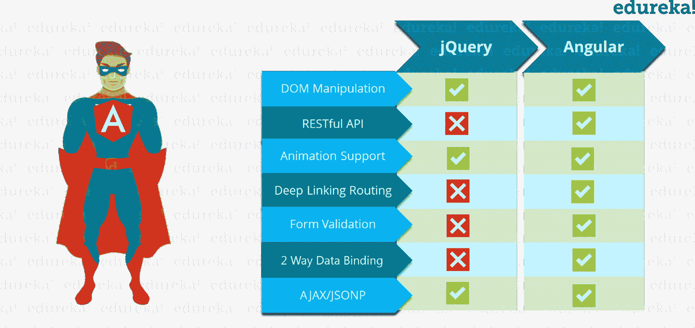图** : * Angular 8 教程——Angular vs jQuery*

Angular 是一个客户端 JavaScript 框架，专门设计用于帮助开发人员根据 web 开发的最佳实践构建 SPAs(单页应用程序)。通过为构建 spa 提供结构化的环境，产生“意大利面条式代码”的风险大大降低了。所以，你一定想知道什么是 SPA？

***单页应用*** (或 ***SPA 的*** )是像其他网站一样通过网络浏览器访问的应用，但提供更动态的交互，类似于本地移动和桌面应用。普通网站和 SPA 最显著的区别是减少了页面刷新次数。SPAs 大量使用 AJAX——这是一种与后端服务器通信的方式，无需刷新整个页面就可以将数据加载到我们的应用程序中。因此，呈现页面的过程大部分发生在客户端。

**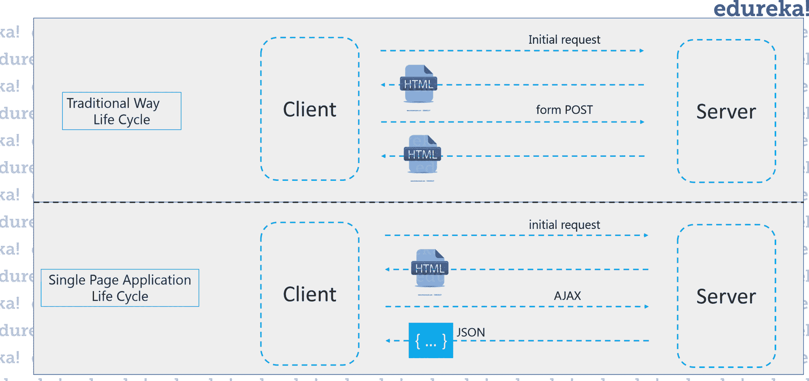图:** *棱角分明 8 教程——单页应用*

例如，如果你浏览 Gmail，你会注意到从收件箱打开邮件时，只会获取电子邮件并显示在电子邮件列表中。其余的组件，如侧边栏、导航栏等。不会重新加载。它只刷新所需部分的 DOM(文档对象模型)。所以，这减少了网站的开销。

现在我们知道了什么是 Javascript & Jquery，以及 angular 是如何出现的。在 angular 8 教程中，我们将浏览 Angular 的特性，并了解如何使用 Angular。

## **棱角分明 8 教程**

Angular 是一个基于 TypeScript 的开源前端 web 应用平台，由谷歌的 Angular 团队以及一个个人和企业社区领导。Angular 是由构建 AngularJS 的同一个团队完全重写的。但是我告诉你，Angular 和 AngularJS 是完全不同的。让我们理解角形和棱形的区别。

*   Angular 应用程序的架构不同于 AngularJS。Angular 的主要构建块是模块、组件、模板、元数据、数据绑定、指令、服务和依赖注入。我们一会儿将会看到它。
*   Angular 没有“范围”或控制器的概念，而是使用组件层次结构作为其主要的架构概念。
*   Angular 的表达式语法更简单，侧重于“[ ]”进行属性绑定，()”进行事件绑定
*   **移动开发**–首先解决移动性能问题，桌面开发就容易多了。因此，Angular 首先处理移动开发。
*   **模块化**——角度遵循模块化。相似的功能一起保存在相同的模块中。这给了 Angular 一个更轻的&更快的内核。

Angular 推荐使用微软的 TypeScript 语言，该语言引入了以下特性:

*   基于类的面向对象编程
*   静态打字

TypeScript 是 ECMAScript 6 (ES6)的超集，并向后兼容 ECMAScript 5。Angular 8 还包括 ES5 到 ES2015+的好处:

*   支持使用 RxJS 的反应式编程

在本 Angular 8 教程中，我们先来了解 Angular 的特性。

## **棱角分明的五官**

**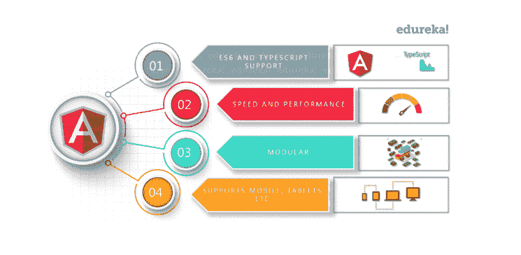图:** *棱角分明 8 教程——棱角分明特征*

**跨平台**

**渐进式网络应用:** 它使用现代网络平台功能来提供类似应用的体验。它提供了高性能、离线和零步骤安装。因此，使用 Angular 非常简单。

**原生:** 可以使用 Ionic Framework、NativeScript、React Native 等策略构建原生移动应用。

**桌面:** 使用你为 web plus 所学的相同的角度方法，在 Mac、Windows 和 Linux 上创建桌面安装的应用程序。

**速度与性能**

**代码生成:** Angular 将你的模板转化为针对 JavaScript 虚拟机高度优化的代码，让你拥有一个框架的生产力和手写代码的所有好处。

**通用:** 你可以使用任何有 Angular 的技术为 node.js 这样的应用服务。 NET、 PHP 等服务器

**代码拆分:** Angular 应用通过新的组件路由器快速加载，该路由器提供自动代码拆分，因此用户只需加载渲染他们请求的视图所需的代码。

**生产率**

**模板:** 用简单而强大的模板语法快速创建 UI 视图。

**Angular CLI:** 命令行工具:您可以轻松快速地开始构建组件、添加组件、测试它们，然后使用 Angular CLI 立即部署它们。

**ide:**在像微软的 VS 代码这样的流行编辑器和 ide 中获得智能代码补全、即时错误等反馈。

**全力发展剧情**

**测试:** 使用 Jasmine 测试框架，Angular CLI 下载并安装测试应用程序所需的一切。当您运行 *ng test* 命令时，应用程序将在手表模式下构建，Karma test runner 将启动。完成后，您将在终端中看到输出，chrome 浏览器将打开，在 Jasmine HTML Reporter 中显示输出。

## Angular 12 First 应用程序

首先，安装你选择的任何编辑器。让我们考虑一下 VSCode 编辑器，从应用程序安装开始，然后是创建。

安装节点包管理器

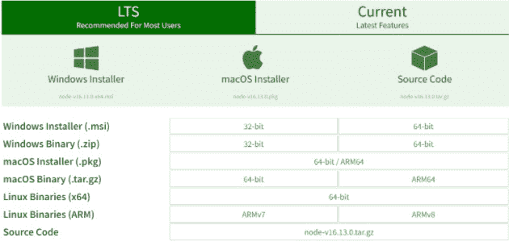

安装 npm 后，打开命令提示符并运行以下命令:

这里这些命令指明了安装的节点包的版本。现在，我们已经安装了节点包管理器。现在我们准备设置运行以下命令。

运行任何角度命令安装角度命令行界面是第一步

npm 安装-g @angular/cli

现在，让我们创建我们的棱角分明的项目

ng 新 *项目名称*

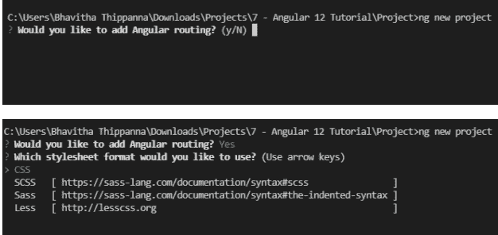

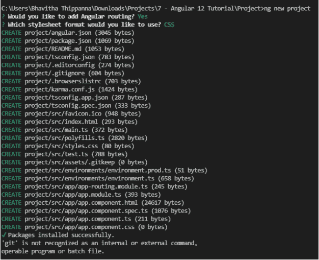

要在我们刚刚创建的项目中工作，让我们进入目录或更改目录

cd *项目名称*

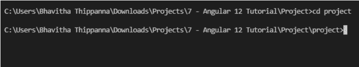

现在，让我们启动服务器

ng 发球

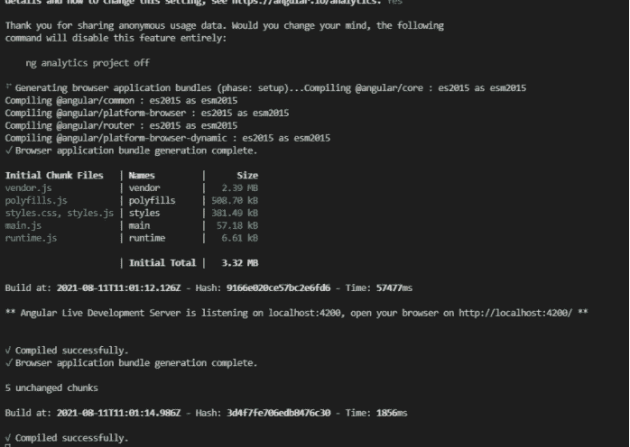

在这里运行下面的命令，创建你的 Angular 应用程序，进入目录&启动你的服务器。

ng 新 *app-name*

CD*app-name*

ng 发球

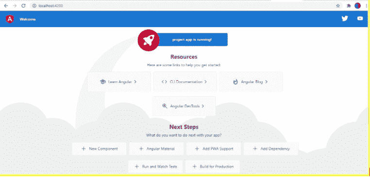

**棱角 12 档解说**

现在我们已经创建了应用程序。我们为什么不看看里面的文件和目录。

如果你点击文件夹，进入 IDE，你会看到这个。

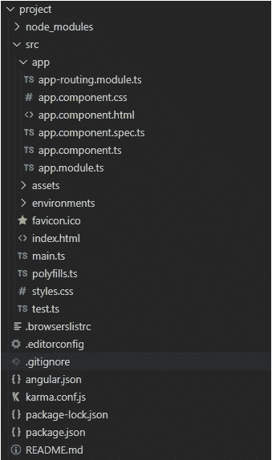

让我们进入 src - >应用- >，在这里您可以看到刚刚创建的应用的组件。

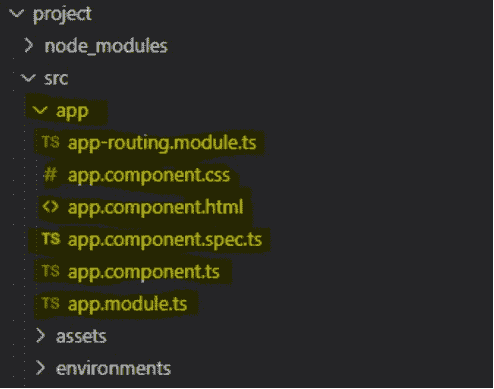

你看到的组件文件会有:

*   app.component.css
*   app.component.html
*   应用组件规格
*   app.component.ts
*   应用模块 ts

除了这些文件，在 *app-name 目录下还有一个主 HTML 文件和一个主样式文件。*

*   index.html
*   style.css

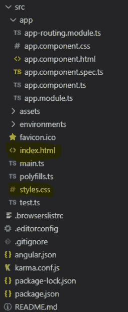

### 所有 CLI 命令

Angular CLI 是一个命令行界面工具，用于初始化、开发、搭建和维护 Angular 应用程序。这些命令可以直接从命令提示符运行，也可以间接使用交互式用户界面(如 Angular 控制台)运行。

| **命令** | **别名** | **描述** |
| 添加 | 它用于为你的项目提供外部库支持。 |
| 建造 | b | 将角度应用程序编译到指定输出路径的目录中。从工作空间目录中运行该命令。 |
| 配置 | 访问或修改工作区 angular.json 文件中的角度配置数据。 |
| doc | d | 它在浏览器中寻找官方 Angular 文档(angular.io)中的给定关键字。 |
| e2e | e | 在使用量角器运行端到端测试之前，它构建并提供一个 Angular 应用程序。 |
| 生成 | g | 它使用原理图来生成和/或修改文件。 |
| 帮助 | 它提供了可访问命令的列表以及每个命令的简要描述。 |
| 功能区 | l | 用于对特定项目文件夹中的 Angular 应用程序的代码执行林挺工具。 |
| 新 | n | 它从头开始构建一个新的工作空间和一个 Angular 应用程序。 |
| 运行 | 它使用您在项目中指定的特定构建器配置来运行架构师目标。 |
| 发球 | s | 它构建并服务你的应用，当文件被修改时重新构建。 |
| 测试 | t | 它在项目中运行单元测试。 |
| 更新 | 它更新您的应用程序及其依赖项。参见 https://update.angular.io/ |
| 版本 | v | 它给出了角度 CLI 版本。 |
| xi18n | 它从源代码中提取 i18n 个消息。 |

## **Angular 8 的新功能:**

**TypeScript 3.4:**Angular 8 需要 TypeScript 3.4 进行 web 开发

**Opt-n Ivy 预览:** Ivy 是 Angular 的下一代编译和渲染管道的名字。这将有助于你有选择地预览你的网站，看看它是如何工作的

**差异加载:** 作为其构建过程的一部分，Angular 8 CLI 将能够生成传统和现代 JS 捆绑包，即 ES5 和 ES2015+。这意味着对于当前的浏览器来说，不同负载的客户端具有改进的速度和 TTI(交互时间)

**路由器的向后兼容性:** 这有助于简化大型项目的升级路径

**Opt-in 用法共享:** 有了这个功能，Angular 团队将能够在您同意的情况下收集匿名信息，以跟踪构建您的项目所使用的命令和花费的时间

**依赖关系更新:** Angular 8 更新了对 RxJS、Node 和 TypeScript(如前所述)等工具的依赖关系，以获得更好的性能并与当前环境同步

Web Worker Building:Web Worker 允许你编写独立于主线程运行的代码。这通过并行化多个任务来提高速度。作为开发者请求的结果，Angular 8 的开发者增加了对网络工作者的捆绑支持

## **积木般的棱角**

Angular 的主要构建模块有:

*   模块
*   组件
*   模板
*   元数据
*   数据绑定
*   指令
*   服务
*   依赖注入

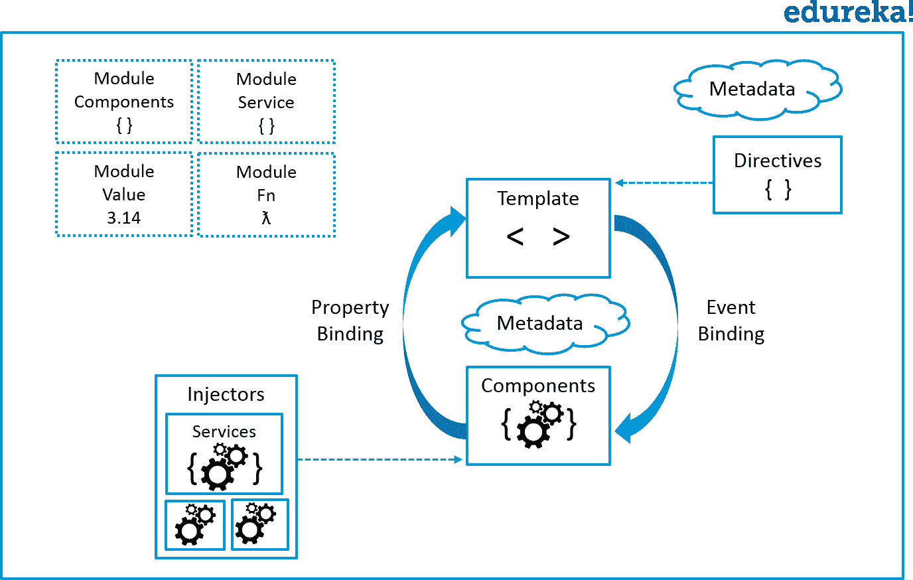

**图:** *棱角 8 教程——建筑*

## **角 12 库**

许多应用程序需要解决相同的一般问题，例如呈现统一的用户界面、呈现数据和允许数据输入。开发人员可以为特定领域创建通用解决方案，这些解决方案可以在不同的应用程序中重用。这样的解决方案可以构建成 Angular 库，然后可以作为 npm 包共享和发布。

Angular 库是一种 Angular 项目，与应用程序不同，它不能独立运行。在程序中使用库之前，必须先将其导入。

创建库:

首先，在 Angular CLI 中运行以下命令，在新的工作空间中创建新的库骨架。

ng 新的我的工作空间–创建应用程序=false

我的光盘-工作区

ng generate 命令在您的工作区中创建一个包含 NgModule 组件和服务的 projects/my-lib 文件夹。

ng 生成库 my-lib

当您生成一个新的库时，工作空间配置文件 angular.json 会随类型为 library 的项目一起更新。

```

"projects": {
...
"my-lib": {
"root": "projects/my-lib",
"sourceRoot": "projects/my-lib/src",
"projectType": "library",
"prefix": "lib",
"architect": {
"build": {
"builder": "@angular-devkit/build-angular:ng-packagr",

```

CLI 命令可用于构建、测试和 lint 项目:

```

ng build my-lib --configuration development

ng test my-lib

ng lint my-lib

```

值得注意的是，项目的配置构建器不同于应用程序项目的默认构建器。

您知道 Angular CLI 也允许您发布您的库吗？使用 Angular CLI 和 npm 包管理器创建并发布您的库作为 npm 包。创建用于分发的库时，始终使用生产配置。这保证了结果输出使用正确的 npm 包格式和优化。

ng 构建我的库

光盘发行/我的图书馆

npm 发布

现在我们将看看如何在我们的应用程序中使用这些库。

要在应用程序中使用您自己的资料库，请按照下列步骤操作:

*   建造图书馆。在图书馆建成之前，你不能使用它。 ng 构建我的库
*   在应用程序中按名称从库中导入:从“my-lib”导入{ my export }；

确保有与您发布的库兼容的版本。

用于构建应用程序的 Angular 版本应该总是匹配或超过用于构建其任何依赖库的 Angular 版本。例如，如果一个库使用 Angular 版本 12，所有依赖它的应用程序也应该使用 Angular 版本 12 或更高版本。Angular 不支持使用旧版本的应用程序。

最后，为了让其他“npm”命令不受干扰地运行，如果您运行“yarn install”或“npm install ”,您必须重新运行“ngcc”。不考虑其他 npm 进程，库现在只需要被链接器处理一次。

## **模块**

Angular 应用是模块化的，为了保持模块化，我们有 *Angular 模块*或者你可以说*ng 模块*。每个 Angular app 包含至少一个 Angular 模块，即根模块。一般命名为 *AppModule* 。根模块*可以是小型应用程序中唯一的模块。而大多数应用程序都有多个模块。你可以说，一个模块是一个内聚的代码块，它具有一组相关的功能，这些功能具有特定的应用领域或工作流。任何角度模块都是带有@NgModule decorator 的类。*

***装饰器*** 是修改 JavaScript 类的函数。Decorators 主要用于将元数据附加到类上，这样它就知道这些类的配置以及它们应该如何工作。 *NgModule* 是一个装饰函数，它采用元数据对象，这些对象的属性描述了模块。属性有:

*   ***声明:*** 与视图相关的类，它们属于这个模块。有三种类型的 Angular 可以包含视图:组件、指令和管道。我们一会儿会谈到它们。
*   ***导出:*** 其他模块的组件应该可以访问的类。
*   ***导入:*** 该模块的组件需要其类的模块。
*   ***提供者:*** 出现在一个模块中的服务将在其他模块或组件中使用。一旦服务被包含在提供者中，它在应用程序的所有部分都是可访问的
*   ***bootstrap:****根组件*即应用程序的主视图。这个根模块只有这个属性，它指示要引导的组件。

让我们看看根模块(即***src/app/app . module . ts***)最初是什么样子:

```
import { BrowserModule } from '@angular/platform-browser';
import { NgModule } from '@angular/core';

import { AppComponent } from './app.component';

@NgModule({
  declarations: [
    AppComponent
  ],
  imports: [
    BrowserModule
  ],
  providers: [],
  bootstrap: [AppComponent]
})
export class AppModule { }

```

根模块通常不导出 T2 的类，因为根模块是导入其他模块组件来使用它们的模块。 我们在一个 *main.ts* 文件中引导 *AppModule* ，在这里我们指定引导模块，在引导模块内部，它包含引导组件。

```
import { enableProdMode } from '@angular/core';
import { platformBrowserDynamic } from '@angular/platform-browser-dynamic';

import { AppModule } from './app/app.module';
import { environment } from './environments/environment';

if (environment.production) {
  enableProdMode();
}

platformBrowserDynamic().bootstrapModule(AppModule)
  .catch(err => console.error(err));

```

### **【角库】**

Angular 给了我们一个提供各种功能的 JavaScript 模块(库模块)的集合。每个 Angular 库都有 *@angular* 前缀，像 *@angular/core、@angular/compiler、@angular/compiler-cli、@angular/http、@angular/router* 。您可以使用 **npm** 包管理器安装它们，并使用 JavaScript import 语句导入它们的一部分。

```
import { Component } from '@angular/core';
```

在上面的例子中，Angular 的组件装饰器是从@angular/core 库中导入的。

现在继续学习 Angular 8 教程，让我们了解 Angular 的下一个重要组成部分，即组件。

## **组件**

一个*组件*控制屏幕上一个或多个被称为*视图*的部分。例如，如果您正在构建一个课程列表应用程序，您可以拥有像 App 组件(*引导组件)*、课程组件、课程细节组件等组件。

在组件内部，你定义了一个组件的应用逻辑，即它如何支持一个类内部的视图。该类通过属性和方法的 API 与视图进行交互。

每个应用都有一个主组件，在主模块中引导，即 AppComponent。

```
import { Component } from '@angular/core';

@Component({
  selector: 'app-root',
  templateUrl: './app.component.html',
  styleUrls: ['./app.component.css']
})
export class AppComponent {
  title = 'Edureka!';
}

```

So, after taking a look at the bootstrapped component. Now let us take a look at one more component i.e. Course Component as to give you a better idea about the component.

```
import { Component, OnInit } from '@angular/core';
import { Course } from '../courses';
import { CoursesService } from '../courses.service';

@Component({
  selector: 'app-course',
  templateUrl: './course.component.html',
  styleUrls: ['./course.component.css']
})
export class CourseComponent implements OnInit {

  courses: Course[];

  constructor(private courseService: CoursesService) { }

  ngOnInit() {
    this.getCourses();
  }

  getCourses(): void {
    this.courseService.getCourses().subscribe(course => this.courses = course);
  }
}

```

Here, we first import the components and dependencies that we require in our component using the import keyword. Then, we attach the metadata of the component using @Component decorator. The first property is the selector, which targets the keyword and dumps the data within the selected tag. You can attach the view using two ways: either you can attach template property and specify the template here or you can use templateUrl and provide the path of the file which contains the template. We will be discussing the template in detail later. The third property is styleUrls which gives the path of the CSS style sheet. (For complete code, refer to the video that is present at the beginning of this article)Then after the metadata, we specify the logic of the component which resides inside the class. We specify the constructor and inside it, we specify the variables and method, which needs to be initialized when the class is created. Then we also have **ngOnInit **method that is called when a component is instantiated.Moving to the next building block in our Angular 8 tutorial, i.e. Templates.  

## **模板**

您将组件的视图与其同伴  **模板**关联起来。模板只不过是 HTML 标签的一种形式，告诉 Angular 如何呈现组件。模板看起来像普通的 HTML，除了一些不同之处。这是我们上面讨论过的课程组件的模板:

```

<h2>All Courses</h2>

<ul class="course">

<li *ngFor="let course of courses">
      <a routerLink="/detail/{{course.id}}"></a>
    <span class="badge">{{course.id}}</span> {{course.name}}
</ul>

```

## **元数据**

Metadata tells Angular how to process a class. To tell Angular that Course Component is a component, **metadata** is attached to the class. In TypeScript, you attach metadata by using a **decorator**. In the below code, you can see metadata attached to the Course Component:

```
@Component({
  selector: 'app-course',
  templateUrl: './course.component.html',
  styleUrls: ['./course.component.css']
})
```

这里是@Component decorator，它将它下面的类标识为组件类。@Component decorator 接受 Angular 创建和呈现组件及其视图所需的配置对象。

@ Component decorator 最重要的配置有:

*   *选择器*:选择器告诉 Angular 在找到< app-course >标签*的地方创建并插入这个组件的一个实例。*例如，如果一个应用的 HTML 包含<app-course></app-course>，那么 Angular 会在这些标签之间插入一个 CourseComponent 视图的实例。
*   *templateUrl* :包含该组件的 HTML 模板的路径。
*   *styleUrls* :是特定于组件的样式表。

@Component 中的元数据告诉 Angular 从哪里获取您为组件指定的主要构件。*模板、元数据和组件共同描述了一个视图。* 架构上的要点是，你必须在代码中添加元数据，这样 Angular 才知道该做什么。

## **数据绑定**

如果你没有使用框架，你必须将数据值推入 HTML 控件，并将用户的响应转化为一些动作和值更新。编写这样的推/拉逻辑是乏味的、容易出错的，读起来是一场噩梦。 角度支持  **数据绑定**，一种协调模板部分和组件部分的机制。你应该在模板 HTML 中添加绑定标记来告诉 Angular 如何连接两边。


**图:** *角 8 教程——数据绑定*

每种形式都有一个方向——到 DOM，从 DOM，或者两个方向都有。

```

<li> {{course.name}}</li>

<course-detail [course]="selectedCourse"></course-detail>

<li (click)="selectCourse(Course)"></li>

```

*   { { course . name } }*插值*显示<李>元素内组件的名称属性值。
*   【course】*属性绑定*将 selectedCourse 的值从 CourseComponent 传递给子 CourseDetailComponent 的 course 属性。
*   (click)*事件绑定*在用户点击课程名称时调用组件的 selectCourse 方法。

**双向数据绑定**是一个重要的部分，因为它使用 ngModel 指令将属性和事件绑定结合在一个符号中。下面是 CourseDetailComponent 模板中的一个示例:

```
<input [(ngModel)]="courses.name" placeholder="name"/>

```

在双向绑定中，与属性绑定一样，数据属性值从组件流向输入框。用户的更改也会流回组件，将属性重置为最新值，就像事件绑定一样。 Angular 在每个 JavaScript 事件周期处理一次所有数据绑定，从应用程序组件树的根到所有子组件。

数据绑定在模板及其组件之间的通信中起着重要的作用。 数据绑定对于父子组件之间的通信也很重要。

在本 Angular 8 教程中，我们将进一步讨论下一个构建模块，即指令。

## **角度形式&形式验证**

为用户提供表单是任何 web 应用程序最流行的特性之一。每天，您都要利用表单来登录、注册、下订单等等。

在验证用户输入之前处理它们是很危险的。作为一个完整的框架，Angular 为验证用户输入和显示验证通知提供了强大的功能。

它附带了许多您可以使用的常用内置验证器，或者您可以开发自己的定制验证器。

具有一些额外功能的典型 HTML 表单被称为角形表单。

在每个表单中都有一个叫做 as 的东西，表单控件基本上是每个字段(输入、单选、选择等)所需要的对象。)的形式，现在我们将在下一节课中讨论这个问题。

此外，表单实际上利用了视图和数据模型之间的同步数据流，并且允许直接访问底层表单

API，它将使创建大规模表单变得相当容易。

更深入地了解它:

Angular 提供了通过表单处理用户输入的反应式和模板驱动技术。两者都从视图中捕获用户输入事件，评估用户输入，更新表单模型和数据模型，并跟踪更改。

反应式表单和模板驱动表单处理和管理表单数据的方式不同。每种方法都有不同的优势。

*   **反应式表单:**对底层表单对象模型的直接、显式访问由反应式表单提供。它们比模板驱动的表单更健壮:它们更具可伸缩性、可重用性和可测试性。如果表单是你的应用程序的一个重要方面，或者你已经在利用反应模式来开发它，那么就使用反应式表单。
*   模板驱动的表单:它们使用模板中的指令来构建和操作底层对象模型。它们可以方便地为应用程序添加简单的表单，比如电子邮件列表的注册表单。它们很容易集成到应用程序中，但不像反应式表单那样可扩展。如果您有非常基本的表单需求和逻辑，可以完全在模板中管理，那么模板驱动的表单可能会很有用。

## **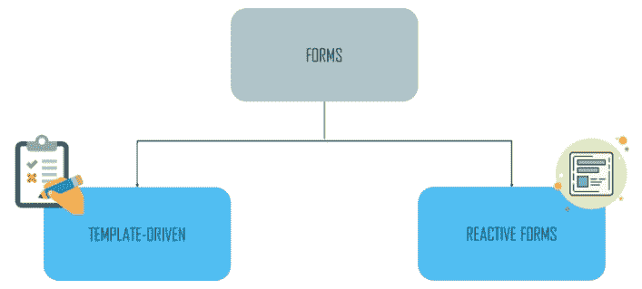**

让我们来看看它们之间的主要区别:

下表总结了反应式表单和模板驱动表单之间的主要区别。

| **键** | **无功** | **模板驱动** |
| 表单模型的设置 | 显式，在组件类中创建 | 隐式，由指令创建 |
| 数据模型 | 结构化且不可变 | 非结构化和易变的 |
| 数据流 | 同步 | 异步 |
| 表单验证 | 功能 | 指令 |

**模板驱动表单中的验证**

Angular 内置了验证器来验证典型用例。要使用内置验证器，您需要为每个需要验证的表单域添加验证属性。

这些验证属性与 HTML5 所需的、minlength、maxlength 和其他验证属性相同。Angular 提供了将这些属性与 Angular 框架中描述的验证器函数相匹配的指令。

Angular 通过执行验证，每当*form control*的值发生变化时，就会生成一个验证错误列表。如果列表为空，则状态为有效；否则，状态无效。

我们必须为每个 *表单控件* 添加适当的验证属性，并将*ng model*导出到我们要应用验证的每个表单控件的本地模板变量

下面的例子将 ngModel 导出到一个名为 name: 的变量

```
<span style="font-weight: 400;"><</span><span style="font-weight: 400;">input</span> <span style="font-weight: 400;">type</span><span style="font-weight: 400;"> =</span><span style="font-weight: 400;">&rdquo;text&rdquo;</span> <span style="font-weight: 400;">class</span><span style="font-weight: 400;"> =</span><span style="font-weight: 400;">&rdquo;form-control&rdquo;</span> <span style="font-weight: 400;">id</span><span style="font-weight: 400;">=</span><span style="font-weight: 400;">&rdquo;name&rdquo;</span>

<span style="font-weight: 400;">&nbsp;&nbsp;&nbsp;&nbsp;</span><span style="font-weight: 400;">Required</span> <span style="font-weight: 400;">maxlength</span><span style="font-weight: 400;">=</span><span style="font-weight: 400;">&rdquo;15&rdquo;</span> <span style="font-weight: 400;">minlength</span><span style="font-weight: 400;">=</span><span style="font-weight: 400;">&rdquo;2&rdquo;</span>

<span style="font-weight: 400;">&nbsp;&nbsp;&nbsp;&nbsp;</span><span style="font-weight: 400;">ngModel</span> <span style="font-weight: 400;">name</span><span style="font-weight: 400;">=</span><span style="font-weight: 400;">&rdquo;name&rdquo;</span> <span style="font-weight: 400;">#name</span><span style="font-weight: 400;">=</span><span style="font-weight: 400;">&rdquo;ngModel&rdquo;</span><span style="font-weight: 400;">></span>

```

*   上例中使用了内置的验证器 required、minlength 和 maxlength。
*   <输入> 元素携带 HTML 验证属性: 必选 和 minlength 。

为了检查所使用的验证器的有效性状态，我们可以在模板中使用模板变量名:

```

<span style="font-weight: 400;"><</span><span style="font-weight: 400;">div</span> <span style="font-weight: 400;">*ngIf</span><span style="font-weight: 400;">=</span><span style="font-weight: 400;">"name.invalid && (name.dirty || name.touched)"</span>

<span style="font-weight: 400;">&nbsp;&nbsp;&nbsp;&nbsp;</span><span style="font-weight: 400;">class</span><span style="font-weight: 400;">=</span><span style="font-weight: 400;">"alert alert-danger"</span><span style="font-weight: 400;">></span>

<span style="font-weight: 400;">&nbsp;&nbsp;</span><span style="font-weight: 400;"><</span><span style="font-weight: 400;">div</span> <span style="font-weight: 400;">*ngIf</span><span style="font-weight: 400;">=</span><span style="font-weight: 400;">"name.errors.required"</span><span style="font-weight: 400;">></span>

<span style="font-weight: 400;">&nbsp;&nbsp;&nbsp;&nbsp;Name is required.</span>

<span style="font-weight: 400;">&nbsp;&nbsp;</span><span style="font-weight: 400;"></</span><span style="font-weight: 400;">div</span><span style="font-weight: 400;">></span>

<span style="font-weight: 400;">&nbsp;&nbsp;</span><span style="font-weight: 400;"><</span><span style="font-weight: 400;">div</span> <span style="font-weight: 400;">*ngIf</span><span style="font-weight: 400;">=</span><span style="font-weight: 400;">"name.errors.minlength"</span><span style="font-weight: 400;">></span>

<span style="font-weight: 400;">&nbsp;&nbsp;&nbsp;&nbsp;Name cannot be more than 15 characters long.</span>

<span style="font-weight: 400;">&nbsp;&nbsp;</span><span style="font-weight: 400;"></</span><span style="font-weight: 400;">div</span><span style="font-weight: 400;">></span>

<span style="font-weight: 400;">&nbsp;&nbsp;</span><span style="font-weight: 400;"><</span><span style="font-weight: 400;">div</span> <span style="font-weight: 400;">*ngIf</span><span style="font-weight: 400;">=</span><span style="font-weight: 400;">"name.errors.minlength"</span><span style="font-weight: 400;">></span>

<span style="font-weight: 400;">&nbsp;&nbsp;&nbsp;&nbsp;Name must be at least 2 characters long.</span>

<span style="font-weight: 400;">&nbsp;&nbsp;</span><span style="font-weight: 400;"></</span><span style="font-weight: 400;">div</span><span style="font-weight: 400;">></span>

<span style="font-weight: 400;"></</span><span style="font-weight: 400;">div</span><span style="font-weight: 400;">></span>

```

请注意该示例说明的以下特征:。

#name="ngModel" 导出 *ngModel* 成一个名为 名为 的局部变量。底层*form control*实例的许多特征都在*ng model*中得到反映，因此您可以在模板中使用它来检查控件状态，如有效和脏。

一个例子，一个简单的模板驱动的表单在应用验证时的样子。

**反应形式的验证**

成分类是反应形式的真理之源。您可以将验证器方法直接添加到组件类的表单控件模型中，而不是使用模板中的属性来添加验证器。当控件的值改变时，Angular 调用这些函数。

在反应式表单中有验证函数来执行验证

异步或同步验证器功能可用。

*   同步验证器:同步验证器是同步函数，它接受一个控件实例，并立即返回一列验证错误或 null。当你实例化一个*form control*时，你可以给这些 in 作为第二个参数。
*   异步验证器:异步方法接受一个控制对象并返回一个承诺或可观察值，在一段时间后发出一系列验证错误或 null。当实例化 FormControl 时，可以将这些作为第三个参数。

我们不把 *ngModel* 指令传递给反应式表单，我们也不使用 HTML5 验证属性。在组件中创建*form control*对象时指定验证器。

*form control*类有如下签名。

```

<span style="font-weight: 400;">&nbsp;&nbsp;class FormControl extends AbstractControl {</span>

<span style="font-weight: 400;">&nbsp;&nbsp;&nbsp;&nbsp;&nbsp;&nbsp;&nbsp;&nbsp;constructor(formState: any = null, validatorOrOpts?: ValidatorFn | AbstractControlOptions |&nbsp;</span>

<span style="font-weight: 400;">&nbsp;&nbsp;&nbsp;&nbsp;&nbsp;&nbsp;&nbsp;&nbsp;ValidatorFn[], asyncValidator?: AsyncValidatorFn | AsyncValidatorFn[])</span>

<span style="font-weight: 400;">&nbsp;&nbsp;&nbsp;&nbsp;}</span>

```

我们可以向 FormControl 提供正确的验证器来启用内置的验证器功能。我们在下面的例子中使用了以下内置验证器:required、minLength 和 maxLength–

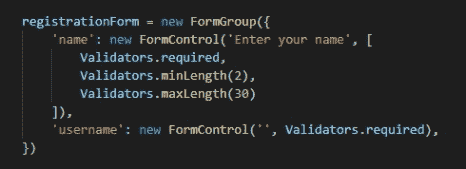

另外，与模板驱动的表单不同，我们不使用验证属性。*validators . required*，*validators . minlength(2)*，以及其他*ValidatorFn*都使用。当您在代码编辑器中输入后跟点号的验证器时，它可能会自动完成每个 *验证器 Fn* 。

一个例子，当验证被应用时，一个简单的反应形式是什么样子。

## 角度形式教程|如何建立角度 8 反应形式|角度训练| Edureka

      本 Edureka Angular 8 教程将帮助您全面学习 Angular 8，并逐步演示如何从头开始创建 Angular 项目。

[https://www.youtube.com/embed/F45ZW1oDLy4](https://www.youtube.com/embed/F45ZW1oDLy4)

在本节中，我们将模板驱动和反应式表单视为管理用户输入的两种不同方法。在这两种表单中，我们学习了如何添加验证。最后，我们创建了自己的验证器函数，并将它与内置的验证器放在一起。

正如我们所看到的，Angular 提供了优秀的表单支持以及一些基本的表单验证工具。本教程并未涵盖角形中所有可用的特征。

**角度资源**

EDUREKA 认证培训:[https://www.edureka.co/angular-training](https://www.edureka.co/angular-training)

*   用于开发
    *   IDE 的
    *   meta magic 基于 Amexio Canvas Web 的拖放 IDE
    *   Amexio Canvas 是一个拖放环境，用于创建完全响应的 Web 和智能设备 HTML5/Angular 应用程序。代码将由 Canvas 自动生成并热部署，以便进行实时测试。开箱 50+材质设计主题支持。将您的代码提交给 GitHub 公共或私有存储库。
    *   Visual Studio 代码
    *   VS Code 是一个免费的轻量级工具，用于编辑和调试 Web 应用程序。
    *   你也可以在他们的官方网站上找到更多。

*   为书籍
    *   角度路由器
    *   这本书是其设计者写的关于角路由器的综合指南。这本书深入探讨了这个库，包括心智模型、设计约束、API 的微妙之处。
*   带角展开
    *   使用 Angular framework、ES6、TypeScript、webpack 和 Angular CLI 的实践之旅。
*   学习角度-第三版
    *   使用 Angular 和 TypeScript 构建 web 应用程序的入门指南
*   带角展开
    *   使用 Angular framework、ES6、TypeScript、webpack 和 Angular CLI 的实践之旅。
    *   ng-book
    *   关于 Angular 的深入、完整和最新的书。今天就成为角度专家。
*   对于社区

下面是关于角度教程的视频，供初学者理解概念:

## 5 个小时的 Angular 完整课程|初学者 Angular 教程| Edureka

[https://www.youtube.com/embed/xGpHfFf18Ns](https://www.youtube.com/embed/xGpHfFf18Ns)

### 模块加载器

angular module ( NgModule)是一个容器，其中包含了一组链接的组件、服务、指令和管道，它们一起工作以形成一个应用程序。模块可以被认为是在应用程序中实现特定业务功能的包。

angular 应用包含一个根模块，即“应用模块”，它连接所有其他模块，称为“功能模块”

在较大的应用程序中，通常的做法是将功能分成独立的模块，这允许三种不同的加载方法，如预加载、急切加载和延迟加载。

*   **急切加载:** 急切加载一个特性模块，使用@NgModule decorator 的 imports 元数据将其导入到应用模块中。在微小的应用程序中，急切加载是有益的。所有功能模块将在程序启动前加载，并立即加载。因此，该方案将更快地响应下列请求。
*   **预加载:** 要预加载一个功能模块，使用 loadChildren 属性加载它，使用 RouterModule.forRoot 的 preloadingStrategy 属性定制它。该功能模块不能包含在应用程序模块中。当 preloadingStrategy 属性设置为 Angular PreloadAllModules 时，所有配置了 loadChildren 的功能模块都将被预加载。我们需要实现定制预加载技术来预加载特定的模块。只有那些在节目开始后将被用户立即观看的特征才应该被预加载；其余的功能模块可以在以后加载。因此，我们将能够提高大型应用程序的性能。
*   **惰性加载:** 我们必须使用路由配置中的 loadChildren 属性来缓慢加载一个特性模块，并且该特性模块不得导入到应用模块中。当应用程序变大时，延迟加载就派上了用场。惰性加载允许功能模块仅在需要时才被加载，使得程序启动更快。

## **处理错误**

通过使用 Angular 的 *HttpClient* 和来自 RxJS 的 catchError，我们可以很容易地编写一个函数来处理每个服务中的错误。此外， *HttpClient* 可以处理 JSON 响应并返回一个 JavaScript 对象。有两种类型的错误必须以不同的方式处理:

*   客户端:前端代码错误和网络问题这些错误由 *HttpClient* 作为 *ErrorEvent* 对象返回。
*   服务器端:AJAX 问题、用户错误、后端代码错误、数据库问题和文件系统故障都是可能发生的错误的例子。这些错误由 *HttpClient* 作为 HTTP 错误响应返回。
*   我们可以通过检查一个错误是否是 ErrorEvent 的一个实例来确定我们有什么类型的错误以及如何解决它。
*   对于单个服务来说，这是一个不错的解决方案，但是一个真正的程序包含多个服务，每个服务都可能抛出一个错误。
*   不幸的是，这种方法需要跨所有服务复制 handleError 函数，这是一种主要的角度开发反模式。如果我们处理错误的方式需要改变，那么我们必须跨每个服务更新每个 handleError 函数。这是无效的，很容易导致其他错误的传播。我们需要一种简化的方法来处理整个程序中的错误。幸运的是，Angular 的 *HttpInterceptor* 让这成为可能。

```

<span style="font-weight: 400;">import</span><span style="font-weight: 400;"> { </span><span style="font-weight: 400;">Injectable</span><span style="font-weight: 400;"> } </span><span style="font-weight: 400;">from</span> <span style="font-weight: 400;">'@angular/core'</span><span style="font-weight: 400;">;</span>

<span style="font-weight: 400;">import</span><span style="font-weight: 400;"> { </span><span style="font-weight: 400;">HttpClient</span><span style="font-weight: 400;">, </span><span style="font-weight: 400;">HttpHeaders</span><span style="font-weight: 400;"> } </span><span style="font-weight: 400;">from</span> <span style="font-weight: 400;">'@angular/common/http'</span><span style="font-weight: 400;">;</span>

<span style="font-weight: 400;">import</span><span style="font-weight: 400;"> { </span><span style="font-weight: 400;">Observable</span><span style="font-weight: 400;">, </span><span style="font-weight: 400;">throwError</span><span style="font-weight: 400;"> } </span><span style="font-weight: 400;">from</span> <span style="font-weight: 400;">'rxjs'</span><span style="font-weight: 400;">;</span>

<span style="font-weight: 400;">import</span><span style="font-weight: 400;"> { </span><span style="font-weight: 400;">retry</span><span style="font-weight: 400;">, </span><span style="font-weight: 400;">catchError</span><span style="font-weight: 400;"> } </span><span style="font-weight: 400;">from</span> <span style="font-weight: 400;">'rxjs/operators'</span><span style="font-weight: 400;">;</span>

<span style="font-weight: 400;">import</span><span style="font-weight: 400;"> { </span><span style="font-weight: 400;">User</span><span style="font-weight: 400;"> } </span><span style="font-weight: 400;">from</span> <span style="font-weight: 400;">'./user.model'</span><span style="font-weight: 400;">;</span>

<span style="font-weight: 400;">@</span><span style="font-weight: 400;">Injectable</span><span style="font-weight: 400;">({</span>

<span style="font-weight: 400;">&nbsp;</span><span style="font-weight: 400;">providedIn:</span> <span style="font-weight: 400;">'root'</span>

<span style="font-weight: 400;">})</span>

<span style="font-weight: 400;">export</span> <span style="font-weight: 400;">class</span> <span style="font-weight: 400;">UserService</span><span style="font-weight: 400;"> {</span>

<span style="font-weight: 400;">private</span> <span style="font-weight: 400;">apiUrl</span><span style="font-weight: 400;"> = </span><span style="font-weight: 400;">'https://localhost:8080/api/users'</span><span style="font-weight: 400;">;</span>

<span style="font-weight: 400;">constructor</span><span style="font-weight: 400;">(</span><span style="font-weight: 400;">private</span> <span style="font-weight: 400;">http</span><span style="font-weight: 400;">: </span><span style="font-weight: 400;">HttpClient</span><span style="font-weight: 400;">) {}</span>

<span style="font-weight: 400;">getUsers</span><span style="font-weight: 400;">(): </span><span style="font-weight: 400;">Observable</span><span style="font-weight: 400;"><</span><span style="font-weight: 400;">User</span><span style="font-weight: 400;">[]> {</span>

<span style="font-weight: 400;">return</span> <span style="font-weight: 400;">this</span><span style="font-weight: 400;">.</span><span style="font-weight: 400;">http</span><span style="font-weight: 400;">.</span><span style="font-weight: 400;">get</span><span style="font-weight: 400;"><</span><span style="font-weight: 400;">User</span><span style="font-weight: 400;">[]>(</span><span style="font-weight: 400;">this</span><span style="font-weight: 400;">.</span><span style="font-weight: 400;">apiUrl</span><span style="font-weight: 400;">).</span><span style="font-weight: 400;">pipe</span><span style="font-weight: 400;">(</span>

<span style="font-weight: 400;">retry</span><span style="font-weight: 400;">(</span><span style="font-weight: 400;">1</span><span style="font-weight: 400;">),</span>

<span style="font-weight: 400;">catchError</span><span style="font-weight: 400;">(</span><span style="font-weight: 400;">this</span><span style="font-weight: 400;">.</span><span style="font-weight: 400;">handleError</span><span style="font-weight: 400;">)</span>

<span style="font-weight: 400;">&nbsp;);</span>

<span style="font-weight: 400;">}</span>

<span style="font-weight: 400;">handleError</span><span style="font-weight: 400;">(</span><span style="font-weight: 400;">error</span><span style="font-weight: 400;">) {</span>

<span style="font-weight: 400;">let</span> <span style="font-weight: 400;">errorMessage</span><span style="font-weight: 400;"> = </span><span style="font-weight: 400;">''</span><span style="font-weight: 400;">;</span>

<span style="font-weight: 400;">if</span><span style="font-weight: 400;"> (</span><span style="font-weight: 400;">error</span><span style="font-weight: 400;">.</span><span style="font-weight: 400;">error</span> <span style="font-weight: 400;">instanceof</span> <span style="font-weight: 400;">ErrorEvent</span><span style="font-weight: 400;">) {</span>

<span style="font-weight: 400;">// client-side error</span>

<span style="font-weight: 400;">errorMessage</span><span style="font-weight: 400;"> = </span><span style="font-weight: 400;">Error</span><span style="font-weight: 400;">: </span><span style="font-weight: 400;">$</span><span style="font-weight: 400;">{</span><span style="font-weight: 400;">error</span><span style="font-weight: 400;">.</span><span style="font-weight: 400;">error</span><span style="font-weight: 400;">.</span><span style="font-weight: 400;">message</span><span style="font-weight: 400;">};</span>

<span style="font-weight: 400;">} </span><span style="font-weight: 400;">else</span><span style="font-weight: 400;"> {</span>

<span style="font-weight: 400;">// server-side error</span>

<span style="font-weight: 400;">errorMessage</span><span style="font-weight: 400;"> = </span><span style="font-weight: 400;">Error</span> <span style="font-weight: 400;">Code</span><span style="font-weight: 400;">: </span><span style="font-weight: 400;">$</span><span style="font-weight: 400;">{</span><span style="font-weight: 400;">error</span><span style="font-weight: 400;">.</span><span style="font-weight: 400;">status</span><span style="font-weight: 400;">}</span><span style="font-weight: 400;">nMessage</span><span style="font-weight: 400;">: </span><span style="font-weight: 400;">$</span><span style="font-weight: 400;">{</span><span style="font-weight: 400;">error</span><span style="font-weight: 400;">.</span><span style="font-weight: 400;">message</span><span style="font-weight: 400;">};</span>

<span style="font-weight: 400;">}</span>

<span style="font-weight: 400;">window</span><span style="font-weight: 400;">.</span><span style="font-weight: 400;">alert</span><span style="font-weight: 400;">(</span><span style="font-weight: 400;">errorMessage</span><span style="font-weight: 400;">);</span>

<span style="font-weight: 400;">return</span> <span style="font-weight: 400;">throwError</span><span style="font-weight: 400;">(</span><span style="font-weight: 400;">errorMessage</span><span style="font-weight: 400;">);</span>

<span style="font-weight: 400;">}</span>

<span style="font-weight: 400;">}</span>

```

## **指令**

角度模板是*动态*。当 Angular 渲染它们时，它根据**指令**给出的指令转换 DOM。 指令是带有@Directive decorator 的类。一个组件是一个带有模板的指令。@Component decorator 实际上是一个用面向模板的特性扩展的@Directive decorator。

虽然**一个组件在技术上是一个指令**，但是组件对于角度应用是如此独特和重要，以至于本架构概述将组件与指令分开。

两种*其他*种类的指令存在: ***结构*** 和 ***属性*** 指令。

指令倾向于像属性一样出现在元素标签中，有时是通过名称，但更多时候是作为赋值或绑定的目标。

**结构化**指令通过添加、删除和替换 DOM 中的元素来改变布局。

这个示例模板使用了两个内置的结构指令:

```

<li *ngFor="let course of coursess"></li>

<course-detail *ngIf="selectedCourse"></course-detail>

```

*   *ngFor 告诉 Angular 在课程中每门课程取一个<李>
*   仅当所选课程存在时，ngIf 才包括 CourseDetail 组件。

**属性**指令改变现有元素的外观或行为。在模板中，它们看起来像普通的 HTML 属性。 实现双向数据绑定的 ngModel 指令是属性指令的一个例子。ngModel 通过设置现有元素的 display value 属性并响应 change 事件来修改现有元素的行为。

```
        <input [(ngModel)]="courses.name" placeholder="name"/>

```

Angular has a few more directives that either alter the layout structure (for example, ngSwitch) or modify aspects of DOM elements and components (for example, ngStyle and ngClass).

您也可以编写自己的指令，即*自定义指令*。

## 服务和依赖注入

### 服务

由于服务的存在，我们可以编写可重用的代码，并在任何需要的组件中使用它。使用依赖注入框架，服务可以被注入到其他组件和服务中。提供者的信息用于声明模块中的依赖关系。Angular 生成一个类似注入器和提供器的组件树。等级模式就是你要找的。

### 什么是角服务？

服务是一段具有特定用途的可重用代码。你会在你程序的很多不同部分用到这个代码。我们的组件需要数据访问。您可以将数据访问代码放在每个组件中，但是这很浪费，并且违反了单一责任原则。组件的焦点应该是向用户显示数据。

### 角服务是用来做什么的？

1.  例如，日志服务是不依赖于其他组件的功能。
2.  组件之间可以共享逻辑或数据。
3.  外部交互，比如数据访问，应该被封装。

### 如何打造有角度的服务？

Javascript 函数就是 Angular 服务的全部。我们现在要做的就是构造一个类并用方法和属性填充它。然后，我们可以通过在组件中创建该类的实例来调用该类的方法。

从数据源获取数据是服务的最佳用途之一。让我们构建一个检索产品信息并将其发送给组件的基本服务。

ng 生成服务服务名

导入 { 注射 } 从' @ angular/core '；

```

<span style="font-weight: 400;">@</span><span style="font-weight: 400;">Injectable</span><span style="font-weight: 400;">({</span>

<span style="font-weight: 400;">&nbsp;&nbsp;</span><span style="font-weight: 400;">providedIn:</span> <span style="font-weight: 400;">'root'</span><span style="font-weight: 400;">,</span>

<span style="font-weight: 400;">})</span>

<span style="font-weight: 400;">export</span> <span style="font-weight: 400;">class</span> <span style="font-weight: 400;">ServiceName</span><span style="font-weight: 400;"> {</span>

<span style="font-weight: 400;">&nbsp;&nbsp;</span><span style="font-weight: 400;">constructor</span><span style="font-weight: 400;">() { }</span>

<span style="font-weight: 400;">}</span>

```

### 依赖注入

角度依赖注入现在是框架不可分割的一部分。它让我们能够将依赖注入到组件、指令、管道和服务中。通过本教程中的一个例子，我们将了解什么是角度依赖注入，以及如何将依赖注入到组件、指令、管道或服务中。

依赖项是类执行其功能所需的服务或对象。依赖注入(或称 DI)是一种设计模式，在这种模式中，类从外部源请求依赖，而不是创建它们。@ injective()decorator 指定 Angular 可以在 DI 系统中使用这个类。在“root”中为其提供了元数据。

## **服务**

*服务*是一个宽泛的范畴，包含您的应用程序所需的任何价值、功能或特性。服务通常是一个定义明确的类。一个 任何东西都可以是服务。 例子包括:

*   日志服务
*   数据服务
*   消息总线
*   税收计算器
*   应用程序配置

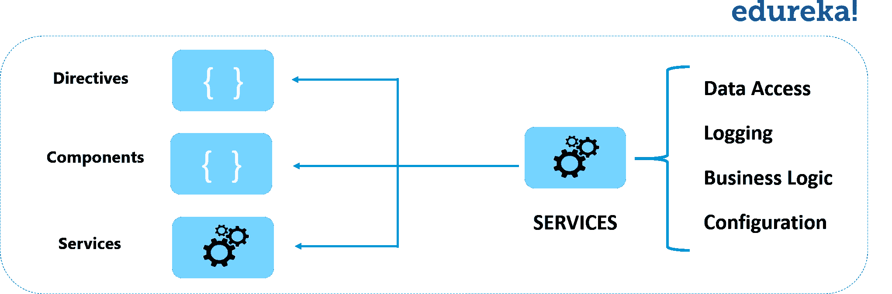

**图:** *棱角分明 8 教程-服务*

Angular 没有服务的定义。没有服务基类，也没有注册服务的地方。 然而服务是任何角度应用的基础。组件是服务的消费者。

这里有一个服务类的例子:

```
import { Injectable } from '@angular/core';
import {Course} from './courses';
import { Observable, of } from 'rxjs';
import {COURSES} from './mock-course';
import { MessageService } from './messages.service';

@Injectable({
  providedIn: 'root'
})
export class CoursesService {

  constructor(private messageService: MessageService) { }

  getCourses(): Observable<Course[]> {
    // TODO: send the message _after_ fetching the heroes
    this.messageService.add('CourseService: fetched courses');
    return of(COURSES);
  }

  getCourse(id: number): Observable<Course>
  {
    this.messageService.add(`CoursesService: fetched courses id=${id}`);
    return of (COURSES.find(courses => courses.id === id));
  }

}

```

服务无处不在。 组件类不从服务器获取数据，不验证用户输入，也不直接记录到控制台。他们将此类任务委托给服务。

组件的工作是实现用户体验，仅此而已。它在视图(由模板呈现)和应用程序逻辑之间起中介作用。一个好的组件提供了数据绑定的属性和方法。 Angular 确实帮助你*遵循*这些原则，通过*依赖注入*使你的应用程序逻辑容易地被分解成服务，并使那些服务对组件可用。

那么，现在让我们在这篇 Angular 8 教程博客中了解一下依赖注入。

## **依赖注入**

*依赖注入*是一种为一个类的新实例提供它所需要的完全依赖的方法。大多数依赖项都是服务。Angular 使用依赖注入为新组件提供它们需要的服务。 Angular 可以通过查看组件的构造函数参数的类型来判断组件需要哪些服务。

下面是详细解释 Angular 8 依赖注入的视频:

## Angular 8 依赖注入|理解 DI 设计模式

      本 Edureka Angular 8 教程将帮助您全面学习 Angular 8，并逐步演示如何从头开始创建 Angular 项目。

[https://www.youtube.com/embed/yojGPF2ZnAk](https://www.youtube.com/embed/yojGPF2ZnAk)

依赖项是类执行其功能所需的服务或对象。依赖注入(或称 DI)是一种设计模式，在这种模式下，类从外部源请求依赖，而不是创建它们。

@ injective()decorator 指定 Angular 可以在 DI 系统中使用这个类。在“root”中为其提供了元数据。

当 Angular 创建一个组件时，它首先向一个**注入器**请求组件所需的服务。

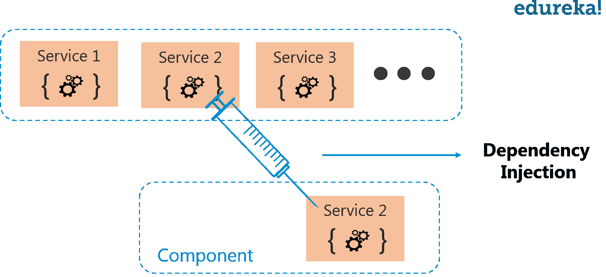

**图:** *棱角分明 8 教程——依赖注射*

注入器维护一个它先前创建的服务实例的容器。如果所请求的服务实例不在容器中，那么在将服务返回给 Angular 之前，注入器会创建一个实例并将其添加到容器中。当所有请求的服务都被解析并返回后，Angular 可以调用组件的构造函数，并将这些服务作为参数。这是一个依赖注入。

在下面的例子中，你可以看到，我们正在向注入器注册一个 Firebase 服务的**提供者**。提供者可以创建或返回服务，通常是服务类本身。 你可以在模块或者组件中注册提供者。

一般来说，将提供者添加到根模块中，这样服务的相同实例在任何地方都是可用的，如下面的代码所示。

```
import { BrowserModule } from '@angular/platform-browser';
import { NgModule } from '@angular/core';
import { FormsModule } from '@angular/forms'; // <-- NgModel lives here

import { AppRoutingModule } from './app-routing.module';
import { AppComponent } from './app.component';
import { CourseComponent } from './course/course.component';
import { CourseDetailComponent } from './course-detail/course-detail.component';
import { MessagesComponent } from './messages/messages.component';
import { DashboardComponent } from './dashboard/dashboard.component';
import {NgbModule} from '@ng-bootstrap/ng-bootstrap';
import { FooterComponent } from './footer/footer.component';

@NgModule({
  declarations: [
    AppComponent,
    CourseComponent,
    CourseDetailComponent,
    MessagesComponent,
    DashboardComponent,
    FooterComponent
  ],
  imports: [
    BrowserModule,
    FormsModule,
    AppRoutingModule,
    NgbModule,
  ],
  providers: [],
  bootstrap: [AppComponent]
})
export class AppModule { }

```

或者，您可以在@Component decorator 的 providers 属性中注册一个组件级别的服务:

```
import { Component } from '@angular/core';
import { FirebaseService } from './services/firebase.service';

@Component({
selector:'app-root',
templateUrl:'./app.component.html',
styleUrls: ['./app.component.css'],
providers: [FirebaseService]
})
export class AppComponent {
title = 'app works!';
}
```

(**注:**完整代码，参考上面指定的视频)

在一个组件级别注册意味着你得到一个新的服务实例，每个新的组件实例。

总结依赖注入，你可以说:

*   依赖注入被连接到 Angular 框架中，并在任何地方使用。
*   *喷油器*是主要机构。
    *   注入器维护它创建的服务实例的*容器*。
    *   注入器可以从*提供者*那里创建一个新的服务实例。
*   一个*提供者*是创建服务的秘诀。
*   用注射器注册*供应商*。

这就把我们带到了 Angular 8 教程博客的结尾。我希望这篇博客能给你带来信息和附加值。现在，您必须清楚 Angular 的构建模块，并准备好创建 Angular 应用程序。我会推荐你通过这个 ***Angular 8 教程 [Edureka 视频播放列表](https://www.youtube.com/playlist?list=PL9ooVrP1hQOFyAdwmvyPgFlbiBKiDoTa_)*** 观看视频，学习如何创建 Angular 应用。

*既然你已经知道 Angular 的构建模块，那就来看看 Edureka 的 [**Angular 8 培训**](https://www.edureka.co/angular-training) ，edu reka 是一家值得信赖的在线学习公司，拥有遍布全球的 250，000 多名满意的学习者。Angular 是一个 JavaScript 框架，用于创建可伸缩的、企业级的、高性能的客户端 web 应用程序。随着 Angular 框架的广泛采用，应用程序的性能管理是由社区驱动的，间接推动了更好的工作机会。Angular 认证培训旨在涵盖所有这些围绕企业应用程序开发的新概念。*