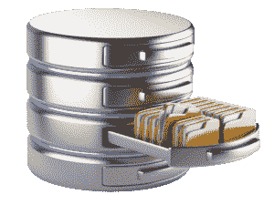
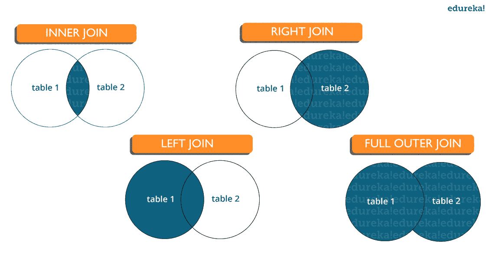
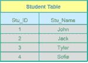

# 2023 年你必须准备的 115 个 SQL 面试问题

> 原文：<https://www.edureka.co/blog/interview-questions/sql-interview-questions>

RDBMS 是迄今为止最常用的数据库之一，因此 [***SQL 技能***](https://www.edureka.co/sql-essentials-training) 在大多数工作角色中都是不可或缺的。在这篇 SQL 面试问题文章中，我将向您介绍关于 SQL(结构化查询语言)的最常见问题。这篇文章是您学习与 SQL、Oracle、MS SQL Server 和 MySQL 数据库相关的所有概念的完美指南。 我们的 65 大 SQL 面试问题文章是*一站式资源*，从这里你可以提高你的面试准备。

Want to Upskill yourself to get ahead in your career? Check out the ***[Top Trending Technologies](https://www.edureka.co/blog/top-10-trending-technologies/)**.*

我们开始吧！

## **SQL 面试题**

1.  [SQL 和 MySQL 有什么区别？](#sqlvsmysql)
2.  SQL 有哪些不同的子集？
3.  你说的数据库管理系统是什么意思？它有哪些不同的类型？
4.  [SQL 中的表和字段是什么意思？](#tablefieldinsql)
5.  [什么是 SQL 中的连接？](#joinsinsql)
6.  [SQL 中 CHAR 和 VARCHAR2 数据类型有什么区别？](#charvsvarchar)
7.  [什么是主键？](#primarykey)
8.  什么是约束？
9.  [DELETE 和 TRUNCATE 语句有什么区别？](#deletevstruncate)
10.  什么是唯一键？

### **Q1。SQL 和 MySQL 有什么区别？**

 <caption>**SQL vs MySQL**</caption> 
| **SQL** | **MySQL** |
| SQL 是一种标准语言，代表基于英语 的结构化查询语言 | MySQL 是一个数据库管理系统。 |
| SQL 是关系数据库的核心，用于访问和管理数据库 | MySQL 是一个 RDMS(关系数据库管理系统),如 SQL Server、Informix 等。 |

### **Q2。SQL 有哪些不同的子集？【T2**

*   数据定义语言(DDL)——它允许您在数据库上执行各种操作，例如创建、更改和删除对象。
*   数据操作语言(DML)——它允许你访问和操作数据。它帮助你插入，更新，删除和检索数据库中的数据。
*   数据控制语言(DCL)——它允许你控制对数据库的访问。示例–授予、撤销访问权限。

### **Q3。DBMS 是什么意思？它有哪些不同的类型？**

[**数据库管理系统** ](https://www.edureka.co/blog/dbms-tutorial/) ( **DBMS** )是一个软件应用程序，它与用户、应用程序和数据库本身进行交互，以捕获和分析数据。数据库是数据的结构化集合。

数据库管理系统允许用户与数据库进行交互。 存储在数据库中的数据可以修改、检索和删除，可以是字符串、数字、图像等任何类型。

有两种类型的数据库管理系统:

*   *关系数据库管理系统*:数据存储在关系(表)中。例如，MySQL。
*   *非关系型数据库管理系统*:没有关系、元组、属性的概念。示例–MongoDB

让我们转到这个 SQL 面试问题中的下一个问题。

### **Q4。什么是 RDBMS？和 DBMS 有什么不同？**

关系数据库管理系统(RDBMS)是一组应用程序和功能，允许 IT 专业人员和其他人开发、编辑、管理关系数据库并与之交互。大多数商业关系数据库管理系统使用结构化查询语言(SQL)来访问数据库，数据库以表的形式存储。RDBMS 是全世界商业中使用最广泛的数据库系统。它提供了存储和检索大量数据的稳定方法。

一般来说，数据库保存着可以在其他应用程序中访问和使用的数据集合。数据库平台的开发、管理和使用都是由数据库管理系统支持的。

关系数据库管理系统(RDBMS)是一种数据库管理系统(DBMS ),它将数据存储在链接相关数据组件的基于行的表结构中。RDBMS 包含确保数据的安全性、准确性、完整性和一致性的功能。这与数据库管理系统使用的文件存储不同。

以下是数据库管理系统和关系数据库管理系统之间的一些进一步的区别:

**允许使用系统的用户数量**DBMS 一次只能处理一个用户，而 RDBMS 可以处理大量用户。 **软硬件规格** 与 RDBMS 相比，DBMS 需要的软硬件更少。 **信息量**RDBMSes 可以处理任何数量的数据，从微小到巨大，而 DBMS 只能处理少量数据。 **数据库的结构** 数据以分层格式存储在 DBMS 中，而 RDBMS 则使用一个带有标题的表，标题作为列名，行保存相关的值。**ACID 原则的实现**DBMS 不使用原子性、一致性、隔离性和持久性(ACID)概念进行数据存储。另一方面，RDBMSes 使用 ACID 模型来组织数据并确保一致性。 **分布式数据库**DBMS 不会提供对分布式数据库的完全支持，而 RDBMS 会。 **被管理的程序**DBMS 专注于保存计算机网络和系统硬盘中的数据库，而 RDBMS 则帮助管理其合并的数据表之间的关系。 **支持数据库规范化**RDBMS 可以规范化，DBMS 不能规范化。

### **Q5。什么是自加入？**

自联接是一种可用于连接两个表的联接。因此，这是一元关系。在自联接中，表中的每一行都连接到自身以及同一表中的所有其他行。因此，自联接主要用于组合和比较来自同一个数据库表的行。

### **Q6。SELECT 语句是什么？**

SELECT 命令从一个或多个数据库表或视图中获取零行或多行。在大多数应用程序中，选择最常用的数据操作语言(DML)命令。SELECT 查询定义了一个结果集，但没有定义如何计算它，因为 SQL 是一种声明式编程语言。

### **Q7。SQL 中的 SELECT 查询有哪些常用子句？**

以下是一些与选择查询结合使用的常见 SQL 子句:

**WHERE** 子句:在 SQL 中，WHERE 子句用于根据一定的条件过滤需要的记录。 **ORDER BY** 子句:SQL 中的 ORDER BY 子句用于根据指定的字段(DESC)按升序(ASC)或降序(DESC)对数据进行排序。 **GROUP BY** 子句:SQL 中的 GROUP BY 子句用于对具有相同数据的条目进行分组，并且可以与聚合方法一起使用，以获得汇总的数据库结果。 **在 SQL 中有**子句，结合 GROUP BY 子句用于过滤记录。它不同于 WHERE，因为 WHERE 子句不能筛选聚合记录。

### **Q8。什么是并集、减集和交集命令？**

UNION 运算符用于合并两个表的结果，同时也删除重复的条目。减号运算符用于返回第一个查询中的行，而不是第二个查询中的行。INTERSECT 操作符用于将两个查询的结果组合成一行。在运行上述 SQL 语句之前，必须满足某些要求—在子句中，每个选择查询必须有相同数量的列。列中的数据类型也必须具有可比性。在每个 SELECT 语句中，列的顺序必须相同。

### **Q9。什么是光标？如何使用光标？**

在任何变量声明之后，声明一个游标。SELECT 语句必须始终与游标定义结合使用。

要启动结果集，将光标移动到它上面。在从结果集中获取行之前，必须执行 OPEN 语句。

要检索并转到结果集中的下一行，使用 FETCH 命令。

要禁用光标，使用关闭命令。

最后，使用 DEALLOCATE 命令删除游标定义并释放与之连接的资源。

### **Q10。列出 SQL 中不同类型的关系。**

**数据库中有不同类型的关系:**

**一对一**–这是两个表之间的连接，其中一个表中的每个记录对应于另一个表中一个记录的最大值。

**一对多和多对一**–这是最频繁的连接，其中一个表中的记录链接到另一个表中的几个记录。

**多对多**–当定义一个每一方都需要几个实例的关系时使用。

**自引用关系**–当一个表必须声明与自身的连接时，这是要使用的方法。

### **Q12。什么是 OLTP？**

OLTP，即在线事务处理，允许大量的人实时执行大量的数据库事务，通常是通过互联网。当数据库中的数据被更改、插入、删除或查询时，就会发生数据库事务。

### **Q13。OLTP 和 OLAP 有什么区别？**

OLTP 代表联机事务处理，而 OLAP 代表联机分析处理。OLTP 是一个在线数据库修改系统，而 OLAP 是一个在线数据库查询响应系统。

### **Q14。如何创建与另一个表结构相同的空表？**

创建空表:使用 INTO 操作符将一个表的记录提取到一个新表中，同时将所有条目的 WHERE 子句设置为 false，可以创建具有相同结构的空表。因此，SQL 创建一个具有重复结构的新表来接受提取的条目，但是由于 WHERE 子句是活动的，所以没有任何内容存储到新表中。

### **Q15。PostgreSQL 是什么？**

1986 年，由计算机科学教授迈克尔·斯通布雷克领导的一个小组创建了 PostgreSQL，命名为 Postgres。它通过确保系统中的数据完整性和容错性来帮助开发人员开发企业级应用程序。PostgreSQL 是一个企业级、多功能、弹性、开源、对象关系数据库管理系统，支持可变工作负载和并发用户。国际开发者社区一直支持它。PostgreSQL 因其容错特性而在开发人员中获得了巨大的吸引力。这是一个非常可靠的数据库管理系统，二十多年的社区工作为其高水平的弹性、完整性和准确性做出了贡献。许多在线、移动、地理空间和分析应用程序利用 PostgreSQL 作为其主要数据存储或数据仓库。

### **Q16。什么是 SQL 注释？**

SQL 注释用于阐明 SQL 语句的各个部分，并防止 SQL 语句被执行。注释在许多编程语言中非常重要。Microsoft Access 数据库不支持这些注释。因此，在 Mozilla Firefox 和 Microsoft Edge 的示例中使用了 Microsoft Access 数据库。单行注释:它以两个连续的连字符(–)开始。多行注释:以/*开头，以*/结尾。

### **Q17。NVL()函数的用法是什么？**

您可以使用 NVL 函数将空值替换为默认值。如果第一个参数为空，函数将返回第二个参数的值。如果第一个参数不是 null，就不处理它。

这个函数用在 Oracle 中，不在 SQL 和 MySQL 中。不是 NVL()函数，MySQL 有 IFNULL()函数，SQL Server 有 ISNULL()函数。

让我们转到这个 SQL 面试问题中的下一个问题。

### **Q18。解释字符操作函数？解释它在 SQL 中的不同类型。**

使用字符操作例程更改、提取和编辑字符串。该函数将对输入字符串执行操作，并在输入一个或多个字符和单词时返回结果。

SQL 中的字符操作函数如下:

A) CONCAT(连接两个或多个值):这个函数用于将两个或多个值连接在一起。第二个字符串总是追加到第一个字符串的末尾。

B) SUBSTR:这个函数返回从给定起点到给定终点的一段字符串。

C) LENGTH:这个函数以数字形式返回字符串的长度，包括空格。

D) INSTR:这个函数计算字符串中一个字符或单词的精确数字位置。

E) LPAD:对于右对齐的值，它返回左侧字符值的填充。

F) RPAD:对于左对齐的值，它返回右侧字符值的填充。

G) TRIM:该函数从一个字符串的开头、结尾或两端删除所有已定义的字符。它还减少了浪费的空间。

H) REPLACE:这个函数用指定的另一个字符串值替换一个单词或一个字符串(子字符串)的所有实例。

### **Q19。编写 SQL 查询，从名为 employees 的表中获取雇员的第三大工资。**

员工表

| 员工姓名 | 工资 |
| 答 | 24000 |
| C | 34000 |
| D | 55000 |
| E | 75000 |
| F | 21000 |
| G | 40000 |
| H | 50000 |

SELECT * FROM(

SELECT 雇员 _ 姓名，薪金，密集 _ 等级()

超过(按员工的薪金 DESC 排序)r)

其中 r =&n；

找出第三高的薪资集 n = 3

### **Q20。RANK()和 DENSE_RANK()函数有什么区别？**

结果集中的 RANK()函数定义了有序分区中每一行的等级。如果两行具有相同的排名，排名中的下一个数字将是前一个排名加上重复的数字。例如，如果我们有三个等级为 4 的记录，则指示的下一个等级是 7。

DENSE_RANK()函数根据提供的列值为分区中的每一行分配一个不同的等级，没有间隔。它总是表示按优先顺序排列。如果两行具有相同的等级，此函数会将相同的等级分配给这两行，下一个等级是下一个连续的数字。例如，如果我们有三个等级为 4 的记录，则指示的下一个等级是 5。

**Q21。什么是表和字段？**

表是在关系数据库中以行和列组织的数据组件的集合。表格也可以被认为是关系的有用表示。最基本的数据存储形式是表。下面是一个雇员表的例子。

| ID | 名称 | 部门 | 工资 |
| 1 | 拉胡尔 | 销售额 | 24000 |
| 2 | 罗希尼 | 营销 | 34000 |
| 3 | Shylesh | 销售额 | 24000 |
| 4 | 大麦 | 分析 | 30000 |

记录或行是表格中的一个条目。在表中，一条记录代表一组连接的数据。例如，Employee 表有四条记录。

一个表格由许多记录(行)组成，每一行又可以被分割成更小的单元，称为字段(列)。ID、姓名、部门和薪水是上面的雇员表中的四个字段。

### **Q22。什么是唯一约束？**

UNIQUE 约束防止同一列中的相同值出现在两个记录中。UNIQUE 约束保证列中的每个值都是唯一的。

### **Q23。什么是自加入？**

自联接是一种可用于连接两个表的联接。因此，这是一元关系。在自联接中，表中的每一行都连接到自身以及同一表中的所有其他行。因此，自联接主要用于组合和比较来自同一个数据库表的行。

### **Q24。SELECT 语句是什么？**

SELECT 命令从一个或多个数据库表或视图中获取零行或多行。在大多数应用程序中，选择最常用的数据操作语言(DML)命令。SELECT 查询定义了一个结果集，但没有定义如何计算它，因为 SQL 是一种声明式编程语言。

### **Q25。SQL 中的 SELECT 查询有哪些常用子句？**

以下是一些与选择查询结合使用的常见 SQL 子句:

WHERE 子句:在 SQL 中，WHERE 子句用于根据特定标准过滤所需的记录。 ORDER BY 子句:SQL 中的 ORDER BY 子句用于根据指定的字段(DESC)按升序(ASC)或降序(DESC)对数据进行排序。 GROUP BY 子句:SQL 中的 GROUP BY 子句用于对具有相同数据的条目进行分组，并且可以与聚合方法一起使用，以获得汇总的数据库结果。SQL 中的 HAVING 子句用于结合 GROUP BY 子句过滤记录。它不同于 WHERE，因为 WHERE 子句不能筛选聚合记录。

### **Q26。什么是并集、减集和交集命令？**

**UNION 运算符用于合并两个表的结果，同时删除重复的条目。**

减号运算符用于返回第一个查询中的行，而不是第二个查询中的行。

INTERSECT 运算符用于将两个查询的结果合并成一行。 在运行上述任一 SQL 语句之前，必须满足某些要求—

在子句中，每个选择查询必须有相同数量的列。

列中的数据类型也必须是可比较的。

在每个 SELECT 语句中，列的顺序必须相同。

让我们转到这个 SQL 面试问题中的下一个问题。

### **Q27。什么是光标？如何使用光标？**

在任何变量声明之后，声明一个游标。SELECT 语句必须始终与游标定义结合使用。

要启动结果集，将光标移动到它上面。在从结果集中获取行之前，必须执行 OPEN 语句。

要检索并转到结果集中的下一行，使用 FETCH 命令。

要禁用光标，使用关闭命令。

最后，使用 DEALLOCATE 命令删除游标定义并释放与之连接的资源。

### **Q28。列出 SQL 中不同类型的关系。**

数据库中有不同类型的关系:一对一——这是两个表之间的连接，其中一个表中的每个记录对应于另一个表中一个记录的最大值。一对多和多对一——这是最常见的连接，其中一个表中的记录链接到另一个表中的几个记录。多对多——这在定义一个每一方都需要几个实例的关系时使用。自引用关系——当一个表必须声明与自身的连接时，这是要采用的方法。

### **Q29。什么是 SQL 示例？**

SQL 是一种数据库查询语言，允许您编辑、删除和请求数据库中的数据。以下语句是 SQL 语句的几个例子:

*   选择
*   插入
*   更新
*   删除
*   创建数据库
*   改变数据库

### **Q30。什么是 SQL 基本技能？**

SQL 技能帮助数据分析师从关系数据库中创建、维护和检索数据，关系数据库将数据分为列和行。它还使用户能够有效地检索、更新、操作、插入和更改数据。

SQL 专家应该具备的最基本的能力是:

1.  数据库管理
2.  构建数据库
3.  创建 SQL 子句和语句
4.  MYSQL、PostgreSQL 等 SQL 系统技能
5.  PHP 专业知识很有用。
6.  分析 SQL 数据
7.  使用 WAMP 和 SQL 创建数据库
8.  OLAP 技能

### **Q31。SQL Server 中的架构是什么？** 模式是数据库逻辑的可视化表示。它建立并指定数据库众多实体之间的关系。它指的是可以应用于数据库的几种约束。它还描述了各种数据类型。它也可以用于表和视图。模式有多种形状和大小。星型模式和雪花模式是最流行的两种模式。星型架构中的实体以星型形式表示，而雪花型架构中的实体以雪花形状显示。 任何数据库架构都是建立在模式的基础上的。

### **Q32。如何在 SQL Server 中创建临时表？**

临时表在 TempDB 中创建，并在最后一个连接关闭后自动删除。我们可以使用临时表来存储和处理临时结果。当我们需要存储临时数据时，临时表就派上了用场。 下面是创建临时表的语法:创建表#Employee (id INT，name VARCHAR(25))插入#Employee 值(01，' Ashish ')，(02，' Atul')

让我们进入 SQL 面试问题中的下一个问题。

**Q33。如何在 Windows 11 中安装 SQL Server？**

在 Windows 11 中安装 SQL Server Management Studio

**第一步:**点击 SSMS，这将带你到 SQL Server Management Studio 页面。

**第二步:**此外，点击 SQL Server Management Studio 链接并点击保存文件。

**第三步:**把这个文件保存到你的本地驱动器，转到文件夹。

**第四步:**设置窗口会出现，在这里你可以选择你想要保存文件的位置。 **第五步:**点击安装。 **第六步:**安装完成后关闭窗口。 **第七步:**此外，返回开始菜单，搜索 SQL server management studio。

**第八步:**再者，双击它，一出现就出现登录页面。

**第九步:**你应该可以看到你的服务器名了。但是，如果看不到，请单击服务器上的下拉箭头，然后点击浏览。

**第十步:**选择您的 SQL server 并点击 Connect。

之后 SQL 服务器连接，Windows 11 运行良好。

### **Q34。在 SQL Server 中是什么情况？**

CASE 语句用于构建逻辑，其中一列的值由其他列的值决定。

至少有一组 WHEN 和 THEN 命令组成了 SQL Server CASE 语句。要测试的条件由 WHEN 语句指定。如果 WHEN 条件返回 TRUE，那么 THEN 语句解释该做什么。

当 When 条件都不为真时，执行 ELSE 语句。END 关键字结束 CASE 语句。

```
CASE
WHEN condition1 THEN result1
WHEN condition2 THEN result2
WHEN conditionN THEN resultN
ELSE result
END;

```

**Q35。NoSQL vs SQL**

总之，以下是 SQL 和 NoSQL 之间的五个主要区别:

关系数据库是 SQL，非关系数据库是 NoSQL。

SQL 数据库具有特定的模式，并采用结构化查询语言。对于非结构化数据，NoSQL 数据库使用动态模式。

SQL 数据库是纵向扩展的，但是 NoSQL 数据库是横向扩展的。

NoSQL 数据库是文档、键值、图形或宽列存储，而 SQL 数据库是基于表的。

SQL 数据库擅长多行事务，而 NoSQL 擅长文档和 JSON 等非结构化数据。

**Q36。NOW()和 CURRENT_DATE()有什么区别？** NOW()返回一个常量时间，表示语句开始执行的时间。(在存储函数或触发器中，NOW()返回函数或触发语句开始执行的时间。NOW()和 CURRENT_DATE()的简单区别在于，NOW()会以“YYYY-MM_DD HH:MM:SS”格式获取当前日期和时间，而 CURRENT_DATE()会获取当天的日期“YYYY-MM_DD”。

让我们转到这个 SQL 面试问题中的下一个问题。

**Q37。MySQL 中的 BLOB 和 TEXT 是什么？**

BLOB 代表二进制大对象，可以用来存储二进制数据，而 TEXT 可能用来存储大量字符串。BLOB 可用于存储二进制数据，包括图像、电影、音频和应用程序。 BLOB 值的功能类似于字节字符串，它们缺少字符集。因此，字节的数值完全依赖于比较和排序。 文本值的行为类似于字符串或非二进制字符串。文本的比较/排序完全依赖于字符集。

**Q38。如何删除 SQL 中的重复行？**

如果 SQL 表有重复行，则必须删除重复行。

让我们假设下表是我们的数据集:

| ID | 名称 | 年龄 |
| 1 | 答 | 21 |
| 2 | B | 23 |
| 2 | B | 23 |
| 4 | D | 22 |
| 5 | E | 25 |
| 6 | G | 26 |
| 5 | E | 25 |

下面的 SQL 查询从表中删除重复的 ID:从表中删除 ID IN(SELECTID，COUNT(ID)从表中删除GROUP BY ID

**Q39。如何使用 SQL Server 创建存储过程？**

存储过程是一段准备好的 SQL 代码，您可以保存它并反复使用。 所以，如果你有一个经常创建的 SQL 查询，把它保存为存储过程，然后调用它来运行它。 您还可以向存储过程提供参数，以便它可以根据给定的参数值进行操作。

存储过程语法

创建程序程序名

为

SQL _ 语句

去；

执行存储过程

EXEC 过程 _ 名称；

**Q40。什么是数据库黑盒测试？**

黑盒测试是一种软件测试方法，涉及在不知道内部代码结构、实现细节或内部路径的情况下测试软件应用程序的功能。黑盒测试是一种软件测试，它关注软件应用程序的输入和输出，完全由软件需求和规范驱动。行为测试是它的另一个名字。**Q41。有哪些不同类型的 SQL 沙箱？**

SQL 沙箱是 SQL Server 中的一个安全环境，不受信任的程序可以在其中运行。有三种不同类型的 SQL 沙箱:

安全访问沙箱:在这种环境中，用户可以执行 SQL 活动，如构建存储过程、触发器等，但他们不能访问内存或创建文件。

用于外部访问的沙盒:用户可以访问文件，但不能改变内存分配。

不安全的访问沙箱:它包含不可信的代码，允许用户访问内存。

让我们转到这个 SQL 面试问题中的下一个问题。

**Q42。MyISAM 表存储在哪里？**

在 2009 年 12 月推出 MySQL 5.5 之前，MyISAM 是 MySQL 关系数据库管理系统版本的默认存储引擎。它是基于旧的 ISAM 代码，但它有很多额外的功能。每个 MyISAM 表在磁盘上分成三个文件(如果没有分区)。文件名以表名开头，以表示文件类型的扩展名结尾。表定义存储在. frm 文件中，但是该文件不是 MyISAM 引擎的一部分。相反，它是服务器的一部分。数据文件的后缀是。MYD (MYData)。索引文件的扩展名是。MYI(我的指数)。如果您丢失了索引文件，您可以通过重新创建索引来恢复它。**Q43。SQL 中第 n 高工资怎么找？** 最典型的面试问题就是在一个表格中找出第 n 个最高薪酬。这项工作可以使用 dense rank()函数来完成。 员工表

| 员工姓名 | 工资 |
| 答 | 24000 |
| C | 34000 |
| D | 55000 |
| E | 75000 |
| F | 21000 |
| G | 40000 |
| H | 50000 |

SELECT * FROM(

SELECT 雇员 _ 姓名，薪金，密集 _ 等级()

超过(按员工的薪金 DESC 排序)r)

其中 r =&n；

查找到第二高的薪资集 n = 2

找出第三个最高薪资集 n = 3，依此类推。

### **Q44。SQL 中的表和字段是什么意思？【T2**

表格是指以行和列的形式有组织地收集数据。字段是指表中的列数。比如:

***表格*** :学生信息 ***字段*** :学生 Id、学生名称、学生标志

### **Q45。什么是 SQL 中的连接？【T2**

JOIN 子句用于根据两个或多个表之间的相关列来组合它们中的行。它用于合并两个表或从中检索数据。有 4 种类型的连接，您可以参考下面的:

****

*   **内部连接:**[SQL 中的内部连接](https://www.edureka.co/blog/sql-joins-types)是最常见的连接类型。它用于返回满足连接条件的多个表中的所有行。

*   **左连接:**SQL 中的左连接用于返回左表中的所有行，但只返回右表中满足连接条件的匹配行。

*   **右连接:**SQL 中的右连接用于返回右表中的所有行，但只返回左表中满足连接条件的匹配行。

*   **完全连接:**当任何一个表中有匹配项时，完全连接返回所有记录。因此，它返回左侧表中的所有行和右侧表中的所有行。

让我们转到这个 SQL 面试问题中的下一个问题。

### **Q46。****SQL 中 CHAR 和 VARCHAR2 数据类型有什么区别？**

char 和 Varchar2 都用于字符数据类型，但 varchar2 用于可变长度的字符串，而 Char 用于固定长度的字符串。例如，char(10)只能存储 10 个字符，并且不能存储任何其他长度的字符串，而 varchar2(10)可以在此变量中存储任何长度，即 6，8，2。

### **Q47。什么是主键？**

*   SQL 中的 [主键是唯一标识表中每一行的一列(或列的集合)或一组列。](https://www.edureka.co/blog/primary-key-in-sql/)
*   唯一标识表格中的单个行
*   不允许空值

示例——在学生表中，Stu_ID 是主键。

### **Q48。** **什么是约束？**

[SQL 中的约束](https://www.edureka.co/blog/sql-constraints/)用于指定对表的数据类型的限制。它可以在创建或修改 table 语句时指定。约束的例子有:

*   不为空
*   检查
*   默认
*   独特的
*   主键
*   外键

### **Q49。DELETE 和 TRUNCATE 语句有什么区别？**

 <caption>**删除 vs 截断**</caption> 
| **删除** | **截断** |
| 删除命令用来删除表格中的一行。 | Truncate 用于删除表格中的所有行。 |
| 使用 delete 语句后，可以回滚数据。 | 您不能回滚数据。 |
| 这是一个 DML 命令。 | 这是一个 DDL 命令。 |
| 它比 truncate 语句慢。 | 它更快。 |

### **Q50。什么是唯一键？**

*   唯一标识表格中的单个行。
*   每个表允许多个值。
*   允许空值。

除了这个 SQL 面试问题博客，如果你想接受专业人士的技术培训，你可以选择 edureka 的[结构化培训！](https://www.edureka.co/sql-essentials-training)

### **Q51。什么是 SQL 中的外键？**

*   外键通过在两个表中的数据之间建立链接来维护参照完整性。
*   子表中的外键引用父表中的主键。
*   [外键约束](https://www.edureka.co/blog/foreign-key-sql/)防止破坏子表和父表之间链接的行为。

### **Q52。你说的数据完整性是什么意思？**

数据完整性定义了存储在数据库中的数据的准确性和一致性。它还定义了完整性约束，以便在数据进入应用程序或数据库时对数据实施业务规则。

### **Q53。SQL 中聚集索引和非聚集索引有什么区别？**

SQL 中聚集索引和非聚集索引的区别是:

1.  聚集索引用于方便地从数据库中检索数据，其速度较快，而从非聚集索引中读取相对较慢。
2.  聚集索引改变了记录在数据库中的存储方式，因为它按设置为聚集索引的列对行进行排序，而在非聚集索引中，它不改变记录的存储方式，而是在表中创建一个单独的对象，该对象在搜索后指向原始表行。
3.  一个表只能有一个聚集索引，而它可以有多个非聚集索引。

### **Q54。编写一个 SQL 查询来显示当前日期？**

在 SQL 中，有一个名为 **GetDate()** 的内置函数，它有助于返回当前时间戳/日期。

### **Q55。** **你所理解的查询优化是什么？**

确定具有最低估计成本的评估查询计划的阶段称为查询优化。

查询优化的优势如下:

*   更快地提供输出
*   可以在更短的时间内执行更多的查询
*   降低时间和空间复杂性

### **Q56。你说的反规范化是什么意思？**

反规范化指的是一种用于从数据库的较高形式到较低形式访问数据的技术。它帮助数据库管理员提高整个基础设施的性能，因为它在表中引入了冗余。它通过合并数据库查询将不同表中的数据合并到一个表中，从而将冗余数据添加到一个表中。

### **Q57。什么是实体和关系？**

**实体**:现实世界中的一个人、一个地方或一件事物，其数据可以存储在数据库中。表存储代表一种实体类型的数据。例如，银行数据库有一个客户表来存储客户信息。customer 表将这些信息存储为每个客户的一组属性(表中的列)。

**关系**:相互有关系的实体之间的关系或联系。例如，客户名称与客户帐号和联系信息相关，它们可能在同一个表中。不同的表之间也可以有关系(例如，客户到帐户)。

让我们转到这个 SQL 面试问题中的下一个问题。

### **Q58。什么是指数？**

索引指的是一种性能调整方法，允许更快地从表中检索记录。索引为每个值创建一个条目，因此检索数据会更快。

### **Q59**。解释 SQL 中不同类型的索引。

SQL 中有三种[类型的索引，即:](https://www.edureka.co/blog/index-in-sql/)

### **唯一指数:**

如果列是唯一索引的，此索引不允许字段有重复值。如果定义了主键，可以自动应用唯一索引。

### **聚集索引:**

该索引对表的物理顺序进行重新排序，并基于键值进行搜索。每个表只能有一个聚集索引。

#### **非聚集索引:**

非聚集索引不会改变表的物理顺序，而是保持数据的逻辑顺序。每个表可以有许多非聚集索引。

### **Q60。什么是正常化，它的优点是什么？**

[SQL](https://www.edureka.co/blog/normalization-in-sql/)中的规范化是组织数据以避免重复和冗余的过程。一些优势是:

*   更好的数据库组织
*   更多行更小的表格
*   高效的数据访问
*   更大的查询灵活性
*   快速查找信息
*   更容易实现安全性
*   允许轻松修改
*   减少冗余和重复数据
*   更紧凑的数据库
*   确保修改后数据一致

除了这个 SQL 面试问题博客，如果你想接受专业人士的技术培训，你可以选择 edureka 的[结构化培训！](https://www.edureka.co/sql-essentials-training)

### **Q61。DROP 和 TRUNCATE 命令有什么区别？**

[DROP 命令](https://www.edureka.co/blog/sql-commands)删除一个表，并且不能从数据库回滚，而 TRUNCATE 命令删除表中的所有行。

### **Q62。解释不同类型的规范化。**

标准化有许多连续的层次。这些被称为**范式**。每个连续的范式都依赖于前一个范式。前三种范式通常就足够了。

在数据库表中使用范式来消除或减少重复。以下是许多形式:

**第一范式:** 当一个关系中的每个属性都是单值属性时，称之为第一范式。当关系具有复合或多值属性时，第一范式被打破。

**第二范式:**

如果一个关系满足第一范式的要求并且不包含任何部分依赖，那么它就是第二范式。在 2NF 中，关系没有部分依赖，这意味着它没有依赖于任何表候选键的任何合适子集的非素属性。通常，这个问题可以通过设置一个单列主键来解决。

**第三范式:** 如果一个关系满足第二范式的要求，并且没有传递依赖，则称其处于第三范式。

**Q63。什么是 OLTP？**

OLTP，即在线事务处理，允许大量的人实时执行大量的数据库事务，通常是通过互联网。当数据库中的数据被更改、插入、删除或查询时，就会发生数据库事务。

OLTP 和 OLAP 有什么区别？

OLTP 代表联机事务处理，而 OLAP 代表联机分析处理。OLTP 是一个在线数据库修改系统，而 OLAP 是一个在线数据库查询响应系统。

**Q64。如何创建与另一个表结构相同的空表？**

**创建空表:**

使用 INTO 操作符将一个表的记录提取到一个新表中，同时将所有条目的 WHERE 子句设置为 false，可以创建具有相同结构的空表。因此，SQL 创建一个具有重复结构的新表来接受提取的条目，但是由于 WHERE 子句是活动的，所以没有任何内容存储到新表中。

**Q65。PostgreSQL 是什么？**

1986 年，由计算机科学教授迈克尔·斯通布雷克领导的一个小组创建了 PostgreSQL，命名为 Postgres。它通过确保系统中的数据完整性和容错性来帮助开发人员开发企业级应用程序。PostgreSQL 是一个企业级、多功能、弹性、开源、对象关系数据库管理系统，支持可变工作负载和并发用户。国际开发者社区一直支持它。PostgreSQL 因其容错特性而在开发人员中获得了巨大的吸引力。这是一个非常可靠的数据库管理系统，二十多年的社区工作使其具有高度的弹性、完整性和准确性。许多在线、移动、地理空间和分析应用程序利用 PostgreSQL 作为其主要数据存储或数据仓库。

**Q66。什么是 SQL 注释？**

SQL 注释用于阐明 SQL 语句的各个部分，并防止 SQL 语句被执行。注释在许多编程语言中非常重要。Microsoft Access 数据库不支持这些注释。因此，在 Mozilla Firefox 和 Microsoft Edge 的示例中使用了 Microsoft Access 数据库。单行注释:它以两个连续的连字符(–)开始。多行注释:以/*开头，以*/结尾。

让我们转到这个 SQL 面试问题中的下一个问题。

**Q67。RANK()和 DENSE_RANK()函数有什么区别？**

结果集中的 RANK()函数定义了有序分区中每一行的等级。如果两行具有相同的排名，排名中的下一个数字将是前一个排名加上重复的数字。例如，如果我们有三个等级为 4 的记录，则指示的下一个等级是 7。

DENSE_RANK()函数根据提供的列值为分区中的每一行分配一个不同的等级，没有间隔。它总是表示按优先顺序排列。如果两行具有相同的等级，此函数会将相同的等级分配给这两行，下一个等级是下一个连续的数字。例如，如果我们有三个等级为 4 的记录，则指示的下一个等级是 5。

**Q68。什么是 SQL 注入？**

SQL 注入是网站和 web 应用程序代码中的一种缺陷，允许攻击者控制后端进程，并访问、检索和删除存储在数据库中的敏感数据。在这种方法中，恶意的 SQL 语句被输入到数据库输入字段中，一旦它们被执行，数据库就会暴露给攻击者。通过利用数据驱动的应用程序，这种策略被广泛用于访问敏感数据和在数据库上执行管理任务。SQLi 攻击是它的另一个名称。

以下是 SQL 注入的一些例子:

*   访问机密数据，以便更改 SQL 查询来获得所需的结果。
*   联合攻击旨在从几个数据库表中窃取数据。
*   检查数据库以获取有关数据库版本和结构的信息

**Q69。SQL 中有多少聚合函数可用？**

SQL 聚合函数提供关于数据库数据的信息。例如，AVG 返回数据库列值的平均值。

SQL 提供了七(7)个聚合函数，如下所示:

AVG():返回指定列的平均值。 COUNT():返回表格行数，包括空值行。MAX():返回组中的最大值。 MIN():返回组中的最小值。 SUM():返回指定列的合计值(非空)。 FIRST():返回表达式的第一个值。 LAST():返回表达式的最后一个值。

**Q70。使用 ORDER BY 子句时，数据的默认排序是什么？怎么能改变呢？**

MySQL 中的 ORDER BY 子句可以在没有 ASC 或 DESC 修饰符的情况下使用。当 ORDER BY 子句中缺少此属性时，排序顺序预设为 ASC 或升序。

**Q71。我们如何使用 DISTINCT 语句？它有什么用？**

SQL DISTINCT 关键字与 SELECT 查询结合使用，以删除所有重复的记录，并只返回唯一的记录。有时一个表可能有几个重复的记录。SQL 中的 DISTINCT 子句用于从 SELECT 语句的结果集中消除重复项。

**Q72。COALESCE 函数的语法和用法是什么？**

从一系列表达式中，COALESCE 函数返回第一个非空值。表达式按照提供的顺序进行计算，函数的结果是第一个非空值。只有当所有输入都为 null 时，COALESCE 方法才返回 NULL。

COALESCE 函数的语法是 COALESCE (exp1，exp2，…expn)

### **Q73。数据库中的 ACID 属性是什么？**

酸代表原子性、一致性、隔离性、持久性。它用于确保在数据库系统中可靠地处理数据事务。

*   **原子性:**原子性是指完全完成或失败的事务，其中事务是指数据的单个逻辑操作。这意味着，如果任何事务的一部分失败，整个事务都会失败，并且数据库状态保持不变。
*   **一致性:**一致性保证数据必须符合所有的验证规则。简而言之，您可以说您的事务在没有完成其状态之前不会离开数据库。
*   **隔离:**隔离的主要目标是并发控制。
*   持久性是指如果一个事务已经被提交，它将会发生任何可能发生的事情，比如断电、崩溃或任何种类的错误。

Want to upskill yourself to get ahead in your career? Check out this video in this SQL Interview Questions

## **2023 年要学的十大技术| Edureka**

𝐓𝐨𝐩𝟏𝟎𝐓𝐞𝐜𝐡𝐧𝐨𝐥𝐨𝐠𝐢𝐞𝐬𝐭𝐨𝐋𝐞𝐚𝐫𝐧𝐢𝐧𝟐𝟎𝟐上的这个 Edureka 视频 **3** 将为你介绍 2023 年市场上所有你应该重点关注的热门和潮流技术。为了在 2023 年有一个成功的职业生涯，你需要学习这些趋势技术。

[https://www.youtube.com/embed/M2NyXKxyUGc](https://www.youtube.com/embed/M2NyXKxyUGc)

### **Q74。SQL 中的“触发器”是什么意思？**

SQL 中的 [触发器是一种特殊类型的存储过程，被定义为就地或在数据修改后自动执行。它允许您在对特定表执行插入、更新或任何其他查询时执行一批代码。](https://www.edureka.co/blog/triggers-in-sql/)

### **Q75。SQL 中有哪些不同的运算符？**

SQL 中有三个[运算符，分别是:](https://www.edureka.co/blog/sql-operators/)

1.  算术运算符
2.  逻辑运算符
3.  比较运算符

除了这个 SQL 面试问题博客，如果你想接受专业人士在这方面的培训，你可以选择 edureka 的结构化培训！

### **Q76。空值等于零还是一个空格？**

空值与零或空格完全不同。空值表示不可用、未知、已分配或不适用的值，而零是数字，空格是字符。

### **Q77。交叉连接和自然连接有什么区别？**

交叉连接产生两个表的叉积或笛卡儿积，而自然连接基于两个表中具有相同名称和数据类型的所有列。

### **Q78。SQL 中的子查询是什么？**

子查询是另一个查询中的一个查询，该查询被定义为从数据库中检索数据或信息。在子查询中，外部查询称为主查询，而内部查询称为子查询。子查询总是首先执行，子查询的结果传递给主查询。它可以嵌套在 SELECT、UPDATE 或任何其他查询中。子查询还可以使用任何比较运算符，如>、<或=。

### **Q79。子查询有哪些不同的类型？**

有两种子查询，即相关子查询和非相关子查询。

**相关子查询**:这些查询从外部查询中引用的表中选择数据。它不被视为独立查询，因为它引用另一个表并引用表中的列。

**非相关子查询**:该查询是一个独立查询，子查询的输出被主查询替代。

让我们转到这个 SQL 面试问题中的下一个问题。

### **Q80。列出获取表中记录数的方法？**

要在 SQL 中统计[表中的记录数，可以使用下面的命令:](https://www.edureka.co/blog/create-table-in-sql/)

```
SELECT * FROM table1

SELECT COUNT(*) FROM table1

SELECT rows FROM sysindexes WHERE id = OBJECT_ID(table1) AND indid < 2 
```

除了这个 SQL 面试问题博客，如果你想接受专业人士的技术培训，你可以选择 edureka 的[结构化培训！](https://www.edureka.co/sql-essentials-training)

### **Q81。编写一个 SQL 查询来查找以“A”开头的雇员姓名？**

要显示以“A”开头的员工姓名，请键入以下命令:

```
SELECT * FROM Table_name WHERE EmpName like 'A%'

```

### **Q82。写一个 SQL 查询从 employee_table 中获取一个员工的第三高工资？**

```
SELECT TOP 1 salary
FROM(
SELECT TOP 3 salary
FROM employee_table
ORDER BY salary DESC) AS emp
ORDER BY salary ASC;

```

### **Q83。SQL 中需要什么组函数？**

组函数作用于行集，并为每组返回一个结果。一些常用的组函数有:AVG，计数，最大值，最小值，总和，方差。

### **Q84。什么是关系，它们是什么？**

关系或链接是指彼此有关系的实体之间的关系。关系被定义为数据库中表之间的连接。有各种关系，即:

*   一对一的关系。
*   一对多关系。
*   多对一的关系。
*   自指关系。

### **Q85。在插入数据时，如何在列中插入空值？**

SQL 中的空值可以通过以下方式插入:

*   通过从列列表中省略列来隐含。
*   通过在 VALUES 子句中指定 NULL 关键字来显式

### **Q86。“between”和“in”条件运算符的主要区别是什么？**

BETWEEN 运算符用于根据行中的值范围显示行，而 in 条件运算符用于检查特定值集中包含的值。

### **间的例子:**

```
SELECT * FROM Students where ROLL_NO BETWEEN 10 AND 50;
```

**Example of IN:**

```
SELECT * FROM students where ROLL_NO IN (8,15,25);
```

### **Q87。为什么使用 SQL 函数？**

[SQL 函数](https://www.edureka.co/blog/sql-functions)用于以下目的:

*   对数据进行一些计算
*   修改单个数据项
*   操纵输出
*   格式化日期和数字
*   转换数据类型

### **Q88。MERGE 语句的必要性是什么？**

该语句允许有条件地更新数据或向表中插入数据。如果存在行，则执行更新；如果不存在行，则执行插入。

### **Q89。** **递归存储过程是什么意思？**

递归存储过程是指一个存储过程自己调用，直到达到某个边界条件。这个递归函数或过程帮助程序员使用同一组代码 n 次。

### **Q90。SQL 中的子句是什么？**

SQL 子句通过向查询提供条件来帮助限制结果集。子句有助于从整组记录中筛选出行。

比如——WHERE，HAVING 子句。

除了这个 SQL 面试问题博客，如果你想从专业人士那里获得这方面的培训，你可以选择 edureka 的结构化培训！点击下方了解更多信息。

### **Q91。HAVING 从句和 WHERE 从句有什么区别？**

HAVING 子句只能与 SELECT 语句一起使用。它通常用在 GROUP BY 子句中，每当不使用 GROUP BY 时，HAVING 的行为类似于 WHERE 子句。 Having 子句仅在查询中与 GROUP BY 函数一起使用，而 WHERE 子句在每行成为 GROUP BY 函数的一部分之前应用于每行。

### **Q92。列出动态 SQL 的执行方式？**

以下是动态 SQL 的执行方式:

*   写一个带参数的查询。
*   使用 EXEC。
*   使用 sp_executesql。

### **Q93。各种级别的约束是什么？**

约束是强制数据实体和一致性的列的表示。一个约束有两个级别，即:

*   列级约束
*   表级约束

### **Q94。如何从两个表中获取公共记录？**

您可以使用 INTERSECT 从两个表中获取公共记录。比如:

从学生中选择 studentID。< strong >交集< /strong >从考试中选择学生 id

### **Q95。列举一些 SQL 中的 case 操作函数？**

SQL 中有三个案例操作函数，分别是:

*   LOWER:该函数 返回小写的字符串。它将一个字符串作为参数，并通过将其转换为小写来返回它。语法:

```
 LOWER(‘string’)
```

*   UPPER: 该函数返回大写的字符串。它将一个字符串作为参数，并通过将其转换为大写形式来返回它。语法:

```
UPPER(‘string’)
```

*   INITCAP: 该函数返回第一个字母大写，其余字母小写的字符串。语法:

```
 INITCAP(‘string’) 
```

除了这个 SQL 面试问题博客，如果你想从专业人士那里获得这方面的培训，你可以选择 edureka 的结构化培训！点击下方了解更多信息。

### **Q96。SQL 中有哪些不同的集合运算符？**

一些可用的集合运算符是——并集、交集或减运算符。

### **Q97。什么是别名命令？**

[SQL 中的别名命令](https://www.edureka.co/blog/sql-commands)是可以赋予任何表或列的名称。可以在 WHERE 子句中引用此别名来标识特定的表或列。

例如-

```
Select emp.empID, dept.Result from employee emp, department as dept where emp.empID=dept.empID
```

在上面的例子中，emp 表示雇员表的别名，dept 表示部门表的别名。

让我们转到这个 SQL 面试问题中的下一个问题。

### **Q98。什么是聚合函数和标量函数？**

聚合函数用于评估数学计算并返回单个值。这些计算是根据表中的列进行的。例如- max()，count()是相对于数值计算的。

标量函数根据输入值返回单个值。例如–UCASE()、NOW()是相对于 string 计算的。

让我们转到这个 SQL 面试问题中的下一个问题。

### **Q99。如何从表中获取备用记录？**

您可以获取交替记录，即奇数和偶数行号。 例如——要显示偶数，使用以下命令:

Select student id from(Select rowno，studentId from student)其中 mod(rowno，2)=0

现在，显示奇数:

```
Select studentId from (Select rowno, studentId from student) where mod(rowno,2)=1 
```

### **Q100。请说出模式匹配查询中使用的运算符。**

LIKE 运算符用于模式匹配，可以用作-。

1.  %–匹配零个或多个字符。

例如-select * from student name like ' a % '

_(下划线)–只匹配一个字符。 例如——select * from student where student name like ' ABC _ '

除了这个 SQL 面试问题博客，如果你想接受专业人士的技术培训，你可以选择 edureka 的[结构化培训！](https://www.edureka.co/sql-essentials-training)

### **Q101。如何从表中选择唯一的记录？**

您可以使用 DISTINCT 关键字从表中选择唯一的记录。

```
Select DISTINCT studentID from Student
```

使用这个命令，它将从学生表中打印出唯一的学生 id。

### **Q102。如何获取字符串的前 5 个字符？**

从字符串中获取字符有很多种方法。比如:

从学生中选择子串(学生名，1，5)作为学生名

### **Q103** 。**SQL 和 PL/SQL 的主要区别是什么？**

SQL 是一种查询语言，允许您发出一个查询或执行一个插入/更新/删除，而 PL/SQL 是 Oracle 的“过程语言”SQL，允许您编写一个完整的程序(循环、变量等)。)来完成多个操作，例如选择/插入/更新/删除。

### **Q104。什么是视图？**

视图是一个虚拟的表，由表中包含的数据子集组成。因为视图不存在，所以它占用较少的存储空间。视图可以组合一个或多个表的数据，这取决于关系。

让我们转到这个 SQL 面试问题中的下一个问题。

### **Q105。视图是用来做什么的？**

视图是指基于表或另一个视图的逻辑快照。使用它的原因如下:

*   限制对数据的访问。
*   使复杂的查询变得简单。
*   确保数据独立性。
*   提供相同数据的不同视图。

### **Q106。什么是存储过程？**

存储过程是由许多 SQL 语句组成的访问数据库系统的函数。几个 SQL 语句被整合到一个存储过程中，并在需要时随时随地执行它们，这样可以节省时间并避免重复编写代码。

### **Q107。列出存储过程的一些优点和缺点？**

### **优点** :

存储过程可用作模块化编程，这意味着创建一次，存储并在需要时调用多次。这支持更快的执行。它还减少了网络流量，并为数据提供了更好的安全性。

### **劣势** :

存储过程的唯一缺点是它只能在数据库中执行，并且会占用数据库服务器中更多的内存。

### **Q108。列出所有类型的用户自定义函数？**

有三种类型的用户自定义函数，即:

*   标量函数
*   内联表值函数
*   多语句值函数

标量返回单位，变量定义返回子句。其他两种类型的已定义函数返回表。

让我们转到这个 SQL 面试问题中的下一个问题。

### **Q109。你说的整理是什么意思？**

归类定义为一组确定数据如何排序和比较的规则。使用定义正确字符序列的规则以及指定区分大小写、字符宽度等选项对字符数据进行排序。

让我们转到这个 SQL 面试问题中的下一个问题。

### **Q110。有哪些不同类型的排序规则敏感性？**

以下是不同类型的校对敏感度:

*   区分大小写:A 和 A 以及 B 和 B。
*   假名区分:日语假名字符。
*   区分宽度:单字节字符和双字节字符。
*   口音敏感性。

除了这个 SQL 面试问题博客，如果你想接受专业人士的技术培训，你可以选择 edureka 的[结构化培训！](https://www.edureka.co/sql-essentials-training)

### **Q111。什么是局部变量和全局变量？**

### **局部变量:**

这些变量只能在函数内部使用或存在。这些变量不被任何其他函数使用或引用。

### **全局变量:**

这些变量是可以在整个程序中访问的变量。无论何时调用该函数，都不能创建全局变量。

### **Q112。什么是 SQL 中的自动增量？**

Autoincrement 关键字允许用户创建一个唯一的编号，以便每当有新记录插入表中时生成。 每当使用 SQL 中的主键时，通常需要这个关键字。

[自动递增关键字](https://www.edureka.co/blog/sql-auto-increment/)可用于 Oracle，身份关键字可用于 SQL SERVER。

### **Q113。什么是数据仓库？**

数据仓库指的是一个中央数据存储库，其中的数据是从多个信息源汇集而来的。这些数据经过整合、转换，可用于挖掘和在线处理。仓库数据还有一个称为数据集市的数据子集。

### **Q114。SQL Server 中有哪些不同的身份验证模式？怎么改？**

Windows 模式和混合模式–SQL 和 Windows。您可以转到以下步骤来更改 SQL Server 中的身份验证模式:

*   点击开始>程序>微软 SQL Server，点击 SQL 企业管理器，从微软 SQL Server 程序组运行 SQL 企业管理器。
*   然后从工具菜单中选择服务器。
*   选择 SQL Server 配置属性，并选择安全页面。

### **Q115。什么是填充和替换功能？**

**STUFF Function**: This function is used to overwrite existing character or inserts a string into another string. Syntax:

```
STUFF(string_expression,start, length, replacement_characters)
```

where, *string_expression*: it is the string that will have characters substituted*start:* This refers to the starting position *length*: It refers to the number of characters in the string which are substituted.*replacement_string*: They are the new characters which are injected in the string.**REPLACE function**: This function is used to replace the existing characters of all the occurrences. Syntax:

```
REPLACE (string_expression, search_string, replacement_string)
```

Here every search_string in the string_expression will be replaced with the replacement_string.

SQL 面试问题博客到此结束。我希望这一套 SQL 面试问题能帮助你在求职面试中胜出。**祝你面试顺利！**

除了这个 SQL 面试问题博客，如果你想接受专业人士关于 [SQL](http://www.mysql.com) 的培训，你可以选择 edureka 的结构化培训！点击下方了解更多信息。

*查看 Edureka 提供的 [MySQL DBA 认证培训](https://www.edureka.co/mysql-dba)，edu reka 是一家值得信赖的在线学习公司，其网络* o *f 超过 250，000 名满意的学习者遍布全球。* *本课程培训您掌握管理数据和 MySQL 数据库的核心概念&高级工具和技术。它包括对 MySQL 工作台、MySQL 服务器、数据建模、MySQL 连接器、数据库设计、MySQL 命令行、MySQL 函数等概念的实践学习。培训结束后，您将能够创建和管理自己的 MySQL 数据库并管理数据。*

*有问题吗？请在这个“* SQL 面试问题*”博客的评论区提出来，我们会尽快回复您。*