# 2023 年信息面试问题第二部分:基于场景的面试问题

> 原文：<https://www.edureka.co/blog/interview-questions/informatica-interview-questions/>

在之前的博客[2023 年](https://www.edureka.co/blog/interview-questions/top-informatica-interview-questions-2016/)你必须准备的顶级信息学面试问题中，我们讨论了信息学面试中经常被问到的所有重要问题。让我们更深入地了解信息面试问题，并理解在信息面试中有哪些典型的基于场景的问题。

在大数据时代，任何公司的成功都依赖于数据驱动的决策和业务流程。在这种情况下，数据集成对于任何企业的成功公式以及掌握端到端敏捷数据集成平台(如 Informatica Powercenter 9)都至关重要。x 一定会让你走上职业发展的快车道。现在是使用 Informatica PowerCenter Designer 开始从事 ETL 和数据挖掘工作的最佳时机。

浏览一下我们的 ***[信息论认证培训](https://www.edureka.co/informatica)*** 专家提供的 Edureka 视频，它将解释如何才能在信息论领域找到工作。

## **2023 年 Informatica 面试问答| edu reka**

[//www.youtube.com/embed/GYY7ns8oVhI?rel=0&showinfo=0](//www.youtube.com/embed/GYY7ns8oVhI?rel=0&showinfo=0)

如果你正在寻找信息技术方面的工作机会，那么看看这篇博客就可以为你的面试做准备了。这里有一个详尽的基于场景的信息面试问题列表，可以帮助你破解你的信息面试。然而，如果你已经参加了 Informatica 面试，或者有更多的问题，我们鼓励你在下面的评论栏中添加。

## **信息化面试试题(情景式):**

### **1。区分源限定符和过滤器转换？**

 <caption>#### **源限定符 vs 过滤转换**</caption> 
| **源限定词转换** | **滤镜变换** |
| 1。它在从源中读取数据时过滤行。 | 1。它从映射数据中过滤行。 |
| 2。只能从关系源中筛选行。 | 2。可以从任何类型的源系统中筛选行。 |
| 3。它限制了从源中提取的行集。 | 3。它限制发送到目标的行集。 |
| 4。它通过最小化映射中使用的行数来提高性能。 | 4。它被添加到靠近源的位置，以便尽早过滤掉不需要的数据，并最大限度地提高性能。 |
| 5。在这种情况下，过滤条件使用标准的 SQL 在数据库中执行。 | 5。它使用任何语句或转换函数来定义条件，以获得 TRUE 或 FALSE。 |

### **2。如何删除 Informatica 中的重复记录？有多少种方法可以做到？**

有几种方法可以删除重复项。

1.  如果源是 DBMS，您可以使用源限定符中的属性来选择不同的记录。 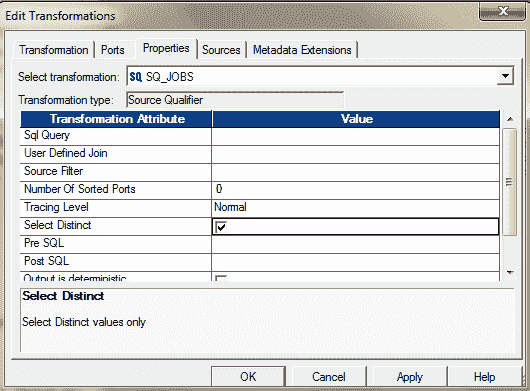 或者也可以使用 SQL 覆盖来执行同样的操作。 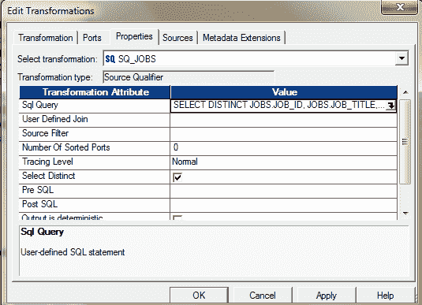
2.  您可以使用聚合器并选择所有端口作为键来获得不同的值。将所有需要的端口传递给聚合器后，选择所有需要选择进行重复数据消除的端口。如果您想要基于整个列查找重复项，请选择所有端口作为 group by key。 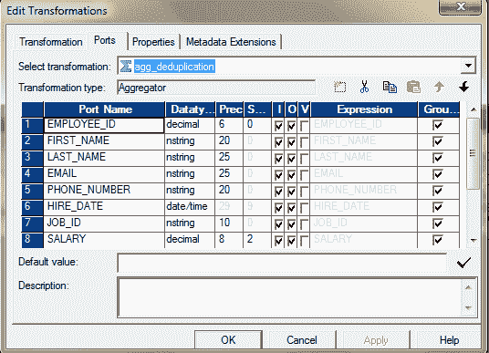 映射会是这个样子。 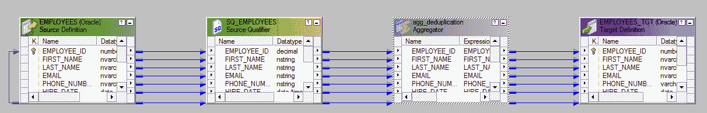
3.  您可以使用 Sorter 并使用 Sort Distinct 属性来获取不同的值。按照以下方式配置分类器以实现这一点。 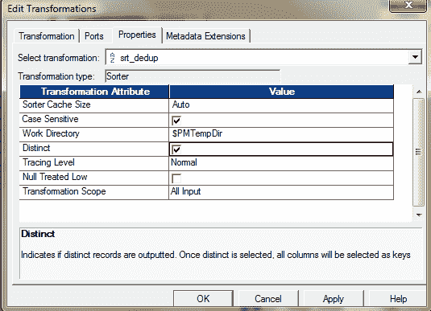
4.  如果您的数据已排序，您可以使用表达式和过滤器转换来识别和删除重复项。如果你的数据没有排序，那么，你可以先用一个排序器对数据进行排序，然后应用这个逻辑:

*   将源引入映射设计器。
*   让我们假设数据没有排序。我们正在使用分类器对数据进行分类。排序的关键字是 Employee_ID。 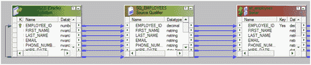 如下图配置分拣机。 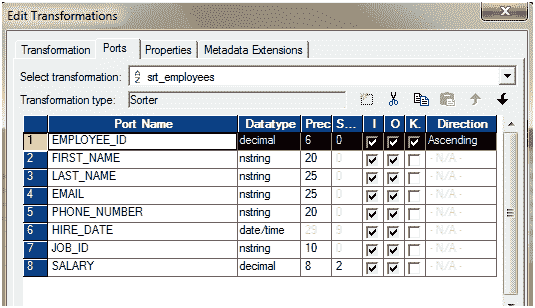
*   使用一个表达式转换来标记重复项。我们将根据 Employee_ID 使用可变端口来标识重复条目。 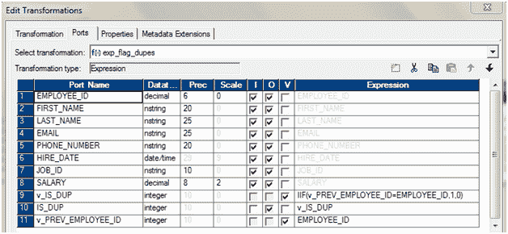
*   使用一个过滤变换，只传递 IS_DUP = 0。和前面的表达式转换一样，我们将把 IS_DUP =0 附加到唯一的记录上。如果 IS_DUP >为 0，这意味着，那些是重复的条目。 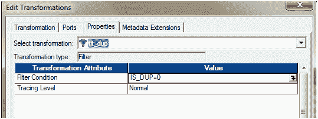
*   将端口添加到目标。整个映射应该是这样的。 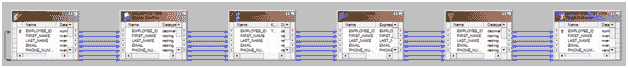

动词 （verb 的缩写）当您更改查找转换的属性以使用动态缓存时，一个新的端口被添加到转换中。NewLookupRow。

动态缓存可以在读取数据时更新缓存。

如果源有重复的记录，您也可以使用动态查找缓存，然后路由器只选择不同的记录。

### **3。源限定符和 Joiner 转换有什么区别？**

源限定符可以连接来自同一个源数据库的数据。通过将源链接到一个源限定符转换，我们可以连接两个或更多具有主键-外键关系的表。

如果我们需要连接中游或者数据源是异构的，那么我们将不得不使用 Joiner 转换来连接数据。

### **4。区分 joiner 和 Lookup 转换。**

下面是 lookup 和 joiner 转换的区别:

*   在 lookup 中我们可以覆盖查询，但在 joiner 中我们不能。
*   在查找中，我们可以提供不同类型的运算符，如-“>、<、> =、< =、！= "但是，在 joiner 中只有" = "(等于)运算符可用。
*   在 lookup 中，我们可以在使用 lookup override 读取关系表时限制行数，但是在 joiner 中，我们不能在读取时限制行数。
*   在 joiner 中，我们可以根据普通连接、主外部连接、详细外部连接和完全外部连接来连接表，但是在 lookup 中，此功能不可用。查找的行为类似于数据库的左外连接。

### **5。查找转换是什么意思？解释查找转换的类型。**

映射中的查找转换用于在平面文件、关系表、视图或同义词中查找数据。我们还可以从源限定符创建查找定义。

我们有以下几种类型的查找。

*   **关系或平面文件查找。**在平面文件或关系表上执行查找。
*   **管道查找。**在 JMS 或 MSMQ 等应用程序源上执行查找。
*   **连接或未连接查找**。
    *   连接查找转换接收源数据，执行查找，并将数据返回到管道。
    *   未连接的查找转换未连接到源或目标。管道中的转换使用:LKP 表达式调用查找转换。未连接的查找转换向调用转换返回一列。
*   **缓存或未缓存的查找。**我们可以配置查找转换来缓存查找数据，或者在每次调用查找时直接查询查找源。如果查找源是平面文件，则查找总是被缓存。

### **6。如何提高 joiner 转换的性能？**

下面是你可以提高 Joiner 转换性能的方法。

*   尽可能在数据库中执行连接。 在某些情况下，这是不可能的，比如连接来自两个不同数据库或平面文件系统的表。要在数据库中执行连接，我们可以使用以下选项: 创建并使用一个预会话存储过程来连接数据库中的表。 使用源限定符转换来执行连接。

*   在可能的情况下连接已排序的数据
*   对于未排序的 Joiner 转换，将行数较少的源指定为主源。
*   对于排序的 Joiner 转换，将重复键值较少的源指定为主源。

### **7。lookup 中的缓存类型有哪些？解释一下。**

基于在查找转换/会话属性级别完成的配置，我们可以拥有以下类型的查找缓存。

*   **未缓存的查找**–这里，查找转换不创建缓存。对于每一条记录，它都进入查找源，执行查找并返回值。因此，对于 10K 行，它将通过查找源 10K 时报来获得相关的值。
*   **缓存的查找**–为了减少与查找源和 Informatica 服务器的来回通信，我们可以配置查找转换来创建缓存。这样，来自查找源的全部数据都被缓存，所有的查找都是针对缓存执行的。

根据配置的缓存类型，我们可以有两种类型的缓存，静态和动态。

根据所配置的查找高速缓存的类型，集成服务的性能会有所不同。下表将查找转换与未缓存的查找、静态缓存和动态缓存进行了比较: 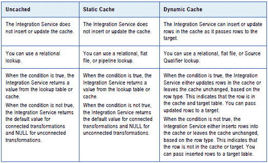

**持久缓存**

默认情况下，各个会话成功完成后，查找缓存会被删除，但是我们可以配置保留缓存，以便下次重新使用。

**共享缓存**

我们可以在多个转换之间共享查找缓存。我们可以在同一个映射中的转换之间共享一个未命名的缓存。我们可以在相同或不同映射的转换之间共享一个命名的缓存。

### **8。您如何使用或不使用更新策略来更新记录？**

我们可以使用会话配置来更新记录。我们可以有几个选项来处理数据库操作，如插入、更新、删除。

在会话配置期间，您可以使用会话的“属性”选项卡中的“将源行视为”设置，为所有行选择单个数据库操作。

*   **插入:–**将所有行视为插入。
*   **删除:–**将所有行视为删除。
*   **更新:–**将所有行视为更新。
*   **数据驱动:-** 集成服务遵循编码到更新策略标志行中的指令进行插入、删除、更新或拒绝。

一旦确定了如何处理会话中的所有行，我们还可以为单独的行设置选项，这为每行的行为提供了额外的控制。我们需要在会话属性的 mapping 选项卡上的 Transformations 视图中定义这些选项。

*   **插入:–**选择此选项将一行插入目标表格。
*   **删除:–**选择此选项从表格中删除一行。
*   **更新:-** 在这种情况下你有以下选择:
    *   Update as Update:–更新目标表中标记为更新的每一行。
    *   更新为插入:–插入标记为更新的每一行。
    *   Update else Insert:–如果行存在，则更新该行。否则，插入它。
*   **截断表:–**选择此选项，在加载数据前截断目标表。

步骤:

1.  设计映射就像一个只有“插入”的映射，没有查找、更新策略转换。 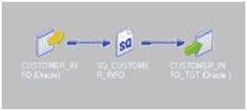
2.  首先设置将源行视为属性，如下图所示。 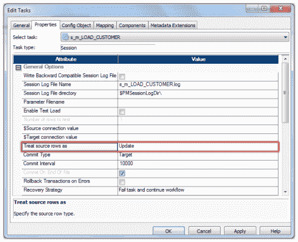
3.  接下来，设置目标表的属性，如下所示。选择属性 Insert 和 Update else Insert。 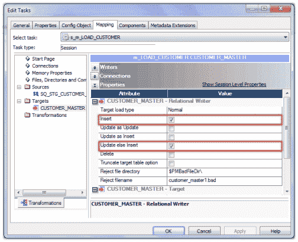

这些选项将使会话更新并插入记录，而不使用目标表中的更新策略。

当我们需要更新一个记录和插入都很少的大表时，我们可以使用这个解决方案来提高会话性能。

这种情况的解决方案是不使用查找转换和更新策略来插入和更新记录。

随着查找表大小的增加，查找转换可能无法更好地执行，并且还会降低性能。

### **9。为什么更新策略和联合转换是活动的？举例说明。**

1.  更新策略改变行类型。它可以根据为计算行而创建的表达式来分配行类型。像 **IIF (ISNULL (CUST_DIM_KEY)，DD_INSERT，DD_UPDATE)。**此表达式将 CUST_DIM_KEY 为空的行类型更改为 Insert，将 CUST_DIM_KEY 不为空的行类型更改为 Update。
2.  更新策略可以拒绝这些行。因此，通过适当的配置，我们还可以过滤掉一些行。因此，有时输入行数可能不等于输出行数。

喜欢 **IIF (IISNULL (CUST_DIM_KEY)，DD_INSERT，**

**IIF (SRC_CUST_ID！=TGT_CUST_ID)，DD _ 更新，DD _ 拒绝))**

我们在这里检查 CUST _ 迪姆 _ 基是否不为空，然后检查 CUST _ 标识是否等于 TGT _ CUST _ 标识。如果它们相等，那么我们不对那些行采取任何行动；他们被拒绝了。

**工会改造**

在联合转换中，尽管传入联合的总行数与传出联合的总行数相同，但行的位置不会保留，即输入流 1 中的行号 1 可能不是输出流中的行号 1。Union 甚至不能保证输出是可重复的。因此，这是一个积极的转变。

### **10。如何将空记录加载到目标中？通过映射流程进行解释。**

让我们说，这是我们的来源

| 客户标识 | 客户名称 | 客户金额 | 客户地点 | Cust_zip |
| 101 | 公元 | 160 | KL | 700098 |
| 102 | 血糖 | 170 | KJ | 560078 |
| NULL | NULL | 第 180 章 | KH | 780098 |

目标结构也是一样的，但是我们有两个表，一个包含空记录，另一个包含非空记录。

我们可以如下所述设计映射。

**SQ—>EXP—>RTR—>TGT _ NULL/TGT _ NOT _ NULL**EXP—表达式转换创建输出端口

O_FLAG= IIF ( (ISNULL(cust_id)或 ISNULL(cust_name)或 ISNULL(cust_amount)或 ISNULL(cust _place)或 ISNULL(cust_zip))，' NULL '，' NNULL') *****假设任何一个值为 null*** 时需要重定向

或

O _ FLAG = IIF((is NULL(cust _ name)AND is NULL(cust _ no)AND is NULL(cust _ amount)AND is NULL(cust _ place)AND is NULL(cust _ zip))，' NULL '，' NNULL') *****假设所有值都为 NULL 的情况下需要重定向***

RTR–路由器改造两组

组 1 连接到 TGT_NULL(表达式 O_FLAG='NULL') 组 2 连接到 TGT_NOT_NULL(表达式 O _ FLAG = ' nn NULL ')

### **11。如何通过映射流将备选记录加载到不同的表中？**

这个想法是给记录添加一个序列号，然后将记录号除以 2。如果它是可分的，那么将它移动到一个目标，如果不是，那么将它移动到另一个目标。

1.  拖动源并连接到表达式转换。
2.  将序列生成器的下一个值添加到表达式转换中。 
3.  在表达式转换中制作两个端口，一个是“奇数”，另一个是“偶数”。
4.  写出如下表达式 
5.  连接路由器转换为表达式。
6.  在路由器中制作两组。
7.  给定条件如下图 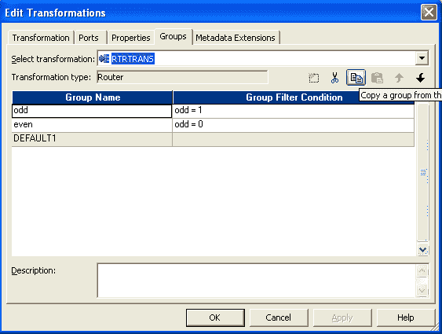
8.  然后把这两个小组派往不同的目标。这是整个流程。 

### **12。如何将第一条和最后一条记录加载到目标表中？有多少种方法做这件事？通过绘制流程图来解释。**

这背后的想法是给记录添加一个序列号，然后从记录中取出前 1 个等级和后 1 个等级。

1.  将端口从源限定符拖放到两个等级转换中。 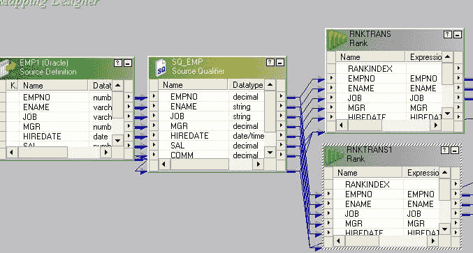
2.  创建起始值为 1 的可重用序列生成器，并将下一个值连接到两个等级转换。 
3.  按如下方式设置等级属性。新添加的序列端口应该被选作秩端口。无需选择任何端口作为按端口分组。rank–1
4.  Rank–2
5.  制作目标的两个实例。 将输出端口连接到目标。 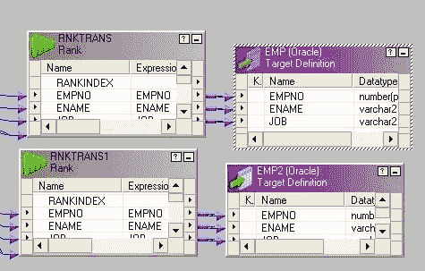

### **13。我在源表中有 100 条记录，但是我想加载 1，5，10，15，20…..100 到目标表。我该怎么做？在详细的映射流程中解释。**

这适用于任何 n= 2，3，4，5，6…对于我们的例子，n = 5。我们可以对任何 n 应用相同的逻辑

这背后的想法是给记录添加一个序列号，并将该序列号除以 n(在本例中是 5)。如果完全可分，即没有余数，则将它们发送给一个目标。

1.  在源限定符后连接一个表达式转换。
2.  将序列生成器的下一个值端口添加到表达式转换中。 
3.  在表达式中创建一个新端口(验证),并编写如下图所示的表达式。 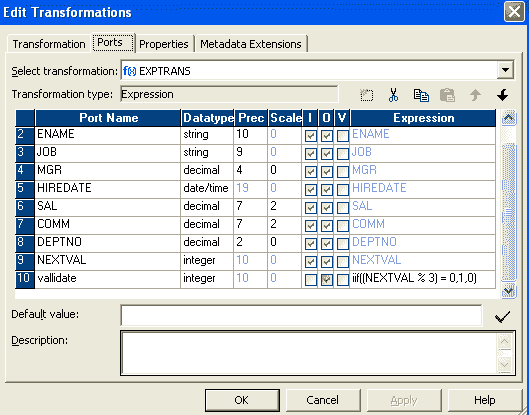
4.  将过滤器转换连接到表达式，并将条件写入属性，如下图所示。 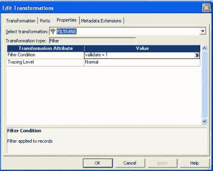
5.  最终连接目标。 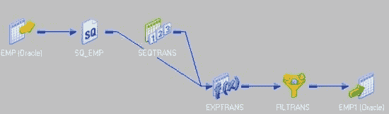

### **14。如何将唯一的记录装载到一个目标表中，并将重复的记录装载到另一个目标表中？**

**来源表:**

| **列 1** | **列 2** | **栏 3** |
| a | b | c |
| x | y | z |
| a | b | c |
| r | f | u |
| a | b | c |
| v | f | r |
| v | f | r |

**目标表 1** :包含所有唯一行的表

| **列 1** | **列 2** | **栏 3** |
| a | b | c |
| x | y | z |
| r | f | u |
| v | f | r |

**目标表 2:** 包含所有重复行的表

| **列 1** | **列 2** | **栏 3** |
| a | b | c |
| a | b | c |
| v | f | r |

1.  将源拖到映射，并将其连接到聚合器转换。 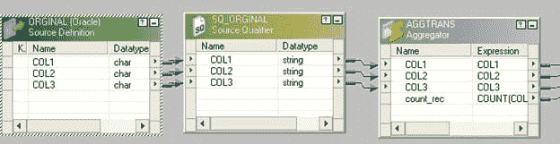
2.  在聚合器转换中，按关键字列分组并添加新端口。调用 count_rec 对键列进行计数。
3.  将路由器连接到上一步中的聚合器。在路由器中，创建两组:一组命名为“原始”，另一组命名为“副本”。 原始写计数 _ 记录=1，复制写计数 _ 记录> 1。  下图描绘了组名和过滤条件。 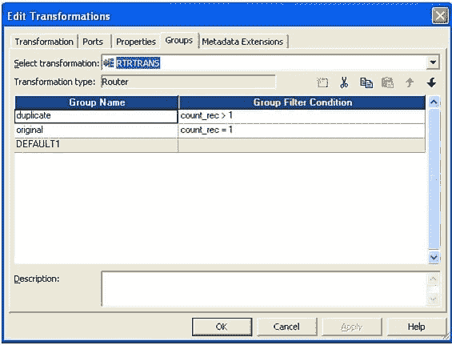 将两组连接到对应的目标表。 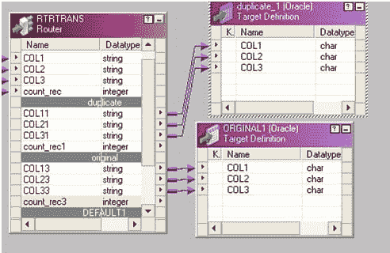

### **15。区分路由器和过滤器转换？**

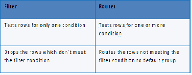

### **16。我有两个不同的源结构表，但我想加载到一个目标表中？我该怎么做呢？通过贴图流程详细讲解。**

*   如果我们想连接数据源，我们可以使用 joiner。使用联接器并使用匹配的列来联接表。
*   如果表格有一些公共列，并且我们需要垂直连接数据，我们也可以使用联合转换。创建一个联合转换将来自两个源的匹配端口添加到两个不同的输入组，并将输出组发送到目标。 这里的基本思想是使用 Joiner 或 Union 转换，将数据从两个源移动到一个目标。根据需求，我们可以决定使用哪一个。

### **17。如何通过 Informatica 在每个部门加载超过 1 个 Max Sal 或者在 oracle 中编写 sql 查询？**

SQL 查询:

您可以使用这种查询来获取每个**部门的一个以上的最高工资。**

SELECT * FROM (

SELECT EMPLOYEE_ID，FIRST_NAME，LAST_NAME，DEPARTMENT_ID，SAL，RANK()OVER(PARTITION BY DEPARTMENT _ ID ORDER BY SAL)SAL _ RANK FROM EMPLOYEES)

其中 SAL _ RANK<= 2**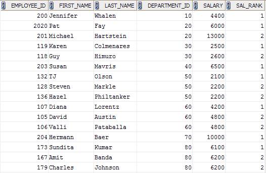**

**信息化途径:**

我们可以使用等级转换来实现这一点。

使用部门标识作为组关键字。 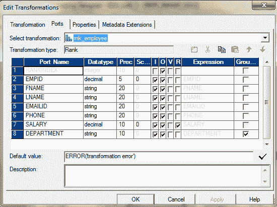

在属性选项卡中，选择顶部，3。 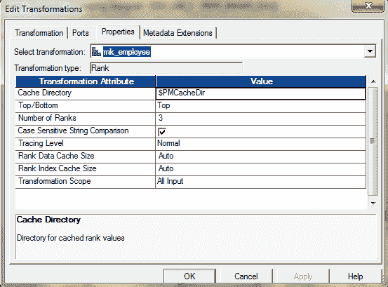

整个映射应该是这样的。 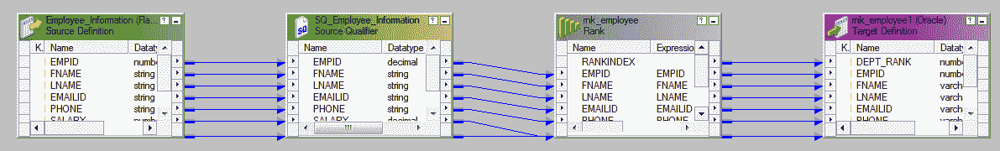

这将为我们提供在各自部门中收入最高的前 3 名员工。

### **18。如何将源中的单行转换成目标中的三行？**

为此，我们可以使用规格化变换。如果我们不想使用规格化器，那么有一个替代方法。

我们有一个包含 3 列的源表:Col1、Col2 和 Col3。表格中只有一行，如下:

| **col 1** | **col 2** | **col 3** |
| 答 | b | C |

有一个目标表只包含 1 列 Col。设计一个映射，使目标表包含 3 行，如下所示:

| **山坳** |
| 答 |
| b |
| c |

1.  创建 3 个表达式转换 exp_1、exp_2 和 exp_3，每个转换有 1 个端口。
2.  将 col1 从源限定符连接到 exp_1 中的端口。
3.  将 col2 从源限定符连接到 exp_2 中的端口。
4.  将 col3 从源限定符连接到 exp_3 中的端口。
5.  制作 3 个目标实例。将端口从 exp_1 连接到 target_1。
6.  将端口从 exp_2 连接到 target_2，将端口从 exp_3 连接到 target_3。

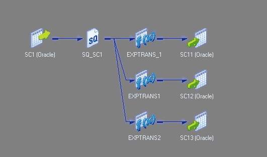

### **19。我有三个相同的源结构表。但是，我想加载到单个目标表中。我该怎么做？通过贴图流程详细讲解。**

这里我们将不得不使用联合变换。联合转换是一种多输入组转换，它只有一个输出组。

1.  拖动所有的源到映射设计器中。 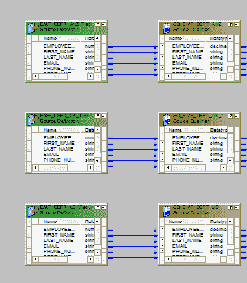
2.  添加一个联合转换，并对其进行如下配置。组选项卡。 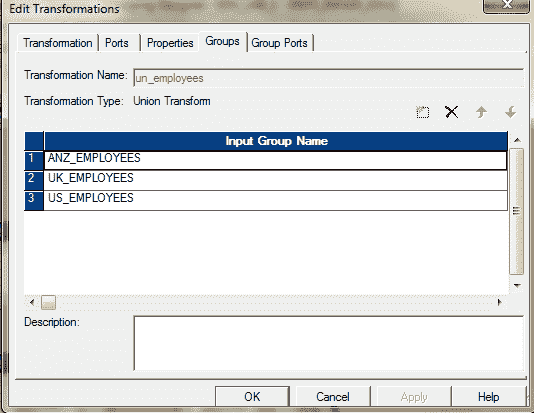 分组端口选项卡。 
3.  用联合变换的三个输入组连接源。 
4.  将输出发送到目标或通过表达式转换发送到目标。整个映射应该是这样的。 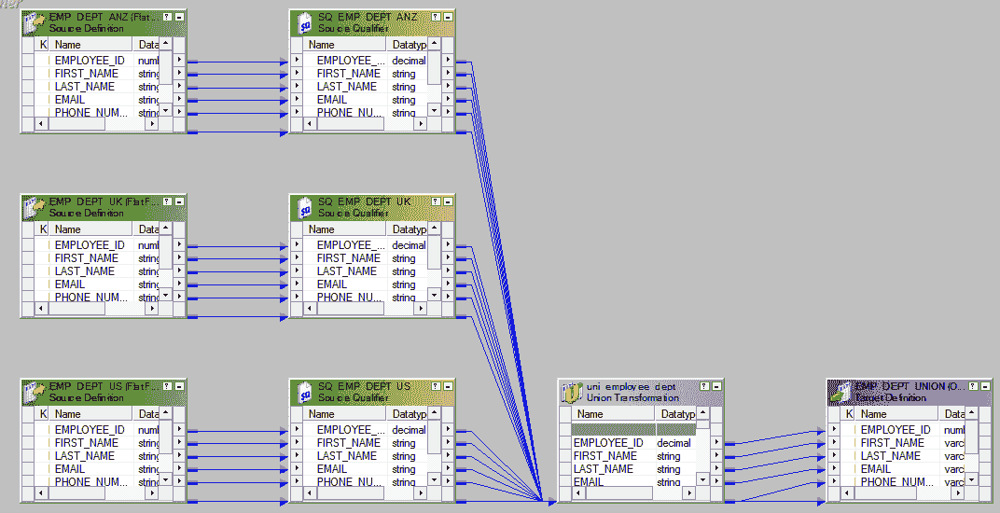

### **20。如何使用 joiner 连接三个源？通过映射流程进行解释。**

我们不能用一个连接器连接两个以上的源。为了连接三个源，我们需要两个连接转换。

比方说，我们想使用 Joiner 连接三个表——员工、部门和地点。我们需要两个木匠。Joiner-1 将连接员工和部门，Joiner-2 将连接 Joiner-1 和 Locations 表的输出。

步骤如下。

1.  将三个源引入映射设计器。 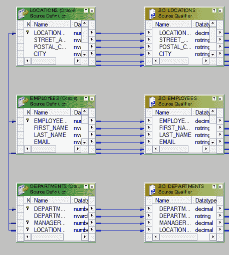
2.  使用 Department_ID 创建 Joiner -1 来连接员工和部门。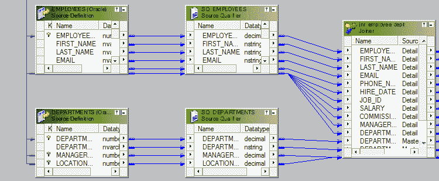
3.  创建下一个加入者，加入者-2。从 Joiner-1 获取输出，从 Locations 表获取端口，并将它们带到 Joiner-2。使用 Location_ID 连接这两个数据源。 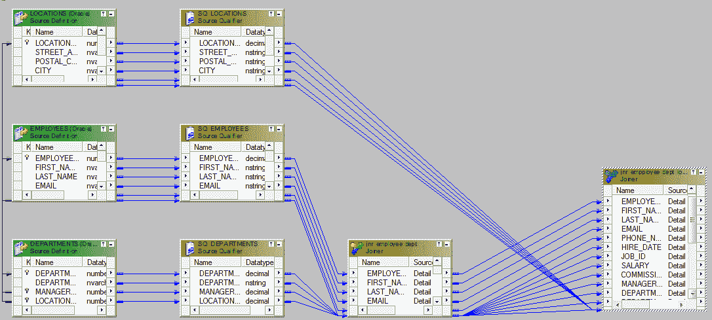
4.  最后一步是将所需端口从 Joiner-2 发送到目标，或者通过表达式转换发送到目标表。 

### **21。OLTP 和 OLAP 有什么区别？**

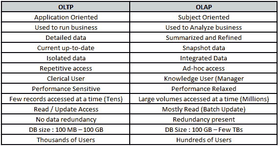

### **22。数据仓库中有哪些模式类型，它们之间有什么区别？**

有三种不同的数据模型。

1.  星型模式 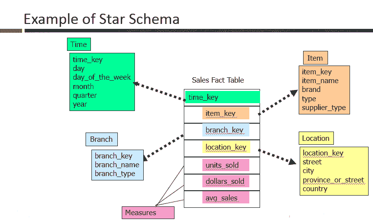 这里销售事实表是一个事实表，每个维度表的代理键在这里通过外键引用。示例:时间关键字、项目关键字、分支关键字、位置关键字。事实表被分支、位置、时间和项目等维度表包围。在事实表中，有诸如 time_key、item_key、branch_key 和 location _ keys 之类的维度键，度量是 untis_sold、dollars sold 和 average sales。通常，与维度相比，事实表包含更多的行，因为它包含维度的所有主键以及它自己的度量。
2.  雪花模式 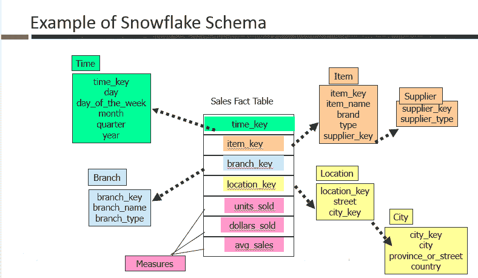 在雪花中，事实表被维度表包围，维度表也被规范化，形成层次结构。因此，在本例中，维度表(如 location、item)被进一步规范化为更小的维度，形成一个层次结构。
3.  事实星座 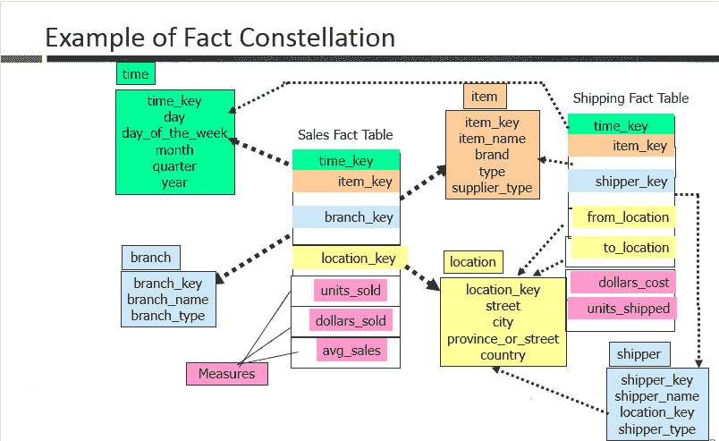 在事实星座中，有很多事实表共享相同的维度表。这个例子展示了一个事实星座，其中事实表 sales 和 shipping 共享维度表 time、branch 和 item。

### **23。什么是维度表？解释不同的维度。**

维度表是描述企业业务实体的表，用层次、分类的信息表示，如时间、部门、地点、产品等。

**数据仓库中维度的类型**

维度表由事实的属性组成。维度存储业务的文本描述。没有维度，我们就无法衡量事实。不同类型的维度表将在下面详细解释。

*   **符合维度:** 符合维度是指与它们所连接的每个可能的事实表完全相同的事物。 例如:连接到销售事实的日期维度表与连接到库存事实的日期维度相同。
*   **垃圾维度:** 垃圾维度是与任何特定维度无关的随机交易代码标志和/或文本属性的集合。垃圾维度只是一个结构，它提供了一个方便的地方来存储垃圾属性。 例:假设我们有一个性别维度和婚姻状况维度。在事实表中，我们需要维护引用这些维度的两个键。而不是创建一个包含性别和婚姻状况所有组合的垃圾维度(交叉连接性别和婚姻状况表并创建一个垃圾表)。现在我们只能在事实表中维护一个键。
*   **退化维度:** 退化维度是从事实表派生出来的维度，没有自己的维度表。 例如:事实表中的事务代码。
*   **角色扮演维度:** 在同一个数据库中经常用于多种用途的维度称为角色扮演维度。例如，日期维度可用于“销售日期”以及“交货日期”或“雇佣日期”。

### **24。什么是事实表？解释不同种类的事实。**

星型模式中的集中式表称为事实表。事实表通常包含两种类型的列。包含称为“事实”和“列”的度量值的列，它们是维度表的外键。事实表的主键通常是由维度表的外键组成的组合键。

**数据仓库中的事实类型**

事实表是由业务流程的度量、指标或事实组成的表。这些可测量的事实用于了解业务价值和预测未来业务。下面详细解释不同类型的事实。

*   **相加:** 相加事实是可以通过事实表中的所有维度进行汇总的事实。销售事实是附加事实的一个很好的例子。
*   **半可加:** 半可加事实是对于事实表中的某些维度可以求和，而对于其他维度则不能求和的事实。 例:日余额事实可以通过客户维度汇总，但不能通过时间维度汇总。
*   **非相加:** 非相加事实是不能对事实表中的任何维度进行求和的事实。 例:计算出百分比、比率的事实。

**无事实事实表:**

在现实世界中，事实表可能不包含任何度量或事实。这些表被称为“无事实事实表”。 例如:只有产品键和日期键的事实表是无事实的事实。此表中没有度量值。但是你仍然可以得到一段时间内卖出的产品数量。

包含聚集事实的事实表通常被称为汇总表。

### **25。通过映射详细解释 SCD 类型 1。**

SCD 类型 1 映射

SCD 类型 1 方法用新数据覆盖旧数据，因此不需要跟踪历史数据。

1.  这里是出处。 
2.  我们将根据关键列 CUSTOMER_ID 比较历史数据。
3.  这是整个映射: 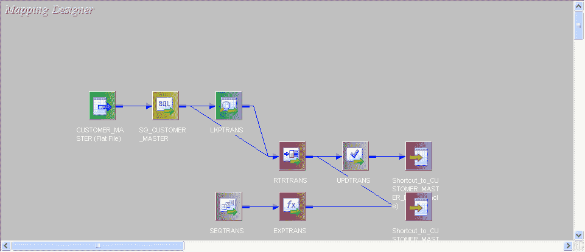
4.  将查找连接到源。在 lookup 中，从目标表中获取数据，并仅将 CUSTOMER_ID 端口从源发送到 Lookup。 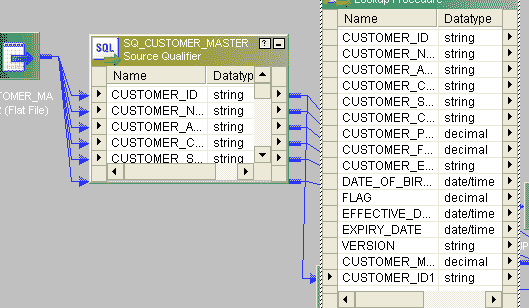
5.  给出这样的查找条件: 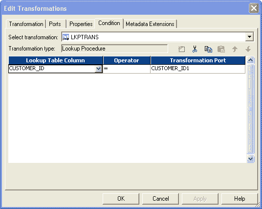
6.  然后，将剩余的列从源发送到一个路由器转换。 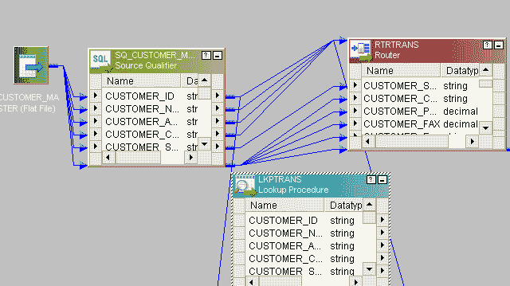
7.  在路由器中创建两组并给出如下条件: 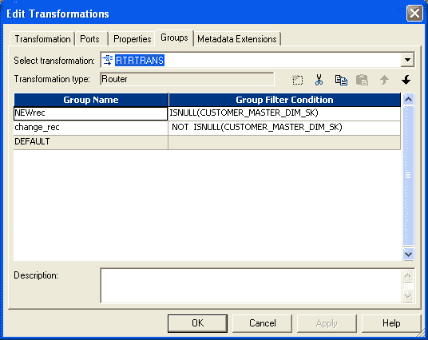
8.  对于新记录，我们必须生成新的 customer_id。为此，使用一个序列生成器，将下一列连接到 expression。来自路由器的 New_rec 组连接到 target1(将 target 的两个实例引入映射，一个用于新 rec，另一个用于旧 rec)。然后将表达式中的 next_val 连接到目标的 customer_id 列。 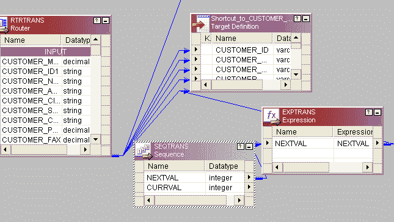
9.  路由器的 Change_rec 组带来一个更新策略，给出条件如下: 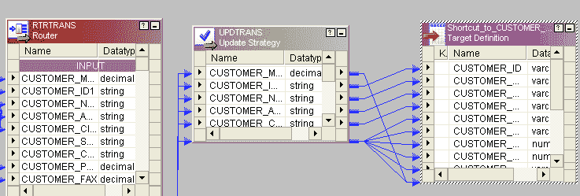 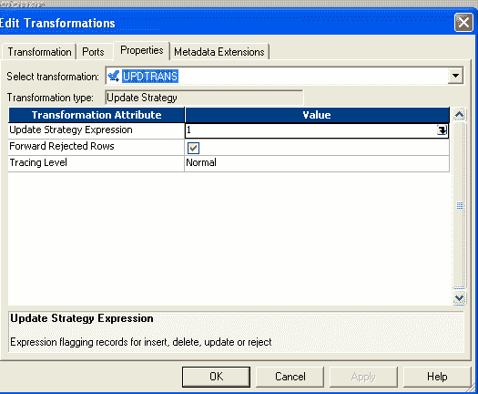
10.  你可以在更新策略中给出 dd_update 而不是 1，然后连接到目标。

### **26。通过映射详细解释 SCD 类型 2。**

**SCD Type2 映射**

在类型 2 缓变维度中，如果向现有表中添加一条带有新信息的新记录，则原始记录和新记录都将显示为带有自己主键的新记录。

1.  为了识别新记录，我们应该加上一个新项目管理和一个版本号
2.  这是来源: 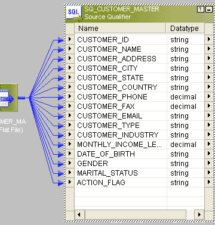
3.  这是整个映射: 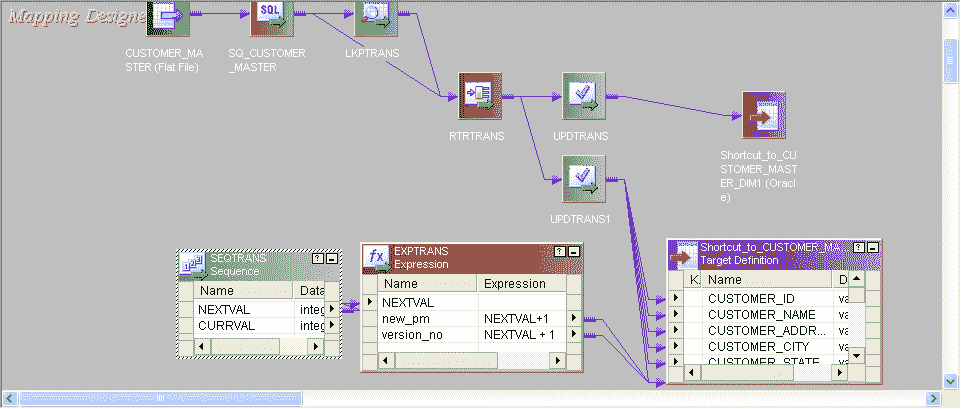
4.  所有程序与 SCD 类型 1 映射相似。唯一不同的是，从路由器 new_rec 将进入一个 update_strategy，条件将被赋予 dd_insert，并且在发送到目标之前将添加一个 new_pm 和 version_no。
5.  Old_rec 也会来更新 _strategy 条件会给 dd_insert 然后会发送到目标。

### **27。通过映射解释 SCD 类型 3。**

**SCD Type3 映射**

在 SCD Type3 中，应该添加两列来标识单个属性。它存储一次性历史数据和当前数据。

1.  这是来源: 
2.  这是整个映射: 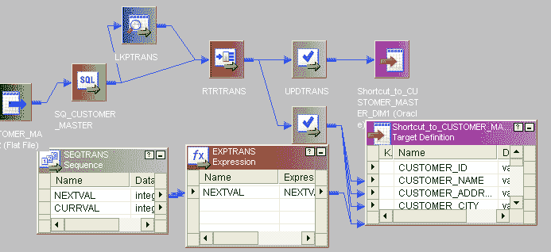
3.  直到路由器转换，所有程序与 SCD 类型 1 中描述的相同。
4.  唯一的区别是在 router 之后，把 new_rec 带到 router，并给出条件 dd_insert send to。
5.  创建一个新的主键发送到目标。对于 old_rec，发送到 update_strategy，设置条件 dd_insert 并发送到目标。
6.  您可以在旧记录表中创建一个生效日期列

### **28。区分可重用转换和 Mapplet。**

在 Transformation Developer 中创建的任何 Informatica 转换，或者从映射设计器升级为可重用转换的不可重用转换，可以在多个映射中使用，称为**可重用转换**。

当我们向一个映射添加一个可重用的转换时，我们实际上添加了一个转换的实例。由于可重用转换的实例是指向该转换的指针，当我们在 Transformation Developer 中更改转换时，它的实例会反映这些更改。

**Mapplet**是一个在 Mapplet 设计器中创建的可重用对象，它包含一组转换，并允许我们在多个映射中重用转换逻辑。

一个 Mapplet 可以包含我们需要的任意多的转换。像在映射中使用 mapplet 时的可重用转换一样，我们使用 mapplet 的一个实例，对 mapplet 所做的任何更改都会被 mapplet 的所有实例继承。

### **29。目标装载计划是什么意思？**

**目标加载顺序** :

目标加载顺序(或)目标加载计划用于指定集成服务加载目标的顺序。您可以根据映射中的源限定符转换来指定目标加载顺序。如果有多个源限定符转换连接到多个目标，则可以指定 integration service 将数据加载到目标的顺序。

**目标加载顺序组** :

目标加载顺序组是映射中链接的源限定符、转换和目标的集合。集成服务同时读取目标装载顺序组，并按顺序处理目标装载顺序组。下图显示了单个映射中的两个目标装载顺序组。

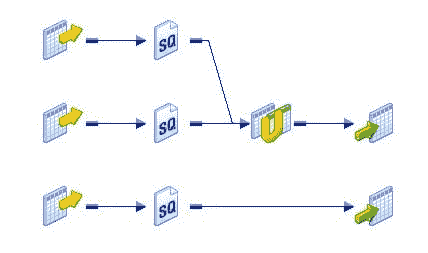

**使用目标加载顺序** :

当一个目标的数据依赖于另一个目标的数据时，目标加载顺序将非常有用。例如，由于主键和外键的关系，雇员表数据依赖于部门数据。因此，应该首先加载 departments 表，然后加载 employees 表。在插入、删除或更新具有主键和外键约束的表时，如果希望保持参照完整性，目标加载顺序非常有用。

**目标装载顺序设定** :

您可以在映射设计器中设置目标装载顺序或计划。按照以下步骤配置目标装载顺序:

1。登录 PowerCenter designer，创建包含多个目标装载顺序组的映射。 2。单击工具栏中的映射，然后单击目标装载计划。将弹出下面的对话框，列出映射中所有的源限定符转换，以及从每个源限定符接收数据的目标。

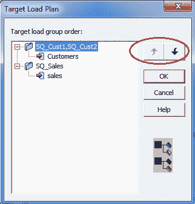

3.  从列表中选择一个源限定符。
4.  点击向上和向下按钮，在加载顺序中移动源限定词。
5.  对要重新排序的其它来源限定词重复步骤 3 和 4。
6.  点击确定。

### **30。写出未连接的查找语法以及如何返回多列。**

我们只能从未连接的查找转换中返回一个端口。由于未连接的查找是从另一个转换调用的，因此我们不能使用未连接的查找转换返回多个列。

然而，有一个窍门。我们可以使用 SQL 覆盖并连接我们需要返回的多个列。当我们可以从另一个转换中查找时，我们需要使用 substring 再次分隔列。

作为一个场景，我们取一个数据源，包含 Customer_id 和 Order_id 列。

**来源:**

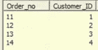

我们需要查找 Customer_master 表，该表保存了客户信息，如姓名、电话等。

目标应该是这样的:

让我们来看看未连接的查找。

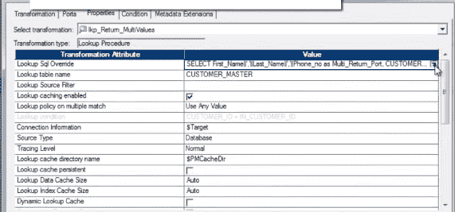

SQL 覆盖，带有串联端口/列:

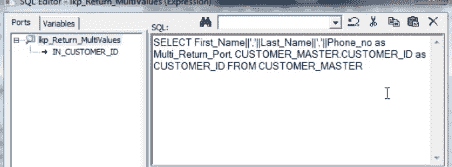

整个映射将看起来像这样。

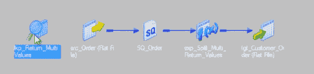

我们从一个表达式转换中调用未连接的查找。

下面是表情转换的截图。

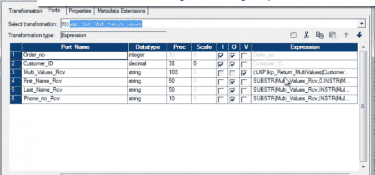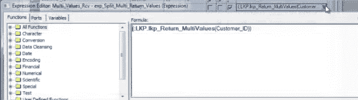

执行上述映射后，下面是目标，即被填充的。

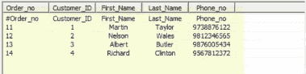

我很有信心，在看完这两篇 Informatica 面试问题博客后，你会为参加 Informatica 面试做好充分准备，不会出现任何问题。如果你希望深入探究 Informatica 用例，我会推荐你浏览我们的网站并尽早注册。

*[Informatica](https://www.edureka.co/informatica)上的 Edureka 课程帮助你掌握使用 Informatica PowerCenter Designer 进行 ETL 和数据挖掘。该课程旨在通过行业专家的实时项目和交互式教程来提升您在数据挖掘领域的职业道路。*

*有问题吗？请在评论区提到它，我们会给你回复。*

**相关帖子:**

[Informatica power center 9 入门。x 开发者&管理员](https://www.edureka.co/informatica "Get started with Informatica")

[Informatica 初级题](https://www.edureka.co/blog/interview-questions/top-informatica-interview-questions-2016/)

[职业发展与信息:你需要知道的一切](https://www.edureka.co/blog/career-progression-with-informatica-all-you-need-to-know)