# Spark 教程:实时集群计算框架

> 原文：<https://www.edureka.co/blog/spark-tutorial/>

Apache Spark 是用于*实时处理*的*开源集群计算框架*。它是 Apache 软件基金会中最成功的项目之一。Spark 显然已经发展成为大数据处理的市场领导者。今天，Spark 正在被亚马逊、易贝和雅虎等主要公司采用。许多组织在具有数千个节点和 t 的集群上运行 Spark，这是您职业生涯中成为 Spark 认证 ***[专业人员的巨大机会。 我们很兴奋能够通过这个 *Spark 教程*博客开始这个激动人心的旅程。这个博客是即将到来的 Apache Spark 博客系列的第一个博客，该系列将包括 Spark 流、Spark 面试问题、Spark MLlib 等。](https://www.edureka.co/apache-spark-scala-training)***

谈到实时数据分析，Spark 是所有其他解决方案的首选工具。通过这篇博客，我将向您介绍 Apache Spark 这个令人兴奋的新领域，我们将浏览一个完整的用例，使用 Spark 的*地震检测*。

以下是这篇 Spark 教程博客涉及的主题:

1.  [实时分析](#Real_Time_Analytics)
2.  [Hadoop 已经有了为什么还要 Spark？](#Why_Spark_When_Hadoop_Exists)
3.  [什么是阿帕奇 Spark？](#What_Is_Apache_Spark)
4.  [火花特征](#Spark_Features)
5.  [星火入门](#Getting_Started_With_Spark)
6.  [配合 Hadoop 使用 Spark](#Using_Spark_With_Hadoop)
7.  [火花元件](#Spark_Components)
8.  [用例:利用火花](#Use_Case_Earthquake_Detection)的地震检测

## **Spark 教程:实时分析**

在我们开始之前，让我们看看社交媒体领导者每分钟产生的数据量。


**图:** *每分钟产生的数据量*

正如我们所见，互联网世界需要在几秒钟内处理大量数据。我们将经历企业中处理大数据的所有阶段，并发现对*实时处理框架*的需求，该框架名为 *Apache Spark* 。

Get Certified With Industry Level Projects & Fast Track Your Career [<button>Take A Look!</button>](https://www.edureka.co/apache-spark-scala-training)

首先，让我向您介绍一下当今世界使用实时分析大时代的几个领域。


**图:** *星火教程—**实例实时分析*

我们可以看到，大数据的实时处理已经深入到我们生活的方方面面。从银行业的欺诈检测到政府的实时监控系统，从医疗保健领域的自动机器到股票市场的实时预测系统，我们周围的一切都围绕着近乎实时地处理大数据。

让我们来看看实时分析的一些使用案例:

1.  **医疗保健**:医疗保健领域使用实时分析持续检查危重患者的医疗状态。寻求血液和器官移植的医院需要在紧急情况下保持实时联系。及时就医对病人来说是生死攸关的问题。
2.  **政府**:政府机构主要在国家安全领域进行实时分析。各国需要持续跟踪所有军事和警察机构，以了解有关安全威胁的最新情况。
3.  电信:以电话、视频聊天和流媒体形式提供服务的公司使用实时分析来减少客户流失，并在竞争中保持领先地位。他们还提取移动网络中抖动和延迟的测量值，以改善客户体验。
4.  **银行业**:银行业处理着世界上几乎所有的货币。确保整个系统的容错事务变得非常重要。通过银行业的实时分析，欺诈检测成为可能。
5.  **股票市场**:股票经纪人利用实时分析来预测股票组合的变动。公司在使用实时分析来分析市场对其品牌的需求后，会重新思考他们的商业模式。

## **Spark 教程:Hadoop 已经有了为什么还要 Spark？**

每个人在谈到 Spark 时都会问的第一个问题是，“ ***我们已经有了 Hadoop，为什么还要 Spark？*** ”。

要回答这个问题，我们必须看看批处理和实时处理的概念。 *Hadoop* 基于*批处理*的概念，对已经存储了一段时间的数据块进行处理。当时，Hadoop 在 2005 年用革命性的 MapReduce 框架打破了所有的预期。Hadoop MapReduce 是批量处理数据的最佳框架。

这种情况一直持续到 2014 年，直到 Spark 超越 Hadoop。Spark 的 USP 是，它可以*实时*处理数据**，并且在批量处理大型数据集方面比 Hadoop MapReduce 快 100 倍左右。

下图详细解释了 Spark 和 Hadoop 中的处理差异。

**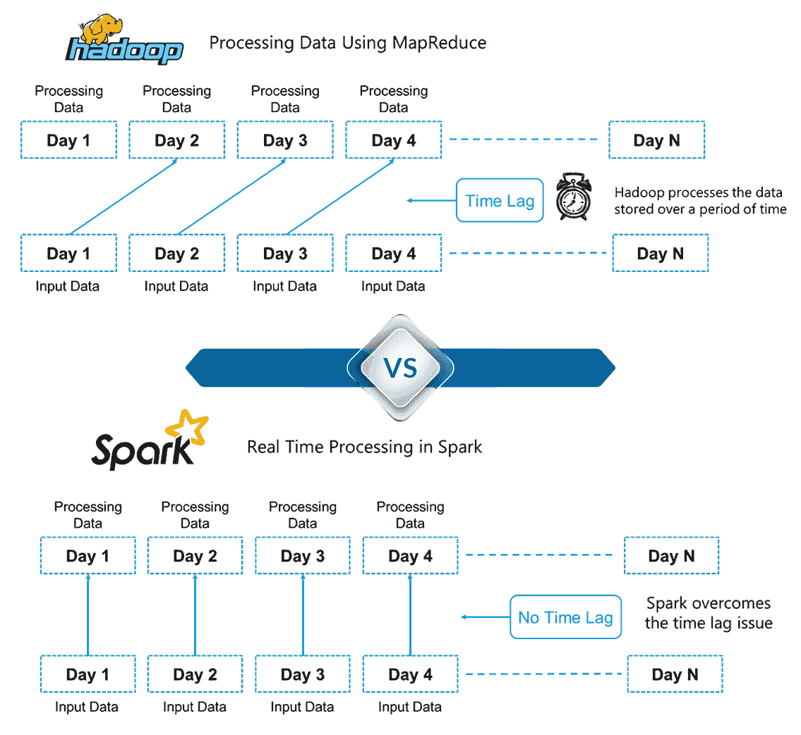  ** ** 图: ** *Spark 教程 Hadoop 与 Spark 的区别* 

在这里，我们可以引出 Hadoop 和 Spark 之间的一个关键区别。Hadoop 是基于大数据的批量处理。这意味着数据会存储一段时间，然后使用 Hadoop 进行处理。 而在 Spark 中，处理可以实时进行。Spark 中的这种实时处理能力帮助我们解决了我们在上一节中看到的实时分析用例。除此之外，Spark 的批处理速度比 Hadoop MapReduce(Apache Hadoop 中的处理框架)快 100 倍。*因此，Apache Spark 是业内大数据处理的首选工具。*

## **Spark 教程:什么是阿帕奇 Spark？**

Apache Spark 是一个用于*实时处理的*开源集群计算框架*。*它有一个繁荣的开源社区，是目前最活跃的 Apache 项目。Spark 提供了一个接口，用于通过隐式数据并行和容错对整个集群进行编程。

    **图:**     * Spark 教程 Apache Spark 中的实时处理*

它建立在 Hadoop MapReduce 之上，并且它扩展了 MapReduce 模型以有效地使用更多类型的计算。

## **Spark 教程:阿帕奇 Spark 的特点**

Spark 有以下特点:

**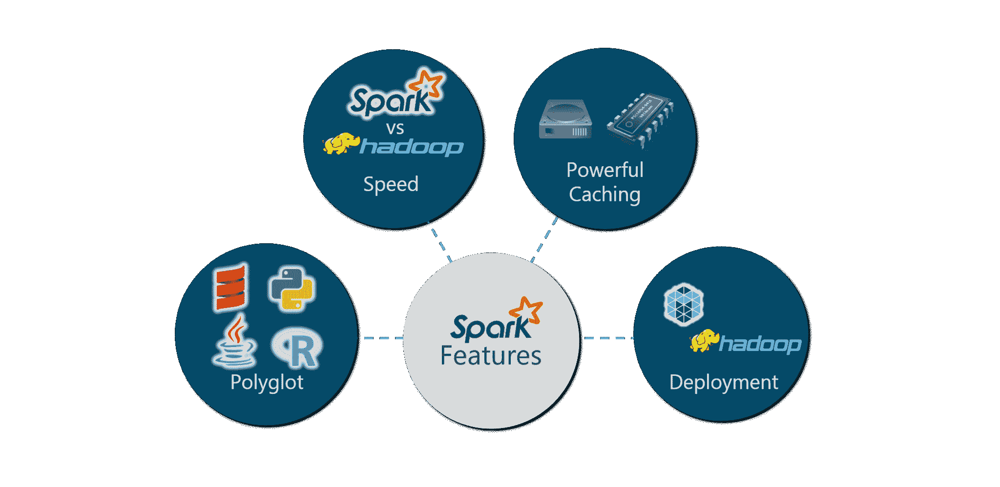图:** *星火教程——星火特色*

让我们来详细看看这些特性:

| **Polyglot**:Spark 提供 Java、Scala、Python 和 r 的高级 API，Spark 代码可以用这四种语言中的任意一种编写。它用 Scala 和 Python 提供了一个 shell。Scala shell 可以通过**访问。/bin/spark-shell** 和 Python shell 通过**。安装目录中的/bin/pyspark** 。 | 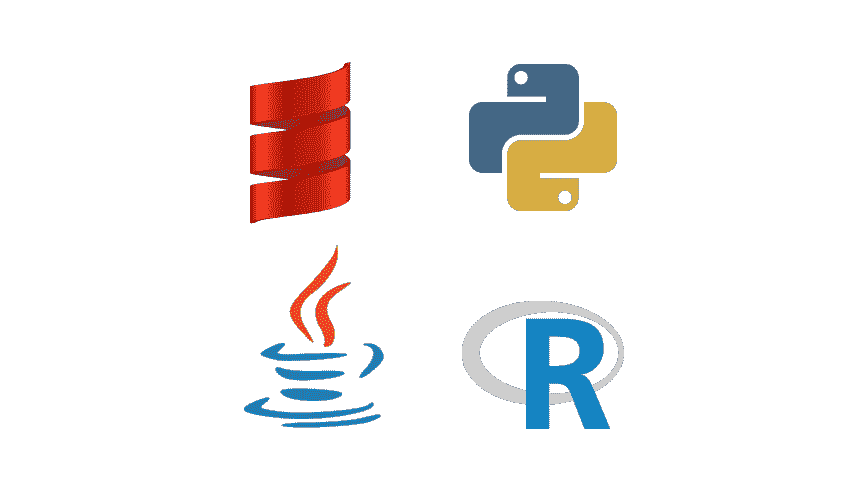 |

| 

## **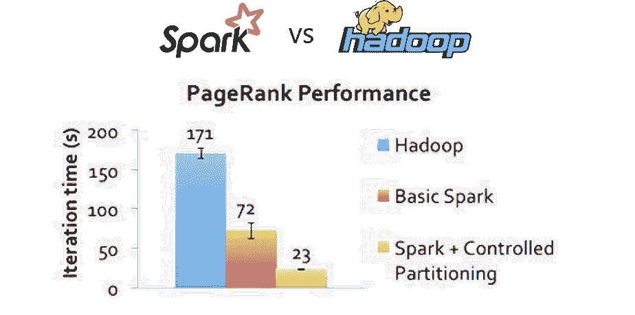**

 | **速度** :对于大规模数据处理，Spark 的运行速度比 Hadoop MapReduce 快 100 倍。Spark 能够通过受控分区实现这一速度。它使用分区管理数据，有助于以最小的网络流量并行处理分布式数据。 |

| **Multiple Formats**:除了文本文件、CSV 和 RDBMS 表等常见格式之外，Spark 还支持多种数据源，如 Parquet、JSON、Hive 和 Cassandra。数据源 API 提供了通过 Spark SQL 访问结构化数据的可插拔机制。数据源不仅仅是简单的转换数据并将其导入 Spark 的管道。 | **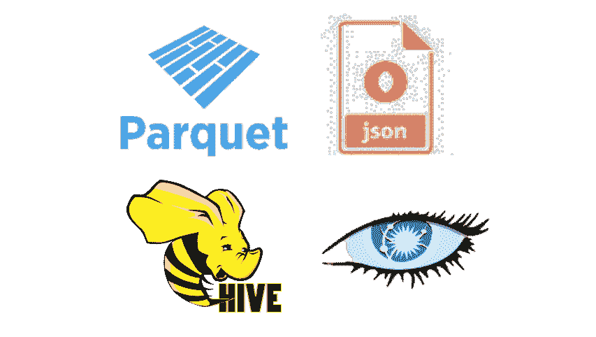** |

|  | **Lazy Evaluation**:Apache Spark 将其评估推迟到绝对必要的时候。这是促成其速度的关键因素之一。对于转换，Spark 将它们添加到 DAG(有向无环图)计算中，只有当驱动程序请求一些数据时，DAG 才会真正执行。 |

| **Real Time Computation**:Spark 的计算是实时的，由于是内存中计算，所以延迟低。Spark 旨在实现巨大的可扩展性，Spark 团队记录了运行具有数千个节点的生产集群的系统用户，并支持多种计算模型。 |  |

| 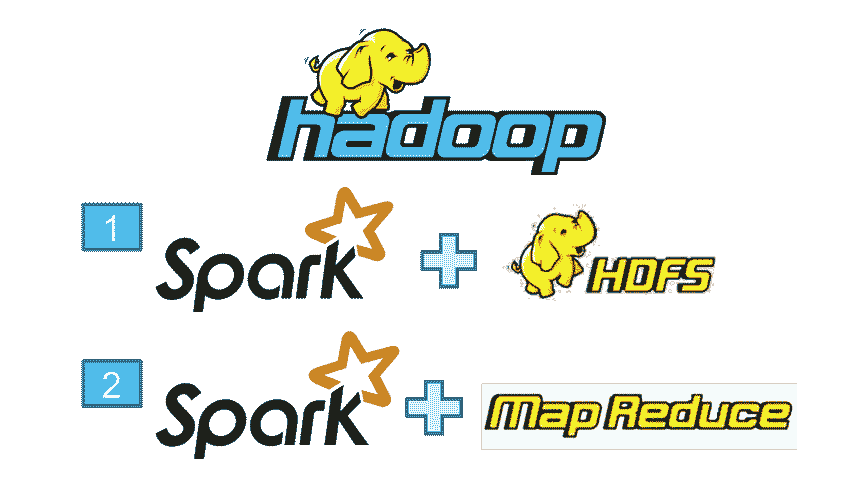 | **Hadoop Integration**:Apache Spark 提供了与 Hadoop 的流畅兼容性。对于所有从 Hadoop 开始职业生涯的大数据工程师来说，这是一个  的福音。Spark 是 Hadoop MapReduce 功能的潜在替代品，而 Spark 能够在现有 Hadoop 集群之上运行，使用 YARN 进行资源调度。 |

| **机器学习** :Spark 的 MLlib 是机器学习组件，在大数据处理方面非常方便。它消除了使用多种工具的需要，一种用于处理，一种用于机器学习。Spark 为数据工程师和数据科学家提供了一个强大的统一引擎，既快速又易于使用。 |  |

**星火教程:星火入门**

【Spark 入门的第一步是安装。让我们在 Linux 系统上安装 Apache Spark 2.1.0(我使用的是 Ubuntu)。

**安装:**

1.  安装 Spark 的先决条件是已经安装了 Java 和 Scala。
2.  使用以下命令下载 Java，以防 没有安装。

    ```
    sudo apt-get install python-software-properties
    sudo apt-add-repository ppa:webupd8team/java
    sudo apt-get update
    sudo apt-get install oracle-java8-installer

    ```

3.  从 [Scala Lang 官方](http://www.scala-lang.org/)页面下载最新的 Scala 版本。 安装完成后，在`~/.bashrc` 文件中设置 scala 路径，如下图所示。

    ```
    export SCALA_HOME=Path_Where_Scala_File_Is_Located
    export PATH=$SCALA_HOME/bin:PATH

    ```

4.  从 [Apache Spark 下载](http://spark.apache.org/downloads.html)页面下载 Spark 2.1.0。您也可以选择下载以前的版本。
5.  使用以下命令提取火花焦油。

    ```
    tar -xvf spark-2.1.0-bin-hadoop2.7.tgz

    ```

6.  在`~/.bashrc` 文件中设置火花路径。

    ```
    export SPARK_HOME=Path_Where_Spark_Is_Installed
    export PATH=$PATH:$SPARK_HOME/bin

    ```

在我们继续之前，让我们在我们的系统上启动 Apache Spark，并习惯 Spark 的主要概念，如 Spark 会话、数据源、rdd、数据帧和其他库。

**火花壳:**

Spark 的 shell 提供了一个简单的学习 API 的方法，以及一个强大的交互分析数据的工具。

**星火会期:**

在 Spark 的早期版本中，Spark 上下文是 Spark 的入口点。对于其他 API，我们需要使用不同的上下文。对于流，我们需要 StreamingContext、SQL sqlContext 和 HiveContext。为了解决这个问题，SparkSession 应运而生。It 本质上是 SQLContext、HiveContext 和 future StreamingContext 的组合。

**数据来源:**

数据源 API 为通过 Spark SQL 访问结构化数据提供了一种可插拔的机制。数据源 API 用于将结构化和半结构化数据读取和存储到 Spark SQL 中。数据源不仅仅是简单的转换数据并将其导入 Spark 的管道。

弹性分布式数据集(RDD)是 Spark 的基础数据结构。它是一个不可变的分布式对象集合。RDD 中的每个数据集都被划分为逻辑分区，这些分区可以在集群的不同节点上进行计算。rdd 可以包含任何类型的 Python、Java 或 Scala 对象，包括用户定义的类。

**数据集:**

数据集是数据的分布式集合。数据集可以由 JVM 对象构建，然后使用函数转换(map、flatMap、filter 等)进行操作。).数据集 API 有 Scala 和 Java 两种版本。

**数据帧:**

数据帧是组织成命名列的 *数据集*。它在概念上相当于关系数据库中的一个表或 R/Python 中的一个数据框，但是在底层有更丰富的优化。数据框架可以从各种来源构建，例如:结构化数据文件、Hive 中的表、外部数据库或现有 rdd。

## **Spark 教程:结合 Hadoop 使用 Spark**

Spark 最好的部分是它与 Hadoop 的兼容性。因此，这是一个非常强大的技术组合。在这里，我们将了解 Spark 如何从 Hadoop 的优势中获益。

**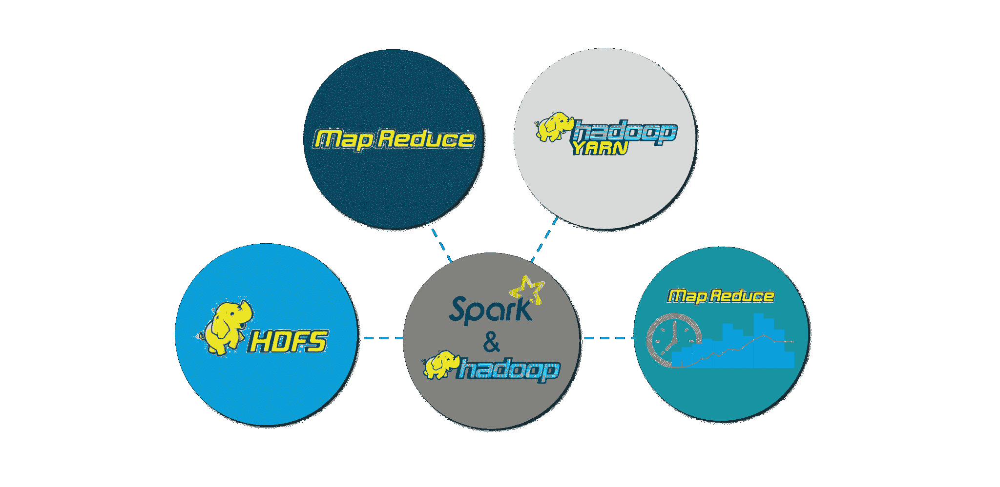 图:  ** *星火教程——星火特色* 

Hadoop 组件可以通过以下方式与 Spark 一起使用:

1.  **HDFS** : Spark 可以在 HDFS 上运行，以利用分布式复制存储。
2.  **MapReduce**:Spark 可以在同一个 Hadoop 集群中与 MapReduce 一起使用，也可以单独作为一个处理框架使用。
3.  **YARN** : Spark 应用可以在 YARN 上运行(Hadoop NextGen)。
4.  **批处理&实时处理** : MapReduce 和 Spark 一起使用，其中 MapReduce 用于批处理，Spark 用于实时处理。

## **火花教程:火花元件**

Spark 组件使得 Apache Spark 快速可靠。很多 Spark 组件都是为了解决使用 Hadoop MapReduce 时出现的问题而构建的。Apache Spark 有以下组件:

1.  **火花核心**
2.  **火花四溅**
3.  **火花 SQL**
4.  **GraphX**
5.  **ml lib(机器学习)**

### **星火核心**

*Spark Core* 是大规模并行和分布式数据处理的基础引擎。核心是分布式执行引擎，Java、Scala 和 Python APIs 为分布式 ETL 应用程序开发提供了一个平台。此外，构建在核心之上的额外库允许流、SQL 和机器学习的不同工作负载。 它负责:

1.  内存管理和故障恢复
2.  在集群上调度、分发和监控作业
3.  与存储系统交互

### **火花四溅**

*Spark Streaming* 是 Spark 的组件，用于处理实时流数据。因此，它是对核心 Spark API 的有益补充。它支持实时数据流的高吞吐量和容错流处理。基本流单元是数据流，它基本上是一系列用于处理实时数据的弹性分布式数据集。

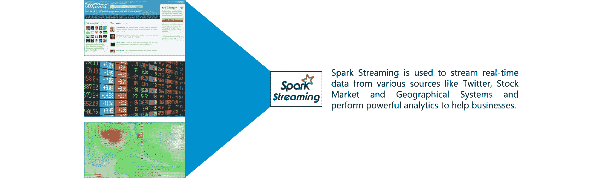 ** 图: ** * 火花教程——火花流*

### **火花 SQL**

*Spark SQL* 是 Spark 中的一个新模块，它将关系处理与 Spark 的函数式编程 API 集成在一起。它支持通过 SQL 或 Hive 查询语言查询数据。对于那些熟悉 RDBMS 的人来说，Spark SQL 将是从早期工具的简单过渡，在早期工具中，您可以扩展传统关系数据处理的边界。

Spark SQL 将关系处理与 Spark 的函数式编程集成在一起。此外，它提供了对各种数据源的支持，并使将 SQL 查询与代码转换结合起来成为可能，从而产生了一个非常强大的工具。

以下是 Spark SQL 的四个库。

1.  数据源 API
2.  数据框架 API
3.  解释器&优化器
4.  SQL 服务

### **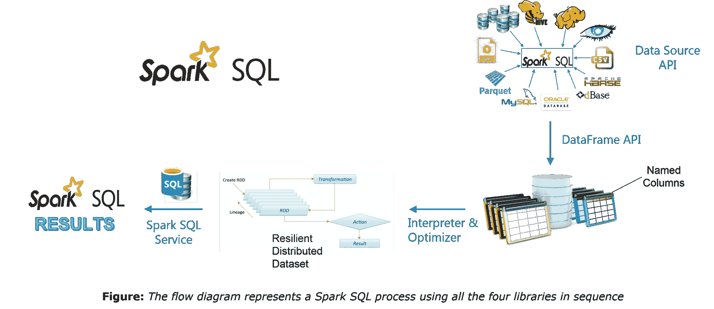**

*Spark SQL 的完整教程可以在 given 博客中找到: [Spark SQL 教程博客](https://www.edureka.co/blog/spark-sql-tutorial/)*

### **GraphX**

*GraphX* 是用于图形和图形并行计算的 Spark API。因此，它用弹性分布式属性图扩展了火花 RDD。

属性图是一个有向多重图，它可以有多条平行的边。每个边和顶点都有用户定义的相关属性。这里，平行边允许相同顶点之间的多种关系。在高层次上，GraphX 通过引入弹性分布式属性图扩展了 Spark RDD 抽象:一个每个顶点和边都有属性的有向多图。

为了支持图形计算，GraphX 公开了一组基本操作符(例如，子图、joinVertices 和 mapReduceTriplets)以及 Pregel API 的优化变体。此外，GraphX 还包含了越来越多的图形算法和构建器来简化图形分析任务。

### **ml lib(机器学习)**

*MLlib* 代表机器学习库。Spark MLlib 用于在 Apache Spark 中执行机器学习。

## ** 用例:地震探测使用火花**

现在我们已经理解了 Spark 的核心概念，让我们使用 Apache Spark 解决一个现实生活中的问题。这将有助于我们有信心在未来从事任何 Spark 项目。

**问题陈述** : *设计实时地震检测模型以发送救生警报，该模型应改进其机器学习以提供接近实时的计算结果。*

**用例——需求** :

1.  实时处理数据
2.  处理来自多个来源的输入
3.  易于使用的系统
4.  批量发送告警

我们将使用 Apache Spark，它是满足我们需求的完美工具。

**用例——数据集** :

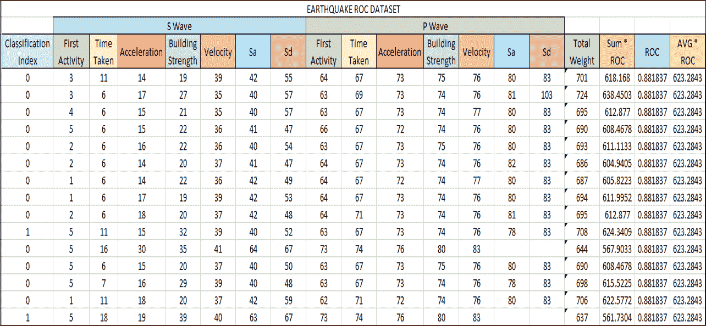 **图:** *用例——地震数据集* 

在继续之前，有一个概念我们必须了解，我们将在我们的地震探测系统中使用，它被称为接收器工作特性(ROC)。ROC 曲线是图示二元分类器系统在其辨别阈值变化时的性能的图表。我们将使用数据集，通过 Apache Spark 中的机器学习来获得 ROC 值。

**用例——流程图** :

下图清楚地解释了我们的*地震探测系统*所涉及的所有步骤。

**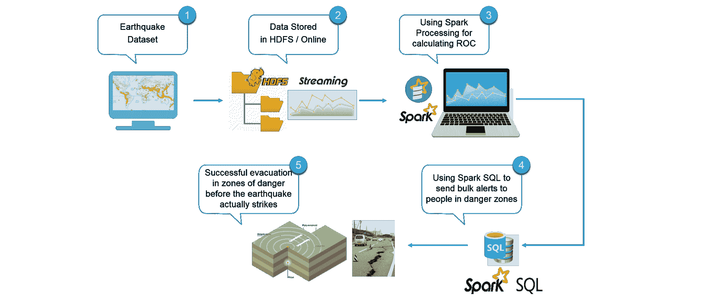 **   **图:** *用例——使用 Apache Spark 进行地震检测的流程图*

**用例——Spark 实现** :

继续，现在让我们使用 Eclipse IDE for Spark 来实现我们的项目。

找到下面的伪代码:

```
//Importing the necessary classes
import org.apache.spark._
...
//Creating an Object earthquake
object earthquake {
 def main(args: Array[String]) {

//Creating a Spark Configuration and Spark Context
val sparkConf = new SparkConf().setAppName("earthquake").setMaster("local[2]")
val sc = new SparkContext(sparkConf)

//Loading the Earthquake ROC Dataset file as a LibSVM file
val data = MLUtils.loadLibSVMFile(sc, *Path to the Earthquake File* )

//Training the data for Machine Learning
val splits = data.randomSplit( *Splitting 60% to 40%* , seed = 11L)
val training = splits(0).cache()
val test = splits(1)

//Creating a model of the trained data
val numIterations = 100
val model = *Creating SVM Model with SGD* (  *Training Data* , *Number of Iterations* )

//Using map transformation of model RDD
val scoreAndLabels = *Map the model to predict features* 

//Using Binary Classification Metrics on scoreAndLabels
val metrics = * Use Binary Classification Metrics on scoreAndLabels *(scoreAndLabels)
val auROC = metrics. *Get the area under the ROC Curve*()

//Displaying the area under Receiver Operating Characteristic
println("Area under ROC = " + auROC)
 }
}

```

从我们的 Spark 计划中，我们得到 ROC 值为 0.088137。我们将转换该值，以获得 ROC 曲线下的面积。

**用例——可视化结果** :

我们将绘制 ROC 曲线，并与具体的地震点进行比较。当地震点超过 ROC 曲线时，这些点被视为大地震。根据我们计算 ROC 曲线下面积的算法，我们可以假设这些大地震都在里氏 6.0 级以上。

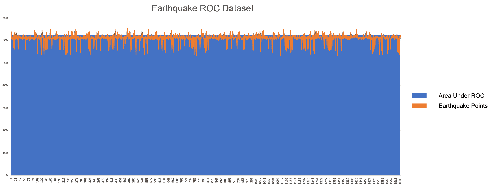   **图:** *地震 ROC 曲线*

上图以橙色显示了地震线。蓝色区域是我们从 Spark 项目中获得的 ROC 曲线。让我们把曲线放大，以便获得更好的图像。

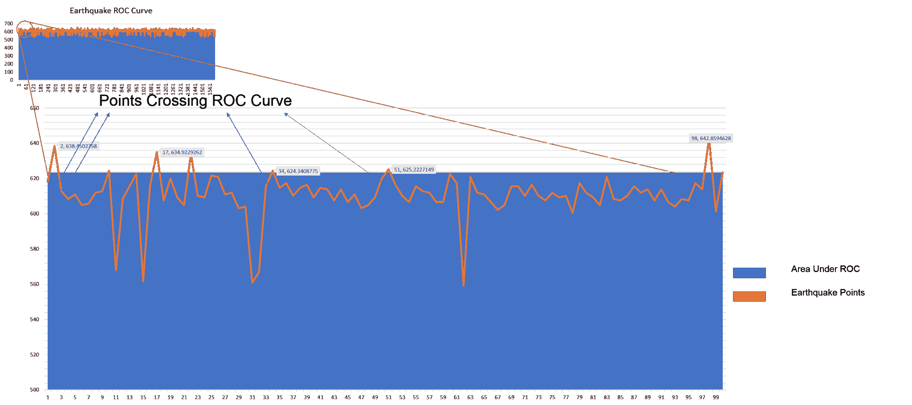   **图:** *观想震穴*

我们绘制了地震曲线和 ROC 曲线。在橙色曲线位于蓝色区域上方的点处，我们预测地震为大地震，即震级大于 6.0。因此，有了这些知识，我们可以使用 Spark SQL 并查询现有的 Hive 表来检索电子邮件地址，并向人们发送个性化的警告电子邮件。因此，我们再一次利用科技来拯救人类生命，让每个人的生活变得更好。

现在，Apache Spark 博客到此结束。我希望你喜欢阅读它，并发现它的信息。到目前为止，您一定已经很好地理解了 Apache Spark 是什么。实际操作的例子将为您在 Apache Spark 中遇到的任何未来项目提供所需的信心。实践是掌握任何主题的关键，我希望这篇博客已经引起了您对 Apache Spark 进一步探索学习的足够兴趣。

This video series on [Spark Tutorial](https://www.youtube.com/playlist?list=PL9ooVrP1hQOGyFc60sExNX1qBWJyV5IMb) provides a complete background into the components along with Real-Life use cases such as [Twitter Sentiment Analysis](https://www.youtube.com/watch?v=uD_q4Rm4i2Q&amp;amp;amp;amp;amp;list=PL9ooVrP1hQOGyFc60sExNX1qBWJyV5IMb), [NBA Game Prediction Analysis](https://www.youtube.com/watch?v=zeDUx_Jf154&amp;amp;amp;amp;amp;list=PL9ooVrP1hQOGyFc60sExNX1qBWJyV5IMb), [Earthquake Detection System](https://www.youtube.com/watch?v=9mELEARcxJo&amp;amp;amp;amp;amp;list=PL9ooVrP1hQOGyFc60sExNX1qBWJyV5IMb), [Flight Data Analytics](https://www.youtube.com/watch?v=BQlgZaKvfac&amp;amp;amp;amp;amp;list=PL9ooVrP1hQOGyFc60sExNX1qBWJyV5IMb) and [Movie Recommendation Systems](https://www.youtube.com/watch?v=qX1kYJ6h7j8&amp;amp;amp;amp;amp;list=PL9ooVrP1hQOGyFc60sExNX1qBWJyV5IMb). We have personally designed the use cases so as to provide an all round expertise to anyone running the code*. *

*有问题吗？请在评论区提到它，我们会尽快回复您。*

*如果您希望学习 Spark，并在 Spark 领域建立职业生涯，使用 RDD、Spark Streaming、SparkSQL、MLlib、GraphX 和 Scala 并结合现实生活中的用例来执行大规模数据处理，请查看我们的交互式在线直播* *[Apache Spark 认证培训](https://www.edureka.co/apache-spark-scala-training)此处，* *该培训提供 24*7 支持，可在整个学习期间为您提供指导。*