# 初学者学习 Python 教程

> 原文：<https://www.edureka.co/blog/python-tutorial/>

[Python](https://www.edureka.co/blog/what-is-python/) 是一种用于通用编程的编程语言。它是一种高级的、解释性的、面向对象的语言。Python 自 1991 年出现以来，已经成为世界上最流行的语言之一。 这种语言是一种简单易学的语言，语法简单，任何知道如何用任何其他语言编程的人都可以学习，如 [C](https://www.edureka.co/blog/c-programming-tutorial/) 、[Java](https://www.edureka.co/blog/ebook/java-ebook)，或[JavaScript](https://www.edureka.co/blog/what-is-javascript/)。 本博客——‘[***Python 初学者教程***](https://www.edureka.co/python-programming-certification-training) ，‘将教你如何从零开始用 Python 编码，涵盖这种编程语言的所有基础知识。你可以在下面看到这个博客将要涉及的主题列表:

*   [Python 简介](#introductiontopython)
    *   [Python 是什么？](#whatispython)
    *   [Python 解释器](#pythoninterpreter)
    *   [Python 安装](#pythoninstallation)
        *   [Python Windows 版安装](#windows)
        *   [Python Linux 安装](#linux)
        *   [Mac 版 Python 安装](#mac)
    *   [Python IDE](#ide)
        *   [哪个 Python IDE？](#ide1)
        *   [PyCharm](#pycharm)
        *   [Jupyter 笔记型电脑](#notebook)
    *   [为什么要学 Python？](#whypython)
    *   [Python 应用](#applications)
*   [Python 基础知识](#basics)
    *   [Python 关键词](#keywords)
    *   [Python 评论](#comments)
        *   [Python 注释块](#block)
    *   [Python 变量](#variables)
        *   [Python 中的全局变量](#global)
    *   [Python 中的数据类型](#datatypes)
        *   [Python 字符串](#strings)
        *   [Python 字符串格式](#format)
            *   [Python 字符串方法](#methods)
            *   [Python 字符串操作](#operations)
        *   [数字](#numbers)
            *   [Python 整数](#integers)
            *   [Python 浮动](#float)
            *   [Python 布尔型](#boolean)
        *   [Python 列表](#lists)
            *   [Python 列表删除](#remove)
            *   [Python 列表删除重复项](#duplicates)
        *   [Python 元组](#tuples)
        *   [Python 集](#sets)
        *   [Python 字典](#dictionary)
            *   [字典方法](#dictionarymethods)
    *   [Python 中的运算符](#operators)
    *   [条件语句](#conditional)
        *   [If，Else，Python 中的 Elif 语句](#ifelse)
        *   [条件语句示例](#conditionalexample)
    *   [Python 中的循环](#loops)
        *   [Python 中的 For 循环](#for)
        *   [Python 中的 While 循环](#while)
        *   [Python 中的嵌套循环](#nested)
    *   [Python 函数](#functions)
*   [Python 中的文件 I/O](#input)
*   [Python 模块](#modules)
    *   [Python 中的内置模块](#psl)
    *   [OS](#os)
    *   [数学](#math)
    *   [随机](#random)
    *   [Datetime](#date)
*   [Python 哎呀](#oops)
    *   [Python 类](#classes)
    *   [Python 中的继承](#inheritance)

## **Python 简介**

用简单的话来说，Python 是一种高级动态编程语言。Python 之父 Guido Van Rossum 在开发它的时候有一个简单的目标:代码简单、易读、开源。在 Stack Overflow 于 2018 年举行的一项调查中， Python 被列为第三大最突出的语言，其次是[JavaScript](https://www.edureka.co/blog/javascript-tutorial/)和 [Java](https://www.edureka.co/blog/java-tutorial/) ，这证明了它是最具增长性的语言。

## Python 是什么？

Python 是我目前最喜欢也是最喜欢使用的语言，因为它的 *简单、强大的库和可读性* 。你可能是一个老派的程序员，也可能是一个编程新手，[Python](https://www.edureka.co/blog/10-reasons-why-you-should-learn-python)是入门的最佳途径！

Python 提供了下面列出的特性:

*   简单:少考虑语言的语法，多考虑代码。
*   开源:一种强大的语言，每个人都可以根据需要免费使用和修改。
*   可移植性:Python 代码可以被共享，并且它会按照预期的方式工作。无缝便捷。
*   可嵌入&可扩展:Python 可以包含其他语言的片段来执行某些功能。
*   被解释为:大内存任务和其他繁重的 CPU 任务由 Python 自己处理，让你只担心编码。
*   海量库: [数据科学](https://www.edureka.co/blog/learn-python-for-data-science/) ？Python 为您提供了保护。Web 开发？Python 仍然为您提供了保护。一直都是。
*   面向对象:对象有助于将复杂的现实生活中的问题分解成可以编码和求解的解决方案。

综上所述，Python 语法简单，可读性强，有很大的社区支持。

[https://www.youtube.com/embed/WGJJIrtnfpk](https://www.youtube.com/embed/WGJJIrtnfpk)

## **Python 解释器**

Python 是一种解释型语言，意思是解释器读取代码并逐行执行。解释器可以从命令行或在 IDE(集成开发环境)中执行 Python 代码。

Python 解释器可以从命令行或在 IDE(集成开发环境)中执行 Python 代码。

## **Python 安装**

在这篇 python 教程博客中，我们将向您展示无论您使用哪种操作系统，如何安装 Python。您可以遵循下面给出的步骤，如果您在此过程中有任何疑问，请随时留下您的评论。

1.  **前往**[**【www.python.org/downloads/】**](http://www.python.org/downloads/)

**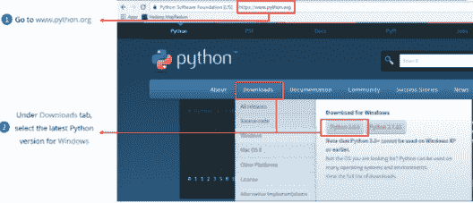**

## **Python Windows 版安装**

Python Windows 版安装

1.  在[【python.org】](https://www.python.org/)打开浏览器窗口，导航至[Windows](https://www.python.org/downloads/windows/)下载页面。
2.  在顶部标题“Python Windows 版本”下，点击最新 Python 3 版本——Python 3 . x . x 的链接(在撰写本文时，最新版本是 Python 3.7.2。)
3.  滚动到底部，选择 64 位的 Windows x86-64 可执行安装程序或 32 位的 Windows x86 可执行安装程序。

但是我们应该选择 32 位还是 64 位的安装程序呢？

对于 Windows，您可以选择 32 位或 64 位安装程序。这两者之间的区别归结为:

*   如果您的系统有 32 位处理器，那么您应该选择 32 位安装程序。
*   在 64 位系统上，这两个安装程序实际上都可以满足大多数需求。32 位版本通常使用较少的内存，但 64 位版本对于计算密集型应用程序来说性能更好。
*   如果你不确定选择哪个版本，就选择 64 位版本。

打开安装程序，点击“运行”。

#### **Python Linux 安装**

使用图形化的 linux 安装在 linux 上安装 python。遵循以下步骤:

*   打开 Ubuntu 软件中心文件夹。
*   从所有软件下拉列表框中选择开发者工具(或开发)。
*   双击 Python 3.3.4 条目。
*   点击安装。
*   关闭 Ubuntu 软件中心文件夹。

Python 已经可以使用了。

#### **Mac 版 Python 安装**

在安装 Python 之前，你需要安装 GCC。GCC 可以通过下载 Xcode，更小的 [命令行工具](https://developer.apple.com/downloads/) 或者更小的 OSX-GCC-Installer 包来获得。

虽然 OS X 附带了大量的 Unix 实用程序，但熟悉 Linux 系统的人会注意到缺少一个关键组件:包管理器。 [家酿](https://brew.sh/) 填补了这一空白。

一旦你安装了家酿，在你的 **路径** 环境变量的顶部插入家酿目录。你可以在你的 ~/的底部添加下面一行。档案 档案

```
export PATH="/usr/local/opt/python/libexec/bin:$PATH"
```

现在，我们可以安装 Python 3:

```
$brew install python
```

### **Python IDE**

IDE 通常在一个 GUI(图形用户界面)中提供代码编辑器、编译器/解释器和调试器。它封装了代码创建、编译和测试的整个过程，提高了开发人员的工作效率。

使用 IDE 的开发人员从模型开始，IDE 将模型翻译成合适的代码。然后，IDE 调试并测试模型驱动的代码，自动化程度很高。一旦构建成功并经过适当的测试，就可以通过 ide 或 IDE 之外的其他工具进行部署，以进行进一步的测试。

#### **哪个 Python IDE？**

在为 Python 选择最佳 IDE 时，请始终牢记以下几点:

*   程序员的专业水平(初学者、专业人员)
*   使用 Python 的行业或部门类型
*   购买商业版本或坚持免费版本的能力
*   正在开发的软件种类
*   需要与其他语言整合

一旦决定了这些要点，程序员就可以很容易地根据给定的特性在 ide 中进行选择。

#### **PyCharm**

PyCharm 由捷克公司 JetBrains 开发，是一个专门针对 Python 的 IDE。PyCharm 是一个跨平台的 IDE。因此，用户可以根据自己的需求下载任何 Windows、Mac 或 Linux 版本。老实说， [PyCharm](https://www.edureka.co/blog/pycharm-tutorial) 被认为是 Python 最好的 IDE 之一，并且无可非议地得到了最广泛的使用。

除了通用特性，PyCharm 还提供了其他特性，如:

*   允许在文件间快速切换的专业项目视图
*   与 [Django](https://www.edureka.co/blog/django-tutorial) 、Flask 和 web2py 一起促进 Web 开发
*   PyCharm 配备了 1000 多个插件，因此程序员可以编写自己的插件来扩展其功能

提供两个版本供下载，社区版为 *免费* 和付费 *专业版* 。程序员可以根据自己的需求下载相应的版本

#### **PyCharm 下载**

**前往**[**【www.jetbrains.com/pycharm/download/#section=windows】**](http://www.jetbrains.com/pycharm/download/#section=windows)

**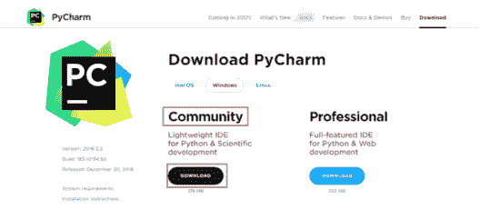**

在这里，社区版是免费的，但是对于专业版，需要购买授权。我将致力于 PyCharm 社区版本。

#### **PyCharm 社区版**

在这个 Python 教程中，我们还将看到如何使用 Pycharm，我将带你浏览这个界面。

让我们从创建一个新项目开始。你一打开它，PyCharm 就用下面的图片向你打招呼:

在这里，在左边，你可以查看我最近参与的所有项目。但是如果这是你第一次使用 PyCharm，那么左边的列不会包含任何内容。

创建一个新项目就像点击创建新项目标签一样简单。

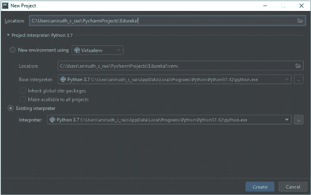

这张图片基本上可以帮助我们设置 Python 解释器。但是，如果您的系统 **上没有安装 Python，这可能是空白的。**

**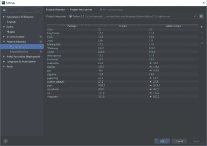**

点击右边的小齿轮图标，会弹出以下页面:

**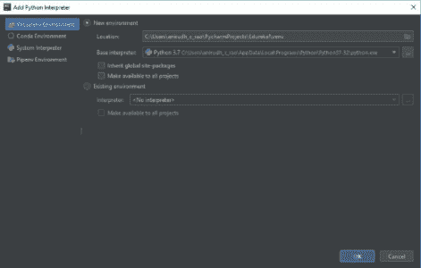**

在这里，如果没有单独安装 Python，可以利用系统解释器。一定要检查 Python 安装的版本，使其符合您的要求。

#### **Jupyter 笔记型电脑**

Jupyter 笔记本是一种强大的方式来编写和迭代你的 [Python](https://www.edureka.co/blog/learn-python-for-data-science/) 代码用于 [数据分析](https://www.edureka.co/blog/python-pandas-tutorial/) 。Jupyter Notebook 基于 IPython 构建，内核运行计算并与 Jupyter Notebook 前端接口通信。

Jupyter Notebook 是一个开源的网络应用程序，允许你创建和分享包含实时代码、公式、可视化和叙述性文本的文档。用于数据清洗和转换、数值模拟、统计建模、数据可视化、[](https://www.edureka.co/blog/what-is-machine-learning/)等等。

### **为什么要学 Python？**

Python 的语法非常容易理解。与其他语言相比，任务所需的代码行更少。让我给你举个例子——如果我必须打印“欢迎来到 Edureka！”我只需要输入:

```
print(&amp;amp;amp;amp;ldquo;Welcome To Edureka!&amp;amp;amp;amp;rdquo;)

```

我们来看看 Python 的一些很酷的特性:

1.  简单易学
2.  免费开源
3.  便携式
4.  支持不同的编程范式
5.  可扩展

如果你在想哪里可以用 Python (Python 应用)，那我来告诉你，那就是 Python 脱颖而出的地方。

它优于其他编程语言，因为它是:

*   语法精简语言
*   易于使用和学习
*   开源语言
*   动态存储分配
*   广泛的支持库
*   桌面 GUI 应用程序
*   商业应用
*   数据库访问
*   健壮的 Web 应用程序开发
*   支持数学和人工智能

### **Python 的历史**

Python 是吉多·范·罗苏姆在 20 世纪 80 年代末创造的一种编程语言。它是一种高级的通用编程语言，可用于许多应用程序。这种语言很容易扩展，并且有一个庞大而活跃的开源社区。

Python 有两个主要实现

*   Python 2 和
*   Python 3

语法相同但功能不同。Python 被认为是一种“元编程”语言，因为它的表达能力允许通过在解释器或单独的文件中编写一行代码来创建新的程序。这种编程语言包括递归、一级函数、闭包和显式类型等特性。

Python 版本于 2000 年 10 月 16 日发布，具有许多全新的特性，包括循环检测垃圾收集器和对 Unicode 的支持。

Python 版本于 2008 年 12 月 3 日发布。这是对不完全向后兼容的编程语言的重要修订。它的许多重要特性都被移植到了 Python 2.6。以及 2.7 版本系列。Python 3 系列的进一步版本包括 2 到 3 的实用程序，它自动(至少部分地)将 Python 2 代码翻译成 Python 3。

Python 2.7 版本的截止日期最初定在 2015 年，后来推迟到 2020 年，因为担心大量现有代码不容易移植到 Python 3。现在不会有更多的安全补丁或其他改进将被释放。对于 Python 2 life outdation，仅支持 Python 3.6.x 和更高版本。

Python 3.9.2 和 3.8.8 得到了加速，因为 Python 的所有版本(包括 2.7)都存在安全问题，导致可能的远程代码执行和 web 缓存中毒。

### **Python 2 Vs Python 3**

| **Sl.no** | **Python 2** | **Python 3** |
| 1。 | 它进行近似，即在整数除法中向上舍入到最接近的整数(7 除以 2 得出 3) | 它给出了准确的结果(7 除以 2 得出 3.5)。Python 3 中的整数除法变得非常精确，从而得到精确的值 |
| 2。 | 它的语法很难理解 | 相比之下，语法更简单，也更容易理解。 |
| 3。 | 存储需要用“u”定义 Unicode 字符串值。 | 字符串的默认存储是 Unicode。 |
| 4。 | 无论何时在 for 循环中使用全局变量，它的值都会改变。 | 变量值不变。 |
| 5。 | 异常包含在符号中。 | 异常用括号括起来。 |
| 6。 | 排序比较规则比较复杂。 | 排序比较规则非常简单。 |
| 7。 | 在这个版本中，xrange()用于迭代。 | 它提供了一个 Range()函数来执行迭代。 |

### **Python 的应用**

Python 是一种通用编程语言，用于各种各样的应用。它是一种解释性的、面向对象的高级编程语言，其设计理念强调代码可读性 在本 python 教程中，我们认为您有必要了解它的应用。

该语言拥有广泛的标准库和许多第三方模块。这些库和模块可用于开发桌面应用程序、web 应用程序和游戏。下面简要介绍了这些应用:

1.  ***Web 和互联网开发*** **:** 框架、微框架、内容管理系统，凡是你能想到的，他们都有！Python 为 web 开发提供了大量的选择。这些选项还包括 BeautifulSoup 和 Twisted Python 等抓取工具，用于异步网络编程和对 HTML、XML、JSON、FTP、IMAP 等的协议支持。
2.  ***科学与数值*** :你无法想象图片中没有 Python 的科学计算。像 numpy、pandas、Scipy 等流行的包使 Python 成为科学和数字应用的首选语言。
3.  ***软件开发*** **:** Python 因其对构建控制、管理、测试等的巨大支持而在软件开发人员中树立了良好的声誉。一些流行的软件包包括 SCons、Apache Gump、BuildBot 等。
4.  ***桌面 GUI*****:**大多数默认 python 发行版都默认有 [Tk](http://wiki.python.org/moin/TkInter) 库。你也有特定于平台的工具，比如 GTK+和微软基础类
5.  ***业务应用*** **:** Python 用于构建 ERP 和电子商务系统。一些流行的应用平台和管理系统包括 [Odoo](https://www.odoo.com/) 和 [Tryton](http://www.tryton.org/)

让我们现在开始用 Python 编码。

## **Python 基础知识**

任何编程语言中的基本概念都是任何程序员的基础，我们就从 python 中最基本的概念开始。

### **Python 关键词**

关键字不过是 python 中已经存在的特殊名称。在编写 python 程序时，我们可以将这些关键字用于特定的功能。

以下是我们在 python 中拥有的所有关键字的列表:

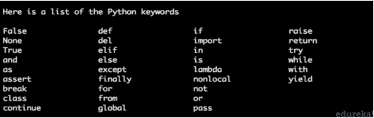

**语法和用法**

```
import keyword
keyword.kwlist
#this will get you the list of all keywords in python.
keyword.iskeyword('try')
#this will return true, if the mentioned name is a keyword.

```

**标识符**是用户定义的名字，我们用来表示变量、类、函数、模块等。

**语法和用法**

```
name = 'edureka'
my_identifier = name

```

### Python 流行库:

本 python 教程还将解释一些最流行的 Python 库

*   **Tensorflow:** 它专门用于开发和训练高效的机器学习和深度学习模型，Tensorflow 还可以帮助您轻松地将这些模型部署到许多平台上，如 CPU、GPU(图形处理单元)或 TPU(张量处理单元)。
*   这个库被用来增加对大型多维数组和矩阵的支持，伴随着大量的高级数学函数来操作这些数组。
*   这是一个专门为 Python 编程语言开发的软件库，用于数据分析和操作。
*   Keras: 这是一个开源的软件库&允许人工神经网络的 Python 接口。
*   **Matplotlib:** 是 Python 及其数值数学扩展 NumPy 中用于绘图的库。

### **Python 评论**

程序员一致的陈述，描述一段代码意味着什么。当你写大型代码时，它们变得非常有用。当你有一百页左右的程序时，记住每个变量的名字实际上是不人道的。因此，利用注释将使您或其他人阅读和修改代码变得非常容易。

**语法**

```
#this is a single line comment
#this is a multi
#line comment
"""this is a docstring 
comment 
i hope it is clear
"""

```

#### **Python 块注释**

python 中的块注释是用和代码一样的缩进来写的，它是用来解释代码的。块注释看起来类似于下面的例子。

```
# this is a print statement
print(&amp;amp;amp;amp;ldquo;hello world&amp;amp;amp;amp;rdquo;)

```

### **Python 变量**

变量不过是用来存储值的保留内存位置。这意味着当你创建一个变量时，你在内存中保留了一些空间。

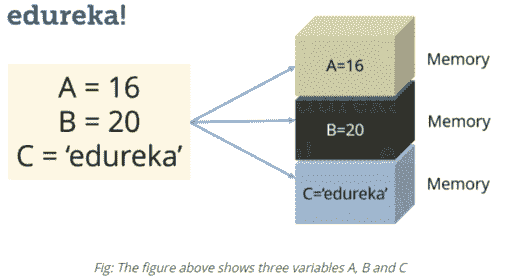

在 Python 中，你不需要在使用它之前声明变量，不像其他语言如 Java，C 等等。

#### **给变量赋值**

Python 变量不需要显式声明来预留内存空间。当你给一个变量赋值时，声明自动发生。等号(=)用于给变量赋值。考虑下面的例子:

**语法**

```
S = 10
print(S)

```

这会将值‘10’赋给变量‘S’并打印出来。你自己试试。

#### **Python 全局变量**

在 python 中，GLOBAL 关键字可以用来访问/修改当前作用域之外的变量。

**语法**

```
A = 10
Def function():
 	global a
	A += 10
	print(A)
print(A)
function()

```

### **Python 中的数据类型**

Python 支持各种数据类型，这些数据类型定义了对变量可能的操作和存储方法。 在 Python 教程的这一节，我们将介绍 Python 中一些常用的数据类型。

**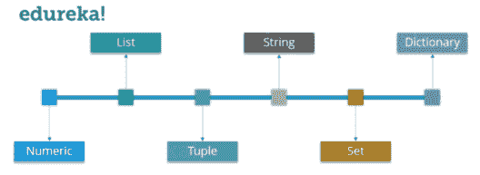**

我们来详细讨论一下其中的每一个。在本 Python 教程中，我们将从“字符串”数据类型开始。

#### **Python 字符串**

字符串是 Python 中最流行的数据类型之一。我们可以简单地用引号将字符括起来来创建它们。Python 以完全相同的方式处理单引号和双引号。考虑下面的例子:

**语法**

```
S= "Welcome To edureka!"
D = 'edureka!'

```

#### **Python 字符串方法**

python 中使用的一些字符串方法写在下面:

1.  strip()
2.  Count()
3.  split()
4.  translate()
5.  索引()
6.  格式()
7.  找到()
8.  中心()
9.  join()

#### **Python 字符串操作**

| **语法** | **操作** |
| print (len(String_Name)) | 字符串长度 |
| print(String _ name . index(" Char ")) | 定位字符串中的一个字符 |
| print(String _ name . count(" Char ")) | 统计一个字符在一个字符串中重复出现的次数 |
| print(String _ Name[Start:Stop]) | 切片 |
| print (String_Name[::-1]) | 反转一个字符串 |
| print(String _ name . upper()) | 将字符串中的字母转换成大写 |
| print(String _ name . lower()) | 将字符串中的字母转换成小写 |

#### **在 Python 中格式化字符串**

格式化一个字符串意味着在你想要的地方动态地分配这个字符串。

Python 中的字符串可以使用 format()方法进行格式化，这是一个非常通用和强大的字符串格式化工具。String 中的 Format 方法包含花括号{}作为占位符，这些占位符可以根据位置或关键字保存参数以指定顺序。

**例子**

```
String1 = "{1} {0} {2}".format('Hello', 'to', 'Batman')
print("nPositional order: ")
print(String1)

```

**输出:**

`Positional order: to Hello Batman`

#### **Python 数字**

正如预期的数字数据类型存储数值一样。 它们是不可变的数据类型，这意味着你不能改变它的值。 Python 支持三种不同的数值数据类型:

#### **Python 整数**

它保存所有整数值，即所有正负整数，例如–10。

#### **Python 浮动**

它保存实数，用十进制表示，有时甚至用科学符号 E 或 E 表示 10 的幂(2.5e2 = 2.5 x 102 = 250)，例如 10.24。

#### **Python 情结**

它们的形式是 a + bj，其中 a 和 b 是浮点数，J 代表-1(一个虚数)的平方根，例如–10+6j。

#### **Python 布尔型**

这些是决定性的数据类型，它们只返回分类值，即真或假。

现在你甚至可以执行类型转换。例如，您可以将整数值转换为浮点值，反之亦然。考虑下面的例子:

**语法和用法**

```
A = 10
# Convert it into float type
B = float(A)
print(B)

```

上面的代码将把一个整数值转换成一个浮点类型。同样，你可以将一个浮点值转换成整数类型:

```
A = 10.76
# Convert it into float type
B = int(A)
print(B)

```

#### **Python 列表**

在 C 中你可以把列表看作数组，但是在列表中你可以存储不同类型的元素，但是在数组中所有的元素应该是同一类型的。

List 是 Python 中最通用的数据类型，可以写成方括号内逗号分隔值(项目)的列表。考虑下面的例子:

**语法**

```
subjects = ['physics', 'chemistry','biology']
print(subjects)

```

**输出:** `['physics, 'chemistry','biology']`

请注意，主题列表既包含单词，也包含数字。现在，让我们在主题列表上执行一些操作。

让我们来看几个可以用列表执行的操作:

| **语法** | **结果** | **描述** |
| 科目[0] | 物理 | 这将给出主题列表中的索引 0 值。 |
| 科目[0:2] | 物理、化学 | 这将给出从 0 到 2 的索引值，但不包括 2 的主题列表。 |
| 科目[3]=‘生物’ | ['物理'，'化学'，'数学'，'生物'] | 它将更新列表，在索引 3 处添加“生物学”并删除 2。 |
| 德尔科目【2】 | ['物理'，'化学'，2] | 这将从主题列表中删除索引值 2。 |
| len(被试) | ['物理，'化学'，'数学'，2，1，2，3] | 这将返回列表的长度 |
| 科目* 2 | [‘Physics’, ‘Chemistry’, ‘Maths’, 2]['物理'，'化学'，'数学'，2] | 这将重复主题列表两次。 |
| 主题[::-1] | 【2，'数学'，'化学'，'物理'】 | 这将反转科目列表 |

#### **Python 列表删除**

```
a = [1,2,3,4,11,5]

a.remove(11)
#this will remove 11 from the list.

```

#### **Python 列表删除重复**

按照以下步骤从列表中删除重复项

1.  用列表中的相同值创建一个字典
2.  转换成列表
3.  打印转换后的列表。您将获得一个删除了重复项的列表。

```
Mylist = [a,b,c,b,c,a,c,a]
b = list(dict.fromkeys(Mylist))
print(b)

```

#### **Python 元组**

元组是一系列不可变的 Python 对象。元组是序列，就像列表一样。 我们将在本 python 教程中看到元组和列表的区别。

*   与列表不同，元组不能改变
*   元组使用括号，而列表使用方括号。考虑下面的例子:

**语法**

```

chelsea = ('hazard', 'terry', 'lampard')

```

现在你一定在想，既然我们有列表，为什么还要用元组呢？

所以简单的答案是，*元组比列表*快。如果你正在定义一组常量值，你只是想迭代，那么使用元组而不是列表。

伙计们，所有的 Tuple 操作都类似于 Lists，但是不能对一个 Tuple 进行元素的更新、删除或添加。

现在，不要偷懒，也不要指望我展示所有那些操作，你自己试试。

#### **Python 集**

集合是项目的无序集合。每个元素都是独一无二的。

集合是通过将所有的项目(元素)放在花括号{}中，用逗号分隔来创建的。考虑下面的例子:

**语法**

```
set_name = {1,2,3,4,5}

```

在集合中，每个元素都必须是唯一的。尝试打印下面的代码:

```
set_2 = {1,2,3,3,4,5}

```

这里 3 重复了两次，但它只会打印一次。

我们来看一些集合运算:

#### **工会:**

A 和 B 的并集是两个集合中所有元素的集合。使用|运算符执行 Union。考虑下面的例子:

```
A = {1, 2, 3, 4}
B = {3, 4, 5, 6}
print ( A | B)

```

```
**Output** = {1, 2, 3, 4, 5, 6}
```

#### **交点:**

A 和 B 的交集是两个集合中共同的元素的集合。使用&算子进行求交。考虑下面的例子:

```
A = {1, 2, 3, 4}
B = {3, 4, 5, 6}
print ( A &amp;amp;amp;amp; B )

```

`**Output: **{3,4}`

#### **区别:**

A 和 B 的差(A–B)是只在 A 中而不在 B 中的元素的集合，同样，B–A 是 B 中而不在 A 中的元素的集合，考虑下面的例子:

```
A = {1, 2, 3, 4, 5}
B = {4, 5, 6, 7, 8}
print(A - B)

```

`**Output: **{1,2,3}`

#### **Python 字典**

任何 python 教程，如果没有字典的恰当解释，都是毫无价值的。现在让我用一个例子来解释你的字典。

我猜你们都知道阿德哈尔卡。对于那些不知道它是什么的人来说，它只不过是发给所有印度公民的一个唯一的 ID。因此，对于每个 Aadhaar 号码，都有一个名称和一些其他细节。

现在，你可以把 Aadhaar 号码看作是一把“钥匙”,把这个人的详细资料看作是这把钥匙的价值。

字典包含这些用花括号括起来的“键值”对，键和值用“:”分隔。考虑下面的例子:

**语法**

```
dictionary_name = {key: value, key2: value2}

```

你知道该怎么做，现在是各种字典操作。

#### *从字典中获取元素:*

```
Dict = {'Name' : 'Saurabh', 'Age' : 23}
print(Dict['Name'])

```

`**Output** = Saurabh`

#### *改变字典中的元素:*

```
Dict = {'Name' : 'Saurabh', 'Age' : 23}
Dict['Age'] = 32
Dict['Address'] = 'Starc Tower'

```

`**Output** = {'Name' = 'Saurabh', 'Age' = 32, 'Address' = 'Starc Tower'}`

#### **字典方法**

*   清除()

*   复制()

*   值()

*   更新()

*   fromkeys()

*   获取()

*   项目()

*   按键()

*   流行()

*   popitem()

*   setdefault()

### **Python 中的运算符**

运算符是可以操作操作数值的结构。考虑表达式 2 + 3 = 5，这里 2 和 3 是操作数，+称为运算符。

Python 支持以下类型的操作符:

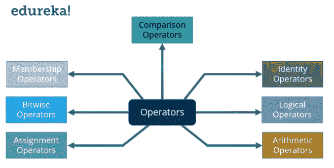

让我们逐一关注这些操作符。

### **算术运算符:**

这些运算符用于执行加法、减法等数学运算。假设下表中 A = 10，B = 20。

| **操作员** | **描述** | **例如** |
| +加法 | 将运算符两侧的值相加 | A + B = 30 |
| –减法 | 用左手运算符减去右手运算符 | A–B =-10 |
| *乘法 | 将运算符两边的值相乘 | A * B = 200 |
| /分部 | 用右手运算符除左手操作数 | A / B = 0.5 |
| %模数 | 左操作数除以右操作数，返回余数 | B % A = 0 |
| **指数 | 对运算符执行指数(幂)计算 | A ** B = 10 的 20 次方 |

考虑下面的例子:

```
a = 21
b = 10
c = 0

c = a + b
print ( c )

c = a - b
print ( c )

c = a * b
print ( c )

c = a / b
print ( c )

c = a % b
print ( c )
a = 2
b = 3
c = a**b
print ( c )

```

```
**Output** = 31, 11, 210, 2.1, 1, 8
```

现在让我们来看看比较运算符。

#### **比较运算符:**

这些运算符比较两边的值，并确定它们之间的关系。假设 A = 10，B = 20。

| **操作员** | **描述** | **例如** |
| == | 

&#124; 如果两个操作数的值相等，那么条件变为真。 &#124;

 | (A == B)不成立 |
| ！= | 

&#124; 如果两个操作数的值不相等，那么条件为真。 &#124;

 | (一！= B)为真 |
| > | 如果左操作数的值大于右操作数的值，则条件为真。 | (a > b)不成立 |
| < | 如果左操作数的值小于右操作数的值，则条件为真。 | (a < b)为真 |
| > = | 如果左操作数的值大于或等于右操作数的值，则条件为真。 | (a > = b)不成立 |
| < = | 如果左操作数的值小于或等于右操作数的值，则条件为真。 | (a < = b)为真 |

考虑下面的例子:

```
a = 21
b = 10
c = 0

if ( a == b ):
   print ("a is equal to b")
else:
   print ("a is not equal to b")

if ( a != b ):
   print ("a is not equal to b")
else:
   print ("a is equal to b")

if ( a &amp;amp;amp;lt; b ): print ("a is less than b") else: print ("a is not less than b") if ( a &amp;amp;amp;gt; b ):
   print ("a is greater than b")
else:
   print ("a is not greater than b")

a = 5
b = 20
if ( a &amp;amp;amp;lt;= b ): print ("a is either less than or equal to b") else: print ("a is neither less than nor equal to b") if ( a =&amp;amp;amp;gt; b ):
   print ("a is either greater than  or equal to b")
else:
   print ("a is neither greater than  nor equal to b")

```

```
**Output** = a is not equal to b
         a is not equal to b
         a is not less than b
         a is greater than b
         a is either less than or equal to b
         b is either greater than or equal to b
```

在上面的例子中，我使用了条件语句(if，else)。它的基本意思是，如果条件为真，则执行 print 语句，否则在 else 中执行 print 语句。我们将在这个 Python 教程博客的后面理解这些陈述。

### **赋值运算符:**

一个*赋值操作符*是用于*给*变量赋值的*操作符*。假设下表中 A = 10，B = 20。

| **操作员** | **描述** | **例如** |
| = | 将右侧操作数的值分配给左侧操作数 | c = a + b 将 a + b 的值赋给 c |
| +=相加和 | 将右操作数与左操作数相加，并将结果赋给左操作数 | c += a 等价于 c = c + a |
| -=减法和 | 从左操作数中减去右操作数，并将结果赋给左操作数 | c -= a 等价于 c = c–a |
| *=乘和 | 将右操作数与左操作数相乘，并将结果赋给左操作数 | c *= a 等价于 c = c * a |
| /=除和 | 将左操作数除以右操作数，并将结果赋给左操作数 | c /= a 相当于 c = c / a |
| %=模数和 | 使用两个操作数取模，并将结果赋给左操作数 | c %= a 相当于 c = c % a |
| **=指数和 | 对运算符执行指数(幂)计算，并将值赋给左操作数 | c **= a 相当于 c = c ** a |

考虑下面的例子:

```
a = 21
b = 10
c = 0

c = a + b
print ( c )

c += a
print ( c )

c *= a
print ( c )

c /= a
print ( c )

c  = 2
c %= a
print ( c )

c **= a
print ( c )

```

```
**Output** = 31, 52, 1092, 52.0, 2, 2097152, 99864
```

### **按位运算符:**

这些操作直接操纵**位**。在所有的计算机中，数字都是用比特，一系列的 0 和 1 来表示的。事实上，计算机中几乎所有的东西都是用比特来表示的。考虑下面的例子:

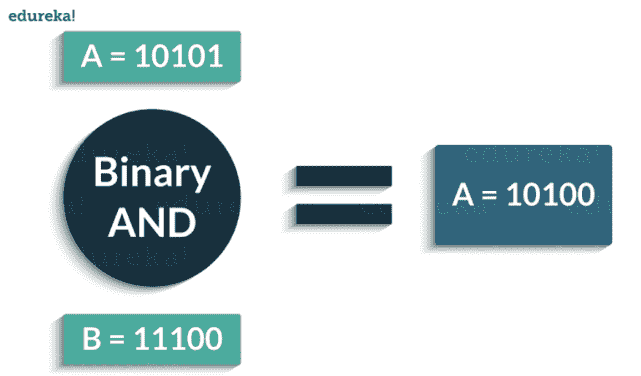

以下是 Python 支持的按位运算符:

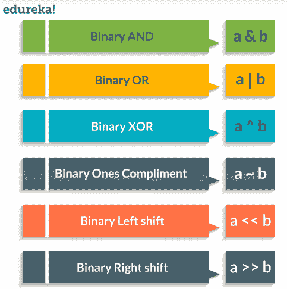

考虑下面的例子:

```
a = 58        # 111010
b = 13        # 1101
c = 0

c = a &amp;amp;amp;amp; b     
print ( c )   # 8 = 1000

c = a | b      
print ( c )   # 63 = 111111

c = a ^ b     
print ( c )   # 55 = 110111

c = a &amp;amp;amp;gt;&amp;amp;amp;gt; 2 
print ( c )   # 232 = 11101000 

c = a &amp;amp;amp;lt;&amp;amp;amp;lt; 2    
print ( c )   # 14 = 1110

```

```
**Output** = 8,63,55,232,14
```

接下来，在这篇面向初学者的 Python 编程教程中，我们将关注逻辑运算符。

### **逻辑运算符:**

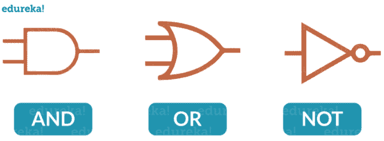以下是 Python 中出现的逻辑运算符:

| **操作员** | **描述** | **例如** |
| 和 | 如果两个操作数都为真，则为真 | X 和 Y |
| 或 | 如果任一操作数为真，则为真 | X 或 Y |
| 不是 | 如果操作数为假，则为真(对操作数进行补码) | 不是 X |

考虑下面的例子:

```
x = True
y = False

print('x and y is',x and y)

print('x or y is',x or y)

print('not x is',not x)

```

现在在 Python 教程中，我们将学习成员运算符。

### **会员操作符:**

这些运算符用于测试一个值或一个变量是否出现在一个序列(列表、元组、集合、字符串、字典)中。 下面是隶属度操作符:

| **操作员** | **描述** | **例如** |
| 中的 | 如果在序列中找到值/变量，则为真 | 5 英寸 x |
| 不在 | 如果在序列中未找到值/变量，则为真 | 5 不在 x |

考虑下面的例子:

```
X = [1, 2, 3, 4]
A = 3
print(A in X)
print(A not in X)

```

`Output = True`

`False`

接下来在 Python 教程中，我们该理解最后一个运算符，即恒等运算符。

### **身份符:**

这些运算符用于检查两个值(或变量)是否位于内存的同一部分。两个变量相等并不意味着它们是相同的。

以下是 Python 中的恒等运算符:

| **操作员** | **描述** | **例如** |
| 是 | 如果操作数相同，则为真 | x 为真 |
| 不是 | 如果操作数不相同，则为真 | x 不为真 |

考虑下面的例子:

```
X1 = 'Welcome To edureka!'

X2 = 1234

Y1 = 'Welcome To edureka!'

Y2 = 1234

print(X1 is Y1)

print(X1 is not Y1)

print(X1 is not Y2)

print(X1 is X2)

```

`**Output: **True `

`False`

`True`

`False`

### **Python 中的条件语句**

考虑下面所示的流程图:

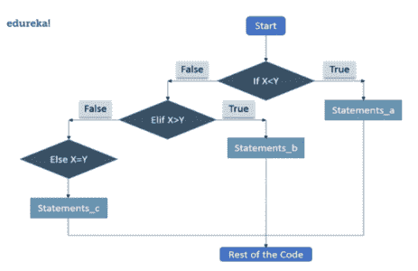

让我告诉你它实际上是如何运作的。

*   首先，控制器将检查“如果”条件。如果为真，则控件将执行 If 条件后的语句。
*   当“If”条件为假时，控制将检查“Elif”条件。如果 Elif 条件为真，则控制将在 Elif 条件之后执行语句。
*   如果“Elif”条件也为假，则控制将执行 Else 语句。

**语法**

```
if condition1:
    statements

elif condition2:
    statements

else:
    statements

```

请看下面的例子:

```
X = 10
Y = 12

if X &amp;amp;amp;lt; Y: print('X is less than Y') elif X &amp;amp;amp;gt; Y:
    print('X is greater than Y')
else:
    print('X and Y are equal')

```

`**Output: **X is less than Y`

## **循环**

本 python 教程还会讲解循环。一般来说，语句是顺序执行的。首先执行函数中的第一条语句，然后是第二条语句，依此类推

可能会出现需要多次执行一段代码的情况

循环语句允许我们多次执行一条或一组语句。下图说明了一个循环语句:

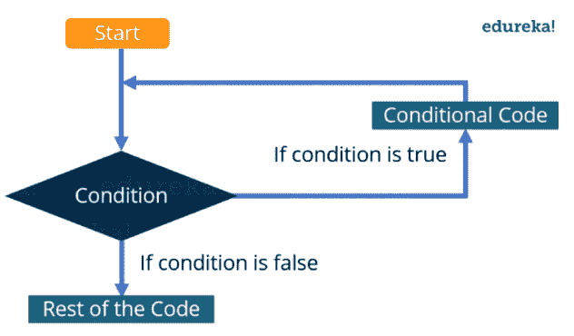我来给你解释一下上图:

*   首先，控制器将检查条件。如果为真，则控制将移动到循环内部，并执行循环内部的语句。
*   现在，控制将再次检查条件，如果仍然为真，则再次执行循环内的语句。
*   这个过程将不断重复，直到条件变为假。一旦条件变为假，控制将移出循环。

有两种类型的循环:

*   无限:当条件永远不会变为假时
*   有限:在某一点上，条件将变为假，控制将移出循环

还有一种对循环进行分类的方法:

*   预测试:在这种类型的循环中，首先检查条件，然后只有控制在循环内移动
*   后测试:这里首先执行循环内的语句，然后检查条件

Python 不支持后测试循环。

### **Python 中的循环**

在 Python 中，有三个循环:

*   而
*   为
*   嵌套

#### **而循环**

这里，首先检查条件，如果条件为真，控制将进入循环并执行循环中的语句，直到条件为假。当我们不确定我们需要执行一组语句多少次时，我们使用这个循环，或者你可以说当我们不确定迭代的次数时。

考虑这个例子:

**语法和用法**

```
count = 0
while (count &amp;amp;amp;lt; 10):
   print ( count )
   count = count + 1

print ("Good bye!")

```

```
**Output** = 0
         1
         2
         3
         4
         5
         6
         7
         8
         9
         Good bye!
```

#### **为循环**

与 While 循环一样，For 循环也允许代码块重复一定次数。不同之处在于，在 For 循环中，我们知道所需的迭代次数，这与 While 循环不同，While 循环的迭代次数取决于条件。通过查看语法:，您将对两者之间的区别有更好的了解

**语法**

```
for variable in Sequence:
    statements

```

注意这里，我们已经指定了范围，这意味着我们知道代码块将被执行的次数。

考虑这个例子:

```
fruits = ['Banana', 'Apple',  'Grapes']

for index in range(len(fruits)):
   print (fruits[index])

```

```
**Output:** Banana        Apple         Grapes
```

#### **嵌套循环**

它的基本意思是循环中的循环。它可以是 While 循环中的 For 循环，反之亦然。甚至 For 循环也可以在 For 循环内部，While 循环也可以在 While 循环内部。

考虑这个例子:

```

count = 1
for i in range(10):
    print (str(i) * i)

    for j in range(0, i):
        count = count +1

```

```
**Output** 
1
22
333
4444
55555
666666
7777777
88888888
999999999
```

现在是本 Python 教程介绍函数的最佳时机。

### **流行 Python 框架:**

姜戈

与其他框架不同，Django 是一个基于 python 的开源&免费使用的 web 框架，它包含大量内置特性，而不是作为单独的库提供。Django 使用它的 ORM 将对象映射到数据库表。虽然 Django 对 MySQL、SQLite、PostgreSQL 和 Oracle 数据库的支持值得称赞，但它也可以通过第三方驱动程序支持其他数据库。

**烧瓶**

Flask 允许开发者建立一个 web 应用程序基础，从这个基础上可以使用任何需要的扩展，因为它是一个用 Python 编写的微 web 框架。Flask 兼容 Google App Engine。

### **AIOHTTP**

这是一个非常依赖于 Python 3.5+特性的 Python 框架，比如 async &等。它允许请求对象和路由器授权将查询重定向到为处理查询而开发的函数。

**瓶子**

瓶子是一个微框架，为每个开发的应用程序生成一个单独的源文件。它是最好的 python web 框架之一，被设计成快速、简单&的轻量级。这个 Python 的微框架最初是为构建 API 而创建的。

**CherryPy**

它是一个著名的开源、面向对象的 web 应用框架，遵循极简主义的方法。任何 CherryPy 支持的 web 应用程序都是独立的 Python 应用程序，具有自己的嵌入式多线程 web 服务器，可以在任何支持 Python 的操作系统上运行，因为它是为快速开发 web 应用程序而设计的。

**web2py**

Web2py 是用 Python 编程语言编写的开源 Web 应用框架。Web2py 允许 Web 开发人员使用 Python 对动态 web 内容进行编程。

**塔架工程**

这个框架是一个开源项目。该组织的目的是使用 Python 开发一套 web 应用技术。

## **Python 中的文件输入/输出**

Python 有一个内置函数 open()，用来打开一个文件。这个函数返回一个文件对象，也称为句柄，因为它被用来相应地读取或修改文件。 我们可以指定打开文件时的模式。在模式中，我们指定是否要

*   阅读‘r’
*   写下‘w’或
*   将‘a’追加到文件中。我们还指定了是以文本模式还是二进制模式打开文件。

默认是以文本模式阅读。在这种模式下，我们从文件中读取时会得到字符串。

**语法**

```
o = open("edureka.txt")      # equivalent to 'r' or 'rt'
o = open ("edureka.txt",'w') # write in text mode
o = open ("img1.bmp",'rb' )  # read and write in binary mode

```

### **如何使用 Python 关闭文件？**

当我们完成对文件的操作后，我们需要正确地关闭文件。

关闭文件将释放与文件绑定的资源，这是使用 Python close()方法完成的。

```
o = open ("edureka.txt")
o.close()

```

## **Python 模块**

本 python 教程还会讲解 python 中有哪些模块。模块只是一个“程序逻辑”或“python 脚本”，可用于各种应用程序或 [功能](https://www.edureka.co/blog/python-functions) 。我们可以在一个模块中声明函数、类等。

重点是将代码分解成不同的模块，这样就不会有或最少的相互依赖。在代码中使用模块有助于编写更少的代码行，这是为重用代码而开发的单一过程。它还消除了反复编写相同逻辑的需要。

### **Python 内置模块**

内置模块用 C 语言编写，集成了 python 解释器。每个内置模块都包含用于某些特定功能的资源，如操作系统管理、磁盘输入/输出等。

标准库也有许多包含有用工具的 python 脚本。python 中有几个内置模块供我们使用，我们可以随时使用。

一些最常见和最有用的内置模块有:

*   OS
*   数学
*   随机
*   DATETIME

### **Python 中的 OS 模块**

Python 中的 OS 模块是编程语言标准库的一部分。导入时，它允许用户与 Python 当前运行的本地操作系统进行交互。简而言之，它为用户提供了一种简单的方式来与一些在日常编程中很方便的操作系统功能进行交互。

示例:os.popen():该函数是文件对象操作的一部分，用于打开与命令之间的管道。根据您使用 r 或 w，可以读取或写入此函数的返回值。此函数的语法如下，os.popen(command[，mode[，bufsize]])。考虑的参数有模式和缓冲区大小。为了更好地理解这一点，请看下面的例子。

```
import os 
fd = "GFG.txt"

# popen() is similar to open() 
file = open(fd, 'w') 
file.write("Hello") 
file.close() 
file = open(fd, 'r') 
text = file.read() 
print(text) 

# popen() provides a pipe/gateway and accesses the file directly 
file = os.popen(fd, 'w') 
file.write("Hello") 
# File not closed, shown in the next function.

```

输出:

### **Python 中的数学模块**

python 中的 math 模块定义了一些最重要的数学函数，下面的例子展示了我们如何在程序中使用它。

```
import math
print(math.pi)
#it will print the value of pi

```

### **Python 中的随机模块**

random 模块中的函数使用 random()函数生成一个伪随机数，该函数生成一个从 0.0 到 1.0 的浮点数。

下面的例子展示了如何在 python 程序中使用 random。

```
import random
print(random.random())

```

### **Python 中的 Datetime 模块**

python 中的日期不是它自己的类型，我们可以通过使用 python 中的 datetime 模块来处理它。下面的例子展示了如何在 python 程序中使用它。

```
import datetime
print(datetime.datetime.now())
#it will print the current date and time

```

## **Python 哎呀**

OOPs 指的是 Python 中的面向对象编程。Python 不是完全面向对象的，因为它包含一些过程函数。现在，您一定想知道过程式编程和面向对象编程之间的区别。为了澄清你的疑问，在过程化编程中，整个代码被写成一个长过程，即使它可能包含函数和子例程。这是不可管理的，因为数据和逻辑混杂在一起。但当我们谈到面向对象编程时，程序被拆分成自包含的对象或几个迷你程序。每个对象代表应用程序的不同部分，它们有自己的数据和逻辑来相互通信。例如，一个网站有不同的对象，如图像、视频等。

### **Python 类**

python 中的类是创建特定对象的蓝图。它让你以一种特殊的方式构建你的软件。这就出现了一个问题如何？类允许我们以一种易于重用的方式对数据和函数进行逻辑分组，如果需要的话，还可以在此基础上进行构建。

使用一个类，你可以给你的程序增加一致性，这样它们就能以更干净有效的方式被使用。属性是数据成员(类变量和实例变量)和通过点符号访问的方法。

*   **类变量**是由一个类的所有不同对象/实例共享的变量。
*   **实例变量**是每个实例唯一的变量。它是在方法内部定义的，只属于类的当前实例。
*   **方法**也被称为函数，它们被定义在一个类中，描述一个对象的行为。

要用 python 创建一个类，考虑下面的例子:

```
class employee:
 pass
 #no attributes and methods
 emp_1=employee()
 emp_2=employee()
 #instance variable can be created manually
 emp_1.first='aayushi'
 emp_1.last='Johari'
 emp_1.email='aayushi@edureka.co'
 emp_1.pay=10000

emp_2.first='test'
 emp_2.last='abc'
 emp_2.email='test@company.com'
 emp_2.pay=10000
 print(emp_1.email)
 print(emp_2.email)

```

**输出** :

```
aayushi@edureka.co
test@company.com
```

#### **Python 继承**

继承允许我们从基类/父类继承属性和方法。这很有用，因为我们可以创建子类并从父类获得所有功能。然后，我们可以在不影响父类的情况下覆盖和添加新功能。

继承属性的类称为 **子** 类，而属性被继承的类称为 **父** 类。

比方说，我想为不同类型的雇员创建类。我将创建“开发人员”和“经理”作为子类，因为开发人员和经理都有姓名、电子邮件和工资，所有这些功能都将存在于雇员类中。因此，我们可以简单地通过继承 employee 来重用代码，而不是复制子类的代码。

```
class employee:
    num_employee=0
    raise_amount=1.04
    def __init__(self, first, last, sal):
        self.first=first
        self.last=last
        self.sal=sal
        self.email=first + '.' + last + '@company.com'
        employee.num_employee+=1
    def fullname (self):
        return '{} {}'.format(self.first, self.last)
    def apply_raise (self):
        self.sal=int(self.sal * raise_amount)
class developer(employee):
    pass

emp_1=developer('aayushi', 'johari', 1000000)
print(emp_1.email)

```

**输出:**

```
aayushi.johari@company.com
```

这就把我们带到了本文的结尾，在这里我们学习了 Python 编程。我希望你清楚地了解在这个博客中与你分享的一切。 如果您还有其他问题或建议，请在下面留下您的评论，我们将尽快回复您。

*如果您觉得这篇文章与“Python 编程”相关，请查看一下  Edureka 的 Python 认证课程，这是一家值得信赖的在线学习公司，拥有遍布全球的 250，000 多名满意的学习者。*

*我们在这里帮助你踏上旅程的每一步，并为想要成为  [Python 开发者](https://www.edureka.co/blog/how-to-become-a-python-developer/)的学生和专业人士设计课程。该课程旨在让您在 Python 编程方面有一个良好的开端，并训练您掌握核心和高级 Python 概念以及各种  [Python 框架](https://www.edureka.co/blog/python-frameworks/) ，如  [Django。](https://www.edureka.co/blog/django-tutorial/)*

如果您遇到任何问题，请在“Python 编程”的评论区提出您的所有问题，我们的团队将很乐意回答。