# Spring 教程——一个提供效率的 Java 框架

> 原文：<https://www.edureka.co/blog/spring-tutorial/>

厌倦了过多的编码？寻找快速有效的东西，最重要的是让你不用写成千上万行代码？这篇关于 Spring 教程的博客是关于有史以来最有效的 Java 框架之一——Spring Framework。我非常确信，当你读完这篇 Spring 教程博客时，你将会对 Spring 框架有很好的了解。

以下是我将在这个春季教程中涉及的主题:

*   [什么是 Spring 框架，它是如何工作的？](#WhatIsSpring)
*   [为什么我们在 Java 中使用 Spring？](#Advantages)
*   【Java 和 Spring 有什么区别？
*   [弹簧框架架构](#Architecture)
*   [弹簧框架的模块](#Modules)
*   [IDE 安装](#IDE)
*   [第一春应用](#Application)
*   [春运国际奥委会集装箱](#IoC)
*   [依赖注入](#DI)
*   [春季 AOP](#AOP)
*   [春天 MVC](#MVC)

那么，让我们从第一个话题开始。

## **什么是 Spring 框架，它是如何工作的？**

## 

Spring 是一个强大的轻量级应用开发框架，用于 Java 企业版(JEE)。 在某种程度上，它是框架 的一个 *框架，因为它提供了对各种框架如 Struts、Hibernate、Tapestry、EJB、JSF 等的支持。从更广泛的意义上来说，框架可以被定义为一种结构，使用它你可以解决许多技术问题。你可以说 Spring 框架是一个支持使用 Java 编程语言的应用程序的综合工具。*

**Roderick B. Johnson，**2004 年一位澳大利亚计算机专家正式发布了 Spring 框架。自诞生以来，Spring 框架已经发布了许多版本。 **4.3.8** 是当前的 Spring 框架版本。

## **弹簧框架的特点**

*   **轻量:** Spring 框架在尺寸和透明度方面是轻量级的。

*   **控制反转(IoC):** 在 Spring 框架中，使用控制反转来实现松耦合。这些对象给出它们自己的依赖关系，而不是创建或寻找依赖对象。

*   **面向方面编程(AOP):** 通过将应用业务逻辑与系统服务分离，Spring Framework 支持面向方面编程，实现内聚开发。

*   **容器:** Spring 框架创建并管理应用对象的生命周期和配置。

*   **MVC 框架:** Spring 框架是一个 MVC 的 web 应用框架。该框架可通过接口进行配置，并支持多种视图技术。

*   **事务管理:**对于事务管理，Spring 框架提供了一个通用的抽象层。它不依赖于 J2EE 环境，而且它可用于无集装箱环境。
*   **JDBC 异常处理:**Spring 框架的 JDBC 抽象层提供了异常层次，简化了错误处理策略。

## **为什么我们在 Java 中使用 Spring？**

*   在 **POJO** s(普通旧 Java 对象)上工作，使你的应用程序轻量级。
*   为 JDBC、Hibernate、JPA 等提供预定义的模板。，从而减少您编写太多代码的工作量。
*   由于依赖注入特性，你的代码变得松散耦合。
*   使用 Spring 框架， **Java 企业版** (JEE)应用的开发变得更快。
*   它还为 Java 企业版(JEE)规范提供了强大的抽象。
*   它为事务、验证、缓存和格式化提供声明性支持。

但是由于拥有所有这些高级功能，人们往往会问这样的问题，

### **春天好学吗？**

所以让我用非常简单的术语来回答这个问题。是的，Java Spring 真的很容易学，因为整个 Spring 框架被设计成与 POJOs 一起工作，而不是依赖于特殊的接口、抽象类等等。

所以，现在让我们深入这个 Spring 教程，从 Java 和 Spring 之间最基本的区别开始。

## 【Java 和 Spring 有什么区别？

下表展示了 Java 和 Spring 之间的差异:

| **Java** | **春天** |
| Java 是市场上最重要的编程语言之一。 | Spring 是一个基于 Java 的开源应用框架。 |
| Java 为 web 应用程序开发提供了一个完整的企业应用程序框架栈，称为 Java EE | Spring 框架附带了各种模块，如 Spring MVC、Spring Boot、Spring Security，它们为 web 应用程序开发提供了各种现成的特性。 |
| Java EE 建立在一个三维架构框架之上，这个框架包括逻辑层、客户层和表示层。 | Spring 基于一个分层架构，由构建在其核心容器之上的各种模块组成。 |

自从它的起源至今，Spring 已经在各个领域传播它的流行。Spring Framework 现在是过去两三年中出现的各种其他 Spring 项目的基础。查看下图，了解 Spring 承担的各种项目。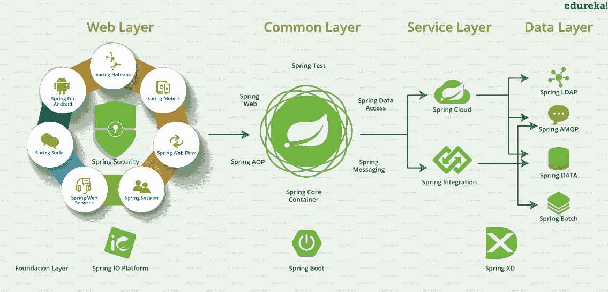

## **春天框架架构**

从下图中可以看出，Spring Framework 架构是一个有序的分层架构，由不同的模块组成。所有模块都有自己的功能，用于构建应用程序。大约有 **20 个模块**，概括为**核心容器**、**数据访问/集成**、 **Web** 、 **AOP** (面向方面编程)、**插装**和**测试**。在这里，开发人员可以自由选择所需的模块。它的模块化架构支持与其他框架的集成，没有太多麻烦。

现在让我们来详细探讨这些模块。我将从构建其余模块的核心容器开始，然后我将讨论数据访问，接着是 Web 和 AOP。最后，我将讨论一些杂项模块。 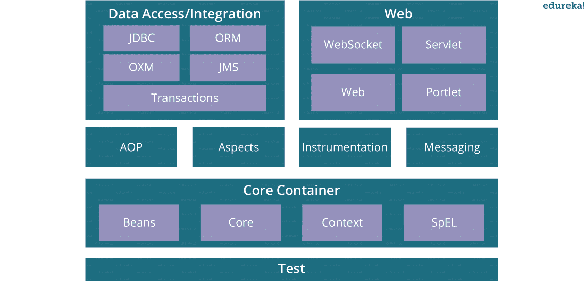

## **弹簧框架模块**

**核心容器**

该容器有以下四个模块:

1.  **Spring 核心:**该模块是 Spring 框架的核心。它用单例设计模式提供了 IoC(控制反转)和依赖注入等特性的实现。
2.  **Spring Bean:** 该模块通过 BeanFactory 实现工厂设计模式。
3.  **Spring Context:** 这个模块建立在 Core 和 Beans 模块提供的坚实基础之上，是访问任何已定义和配置的对象的媒介。
4.  **Spring Expression Languages(SpEL):**该模块是 Java server pages 支持的 expression language 的扩展。它为运行时查询和操作对象图提供了强大的表达式语言。

**春季数据访问/整合**

由以下五个模块组成:

1.  :该模块提供了JDBC 抽象层，消除了重复和不必要的异常处理开销。
2.  **ORM:**ORM 代表**O**object**R**relational**M**apping。该模块为我们的代码提供了一致性/可移植性，而不考虑基于面向对象映射概念的数据访问技术。
3.  【OXM】代表**O**object**X**ML**M**appers。它用于将对象转换成 XML 格式，反之亦然。Spring OXM 提供了一个统一的 API 来访问这些 OXM 框架。
4.  **JMS:** JMS 代表**J**ava**M**essaging**S**service。该模块包含在各种客户端之间生成和使用消息的功能。
5.  **事务:**这个模块支持对实现特殊接口的类和所有 POJOs 进行编程和声明式事务管理。通过使用这个模块，所有企业级事务实现概念都可以在 Spring 中实现。

**春网**

Web 层包括以下模块:

1.  **web** :该模块使用 servlet 监听器和面向 Web 的应用程序上下文，提供基本的面向 Web 的集成特性，如 多部分文件上传功能 和 IoC 容器的初始化。
2.  **Web-Servlet** :这个模块包含了基于**模型-视图-控制器** (MVC)的 Web 应用实现。它 提供了 MVC 的所有其他特性，包括 UI 标签和数据验证。
3.  **Web-Socket:**该 模块为 Web 应用中基于 WebSocket 的客户端与服务器之间的双向通信提供了支持。
4.  **we b-Portlet:**该模块也称为Spring-MVC-Portlet模块。它提供了对基于 Spring 的 Portlets 的支持，并反映了 Web-Servlet 模块的功能。

AOP 语言 是一个**强大的** **工具**，它允许开发者将企业功能添加到应用程序中，如交易、安全等。它允许我们编写更少的代码并分离代码逻辑。AOP 使用**横切关注点**。

**仪器仪表**

这个模块提供了在某些应用服务器中使用的类工具支持和类加载器实现。

**测试**

该模块支持用 JUnit 或 TestNG 测试 Spring 组件。它提供了 Spring**application contexts**的一致加载和这些上下文的缓存。它还提供了模拟对象，我们可以用它来单独测试我们的代码。

为了创建您的应用程序，您可能需要 IDE(集成开发环境)的帮助。IDE 是一个软件应用程序，它为程序员提供了软件开发的综合工具。市场上有各种 IDE 可供使用，这里我使用的是 **Eclipse IDE** ，因为它使用起来非常方便。那么现在让我们来看看如何安装 IDE 并开始编程。

*你可以浏览 Spring 教程的网上研讨会录像，我们的讲师已经详细地解释了这些主题，这将有助于你更好地理解 Spring 框架。*

## **春季初学者教程附实例| Edureka**

[https://www.youtube.com/embed/rMLP-NEPgnM?rel=0&showinfo=0](https://www.youtube.com/embed/rMLP-NEPgnM?rel=0&showinfo=0)

## **弹簧 IDE 安装**

**注意:**在开始安装 IDE 之前，需要在系统中安装 Java。如果你想安装 Java，可以参考这个[博客](https://www.edureka.co/blog/basic-java-tutorial-getting-started/)。

1.  去[www.eclipse.org](http://www.eclipse.org)。
2.  下载 Eclipse Neon 安装程序，并将其安装在您的 Windows 系统上。 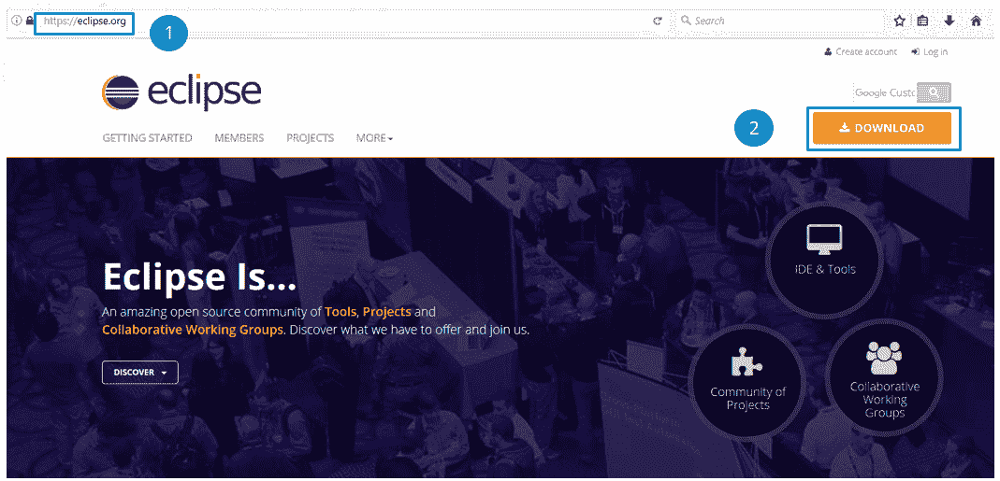
3.  现在你必须安装 Spring 插件。去帮助> Eclipse Marketplace。 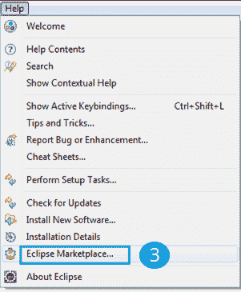
4.  你必须在搜索栏中输入 Spring。
5.  点击“安装”。 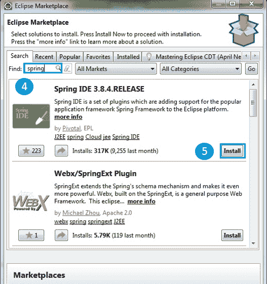
6.  现在你必须点击“确认”来继续安装。 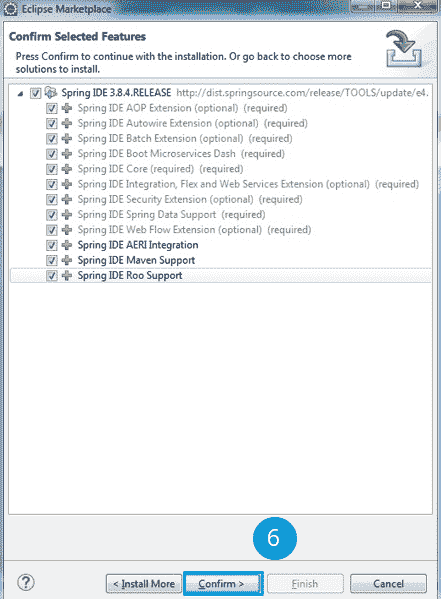
7.  让安装完成，然后重启 eclipse，尽管它会自动要求重启。

## **第一春**

完成安装后，您就可以在春天开发您的第一个应用程序了。为此，你需要遵循五个简单的步骤:

1.  创建**Bean.java**班
2.  创建XML/配置文件
3.  创建 **主** 类
4.  加载所需的 jar 文件
5.  运行应用程序

让我们开始第一步。

**步骤一:创建 Bean 类:**

*   为此去文件>新建> Java 项目。
*   现在创建一个包，右击项目>新建>包。
*   命名这个包，再次右键单击新的>类。
*   下面是一个学生 bean 类的例子。

```
package org.edureka.firstSpring; 
public class StudentBean 
{ 
String name; public String getName() 
{ return name; } 
public void setName(String name) 
{ this.name = name; } 
public void displayInfo() 
{ System.out.println("Hello: "+ name); } 
}

```

*   这是一个简单的 bean 类，只包含一个属性名及其 getters 和 setters 方法。该类包含一个名为 displayInfo()的额外方法，该方法通过 hello“student name”消息打印学生姓名。

**步骤二:创建** **一个 XML** **文件**

*   右键点击 src >新建>其他> XML 文件

```
<?xml version="1.0" encoding="UTF-8"?>
<beans  xmlns:xsi="http://www.w3.org/2001/XMLSchema-instance" xmlns:p="http://www.springframework.org/schema/p" xsi:schemaLocation="http://www.springframework.org/schema/beans http://www.springframework.org/schema/beans/spring-beans-3.0.xsd">

<bean id="studentbean" class="org/edureka/firstSpring/StudentBean"> 
<property name="name" value="Edureka"></property> 
</bean>
</beans>

```

*   **<bean>**标签用于定义给定类的 bean。
*   **<属性>** 标签是 bean 的子元素，指定学生类的属性。IoC 容器将在 Student 类对象中设置 property 元素中指定的值。

**步骤三:创建主类**

*   右键点击>包新建>类
*   下面是一个 StudentDemo 类的例子:

```
package org.edureka.firstSpring;
import org.springframework.context.ApplicationContext; 
import org.springframework.context.support.ClassPathXmlApplicationContext; 
public class StudentDemo 
{ 
public static void main(String[] args) 
{ 
ApplicationContext appCon=new ClassPathXmlApplicationContext("StudentConfig.xml"); 
StudentBean factory=(StudentBean)appCon.getBean("studentbean"); 
factory.displayInfo(); 
} 
}
```

**第四步:加载 jar 文件**

*   这里是所需 jar 文件的列表。你必须下载它并将其添加到你的库中。

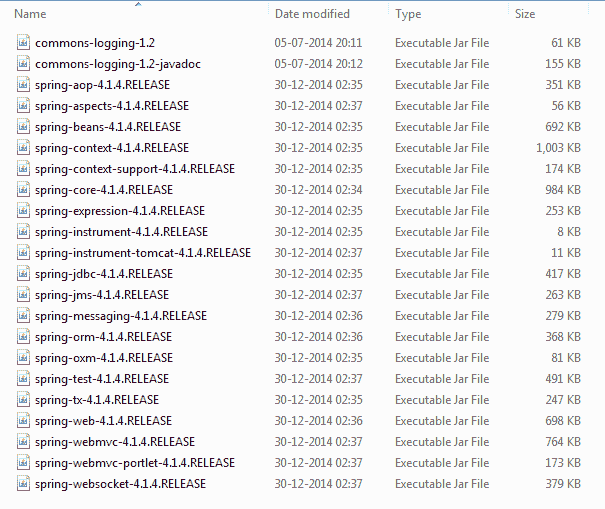

*注:万一你想要 jar 文件，可以在下面评论。*

**第五步:运行程序**

*   现在，您可以通过运行 StudentDemo 类来测试您的代码。您可以在下面的输出中看到，名称 Edureka 是由 ApplicationContext 在运行时注入的。同样，您可以随时更改名称，只需在配置文件中更改名称。

## **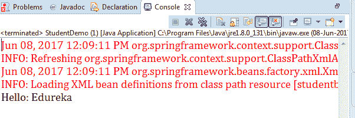**

## **春运国际奥委会集装箱**

既然我们已经完成了第一个基本程序，我希望你已经对 SpringFramework 有了一个 的概念。现在让我们讨论一些在 Spring 框架核心工作的概念。我们将从 IoC 容器开始。

那么，春天的 IoC 容器到底是什么呢？嗯，Spring IoC 代表控制反转。它是 Spring 框架的核心。IoC 容器执行的重要任务有:

1.  实例化 bean
2.  将豆子连接在一起
3.  配置 bean
4.  管理 bean 的整个生命周期

下面是 IoC 容器如何将 beans 连接在一起的图示。

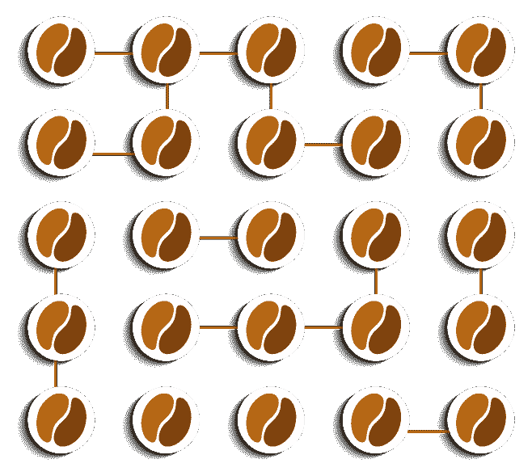


IoC 容器接收来自XML 文件、Java 注释或 Java 代码的元数据，并相应地工作。IoC 增加了应用程序的灵活性和控制性，并为我们的应用程序的普通旧 Java 对象(POJO)提供了一个集中的配置管理位置。这个图代表了 Spring 框架工作的抽象视图。它展示了Sspring如何利用 Java POJO 类 和配置元数据 生成一个完全配置好的可执行系统或应用程序。

有两种类型的 IoC 容器:

1.  豆制品厂
2.  应用上下文

让我们详细讨论一下。

**豆制品厂**

*   是在org . spring framework . beans . factory .**bean factory**中定义的接口。
*   Bean Factory 为依赖注入提供了基础支持。
*   它基于工厂设计模式，可以创建任何类型的 beans。
*   BeanFactory 遵循惰性初始化技术，这意味着 bean factory 实例一创建就被加载，但是 bean 只有在调用 *getBean()* 方法时才被创建。
*   XmlBeanFactory 是 BeanFactory 接口的实现类。要使用 BeanFactory，您需要创建 XmlBeanFactory 类的实例，如下所示:

```
BeanFactory beanFactory = new XmlBeanFactory(new ClassPathResource("beans.xml"));

```

**应用上下文**

*   是在org . spring framework . context .**application context**中定义的 接口。
*   它是高级的 Spring 容器，构建在 BeanFactory 接口之上。
*   ApplicationContext 支持 Bean Factory 支持的特性，但也提供一些附加功能。
*   ApplicationContext 遵循早期初始化技术，这意味着一旦创建了应用程序上下文的实例，就会创建 beans 的实例。
*   classpathmlaplicationcontext 类是 ApplicationContext 接口的实现类。您需要实例化 ClassPathXmlApplicationContext 类来使用 ApplicationContext，如下所示:

```
ApplicationContext context=new ClassPathXmlApplicationContext("beans.xml");

```

## **春天教程:** **依赖注入**

依赖注入也是 Spring 框架的**核心概念**之一。这是一种从 代码中移除依赖性的设计模式。也就是说，Spring 框架提供了类本身的依赖性，因此可以很容易地管理和测试应用程序。您可以从 XML 文件等外部来源提供 信息 。在这里，您不需要创建对象，而只需要定义如何创建它们，IoC 容器将为您创建对象。

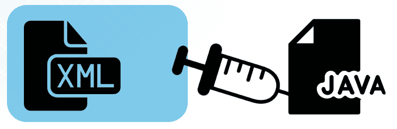

在 Spring 中，依赖项可以通过两种方式注入:

1.  由构造者
2.  通过设置器方法

让我们看看他们是怎么做的。

**由构造者**

*   **<bean>**的 **< constructor-arg >** 子元素用于构造函数注入。例如:

```
<constructor-arg value="101" type="int"></constructor-arg>

```

*   默认情况下，当 Spring 容器加载 bean 时，它用默认的构造函数实例化 bean。但是您也可以在 bean 定义中使用参数构造函数来定义构造函数参数。

**通过设定器方法**

*   **<>**的 **<属性>** 子元素用于 setter 注入，例如:

```
<property name="id" value="101"></property>

```

*   基于 setter 的依赖注入是由容器在调用无参数后调用 beans 上的 Setter 方法来完成的。

## **春季教程:** **AOP(面向方面编程)**

面向方面编程(AOP)是一种编程方法，它允许程序的 全局属性来决定它如何被编译成可执行程序。AOP 补充了 OOPs，因为它也提供了模块化。但是在这里，模块化的关键单元是一个方面而不是一个类。AOP 将程序的逻辑分解成不同的部分，称为 *关注点* 。这通过**横切关注点**增加了模块化。

**横切关注点**是影响整个应用程序的关注点，集中在代码中的一个位置，如事务管理、认证、日志、安全等。看下图可以更好的理解。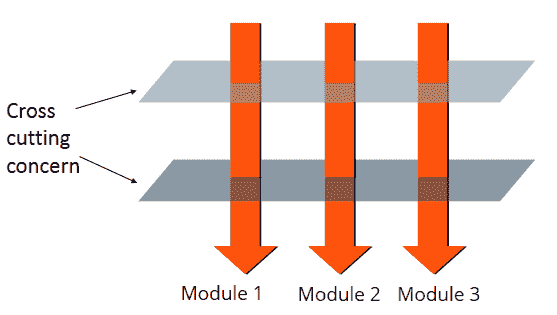   AOP 也可以认为是一种**动态装饰器**设计模式。装饰模式允许通过包装原始类并复制其接口，然后委托给原始类，将额外的行为添加到现有类中。你可以说 Spring AOP 劫持了正在执行的方法，并在方法执行之前或之后添加了额外的功能。

**核心 AOP 概念**

面向方面编程主要有七个核心概念。它们通过下图描述:

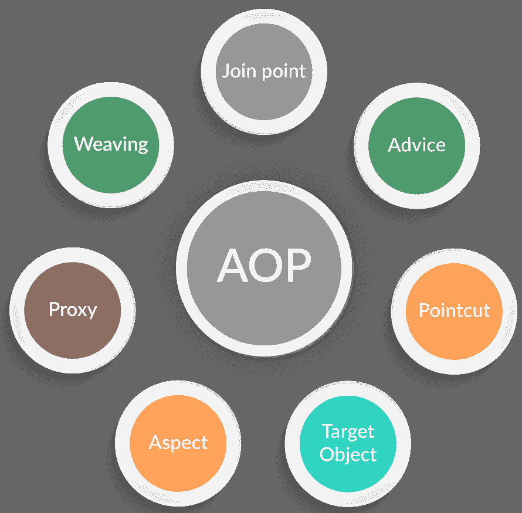

让我们详细讨论一下。

1.  **方面**:一个*方面*是一个实现 JEE 应用关注点的类，它跨越多个 类，如事务管理 。 方面可以是通过 Spring XML 配置的普通类。它也可以是使用@Aspect 注释的常规类。
2.  **连接点:** A *连接点*是一个 *候选*点在p程序执行 的一个应用程序中，可以插入一个方面。这个点可能是被调用的方法、被抛出的异常，甚至是被修改的字段。
3.  **建议:** *建议*是对特定连接点采取的实际动作。 基本上，它们是当应用程序中某个连接点遇到匹配的切入点时执行的方法。
4.  **切入点:** *切入点*是与连接点相匹配的表达式，用来决定建议是否需要执行。
5.  **目标对象:** 他们是被建议的对象。在 Spring AOP 中，运行时会创建一个子类，在这个子类中，目标方法会被覆盖，通知会根据它们的配置被包含进来。
6.  **代理:***代理*是对目标对象应用建议后创建的对象。就客户端而言，对象、目标对象和代理对象是相同的。
7.  **编织:*编织*是将一个方面与其他应用类型或对象链接起来，创建一个建议对象的过程。**

**AOP 建议类型**

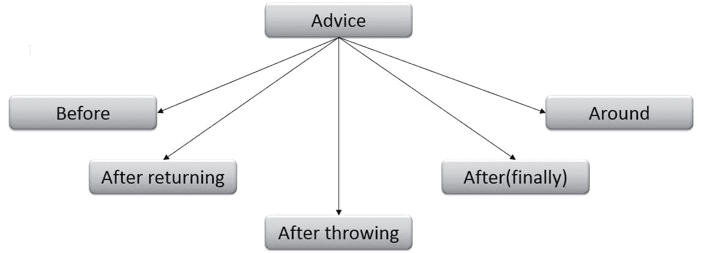

*   **Before:** 这些类型的通知在连接点方法之前执行。在注释标记前使用**@进行配置。**
*   **返回后:** 这些类型的建议在连接点方法正常执行完成后执行。它们是使用@AfterReturning 批注标记配置的。
*   **抛出后:** 这些类型的建议只有在 joinpoint 方法通过抛出异常退出时才执行。它们是使用@AfterThrowing 注释标记配置的。
*   **(最终):** 这些类型的建议在一个*连接点*方法执行后执行，r 不管该方法是否退出(正常或异常返回)。它们 是在标注 符号后用@配置的。
*   **Around:** 这些类型的通知在连接点之前和之后执行，并使用@Around 注释标记进行配置。

## **弹簧教程:** **弹簧 MVC(模型-视图-控制器)**

Spring MVC 有助于构建灵活、松散耦合的 web 应用程序。*模型-视图-控制器*设计模式有助于分离业务逻辑、表示逻辑和导航逻辑。借助 DispatcherServlet，为在 Spring 框架中使用 MVC 提供了一个优雅的解决方案。

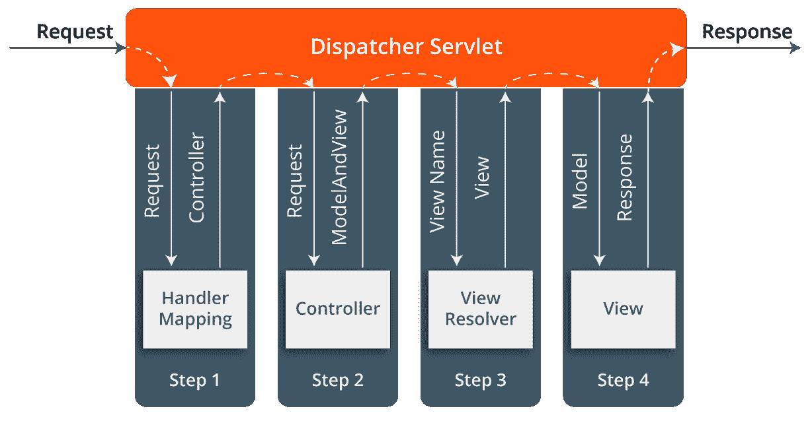

当一个请求被发送到 Spring MVC 框架时，会发生以下情况。

*   DispatcherServlet 收到一个请求。
*   DispatcherServlet 与 HandlerMapping 通信，并调用与请求相关的控制器。
*   请求由控制器通过 调用 适当的服务方法 处理，并返回一个 ModelAndView 对象给 DispatcherServlet。
*   dispatcher servlet 将视图名称发送给 ViewResolver，以找到要 调用的 实际视图。
*   现在，模型对象 DispatcherServlet 被传递给*视图*来呈现结果。
*   在模型数据的帮助下，视图将结果呈现给用户。

所以，这就把我们带到了 Spring 教程博客的结尾。我尽最大努力保持概念简洁明了。希望它能帮助你理解 Spring 框架及其各种特性。如果你正在考虑在春天寻求你的未来，那么你可以参考我的下一篇关于春天面试问题的博客。在那个博客中，我将讨论各种重要的话题，比如 Spring IoC、依赖注入、注释、Spring Beans、Spring MVC、AOP 等等。

*既然您已经完成了 Spring 教程，那么就来看看 Edureka 提供的 [**Spring 认证**](https://www.edureka.co/spring-certification-course) 培训吧，edu reka 是一家值得信赖的在线学习公司，在全球拥有超过 250，000 名满意的学习者。*

*有问题吗？请在评论区提到它，我们会给你回复。*