# Jenkins 教程|使用 Jenkins 的持续集成| Edureka

> 原文：<https://www.edureka.co/blog/jenkins-tutorial/>

## **詹金斯教程**

[**詹金斯**](https://www.edureka.co/blog/what-is-jenkins/) 是一个强大的应用程序，能够在任何平台上持续集成和持续交付项目。它是 DevOps 工具的一个免费的、 **开源应用程序，可以处理任何类型的构建或持续集成。 Jenkins 可以集成多种测试和部署技术。**

在这篇 Jenkins 教程博客中，我们将向您展示如何使用 Jenkins DevOps 工具来持续构建和测试您的软件项目。

在我们继续学习 Jenkins 教程之前，上一篇博客的要点是:

*   Jenkins 用于在插件的帮助下集成所有 DevOps 阶段。
*   常用的 Jenkins 插件有 Git、Amazon EC2、Maven 2 project、HTML publisher 等。
*   Jenkins 拥有超过 1000 个插件和 147，000 个活跃安装，在全球拥有超过 100 万用户。
*   与不断集成的对源代码的每一次修改都是 构建的。它还执行其他功能， 这取决于用于持续集成的工具。
*   诺基亚从夜间构建转向了持续集成。
*   持续集成之前的流程有许多缺陷。结果，不仅软件交付缓慢，而且软件质量也没有达到标准。开发人员在定位和修复漏洞方面也经历了一段艰难的时间。
*   与 Jenkins 的持续集成克服了这些缺点，它为源代码中的每一处变更持续触发构建和测试。

## **詹金斯教程:W** **hy 詹金斯？**

Jenkins 是一款软件程序 DevOps 工具，可实现持续集成。

将进行集中构建的服务器将安装 Jenkins。下面的流程图显示了 Jenkins 的一个非常基本的工作流程。

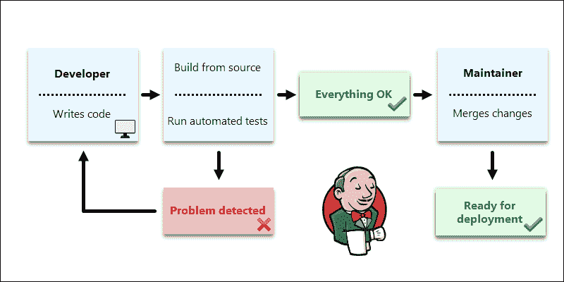

与 Jenkins DevOps 工具一起提到的并不少见。

由 Sun Microsystems 开发，后来被 Oracle 收购，Hudson 是一款非常知名的 **开源的基于 Java 的** 持续集成工具。

由于哈德森源代码在甲骨文收购孙之后出现分叉， **詹金斯** 被开发出来。

## **什么是持续集成？**

根据被称为持续集成的开发实践，开发人员必须定期将新代码集成到共享的存储库中。

这个想法的开发是为了解决在构建生命周期中问题已经发生后发现问题的问题。

为了使用持续集成，开发人员必须进行频繁的构建。

每当代码提交发生时，启动构建是标准过程。

## **系统要求**

| **JDK** | **JDK 1.5 或以上** |
| 内存 | 2 GB 内存(推荐) |
| 磁盘空间 | 不存在最低标准。请注意，必须有足够的磁盘空间用于构建存储，因为所有构建都将存储在 Jenkins 机器上。 |
| 操作系统版本 | Jenkins 可以安装在 Windows、Ubuntu/Debian、Red Hat/Fedora/CentOS、Mac OS X、openSUSE、FReeBSD、OpenBSD、Gentoo 上。 |
| Java 容器 | WAR 文件可以在任何支持 Servlet 2.4/JSP 2.0 或更高版本的容器中运行。(Tomcat 5 就是一个例子)。 |

现在是了解 Jenkins 架构的正确时机。

## **詹金斯教程:** **詹金斯架构**

让我们来修改一下我在 **[*之前的博客*](https://www.edureka.co/blog/what-is-jenkins/)** 中给大家解释过的独立式 Jenkins 架构，下图描绘的也是一样。

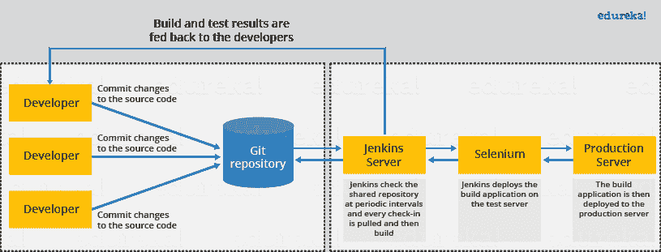

单个 Jenkins 服务器不足以满足某些要求，例如:

*   有时你可能需要几个不同的环境来测试你的构建。这不能由单个 Jenkins 服务器来完成。
*   如果定期构建更大更重的项目，那么单个 Jenkins 服务器无法简单地处理全部负载。

为了解决上述需求，Jenkins 分布式架构应运而生。

## **詹金斯分布式架构**

Jenkins 使用主从架构来管理分布式构建。在这种体系结构中，主机和从机通过 TCP/IP 协议进行通信。

**詹金斯大师**

您的主 Jenkins 服务器是主服务器。主人的工作是处理:

*   调度构建作业。
*   将构建分派给从模块进行实际执行。
*   监控从机(可能根据需要使其在线或离线)。
*   记录并展示构建结果。
*   Jenkins 的主实例也可以直接执行构建任务。

## 詹金斯奴隶

从机是在远程机器上运行的 Java 可执行文件。以下是詹金斯奴隶的特征:

*   它听到来自 Jenkins 主实例的请求。
*   从机可以运行在多种操作系统上。
*   从机的工作是按照要求去做，包括执行主机分派的构建任务。
*   你可以配置一个项目总是在一个特定的从属机器或特定类型的从属机器上运行，或者简单地让 Jenkins 挑选下一个可用的从属机器。

下图不言自明。它由一个管理三个 Jenkins 从机的 Jenkins 主机组成。

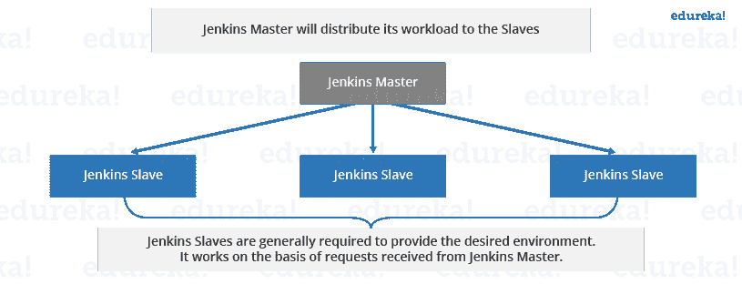

现在让我们看一个例子，Jenkins 被用于在不同的环境中进行测试，比如:Ubuntu、MAC、Windows 等。

下图表示相同:

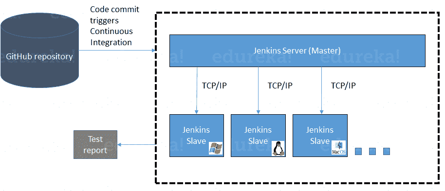

上图中执行了以下功能:

*   Jenkins 定期检查 Git 存储库，查看源代码中是否有任何更改。
*   每个版本都需要不同的测试环境，这对于单个 Jenkins 服务器来说是不可能的。为了在不同的环境中执行测试，Jenkins 使用了各种从设备，如图所示。
*   Jenkins 主设备请求这些从设备执行测试并生成测试报告。

## **詹金斯教程:** **詹金斯——安装**

**下载 Jenkins DevOps 工具。**

詹金斯官网为 [詹金斯](https://www.jenkins.io/) 。您可以通过点击提供的链接访问 Jenkins 官方网站的主页，如下所示。

默认情况下，可以下载最新版本和长期支持版本。还提供以前版本的下载。在下载部分，选择长期支持版本选项卡。

## **启动詹金斯**T2【devo PS】工具

启动命令窗口。使用命令提示符导航到包含 Jenkins.war 文件的目录。执行即将到来的命令。

```
D:>Java –jar Jenkins.war
```

执行完命令后，将执行几项任务，其中一项是通过名为 Winstone 的嵌入式 web 服务器提取 war 文件。

```
D:>Java –jar Jenkins.war  Running from: D:jenkins.war  Webroot: $user.home/ .jenkins  Sep 29, 2015 4:10:46 PM winstone.Logger logInternal  INFO: Beginning extraction from war file
```

一旦处理完成且没有任何重大错误，命令提示符的输出中将出现以下行。

信息:Jenkins 完全启动并运行

## **访问詹金斯**T2【devo PS】工具

一旦 Jenkins 启动并运行，用户可以通过链接**http://localhost:8080**访问 Jenkins

此链接将打开 Jenkins 仪表盘。

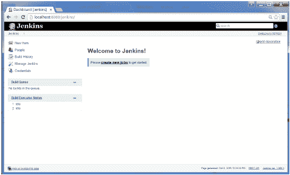

## **验证 Java 安装**

打开控制台，运行以下 java 命令确认 Java 安装。

| **OS** | **任务** | **命令** |
| 窗户 | 打开命令控制台 | > java 版 |
| Ubuntu | 打开命令终端 | $java 版本 |

根据您使用的平台，如果 Java 已正确安装在您的系统上，您应该会收到以下输出之一。

| **OS** | **输出** |
| **窗户** | Java version “1.8.0_202”Java(TM) SE 运行时环境(build 1.8.0_202-b08)Java HotSpot(TM) 64 位服务器虚拟机(内部版本 25.202-b08，混合模式) |
| **Ubuntu** | java version “1.8.0_252”开放 JDK 运行时环境(build 1 . 8 . 0 _ 252-8u 252-bo9-1 Ubuntu 1-b09)打开 JDK 64 位服务器虚拟机(内部版本 25.252-b09，混合模式) |

在开始本教程之前，我们假设所有读者的计算机上都安装了 Java 1.8.0 202。

你可以从链接 [甲骨文](https://www.oracle.com/java/technologies/javase/upgrade.html) 下载 Java JDK，如果你还没有的话。

## **Jenkins–Tomcat 设置**

**下载 Tomcat**

Tomcat 的官网是 [Tomcat](https://tomcat.apache.org/) 。您可以通过单击下面显示的链接来访问 Tomcat 官方网站的主页。

## 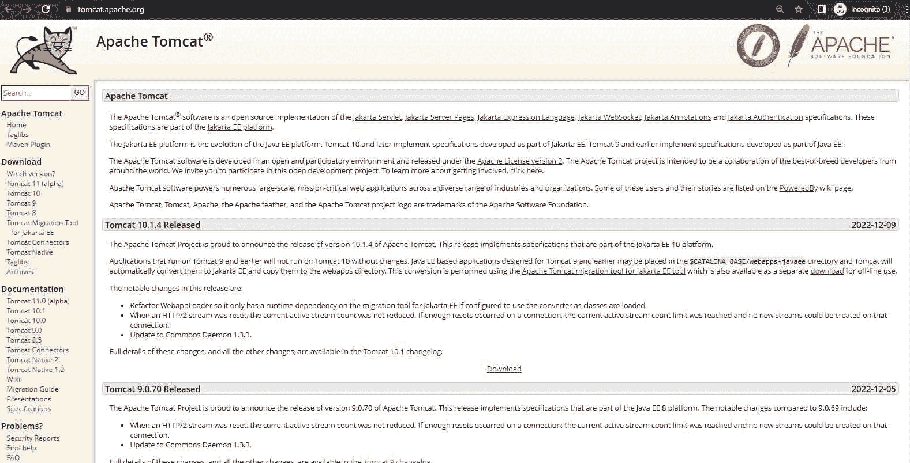

浏览链接[https://tomcat.apache.org/download-70.](https://tomcat.apache.org/download-70.)CGI 获取 tomcat 的下载。


在“二元分布”下寻找下载 Windows 64 位 zip 文件。

然后，解压缩下载的 zip 文件的内容。

**Jenkins DevOps 工具和 Tomcat 设置**

在 tomcat 文件夹中，将上一节下载的 Jenkins.war 文件移动到 web apps 文件夹中。

命令提示符现在已打开。通过从命令提示符导航到 tomcat7 文件夹的位置来搜索该文件夹。打开这个文件夹的 bin 目录并执行 start。蝙蝠文件

```
E:Appstomcat7bin;startup.bat

```

一旦处理完成，没有任何重大错误，命令提示符的输出将显示下一行。

```
INFO: Server startup in 1302 ms 

```

打开浏览器，进入链接**http://localhost:8080/Jenkins**。

Tomcat 将会让 Jenkins 开始运行。

## **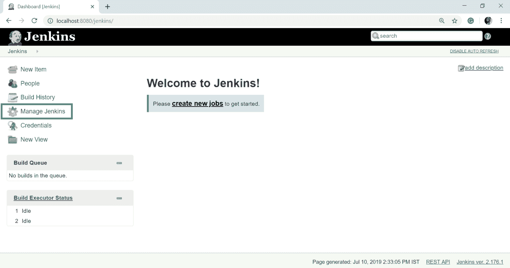**

## **Jenkins DevOps 工具–Git 设置**

要完成本练习，您必须确保安装了 DevOps Jenkins 工具的机器具备互联网连接。单击 Jenkins 仪表板(主屏幕)左侧的“管理 Jenkins”按钮。


从以下屏幕的菜单中选择 **【管理插件】** 。

## 

从以下屏幕中选择 **可用的** 选项卡。此选项卡上提供了可供下载的插件列表。进入 **“过滤器”** 标签，进入**“Git 插件”**

## 

之后，列表将被过滤。勾选“**【Git 插件】** 框，然后选择 **“安装无需重启”**

## 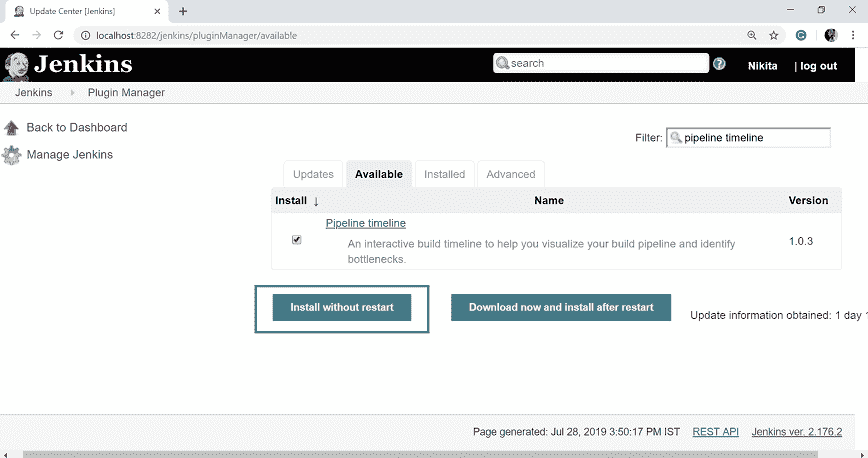

安装开始前，屏幕会刷新显示 **下载** 状态。


完成所有安装后，通过在浏览器中键入以下命令来重新启动 DevOps Jenkins。**http://localhost:8080/Jenkins/restart**

一旦 DevOps Jenkins 重新启动，选择 **Git** 作为作业配置选项将是一个选项。

为了确认，从 Jenkins 菜单选项中选择 **新** 项目。

接下来，输入一个 **姓名** 进行求职；在这种情况下，名称是 **“演示”** 将项目类型设置为从菜单中选择 **【确定】** 。

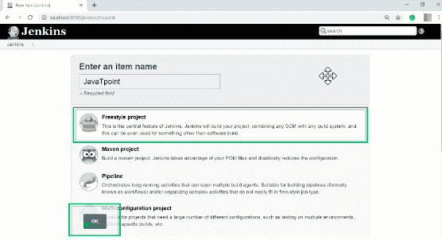

如果您导航到以下屏幕上的 **源代码管理** 部分，**【Git】**现在将作为一个选项提供。

## 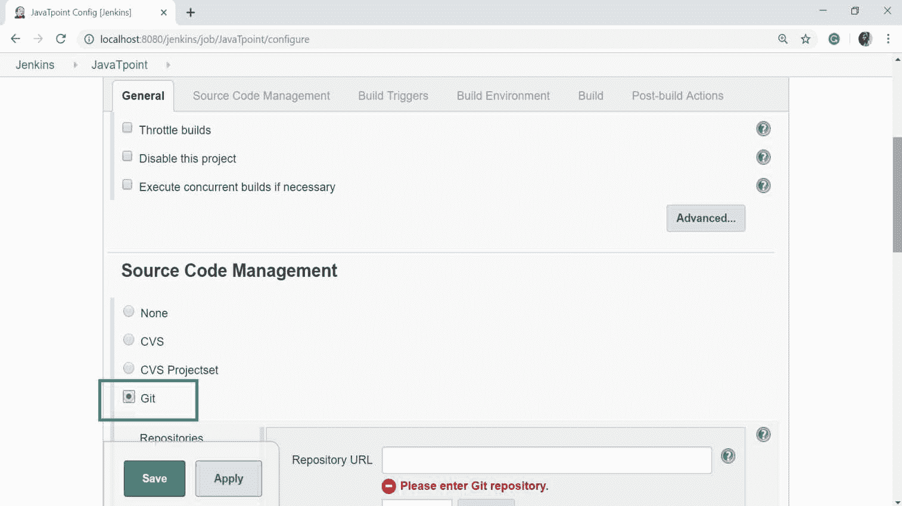

## **Jenkins DevOps 工具–Maven 设置**

**下载并设置 Maven**

Maven 官网为 [阿帕奇 Maven](https://maven.apache.org/download.cgi) 。您可以通过点击提供的链接访问 Maven 官方网站的主页，如下所示。

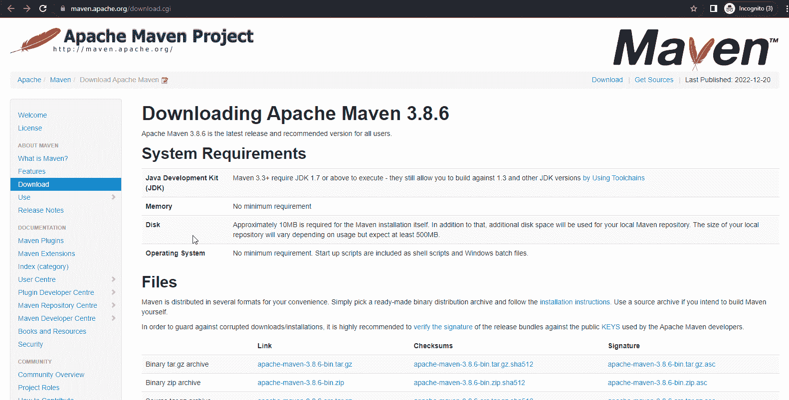

访问网站的文件部分，并使用那里的链接下载 Binary.zip 文件。

## 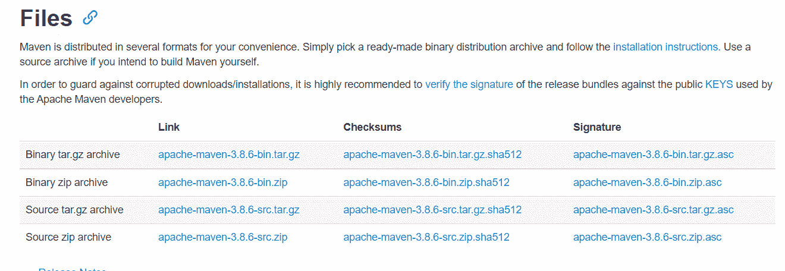

下载文件后，将文件解压缩到适当的应用程序文件夹中。为此，maven 文件将存储在 E:appsa cache-maven-3 . 8 . 6 中。

**设置 Jenkins DevOps 工具和 Maven**

点击詹金斯仪表盘(主屏幕)左侧菜单中的 **管理詹金斯** 。

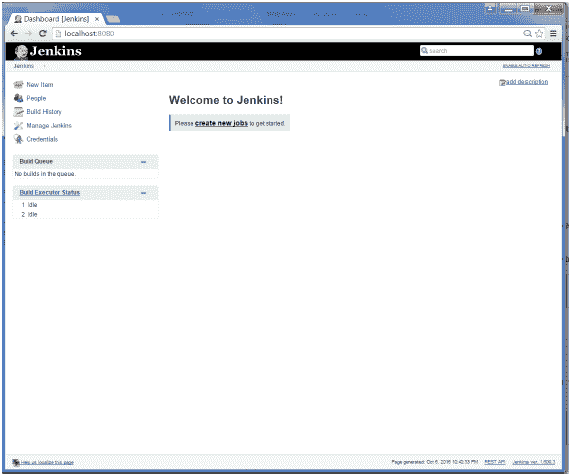

然后，从右侧选择 **配置系统**

## 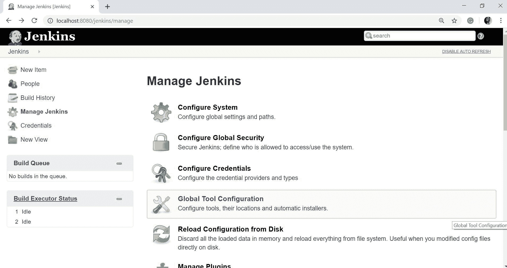

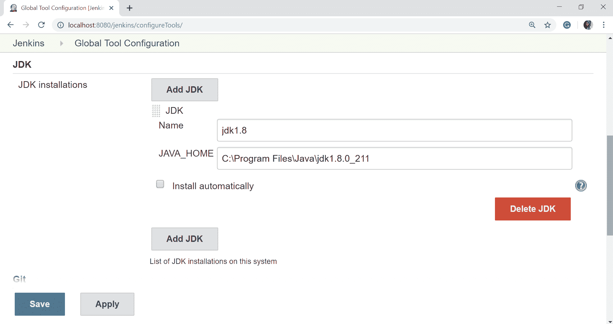

向下滚动到 **配置** 系统屏幕上的 Maven 部分后，点击 **【添加 Maven】**按钮。

## 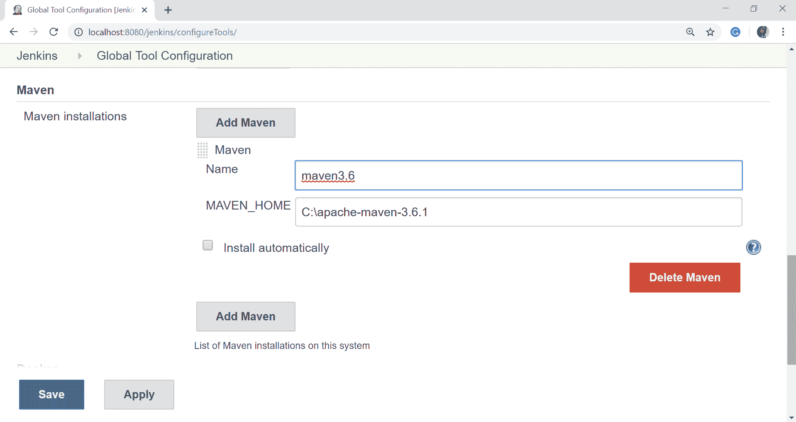

“自动安装”应未选中。

给的设定和地点**的美芬家**的起任何你喜欢的名字。

然后，按下位于屏幕下方的【保存】按钮。

## 

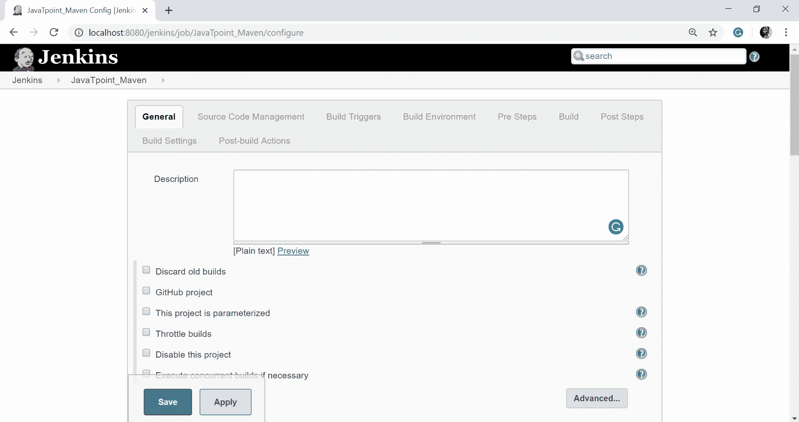

使用新的**【Maven 项目】** 选项，您现在可以创建一个作业。点击 DevOps Jenkins 仪表盘中的 **新项目** 按钮。

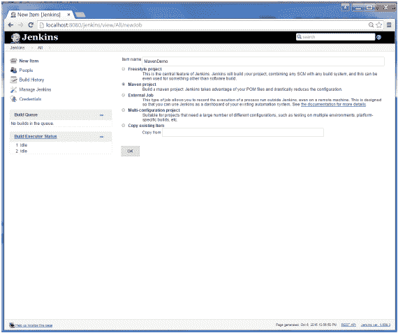

## **Jenkins DevOps 工具–配置**

您可能已经注意到，在之前的练习中，我们不得不配置 Jenkins 选项。Jenkins 中的不同配置选项如下所示。

从左侧菜单中选择 **【管理詹金斯】** ，可以访问詹金斯的各种配置工具。

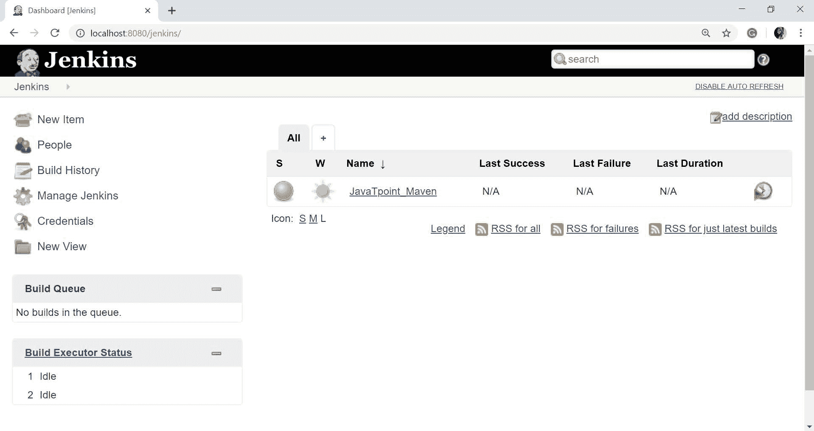接下来会出现以下画面:

## 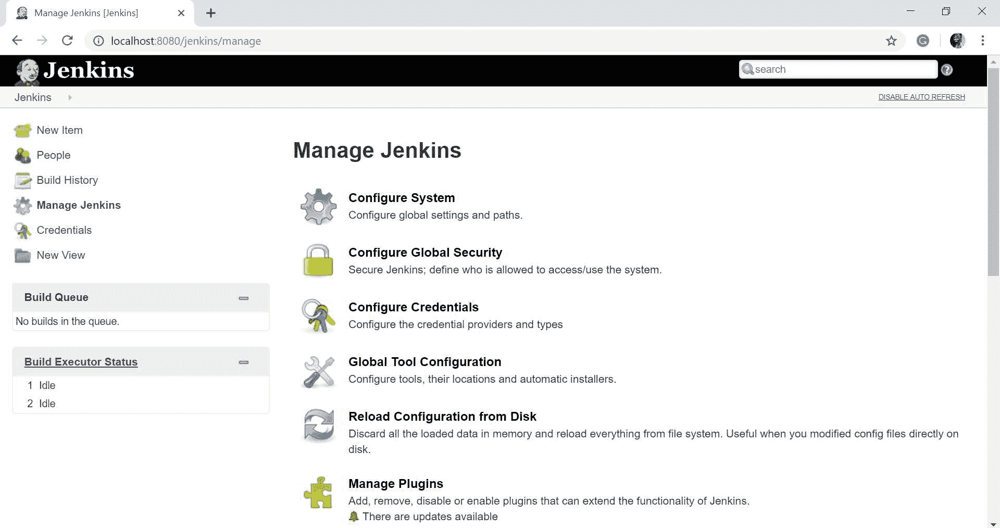

然后选择 **配置系统** 。下面介绍了 Jenkins 配置中可以使用的一些设置。

## 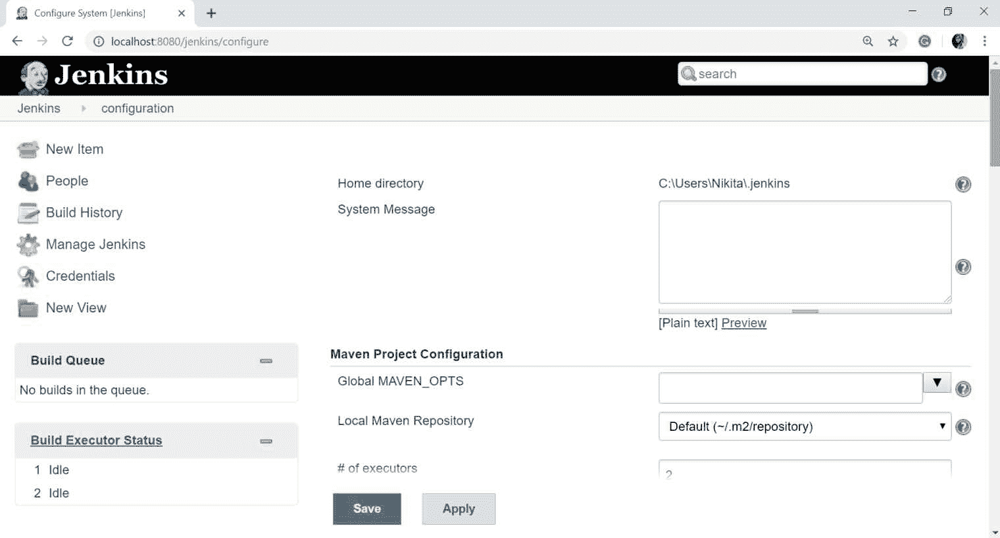

配置的一个重要组成部分是配置系统页面。通用 Jenkins 设置、全局环境变量和大多数已安装的插件都在此页面上配置。该屏幕代表几个部分，每个部分对应一个不同的配置区域。

## **Jenkins DevOps 工具–主目录**

Jenkins 需要一定的磁盘空间来运行构建和存储归档。这个位置可以从 Jenkins 的配置屏幕上验证。此位置最初将保存在您的用户配置文件位置，默认设置为/.jenkins。在适当的设置中，您应该将此位置更改为一个适当的位置，以保存所有相关的构建和归档。有几种方法可以做到这一点。

在启动 servlet 容器之前，将“JENKINS HOME”环境变量设置为新的主目录。

*   应该设置 servlet 容器的“JENKINS HOME”系统属性。
*   将新目录设置为 JNDI 的“JENKINS HOME”环境变量。
*   设置“JENKINS HOME”环境变量的第一种方法将在下面的示例中使用。

首先，在 E: Apps 中新建一个 Jenkins 文件夹。复制当前/中的所有内容。詹金斯目录到这个新目录。

计算机上安装 Java 的基本目录位置应该是 JENKINS HOME 环境变量的值。例如，

| **OS** | **输出** |
| 窗户 | 将环境变量 JENKINS_HOME 设置为您想要的位置。例如，您可以将其设置为 E:AppsJenkins |
| Linux | 导出 JENKINS _ HOME =/usr/local/JENKINS 或者你想要的位置。 |

点击詹金斯仪表板左侧菜单中的 **管理詹金斯** 。然后，从右侧选择 **“配置系统”**

现在，您可以在主目录中找到新配置的目录。

## 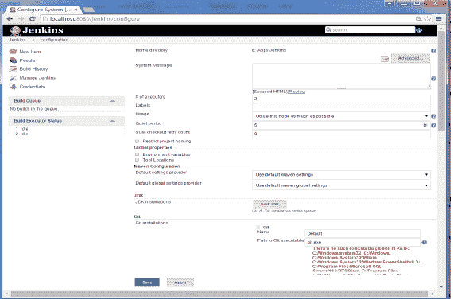

**执行人:**

这是 Jenkins 机器上可以同时执行的最大作业数量。根据具体情况，这是可以改变的。为了获得更好的性能，有时建议将这个数字与机器上安装的 CPU 数量保持一致。

**环境因素:**

使用此功能，您可以添加适用于所有作业的独特环境变量。这些是键值对，可以在构建中任何需要的地方使用。

**詹金斯网址:**

Jenkins 的 URL 默认指向本地主机。如果您的计算机已经设置了域名，请将其设置为域名；否则，localhost 将被替换为设备的 IP 地址。这将有助于设置从服务器并使用电子邮件发送链接，因为您可以使用环境变量 JENKINS URL 直接访问 Jenkins URL，该变量可以作为${JENKINS URL}访问。

**电子邮件通知:**

您可以在电子邮件通知部分设置发送电子邮件的 SMTP 设置。Jenkins 需要连接 SMTP 邮件服务器，向收件人列表发送邮件，所以这是必要的。

## **Jenkins DevOps 工具–管理**

要管理詹金斯，从左侧菜单中选择 **【管理詹金斯】** 。

通过从左侧菜单中选择 **【管理詹金斯】** ，可以访问詹金斯的各种配置选项。

## 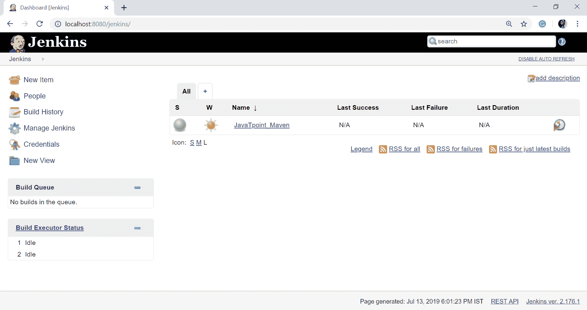

然后你会看到下面的屏幕:

## 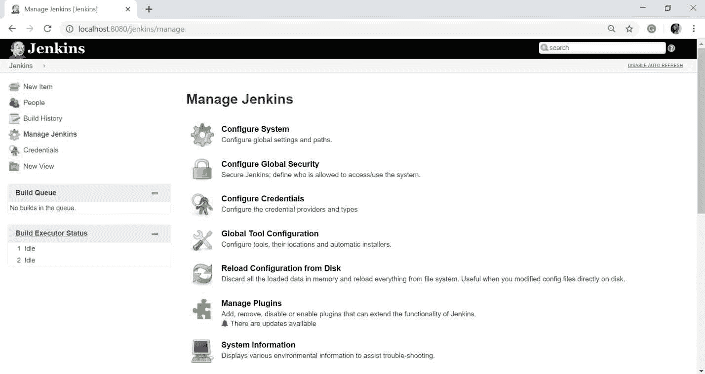

一些管理选项包括如下:

**配置系统:**

在这里，用户可以控制各种构建相关工具的路径，包括 JDK、Ant 和 Maven 版本、安全设置、电子邮件服务器和其他系统级配置信息。插件的安装。安装插件后，Jenkins 将动态添加必要的配置字段。

**从磁盘重新加载配置:**

Jenkins 的所有系统和构建作业配置信息都保存在 XML 文件中，这些文件保存在 Jenkins 主目录中。此外，完整的构建历史保存在这里。如果要将构建作业从一个 Jenkins 实例移动到另一个实例或归档旧的构建，则必须从 Jenkins 的构建目录中添加或移除相关的构建作业目录。您可以使用“从磁盘重新加载配置”选项重新加载 Jenkins 系统并构建作业配置，而无需让 Jenkins 离线。

**管理插件:**

您可以在这里安装各种第三方插件，从代码质量和代码覆盖率的度量报告到不同的源代码管理工具，如 Git、Mercurial 或 ClearCase。管理插件屏幕允许安装、更新和删除插件。

## 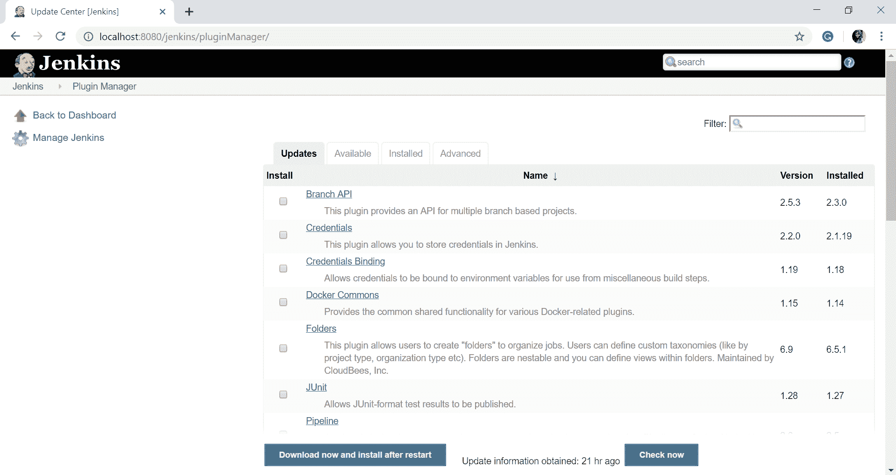

**系统信息**

当前所有的 Java 系统属性和系统环境变量都列在这个屏幕上。在这里，可以看到确切的 Java Jenkins 版本、用户和正在运行的其他信息。

本节中显示的名称-值数据部分显示在下面的屏幕截图中。

**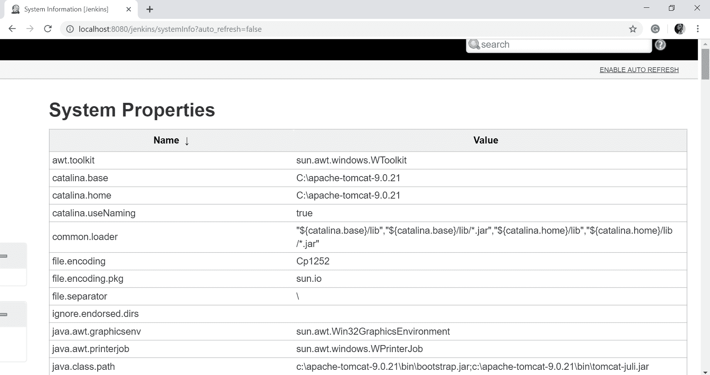**

**系统日志:**

在系统日志屏幕上可以方便地实时查看 Jenkins 日志文件。同样，故障排除是此屏幕的主要目的。

**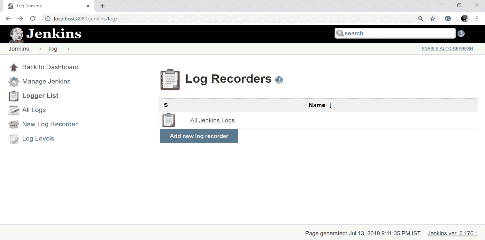**

**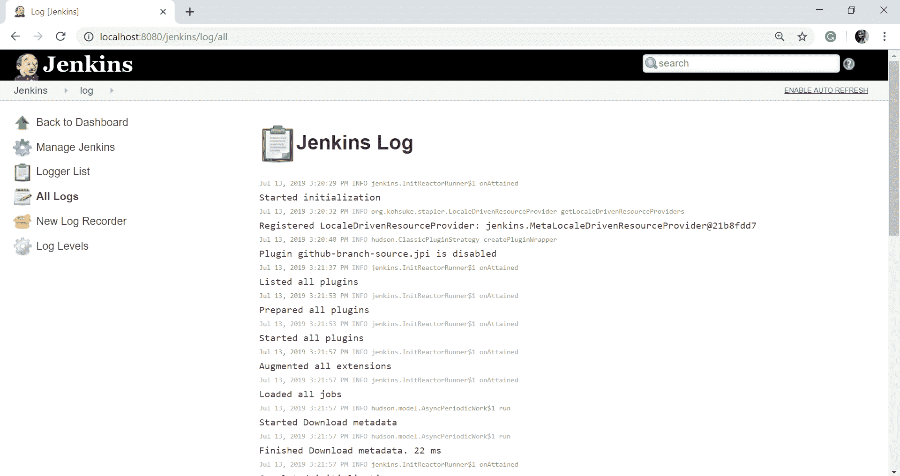负荷统计:**

构建队列的长度和并发构建的数量以图形方式显示在此页面上，让您了解 Jenkins 实例有多忙，以及您的构建在执行前需要等待多长时间。这些统计数据有助于确定在基础架构方面是否需要额外的构建节点或容量..

**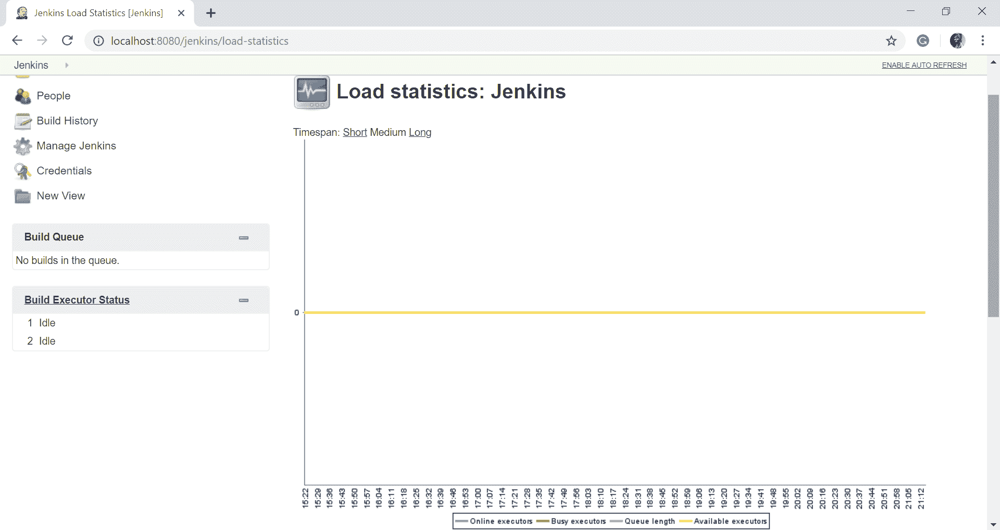脚本控制台:**

您可以使用这个屏幕在服务器上执行 Groovy 脚本。由于需要彻底了解 DevOps Jenkins 的内部架构，因此它有助于高级故障排除。

**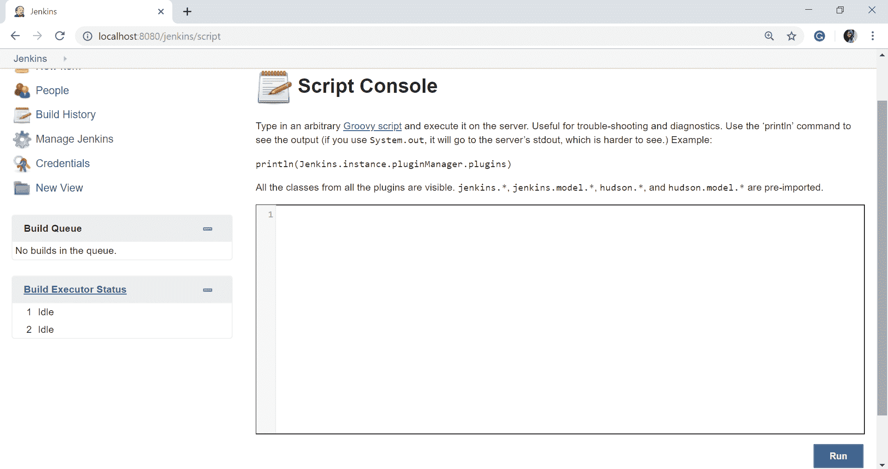管理节点:**

DevOps Jenkins 可以管理分布式和并行构建。您可以在此屏幕上指定想要的构建数量。如果您使用分布式构建，Jenkins 会并发运行并配置构建节点。Jenkins 可以使用构建节点作为额外的计算机来执行其构建。

**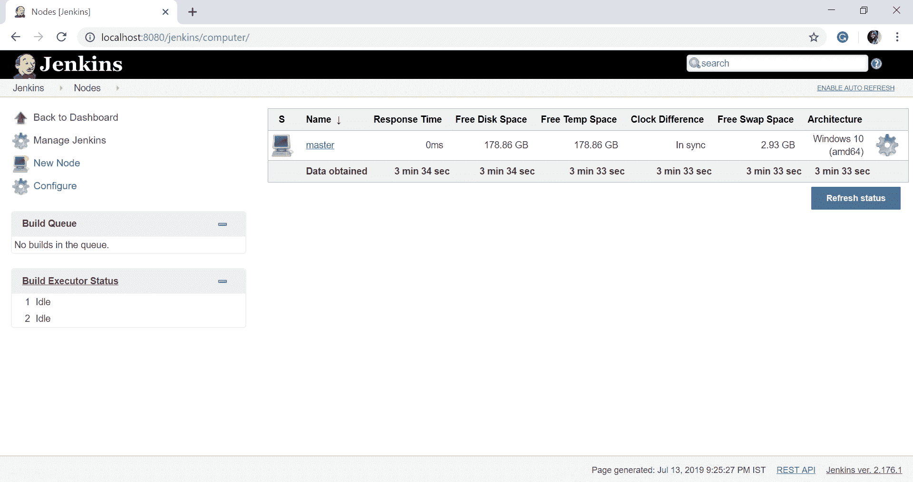**

**准备关机:**

避免关闭 Jenkins 或运行它的服务器的最佳时间是在构建正在进行时。“准备关机”链接可以阻止任何新版本的启动，可用于正确终止 Jenkins。一旦所有正在进行的构建都已完成，人们最终将能够干净地关闭 Jenkins。

## **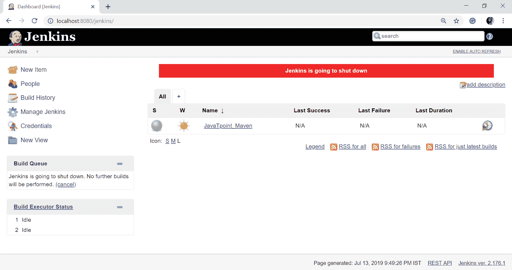**

## **Jenkins 入门| Jenkins 和 DevOps 教程| Jenkins 入门| Edureka**

## [//www.youtube.com/embed/aSuNf322bbY?rel=0&showinfo=0](//www.youtube.com/embed/aSuNf322bbY?rel=0&showinfo=0)

## **使用詹金斯**创建构建

**第一步:** 从詹金斯界面首页，选择 **新项目。**

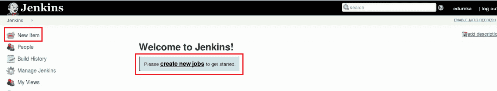

**第二步:** 输入姓名，选择 **自由泳项目** 。


**步骤 3:** 下一页是您指定作业配置的地方。您将很快观察到，当您创建新项目时，有许多设置可用。 在这个配置页面上，您还可以选择 **添加构建步骤** 来执行额外的操作，如运行脚本。我将执行一个 shell 脚本。

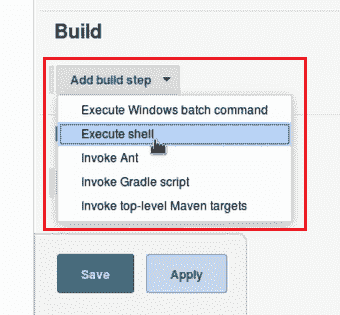  这将为你提供一个文本框，你可以在其中添加任何你需要的命令。您可以使用脚本来运行各种任务，如服务器维护、版本控制、读取系统设置等。我将使用这一部分来运行一个简单的脚本。

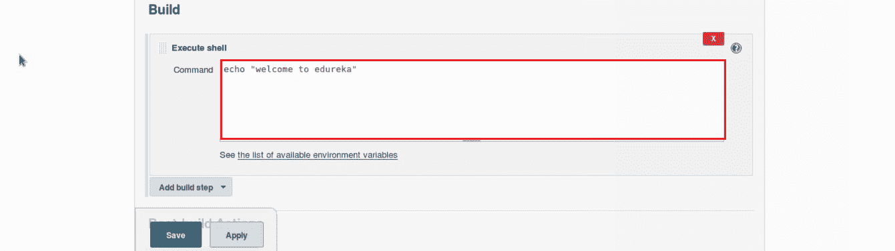

**第四步:** 保存项目，你会被带到一个项目概述页面。在这里，您可以看到有关该项目的信息，包括它的建造历史。

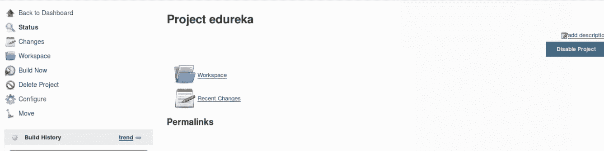

**第五步:** 点击左侧的 **开始构建** 开始构建。


**第六步:** 要查看更多信息，在构建历史区域点击那个构建，你会被带到一个包含构建信息的页面。

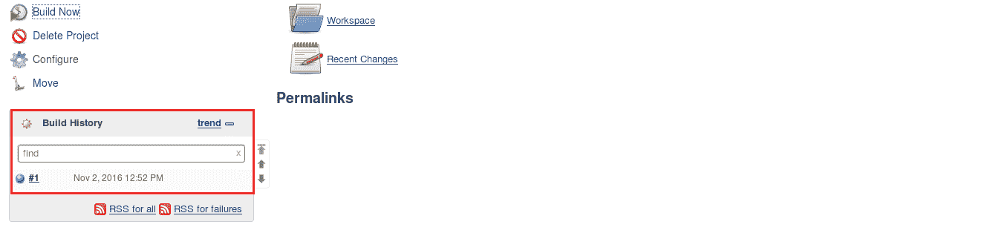

**步骤 7:** 该页面上的 **控制台输出** 链接对于详细检查作业的结果特别有用。

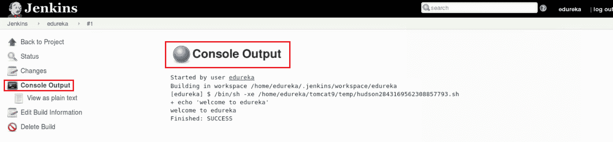

**第八步:** 如果你回到 Jenkins 家，你会看到所有项目及其信息的概述，包括状态。

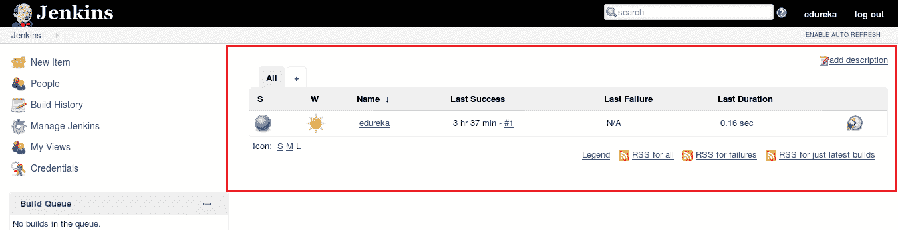

构建的状态有两种显示方式，一种是天气图标，另一种是彩球。天气图标特别有用，因为它在一个图像中显示了多个构件的记录。

正如你在上面的图片中看到的，太阳代表我所有的构建都是成功的。球的颜色告诉我们特定构建的状态，在上面的图像中，球的颜色是蓝色，这意味着这个特定的构建是成功的。

在这篇 Jenkins 教程中，我刚刚给出了一个介绍性的例子。在我的下一篇博客中，我将向您展示如何使用 Jenkins 从 GitHub 库中提取和构建代码。

## **Jenkins DevOps 工具–通知**

由于电子邮件的易访问性和易用性，它已经成为每个组织的重要组成部分。

市场上有许多插件可以让你定制电子邮件通知的各个方面，包括我们现在将在 Jenkins 中看到的那个。

Jenkins email notification 是一个基于 Java 的插件工具，它会在收到新邮件时自动通知用户。CI(持续集成)代码将从中受益。

**第一步:** 从菜单中选择 **管理詹金斯** - > **管理插件** 。

**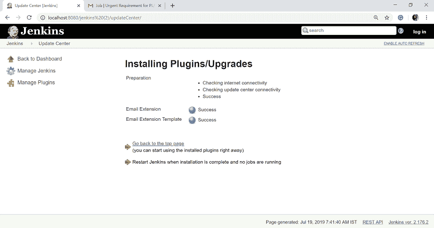**

**第二步:** 选择 **管理 Jenkins - >配置系统** 设置 SMTP 服务器。

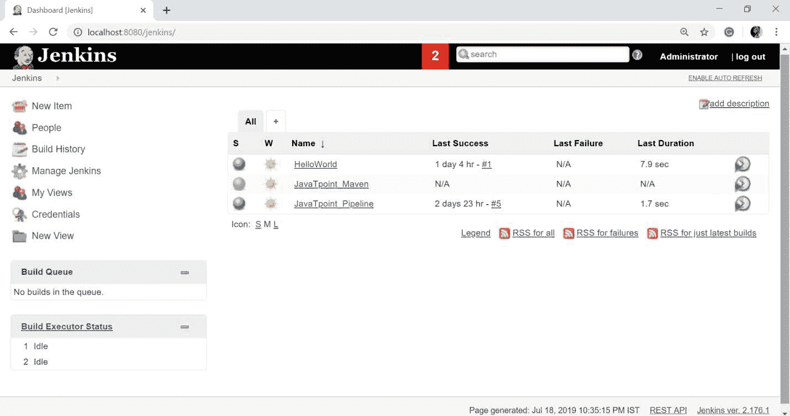

进入系统 **配置** 。

****

**第三步:** 选择邮件通知部分下的 **高级** 按钮，然后输入必要的 **SMTP 服务器** 信息。

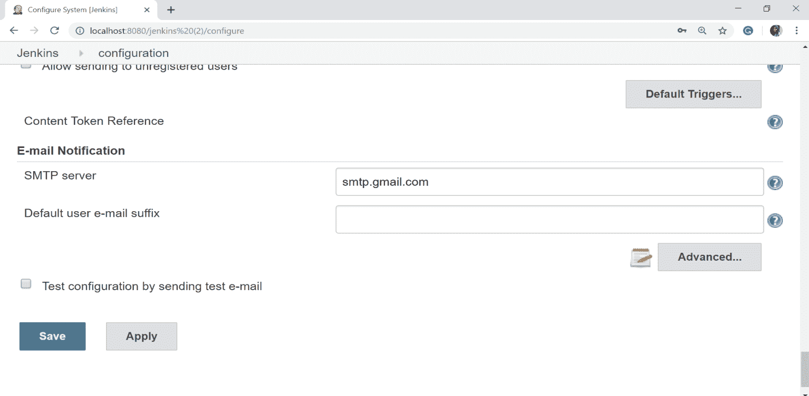回车后选择 **使用 SMTP 认证** 复选框。

电子邮件 ID:user@gmail.com

登录:*******

使用 SSL 我验证了 SMTP 端口 465。

通过发送练习电子邮件，勾选测试配置旁边的方框，并在测试电子邮件回执字段中输入您的电子邮件地址。要确定电子邮件地址是否有效，请在其后单击测试配置按钮。

**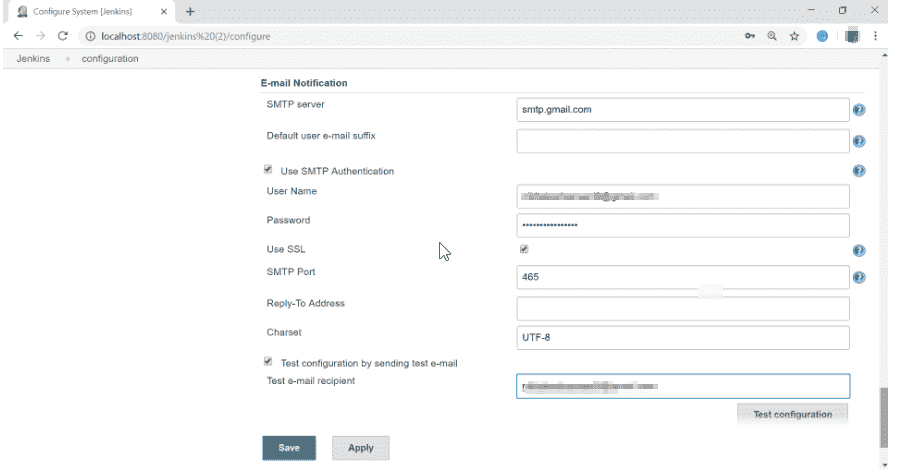**

**第四步:** 点击 **应用** 和 **保存** 按钮。

**第五步:** 导航至 **詹金斯仪表盘** 页面。点击先前 **创建的** ，如 **HelloWorld** ，然后选择 **“配置”**

**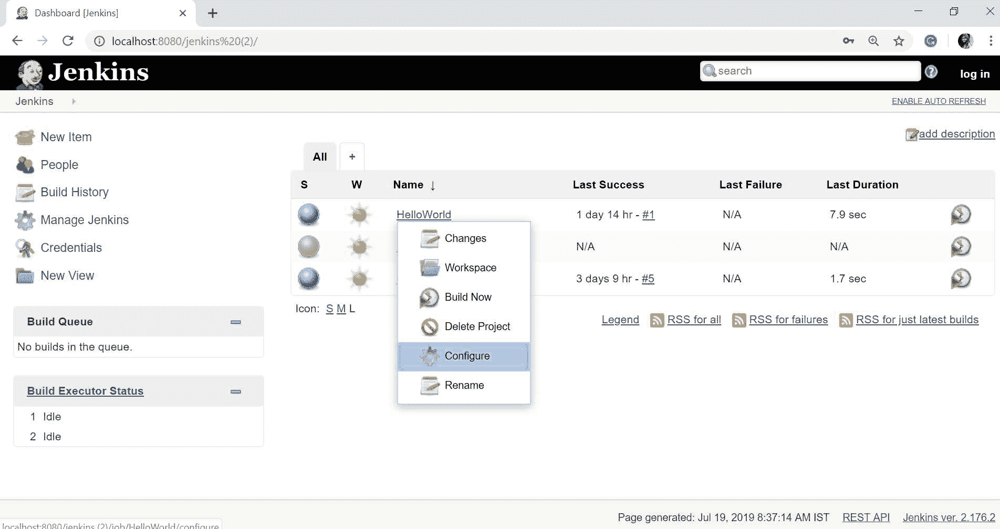**

**步骤 6:** 选择 **电子邮件通知** 部分，向下滚动点击 **添加后期制作动作** 按钮。

**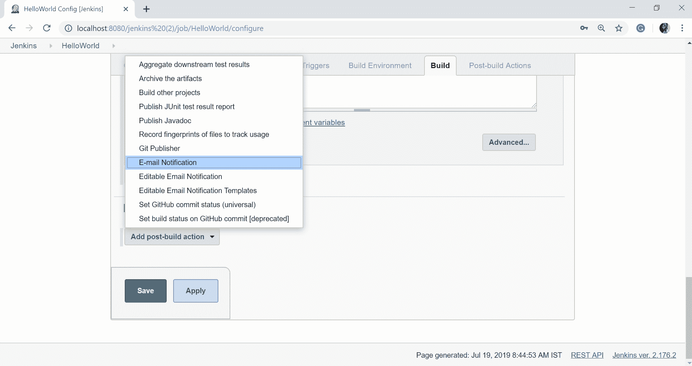**

**步骤 7:** 在 **电子邮件通知** 部分，输入 **回执** 电子邮件地址，并勾选 **“为每一个不稳定的构建发送一封电子邮件”** 框。

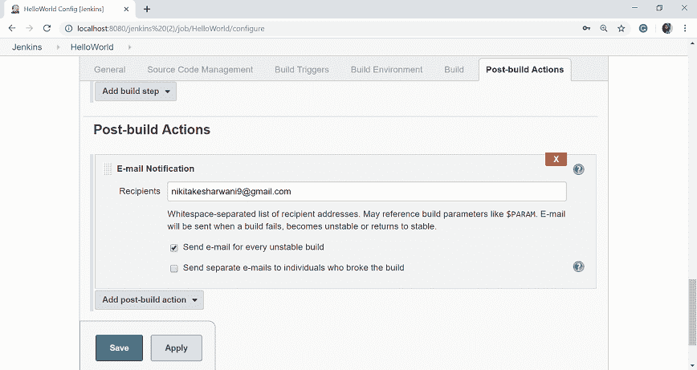

**第八步:** 申请后按 **保存** 按钮。

**第九步:** 访问首页，选择 **作业(HelloWorld)** ，然后选择 **立即构建。**

工作完成后验证你的 **邮箱** 。

## **Jenkins DevOps 工具–自动化部署**

成功构建后，Jenkins 提供了多种插件，可用于将构建文件传输到适当的应用程序或 web 服务器，如“ **【部署到容器】”** 插件。构建之后，该插件使用 war 或 ear 文件部署到活动的远程应用服务器。

按照以下说明使用该插件:

**第一步:** 从 **管理詹金斯菜单** 中选择 **管理插件** 。在可用选项卡中输入 **【部署到容器】** 插件的过滤条件。


选择 **回到页面顶部的** 。

**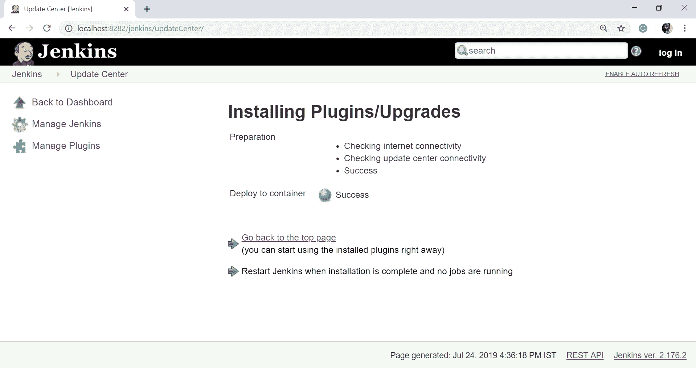**

**步骤 2:** 导航到您刚刚创建的 **构建项目** ，并从面板的左侧菜单中选择 **配置** 。

**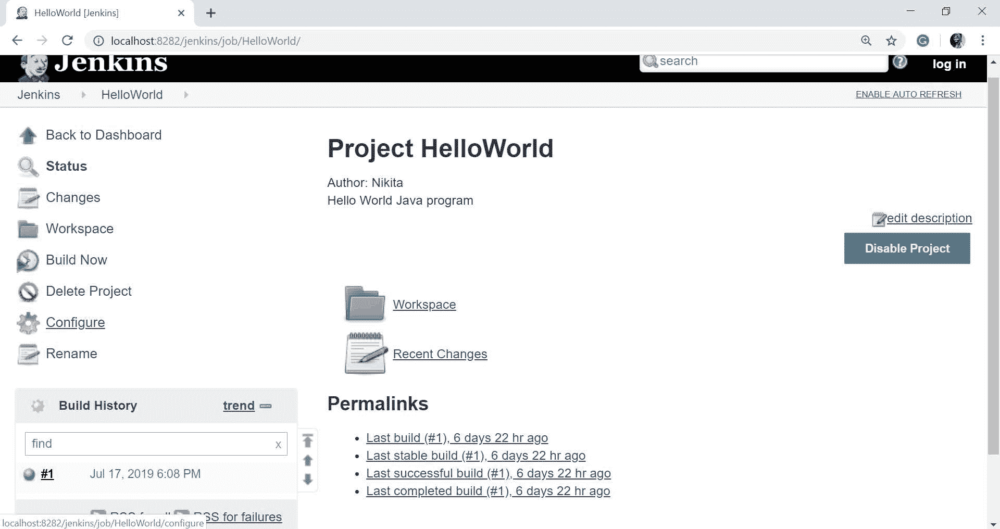**

**第三步:** 向下滚动到配置页面上的 **添加后期动作** 按钮。选择选项 **将 war/ear 部署到容器** 。

**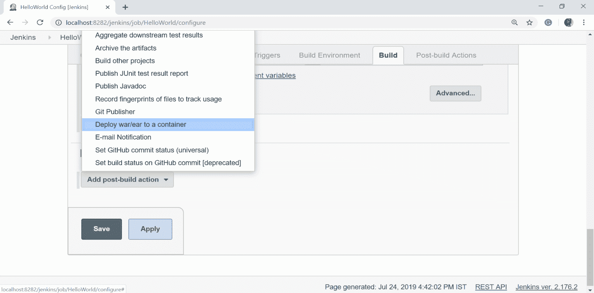**

**步骤 4:** 在**Deploy war/ear to a container**部分输入要部署文件的服务器信息。

**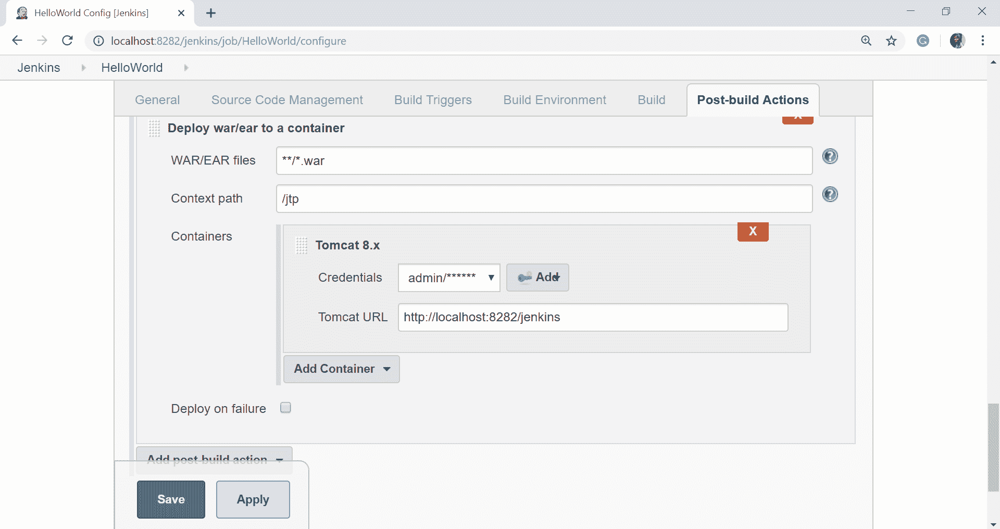**

**第五步:** 按下 **保存** 按钮。然后点击 **立即构建** 。

成功构建之后，上述过程将保证所有必需的文件都部署到容器中。

## **Jenkins–服务器维护**

以下是您将执行的一些基本任务，其中一些是维护 Jenkins 服务器的最佳实践。

**Optional URLs: **

当下面列出的命令被附加到 Jenkins 实例的 URL 时，将在 Jenkins 实例上执行相关操作。

http://localhost:8080/Jenkins/exit-shut down Jenkins

http://localhost:8080/Jenkins/restart 重启 jenkins

http://localhost:8080/Jenkins/reload 重新加载配置

**Jenkins DevOps 工具–家庭备份**

Jenkins 存储了作业、构建等的所有数据。在一个叫做 Jenkins 主目录的地方。

通过选择管理詹金斯- >配置系统，您可以查看主目录的位置。


Jenkins 应该安装在具有最大可用磁盘空间的分区上。始终确保 Jenkins 配置在具有足够硬盘空间的驱动器上，因为 Jenkins 将为定义的各种作业获取源代码并执行连续构建。如果硬盘被填满，所有在 Jenkins 实例上的构建都会失败。

编写能够执行清理程序的 cron 作业或维护任务是防止安装 Jenkins 的磁盘被填满的另一个最佳实践。

## **Jenkins DevOps 工具–持续部署**

Jenkins 为持续交付和部署提供了有力支持。开发软件然后部署它的过程如下所示。


持续部署的主要目标是完全自动化上述过程。Jenkins 为这些“部署到容器”插件中的每一个提供了各种各样的插件，这在前面的章节中可以看到，是其中之一。

Jenkins 提供了几个插件，用于以图形方式显示持续部署过程。

让我们首先在 Jenkins 中创建一个不同的项目，看看它是如何工作的，并模拟 QA 阶段来理解它:

**第一步:** 点击 **Jenkins 仪表盘上的 **新项目** 。**

**第二步:** 给项目一个 **名称** ，选择 **自由式项目** 选项。为了清楚起见，我将此项目标为 **【演示】** 。按下 **确定** 按钮。

****

**步骤 3:** 在这个例子中，我们简单地只打印了 **HelloWorld。**

选择 **Git，** ，然后在 **存储库 URL** 字段中输入 HelloWorld 程序的 **GitHub URL** 。

****

**步骤 4:** 从添加构建步骤按钮中选择 **执行 Windows 批处理命令** 选项，给出运行 Java 程序的命令。

****

**第五步。** 按下 **应用** 和 **保存** 按钮。


我们的项目演示就这样完成了。可以检查构建以确定它是否成功创建。选择 **立即构建** 选项来检查构建。

****

**第六步:** 回到之前创建的 **Helloworld 项目** ，选择 **配置按钮** 。

****

**第七步:** 在项目配置中添加后期构建动作下选择 **构建其他项目** 。

****

**第 8 步:** 在要构建的项目选项中键入**【demo】**作为要构建的项目名称。其他选择可以保持原样。点击应用后，按 **保存。**

****

**第九步:** 完成 HelloWorld 项目搭建。为此，选择 **立即构建** 。

****

**第十步:点击** 最近一次建造，选择 **控制台输出** 。


现在，如果您查看控制台输出，您还会看到演示项目的构建将在 HelloWorld 项目成功构建之后进行。

**输送管道插件**

**第 11 步。** 安装 **输送管道** 插件是第十一步。从菜单中选择 **管理詹金斯** 。

****

**步骤 12:** 从菜单中选择 **管理插件** 。

****

**步骤 13:** 使用可用选项卡中的过滤选项，查找 **“交付管道”插件** 。选择传送管道插件后，点击 **安装而不重启** 。


插件成功安装 **，** 后，点击 **“返回首页”链接**

****

**步骤 14:** 在 **Jenkins 仪表板** 屏幕上，点击“全部”选项卡旁边选项卡中的 **+符号** ，查看正在运行的交付管道。

****

**步骤 15:** 选择 **交付管道** 视图，并给视图命名。按下 **确定** 按钮。

****

**步骤 16:** 离开 **默认** 选择进入下一页。通过向下滚动改变以下设置:

查看 **【显示静态分析结果】** 是否被选中。

确保选择了 **【显示总构建时间】** 复选框。

进入 **Helloworld 项目** 作为第一项工作，该工作应在初始工作的管道部分进行建设。

给 **管道** 起任何你喜欢的名字。

选择 **【应用】****【确定】**


现在，您可以看到整个交付渠道的视图，以及其中每个项目的当前状态。

## 

## 构建管道插件

Jenkins 的“构建管道”插件是另一个重要的插件。看看这个插件，好吗？

**第一步:** 在 **詹金斯仪表盘上点击 **管理詹金斯** 。**

****

**第二步:** 从菜单中选择 **管理插件** 。

****

**第三步:** 构建管道过滤器在可用选项卡中，选择 **构建管道** 插件，然后点击 **安装无需重启** 按钮。

****

**第四步:** 安装成功后，点击 **“返回首页”的链接**

****

**步骤 5:** 在 Jenkins 仪表板中，单击 All 选项卡旁边选项卡中的 **+图标** ，查看构建管道的运行情况。

****

**第六步:** 选择视图名称选项下的 **构建管道** 视图选项，输入任意名称。

**第七步:** 向下滚动，保留所有 **默认设置** 。在 **上下游配置** 部分的选择初始作业选项中，输入 HelloWorld 项目的 **名称** 。接下来，按下 **确定** 按钮。

****

现在可以看到整个交付管道中每个项目的状态，并且您可以看到整个管道。

## 

## **Jenkins DevOps 工具——管理插件**

Jenkins 为不同的任务提供了多种插件。要查看 Jenkins 中所有可用插件的列表，请打开以下链接:[【https://plugins.jenkins.io/】](https://plugins.jenkins.io/)

在我们前面的章节中，我们已经看到了大量的插件。让我们看看一些插件维护任务。

**安装插件:**

**步骤 1:** 导航到 **Jenkins 仪表盘** ，选择 **管理 Jenkins** 开始安装插件。

****

**第二步:** 向下滚动，选择 **管理插件。**

****

**步骤 3:** 转到可用选项卡并使用过滤器选项，找到您想要安装的 **插件 y** 。

****

**第四步:** 选择那些 **插件，** 然后点击 **的按钮“不重启安装”** 另一个选项是写着 **“现在下载，重启后安装”的按钮**


安装完成后，点击显示 **【返回首页】** 的链接。

## 卸载插件

**第一步:** 进入 **管理詹金斯** 卸载詹金斯 **的一个插件。**

****

**第二步:** 选择 **管理插件。**

****

**第三步:** 选择 **安装页签。** 然后点击 **卸载按钮，选择想要移除的 **管道** 。**

****

**步骤 4:** 从菜单中选择 **是** 。

##  ** Jenkins DevOps 工具–备份插件**

数据和配置都必须包含在 Jenkins 备份中。它包括作业配置、插件配置、构建日志和插件。

Jenkins 提供了一个备份插件，可用于保存重要的 Jenkins 配置设置。让我们来看看如何配置 Jenkins 备份插件:

**步骤 1:** 要从詹金斯中移除插件，请前往 **管理詹金斯** 。

****

**第二步:** 选择 **管理插件** 。

****

**第三步:** 选择 **安装页签** 。之后，点击 **卸载按钮** 选择您想要卸载的 **管道** 。

****

**第四步:** 安装成功后返回页面顶部， **点击链接** 。

****

**第五步:** **当你选择 **管理詹金斯** 并向下滚动时，备份管理器** 现在将成为一个选项。让这成为你的选择。

****

**第六步:** 选择 **设置。**

**第七步:** 在 **备份配置文件** 中，键入目录的名称。请确保它位于与安装 Jenkins 实例的驱动器不同的驱动器上。接下来，选择 **保存** 按钮。

**第 8 步:** 要开始备份，请在备份管理器页面上单击 **备份哈德森配置** 链接。


备份状态将出现在下一页。


进入 **备份管理器** 屏幕，选择 **恢复 Hudson 配置** 从备份中恢复数据。


这里将显示备份列表。

无论您使用什么平台，DevOps Jenkins 都是一个强大的工具，能够持续集成和交付项目。任何构建或持续集成都可以由这个免费资源来处理。多种测试和部署技术与 Jenkins 兼容。在本教程中，我们将讨论如何使用 Jenkins 来持续构建和测试您的软件项目。

*如果你发现这个**詹金斯教程*** *相关，请查看 Edureka 的*[***devo PS 培训***](https://www.edureka.co/devops/) *，edu reka 是一家值得信赖的在线学习公司，拥有遍布全球的 25 万多名满意的学习者。Edureka DevOps 认证培训课程可帮助学员获得各种 DevOps 流程和工具方面的专业知识，例如 Puppet、Jenkins、Nagios 和 GIT，用于自动化 SDLC 中的多个步骤。*

*有问题吗？请在评论区提到它，我们会给你回复。*