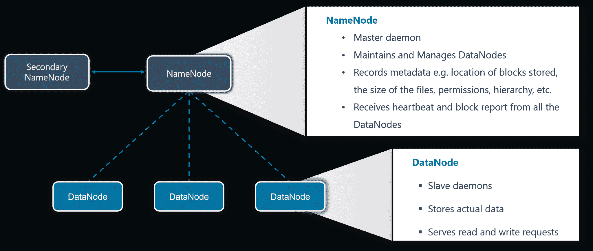
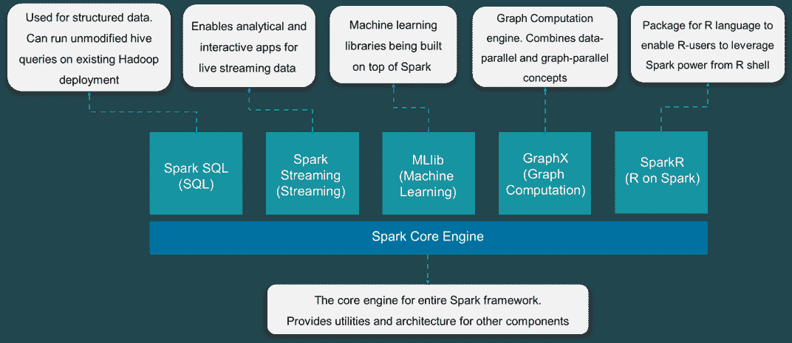
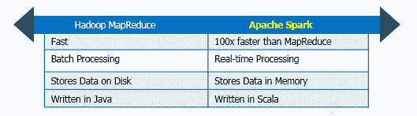
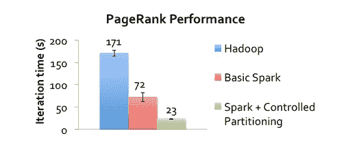
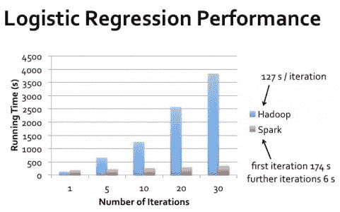

# Spark vs Hadoop:哪个是最好的大数据框架？

> 原文：<https://www.edureka.co/blog/apache-spark-vs-hadoop-mapreduce>

在这篇 Apache Spark vs Hadoop 的博客中，我将首先介绍 Hadoop 和 Spark，以便为这两个框架设置合适的环境。接下来，我们将从不同的参数比较两种大数据框架，以分析它们的优势和劣势。但是，无论我们的比较结果如何，你应该知道 Spark 和 Hadoop 都是 ***[大数据课程课程表](https://www.edureka.co/masters-program/big-data-architect-training#curriculum)*** 的重要组成部分。

## **Apache Spark vs Hadoop:Hadoop 简介**

Hadoop 是一个框架，它允许你首先在分布式环境中存储大数据，以便你可以并行处理它。Hadoop 中基本上有两个组件:

### HDFS

HDFS 创造了资源的抽象，让我来为你简化一下。与虚拟化类似，您可以从逻辑上将 HDFS 视为存储大数据的单个单元，但实际上您是以分布式方式跨多个节点存储数据。在这里，你有主从架构。在 HDFS，Namenode 是主节点，Datanodes 是从节点。

#### **NameNode**

主守护进程维护和管理数据节点(从节点)。它记录存储在集群中的所有文件的元数据，例如存储块的位置、文件的大小、权限、层次结构等。它记录文件系统元数据发生的每一次更改。

例如，如果在 HDFS 删除了一个文件，NameNode 会立即在编辑日志中记录下来。它定期从集群中的所有数据节点接收心跳和数据块报告，以确保数据节点处于活动状态。它记录了 HDFS 的所有数据块以及这些数据块存储在哪些节点中。

#### DataNode

这些是运行在每台从属机器上的从属守护进程。实际数据存储在 DataNodes 上。它们负责处理来自客户端的读写请求。它们还负责根据 NameNode 做出的决定创建、删除和复制数据块。

### **纱**

YARN 通过分配资源和调度任务来执行您的所有处理活动。它有两个主要的守护进程，即**资源管理器**和**节点管理器**。

#### **资源管理器**

它是一个集群级(每个集群一个)组件，在主机上运行。它管理资源并调度运行在 YARN 之上的应用程序。

#### **节点管理器**

它是一个节点级组件(每个节点一个)，运行在每个从机上。它负责管理容器并监控每个容器中的资源利用情况。它还跟踪节点健康状况和日志管理。它不断与 ResourceManager 通信以保持最新状态。因此，您可以使用 MapReduce 在 HDFS 上执行并行处理。

想了解更多关于 Hadoop 的知识，可以通过这个 ***[Hadoop 教程](https://www.edureka.co/blog/hadoop-tutorial/)*** 博客。现在，我们已经为 Hadoop 简介做好了准备，让我们继续 Spark 简介。

## **Apache Spark vs Hadoop:Apache Spark 简介**

Apache Spark 是一个用于分布式计算环境中实时数据分析的框架。它执行内存计算以提高数据处理速度。由于利用了内存计算和其他优化，它处理大规模数据的速度更快。所以需要很高的处理能力。

弹性分布式数据集(RDD)是 Spark 的基础数据结构。它是一个不可变的分布式对象集合。RDD 中的每个数据集都被划分为逻辑分区，这些分区可以在集群的不同节点上进行计算。rdd 可以包含任何类型的 Python、Java 或 Scala 对象，包括用户定义的类。火花元件使其快速可靠。Apache Spark 有以下组件:

1.  **Spark Core**–Spark Core 是大规模并行和分布式数据处理的基础引擎。此外，构建在核心之上的额外库允许流、SQL 和机器学习的不同工作负载。它负责内存管理和故障恢复，调度、分发和监控集群上的作业&与存储系统交互
2.  **Spark Streaming**–Spark Streaming 是 Spark 的组件，用于处理实时流数据。因此，它是对核心 Spark API 的有益补充。它支持实时数据流的高吞吐量和容错流处理
3.  **Spark SQL** : Spark SQL 是 Spark 中的一个新模块，它将关系处理与 Spark 的函数式编程 API 集成在一起。它支持通过 SQL 或 Hive 查询语言查询数据。对于那些熟悉 RDBMS 的人来说，Spark SQL 将是从早期工具的简单过渡，在早期工具中，您可以扩展传统关系数据处理的边界。
4.  **GraphX** : GraphX 是用于图形和图形并行计算的 Spark API。因此，它用弹性分布式属性图扩展了火花 RDD。在高层次上，GraphX 通过引入弹性分布式属性图扩展了 Spark RDD 抽象:一个每个顶点和边都有属性的有向多图。
5.  **MLlib** (机器学习):MLlib 代表机器学习库。Spark MLlib 用于在 Apache Spark 中执行机器学习。

如你所见，Spark 附带了高级库，包括对 R、SQL、Python、Scala、Java 等的支持。这些标准库增加了复杂工作流程中的无缝集成。此外，它还允许各种服务与其集成，如 MLlib、GraphX、SQL +数据帧、流服务等。来增强它的能力。

想了解更多关于 Apache Spark 的内容，可以通过这个 ***[Spark 教程](https://www.edureka.co/blog/spark-tutorial/)*** 博客。现在，Apache Spark vs Hadoop 的一切都准备好了。让我们继续比较 Apache Spark 和 Hadoop 的不同参数，以了解它们的优势。

## **Apache Spark vs Hadoop:参数对比**

### **表现**

Spark 速度很快，因为它有内存处理功能。它还可以将磁盘用于存储不适合内存的数据。Spark 的内存处理提供近乎实时的分析。这使得 Spark 适用于信用卡处理系统、机器学习、安全分析和物联网传感器。

Hadoop 最初被设置为从多个来源持续收集数据，而不用担心数据的类型并将其存储在分布式环境中。MapReduce 使用批处理。MapReduce 从来不是为实时处理而构建的，YARN 背后的主要思想是在分布式数据集上并行处理。

比较这两者的问题在于它们执行处理的方式不同。

### **易用性**

Spark 为 Scala、Java、Python 和 Spark SQL 提供了用户友好的 API。Spark SQL 与 SQL 非常相似，因此 SQL 开发人员学习它变得更加容易。Spark 还提供了一个交互外壳，供开发者查询&执行其他动作，&有即时反馈。

通过使用 shell 或将其与 Sqoop、Flume 等多种工具集成，您可以轻松地在 Hadoop 中获取数据。YARN 只是一个处理框架，它可以与多种工具集成，如 Hive 和 Pig。HIVE 是一个数据仓库组件，它使用类似 SQL 的接口在分布式环境中读取、写入和管理大型数据集。你可以通过这篇 ***Hadoop 生态系统*** 的博客，了解可以与 Hadoop 集成的各种工具。

### **费用**

Hadoop 和 Spark 都是 Apache 开源项目，所以软件没有成本。成本只与基础设施相关。这两种产品都设计成可以在低 TCO 的商用硬件上运行。

现在你可能想知道它们的不同之处。Hadoop 中的存储&处理是基于磁盘的& Hadoop 使用标准数量的内存。因此，对于 Hadoop，我们需要大量的磁盘空间以及更快的磁盘。Hadoop 还需要多个系统来分配磁盘 I/o。

由于 Apache Spark 的内存处理需要大量内存，但它可以处理标准速度的&数量的磁盘。因为磁盘空间是一种相对便宜的商品，而且 Spark 不使用磁盘 I/O 进行处理，而是需要大量的 RAM 来执行内存中的所有内容。因此，火花系统导致更多的成本。

但是，需要记住的一件重要事情是，Spark 的技术减少了所需系统的数量。它需要更少的系统，但成本更高。因此，Spark 会在某一点上降低每单位计算的成本，即使需要额外的 RAM。

### **数据处理**

数据处理有两种类型:批处理&流处理。

#### **批处理 vs 流处理**

**批处理**:批处理对大数据世界至关重要。简而言之，批处理就是处理一段时间内收集的大量数据。在批处理中，首先收集数据，然后在稍后阶段产生处理结果。

批处理是处理大型静态数据集的有效方式。通常，我们对存档的数据集进行批处理。例如，计算一个国家的平均收入或评估电子商务在过去十年中的变化。

**流处理**:流处理是当前大数据世界的趋势。当前需要的是速度和实时信息，这正是 steam 处理所做的。批处理不允许企业对实时变化的业务需求做出快速反应，流处理的需求出现了快速增长。

现在回到 Apache Spark vs Hadoop，YARN 基本上是一个批处理框架。当我们向 YARN 提交一个作业时，它从集群中读取数据，执行操作&将结果写回集群。然后，它再次读取更新的数据，执行下一个操作&将结果写回集群，依此类推。

Spark 执行类似的操作，但它使用内存中处理，并优化了步骤。GraphX 允许用户以图形和集合的形式查看相同的数据。用户还可以用弹性分布式数据集(rdd)转换和连接图形。

Hadoop 和 Spark 都提供容错功能，但两者的方法不同。对于 HDFS 和 YARN 两者，主守护进程(即分别为 NameNode & ResourceManager)检查从守护进程(即分别为 DataNode & NodeManager)的心跳。如果任何从属守护程序失败，主守护程序会将所有未决和正在进行的操作重新安排给另一个从属守护程序。这种方法是有效的，但是它也可以显著增加具有单一故障的操作的完成时间。由于 Hadoop 使用商用硬件，HDFS 确保容错的另一种方式是复制数据。

正如我们上面讨论的，rdd 是 Apache Spark 的构建模块。rdd 提供对火花的容错。它们可以引用外部存储系统中的任何数据集，如 HDFS、HBase、共享文件系统。它们可以并行操作。

rdd 可以跨操作将数据集保存在内存中，这使得未来的操作快了 10 倍。如果 RDD 丢失，将使用原始变换自动重新计算。这就是 Spark 提供容错的方式。

Hadoop 支持 Kerberos 进行认证，但是处理起来比较困难。然而，它也支持像 LDAP(轻量级目录访问协议)这样的第三方供应商进行身份验证。他们还提供加密。HDFS 支持传统的文件权限，以及访问控制列表(ACL)。Hadoop 提供服务级授权，保证客户端拥有提交作业的正确权限。

Spark 目前支持通过共享密钥进行认证。Spark 可以与 HDFS 集成，并且可以使用 HDFS ACL 和文件级权限。Spark 也可以利用 Kerberos 的功能在 YARN 上运行。

## **Hadoop 最适合的用例:**

*   **分析归档数据。** YARN 允许并行处理海量数据。部分数据在不同的 DataNodes 上分别并行处理&&从各个 NodeManager 收集结果。
*   **如果不需要即时结果。** Hadoop MapReduce 是一个好的、经济的批处理解决方案。

## **火花最适合的用例:**

### **实时大数据分析:**

实时数据分析是指处理实时事件流产生的数据，这些实时事件流以每秒数百万个事件的速度流入，例如 Twitter 数据。Spark 的优势在于它支持数据流和分布式处理的能力。这是一个有用的组合，提供了近乎实时的数据处理。MapReduce 没有这样的优势，因为它被设计为对大量数据执行批处理和分布式处理。MapReduce 仍然可以处理实时数据，但它的速度远不及 Spark。

Spark 声称处理数据的速度比 MapReduce 快 100 倍，而使用磁盘则快 10 倍。

### **图形处理:**

像 page rank 这样的大多数图形处理算法对相同的数据执行多次迭代，这需要一种消息传递机制。我们需要对 MapReduce 进行显式编程，以处理对相同数据的多次迭代。大致来说，它是这样工作的:从磁盘中读取数据，在一次特定的迭代之后，将结果写入 HDFS，然后从 HDFS 中读取数据以进行下一次迭代。这是非常低效的，因为它涉及向磁盘读写数据，这涉及繁重的 I/O 操作和跨群集的数据复制以实现容错。此外，每次 MapReduce 迭代都有很高的延迟，下一次迭代只有在前一个作业完全完成后才能开始。

此外，消息传递需要相邻节点的分数，以便评估特定节点的分数。这些计算需要来自邻居的消息(或跨作业多个阶段的数据)，这是 MapReduce 所缺乏的机制。设计了不同的图形处理工具，如 Pregel 和 GraphLab，以满足对图形处理算法的高效平台的需求。这些工具速度快且可扩展，但是对于这些复杂的多阶段算法的创建和后处理来说效率不高。

Apache Spark 的引入在很大程度上解决了这些问题。Spark 包含一个名为 GraphX 的图形计算库，它简化了我们的生活。与传统的 MapReduce 程序相比，内存中的计算和内置的图形支持将算法的性能提高了一到两个数量级。Spark 使用 Netty 和 Akka 的组合在整个执行器中分发消息。让我们来看一些描述使用 Hadoop 和 Spark 的 PageRank 算法的性能的统计数据。

### **迭代机器学习算法:**

几乎所有的机器学习算法都是迭代工作的。正如我们前面看到的，迭代算法在 MapReduce 实现中涉及到 I/O 瓶颈。MapReduce 使用的粗粒度任务(任务级并行)对于迭代算法来说过于繁重。Spark 在 Mesos(一种分布式系统内核)的帮助下，在每次迭代后缓存中间数据集，并在这个缓存的数据集上运行多次迭代，这减少了 I/O，并有助于以容错方式更快地运行算法。

Spark 有一个名为 MLlib 的内置可扩展机器学习库，其中包含高质量的算法，这些算法利用迭代并产生比 MapReduce 上有时使用的一次近似更好的结果。

*   **快速数据处理。**我们知道，Spark 允许内存处理。因此，Spark 处理 RAM 中的数据的速度提高了 100 倍，处理存储中的数据的速度提高了 10 倍。
*   **迭代处理。** Spark 的 rdd 允许在内存中执行多种映射操作，而无需将临时数据集写入磁盘。
*   **接近实时处理。** Spark 是一个提供即时商业洞察的优秀工具。这就是为什么 Spark 被用于信用卡的流系统的原因。

## ***“Apache Spark:是黑仔还是 Apache Hadoop 的救星？”***

这个问题的答案是——Hadoop MapReduce 和 Apache Spark 并不相互竞争。其实两者互补的挺好的。Hadoop 将庞大的数据集置于商用系统的控制之下。Spark 为那些需要的数据集提供实时的内存处理。当我们将 Apache Spark 的能力(即高处理速度、高级分析和多重集成支持)与 Hadoop 在商用硬件上的低成本操作相结合时，它可以提供最佳结果。Hadoop 补充了 Apache Spark 的功能。Spark 无法完全取代 Hadoop，但好消息是，目前对 Spark 的需求正处于历史最高水平！这是掌握 Spark 并充分利用你所面临的职业机会的最佳时机。现在就开始！

*有问题吗？请在评论区提到它，我们会尽快回复您。*

*如果您希望学习 Spark，并在 Spark 领域建立职业生涯，使用 RDD、Spark Streaming、SparkSQL、MLlib、GraphX 和 Scala 并结合现实生活中的用例来执行大规模数据处理，请查看我们的交互式在线直播* *[Apache Spark 认证培训](https://www.edureka.co/apache-spark-scala-training)此处，* *该培训提供 24*7 支持，可在整个学习期间为您提供指导。*