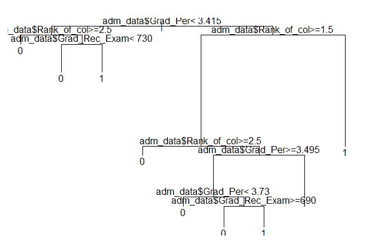
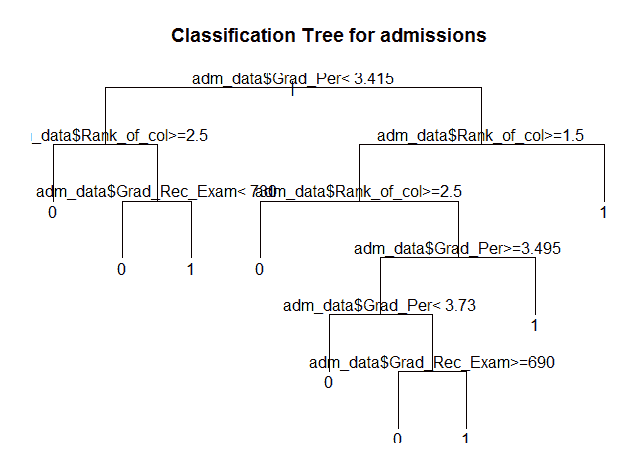
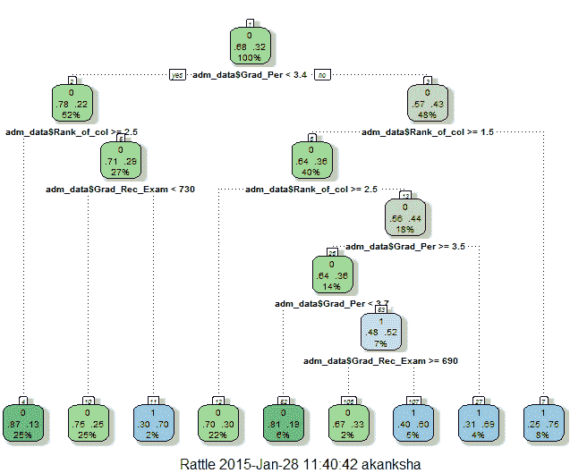
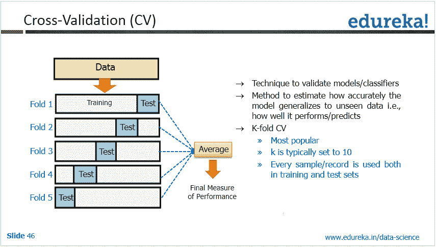
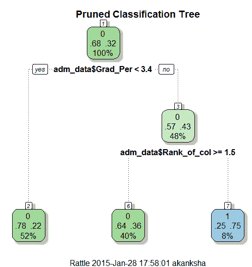

# R 中决策树的创建、验证和修剪

> 原文：<https://www.edureka.co/blog/implementation-of-decision-tree/>

R 为数据科学 为数据分析&数据科学专业人士必须学习。随着 IT 行业的发展，对理解 r 中主要概念的 ***[熟练数据科学家](https://www.edureka.co/data-science)*** 的需求日益增长。其中一个概念就是决策树。

在这篇博客中，我们将讨论:

1.如何为录取数据创建决策树？

2.使用拨浪鼓绘制树。

3.使用“复杂性参数”和交叉验证错误来验证决策树。

4.根据这些参数对树进行修剪，以创建最佳决策树。

要了解什么是决策树，背后的统计机制是什么，可以看这个帖子: [如何打造完美的决策树](https://www.edureka.co/blog/decision-trees/ "How to create a perfect decision tree")

## 在 R 中创建、验证和修剪决策树

为了在 R 中创建一个决策树，我们需要使用函数 rpart()，或者 tree()，party()，等等。

rpart()包用于创建树。它允许我们使用数据中存在的所有属性来生长整个树。

```
> library("rpart")
> setwd("D://Data")
> data <- read.csv("Gre_Coll_Adm.csv")
> str(data)
 'data.frame': 400 obs. of 5 variables:
 $ X : int 1 2 3 4 5 6 7 8 9 10 ...
 $ Admission_YN : int 0 1 1 1 0 1 1 0 1 0 ...
 $ Grad_Rec_Exam: int 380 660 800 640 520 760 560 400 540 700 ...
 $ Grad_Per : num 3.61 3.67 4 3.19 2.93 3 2.98 3.08 3.39 3.92 ...
 $ Rank_of_col : int 3 3 1 4 4 2 1 2 3 2 ...
> View(data)
```

[](https://www.edureka.co/blog/wp-content/uploads/2015/01/bc9-1.png)

```
> adm_data<-as.data.frame(data)
> tree <- rpart(Admission_YN ~ adm_data$Grad_Rec_Exam + adm_data$Grad_Per+ adm_data$Rank_of_col,
 + data=adm_data,
 + method="class")
```

rpart 语法采用“从属属性”,其余属性在分析中是独立的。

入学 _YN:从属属性。因为录取取决于分数、大学排名等因素。

Grad_Rec_Exam、Grad_Per 和 Rank_of_col:独立属性

rpart()返回为数据创建的决策树。

如果您绘制这个树，您可以看到由于 R 控制台中绘图窗口的限制，它是不可见的。

```
> plot(tree)
> text(tree, pretty=0)
```

[ ](https://www.edureka.co/blog/wp-content/uploads/2015/01/bc31.png) 让我们试着修复它:

[](https://www.edureka.co/blog/wp-content/uploads/2015/01/bc61.png)

## 用拨浪鼓画树:

为了增强它，让我们从 rattle 得到一些帮助:

```
> library(rattle)
> rattle()
```

[](https://www.edureka.co/blog/wp-content/uploads/2015/01/bc41.png)

Rattle()是 R 的一个独特特性，它是专门为 R 中的数据挖掘而构建的。除了 R 控制台之外，它还提供了自己的 GUI，这使得分析数据更加容易。它有内置的图形，这也为我们提供了更好的可视化。在这里，我们将使用 Rattle 的绘图功能来实现一个像样的决策树绘图。

```
> library(rpart.plot)
> library(RColorBrewer)
```

rpart.plot()和 RcolorBrewer()函数帮助我们创建一个漂亮的情节。rpart.plot()'绘制 rpart 模型。它扩展了 rpart 包中的 plot.rpart 和 text.rpart。RcolorBrewer()为我们提供了漂亮的调色板和图形。

```
> fancyRpartPlot(tree)
```

[](https://www.edureka.co/blog/wp-content/uploads/2015/01/bc11.png)

这是在 r 中创建决策树的一种简单而有效的方法。但是您确定这是该数据的最佳“决策树”吗？如果没有，下面的验证检查将对您有所帮助。

同时，如果你想学习 R 编程，点击下面的按钮，查看我们特别策划的课程。

## 使用“复杂性参数”和交叉验证错误验证决策树:

为了验证模型，我们使用 printcp 和 plotcp 函数。“CP”代表树的复杂度参数。

语法:printcp ( x)其中 x 是 rpart 对象。

该功能根据 cp 值提供最佳清洗。

我们修剪了树以避免数据的过度拟合。约定是有一个小的树和一个由 printcp()函数给出的交叉验证错误最小的树，即“xerror”。

交叉验证错误:

[](https://www.edureka.co/blog/wp-content/uploads/2015/01/bc81.png)

为了了解树的性能，由 printcp()函数计算，基于它我们可以继续修剪树。

```
> printcp(tree)
Classification tree:
 rpart(formula = Admission_YN ~ adm_data$Grad_Rec_Exam + adm_data$Grad_Per +
 adm_data$Rank_of_col, data = adm_data, method = "class")
Variables actually used in tree construction:
 [1] adm_data$Grad_Per adm_data$Grad_Rec_Exam adm_data$Rank_of_col
Root node error: 127/400 = 0.3175
n= 400
CP nsplit rel error xerror xstd
 1 0.062992 0 1.00000 1.00000 0.073308
 2 0.023622 2 0.87402 0.92913 0.071818
 3 0.015748 4 0.82677 0.99213 0.073152
 4 0.010000 8 0.76378 1.02362 0.073760
```

从上面提到的 cp 值列表中，我们可以选择具有最小交叉验证误差的一个，并使用它来修剪树。

**CP 的值应该最小，这样交叉验证的错误率最小。**

要选择此选项，您可以使用:

fit $ CP table[which . min(fit $ CP table[，" xerror"])，" CP"]

该函数返回与最小误差相关的最佳 cp 值。

让我们看看 plotcp()函数获取了什么。

```
> plotcp(tree)
```

[](https://www.edureka.co/blog/wp-content/uploads/2015/01/bc51.png)

[](https://www.edureka.co/blog/wp-content/uploads/2015/01/bc5.png)Plotcp()提供了交叉验证误差汇总的图形表示。cp 值相对于几何平均值作图，以描述偏差，直到达到最小值。

## 修剪该树以创建最佳决策树:

```
> ptree<- prune(tree,
 + cp= tree$cptable[which.min(tree$cptable[,"xerror"]),"CP"])
> fancyRpartPlot(ptree, uniform=TRUE,
 + main="Pruned Classification Tree")
```

[ ](https://www.edureka.co/blog/wp-content/uploads/2015/01/bc71.png) 这样我们就创建了一个修剪过的决策树。

如果您希望在 R 编程方面有一个良好的开端，请查看 Edureka 的数据分析与 R 课程。

有问题要问我们吗？请在评论区提及它们，我们将会回复您。

**相关帖子:**

[对犯罪数据集实施 K-means 聚类](https://www.edureka.co/blog/implementing-kmeans-clustering-on-the-crime-dataset/ "Implementing K-means clustering")

[数据科学入门](https://www.edureka.co/data-science "Get started with Data Science")

[R](https://www.edureka.co/r-for-analytics "Get started with Data Analytics with R")商业分析入门