# 什么是 Informatica:Informatica power center 入门教程

> 原文：<https://www.edureka.co/blog/what-is-informatica/>

这些年来，Informatica 一直是数据集成技术的领导者，但它确实让我们好奇为什么会有这么多关于 Informatica 的讨论，最重要的是什么是 Informatica！作为这个博客的一部分，我将尝试回答所有这些问题。

## **什么是 Informatica，为什么要用？**

Informatica 有几个专注于数据集成的产品。然而，Informatica PowerCenter 是该产品组合中的旗舰产品。它变得如此受欢迎，以至于 Informatica PowerCenter 现在已经成为 Informatica 的同义词。所以现在每当我在博客中使用 Informatica，它本质上意味着 Informatica PowerCenter。Informatica 是一个基于 ETL 架构的数据集成工具。它为各种企业、行业和政府机构提供数据集成软件和服务，包括电信、医疗保健、金融和保险服务。让我们看一下一些关键指标，以了解为什么它是数据集成技术的领导者。

## **信息化关键指标:**

以下几个统计数据相当准确地反映了对  [**信息认证**](https://www.edureka.co/informatica) 需求的增长:

*   2015 年收入:10.6 亿美元，超过 Abinitio、datastage、SSIS 和其他 ETL 工具的总收入
*   7 年期年 CAGR: 30%
*   合作伙伴:450+
*   主要 SI、ISV、OEM 和按需领导者
*   客户:超过 5000 人
*   82 个国家的客户&在 28 个国家直接开展业务
*   客户忠诚度排名第一，连续 7 年

上述指标清楚地表明，全球对信息的需求很大。但是同样重要的是理解 Informatica 解决什么样的问题，以及这些问题对商业企业是否至关重要。要了解什么是信息及其重要性，我们必须首先了解以下 3 件事:

*   ***数据集成使用的上下文是什么？***
*   ***什么是 ETL？***
*   ***为什么说 Informatica，它的现实应用是什么？***

## **使用数据集成的背景是什么？**

如今，每家公司都要处理大量数据。它们来自不同的来源，需要进行处理，以便为制定业务决策提供有见地的信息。但是这种数据经常面临以下挑战:

*   拥有大量数据的大公司:如此庞大的数据可以是任何格式。它们将在多个数据库和许多非结构化文件中可用。
*   这些数据必须被整理、组合、比较，并作为一个无缝的整体工作。但是不同的数据库不能很好地通信！
*   许多组织已经实现了这些数据库之间的接口:
    *   每对数据库都需要一个独特的接口
    *   如果您更改一个数据库，许多接口可能需要升级

<figure id="attachment_35932" aria-describedby="caption-attachment-35932" style="width: 528px" class="wp-caption aligncenter">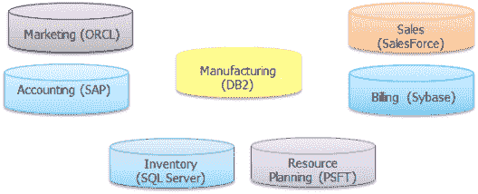

<figcaption id="caption-attachment-35932" class="wp-caption-text">                                  Different Databases</figcaption>

</figure>

<figure id="attachment_35933" aria-describedby="caption-attachment-35933" style="width: 528px" class="wp-caption aligncenter">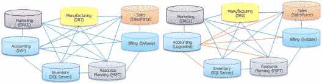

<figcaption id="caption-attachment-35933" class="wp-caption-text">                                   Different Interface</figcaption>

</figure>

数据集成是所有此类问题的解决方案。数据集成技术允许来自不同数据库和格式的数据相互通信。

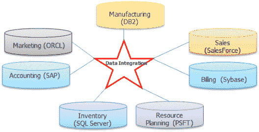

但是在数据集成技术中有不同的架构。Informatica 使用提取、转换&加载(ETL)架构，这是执行数据集成最流行的架构。因此，我们必须了解什么是 ETL，以及 Informatica 如何执行 ETL 来解决这样的业务问题。

## **什么是 ETL？**

ETL 是一种数据集成，它涉及一种架构，该架构提取、转换数据，然后将数据加载到目标数据库或文件中。它是数据仓库的基础。

一个 ETL 系统做以下事情:

*   从源系统提取数据
*   转换并清理数据
*   索引数据
*   汇总数据
*   加载数据到仓库
*   跟踪对仓库所需的源数据所做的更改
*   重组键
*   维护元数据
*   用更新的数据刷新仓库

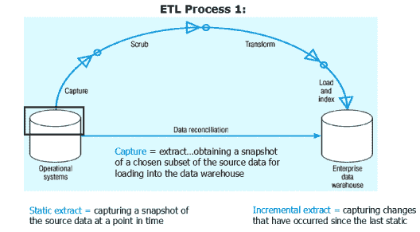

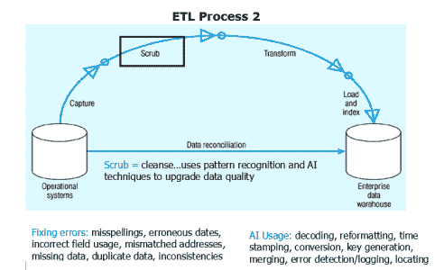

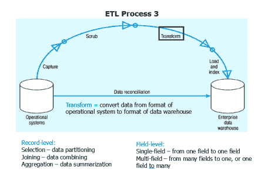

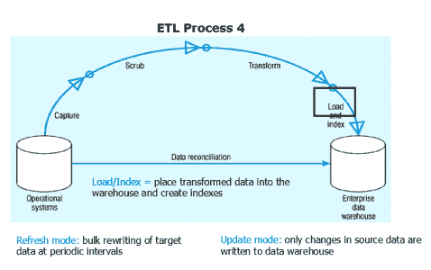

如果我们理解了什么是 ETL 和 ETL 过程，我们现在就能更好地理解为什么 Informatica 是这种情况下的最佳解决方案。我们也将理解什么是典型的真实生活场景，在这些场景中，Informatica 可以派上用场。

## **Informatica ETL 工具有什么用？:**

Informatica PowerCenter 是目前可用的高级数据集成解决方案。它在大型企业中提供最佳解决方案的原因在于:

*   数据库中立，因此可以与任何数据库通信
*   最强大的数据转换工具。它将一个应用程序的数据转换成另一个的格式

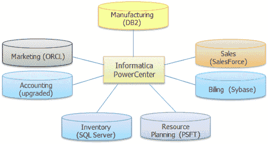

在这篇关于什么是 Informatica 的文章中，让我们理解 Informatica 如何执行 ETL。

## **Informatica 如何执行 ETL:**

ETL:提取

*   PowerCenter 从数据库的一个表(或一组相关表)或一个文件中逐行读取数据
*   该数据库或文件被称为源
*   源的结构包含在源定义对象中。

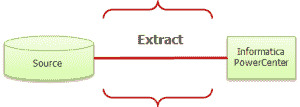

ETL:转换

*   Informatica PowerCenter 将行转换成第二个(目标)系统能够使用的格式
*   该转换的逻辑在转换对象中定义

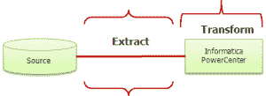

ETL:加载

*   Informatica PowerCenter 将数据逐行写入数据库中的一个表(或一组相关表)或一个文件
*   该数据库或文件被称为目标
*   目标的结构包含在目标定义对象中

接下来，在这篇关于什么是 Informatica 的文章中，让我们看看它的实时应用。

使用 Informatica 的典型场景:

### **Informatica 工具用于** **数据迁移:**

一家公司购买了一个新的应付账款应用程序。PowerCenter 可以将现有的帐户数据移动到新的应用程序中。Informaticap储备数据血统用于税收、会计和其他法定目的

### **信息化工具** **应用集成:**

A 公司收购了 B 公司。因此，为了获得合并的好处，B 公司的计费系统必须集成到 A 公司的计费系统中，这可以通过 Informatica 轻松完成

### **数据仓库的信息化工具**

数据仓库中需要的典型动作有:

*   数据仓库将许多来源的信息放在一起进行分析
*   数据从许多数据库转移到数据仓库

上述所有典型案例都可以使用 Informatica 轻松完成

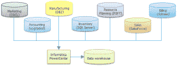

### **信息化工具为** **中间件**

Informatica 可以连接各种源，包括大多数应用程序源。

*   SAP 认证数据集成工具
*   可以将数据拉入和推入 SAP R3、SAP BW 系统
*   拥有适用于大多数应用程序源的连接适配器

它还可以用作 SAP R3、SAP BW 等两个应用程序之间的中间件。

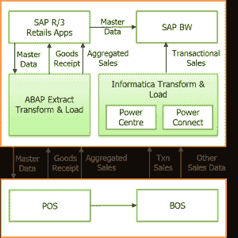

现在你已经了解了什么是 [Informatica](https://www.informatica.com/) ，让我们看一段 Informatica 教程视频来更详细地了解 Informatica:

**信息论初学者教程**

[https://www.youtube.com/embed/9tvV-lbrBPM?rel=0&showinfo=0](https://www.youtube.com/embed/9tvV-lbrBPM?rel=0&showinfo=0)

如果你想一步一步地学习 Informatica 架构和用例，以进一步加强 Informatica 的力量，你可以看看我的 [Informatica 教程](https://www.edureka.co/blog/informatica-tutorial)博客。

如果你已经决定以信息学为职业，我会推荐你为什么不看看我们的[信息学培训](https://www.edureka.co/informatica)课程页面。Edureka 的 Informatica 认证培训将通过现场讲师指导课程和使用真实案例的实践培训，使您成为专家。

*有问题吗？请在评论区提到它，我们会给你回复。*