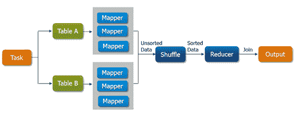
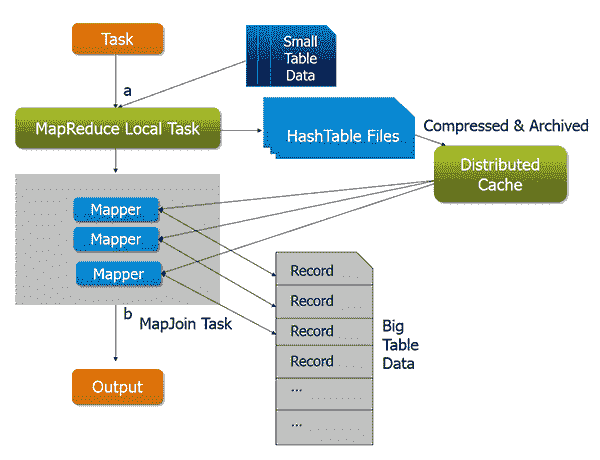
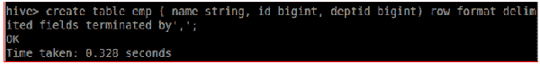
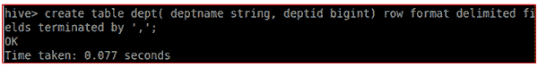
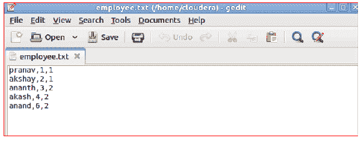
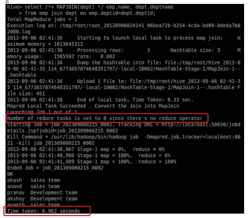
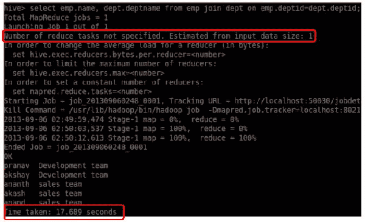

# 地图端连接与连接

> 原文：<https://www.edureka.co/blog/map-side-join-vs-join/>

在这篇博客中，我们将讨论**地图端连接**以及它相对于**蜂巢**中普通连接操作的优势。这是一个重要的概念，你需要学会实施你的 ***[大数据 Hadoop 认证项目](https://www.edureka.co/big-data-and-hadoop#projects)*** 。但是在了解这一点之前，我们应该首先了解**‘Join’**的概念，以及当我们在 **Hive** 中执行 Join 时，内部发生了什么。

**Join** **是组合两个表(或数据集)的记录的子句。** 假设我们有两个表 A 和 b，当我们对它们执行 join 操作时，它将返回 A 和 b 的所有列的组合记录

***现在让我们用一个例子来理解普通连接的功能..***

每当我们应用 join 操作时，作业将被分配给一个 Map Reduce 任务，该任务由两个阶段组成:a***‘Map 阶段*** 和 a’***Reduce 阶段*** 。映射器在映射阶段的工作是从连接表中*【读取】*数据，并将*【返回】***【连接键】**和**【连接值】**对返回到中间文件中。此外，在混洗阶段，该中间文件然后被分类和合并。归约器在归约阶段的工作就是把这个排序后的结果作为输入，完成 join 的任务。

*   映射端连接类似于连接，但所有任务都将由映射器单独执行。

*   地图端连接最适合于小表来优化任务。

#### 地图端连接将如何优化任务？

假设我们有两个表，其中一个是小表。当我们提交一个 map reduce 任务时，在最初的 join Map Reduce 任务之前将创建一个 Map Reduce 本地任务，它将从 HDFS 中读取小表的数据并将其存储到内存哈希表中。读取后，它将内存中的哈希表序列化为哈希表文件。

***在下一个阶段，*** 当原始连接映射 Reduce 任务运行时，它将哈希表文件中的数据移动到 Hadoop 分布式缓存，后者将这些文件填充到每个映射器的本地磁盘。所以所有的映射器都可以将这个持久哈希表文件加载回内存，并像以前一样进行连接工作。优化的地图连接的执行流程如下图所示。优化后，小表只需要读取一次。此外，如果在同一台机器上运行多个映射器，分布式缓存只需要将哈希表文件的一个副本推送到这台机器上。

## 使用地图侧连接的优势:

*   地图端连接有助于最小化在*洗牌*和*归约*阶段进行排序和合并的成本。
*   地图端连接还有助于通过减少完成任务的时间来提高任务的性能。

#### **地图端连接的缺点:**

*   只有当执行映射端连接操作的表足够小，可以放入内存时，映射端连接才是合适的。因此，不适合在两个表中都包含大量数据的表上执行地图端连接。

***地图归约的简单例子:***

让我们创建两个表:

*   **Emp** :包含员工的详细信息，如员工姓名、员工 ID 和她所属的部门。

*   **Dept:** 包含部门名称、部门 ID 等详细信息。

**创建如下图所示的两个输入文件，将数据加载到创建的表格中。**

**employee.txt**

**dept.txt**

现在，让我们将数据加载到表格中。

让我们在两个表上执行 **Map-side** **Join** 来提取每个雇员工作的部门列表。

这里的**第二桌部**是一个小桌子。记住，在一个组织中，部门的数量总是少于雇员的数量。

现在，让我们借助普通的 Reduce 端连接来执行相同的任务。

**在执行两个连接时，您可以发现两个不同之处:**

*   与普通连接所用的时间相比，Map-reduce 连接在更短的时间内完成了作业。

*   Map-reduce 连接在没有任何缩减器的帮助下完成了它的工作，而 normal join 在一个缩减器的帮助下执行了这项工作。

因此，当其中一个表足够小，可以放在内存中以在短时间内完成任务时， **Map-side Join** 是您的最佳选择。

在**实时环境**中，你将拥有包含大量数据的数据集。因此，如果其中一个数据集较小，执行分析和检索数据将会非常耗时。在这种情况下*地图端连接*将有助于在更短的时间内完成工作。

掌握 Hadoop 是前所未有的好时机！立即开始学习 Edureka 特别策划的大数据和 Hadoop 课程。

**参考资料:**[https://www . Facebook . com/notes/Facebook-engineering/join-optimization-in-Apache-hive/470667928919](https://www.facebook.com/notes/facebook-engineering/join-optimization-in-apache-hive/470667928919)

**相关帖子:**

[大数据培训可以改变组织的 7 种方式](https://www.edureka.co/blog/7-ways-big-data-training-can-change-your-organization/)

[大数据分析是最佳职业选择的 10 个理由](https://www.edureka.co/blog/10-reasons-why-big-data-analytics-is-the-best-career-move "10 Reasons Why Big Data Analytics is the Best Career Move")

[大数据和 Hadoop 入门](https://www.edureka.co/big-data-and-hadoop)

[全面上手 MapReduce](https://www.edureka.co/comprehensive-mapreduce-self-paced)

[MapReduce 设计模式入门](https://www.edureka.co/mapreduce-design-patterns-sp)

[Apache Mapreduce 简介&HDFS](https://www.edureka.co/blog/introduction-to-apache-hadoop-hdfs/)