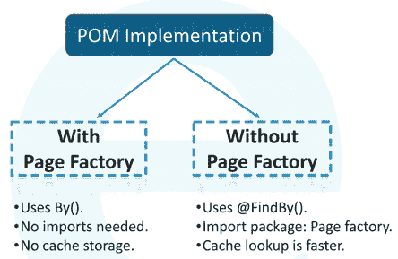
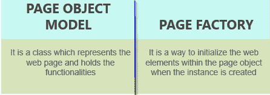
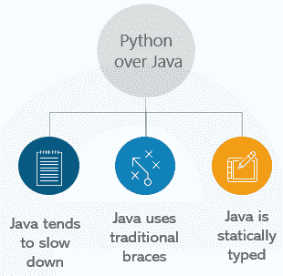
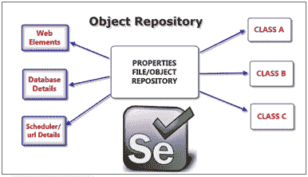
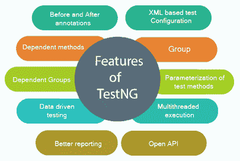
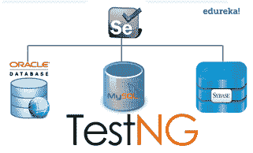

# 2023 年你必须准备的 50 个硒面试问题和答案

> 原文：<https://www.edureka.co/blog/interview-questions/selenium-interview-questions-answers/>

由于如今人们对网络的依赖程度如此之高，确保网络应用的正常运行是一项显而易见的需求。Selenium 是一个专门为此开发的自动化测试工具，这个博客为那些计划进入测试领域的人(新人&有经验)列出了 Selenium 面试中常见的问题。

在我开始讨论这些问题之前，我想强调一下，手工测试是耗时、乏味、无聊并且容易出错的。这导致了自动化测试的出现，反过来，也导致了对 Selenium 自动化测试器的需求。

**自动化测试的好处** 

把技术问题放在一边，你可能还会被问到一些 Selenium 棘手的面试问题，关于为什么只有 Selenium，而没有其他工具？这是因为 Selenium 是开源的，并且易于采用，这为它赢得了 web 测试工具的标签。在过去的三年里，  的招聘职位增加了 300 %,测试已经成为各个领域的专业人士进入 IT 世界的一个切入点。组织正在寻找拥有[硒认证](https://www.edureka.co/selenium-certification-training) *的专业人士。*

因此，请阅读这篇博客中关于 Selenium 的 Java 面试问题的完整列表，并为 Selenium 测试人员的工作面试做好准备。我们开始吧！

Want to Upskill yourself to get ahead in your Career? Check out the ***[Top Trending Technologies](https://www.edureka.co/blog/top-10-trending-technologies/) Article.***

## **50 强硒面试问答**

整套硒面试问题分为三个板块:


1.  [硒大一新生基础面试题](#BasicLevel)
2.  [硒经验丰富的职场人士面试问题](#AdvanceLevel)
3.  [TestNG 硒框架](#TestNGFramework)

## **A .基础水平——硒面试题**

### **1。与其他测试工具如 QTP 和 TestComplete 相比，Selenium 有什么优点和缺点？**

下面列出了不同之处。

***硒 vs HP QTP vs test complete***

| **特征** | **硒** | **HP QTP** | **测试完成** |
| **牌照** | 开源 | 必需的 | 必需的 |
| **成本** | 免费 | 高 | 高 |
| **客户支持** | 是的；开源社区 | 是 | 是 |
| **发布周期/开发冲刺** | 具有即时反馈的更短发布周期 | 更小的发布周期 | 只敏捷 |
| **编码技能** | 非常高 | 低 | 高 |
| **环境支持** | Windows、Linux、Mac | 仅窗口 | 仅 Windows、Vista、Server 2008 或更高版本的操作系统) |
| **语言支持** | 语言支持 | VB 脚本 | VB 脚本，JS 脚本，Delphi 脚本，C++ & C# |

### **2。各种 Selenium 版本的升级有哪些显著变化？**

Selenium v1 只包括三套工具:Selenium IDE、Selenium RC 和 Selenium Grid。注意，Selenium v1 中没有 WebDriver。Selenium WebDriver 是在 **Selenium v2** 中引入的。随着 WebDriver 的出现，Selenium RC 被弃用，并且从那以后就不再使用了。虽然市场上有旧版本的 RC，但是不支持 RC。目前使用的是 **Selenium v3** ，由 IDE、WebDriver 和 Grid 组成。**硒 4** 其实是最新版本。你甚至可以通过[自动化课程](https://www.edureka.co/masters-program/automation-testing-engineer-training)了解自动化的细节。

IDE 用于记录和回放测试， WebDriver 用于通过编程接口测试动态 web 应用，Grid 用于在远程主机上部署测试。

### **3。解释 Selenium WebDriver 中的不同异常。**

Selenium 中的异常类似于其他编程语言中的异常。Selenium 中最常见的异常是:

*   **TimeoutException:** 当执行操作的命令没有在规定的时间内完成时，抛出该异常
*   **NoSuchElementException:**当在网页上找不到具有给定属性的元素时抛出该异常
*   **ElementNotVisibleException:**当元素存在于 DOM(文档对象模型)中，但在网页上不可见时抛出该异常
*   **StaleElementException:**当元素被删除或者不再附加到 DOM 时抛出这个异常

### **4。Selenium 中的异常测试是什么？**

异常测试是你期望在测试类中抛出的异常。如果你已经编写了一个测试用例，它应该抛出一个异常，那么你可以使用 **@Test** 注释，并通过在参数中提到它来指定你将期待哪个异常。看看下面的例子:**@ Test(expected exception = nosuchelementexception . class)**

一定要注意语法，异常是以。类别


### **5。为什么以及如何在项目中使用 Excel 表格？**

我们使用 Excel 表格的原因是因为它可以用作测试的数据源。在执行数据驱动测试时，excel 表也可以用来存储数据集。这是使用 Excel 表格的两个主要原因。

当使用 excel 表作为 **数据源** 时，可以存储以下:

*   **所有环境的应用 URL**:您可以指定要进行测试的环境的 URL，如:开发环境或测试环境或 QA 环境或试运行环境或生产/预生产环境。

*   **不同环境的用户名和密码凭证:**您可以将不同应用/环境的访问凭证保存在 excel 表中。你可以用编码格式存储它们，无论何时你想使用它们，你都可以解码它们，而不是让它们变得简单和不受保护。

*   **要执行的测试用例** : 您可以在一列中列出整个测试用例集，在下一列中，您可以指定 Yes 或 No，这表示您希望执行还是忽略该特定的测试用例。

当您使用 excel 表进行 **数据驱动测试** 时，您可以存储测试中要执行的不同迭代的数据。例如，在测试一个网页时，需要传递给测试框的不同组的输入数据可以存储在 excel 表中。

### **6。如何通过代理重定向浏览器的浏览？**

Selenium 提供了一个代理类来重定向来自代理的浏览。看下面的例子:

```
String PROXY = &ldquo;199.201.125.147:8080&rdquo;;

org.openqa.selenium.Proxy proxy = new.org.openqa.selenium.Proxy();
proxy.setHTTPProxy(Proxy)
 .setFtpProxy(Proxy)
 .setSslProxy(Proxy)
DesiredCapabilities cap = new DesiredCapabilities();
cap.setCapability(CapabilityType.PROXY, proxy);
WebDriver driver = new FirefoxDriver(cap);

```

### **7。什么是 POM(页面对象模型)？它的优点是什么？**

*[页面对象模型](https://www.edureka.co/blog/page-object-model-in-selenium/)* 是为 web UI 元素创建对象仓库的设计模式。应用程序中的每个网页都需要有自己对应的 page 类。因此，page 类负责在该页面中查找 web 元素，然后对这些 web 元素执行操作。

使用 POM 的优势有:

*   允许我们将 UI 中的操作和流程与验证分开——提高代码可读性
*   由于对象库独立于测试用例，多个测试可以使用同一个对象库
*   代码的可重用性

### **8。什么是页面工厂？**

页面工厂给出了实现页面对象模型的优化方法。当我们说它是优化的时，它指的是这样一个事实，即内存利用率非常好，而且实现是以面向对象的方式完成的。



页面工厂用于初始化页面对象的元素或者实例化页面对象本身。还可以为元素创建(并推荐)注释，因为描述属性可能并不总是足以将一个对象与另一个对象区分开来。

这里也遵循了分离页面对象库和测试方法的概念。我们不必使用“FindElements”，而是使用类似于: **@FindBy** 的注释来查找 WebElement，并使用 **initElements** 方法从页面工厂类初始化 web 元素。

**@FindBy** 可以接受 **标记名** ，**partial ink text**， **name** ， **linkText** ， **id** ， **css** ， **className**

### **9。Selenium WebDriver 中有哪些不同类型的等待语句？*或者问题可以这样框架:*你如何在 WebDriver 中实现同步？**

等待语句基本上有两种: **隐式等待** 和 **显式等待** 。

隐式等待通过轮询 DOM 来指示 web 驱动程序等待一段时间。一旦您声明了隐式等待，它将在 WebDriver 实例的整个生命周期中可用。默认情况下，该值为 0。如果您设置了一个更长的默认值，那么该行为将根据浏览器/驱动程序的实现定期轮询 DOM。

显式等待指示执行等待一段时间，直到达到某个条件。要达到的一些条件是:

*   元素 obeliskable
*   要选择的元素
*   存在元素位置

### **10。编写代码，等待特定元素在页面上可见。编写一个代码来等待一个警告出现。**

我们可以编写一段代码，指定需要在页面上可见的 web 元素的 *[XPath](https://www.edureka.co/blog/xpath-in-selenium/)* ，然后请求 WebDriver 等待一段指定的时间。请看下面的示例代码:

```
WebDriverWait wait=new WebDriverWait(driver, 20);
Element = wait.until(ExpectedConditions.visibilityOfElementLocated(By.xpath( &ldquo;<xpath&rdquo;)));

```

类似地，我们可以编写另一段代码，要求 web 驱动程序等待，直到出现如下错误:

```
WebDriverWait wait=new WebDriverWait(driver, 20);
Element = wait.until(ExpectedConditions.alertIsPresent());

```

### **11。JavaScriptExecutor 有什么用？**

**Javascript executor**是一个接口，它提供了通过 Selenium WebDriver 执行 Javascript 的机制。它提供了“ **executescript** ”和“**executeAsyncScript**”方法，在当前选中的框架或窗口的上下文中运行 JavaScript。 的一个例子就是:

```
JavascriptExecutor js = (JavascriptExecutor) driver; 
js.executeScript(Script,Arguments);

```

### **12。如何在 Selenium 中使用 JavaScript 向下滚动页面？**

我们可以使用 window.scrollBy()函数向下滚动一页。示例:

```
((JavascriptExecutor) driver).executeScript("window.scrollBy(0,500)");

```

### **13。如何向下滚动到特定元素？**

为了向下滚动到网页上的特定元素，我们可以使用函数 **scrollIntoView()** 。示例:

```
((JavascriptExecutor) driver).executeScript("arguments[0].scrollIntoView();", element);

```

### **14。如何使用 Selenium 处理键盘和鼠标动作？**

我们可以通过使用 **高级用户交互 API** 来处理特殊的键盘鼠标事件。高级用户交互 API 包含执行这些事件所需的操作和操作类。下表列出了 Actions 类提供的最常用的键盘和鼠标事件:

***硒的功能及其解释***

| **法** | **描述** |
| 点击并按住() | 点击(不释放)当前鼠标位置。 |
| dragAndDrop() | 在源元素的位置执行点击并保持，移动。 |
| 源，目标() | 移动到目标元素的位置，然后释放鼠标。 |

### **15。什么是不同类型的框架？**

不同类型的 *[框架](https://www.edureka.co/blog/selenium-framework-data-keyword-hybrid-frameworks)* 有:

*   **数据驱动框架** :- 当整个测试数据都是从一些外部文件比如 Excel、CSV、XML 或者一些数据库表格中生成的时候，那么就叫做数据驱动框架。
*   **关键字驱动框架** :- 当只有指令和操作写在类似 Excel 工作表的不同文件中时，称为关键字驱动框架。
*   **混合框架** :- 数据驱动框架和关键字驱动框架的结合称为混合框架。

### **16。哪些文件可以作为不同框架的数据源？**

数据集的一些文件类型可以是:excel、xml、文本、csv 等。

### **17。如何从元素中获取属性？如何从文本框中检索键入的文本？**

我们可以通过使用 **getAttribute()** 方法来获取元素的属性。样本代码:

```
WebElement eLogin = driver.findElement(By.name(&ldquo;Login&rdquo;);
String LoginClassName = eLogin.getAttribute("classname");

```

在这里，我找到了名为“登录”的网页登录按钮。一旦找到该元素，就可以使用 getAttribute()来检索该元素的任何属性值，并以字符串格式存储它。在我的示例中，我已经检索了“classname”属性，并将其存储在 LoginClassName 中。

类似地，要从任何文本框中检索一些文本，我们可以使用 getText()方法。在下面这段代码中，我检索了在“Login”元素中键入的文本。

```
WebElement eLogin = driver.findElement(By.name(&ldquo;Login&rdquo;);
String LoginText = Login.getText ();

```

在下面的 Selenium WebDriver 教程中，详细演示了如何使用不同的元素定位器技术在网页上定位元素，以及可以应用于这些元素的基本方法/功能。

## Selenium WebDriver 教程| Selenium 初学者教程| Selenium WebDriver 培训| Edureka


[https://www.youtube.com/embed/ph3NJm4Z7m4?rel=0&showinfo=0](https://www.youtube.com/embed/ph3NJm4Z7m4?rel=0&showinfo=0)This Selenium WebDriver tutorial talks about the drawbacks of Selenium RC and what was the need for Selenium WebDriver.

### 18。Selenese 是什么？

Selenese 是用于测试 web 应用程序的 selenium 命令集。

您甚至可以利用:

*   **动作**:用于执行操作
*   **断言**:用作检查点
*   **访问器:**用于存储特定变量中的值

### **19。页面对象模型(POM)和页面工厂有什么区别？**

## ****

### 20。Selenium 能处理窗口弹出吗？

Selenium 不支持处理弹出窗口。用于显示警告信息。它是出现在屏幕上的一个弹出窗口。

有几种方法可以实现这一点:

*   **Void dissolve():**当在警告框中单击“取消”按钮时，调用该方法。
*   **Void accept():** 当您单击警告的“确定”按钮时，将调用此方法。
*   **String getText():** 调用这个方法来捕获警告消息。
*   **Void sendKeys(String String tosed)**:当你想发送一些数据到预警框时调用。

### **21。什么是机器人类？**

这个 *[机器人类](https://www.edureka.co/blog/robot-class-selenium-webdriver/)* 提供对鼠标和键盘设备的控制。

这些方法包括:

*   **按键** **():** 当你想要按下任何一个键的时候，这个方法就会被调用。
*   **key release****():**该方法用于释放键盘上被按下的键。
*   **MouseMove** **():** 当你想在 X 和 Y 坐标上移动鼠标指针时，调用这个方法。
*   **mouse press****():**这是用来按鼠标左键的。
*   **MouseMove** **():** 这个方法有助于释放鼠标被按下的按钮。

### **22。如何在 Selenium 中处理多个窗口？**

一个 *[窗口句柄](https://www.edureka.co/blog/handle-multiple-windows-in-selenium/)* 是保存所有窗口地址的唯一标识符。这基本上是一个指向窗口的指针，它返回字符串值。

*   **get.windowhandle()** :帮助获取当前窗口的窗口句柄。
*   **get.windowhandles():** 帮助打开所有窗口的句柄。
*   **set:** 帮助设置窗口句柄，以字符串的形式。
*   **切换到:**帮助在窗口之间切换。
*   **动作**:帮助在窗口上执行某些 *[动作](https://www.edureka.co/blog/keyboard-mouse-events-actions-class)* 。

### **23。Selenium 中的监听器是什么？**

它被定义为修改系统行为的接口。 *[监听器](https://www.edureka.co/blog/listeners-in-selenium/)* 允许定制报告和日志。

监听器主要包括两种类型，即

1.  web 驱动程序监听器
2.  测试监听器

### **24。什么是断言和验证命令？**

*   **断言:**断言用于比较应用程序的实际结果和预期结果。
*   **验证**:即使验证条件为真或假，测试执行也不会暂停。

### **25。你能在 Selenium 中来回浏览网页吗？**

是的。您可以在浏览器中导航。实现这一目标的几种方法是:

*   驾驶员.导航.前进
*   driver . manager . back
*   驱动程序.管理.导航
*   driver.navigate.to("url ")

## **B .高级水平——硒面试问题**

从现在开始，我们将关注硒测试者最重要的高级面试问题 。

### **26。如何在 Selenium WebDriver 中发送 ALT/SHIFT/CONTROL 键？**

当我们一般使用 ALT/SHIFT/控制键时，我们按住这些键并点击其他按钮来实现特殊功能。所以仅仅指定和**键是不够的。ALT** 或或T7 键。SHIFT 或 **键。控制** 功能。

为了在后续按键被按下时保持住这些按键，我们需要再定义两个方法:**【keydown(modifier _ key)**和**【keyup(modifier_key)
】**

参数: **Modifier_key(按键。ALT 或 Keys。换档或按键。控制)** 目的:执行修饰键按下并且不释放修饰键。随后的交互可能会认为它一直被按着。

P 参数: **Modifier_key(按键。ALT 或 Keys。换档或按键。CONTROL)** 用途:执行一次按键释放。 因此结合使用这两种方法，我们可以捕捉到某个特定键的特殊功能。

```
public static void main(String[] args) 
{
String baseUrl = &ldquo;https://www.facebook.com&rdquo;;
WebDriver driver = new FirefoxDriver();

driver.get("baseUrl");
WebElement txtUserName = driver.findElement(By.id(&ldquo;Email&rdquo;);

Actions builder = new Actions(driver);
Action seriesOfActions = builder
 .moveToElement(txtUerName)
 .click()
 .keyDown(txtUserName, Keys.SHIFT)
 .sendKeys(txtUserName, &ldquo;hello&rdquo;)
 .keyUp(txtUserName, Keys.SHIFT)
 .doubleClick(txtUserName);
 .contextClick();
 .build();
seriesOfActions.perform();
}

```

### **27。如何在 Selenium WebDriver 中截图？**

使用 **截图** 功能可以截图。通过使用**getScreenshotAs()**方法，您可以保存该截图。例:

```
File scrFile = ((TakeScreenshot)driver).getScreenshotAs(outputType.FILE);

```

### **28。如何使用 Selenium 设置浏览器窗口的大小？**

要最大化浏览器窗口的大小，可以使用下面这段代码: driver.manage()。窗口()。最大化()；–最大化窗口

要将当前窗口调整到某个特定的尺寸，可以使用 **setSize()** 方法。看看下面这段代码:

```
System.out.println(driver.manage().window().getSize());
Dimension d = new Dimension(420,600);
driver.manage().window().setSize(d);

```

要将窗口设置为特定大小，使用**window . resizeto()**方法。查看下面这段代码:

```
((JavascriptExecutor)driver).executeScript("window.resizeTo(1024, 768);");

```

要观看为浏览器窗口设置自定义大小以及在网页上查找各种元素的演示，请观看下面的视频。

### **29。如何在 Selenium WebDriver 中处理下拉列表？如何从下拉列表中选择一个值？**

关于下拉菜单和从下拉菜单中选择一个值的问题是非常常见的 Selenium 面试问题，因为编写代码涉及到技术问题。

您应该知道的最重要的细节是，要在 Selenium 中使用 *[下拉菜单，我们必须始终使用这个 html 标签:](https://www.edureka.co/blog/selenium-select-class/)***‘select’**。如果不使用“选择”，我们就无法处理下拉菜单。请看下面的代码片段，我写了一段代码，创建了一个包含三个选项的下拉列表。

```
<select id="mySelect">
<option value="option1">Cars</option>
<option value="option2">Bikes</option>
<option value="option3">Trains</option>
</select>

```

在这段代码中，我们使用**‘select’**标签来定义一个 dropdown 元素，dropdown 元素的 **id** 为‘my select’。我们在下拉列表中有 3 个选项:汽车、自行车和火车。每个选项都分配有一个“值”属性。下拉列表中的第一个选项的值为“选项 1”，第二个选项的值为“选项 2”，同样，第三个选项的值为“选项 3”。

如果到目前为止你对这个概念很清楚，那么你可以继续下一步，从下拉列表中选择一个值。这是一个两步过程:

1.  识别“选择”html 元素(因为下拉菜单必须有“选择”标签)
2.  从下拉元素中选择选项

为了从网页中识别‘select’html 元素，我们需要使用 findElement()方法。看看下面这段代码:

```
WebElement mySelectElement = driver.findElement(By.id("mySelect"));
Select dropdown = new Select(mySelectElement);

```

现在，要从下拉列表中选择一个选项，我们可以通过以下三种方式中的任意一种来完成:

1.  drop down . selectbyvisibletext(" Bikes ")；→通过可见文本选择选项
2.  drop down . selectbyindex(" 1 ")；→通过选择该选项的索引号选择、
3.  drop down . selectby value(" option 2 ")；→通过选择选项的值，选择、

注意，在上面的例子中，在所有三种情况下，都将从下拉列表中选择“自行车”。在第一种情况下，我们通过网页上的可视文本进行选择。当谈到按索引选择时，1 代表“自行车”，因为索引值从 0 开始，然后递增到 1 和 2。最后，在按值属性选择的情况下，“选项 2”指的是“自行车”。这些是从下拉列表中选择值的不同方法。

## 硒入门教程|硒是什么？| Selenium 自动化测试教程| Edureka


[https://www.youtube.com/embed/5FUdrBq-WFo?rel=0&showinfo=0](https://www.youtube.com/embed/5FUdrBq-WFo?rel=0&showinfo=0)This Edureka Selenium tutorial video will give you an introduction to software testing.

### **30。点击一个链接后，如何切换到一个新窗口(新标签页)？**

如果你点击了网页中的一个链接，那么为了改变 WebDriver 的焦点/引用到新窗口，我们需要使用 **switchTo()** 命令。看下面的例子切换到一个新的窗口: **driver.switchTo()。windows()；**

这里，“windowName”是您要将引用切换到的窗口的名称。

如果您不知道窗口的名称，那么您可以使用**driver . getwindowhandle()**命令来获取所有由 WebDriver 启动的窗口的名称。请注意，它不会返回不是由您的 web 驱动程序启动的浏览器窗口的窗口名称。

一旦你有了窗口的名字，你就可以使用一个增强的 for 循环来切换到那个窗口。看看下面这段代码。

```
String handle= driver.getWindowHandle();
for (String handle : driver.getWindowHandles()) 
{
driver.switchTo().window(handle);
}

```

### **31。如何使用 Selenium WebDriver 上传文件？**

要上传一个文件我们可以简单的使用 **命令 element.send_keys(文件路径)。** 但是在我们上传文件之前有一个先决条件。我们必须使用 html 标签:**‘input’**，属性类型应该是**‘file’**。看看下面的例子，我们首先识别 web 元素，然后上传文件。

```
<input type="file" name="uploaded_file" size="50" class="pole_plik">
element = driver.find_element_by_id(&rdquo;uploaded_file")
element.send_keys("C:myfile.txt")

```

### **32。我们可以不使用 sendKeys()输入文本吗？**

是的。我们可以在不使用 **sendKeys()** 方法的情况下输入/发送文本。我们可以使用 JavaScriptExecutor 来实现。

我们是怎么做到的？ 使用 DOM 的方法，识别一个元素，我们可以转到那个特定的文档，然后通过它的 ID(在这里登录)获取元素，然后通过值发送文本。看下面的示例代码:

```
JavascriptExecutor jse = (JavascriptExecutor) driver;
jse.executeScript("document.getElementById(&lsquo;Login').value=Test text without sendkeys");

```

### **33。解释一下如果任何网站显示用户名和密码的验证弹出窗口，你将如何登录该网站？**

由于会有用于登录的弹出窗口，我们需要使用 explicit 命令并验证警报是否确实存在。只有当警报出现时，我们才需要传递用户名和密码凭证。使用显式等待命令和验证警报的示例代码如下:

```
WebDriverWait wait = new WebDriverWait(driver, 10); 
Alert alert = wait.until(ExpectedConditions.alertIsPresent()); 
alert.authenticateUsing(new UserAndPassword(**username**, **password**));

```

### **34。解释如何使用 Selenium WebDriver 在页面中找到断开的链接？**

这是面试官会向你提出的一个棘手的问题。他可以提供一个网页中有 20 个链接的情况，我们必须验证这 20 个链接中哪些是工作的，哪些是不工作的(坏了)。

因为您需要验证每个链接的工作情况，所以解决方法是，您需要向网页上的所有链接发送 HTTP 请求并分析响应。每当您使用 driver.get()方法导航到一个 URL 时，它都会以状态**200–OK**响应。200–OK 表示链路正在工作，并且已经获得。如果获得任何其他状态，则表明链路断开。

但是你会怎么做呢？ 首先，我们要用锚标签< a >来确定网页上不同的超链接。对于每个<一个>标签，我们可以使用属性‘href’值来获取超链接，然后分析每个超链接在 **driver.get()** 方法中使用时收到的响应。

### **35。“如果既没有帧 id 也没有帧名”，您应该考虑在整个脚本中使用哪种技术？**

如果既没有帧名也没有帧 id，那么我们可以通过索引 使用 **帧。**

假设网页中有 3 个框架，如果它们都没有框架名称和框架 id，那么我们仍然可以使用框架(从零开始)索引属性来选择这些框架。每一帧都有一个索引号。第一帧位于索引“0”，第二帧位于索引“1”，第三帧位于索引“2”。一旦选择了框架，WebDriver 接口上的所有后续调用将对该框架进行。

```
driver.switchTo().frame(int arg0);

```


## **c . Selenium 的 TestNG 框架——Selenium 面试题**

从这里开始，你将阅读所有面向有经验的专业人士的 TestNG 和 Selenium Webdriver 面试问题。

### **36。testng.xml 的意义是什么？**

我很肯定你们都知道 *[TestNG](https://www.edureka.co/blog/testng-annotations-in-selenium/)* 的重要性。由于 Selenium 不支持报告生成和测试用例管理，所以我们将 TestNG 框架与 Selenium 一起使用。TestNG 比 *[JUnit](https://www.edureka.co/blog/junit-tutorial/)* 高级得多，它使得实现注释变得容易。这就是 TestNG framewrok 与 Selenium WebDriver 一起使用的原因。

但是你想知道在 TestNG 中哪里定义测试套件和测试类分组吗？

通过从 testng.xml 文件中获取指令。我们不能在测试源代码中定义一个测试套件，而是用 XML 文件表示，因为套件是执行的特性。我所说的测试套件、基本上是测试用例的集合。

因此，为了在一个套件中执行测试用例，也就是一组测试用例，你必须创建一个 testng.xml 文件，它包含你想要作为执行流程的一部分执行的所有类和方法的名称。

使用 testng.xml 文件的其他优点有:

*   它允许执行来自多个类的多个测试用例
*   允许并行执行
*   它允许成组执行测试用例，其中一个测试可以属于多个组

### **37。TestNG 中什么是参数化？如何使用 testng.xml 传递参数？**

*[参数化](https://www.edureka.co/blog/dataprovider-in-testng/)* 是在 testng.xml 文件中定义值并作为参数发送给测试类的技术。当我们需要传递各种测试环境的多个登录凭证时，这种技术特别有用。看看下面的代码，其中“myName”被注释为一个参数。

```
public class ParameterizedTest1{
 @Test
 @Parameters("myName")
 public void parameterTest(String myName) {
 System.out.println("Parameterized value is : " + myName);
 }
}

```

要使用 testng.xml 文件传递参数，我们需要使用' parameters '标签。请看下面的代码示例:

```
<?xml version="1.0" encoding="UTF-8"?>
<!DOCTYPE suite SYSTEM "http://testng.org/testng-1.0.dtd" >
 <suite name=&rdquo;CustomSuite">
  <test name=&rdquo;CustomTest&rdquo;> 
   <parameter name="myName" value=&rdquo;John"/>
    <classes>
     <class name="ParameterizedTest1" />
    </classes> 
  </test>
 </suite>

```

要全面了解 TestNG 的工作原理及其与 Selenium 一起使用的好处，请观看下面的 Selenium 教程视频。

## Selenium 培训|针对 Selenium 的 TestNG 框架|面向初学者的 Selenium 教程| Edureka


[https://www.youtube.com/embed/_sWcXaic-bw?rel=0&showinfo=0](https://www.youtube.com/embed/_sWcXaic-bw?rel=0&showinfo=0)This Edureka Selenium Training video will take you through the in-depth details of Selenium WebDriver.

### **38。用一个例子解释 TestNG 中的 DataProviders。我可以为多个函数和类调用一个数据提供者方法吗？**

*[DataProvider](https://www.edureka.co/blog/dataprovider-in-testng/)* 是一个 TestNG 特性，它使我们能够编写数据驱动的测试。当我们说，它支持数据驱动测试时，那么很明显相同的测试方法可以用不同的数据集运行多次。DataProvider 实际上是向测试方法传递参数的另一种方式。

**@DataProvider** 将方法标记为给测试方法提供数据。带注释的方法必须返回对象[]，其中每个对象[]都可以分配给测试方法的参数列表。

要在您的测试中使用 DataProvider 特性，您必须声明一个由 **@DataProvider** 注释的方法，然后使用测试注释中的‘data provider’属性在测试方法中使用该方法。

就问题的第二部分而言，是的，通过在单独的类中声明 DataProvider，然后在多个类中重用它，可以在多个函数和类中使用同一个 DataProvider。

### **39。如何在 TestNG 中跳过一个方法或者一个代码块？**

如果您想跳过某个特定的测试方法，那么您可以将测试注释中的‘enabled’参数设置为 false。@测试(enabled = false)

默认情况下,“启用”参数的值为真。因此，没有必要在定义注释时将其定义为 true。

### **40。Selenium 中的软断言是什么？如何通过使用软断言将测试用例标记为失败？**

软断言是由 TestNG 提供的定制错误处理程序。当断言失败时，软断言不会抛出异常，它们只是继续下一个测试步骤。当我们想要执行多个断言时，通常会用到它们。

用软断言将一个测试标记为失败，在测试结束时调用 **assertAll()** 方法。

### **41。解释一下 TestNG 中的组测是什么？**

在 TestNG 中，方法可以分类成组。当执行一个特定的组时，该组中的所有方法都将被执行。我们可以通过在**@测试** 注释的组属性中参数化组名来执行组。示例:@Test(groups={"xxx"})

```
@Test(groups={&ldquo;Car&rdquo;})
public void drive(){
system.out.println(&ldquo;Driving the vehicle&rdquo;);
}

@Test(groups={&ldquo;Car&rdquo;})
public void changeGear() {
system.out.println("Change Gears&rdquo;);
}

@Test(groups={&ldquo;Car&rdquo;})
public void accelerate(){
system.out.println(&ldquo;Accelerating&rdquo;);
}

```

### **42。TestNG 是如何允许你陈述依赖关系的？用一个例子解释一下。**

**依赖** 是 TestNG 中的一个特性，允许一个测试方法依赖于单个或一组测试方法。只有当“依赖方法”是同一个类或任何继承的基类的一部分时，方法依赖才起作用(例如，当扩展一个类时)。

**语法:**@ Test(dependsOnMethods = { " initEnvironmentTest " })

```
@Test(groups={&ldquo;Car&rdquo;})
public void drive(){
system.out.println(&ldquo;Driving the vehicle&rdquo;);
}

@Test(dependsOnMethods={&ldquo;drive&rdquo;},groups={cars})
public void changeGear() {
system.out.println("Change Gears&rdquo;);
}

@Test(dependsOnMethods={&ldquo;changeGear&rdquo;},groups={&ldquo;Car&rdquo;})
public void accelerate(){
system.out.println(&ldquo;Accelerating&rdquo;);
}

```

### **43。解释@Test(invocationCount=？)和@Test(threadPoolSize=？)注明。**

**@Test(invocationCount=？)** 是一个参数，表示该方法应该被调用的次数。**@ Test(threadPoolSize =？)** 用于并行执行套件。每个套件都可以在单独的线程中运行。

要指定不同线程调用@Test 方法的次数，可以使用属性 **threadPoolSize** 和 **invocationCount** 。示例:

```
@Test(threadPoolSize = 3, invocationCount = 10)
public void testServer() {
}

```

### **44。提及为什么选择 Python 而不是 Java**



### **45。如何构建对象库？**

对象存储库是所有对象的公共存储位置。在 Selenium WebDriver 上下文中，对象通常是用来惟一标识 web 元素的定位器。

**

### **46。如何在 WebDriver 中实现同步？**

这是一种涉及多个组件相互并行工作的机制。

同步可以分为两类:

*   **无条件:**在这里我们只指定超时值。我们将让该工具等待一段时间，然后继续下一步。
*   **Conditional** :指定一个条件和超时值，工具等待检查条件，如果没有任何反应就出来。

### **47。Selenium 中有哪些不同类型的 TestNG 监听器？**

*   IAnnotationTransformer
*   IAnnotationTransformer2
*   可配置的
*   IConfigurationListener
*   IExecutionListener
*   IHookable
*   iinvokedmethodlsitener
*   iinvokedmethodslistener 2
*   方法 interceptor
*   记者
*   ISuiteListener
*   ITestListener

### **48。TestNG 有什么特点？**



### 49。如何使用 Selenium 实现数据库测试？

Selenium 不支持 *[数据库测试](https://www.edureka.co/blog/database-testing/)* ，不过，使用 JDBC 和 ODBC 可以部分完成。



### 50。如何使用混合框架在 TestNG 中准备一个定制的 HTML 报告？

1.  *[朱尼](https://www.edureka.co/blog/junit-tutorial/)* 在一只蚂蚁的帮助下。
2.  使用内置默认文件进行测试。
3.  也使用 XSL 文件。

这就把我们带到了 Selenium 面试问题博客的结尾。或者，你可以看看这个由行业专家提供的关于 Selenium 面试问题的视频，他也谈到了行业场景以及在面试中如何扭曲和提问问题。在此，我们仅指定超时值。我们将让工具等待一定的时间，然后继续进行。

## 2022 年硒面试问答|硒面试准备| Edureka


[https://www.youtube.com/embed/4FCh1swt_hE?rel=0&showinfo=0](https://www.youtube.com/embed/4FCh1swt_hE?rel=0&showinfo=0)This Edureka ‘Selenium Interview Questions and Answers’ video helps you with commonly asked questions if you are looking out for a job in the automation testing domain.

*如果您希望学习 Selenium 并在测试领域建立自己的事业，那么请点击这里查看我们在钦奈的交互式在线直播* [Selenium 培训，它提供 24*7 支持，在整个学习期间为您提供指导。](https://www.edureka.co/selenium-certification-training-chennai)

*有问题吗？请在评论区提到它，我们会给你回复。*