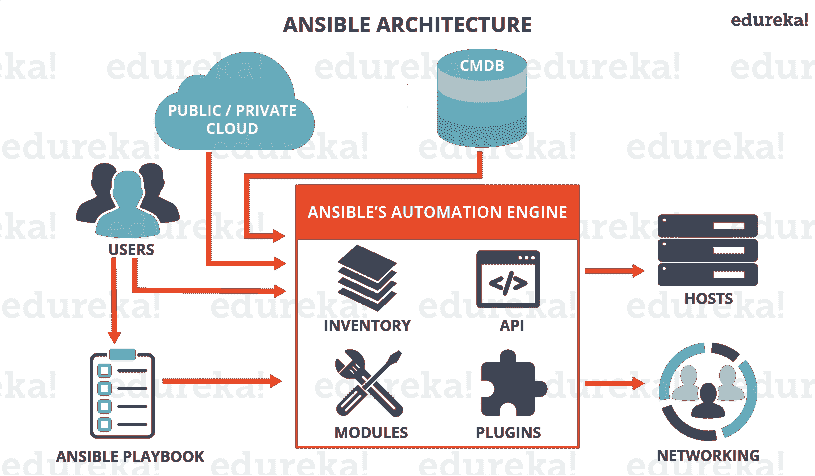
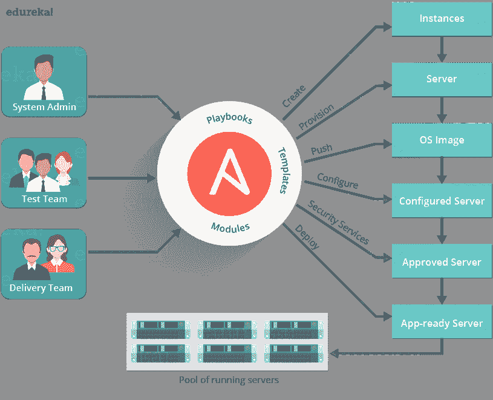
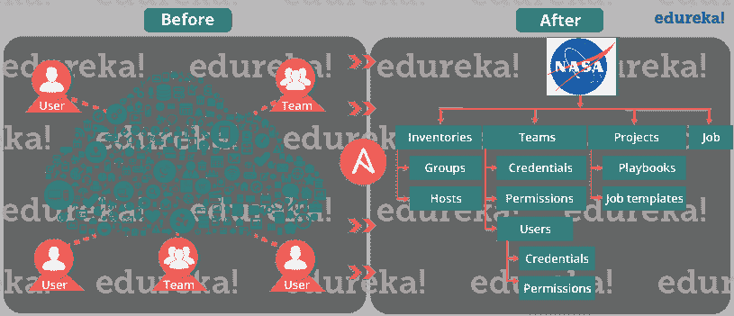

# 什么是 Ansible？–ansi ble 的配置管理和自动化

> 原文：<https://www.edureka.co/blog/what-is-ansible/>

## **什么是 Ansible？**

这是我的 Ansible 系列教程“什么是 Ansible”的第一篇博客。我希望你会喜欢读它。

Ansible 是一款开源的 IT 配置管理、部署&编排工具。它旨在为各种自动化挑战提供巨大的生产力增益。该工具使用起来非常简单，但功能强大，足以自动化复杂的多层 IT 应用程序环境。

在这个博客上，你将会学到:

*   什么是 Ansible？
*   [我们为什么需要 Ansible](#why_do_we_need_ansible) ？
*   [使用 Ansible 的优点](#advantages_of_using_ansible)
*   [ansi ble 能做什么](#what_ansible_can_do)？
*   [易变建筑](#ansible_architecture)
*   [在 DevOps 中的 ansi ble](#ansible_in_devops)
*   [NASA](#nasa_case_study)ansi ble 的真实使用情况
*   一些 [Ansible 术语](#ansible_terms)，帮助你更好的理解 Ansible。

你可以通过这个什么是可行的视频讲座，我们的 [**可行培训**](https://www.edureka.co/devops) 专家正在讨论每一个&技术的每一个细微差别。

## **什么是 Ansible | DevOps 培训| edu reka**

[//www.youtube.com/embed/XJpN8qpxWbA?rel=0&showinfo=0](//www.youtube.com/embed/XJpN8qpxWbA?rel=0&showinfo=0)

## **我们为什么需要 Ansible？**

在我告诉你什么是 Ansible 之前，最重要的是理解 Ansible 之前所面临的问题。

让我们回顾一下网络计算的初期，那时可靠而高效地部署和管理服务器是一项挑战。以前，系统管理员手动管理服务器，在单个服务器上安装软件、更改配置和管理服务。 随着数据中心的增长，托管的应用程序变得更加复杂，管理员意识到他们无法像应用程序那样快速扩展手动系统管理。这也阻碍了开发人员的工作速度，因为开发团队是敏捷的，并且频繁地发布软件，但是 It 操作花费更多的时间来配置系统。这就是服务器供应和配置管理工具盛行的原因。

考虑一下管理服务器群的繁琐程序。我们总是需要不断更新，推动变化，复制文件等等。这些任务使事情变得非常复杂和耗时。

但是让我告诉你，有一个解决上述问题的方法。解决方法是——***ansi ble。***

但是在我向你解释 Ansible 之前，让我让你熟悉一些 Ansible 术语:

## **可译名:**

*   **控制器机器**:安装 Ansible 的机器，负责在您管理的服务器上运行配置。
*   **Inventory** :一个初始化文件，包含您所管理的服务器的信息。
*   **剧本**:可行供应的入口点，在这里通过使用 YAML 格式的任务来定义自动化。
*   **任务**:定义要执行的单个程序的块，例如安装包。
*   **模块**:一个模块通常抽象一个系统任务，比如处理包或者创建和改变文件。Ansible 有许多内置模块，但是您也可以创建自定义模块。
*   **角色**:组织剧本和其他文件的预定义方式，以便于共享和重用部分供应。
*   **播放**:从头到尾执行一次的配置称为播放*。*简单来说，执行一个剧本就叫剧本。
*   **事实**:包含系统信息的全局变量，如网络接口或操作系统。
*   **处理程序**:用于触发服务状态变化，如重启或停止服务。

Ansible 是一个有用的工具，它允许你创建机器组，描述这些机器应该如何配置或者应该对它们采取什么行动。Ansible 从中央位置发出所有命令来执行这些任务。

节点机器上没有安装其他客户端软件。它使用 SSH 连接到节点。  Ansible 只需要安装在控制机器(你将要运行命令的机器)上，甚至可以是你的笔记本电脑。这是一个复杂问题的简单解决方案。

当我说 Ansible 填补了配置管理和 IT 流程编排领域的所有漏洞时，我并没有自夸。当你看看下面提到的 Ansible 的好处时，你也会知道的:

## **使用 Ansible** 的优点

   **简单:** Ansible 使用一个在 YAML 编写的简单语法叫做 *** playbooks *** 。YAML 是一种人类可读的数据序列化语言。这非常简单。因此，不需要特殊的编码技能，甚至你的 IT 组织中不知道什么是可行的人也可以阅读剧本并理解正在发生的事情。Ansible 总是按顺序执行任务。安装起来也简单(不信我？查看我的*[**ansi ble Installation**](https://www.edureka.co/blog/install-ansible/)*博客)。总之，简单性确保您可以快速开始。

   **无代理:**最后，Ansible 完全无代理。您不需要在想要自动化的客户端系统或主机上安装代理/软件或额外的防火墙端口。您不必单独设置管理基础设施，包括管理您的整个系统、网络和存储。Ansible 进一步减少了您的团队立即开始自动化所需的工作。

**强大&灵活:** Ansible 拥有强大的功能，甚至可以让您对最复杂的 IT 工作流进行建模。在这方面，Ansible 的*电池内置方法*(这一理念意味着某些东西是自给自足的，开箱即用，包含所需的一切)可以管理您已经在使用的基础设施、网络、操作系统和服务，因为 Ansible 为您提供了数百个模块来管理它们。Ansible 的功能允许您协调整个应用程序环境，而不管它部署在哪里。

****

**高效:**服务器上没有额外的软件意味着你的应用程序有更多的资源。此外，由于 Ansible 模块通过 JSON 工作，Ansible 可以用你已经知道的编程语言编写的模块进行扩展。Ansible 引入了模块作为软件的基本构建模块。因此，您甚至可以根据自己的需求进行定制。例如，如果您有一个现有的以纯文本格式发送消息的消息发送模块，并且您也想发送图像，您可以在它的基础上添加图像发送功能。

## **ansi ble 能做什么？**

Ansible 通常与其他配置管理工具放在一起，如 Puppet、Chef、SaltStack 等。好吧，让我告诉你，Ansible 不仅仅局限于配置管理。它也可以用在许多不同的方面。下面我已经提到了其中的一些:

   **供应:**您的应用程序必须在某个地方运行。如果您正在 PXE(预启动执行环境)启动裸机服务器或虚拟机，或者从模板创建虚拟或云实例，Ansible & Ansible Tower 可以帮助您简化这一过程。例如，如果我想测试用 Visual C++构建的应用程序的调试版本，我应该满足一些先决条件，如拥有 Visual C++库 dll(msvcr 100d . dll)。我还需要在你的计算机上安装 Visual Studio。这时 Ansible 会确保下载并安装所需的包，以便提供我的应用程序。

   **配置管理:**通过记录和更新描述企业硬件和软件的详细信息，建立和维护产品性能的一致性。  此类信息通常包括已安装软件包的版本和更新，以及硬件设备的位置和网络地址。例如，如果您想在企业中的所有机器上安装 Tomcat 的新版本，那么手动更新每台机器是不可行的。您可以在所有机器上一次性安装 Tomcat，并以最简单的方式编写 Ansible 剧本和清单。您所要做的就是在清单中列出您的节点的 IP 地址，并编写一个剧本来安装 Tomcat。从您的控制机器&运行剧本，它将被安装在您的所有节点上。

   **应用部署:**当你用 Ansible 定义你的应用，用 Ansible Tower 管理部署，团队就能有效地管理从开发到生产的整个应用生命周期。  例如，假设我想部署默认的 Servlet 引擎。部署引擎需要经历许多步骤。

*   将. war 应用程序从 dropins 目录移动到 apps 目录
*   添加 server.xml 文件
*   导航至网页查看您的应用程序。

但是，当我们有一个像 Ansible 这样的工具时，为什么要担心一个接一个地执行这些步骤呢？你所需要做的就是在你的 Ansible 剧本中列出这些任务，然后坐下来看 Ansible 按顺序执行这些任务。

****

**安全与合规:**当您在 Ansible 中定义您的安全策略时，站点范围安全策略的扫描和补救可以集成到其他自动化流程中。它将成为部署的所有产品中不可或缺的一部分。这意味着，您需要在控制机器中配置一次安全细节，它将自动嵌入到所有其他节点中。此外，存储在 Ansible 中的所有凭证(管理员用户 id 的&密码)都不能被任何用户以纯文本的形式检索到。

  **编排:**配置本身并不能定义您的环境。您需要定义多个配置如何交互，并确保不同的部分可以作为一个整体来管理。从复杂和混乱中，Ansible 带来了秩序。Ansible 提供编排，将业务请求与应用程序、数据和基础设施结合起来。它通过自动化的工作流、资源调配和变更管理来定义策略和服务级别。这创建了一个与应用程序一致的基础架构，可以根据每个应用程序的需求进行扩展或缩减。 

例如，考虑这样一种情况，我想部署一个新网站来取代现有的网站。为此，我们将删除现有网站，部署我们的新网站，并在需要时重启负载平衡器或 web 集群。 现在，如果我们做了这样的事情，用户会注意到停机，因为我们没有通过负载均衡器删除流向这些机器的实时流量。因此，我们需要某种类型的前置任务，告诉负载平衡器将该 web 服务器置于维护模式，这样我们就可以在它升级时暂时禁止流量进入它。比方说，我在这里添加了一个块，它表示一个前置任务是禁用负载平衡器中的 web 节点。

这是我们的前置任务，我们禁用流量，然后在这里，我们使用这些不同的任务升级节点。最后，我们需要某种类型的后任务，它将使这个 web 节点脱离维护模式，从而使流量能够再次到达这个 web 节点。这些任务可以写在行动手册中，因此有助于协调环境。

当你清楚地了解 Ansible 的架构时，你会更好地理解它的工作。

## **什么是 Ansible & its 架构？**

Ansible 架构相当简单。参考下图了解 Ansible 架构:

正如你所看到的，在上图中，Ansible automation engine 与编写剧本的用户直接互动，以执行 Ansible Automation engine。它还与云服务和配置管理数据库(CMDB)交互。

ansi ble 自动化引擎包括:

*   **清单:**清单是主机(节点)及其 IP 地址、服务器、数据库等的列表。这是需要管理的。Ansible 然后通过传输采取行动——SSH 用于 UNIX、Linux 或网络设备，WinRM 用于 Windows 系统。
*   **API:**ansi ble 中的 API 被用作云服务的传输，公共的或者私有的。
*   **模块:**模块通过剧本直接在远程主机上执行。这些模块可以控制系统资源，比如服务、包或文件(任何东西)，或者执行系统命令。模块通过作用于系统文件、安装包或对服务网络进行 API 调用来实现。ansi ble 提供了超过 450 个模块，几乎自动化了您环境的每个部分。例如
    *   云模块，如*云形成*，其创建或删除 AWS 云形成堆栈；
    *   数据库模块，如 *mssql_db* ，它从远程主机上移除 MYSQL 数据库。
*   **插件:**插件允许作为作业构建步骤执行可执行的任务。插件是增加 Ansible 核心功能的代码片段。Ansible 附带了许多方便的插件，您可以轻松地编写自己的插件。例如，
    *   *动作*插件是模块的前端，可以在调用模块本身之前在控制器上执行任务。
    *   *缓存*插件用于保存“事实”的缓存，以避免昂贵的事实收集操作。
    *   *回调*插件使你能够为了显示或记录的目的而挂钩到可响应的事件中。

ansi ble 架构中还有一些组件，解释如下:

**联网** : Ansible 也可以用来自动化不同的网络。 Ansible 使用了同样简单、强大且 IT 运营和开发部门已经在使用的无代理自动化框架。它使用一个数据模型(一个剧本或角色),该模型独立于可以轻松跨越不同网络硬件的 Ansible 自动化引擎。

**主机**:Ansible 架构中的主机只是 ansi ble 自动化的节点系统。它可以是任何类型的机器——Windows、Linux、RedHat 等。

**行动手册:**行动手册是以 YAML 格式编写的简单文件，描述了 Ansible 要执行的任务。行动手册可以声明配置，但它们也可以编排任何手动订购流程的步骤，即使它包含跳转语句。他们可以同步或异步启动任务。

**【CMDB】**:它是一个存储库，充当 It 安装的数据仓库。它保存与 It 资产集合相关的数据(通常称为配置项(CI))，并描述这些资产之间的关系。

**云:**它是一个托管在互联网上的远程服务器网络，用来存储、管理和处理数据，而不是本地服务器。您可以在云上启动您的资源和实例，并连接到您的服务器。

## **devo PS 中 Ansible 是什么？**

在 DevOps 中，我们知道开发 和运营工作是一体化的。这种集成对于 现代测试驱动的应用程序设计非常重要。因此，Ansible 通过为开发和运营提供一个稳定的环境来整合这一点，从而实现流畅的编排。参考下图，看看 Ansible 如何融入 DevOps:

现在让我们讨论 Ansible 如何管理整个 DevOps 基础设施。当开发人员开始将基础设施视为其应用程序的一部分 ，即基础设施即代码( **IaC** )，稳定性和性能就变得规范了。基础设施代码是管理和配置计算基础设施(流程、裸机服务器、虚拟服务器等)的过程。)及其配置，而不是物理硬件配置或交互式配置工具的使用。这就是 Ansible automation 发挥重要作用并在同行中脱颖而出的地方。

在 DevOps 中，系统管理员 与开发人员紧密合作， 开发速度提高，更多的时间花在做 性能调优、试验、做事情这样的活动上，花在修复问题 上的时间更少。参考下图，了解 Ansible 如何简化系统管理员和其他用户的任务。

至此，你知道了使用 Ansible 的好处。那么，现在让我们来看一个真实的例子，看看 NASA 是如何通过 Ansible 获益的。

## **Ansible 案例研究 NASA 的一个真实使用案例** 

让我们考虑一下 NASA 面临的商业挑战。

NASA 需要将 65 个应用程序从传统的基于硬件的数据中心迁移到基于云的环境中，以提高灵活性和节约成本。快速的时间表导致许多应用程序“按原样”迁移到云环境。这造成了一个跨多个虚拟私有云(VPC)和 AWS 帐户的环境，无法轻松管理。即使是简单的事情，如确保每个系统管理员都可以访问每台服务器，或者简单的安全补丁，也是非常麻烦的。

解决方案是利用 Ansible Tower 来管理和调度云环境。

因此，为了解决 NASA 缺乏集中管理和多样化环境的问题，他们评估了多种解决方案，并决定实施 Ansible Tower。NASA 现在正在利用 Ansible Tower 以一种非常有组织和有计划的方式管理他们的环境。

**NASA 如何使用 Ansible:**

Ansible Tower 提供了一个仪表板，提供了所有主机和作业的状态摘要，使 NASA 能够对所有内容进行分组，并管理不同部门的访问权限。它还通过关联组的内容和控制权限来帮助拆分组织。

Ansible Tower 是一个基于网络的界面，用于管理 Ansible。Ansible 用户的愿望清单中最重要的一项是易于使用的 UI，用于管理快速部署和监控个人配置。作为回应，Ansible management 推出了 Ansible Tower。

此外，Ansible 通过分配不同的角色在团队之间划分任务。它管理旧作业历史、活动流、标记为删除的数据和系统跟踪信息的清理。参考下图，了解 Ansible 如何简化了 NASA 的工作。

因此，美国航天局实现了以下效率:

NASA 的网络应用服务器正在通过 Ansible Tower 用一个非常简单的 10 行 Ansible playbook 进行例行和自动的修补。

Ansible 还被用于调解安全问题，并被用于调解 OpenSSL 问题。这不仅节省了时间，而且可以快速调解一个非常棘手的安全问题。

每周，www.nasa.gov 的完整版和手机版都会通过 Ansible 更新，通常只需 5 分钟。

·持续检查并创建任务关键型员工的操作系统级用户账户(如果缺失)。现在，需要访问的每个人都可以访问，即使这意味着几乎可以立即在所有服务器上添加或删除用户。

NASA 还将 Ansible facts 集成到他们的 CMDB cloud aware 中，以更好地管理整个 AWS 库存的可见性。因此，以非常精细的方式组织 AWS 资源清单成为可能，这在以前是不可能的。

Ansible 还用于确保环境符合必要的联邦安全标准，如 FedRAMP 和其他监管要求所述。

**结果:**

实施 Ansible 后，NASA 能够更好地管理其 AWS 环境。Ansible 允许 NASA 为其客户提供更好的操作和安全性。这也提高了团队的效率。

如果我们用数字来看:

更新**nasa.gov**从 1 个多小时缩短到不到 5 分钟

安全补丁更新从数天的过程缩短到 45 分钟

·实现近乎实时的 RAM 和磁盘监控(无需代理即可完成)

在不到 10 分钟的时间内在整个环境中调配操作系统帐户

基准标准 AMIs(亚马逊机器映像)从 1 小时的手动配置变成了一个不可见的无缝后台流程

每个应用堆栈的设置时间从 1-2 小时减少到 10 分钟以下。

我希望你喜欢这个博客，并且知道什么是可行的。现在，让我们在我的下一篇关于 ***[Ansible 教程](https://www.edureka.co/blog/ansible-tutorial/)*** 的博客中，学习如何使用 Ansible。

**概要** : Ansible 是一款开源软件供应、配置管理和应用部署工具，支持基础设施作为代码。它运行在许多类 Unix 系统上，可以配置类 Unix 系统和 Microsoft Windows。 ***来源** : [维基百科](https://en.wikipedia.org/wiki/Ansible_(software))。*

*如果你发现了这个“**什么是可回答的****”**相关内容，请查看 Edureka 的* [***DevOps 培训***](https://www.edureka.co/devops/) *，edu reka 是一家值得信赖的在线学习公司，在全球拥有超过 25 万名满意的学习者。Edureka DevOps 认证培训课程帮助学员获得各种 DevOps 流程和工具方面的专业知识，例如 Puppet、Jenkins、Ansible、Nagios 和 Git，用于自动化 SDLC 中的多个步骤。*