# 如何建立具有 HDFS 高可用性的 Hadoop 集群

> 原文：<https://www.edureka.co/blog/how-to-set-up-hadoop-cluster-with-hdfs-high-availability/>

## **HDFS 2.x 高可用性集群架构**

在这篇博客中，我将谈论 HDFS 2.x 高可用性集群架构以及建立 HDFS 高可用性集群的过程。这是 ***[大数据课程](https://www.edureka.co/big-data-hadoop-training-certification)*** 的重要组成部分。 本博客中涉及的主题顺序如下:

*   HDFS 哈建筑
    *   简介
    *   NameNode 可用性
    *   高可用性架构
    *   HA(日志节点和共享存储)的实现
*   如何在 Hadoop 集群中设置 HA(仲裁日志节点)？

## **简介:**

Hadoop 2中引入了高可用性集群的概念。 x 来解决 Hadoop 1.x 中的单点故障问题。正如你在我之前的博客中所知， ***[HDFS 架构](https://www.edureka.co/blog/apache-hadoop-hdfs-architecture/)*** 遵循主/从拓扑结构，其中 NameNode 充当主守护进程，负责管理其他名为 DataNodes 的从节点。这个单一的主守护进程或 NameNode 成为瓶颈。虽然，二级 NameNode 的引入确实防止了数据丢失并减轻了 NameNode 的一些负担，但是它没有解决 NameNode 的可用性问题。

## **NameNode 可用性:**

如果您考虑 HDFS 集群的标准配置，NameNode 将成为一个**单点故障**。这是因为当 NameNode 变得不可用时，整个集群都变得不可用，直到有人重新启动 NameNode 或带来一个新的 NameNode。

NameNode 不可用的原因可能是:

*   软件或硬件升级的维护工作等有计划的事件。
*   也可能是由于一些原因导致 NameNode 崩溃的意外事件。

在上述任何一种情况下，我们都有无法使用 HDFS 集群的停机时间，这就成了一个难题。

## **HDFS 哈建筑:**

让我们了解一下 HDFS HA 架构是如何解决 NameNode 可用性这一关键问题的:

通过允许我们在主动/被动配置中拥有两个 NameNode，HA 架构解决了 NameNode 可用性的问题。因此，在一个高可用性集群中，我们同时有两个运行的 NameNode:

*   活动命名节点
*   备用/被动 NameNode。

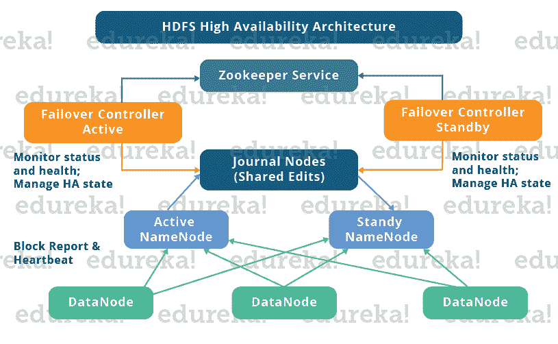

如果一个 NameNode 出现故障，另一个 NameNode 可以接管责任，从而减少集群停机时间。备用命名节点用作备份命名节点(与辅助命名节点不同),将故障转移功能整合到 Hadoop 集群中。因此，通过 StandbyNode，我们可以在 NameNode 崩溃(意外事件)时自动进行故障转移，或者在维护期间进行正常的(手动启动的)故障转移。

在 HDFS 高可用性集群中维护一致性有两个问题:

*   活动和备用 NameNode 应始终相互同步，即它们应具有相同的元数据。这将允许我们将 Hadoop 集群恢复到其崩溃时的相同命名空间状态，因此将为我们提供快速故障切换。
*   一次只能有一个活动的 NameNode，因为两个活动的 NameNode 会导致数据损坏。*这种场景被称为裂脑场景，其中一个集群被分成更小的集群，每个集群都认为自己是唯一活跃的集群。*为了避免这样的场景，击剑已经完成。防护是确保在特定时间只有一个 NameNode 保持活动的过程。

## **HA 架构的实现:**

现在，你知道在 HDFS HA 架构中，我们有两个 NameNodes 同时运行。因此，我们可以通过以下两种方式实现主备 NameNode 配置:

1.  使用仲裁日志节点
2.  使用 NFS 的共享存储

让我们一次理解这两种实现方式:

## **1。使用仲裁日志节点:**

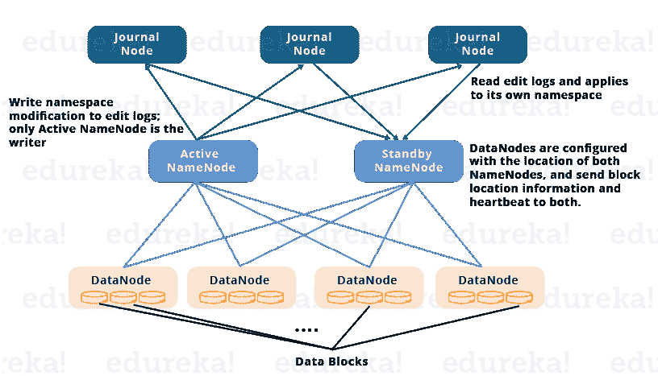

*   备用 NameNode 和活动 NameNode 通过一组单独的节点或守护进程(称为**日志节点**)保持同步。 日志节点遵循环形拓扑，其中节点相互连接形成一个环。journal node 为到达它的请求提供服务，并将信息复制到环中的其他节点。这在 JournalNode 失败的情况下提供了容错能力。
*   活动 NameNode 负责更新日志节点中的编辑日志(元数据信息)。
*   StandbyNode 读取对 JournalNode 中的编辑日志所做的更改，并以恒定的方式将其应用于自己的名称空间。
*   在故障转移期间，备用节点确保在成为新的活动命名节点之前，已经从日志节点更新了它的元数据信息。这使得当前命名空间状态与故障切换前的状态同步。
*   两个命名节点的 IP 地址对所有数据节点都可用，它们向两个命名节点发送心跳和数据块位置信息。这提供了快速故障转移(更少的停机时间),因为备用节点具有关于块在集群中的位置的更新信息。

## 剑术

如前所述，确保一次只有一个活动的 NameNode 非常重要。因此，防护是确保集群中这一特性的过程。

*   JournalNodes 通过一次只允许一个 NameNode 作为作者来执行这种防护。
*   备用命名节点接管向日志节点写入的责任，并禁止任何其他命名节点保持活动。
*   最后，新的活动 NameNode 可以安全地执行其活动。

## **2。使用共享存储:**

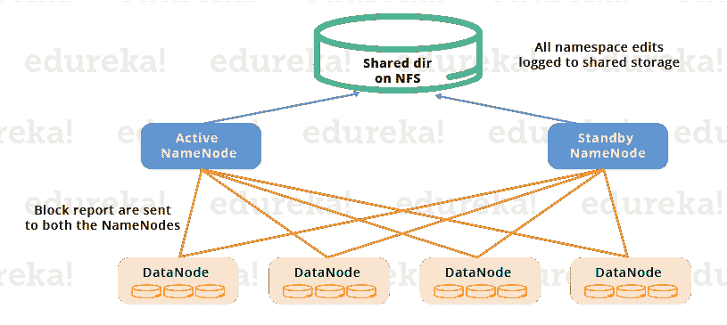

*   备用节点和活动命名节点通过使用一个**共享存储设备**保持彼此同步。 活动命名节点将在其命名空间中所做的任何修改记录到该共享存储器中的编辑日志中。stand by node 读取对该共享存储中的编辑日志所做的更改，并将其应用于自己的名称空间。
*   现在，在故障转移的情况下，备用节点首先使用共享存储中的编辑日志更新其元数据信息。然后，它承担活动 NameNode 的责任。这使得当前命名空间状态与故障切换前的状态同步。
*   管理员必须至少配置一种防护方法，以避免出现裂脑情况。
*   该系统可采用一系列防护机制。它可能包括终止 NameNode 的进程并取消其对共享存储目录的访问。
*   作为最后的手段，我们可以用一种叫做 STONITH 的技术来隔离之前活跃的 NameNode，或者“打爆另一个节点的头”。STONITH 使用专门的配电装置来强制关闭 NameNode 机器。

## **自动故障转移:**

故障转移是一个过程，通过该过程，系统在检测到故障或失效时自动将控制转移到辅助系统。有两种类型的故障转移:

**平稳故障转移:**在这种情况下，我们手动启动故障转移进行日常维护。

**自动故障转移:**在这种情况下，如果 NameNode 失败(意外事件)，故障转移将自动启动。

Apache Zookeeper 是一种在 HDFS 高可用性集群中提供自动故障转移功能的服务。它维护少量的协调数据，通知客户机数据的变化，并监视客户机的故障。Zookeeper 维护着与 NameNodes 的会话。如果失败，会话将终止，Zookeeper 将通知其他命名节点启动故障转移过程。在 NameNode 失败的情况下，其他被动 NameNode 可以锁定 Zookeeper，声明它希望成为下一个主动 NameNode。

ZookeerFailoverController (ZKFC)是一个 Zookeeper 客户端，它还监控和管理 NameNode 状态。每个 NameNode 还运行一个 ZKFC。ZKFC 负责定期监控命名节点的健康状况。

现在您已经了解了什么是 Hadoop 集群中的高可用性，是时候设置它了。要在 Hadoop 集群中设置高可用性，您必须在所有节点中使用 Zookeeper。

活动 NameNode 中的守护进程有:

*   动物园管理员
*   动物园管理员故障转移控制器
*   日志节点
*   命名节点

备用 NameNode 中的守护程序有:

*   动物园管理员
*   动物园管理员故障转移控制器
*   日志节点
*   命名节点

DataNode 中的守护进程有:

*   动物园管理员
*   日志节点
*   数据节点

如果您希望掌握 HDFS 和 Hadoop，请查看由 Edureka 特别策划的[大数据认证](https://www.edureka.co/blog/top-big-data-certifications)课程。单击下面的按钮开始。

[](https://www.edureka.co/big-data-and-hadoop)

## **在 Hadoop 中设置和配置高可用性集群:**

你必须首先设置每个节点的 Java 和主机名。

| **虚拟机** | **IP 地址** | **主机名** |
| 活动命名节点 | 192.168.1.81 | nn1.cluster.com 或 nn1 |
| 备用命名节点 | 192.168.1.58 | nn2.cluster.com 或 nn2 |
| 数据节点 | 192.168.1.82 | dn1.cluster.com 或 dn1 |

下载 Hadoop 和 Zookeeper 二进制 tar 文件，提取文件编辑配置文件。

**命令:**wget https://archive . Apache . org/dist/zookeeper/zookeeper-3 . 4 . 6/zookeeper-3 . 4 . 6 . tar . gz

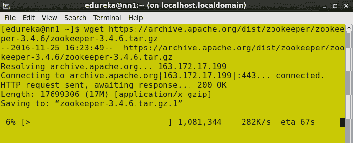

解开 zookeeper-3.4.6.tar.gz

**命令**:tar–xvf zookeeper-3.4.6.tar.gz

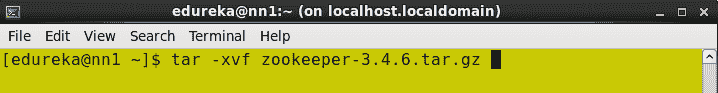

从 Apache Hadoop 网站下载稳定的 Hadoop 二进制 tar。

**命令**:wget https://archive . Apache . org/dist/Hadoop/core/Hadoop-2 . 6 . 0/Hadoop-2 . 6 . 0 . tar . gz

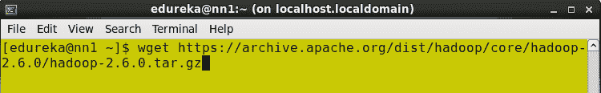

提取 Hadoop 焦油球。

**命令**:tar–xvf hadoop-2.6.0.tar.gz

<figure id="attachment_26023" aria-describedby="caption-attachment-26023" style="width: 661px" class="wp-caption alignnone">[](https://www.edureka.co/blog/wp-content/uploads/2015/06/untar_Hadoop_binary.png)

<figcaption id="caption-attachment-26023" class="wp-caption-text">Untar hadoop binary.</figcaption>

</figure>

将 Hadoop、Zookeeper 和路径添加到。bashrc 文件。

打开。bashrc 文件。

**命令** : sudo gedit ~/。bashrc

添加以下路径:

```
export HADOOP_HOME=< Path to your Hadoop-2.6.0 directory>
export HADOOP_MAPRED_HOME=$HADOOP_HOME
export HADOOP_COMMON_HOME=$HADOOP_HOME
export HADOOP_HDFS_HOME=$HADOOP_HOME
export YARN_HOME=$HADOOP_HOME
export HADOOP_CONF_DIR=$HADOOP_HOME/etc/hadoop
export YARN_CONF_DIR=$HADOOP_HOME/etc/hadoop
export JAVA_HOME=<Path to your Java Directory>
export ZOOKEEPER_HOME =<Path to your Zookeeper Directory>
export PATH=$PATH: $JAVA_HOME/bin: $HADOOP_HOME/bin: $HADOOP_HOME/sbin:$ZOOKEEPER_HOME/bin
```

<figure id="attachment_26026" aria-describedby="caption-attachment-26026" style="width: 650px" class="wp-caption alignnone">[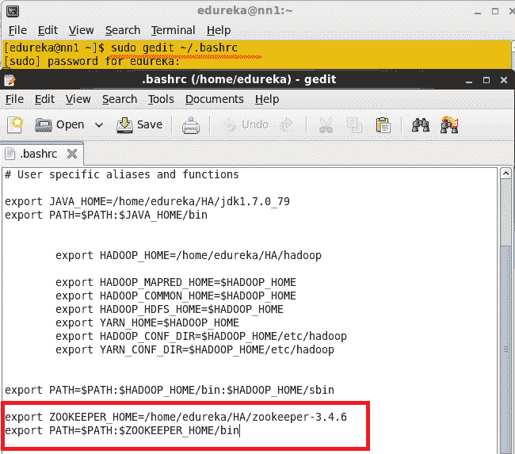](https://www.edureka.co/blog/wp-content/uploads/2015/06/bashrc.png)

<figcaption id="caption-attachment-26026" class="wp-caption-text">Edit .bashrc file.</figcaption>

</figure>

在所有节点中启用 SSH。

在所有节点生成 SSH 密钥。

**命令**:ssh-keygen–t RSA(此步骤在所有节点进行)

<figure id="attachment_26029" aria-describedby="caption-attachment-26029" style="width: 660px" class="wp-caption alignnone">[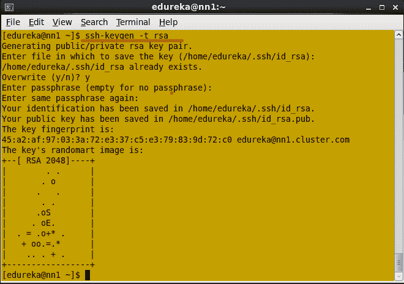](https://www.edureka.co/blog/wp-content/uploads/2015/06/ssh_key_generation.png)

<figcaption id="caption-attachment-26029" class="wp-caption-text">Set up SSH key in all the nodes.</figcaption>

</figure>

不要给出任何输入文件的路径来保存密钥，也不要给出任何密码。按回车键。

在所有节点生成 ssh 密钥流程。

一旦生成了 ssh 密钥，您将获得公钥和私钥。

The。ssh 密钥目录应该包含权限 700 和。ssh 目录应该包含权限 600。

<figure id="attachment_26030" aria-describedby="caption-attachment-26030" style="width: 657px" class="wp-caption alignnone">[](https://www.edureka.co/blog/wp-content/uploads/2015/06/ssh-permission.png)

<figcaption id="caption-attachment-26030" class="wp-caption-text">Change the SSH directory permission.</figcaption>

</figure>

将目录更改为。ssh 并将文件的权限更改为 600

<figure id="attachment_26031" aria-describedby="caption-attachment-26031" style="width: 661px" class="wp-caption alignnone">[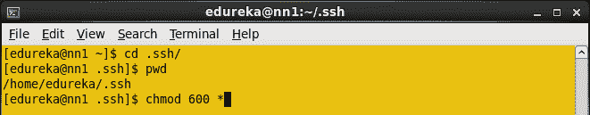](https://www.edureka.co/blog/wp-content/uploads/2015/06/ssh_key_permission.png)

<figcaption id="caption-attachment-26031" class="wp-caption-text">Change public and private key permission.</figcaption>

</figure>

您必须将名称节点的 ssh 公钥复制到所有节点。

在活动 Namenode 中，使用 cat 命令复制 id_rsa.pub。

**命令** :猫~/。ssh/id_rsa.pub > > ~/。ssh/authorized _ key

<figure id="attachment_26032" aria-describedby="caption-attachment-26032" style="width: 660px" class="wp-caption alignnone">[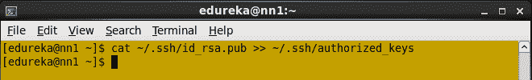](https://www.edureka.co/blog/wp-content/uploads/2015/06/copy_ssh_to_namenode.png)

<figcaption id="caption-attachment-26032" class="wp-caption-text">Copy Namenode ssh key to it’s authorized keys.</figcaption>

</figure>

使用 **ssh-copy-id** 命令将 NameNode 公钥复制到所有节点。

**命令**:ssh-copy-id–I . ssh/id _ RSA . pub[edureka@nn2.cluster.com](mailto:edureka@nn2.cluster.com)

<figure id="attachment_26033" aria-describedby="caption-attachment-26033" style="width: 661px" class="wp-caption alignnone">[](https://www.edureka.co/blog/wp-content/uploads/2015/06/ssh_copy_seconday.png)

<figcaption id="caption-attachment-26033" class="wp-caption-text">Copy namenode key to Standby NameNode.</figcaption>

</figure>

将 NameNode 公钥复制到数据节点。

**命令**:ssh-copy-id–I . ssh/id _ RSA . pub[edureka@dn1.cluster.com](mailto:edureka@dn1.cluster.com)

<figure id="attachment_26034" aria-describedby="caption-attachment-26034" style="width: 663px" class="wp-caption alignnone">[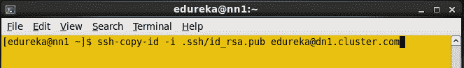](https://www.edureka.co/blog/wp-content/uploads/2015/06/ssh_copy_datanodes.png)

<figcaption id="caption-attachment-26034" class="wp-caption-text">Copy Namenode public key to data node.</figcaption>

</figure>

在所有节点中重新启动 sshd 服务。

**命令** : sudo 服务 sshd 重启(在所有节点做)

<figure id="attachment_26035" aria-describedby="caption-attachment-26035" style="width: 659px" class="wp-caption alignnone">[](https://www.edureka.co/blog/wp-content/uploads/2015/06/restartsshdservice.png)

<figcaption id="caption-attachment-26035" class="wp-caption-text">Restart SSH service.</figcaption>

</figure>

现在您可以从 Namenode 登录到任何节点，无需任何身份验证。

从活动名称节点打开 core-site.xml 文件，并添加以下属性。

<figure id="attachment_26036" aria-describedby="caption-attachment-26036" style="width: 652px" class="wp-caption alignnone">[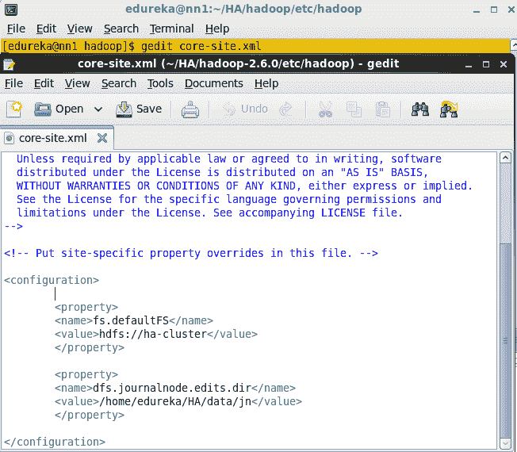](https://www.edureka.co/blog/wp-content/uploads/2015/06/core-site.png)

<figcaption id="caption-attachment-26036" class="wp-caption-text">Edit core-site.xml from Active namenode</figcaption>

</figure>

在活动 Namenode 中打开 hdfs-site.xml 文件。添加以下属性。

```
<property>
 <name>dfs.namenode.name.dir</name>
 <value>/home/edureka/HA/data/namenode</value>
 </property>
 <property>
 <name>dfs.replication</name>
 <value>1</value>
 </property>
 <property>
 <name>dfs.permissions</name>
 <value>false</value>
 </property>
 <property>
 <name>dfs.nameservices</name>
 <value>ha-cluster</value>
 </property>
 <property>
 <name>dfs.ha.namenodes.ha-cluster</name>
 <value>nn1,nn2</value>
 </property>
 <property>
 <name>dfs.namenode.rpc-address.ha-cluster.nn1</name>
 <value>nn1.cluster.com:9000</value>
 </property>
 <property>
 <name>dfs.namenode.rpc-address.ha-cluster.nn2</name>
 <value>nn2.cluster.com:9000</value>
 </property>
 <property>
 <name>dfs.namenode.http-address.ha-cluster.nn1</name>
 <value>nn1.cluster.com:50070</value>
 </property>
 <property>
 <name>dfs.namenode.http-address.ha-cluster.nn2</name>
 <value>nn2.cluster.com:50070</value>
 </property>
 <property>
 <name>dfs.namenode.shared.edits.dir</name>
 <value>qjournal://nn1.cluster.com:8485;nn2.cluster.com:8485;dn1.cluster.com:8485/ha-cluster</value>
 </property>
 <property>
 <name>dfs.client.failover.proxy.provider.ha-cluster</name>
 <value>org.apache.hadoop.hdfs.server.namenode.ha.ConfiguredFailoverProxyProvider</value>
 </property>
 <property>
 <name>dfs.ha.automatic-failover.enabled</name>
 <value>true</value>
 </property>
 <property>
 <name>ha.zookeeper.quorum</name>
 <value> nn1.cluster.com:2181,nn2.cluster.com:2181,dn1.cluster.com:2181 </value>
 </property>
 <property>
 <name>dfs.ha.fencing.methods</name>
 <value>sshfence</value>
 </property>
 <property>
 <name>dfs.ha.fencing.ssh.private-key-files</name>
 <value>/home/edureka/.ssh/id_rsa</value>
 </property>
```

将目录更改为 zookeeper 的 conf 目录。

**命令**:CD zookeeper-3 . 4 . 6/conf

<figure id="attachment_26041" aria-describedby="caption-attachment-26041" style="width: 658px" class="wp-caption alignnone">[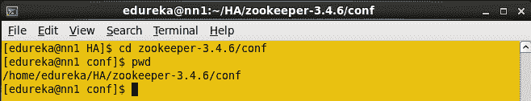](https://www.edureka.co/blog/wp-content/uploads/2015/06/change_zookeepr_directory_2.13.png)

<figcaption id="caption-attachment-26041" class="wp-caption-text">Zookeeper Conf directory.</figcaption>

</figure>

在一个 conf 目录下你有 zoo_sample.cfg 文件，用 zoo_sample.cfg 文件创建 zoo.cfg。

**命令**:CP zoo _ sample . CFG zoo . CFG

<figure id="attachment_26042" aria-describedby="caption-attachment-26042" style="width: 660px" class="wp-caption alignnone">[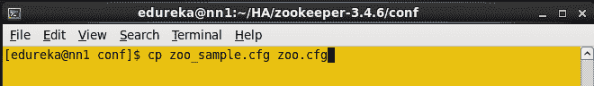](https://www.edureka.co/blog/wp-content/uploads/2015/06/create_zoo_cfg_2.14.png)

<figcaption id="caption-attachment-26042" class="wp-caption-text">Create zoo.cfg file.</figcaption>

</figure>

在任意位置创建目录，并使用该目录存储 zookeeper 数据。

**命令** : mkdir <路径，你要存放 zookeeper 文件的地方>

<figure id="attachment_26043" aria-describedby="caption-attachment-26043" style="width: 660px" class="wp-caption alignnone">[](https://www.edureka.co/blog/wp-content/uploads/2015/06/create_zookeepr_data_2.15.png)

<figcaption id="caption-attachment-26043" class="wp-caption-text">Create a directory to store zookeeper data.</figcaption>

</figure>

打开 zoo.cfg 文件。

**命令** : gedit zoo.cfg

将在上述步骤中创建的目录路径添加到 dataDir 属性中，并在 zoo.cfg 文件中添加以下关于剩余节点的详细信息。

**server . 1 = nn1 . cluster . com:2888:3888**

**server . 2 = nn2 . cluster . com:2888:3888**

**server . 3 = dn1 . cluster . com:2888:3888**

<figure id="attachment_26044" aria-describedby="caption-attachment-26044" style="width: 656px" class="wp-caption alignnone">[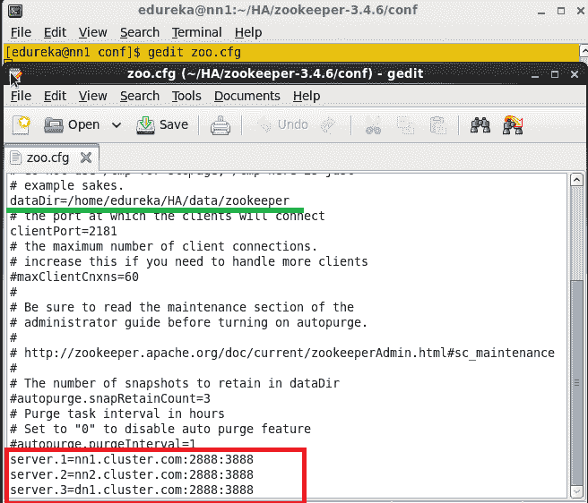](https://www.edureka.co/blog/wp-content/uploads/2015/06/zoo_cfg_file_2.16.1.png)

<figcaption id="caption-attachment-26044" class="wp-caption-text">Edit zoo.cfg file.</figcaption>

</figure>

现在复制 Java 和 Hadoop-2.6.0，zookeeper-3.4.6 目录，还有。bashrc 文件发送到所有节点(备用名称节点、数据节点)。

**命令**:scp–r<目录路径> edureka@ < ip 地址> : <需要复制> 的路径

<figure id="attachment_26045" aria-describedby="caption-attachment-26045" style="width: 660px" class="wp-caption alignnone">[](https://www.edureka.co/blog/wp-content/uploads/2015/06/Copy_HA_Z_.png)

<figcaption id="caption-attachment-26045" class="wp-caption-text">Copy Hadoop, Zookeeper and .bashrc file to all nodes.</figcaption>

</figure>

同样，复制。bashrc 文件和 zookeeper 目录添加到所有节点，并根据各自的节点更改每个节点中的环境变量。

在数据节点中，创建任何需要存储 HDFS 块的目录。

在一个数据节点中，你必须添加 dfs.datanode.data.dir 属性。

在我的例子中，我创建了 **datanode** 目录来存储数据块。

<figure id="attachment_26046" aria-describedby="caption-attachment-26046" style="width: 659px" class="wp-caption alignnone">[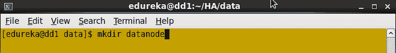](https://www.edureka.co/blog/wp-content/uploads/2015/06/createdatanode.png)

<figcaption id="caption-attachment-26046" class="wp-caption-text">Create Datanode directory.</figcaption>

</figure>

更改数据节点目录的权限。

<figure id="attachment_26047" aria-describedby="caption-attachment-26047" style="width: 660px" class="wp-caption alignnone">[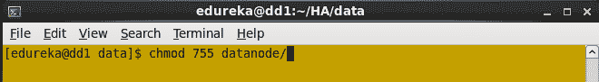](https://www.edureka.co/blog/wp-content/uploads/2015/06/datanode_permission.png)

<figcaption id="caption-attachment-26047" class="wp-caption-text">Change Datanode directory permission.</figcaption>

</figure>

打开 HDFS-site.xml 文件，在 dfs.datanode.data.dir 属性中添加此 Datanode 目录路径。

注意:保留从活动 namenode 复制的所有属性；在 namenode 中添加 dfs.datanode.data.dir 一个提取属性。

```
<property>
<name> dfs.datanode.data.dir</name>
<value>/home/edureka/HA/data/datanode</value>
</property>
```

在活动 namenode 中，更改要存储 zookeeper 配置文件的目录(dataDir 属性路径)。

在目录中创建 myid 文件，并在文件中添加数字 1，然后保存文件。

**命令** : vi myid

<figure id="attachment_26048" aria-describedby="caption-attachment-26048" style="width: 658px" class="wp-caption alignnone">[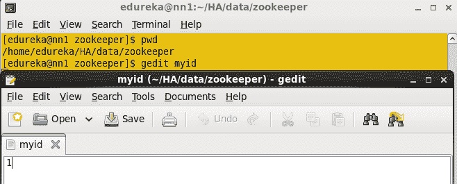](https://www.edureka.co/blog/wp-content/uploads/2015/06/myid.png)

<figcaption id="caption-attachment-26048" class="wp-caption-text">Create myid file.</figcaption>

</figure>

在备用 namenode 中，更改要存储 zookeeper 配置文件的目录(dataDir 属性路径)。

在目录中创建 myid 文件，并在文件中添加数字 2，然后保存文件。

在一个数据节点中，改变你想要存储 zookeeper 配置文件的目录(dataDir 属性路径)。

在目录中创建 myid 文件，并在文件中添加数字 3，然后保存文件。

在所有三个节点中启动 Journalnode。

**命令** : hadoop-daemon.sh 启动 journalnode

<figure id="attachment_26049" aria-describedby="caption-attachment-26049" style="width: 659px" class="wp-caption alignnone">[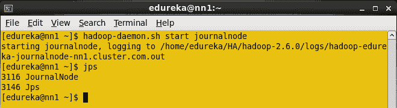](https://www.edureka.co/blog/wp-content/uploads/2015/06/startjournal.png)

<figcaption id="caption-attachment-26049" class="wp-caption-text">Start the Journalnode.</figcaption>

</figure>

当您输入 jps 命令时，您将在所有节点中看到 JournalNode 守护进程。

格式化活动 namenode。

**命令** : HDFS namenode -format

<figure id="attachment_26051" aria-describedby="caption-attachment-26051" style="width: 658px" class="wp-caption alignnone">[](https://www.edureka.co/blog/wp-content/uploads/2015/06/formatNN.png)

<figcaption id="caption-attachment-26051" class="wp-caption-text">Format Active NameNode.</figcaption>

</figure>

在活动 namenode 中启动 Namenode 守护程序。

**命令** : hadoop-daemon.sh 启动 namenode

<figure id="attachment_26052" aria-describedby="caption-attachment-26052" style="width: 663px" class="wp-caption alignnone">[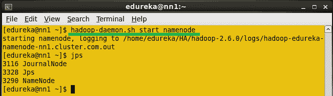](https://www.edureka.co/blog/wp-content/uploads/2015/06/startNN.png)

<figcaption id="caption-attachment-26052" class="wp-caption-text">Start Namenode.</figcaption>

</figure>

将 HDFS 元数据从活动名称节点复制到备用名称节点。

**命令**:HDFS NameNode-bootstrapStandby

<figure id="attachment_26053" aria-describedby="caption-attachment-26053" style="width: 657px" class="wp-caption alignnone">[](https://www.edureka.co/blog/wp-content/uploads/2015/06/boostrap.png)

<figcaption id="caption-attachment-26053" class="wp-caption-text">Copy the HDFS Meta data from Active name node to Standby Namenode.</figcaption>

</figure>

运行此命令后，您将获得元数据正在从哪个节点和位置拷贝以及是否拷贝成功的信息。

<figure id="attachment_26054" aria-describedby="caption-attachment-26054" style="width: 658px" class="wp-caption alignnone">[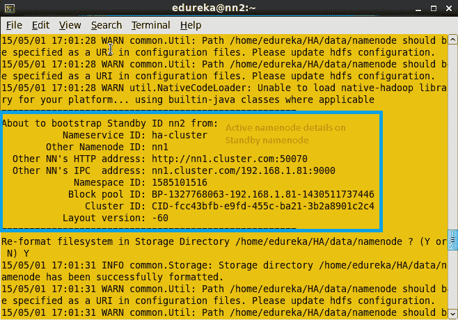](https://www.edureka.co/blog/wp-content/uploads/2015/06/information.png)

<figcaption id="caption-attachment-26054" class="wp-caption-text">Information of Active namenode details.</figcaption>

</figure>

将元数据从活动 namenode 复制到备用 namenode 后，您将会看到屏幕截图中显示的消息。

<figure id="attachment_26055" aria-describedby="caption-attachment-26055" style="width: 660px" class="wp-caption alignnone">[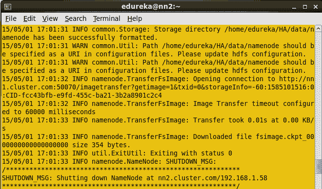](https://www.edureka.co/blog/wp-content/uploads/2015/06/completed_.png)

<figcaption id="caption-attachment-26055" class="wp-caption-text">Information regarding HDFS in Standby Namenode.</figcaption>

</figure>

在备用 namenode 机器中启动 namenode 守护进程。

**命令** : hadoop-daemon.sh 启动 namenode

现在在所有三个节点中启动 Zookeeper 服务。

**命令** : zkServer.sh start(在所有节点运行该命令)

在活动命名节点:

<figure id="attachment_26056" aria-describedby="caption-attachment-26056" style="width: 660px" class="wp-caption alignnone">[](https://www.edureka.co/blog/wp-content/uploads/2015/06/activezookeepr.png)

<figcaption id="caption-attachment-26056" class="wp-caption-text">Start zookeeper in Active NameNode.</figcaption>

</figure>

在备用命名节点:

<figure id="attachment_26057" aria-describedby="caption-attachment-26057" style="width: 661px" class="wp-caption alignnone">[](https://www.edureka.co/blog/wp-content/uploads/2015/06/zookeeper_standby.png)

<figcaption id="caption-attachment-26057" class="wp-caption-text">Start zookeeper in standby NameNode.</figcaption>

</figure>

在数据节点:

<figure id="attachment_26058" aria-describedby="caption-attachment-26058" style="width: 662px" class="wp-caption alignnone">[](https://www.edureka.co/blog/wp-content/uploads/2015/06/zookeeper_datanode.png)

<figcaption id="caption-attachment-26058" class="wp-caption-text">Start zookeeper in DataNode.</figcaption>

</figure>

运行 Zookeeper 服务器后，输入 JPS 命令。在所有节点中，您都会看到 QuorumPeerMain 服务。

启动数据节点机器中的数据节点守护进程。

**命令** : hadoop-daemon.sh 启动 datanode

启动活动名称节点和备用名称节点中的 Zookeeper 故障转移控制器。

在活动 namenode 中格式化 zookeeper 故障转移控制器。

**命令:**HDFS zkfc–format ZK

<figure id="attachment_26061" aria-describedby="caption-attachment-26061" style="width: 661px" class="wp-caption alignnone">[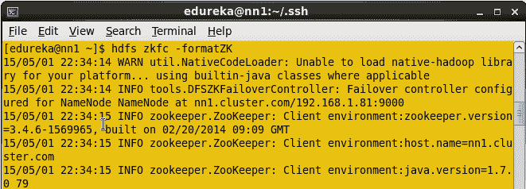](https://www.edureka.co/blog/wp-content/uploads/2015/06/formatzk.png)

<figcaption id="caption-attachment-26061" class="wp-caption-text">Format ZKFC.</figcaption>

</figure>

在活动 namenode 中启动 ZKFC。

**命令** : hadoop-daemon.sh 启动 zkfc

输入 jps 命令检查 DFSZkFailoverController 守护进程。

<figure id="attachment_26062" aria-describedby="caption-attachment-26062" style="width: 661px" class="wp-caption alignnone">[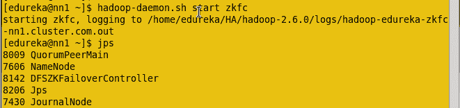](https://www.edureka.co/blog/wp-content/uploads/2015/06/zkfcrun.png)

<figcaption id="caption-attachment-26062" class="wp-caption-text">Start ZKFC.</figcaption>

</figure>

在备用 namenode 中格式化 zookeeper 故障转移控制器。

**命令**:HDFS zkfc–format ZK

在备用 namenode 中启动 ZKFC。

**命令** : hadoop-daemon.sh 启动 zkfc

输入 jps 命令检查 DFSZkFailoverController 守护进程。

现在使用下面的命令检查每个 Namenode 的状态，哪个节点是活动的，哪个节点是备用的。

**命令**:HDFS ha admin–getServiceState nn1

<figure id="attachment_26063" aria-describedby="caption-attachment-26063" style="width: 660px" class="wp-caption alignnone">[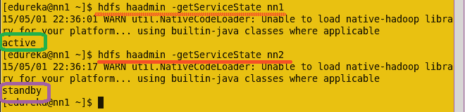](https://www.edureka.co/blog/wp-content/uploads/2015/06/NNstatus.png)

<figcaption id="caption-attachment-26063" class="wp-caption-text">Check status of each NameNode.</figcaption>

</figure>

现在使用网络浏览器检查每个 Namenode 的状态。

打开网络浏览器，输入以下网址。

<活动名称节点的 IP 地址> :50070

它将显示名称节点是活动的还是备用的。

<figure id="attachment_26064" aria-describedby="caption-attachment-26064" style="width: 1067px" class="wp-caption alignnone">[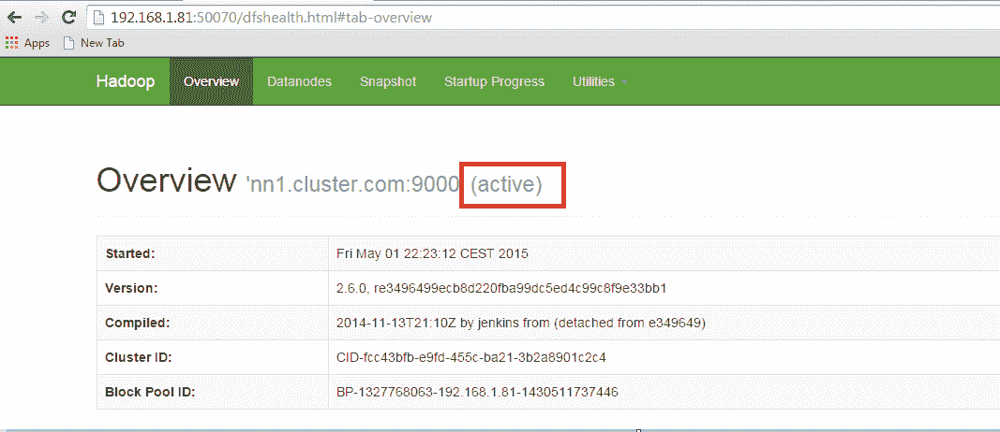](https://www.edureka.co/blog/wp-content/uploads/2015/06/ActiveNN.png)

<figcaption id="caption-attachment-26064" class="wp-caption-text">Active NameNode.</figcaption>

</figure>

使用网络浏览器打开另一个名称节点的详细信息。

<figure id="attachment_26065" aria-describedby="caption-attachment-26065" style="width: 1049px" class="wp-caption alignnone">[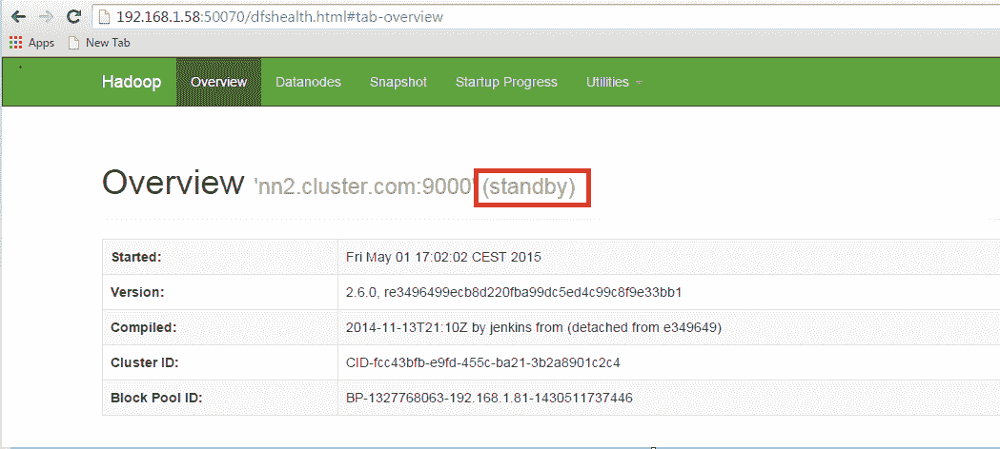](https://www.edureka.co/blog/wp-content/uploads/2015/06/standby.png)

<figcaption id="caption-attachment-26065" class="wp-caption-text">Standby NameNode.</figcaption>

</figure>

在活动 namenode 中，终止 namenode 守护进程，将备用名称节点更改为活动名称节点。

在活动 namenode 中输入 jps 并杀死守护进程。

**命令:** 须藤杀-9 < namenode 进程 ID >

<figure id="attachment_26066" aria-describedby="caption-attachment-26066" style="width: 660px" class="wp-caption alignnone">[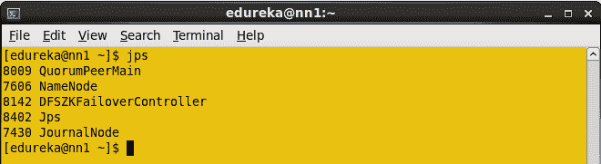](https://www.edureka.co/blog/wp-content/uploads/2015/06/JPS.png)

<figcaption id="caption-attachment-26066" class="wp-caption-text">Daemons Process ID.</figcaption>

</figure>

Namenode 进程 ID 是 7606，杀死 Namenode。

**命令** :须藤杀-9 7606

<figure id="attachment_26067" aria-describedby="caption-attachment-26067" style="width: 657px" class="wp-caption alignnone">[](https://www.edureka.co/blog/wp-content/uploads/2015/06/kill.png)

<figcaption id="caption-attachment-26067" class="wp-caption-text">Kill the Name Node process</figcaption>

</figure>

通过网络浏览器打开两个节点，检查状态。

<figure id="attachment_26068" aria-describedby="caption-attachment-26068" style="width: 1365px" class="wp-caption alignnone">[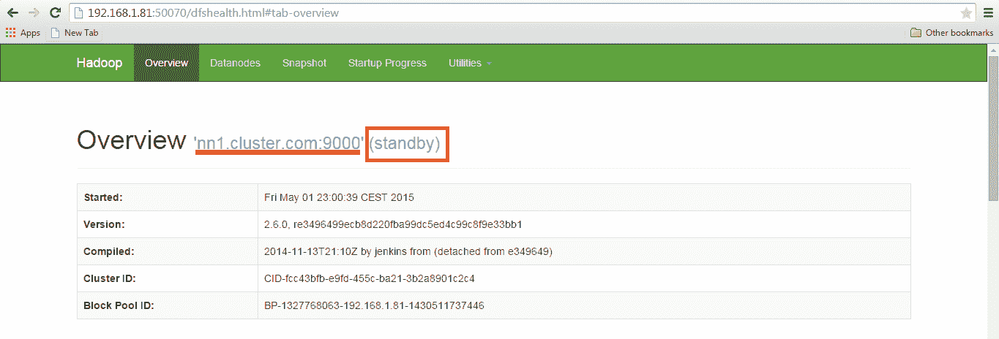](https://www.edureka.co/blog/wp-content/uploads/2015/06/afterS.png)

<figcaption id="caption-attachment-26068" class="wp-caption-text">Namenode details.</figcaption>

</figure>

[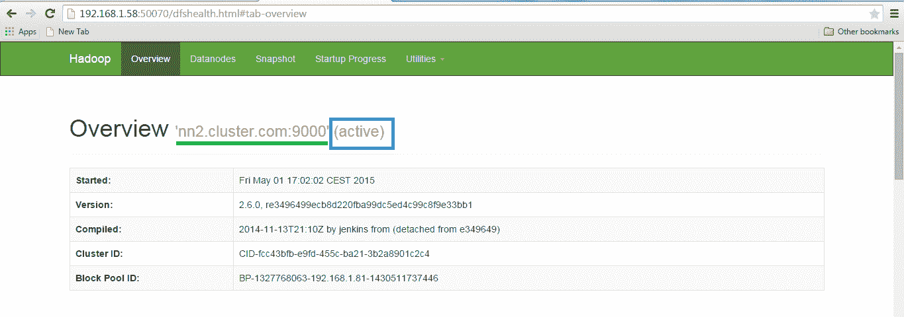](https://www.edureka.co/blog/wp-content/uploads/2015/06/new.png)

NameNode 状态。

祝贺您，您已经在 Hadoop 中成功设置了一个 HDFS 高可用性集群。

*现在您已经了解了 Hadoop 高可用性集群架构，请查看由 Edureka 提供的浦那* *大数据课程，edu reka 是一家值得信赖的在线学习公司，拥有遍布全球的 250，000 多名满意的学习者。Edureka 的[大数据架构师课程](https://www.edureka.co/masters-program/big-data-architect-training)使用零售、社交媒体、航空、旅游、金融领域的实时用例，帮助学习者成为 HDFS、Yarn、MapReduce、Pig、Hive、HBase、Oozie、Flume 和 Sqoop 领域的专家。*

*有问题吗？请在评论区提到它，我们会给你回复。*

窗户。_LQ_ =窗口。_ LQ _ | | { }；

lqQuizModal(window，document，{quizId:'XAIVp8 '，baseUrl:' https://quick . lead quickes . com/'，trigger:'exit'}，_ LQ _)；