# 9 个简单步骤的 Informatica 安装

> 原文：<https://www.edureka.co/blog/informatica-installation/>

Informatica 提供市场领先的数据集成平台。经过近 500，000 种平台和应用程序组合的测试，数据集成平台可以与尽可能多的不同标准、系统和应用程序进行互操作。这种不偏不倚的普遍观点使 Informatica 成为当今市场上独一无二的数据集成平台领导者和 [***Informatica 认证***](https://www.edureka.co/informatica) 最引人入胜的技能之一。在这篇博客中，我将帮助您安装和配置 Informatica 的服务。

让我们从在您的系统上设置 Oracle 数据库作为我们的主数据库开始。如果您已经安装并配置了 Oracle 数据库和 SQL Developer，您可以直接进行 [Informatica 安装。](#info)

## **Oracle 数据库安装**

要开始安装 Oracle，首先从下面的链接下载安装 zip 文件。

**第一步** : 从下面的链接下载Oracle Database Express Edition(我是在 Windows 64 位操作系统上安装的，所以我选择了 windows x64):

*   [www . Oracle . com/tech network/database/database-technologies/express-edition/downloads/index . html](http://www.oracle.com/technetwork/database/database-technologies/express-edition/downloads/index.html)

**第二步** :文件下载完成后，解压文件:

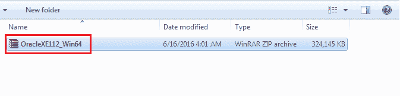

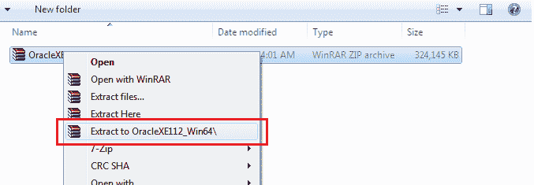

**第三步** :解压文件后你会得到 **DISK1** 文件夹，打开文件夹。

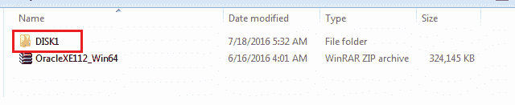

**第四步**:双击**设置**开始安装:

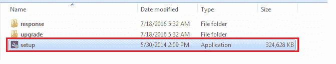

点击 **下一个** 。

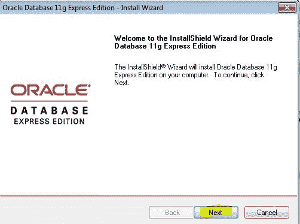

**第五步**:接受条款，点击 **下一步** 。

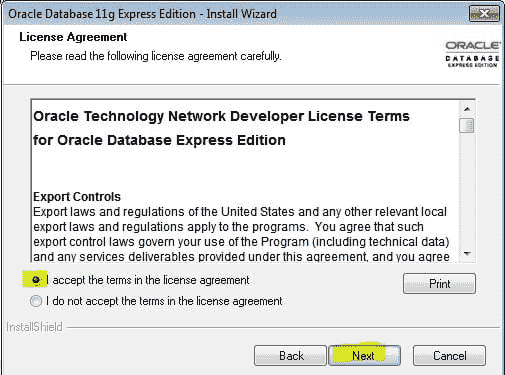

点击 **下一步。**

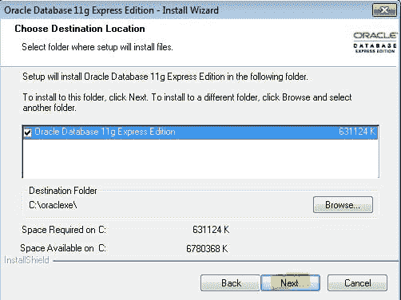

**第六步**:指定数据库密码。

*   输入密码:**Oracle 123**

**注意:** 如果您正在选择自己的密码，请做好记录，我们将再次需要此密码。

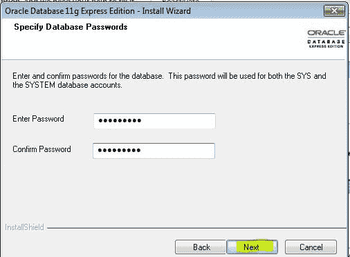

**注意:**Oracle 监听的默认端口是 **1521。**

点击 **安装** 。

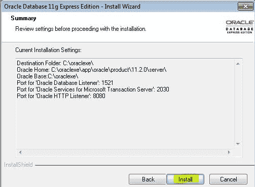

这可能需要一段时间。

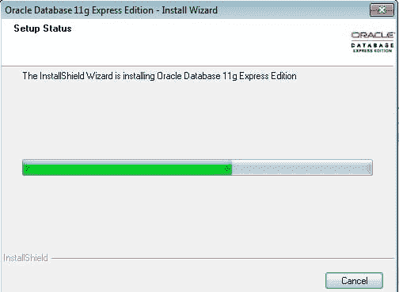

**第七步**:点击完成，完成安装。

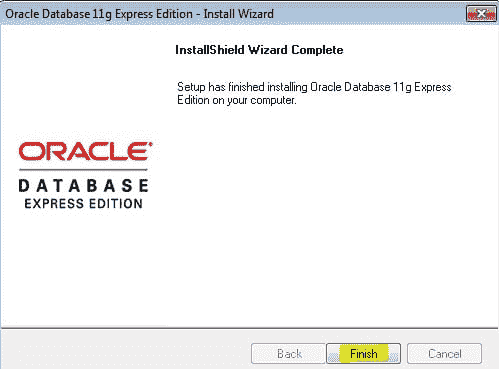

## **Oracle SQL Developer 的配置**

在开始安装 SQL developer 之前，请确保您已经启动了数据库。如果数据库没有启动，SQL developer 和数据库之间的连接将会失败。

启动数据库:进入**开始**->-**Oracle Database 11g Express Edition**->点击**启动数据库。**

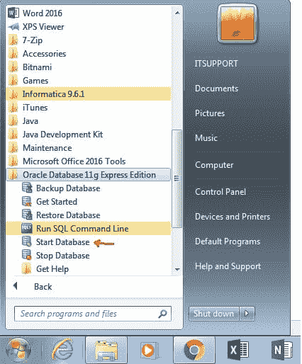

现在我们可以开始配置 Oracle SQL Developer:

**第一步**:从下载 Oracle SQL Developer zip 文件开始。我建议您使用 SQL Developer 3.2.20，因为更高版本要求您安装 Java 1.8 并手动设置路径。您可以从下面的链接下载该文件:

*   [http://www . Oracle . com/tech network/developer-tools/SQL-developer/downloads/index . html](http://www.oracle.com/technetwork/developer-tools/sql-developer/downloads/index.html)

**第二步**:下载完成后，解压下载的文件。

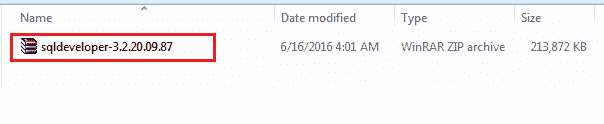

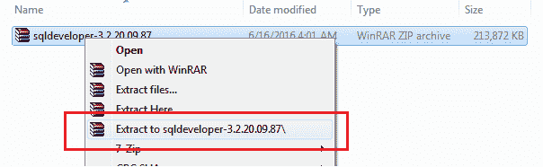

**第三步**:提取完成后，会得到 SQL developer**–3 . 2 . 20 . 09 . 87**文件夹。进入 sqldeveloper**–3 . 2 . 20 . 09 . 87**文件夹，双击点击 SQL developer 开始配置。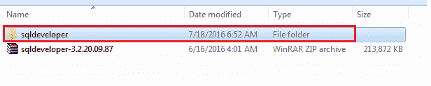

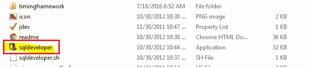

**注意:** 如果我们使用 SQL Developer 4.0 或更高版本，我们需要安装 JDK 1.8，并且我们必须手动配置完整路径，因此我们将建议使用 3.2 版本。

**第四步**:初始化完成后，你会进入下面的主屏幕。不要选择任何配置文件类型关联，直接单击取消。

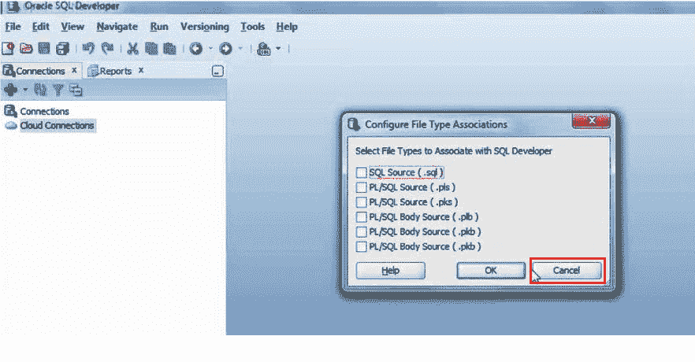

**第五步**:要建立连接，首先右键点击连接，然后点击**新建连接**。

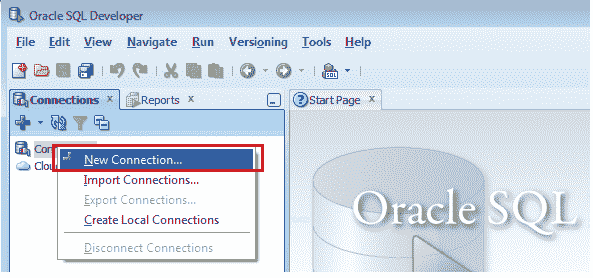

**第六步**:我们现在将连接到 Oracle 数据库。输入如下详细信息:

*   连接名称: **ORACLEXE**
*   用户名:**sys**
*   密码: **oracle123** (这里我们要指定和数据库安装时设置的相同的密码)
*   角色: **SYSDBA**

点击 **保存**->--**测试**->--**连接**-

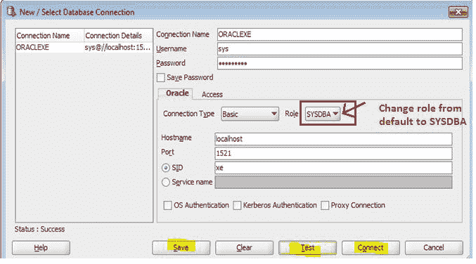

单击“连接”后，我们可以看到该连接已添加到列表中。

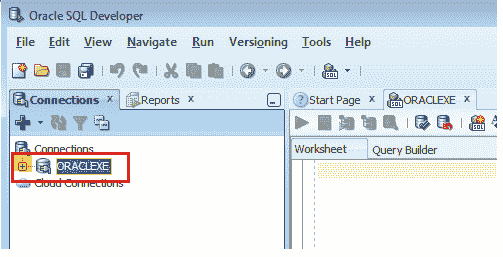

**第 7 步**:现在点击 **ORACLEXE** 旁边的加号图标，得到下面的画面:

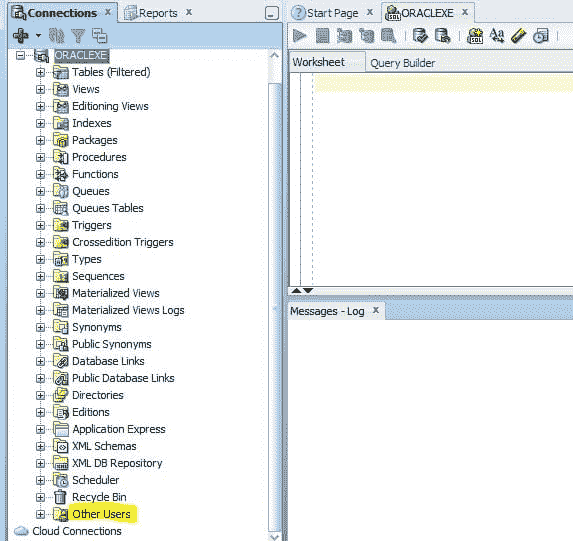

**第八步**:现在我们要创建 2 个用户。

1.  INFA_DOM(为域名)
2.  INFA 代表(存储库)

右键单击其他用户创建用户。

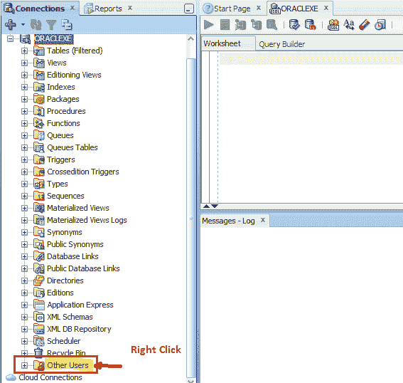

点击 **创建用户** 。

**第 9 步**:我们现在将为域创建用户。输入以下用户详细信息:

*   用户名:**inb _ DOM**
*   密码: **INFA_DOM**
*   默认表空间: **用户**
*   临时表空间: **临时**

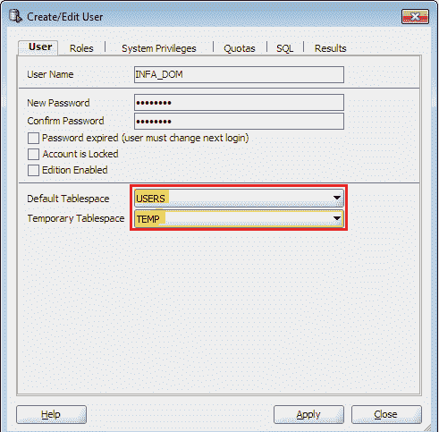

**注意**:指定所有细节后不要点击应用

**第十步:**点击角色选项卡，定义用户的角色。

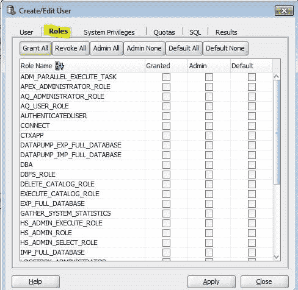

**第十一步**:我们要为分配域用户完全权限

*   DBA
*   连接
*   资源

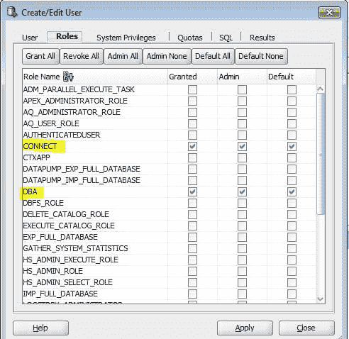

向下滚动以查找资源角色:

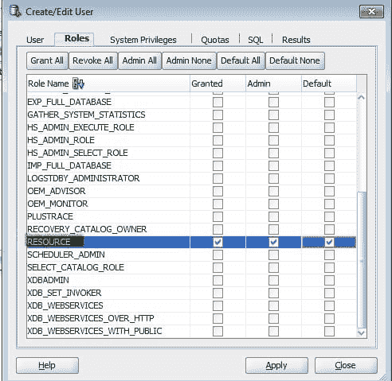

**第 12 步**:现在点击 Quotas 选项卡分配表空间区域:

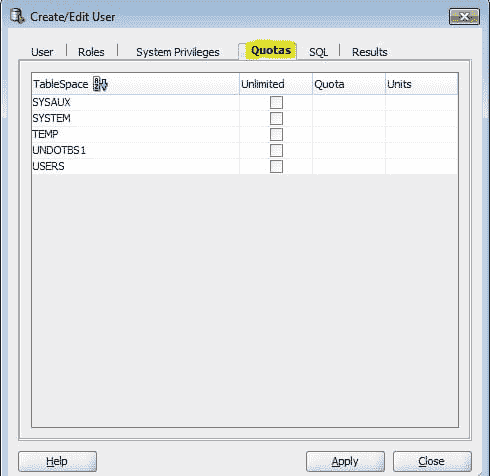

**第十三步**:选择用户，分配无限选项。点击应用

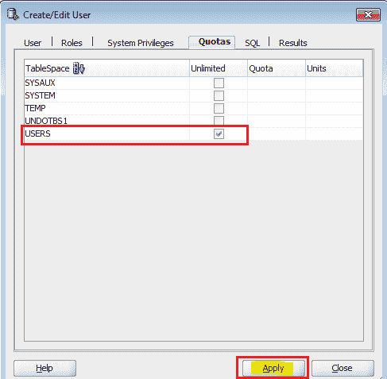

点击 **关闭** 。

用户 **INFA_DOM** 已成功创建。

**第 14 步**:现在我们将点击 Connection 和 New Connection 连接到域用户。

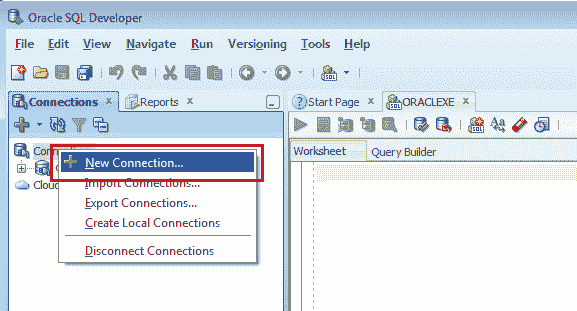

**第十五步**:输入以下用户详细信息:

*   连接名称: **INFA_DOM**
*   用户名:**INFA _ DOM**
*   密码: **INFA_DOM**
*   连接类型: **基本**
*   角色: **默认**

点击 **保存**->--**测试**->--**连接**-

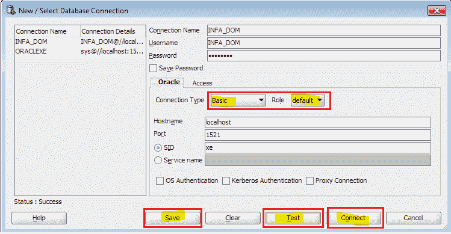

单击“连接”后，我们可以看到用户已添加到列表中

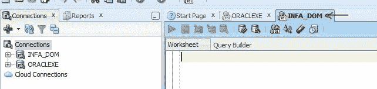

**步骤 16** :我们现在将以类似的方式添加存储库用户。点击其他用户并在 **ORACLEXE 下添加用户。**

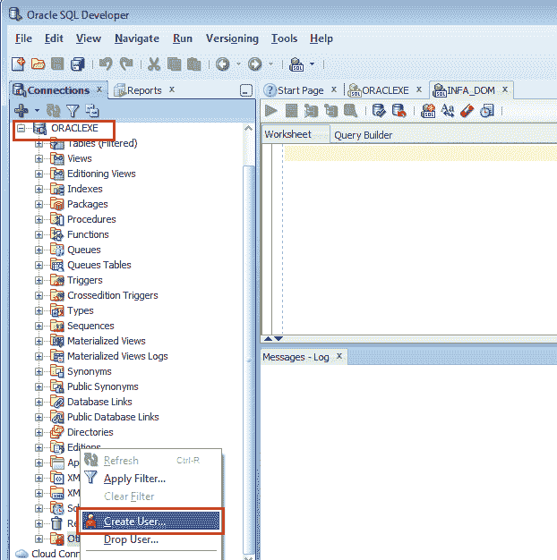

**第 17 步**:输入仓库用户的以下详细信息:

用户名: **INFA 代表**

密码:**INFA _ 代表**

默认表空间:**用户**

临时表空间:**TEMP**

**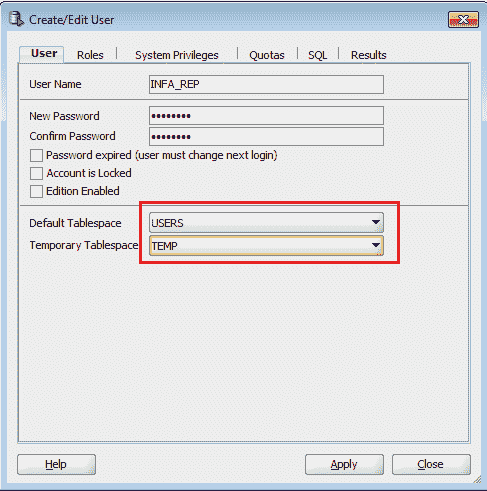**

**第 18 步**:作为域用户， 为存储库用户提供

*   DBA
*   连接
*   资源

**第 19 步**:点击配额选项卡，为用户选择无限制选项，如下图:

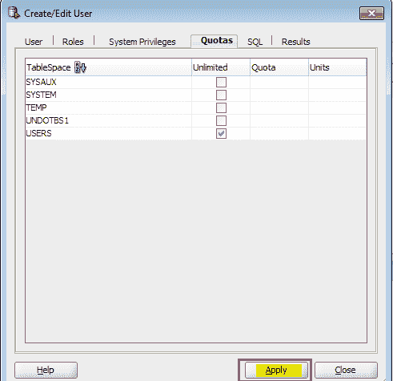

点击 **关闭。**

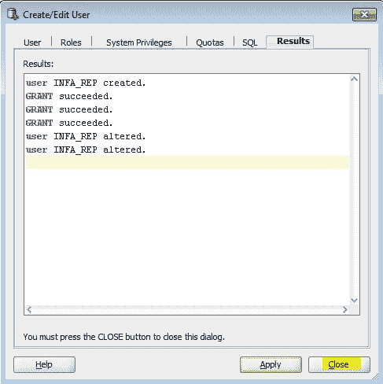

用户**【INFA _ REO】**已成功创建。

**第 20 步**:现在我们将点击 Connection 和 New Connection 来连接到存储库用户。

**步骤 21** :输入以下用户详细信息:

*   连接名称:INFA 代表
*   用户名:INFA 代表
*   密码:INFA 代表
*   连接类型:基本角色:默认

点击 **保存**->--**测试**->--**连接**-

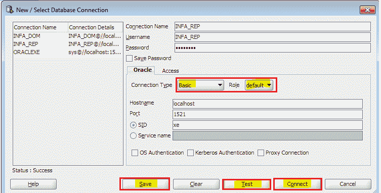

现在你可以看到新用户**INFA _ 代表** 已经创建并成功连接。

现在我们已经完成了 Oracle 和 SQL 的安装，现在我们必须下载 Informatica 工具并安装它们。

## **信息化安装**

Informatica 安装将遵循以下步骤:

1.  [下载安装包。](#step1)
2.  [拆包安装。](#step2)
3.  [Informatica PowerCenter 安装前检查。](#step3)
4.  [安装 Informatica PowerCenter。](#step4)
5.  [域配置。](#step5)
6.  [配置存储库服务。](#step6)
7.  [配置集成服务。](#step7)
8.  [客户端安装。](#step8)
9.  [PowerCenter Designer 配置。](#step9)

现在开始安装过程:

## **步骤 1:下载安装包**

从 Informatica 安装开始，我们先下载 oracle 提供的 Informatica PoweCenter 的免费版本。

**步骤 1.1:** 使用下面的链接 下载 Informatica 9.6.1

*   [【https://edelivery.oracle.com/】](https://edelivery.oracle.com/)

**步骤 1.2:** 登录您的账户，如果您没有 Oracle 账户使用 **新用户** 选项创建账户。

<figure id="attachment_38455" aria-describedby="caption-attachment-38455" style="width: 600px" class="wp-caption aligncenter">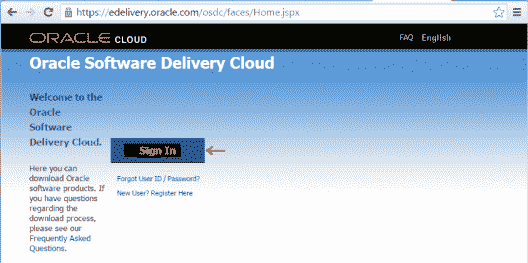

<figcaption id="caption-attachment-38455" class="wp-caption-text">**                                           Fig: Oracle Home page**</figcaption>

</figure>

<figure id="attachment_38456" aria-describedby="caption-attachment-38456" style="width: 600px" class="wp-caption aligncenter">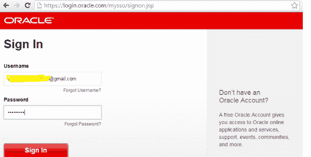

<figcaption id="caption-attachment-38456" class="wp-caption-text">**                                          Fig: Oracle Sign In page**</figcaption>

</figure>

**步骤 1.3:在搜索框中输入****power center**。

**步骤 1.4:** 选择**Oracle Informatica power center 和 PowerConnect 适配器**。

**步骤 1.5:** 选择平台(我在一个 **Windows 64** 位 OS 上安装，所以我选择了 Windows 64)。

<figure id="attachment_38457" aria-describedby="caption-attachment-38457" style="width: 600px" class="wp-caption aligncenter">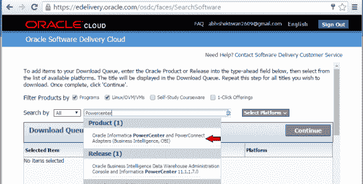

<figcaption id="caption-attachment-38457" class="wp-caption-text">**                                 Fig: Product Selection in Oracle Cloud**</figcaption>

</figure>

**步骤 1.6:** 点击**继续。**

<figure id="attachment_38458" aria-describedby="caption-attachment-38458" style="width: 750px" class="wp-caption aligncenter">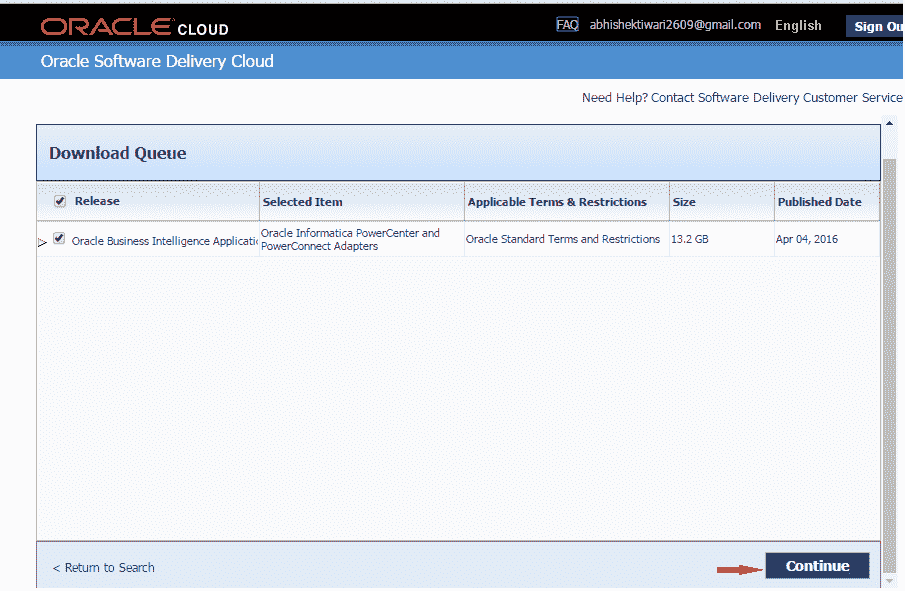

<figcaption id="caption-attachment-38458" class="wp-caption-text">**                                             Fig: Product Selection in Oracle Cloud**</figcaption>

</figure>

**步骤 1.7:** 接受甲骨文许可。

<figure id="attachment_38459" aria-describedby="caption-attachment-38459" style="width: 600px" class="wp-caption aligncenter">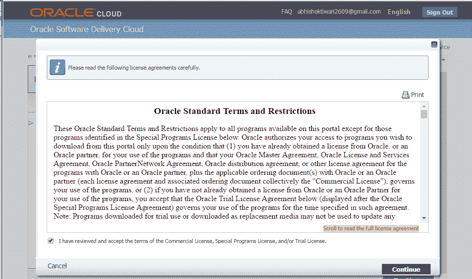

<figcaption id="caption-attachment-38459" class="wp-caption-text">**                                  Fig: Product Selection in Oracle Cloud**</figcaption>

</figure>

**步骤 1.8:** 现在如下图截图，你要从列表中选择最后四个文件。

**步骤 1.9:** 选择文件后点击 **下载**。

<figure id="attachment_38460" aria-describedby="caption-attachment-38460" style="width: 600px" class="wp-caption aligncenter">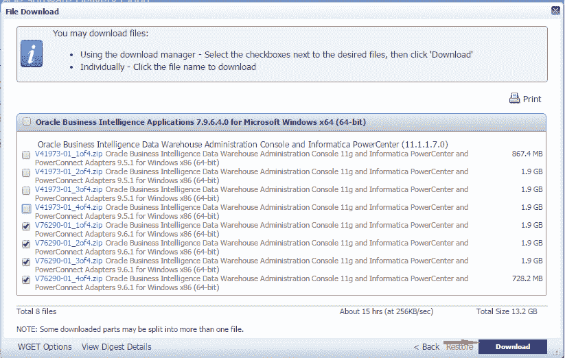

<figcaption id="caption-attachment-38460" class="wp-caption-text">**                                         Fig: Setting Download Queue**</figcaption>

</figure>

**步骤 1.10:** 你会得到一个弹出窗口，要求你下载 **安装程序。**

<figure id="attachment_38461" aria-describedby="caption-attachment-38461" style="width: 600px" class="wp-caption aligncenter">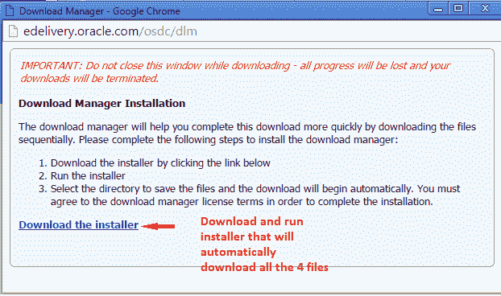

<figcaption id="caption-attachment-38461" class="wp-caption-text">**                  Fig: Click on the Download manager to download the required files**</figcaption>

</figure>

**步骤 1.11:** 下载安装程序并安装到您的系统中。一旦安装程序启动，它将自动下载指定目录中的所有四个文件。

由于现在已经下载了所需的文件，我们将通过解压下载的文件继续进行 Informatica 安装。

## **第二步:打开安装包**

**注意**:使用 WinRAR 提取文件，因为任何其他文件浏览器在提取**DAC _ win _ 11g _ infa _ win _ 64 bit _ 961**时可能会出错

**步骤 2.1:** 现在将四个文件全部逐一提取出来。

**步骤 2.2:** 使用下面截图中建议的选项将其提取到同一个目录中。

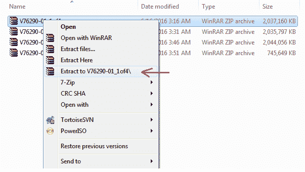

<figure id="attachment_38463" aria-describedby="caption-attachment-38463" style="width: 313px" class="wp-caption aligncenter">

<figcaption id="caption-attachment-38463" class="wp-caption-text">**        Fig: Extracting the downloaded files**</figcaption>

</figure>

**步骤 2.3:** 提取后会得到四个文件:

*   V76290-01_1of4。

*   V76290-01_2of4。

*   V76290-01_3of4。

*   V76290-01_4of4。

<figure id="attachment_38464" aria-describedby="caption-attachment-38464" style="width: 749px" class="wp-caption aligncenter">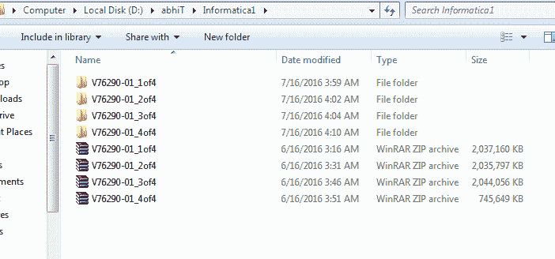

<figcaption id="caption-attachment-38464" class="wp-caption-text">**                                                              Fig: Extracted files**</figcaption>

</figure>

**步骤 2.4:** 现在进入第四个文件 **V76290-01_4of4** ，提取名为**DAC _ win _ 11g _ infa _ win _ 64 bit _ 961**的文件。

<figure id="attachment_38465" aria-describedby="caption-attachment-38465" style="width: 731px" class="wp-caption aligncenter">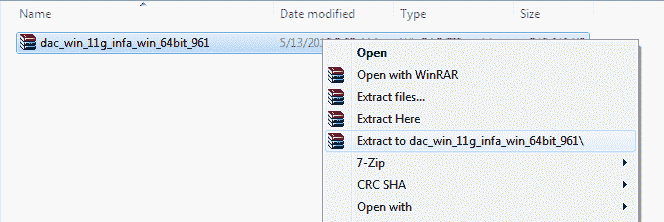

<figcaption id="caption-attachment-38465" class="wp-caption-text">**                                            Fig: File located in V76290-01_4of4**</figcaption>

</figure>

**步骤 2.5:** 提取该文件时，需要按照下面截图的提示，逐一输入 4 个提取文件的路径:

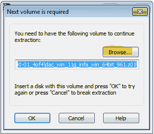

**第 2.6 步:** 当出现上述窗口时，浏览到第一个解压文件的位置，点击确定，如下提示:

<figure id="attachment_38467" aria-describedby="caption-attachment-38467" style="width: 600px" class="wp-caption aligncenter">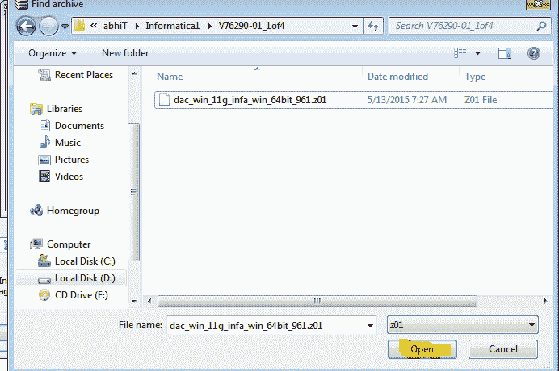

<figcaption id="caption-attachment-38467" class="wp-caption-text">**                                       Fig: Specifying Extraction location**</figcaption>

</figure>

**步骤 2.7:** 以同样的方式浏览并提取第二、第三和第四个文件。

<figure id="attachment_38468" aria-describedby="caption-attachment-38468" style="width: 367px" class="wp-caption aligncenter">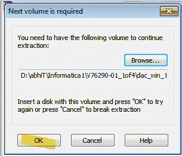

<figcaption id="caption-attachment-38468" class="wp-caption-text">**   Fig: Selecting location to extract the remaining files**</figcaption>

</figure>

**步骤 2.8:** 现在进入解压文件**DAC _ win _ 11g _ infa _ win _ 64 bit _ 961**并解压 **服务器** 和 **客户端** 安装程序，使用选项如下截图所示。

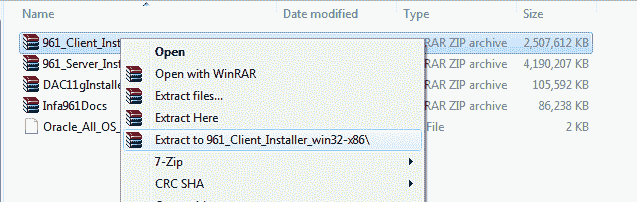

<figure id="attachment_38469" aria-describedby="caption-attachment-38469" style="width: 600px" class="wp-caption aligncenter">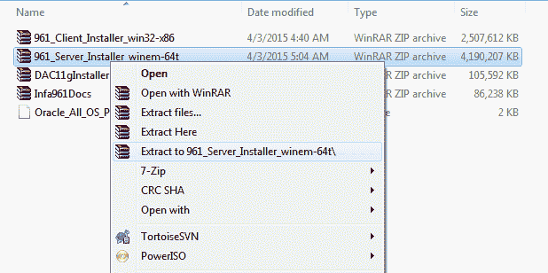

<figcaption id="caption-attachment-38469" class="wp-caption-text">**                           Fig: Extracting Server and client installer**</figcaption>

</figure>

## **第三步:Informatica PowerCenter 安装前检查。**

从这一点开始，Informatica 安装过程开始，但是在我们开始实际过程之前，我们需要检查当前系统是否满足 Informatica 安装的最低要求。

**步骤 3.1:** 进入目录**961 _ Server _ Installer _ winem-64t**双击 **install.bat** 文件开始安装 **。**

<figure id="attachment_38471" aria-describedby="caption-attachment-38471" style="width: 600px" class="wp-caption aligncenter">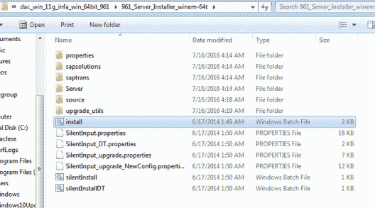

<figcaption id="caption-attachment-38471" class="wp-caption-text">**                                 Fig: Selecting Server Installation file**</figcaption>

</figure>

**步骤 3.2:** 如下截图。

<figure id="attachment_38472" aria-describedby="caption-attachment-38472" style="width: 600px" class="wp-caption aligncenter">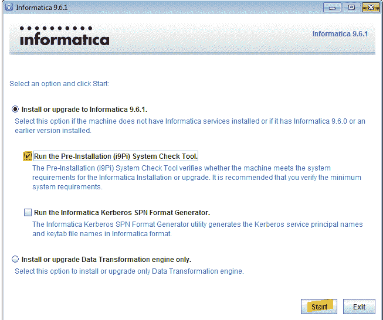

<figcaption id="caption-attachment-38472" class="wp-caption-text">**                     Fig: Selecting to launch pre-installation system check tool**</figcaption>

</figure>

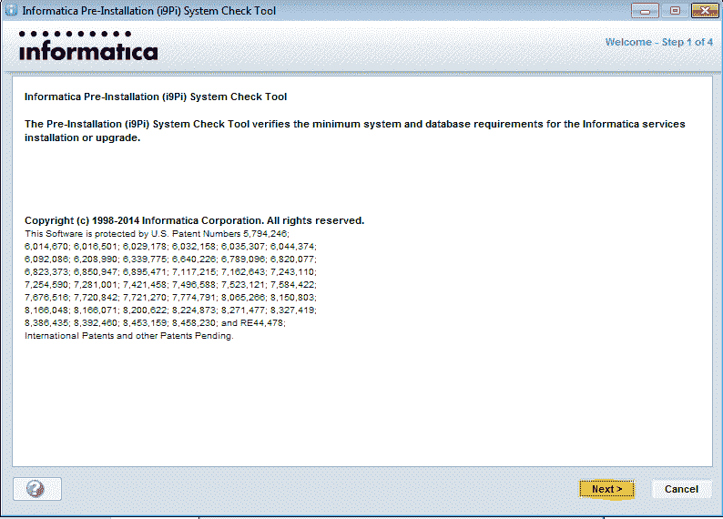

点击**下一步。**

<figure id="attachment_38474" aria-describedby="caption-attachment-38474" style="width: 600px" class="wp-caption aligncenter">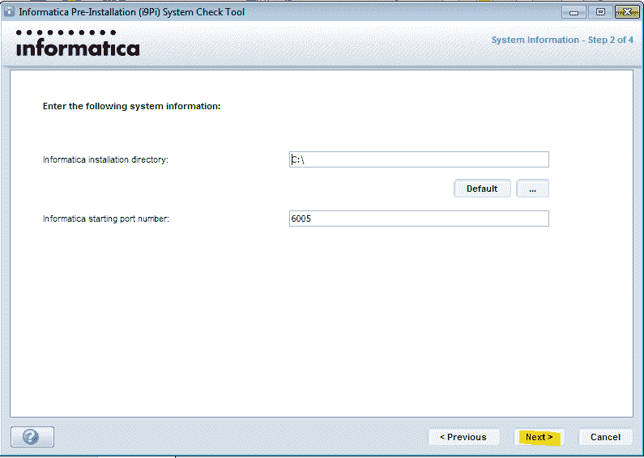

<figcaption id="caption-attachment-38474" class="wp-caption-text">**                                Fig: Selecting Installation Directory**</figcaption>

</figure>

**步骤 3.3:** 进入**域配置**如下:

*   主机名:EDUREKA23(这是我的机器的主机名)
*   数据库密码:INFA_DOM
*   数据库用户 ID : INFA_DOM
*   数据库类型:Oracle

要连接到远程主机，你必须从 Informatica 购买许可证，每年花费几千美元，这取决于某些参数，如用户数量、操作系统、处理器数量等。

<figure id="attachment_38475" aria-describedby="caption-attachment-38475" style="width: 793px" class="wp-caption aligncenter">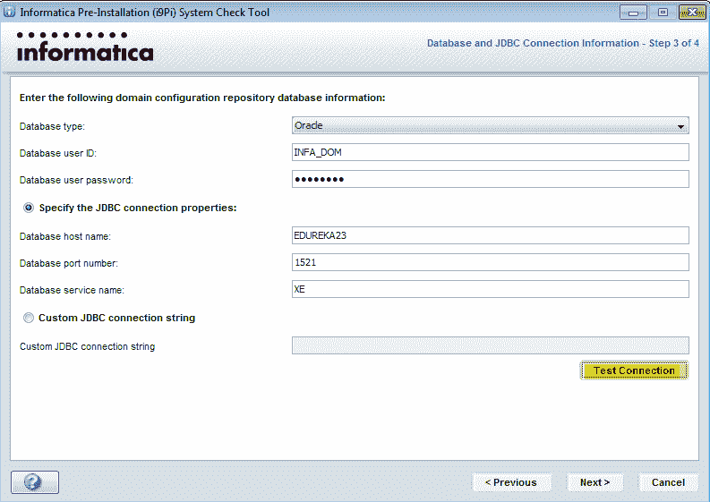

<figcaption id="caption-attachment-38475" class="wp-caption-text">**                                         Fig: Domain Configuration repository database information**</figcaption>

</figure>

*   要找到您机器的主机名，请转到 oracle 安装目录并打开 **tnsname.ora** 文件，该文件位于**C:Oracle xepporacleproduct . 2.0 serveretworkadamin**path

<figure id="attachment_38476" aria-describedby="caption-attachment-38476" style="width: 927px" class="wp-caption aligncenter">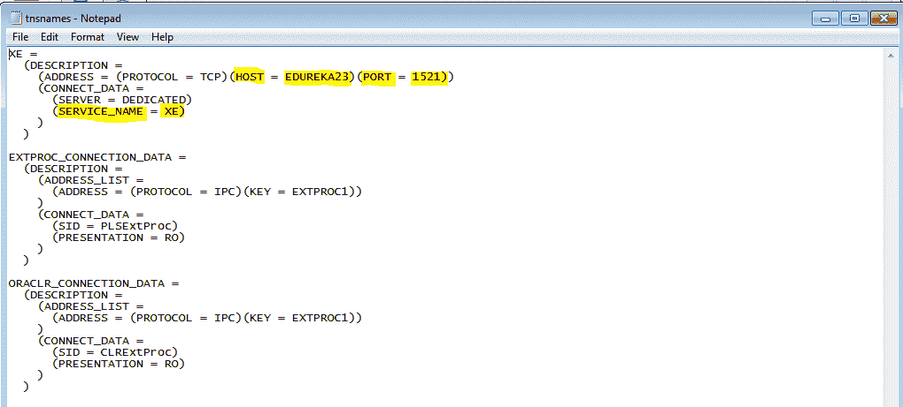

<figcaption id="caption-attachment-38476" class="wp-caption-text">**                                              Fig: Host name and Port number of current Host machine**</figcaption>

</figure>

**步骤 3.4:** 点击 **测试连接** 和 **接下来。**

<figure id="attachment_38477" aria-describedby="caption-attachment-38477" style="width: 600px" class="wp-caption aligncenter">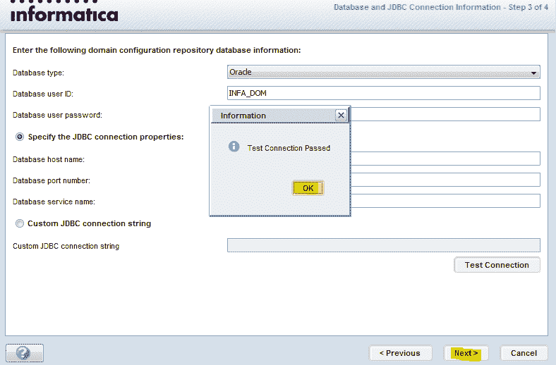

<figcaption id="caption-attachment-38477" class="wp-caption-text">**                                                Fig: Domain Connection test**</figcaption>

</figure>

**步骤 3.5:** 点击 **完成。**

<figure id="attachment_38478" aria-describedby="caption-attachment-38478" style="width: 600px" class="wp-caption aligncenter">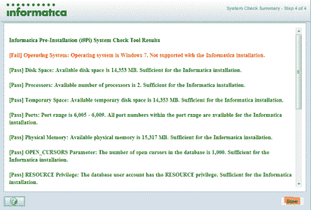

<figcaption id="caption-attachment-38478" class="wp-caption-text">**                          Fig: Informatica Pre-Installation check results **</figcaption>

</figure>

## **步骤 4:安装 Informatica PowerCenter**

现在我们已经验证了当前系统满足最低要求，我们将继续进行实际的 Informatica 安装。

**步骤 4.1:** 现在再次转到解压后的目录**961 _ Server _ Installer _ winem-64t**双击 **install.bat** 文件。

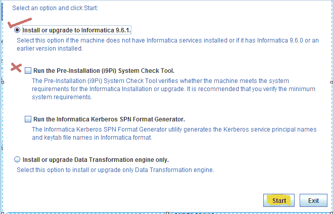

**步骤 4.2:** 遵循以下步骤。

<figure id="attachment_38480" aria-describedby="caption-attachment-38480" style="width: 600px" class="wp-caption aligncenter">

<figcaption id="caption-attachment-38480" class="wp-caption-text">**                                           Fig: Click on Install or upgrade Option**</figcaption>

</figure>

点击**下一步。**

<figure id="attachment_38481" aria-describedby="caption-attachment-38481" style="width: 600px" class="wp-caption aligncenter">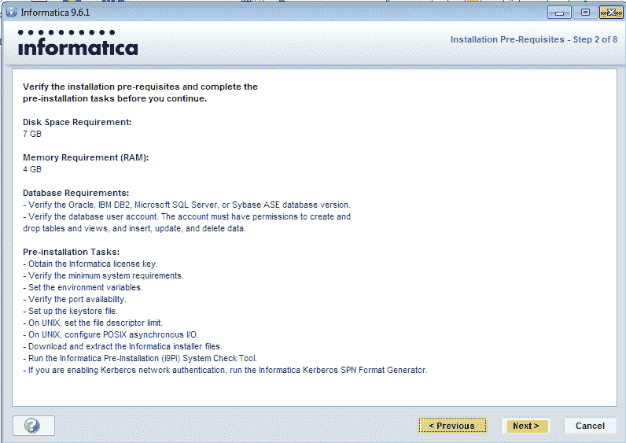

<figcaption id="caption-attachment-38481" class="wp-caption-text">**                                                 Fig: System Requirements**</figcaption>

</figure>

**第 4.3 步:** 现在在下面的窗口中浏览 **下的产品密钥 v 76290-01 _ 4 of 4 DAC _ win _ 11g _ infa _ win _ 64 bit _ 961。**

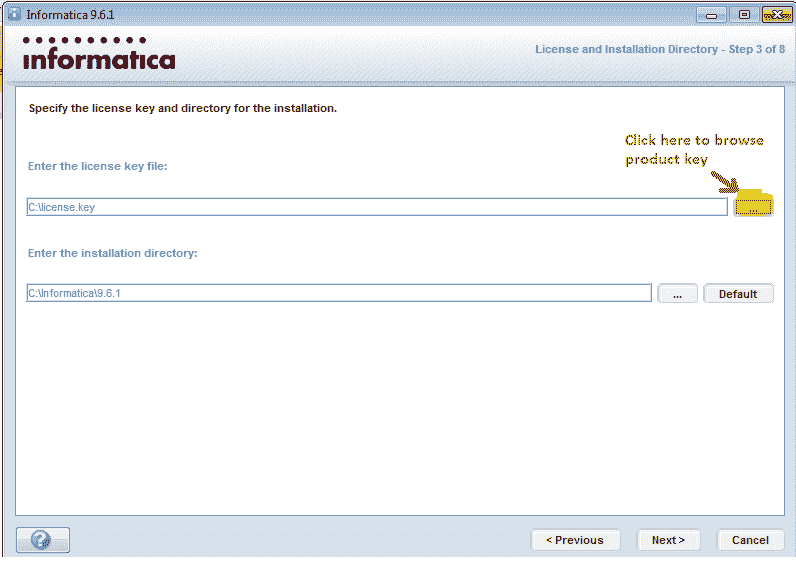

<figure id="attachment_38483" aria-describedby="caption-attachment-38483" style="width: 600px" class="wp-caption aligncenter">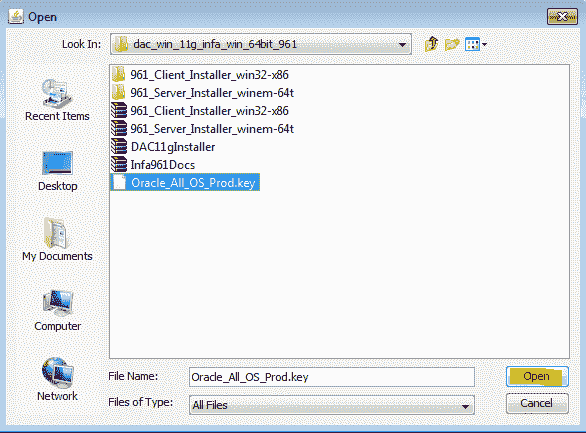

<figcaption id="caption-attachment-38483" class="wp-caption-text">**                                             Fig: Select Oracle_All_OS_Prod.key**</figcaption>

</figure>

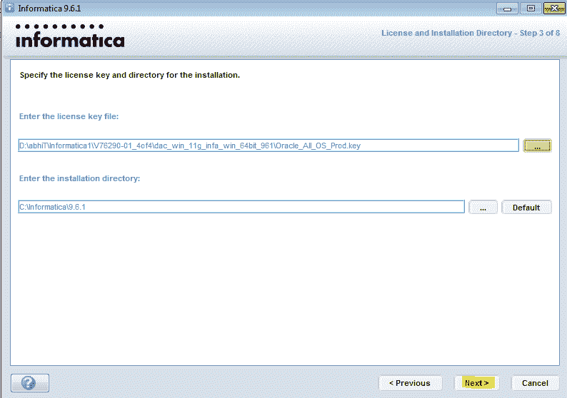

点击**下一步。**

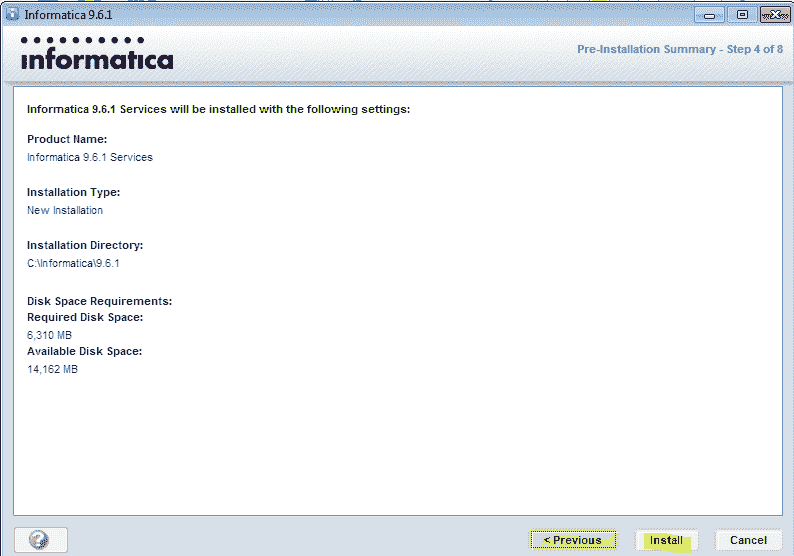

点击**安装。**

*   安装这个软件需要一点时间。

## **第五步:域配置**

现在我们已经完成了 Informatica 的安装，我们开始配置过程。需要配置的第一个组件是操作域。

**步骤 5.1:** 取消勾选“为 Informatica 管理员启用 HTTPS”，点击下一步。

<figure id="attachment_38489" aria-describedby="caption-attachment-38489" style="width: 600px" class="wp-caption aligncenter">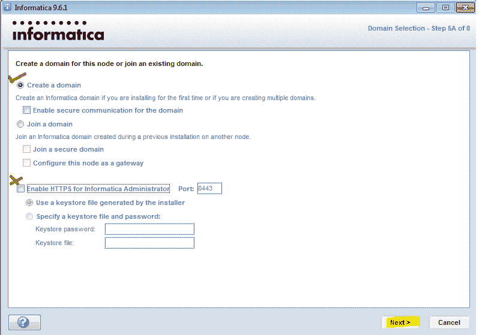

<figcaption id="caption-attachment-38489" class="wp-caption-text">**                                              Fig: Select Create a domain option**</figcaption>

</figure>

**步骤 5.2:** 进入域配置如下:

*   数据库类型:Oracle
*   数据库用户 ID : INFA_DOM
*   用户密码:INFA_DOM
*   其余参数都是默认的。

**步骤 5.3:** 点击 **测试连接** 点击 **下一步。**

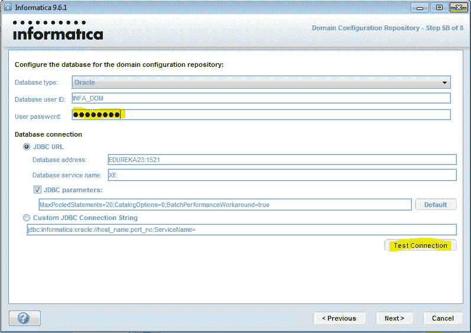

<figure id="attachment_38492" aria-describedby="caption-attachment-38492" style="width: 600px" class="wp-caption aligncenter">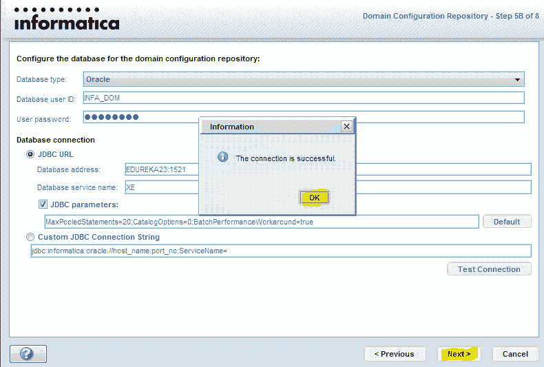

<figcaption id="caption-attachment-38492" class="wp-caption-text">**                                                   Fig: Domain Connection test**</figcaption>

</figure>

您已经成功测试了域连接。

**第 5.4 步:** 输入加密密钥信息(我是选 Edu@1122，可以选一样):

*   关键词:Edu@1122

点击 **下一步**和**确定。**

<figure id="attachment_38494" aria-describedby="caption-attachment-38494" style="width: 600px" class="wp-caption aligncenter">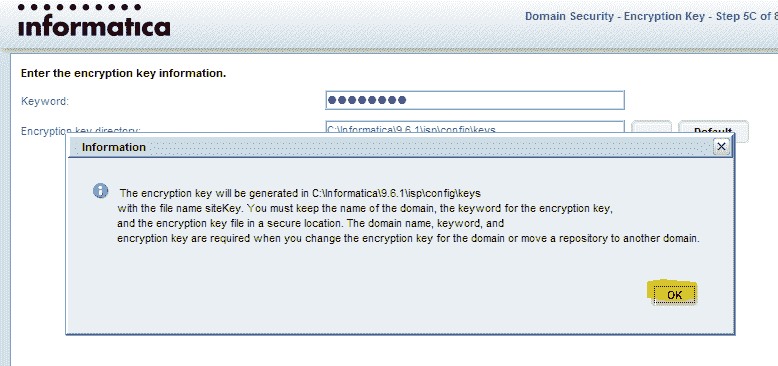

<figcaption id="caption-attachment-38494" class="wp-caption-text">**                                           Fig: Specifying encryption key to be used **</figcaption>

</figure>

**步骤 5.5:** 输入如下关于信息领域的详细信息:

*   域名用户名:管理员
*   域密码:管理员

在 **上勾选 标记，显示高级端口配置页面，在** 上点击 **下一步。**

<figure id="attachment_38495" aria-describedby="caption-attachment-38495" style="width: 793px" class="wp-caption aligncenter">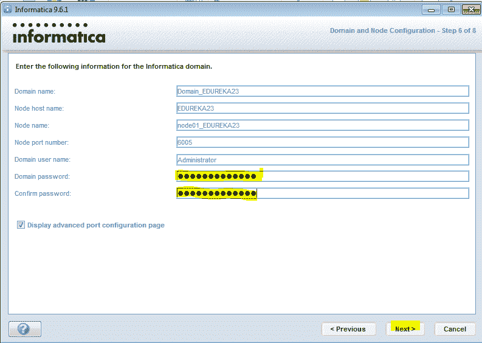

<figcaption id="caption-attachment-38495" class="wp-caption-text">**                                                                            Fig: Informatica Domain details **</figcaption>

</figure>

点击 **下一步。**

<figure id="attachment_38496" aria-describedby="caption-attachment-38496" style="width: 600px" class="wp-caption aligncenter">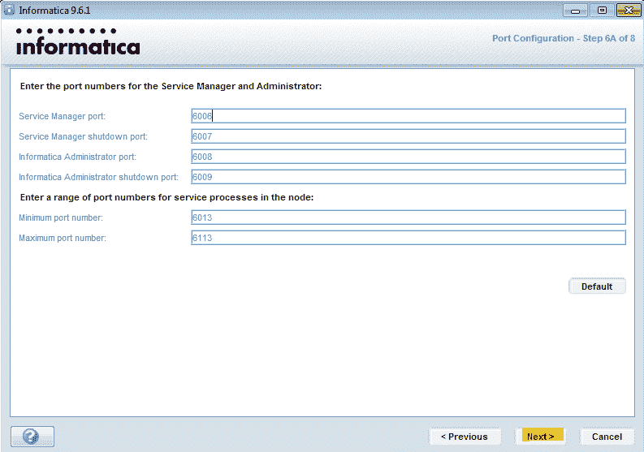

<figcaption id="caption-attachment-38496" class="wp-caption-text">**                                                   Fig: Informatica port details **</figcaption>

</figure>

*   配置设置需要时间。

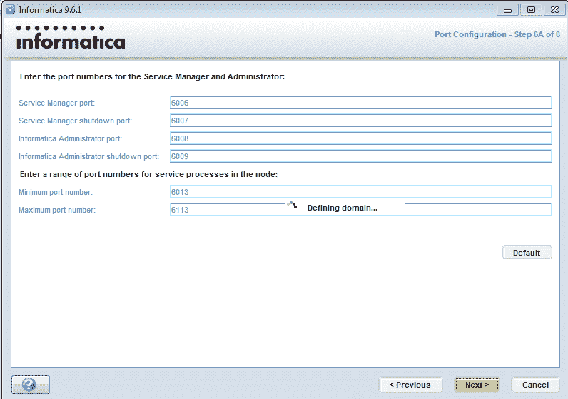

**步骤 5.6:取消勾选** 在不同的用户账户下运行 Informatica，点击 **下一步。**

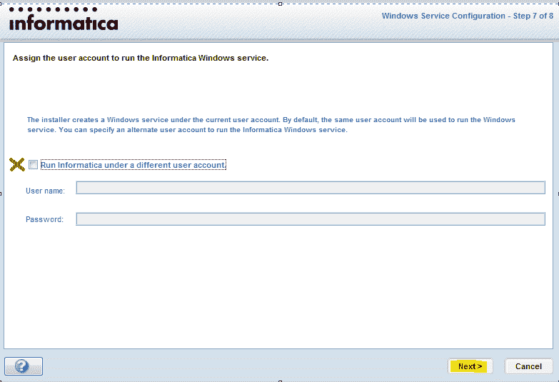

**步骤 5.7** :点击 **Informatica 管理员主页**链接。

<figure id="attachment_38500" aria-describedby="caption-attachment-38500" style="width: 600px" class="wp-caption aligncenter">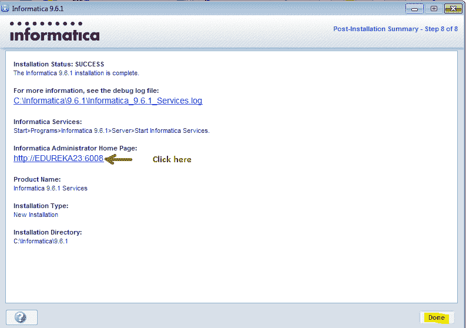

<figcaption id="caption-attachment-38500" class="wp-caption-text">**                                     Fig: Launching Informatica Administrator home page **</figcaption>

</figure>

## **第六步:配置存储库服务**

一旦配置了操作域，我们需要配置将从客户端应用程序连接到存储库的存储库服务。

**步骤 6.1:** 点击以上链接后，浏览器中会打开 **Informatica 管理员控制台** 。

*   用户名:管理员
*   密码:管理员

<figure id="attachment_38501" aria-describedby="caption-attachment-38501" style="width: 944px" class="wp-caption aligncenter">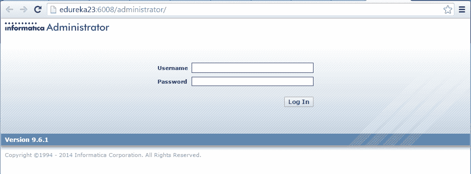

<figcaption id="caption-attachment-38501" class="wp-caption-text">**                                                                 Fig: Informatica Administrator login page**</figcaption>

</figure>

<figure id="attachment_38502" aria-describedby="caption-attachment-38502" style="width: 834px" class="wp-caption aligncenter">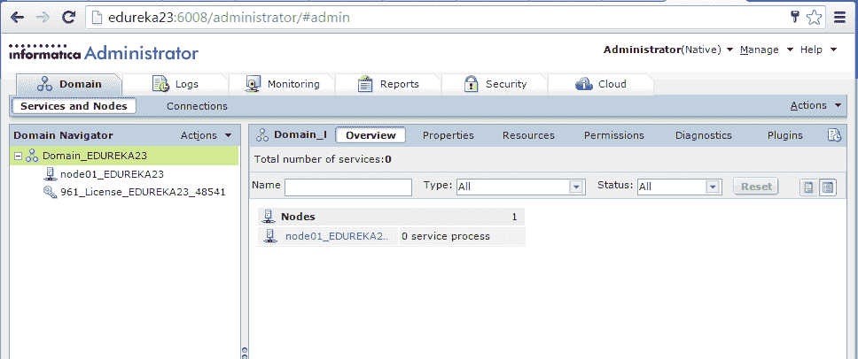

<figcaption id="caption-attachment-38502" class="wp-caption-text">**                                                                      Fig :Informatica Administrator console **</figcaption>

</figure>

**步骤 6.2:** 创建存储库服务:

*   **点击操作- >新建- > PowerCenter 存储库服务。**

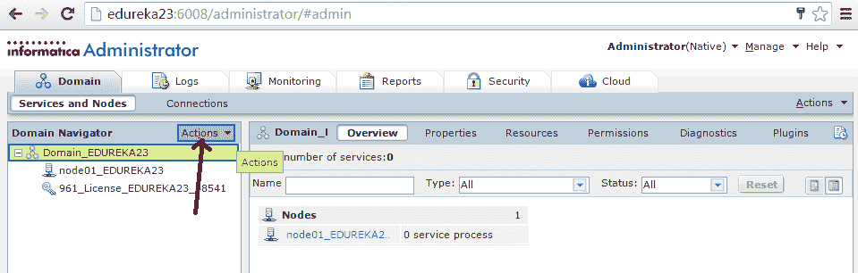

<figure id="attachment_38504" aria-describedby="caption-attachment-38504" style="width: 927px" class="wp-caption aligncenter">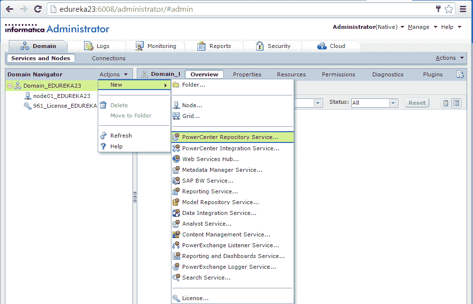

<figcaption id="caption-attachment-38504" class="wp-caption-text">**  Fig : Creating New Repository**</figcaption>

</figure>

**步骤 6.3:** 输入以下仓库服务详情:

*   名称:Repsvc_Edureka
*   从 下拉列表中选择 **许可证** 和 **节点** ，点击 **下一步。**

<figure id="attachment_38505" aria-describedby="caption-attachment-38505" style="width: 600px" class="wp-caption aligncenter">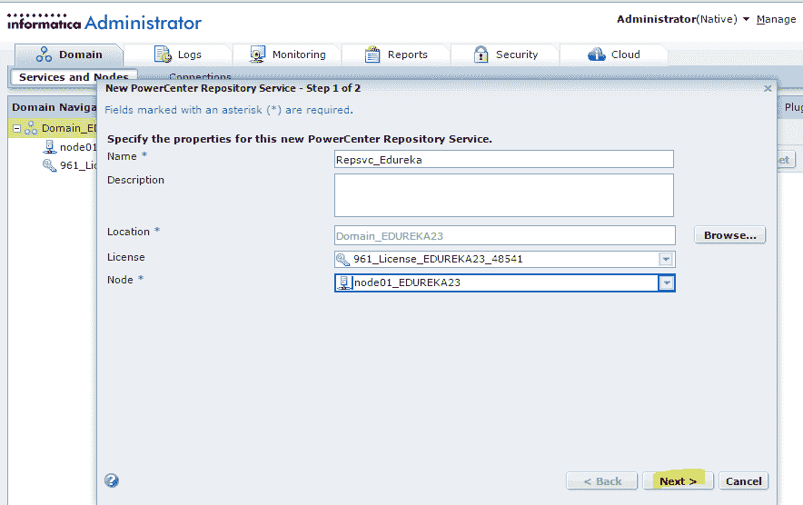

<figcaption id="caption-attachment-38505" class="wp-caption-text">**                                                       Fig : Specifying repository details **</figcaption>

</figure>

点击 **下一步。**

**步骤 6.4:** 为数据库属性输入如下详细信息:

*   数据库类型:Oracle
*   用户名:INFA 代表
*   密码:INFA 代表
*   连接字符串:XE

<figure id="attachment_38506" aria-describedby="caption-attachment-38506" style="width: 600px" class="wp-caption aligncenter">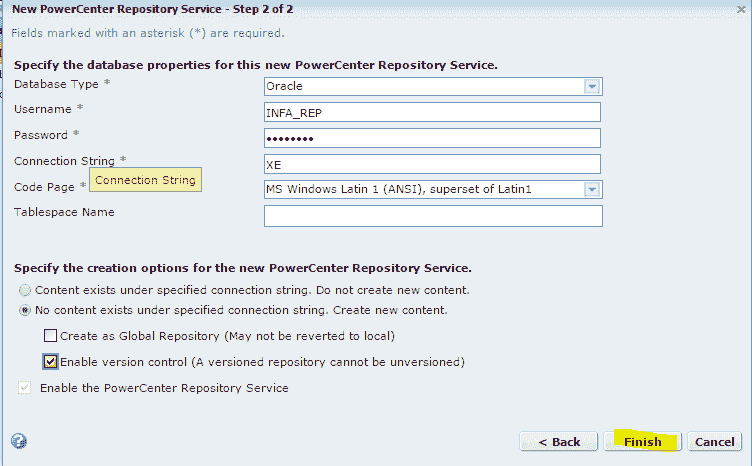

<figcaption id="caption-attachment-38506" class="wp-caption-text">**                                                     Fig : Database properties **</figcaption>

</figure>

点击**完成。**

**步骤 6.5:** 现在将运行模式从独占改为 **正常。**

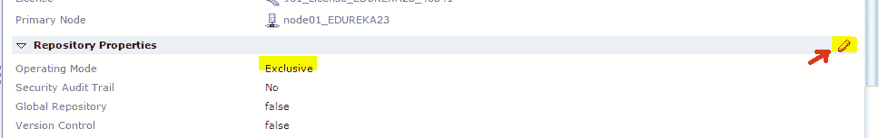

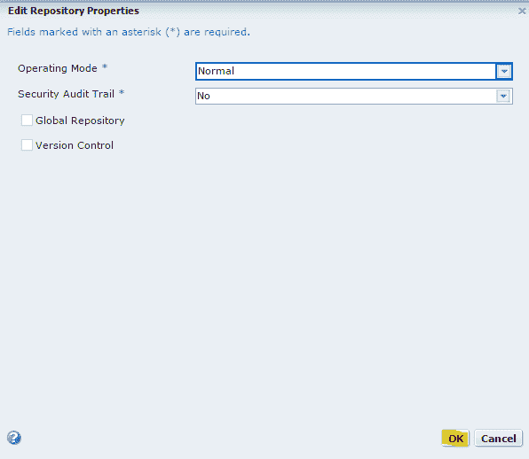

<figure id="attachment_38509" aria-describedby="caption-attachment-38509" style="width: 600px" class="wp-caption aligncenter">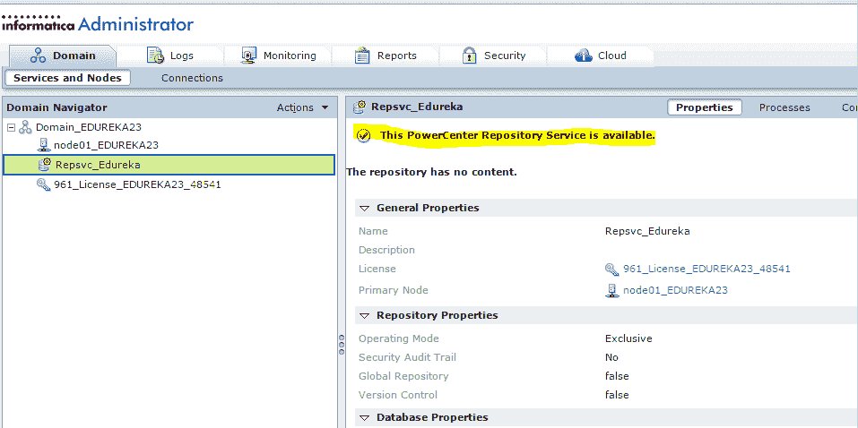

<figcaption id="caption-attachment-38509" class="wp-caption-text">**                                            Fig : Changing Operating mode of Repository**</figcaption>

</figure>

现在我们已经成功地使存储库可用于进一步的操作。

## **第七步:配置集成服务**

作为存储库服务配置的一部分，我们还需要配置集成服务，它将从存储库加载工作流，并帮助组合来自不同平台和源类型的数据。

**步骤 7.1:** 创建集成服务

*   **点击动作- >新增- > PowerCenter 集成服务**

<figure id="attachment_38511" aria-describedby="caption-attachment-38511" style="width: 963px" class="wp-caption aligncenter">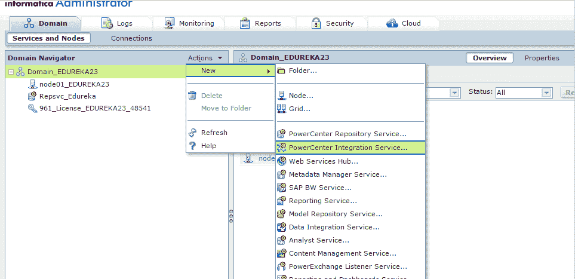

<figcaption id="caption-attachment-38511" class="wp-caption-text">**                                                                     Fig : Creating new integration service**</figcaption>

</figure>

**步骤 7.2:** 输入以下集成服务详情

*   名称:Intsvc_Edureka
*   从 下拉列表中选择 **牌照** 和 **节点** ，点击 **下一个**

<figure id="attachment_38512" aria-describedby="caption-attachment-38512" style="width: 600px" class="wp-caption aligncenter">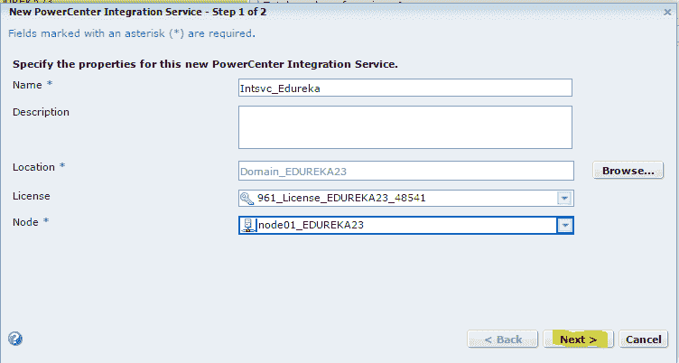

<figcaption id="caption-attachment-38512" class="wp-caption-text">**                                    Fig : Specifying integration service properties**</figcaption>

</figure>

点击 **下一个**

**步骤 7.3:** 输入以下存储库服务详细信息

*   PowerCenter 存储库服务:Repsvc_Edureka
*   用户名:管理员
*   密码:管理员

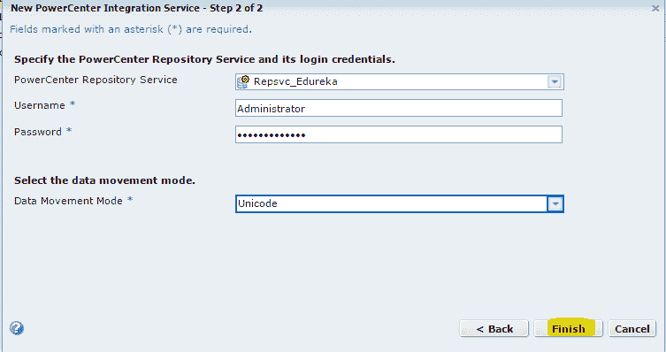

<figure id="attachment_38514" aria-describedby="caption-attachment-38514" style="width: 600px" class="wp-caption aligncenter">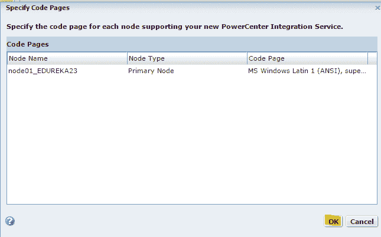

<figcaption id="caption-attachment-38514" class="wp-caption-text">**                                              Fig : Specifying repository properties**</figcaption>

</figure>

*   现在，集成服务已创建，但已禁用，因此我们必须启用它。

**步骤 7.4:** 按照以下步骤启用集成服务

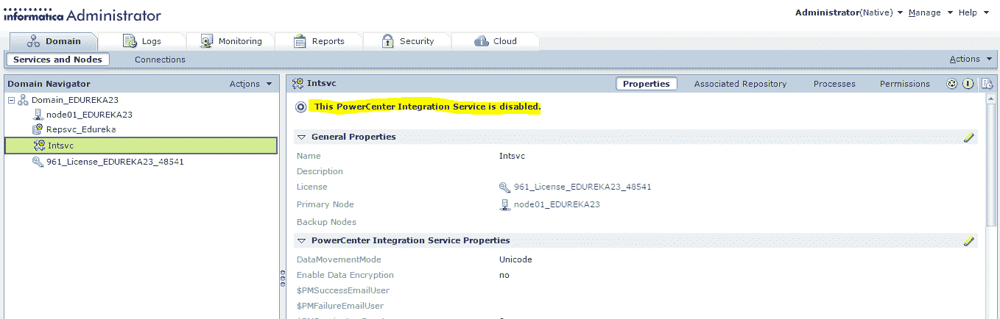

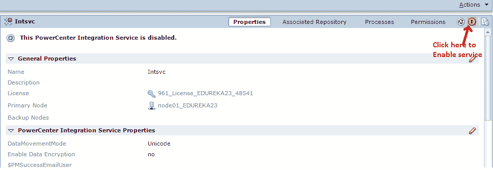

<figure id="attachment_38517" aria-describedby="caption-attachment-38517" style="width: 969px" class="wp-caption aligncenter">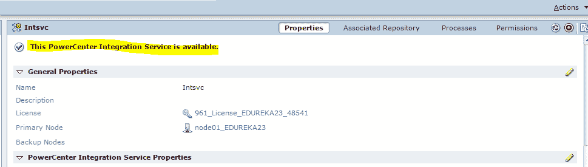

<figcaption id="caption-attachment-38517" class="wp-caption-text">**                                                                   Fig : Enabling integration services**</figcaption>

</figure>

我们现在已经成功地使集成服务可用于进一步的操作。

## **第八步:客户端安装**

为了继续进行 Informatica 安装，我们从客户端安装开始。

**步骤 8.1:** 现在安装 **PowerCenter 客户端**

*   进入目录**961 _ Client _ Installer _ win32-x86**，双击进入 **install.bat。**

<figure id="attachment_38518" aria-describedby="caption-attachment-38518" style="width: 600px" class="wp-caption aligncenter">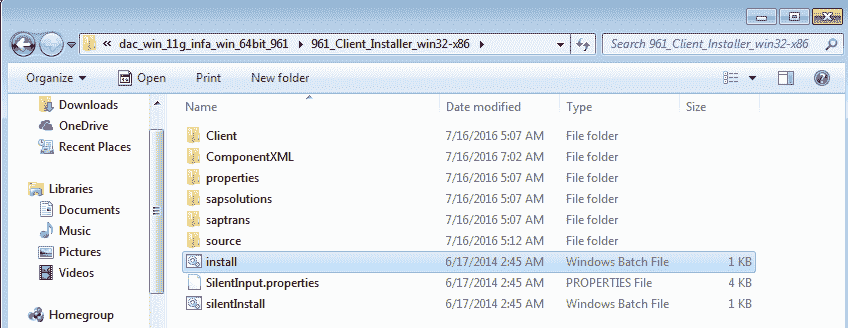

<figcaption id="caption-attachment-38518" class="wp-caption-text">**                                                 Fig :Launching client installer**</figcaption>

</figure>

<figure id="attachment_38520" aria-describedby="caption-attachment-38520" style="width: 600px" class="wp-caption aligncenter">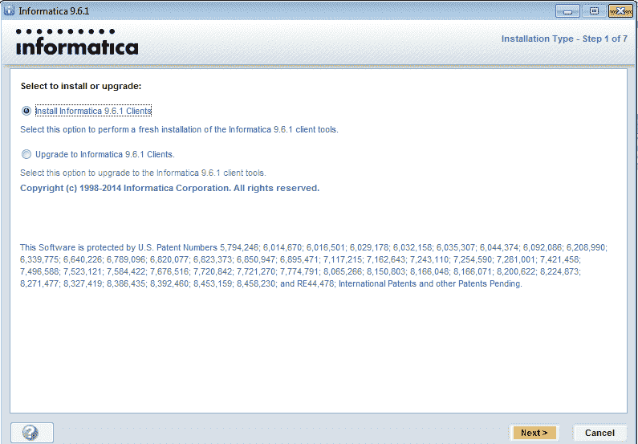

<figcaption id="caption-attachment-38520" class="wp-caption-text">**                                                Fig : Enabling integration services**</figcaption>

</figure>

点击**下一步。**

**步骤 8.2:** 标记 **勾选** **PowerCenter 客户端** 上的 ，点击 **下一步。**

<figure id="attachment_38522" aria-describedby="caption-attachment-38522" style="width: 600px" class="wp-caption aligncenter">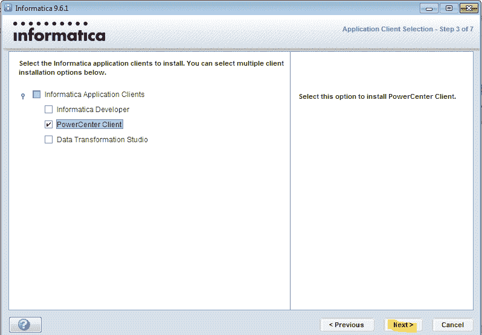

<figcaption id="caption-attachment-38522" class="wp-caption-text">**                                             Fig : Select PowerCenter Client option**</figcaption>

</figure>

**步骤 8.3:** 点击 **下一步**，指定安装目录。

<figure id="attachment_38523" aria-describedby="caption-attachment-38523" style="width: 600px" class="wp-caption aligncenter">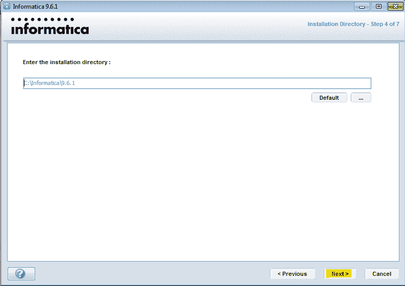

<figcaption id="caption-attachment-38523" class="wp-caption-text">**                                           Fig : Specifying installation directory**</figcaption>

</figure>

**步骤 8.4:** 点击 **安装。**

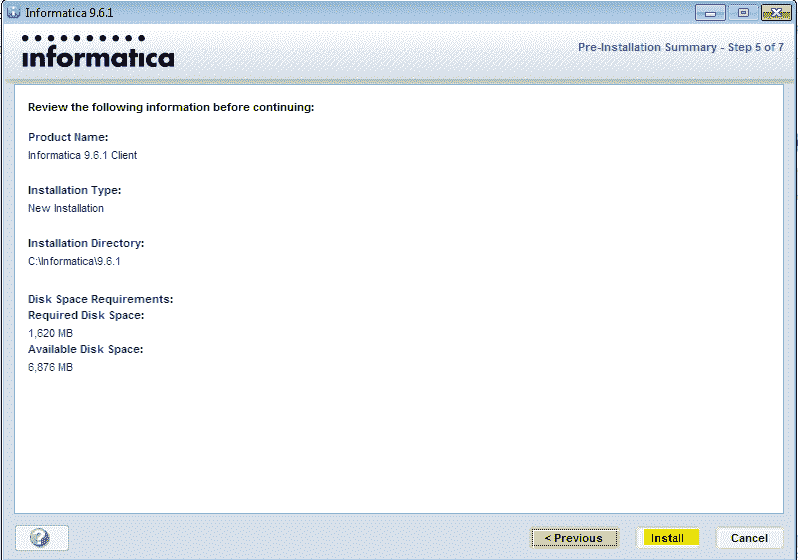

现在这一步需要一些时间来安装软件。

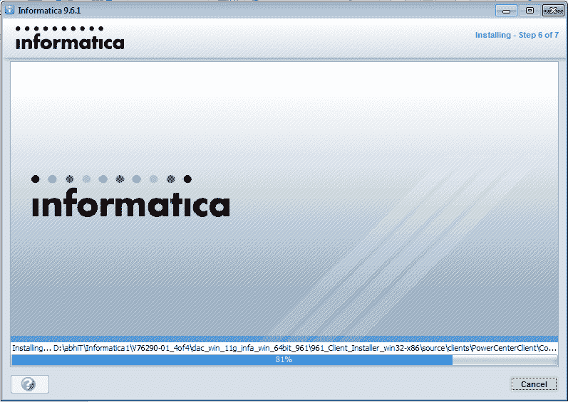

**步骤 8.5:** 点击 **搞定**

<figure id="attachment_38528" aria-describedby="caption-attachment-38528" style="width: 600px" class="wp-caption aligncenter">

<figcaption id="caption-attachment-38528" class="wp-caption-text">**                                              Fig : Completing client installation**</figcaption>

</figure>

## **第九步:配置 PowerCenter Designer**

Informatica 安装的最后一步是配置 PowerCenter Designer，以连接到域和存储库来加载数据库

**步骤 9.1:** 现在点击 Windows 开始按钮启动 PowerCenter Designer。

<figure id="attachment_38529" aria-describedby="caption-attachment-38529" style="width: 419px" class="wp-caption aligncenter">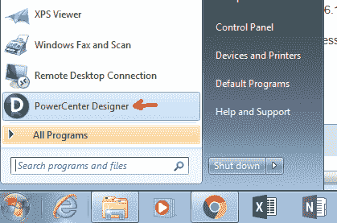

<figcaption id="caption-attachment-38529" class="wp-caption-text">**                    Fig : Launching PowerCenter Designer**</figcaption>

</figure>

<figure id="attachment_38530" aria-describedby="caption-attachment-38530" style="width: 600px" class="wp-caption aligncenter">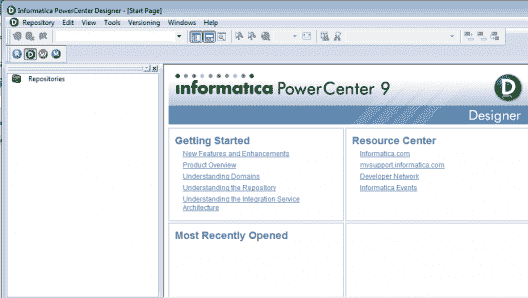

<figcaption id="caption-attachment-38530" class="wp-caption-text">**                                               Fig : PowerCenter Designer Homepage**</figcaption>

</figure>

**步骤 9.2:** 点击 **储存库- >配置域名。**

<figure id="attachment_38531" aria-describedby="caption-attachment-38531" style="width: 600px" class="wp-caption aligncenter">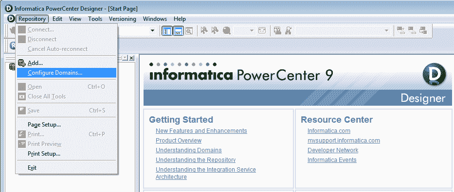

<figcaption id="caption-attachment-38531" class="wp-caption-text">**                                                              Fig : Configuring Domain**</figcaption>

</figure>

**步骤 9.3:** 点击 **添加域名。**

**步骤 9.4:** 输入以下详细信息添加一个域:

*   域名:Domain_Edureka23(此处应输入您机器的 Domain _ Host Name)
*   网关主机:Edureka23(您机器的主机名)
*   网关端口:6005

<figure id="attachment_38533" aria-describedby="caption-attachment-38533" style="width: 600px" class="wp-caption aligncenter">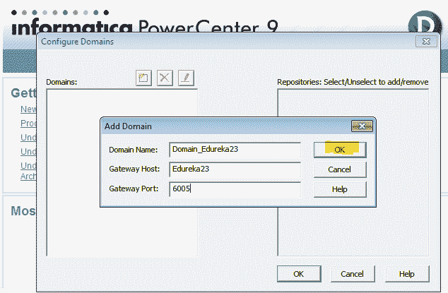

<figcaption id="caption-attachment-38533" class="wp-caption-text">**                                                    Fig : Specifying Domain details**</figcaption>

</figure>

点击 **确定。**

**第 9.5 步:** 选择 **Repsvc_Edureka** 点击 **确定。**

<figure id="attachment_38534" aria-describedby="caption-attachment-38534" style="width: 600px" class="wp-caption aligncenter">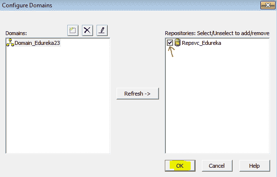

<figcaption id="caption-attachment-38534" class="wp-caption-text">**                                                   Fig : Selecting repository**</figcaption>

</figure>

**第 9.6 步:** 选择 **Repsvc_Edureka** 连接资源库 如下图。

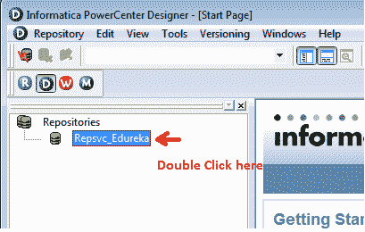

<figure id="attachment_38536" aria-describedby="caption-attachment-38536" style="width: 600px" class="wp-caption aligncenter">

<figcaption id="caption-attachment-38536" class="wp-caption-text">**                                                  Fig : Connecting to repository**</figcaption>

</figure>

*   在下面的截图中，你可以看到连接是成功的。

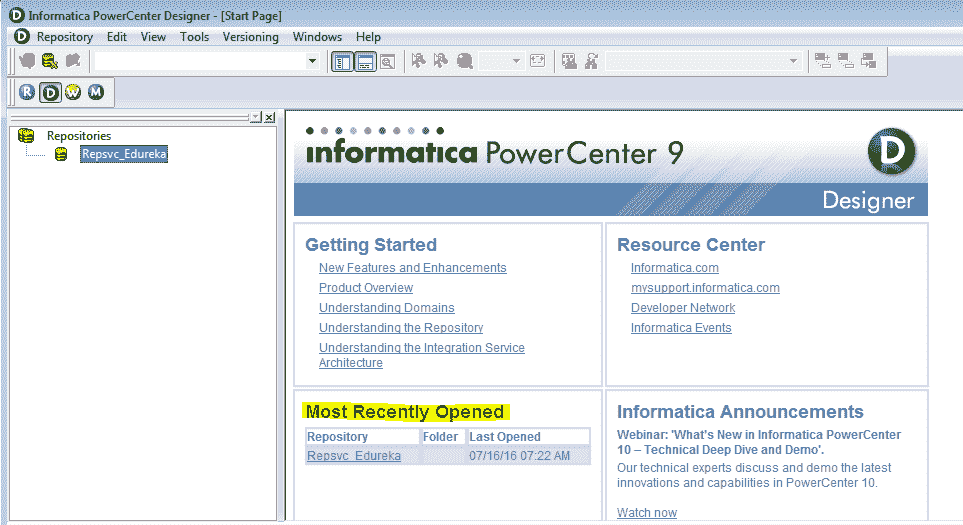

*   您可以在 Informatica 管理控制台的存储库服务中验证连接。
*   可以看到表中列出的 **域属性** 。

<figure id="attachment_38538" aria-describedby="caption-attachment-38538" style="width: 1355px" class="wp-caption aligncenter">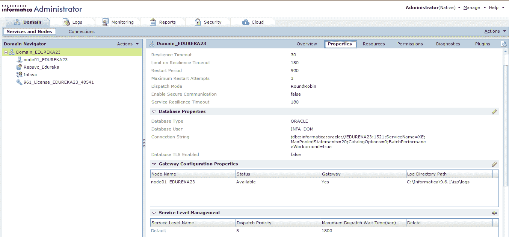

<figcaption id="caption-attachment-38538" class="wp-caption-text">**                                                                         Fig : Domain Properties**</figcaption>

</figure>

这就完成了 Informatica 的安装，希望这篇博客对在你的系统中安装 Informatica PowerCenter 有用。

如果你觉得这个博客很有帮助，你也可以看看我们的 Informatica 教程博客系列[什么是 Informatica:Informatica power center 的初学者教程](https://www.edureka.co/blog/what-is-informatica/)和 [Informatica 教程:理解 Informatica‘Inside Out’](https://www.edureka.co/blog/informatica-tutorial)。如果你正在寻找 Informatica 认证的细节，你可以查看我们的博客 [Informatica 认证:所有需要知道的事情](https://www.edureka.co/blog/informatica-certification-all-there-is-to-know/)。

如果你已经决定以信息学为职业，我会推荐你为什么不看看我们的[信息学培训](https://www.edureka.co/informatica)课程页面。Edureka 的 Informatica 认证培训将通过现场讲师指导课程和使用真实案例的实践培训，使您成为 Informatica 专家。

*有问题吗？请在评论区提到它，我们会给你回复。*