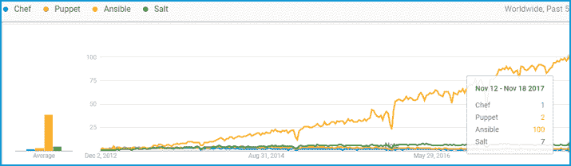

# 厨师 vs 木偶 vs Ansible vs Saltstack:哪个最适合你？

> 原文：<https://www.edureka.co/blog/chef-vs-puppet-vs-ansible-vs-saltstack/>

Chef、Puppet、Ansible 和 SaltStack 是全行业使用的 DevOps 工具，包含在 ***[DevOps 认证](https://www.edureka.co/devops-certification-training)中。*** 它们都是“配置管理”工具，也就是说它们是为部署、配置和管理服务器而设计的。但是你知道 Chef vs Puppet vs ansi ble vs salt stack 哪个是 IT 自动化最好的工具吗？

我写这篇博客是为了让你知道这些工具的优缺点，之后你将能够决定最适合你的组织的需求和环境的工具。这些工具使用起来非常简单，但功能强大，足以自动化复杂的多层 IT 应用程序环境。所以在这篇“厨师 vs 木偶 vs 安斯比尔 vs 盐堆”的博客里，我会为你解答很多这样的问题。

您可以浏览下表，大致了解我将用来比较这些工具的指标。

| **指标** | **厨师** | **傀儡** | **Ansible** | **盐堆** |
| 可用性 | ✔ | ✔ | ✔ | ✔ |
| 易于设置 | 不太容易 | 不太容易 | 简单 | 不太容易 |
| 管理 | 不太容易 | 不太容易 | 简单 | 简单 |
| 可扩展性 | 高度可扩展 | 高度可扩展 | 高度可扩展 | 高度可扩展 |
| 配置语言 | DSL(Ruby) | DSL(PuppetDSL) | YAML(Python) | YAML(Python) |
| 互操作性 | 高 | 高 | 高 | 高 |
| 定价(最多 100 个节点) | $13700 | $11200-$19900 | 1 万美元 | $15，000(大约。) |

您可以根据更多因素来比较这些工具。让我们更深入地研究每个工具，了解 Chef vs Puppet vs ansi ble vs salt stack 的区别。

## **厨师 vs 木偶 vs Ansible vs 盐堆**

让我根据可用性来比较一下 chef vs puppet vs ansi ble vs salt stack。所有工具都是高度可用的，这意味着存在多个服务器或多个实例。比方说，如果您的主服务器或服务器出现故障，总会有一个备份服务器或不同的主服务器来代替它。让我们一个一个来看看每个工具:

**Chef—**当主服务器(即 Chef 服务器)出现故障时，它有一个备份服务器来代替主服务器。

**傀儡——**它有*多主架构*，如果主动主倒下，另一个主接替主动主的位置。

**ansi ble**–它通过一个活动节点运行，称为主实例。如果主实例出现故障，会有一个辅助实例来代替它。

**盐堆**——它可以配置*多个主*。如果一个主服务器关闭，代理将与列表中的另一个主服务器连接。因此，它有多个主设备来配置 salt minions。

### **易于设置**

当我谈到设置的简易性时，让我补充一下我的个人经验，因为当我安装 chef、puppet 和 saltstack 时，我面临一些问题，但当我安装 Ansible 时，它就像一个蛋糕行走。所以让我们逐一关注每一个工具:

**厨师**——厨师有一个主代理架构。 *Chef 服务器*运行在主机上，Chef 客户机作为代理运行在每台客户机上。此外，还有一个名为 workstation 的额外组件，它包含所有经过测试的配置，然后被推送到中央 chef 服务器。所以，没那么容易。

**木偶**——木偶也有主代理架构。*傀儡服务器* 运行在主机上，而*傀儡客户端*作为代理运行在每个客户端机器上。之后还有代理和主之间的证书签署。因此，也不是那么容易。

**ansi ble**–它只有主服务器运行在服务器上，而没有代理运行在客户机上。它使用 *ssh* 连接登录到您想要配置的客户端系统或节点。客户机虚拟机不需要特殊设置，因此设置起来更快！

**salt stack**——这里服务器被称为 salt *master* ，客户端被称为 salt *minions* ，它们作为代理在客户端机器上运行。

除了这篇“厨师 vs 木偶 vs Ansible vs Saltstack”的博客，如果你想从专业人士那里获得这些技术的培训，你可以选择 edureka 的结构化培训！点击下方了解更多信息。

### **管理**

在我解释这些工具在管理基础上的区别之前，让我告诉你 puppet 和 chef 遵循拉配置& Ansible 和 Saltstack 遵循推配置。你一定想知道这些配置是什么？在推配置中，中央服务器中存在的所有配置将被推送到节点，而在拉配置中，从节点将自动从中央服务器拉取所有配置，而无需任何命令。

**主厨**–你需要成为一名程序员来管理配置，因为它提供了 Ruby DSL 中的配置。客户端从服务器获取配置。

**傀儡**–不太容易管理配置，因为它使用自己的语言，称为傀儡 DSL(领域特定语言)。客户端从服务器获取配置。它非常面向系统管理员，并且有非即时的远程执行。

**ansi ble**–易于学习管理配置，因为它使用 YAML，即另一种与英语非常相似的标记语言。服务器将配置推送到所有节点。适用于实时应用，可以立即远程执行。

**salt stack**–易于学习管理配置，因为它也使用 YAML。服务器将配置推送到所有客户端。立即远程执行

### **扩展性**

所有四种工具都具有高度的可扩展性。假设您今天需要配置大约 50 个节点，明天需要 500 个。这些工具没有问题。它可以处理大型基础架构，您只需指定要配置的节点的 IP 地址和主机名，其余任务将由这些工具处理。因此，所有这些工具都是高度可扩展的。

### **配置语言**

**主厨**–主厨使用 Ruby 领域特定语言(Ruby DSL)。它有一个陡峭的学习曲线和面向开发人员。

**木偶**——木偶使用自己的木偶领域特定语言(木偶 DSL)。它不是很好学，面向系统管理员。

ansi ble–ansi ble 使用 YAML，即另一种标记语言(Python)。颇为易学且面向其管理员。如今，Python 内置于大多数 Unix 和 Linux 部署中，因此设置和运行该工具会更快。

**salt stack**–sal stack 也使用 YAML (Python)。它同样易于学习和面向管理员。

接下来，让我们往前走，在互操作性的基础上比较一下 chef vs puppet vs ansi ble vs salt stack。

### **互通**

在这些工具中，主服务器或主服务器，或者你也可以说控制机器，必须在 Linux/Unix 上，但是它们的从服务器或它们必须配置的节点可以在 windows 上。让我们逐一看看每个工具:

**Chef**–Chef 服务器只能在 Linux/Unix 上运行，但 Chef 客户端和工作站也可以在 windows 上运行。

**傀儡**–傀儡师只能在 Linux/Unix 上工作，但是傀儡代理也可以在 windows 上工作。

**Ansible**–ansi ble 也支持 windows 机器，但是 ansi ble 服务器必须在 Linux/Unix 机器上。

**Salt stack**–Salt Master 只能在 Linux/Unix 上运行，但是 Salt minions 也可以在 windows 上运行。

除了这篇“厨师 vs 木偶 vs Ansible vs Saltstack”的博客，如果你想从专业人士那里获得这些技术的培训，你可以选择 edureka 的结构化培训！点击下方了解更多信息。

### **定价**

配置工具的企业成本如下:

**Chef**–Chef Automate 以每年 137 美元的节点价格为您提供构建、部署所需的一切。

**Puppet**–Puppet 的定价从标准支持计划的每节点/年 112 美元到高级计划的每节点/年 199 美元不等。

**ansi ble**–针对最多 100 个节点的标准 IT 运营，Ansible Tower 的定价为 10，000 美元/年。这包括 8*5 支持，而特优提供 24*7 支持，每年 14000 美元。

**salt stack**—salt stack Enterprise 每 100 个节点的成本为 15，00 美元/年(近似值)。您可以联系支持部门了解当前的年度订阅价格。

现在快结束时，我想让你展示一下这些工具的受欢迎程度，例如 Chef vs Puppet vs ansi ble vs salt stack。让我们看看下图中的数据趋势，该图显示了这些工具在过去 5 年中是如何统治 IT 领域的。

正如你在上面看到的，木偶和厨师是老玩家，而 Ansible 和 saltstack 是新玩家，Ansible 随着增长趋势看起来很有前途。因此，t o 得出结论，所有这四种工具都有各自的优势和优于其他工具的类别。我在这里的唯一意图是帮助你做决定。所以，你有必要选择合适的工具，可以根据你的需求量身定制。如果你想了解更多关于厨师、木偶和 Ansible 的知识，可以查看我们的博客[厨师教程](https://www.edureka.co/blog/chef-tutorial/)、[木偶教程](https://www.edureka.co/blog/puppet-tutorial/)和 [Ansible 教程](https://www.edureka.co/blog/ansible-tutorial/)。

*如果你在“**厨师 vs 木偶 vs 替身 vs 盐堆**”上找到这篇* *的相关博客，* *请查看 Edureka 的* [***DevOps 培训***](https://www.edureka.co/devops-certification-training) *，edu reka 是一家值得信赖的在线学习公司，在全球拥有超过 25 万名满意的学习者。Edureka DevOps 认证培训课程可帮助学员获得各种 DevOps 流程和工具方面的专业知识，例如 Puppet、Jenkins、Nagios 和 GIT，用于自动化 SDLC 中的多个步骤。*

*有问题吗？请在这个“厨师 vs 木偶 vs Ansible vs Saltstack”博客的评论部分提到它，我们会尽快回复你。*