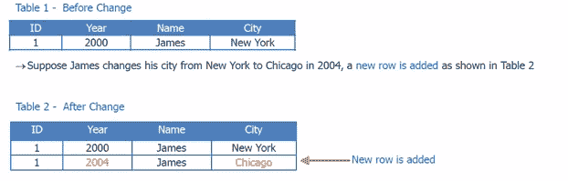
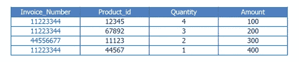

# 维度表的类型

> 原文：<https://www.edureka.co/blog/types-of-dimension-table/>

## **维度表**

这是数据仓库的星型模式中的一个表。数据仓库是使用由事实表和维度表组成的维度数据模型构建的。后者用于描述维度。它们包含维度键、值和属性。

您也可以观看下面的视频，我们的 [***数据仓库培训***](https://www.edureka.co/data-warehousing-and-bi) 专家正在详细讨论每一项&技术的每一个细微差别。

## [//www.youtube.com/embed/K_uhkuX6sgs](//www.youtube.com/embed/K_uhkuX6sgs)

## **尺寸类型**

**缓慢变化的维度**–在一段时间内缓慢变化而不是定期变化的维度属性被分组为 SCD。姓名、地址等属性可以更改，但不要太频繁。

这些属性会随着时间的推移而变化，并且会组合成一个缓慢变化的维度。考虑一个例子，一个人从一个城市到另一个城市。现在有 3 种方法来改变地址；

类型 1 是覆盖旧值，类型 2 是添加新行，类型 3 是创建新列。

**类型 1**

类型 1 的优点是它非常容易跟随，并且它导致巨大的空间节省和因此的成本节省。缺点是不保留历史。

**类型 2**

类型 2 的优点是保留了完整的历史。唯一的缺点在于巨大的空间分配，因为从一开始就必须维护整个历史。

**类型 3**

最好的方法可能是在添加两个新列的地方添加一个新列。在这种情况下，跟踪历史变得非常容易。

**符合尺寸-** 这在多个位置使用**。**它有助于创建一致性，以便在事实表中保持一致。不同的表可以跨事实表使用该表，这有助于创建不同的报告。

例如，有两个事实表。事实表 1 用于确定按地理位置销售的产品数量。该表将按地理位置计算产品数量，事实表 2 将确定客户产生的收入。两者都依赖于包含产品 Id、名称和来源的产品。

有两个事实表共享的地理维度和客户维度。收入事实给出了由地理位置和客户产生的收入，而产品单位事实给出了在该地理位置向客户销售的单位数量。

**退化维度**–退化维度是指维度属性存储为事实表的一部分，而不是存储在单独的表中。产品 id 来自产品维度表。发票编号是一个独立的属性，没有其他属性与之关联。发票号码可能是至关重要的，因为企业想要知道产品的数量。

**垃圾维度**–这是一个包含不同且不相关属性的单个表，以避免事实表中有大量外键。通常创建它们是为了管理快速变化的维度所创建的外键。

**角色扮演维度**–它是一个与事实表有多个有效关系的表。例如，事实表可能包含发货日期和交付日期的外键。但是相同的属性应用于每个外键，因此相同的表可以连接到外键。

有问题要问我们吗？请在评论区提及它们，我们将会回复您。

**相关岗位:** [数据入库入门](https://www.edureka.co/data-warehousing-and-bi)