# 什么是 Python 编程语言| Python 基础入门

> 原文：<https://www.edureka.co/blog/python-programming-language>

Python 编程语言是由 Guido Van Rossum 于 1989 年创建并于 1991 年发布的一种高级解释型编程语言。

## **Python 编程语言是用来做什么的？**

Python 是一种优秀的通用高级语言，可以用来创建桌面 GUI 应用程序、web 应用程序和 web 框架。

## **Python 也是脚本语言吗？**

Python 既是脚本语言，也是编程语言。脚本语言的工作基础是自动化重复的任务，如执行过程或程序。

对于那些熟悉 Java 或 C++的人来说，Python 将打破你为典型编程语言建立的模式。 准备谈恋爱，跟巨蟒！

在这篇博客中，我们将按照以下顺序学习 Python 编程语言:

1.  [为什么要学习 Python 编程？](#WhyLearnPython)
2.  [Python 安装](#PythonInstallation)
3.  [Python 基础](#PythonFundamentals) 3.1 [数据类型](#DataTypes)3.2[流量控制](#FlowControl)3.3[函数](#Functions)
4.  [文件处理](#FileHandling)
5.  [对象&类](#Object&Class)类

## **为什么要学习 Python 编程？**

Python 是一种高级动态编程语言。它很容易学习，并提供强大的打字功能。Python 代码有一种非常“自然”的风格，因为它易于阅读和理解(由于没有分号和大括号)。Python 编程语言 可以在任何平台上运行，从 Windows 到 Linux 到 Macintosh，Solaris 等等。

## **Python 可以免费使用吗？**

是的。Python 是一种开源编程语言，每个人都可以免费使用。它还受到开源软件包和库的生态系统的支持。任何对 Python 感兴趣的人都可以从官方网站:https://www.python.org/免费下载并安装

## **学 Python 容易吗？**

Python 是一门容易学习的语言，理想情况下，它应该是你的第一门编程语言，因为你将很快学会如何像程序员一样思考。Python 的简单性是它如此受欢迎的原因。下面重点介绍一下它的美学:

*   可读性极强的语言
*   整洁的视觉布局
*   更少的语法异常
*   高级字符串操作
*   优雅动感的打字
*   解读自然
*   脚本和快速应用的理想选择
*   适合多种平台

***等等！Python 能做的更多。***

在自动化、大数据、人工智能等多个领域，它都是非常流行的语言。你可以参考这篇关于[学习 python 的 10 大理由](https://www.edureka.co/blog/10-reasons-why-you-should-learn-python)的博客。全球众多公司都在使用它，这也会给你留下深刻的印象。


*您可以浏览 Python 编程语言的网上技术交流讲座录像，我们的 Python 培训专家已经用示例详细解释了这些主题，这将有助于您更好地理解 Python 编程语言。*

## **学习 Python 编程| Python 初学者| Edureka**


[https://www.youtube.com/embed/rrZWbOdN4ZY?rel=0&showinfo=0](https://www.youtube.com/embed/rrZWbOdN4ZY?rel=0&showinfo=0)*This Edureka “Python Programming” video will introduce you to various Python fundamentals along with a practical demonstrating the various libraries such as Numpy, Pandas, Matplotlib and Seaborn.*

## **Python安装 **

现在让我们继续在 Windows 系统上安装 Python。

1.  进入链接:【https://www.python.org/downloads/ 在你的机器上安装最新版本。

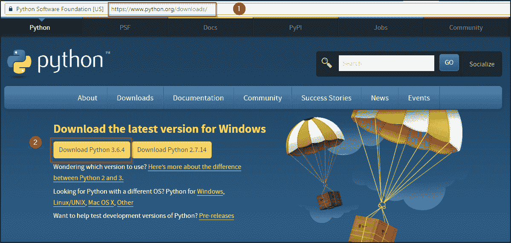  **图:** *下载 Python 编程语言*

2。 下载并安装 PyCharm IDE。

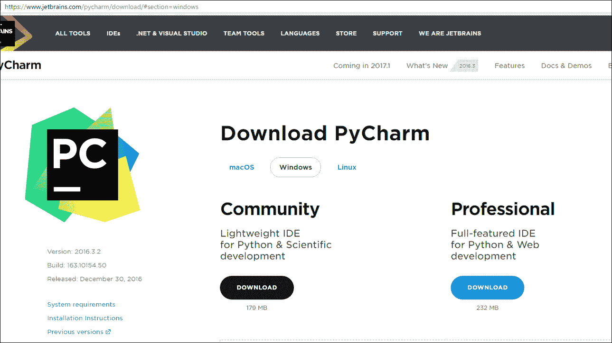 **图:** *下载 PyCharm* 

PyCharm 是一种用于计算机编程的集成开发环境(IDE)，专门针对 Python 编程语言。它提供了代码分析、图形调试器、集成单元测试器、与版本控制系统(VCSes)的集成，并支持使用 Django 进行 web 开发。

## **Python 基础**

以下是掌握 Python 所需的五个基础:

1.  数据类型
2.  流量控制
3.  功能
4.  文件处理
5.  对象&阶层

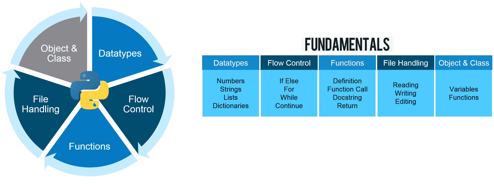  **图:** * Python 编程语言-基础知识*

Python 中的所有数据值都由对象表示，每个对象或值都有一个数据类型。

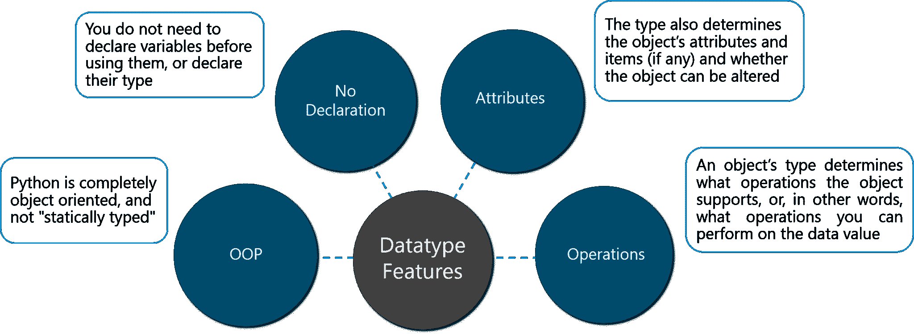  **图:** * Python 编程语言——数据类型特性*

Python 中有八种本地数据类型。

1.  布尔型
2.  数字
3.  琴弦
4.  字节&字节数组
5.  列表
6.  元组
7.  设置
8.  字典

下图将对此进行描述。

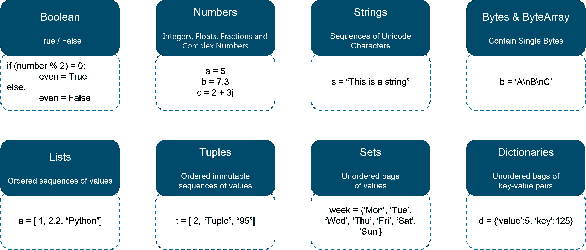  **图:** * Python 编程语言——原生数据类型*

让我们看看如何在 Python 中实现这些数据类型。

```
#Boolean
number = [1,2,3,4,5]
boolean = 3 in number
print(boolean)

#Numbers
num1 = 5**3
num2 = 32//3
num3 = 32/3
print('num1 is',num1)
print('num2 is',num2)
print('num3 is',num3)

#Strings
str1 = "Welcome"
str2 = " to Edureka's Python Programming Blog"
str3 = str1 + str2
print('str3 is',str3)
print(str3[0:10])
print(str3[-5:])
print(str3[:-5])

#Lists
countries = ['India', 'Australia', 'United States', 'Canada', 'Singapore']
print(len(countries))
print(countries)
countries.append('Brazil')
print(countries)
countries.insert(2, 'United Kingdom')
print(countries)

#Tuples
sports_tuple = ('Cricket', 'Basketball', 'Football')
sports_list = list(sports_tuple)
sports_list.append('Baseball')
print(sports_list)
print(sports_tuple)

#Dictionary
#Indian Government
Government = {'Legislature':'Parliament', 'Executive':'PM & Cabinet', 'Judiciary':'Supreme Court'}
print('Indian Government has ',Government)
#Modifying for USA
Government['Legislature']='Congress'
Government['Executive']='President & Cabinet'
print('USA Government has ',Government)

```

上面代码的输出如下:

```
True

num1 is 125
num2 is 10
num3 is 10.666666666666666

str3 is Welcome to Edureka's Python Programming Blog
Welcome to
 Blog
Welcome to Edureka's Python Programming

5
['India', 'Australia', 'United States', 'Canada', 'Singapore']
['India', 'Australia', 'United States', 'Canada', 'Singapore', 'Brazil']
['India', 'Australia', 'United Kingdom', 'United States', 'Canada', 'Singapore', 'Brazil']

['Cricket', 'Basketball', 'Football', 'Baseball']
('Cricket', 'Basketball', 'Football')

Indian Government has {'Legislature': 'Parliament', 'Judiciary': 'Supreme Court', 'Executive': 'PM & Cabinet'}
USA Government has {'Legislature': 'Congress', 'Judiciary': 'Supreme Court', 'Executive': 'President & Cabinet'}
```

### **流量控制**

流程控制让我们在执行程序时定义一个流程。为了模拟真实世界，你需要将真实世界的情况转换到你的程序中。为此，您需要使用流控制来控制程序语句的执行。

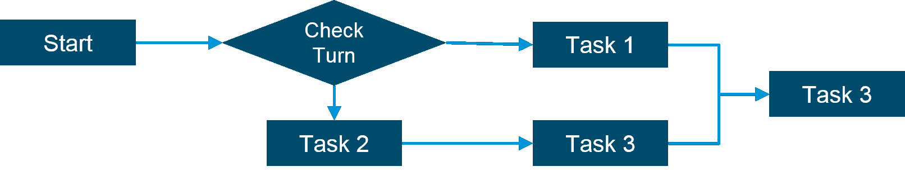  **图:** * Python 编程语言-流量控制*

Python 编程中使用了六种基本的流量控制:

1.  如果
2.  为
3.  而
4.  突破
5.  继续
6.  通过

### **如果陈述**

Python 复合语句‘if’允许您有条件地执行语句块。

*If*语句的语法:

```

if expression:
     statement (s)
elif expression:
     statement (s)
elif expression:
     statement (s)
...
else:
     statement (s)

```

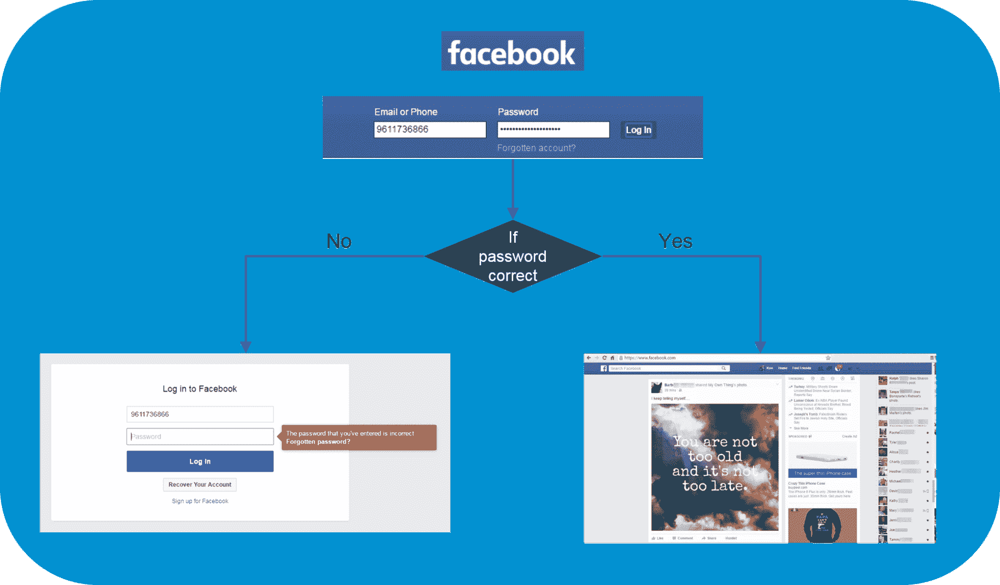  **图:** * Python 编程语言——If—**脸书登录示例*

上图以脸书登录为例解释了“if”语句的用法。

1.  脸书登录页面将根据您的用户名和密码是否与您的帐户匹配，将您引导至两个页面。
2.  如果输入的密码错误，它会把你带到左边的页面。
3.  如果输入的密码正确，您将被引导至您的主页。

现在让我们看看脸书会如何使用 If 语句。

```
password = facebook_hash(input_password)
if password == hash_password
   print('Login successful.')
else
   print('Login failed. Incorrect password.')

```

上面的代码只是给出了在脸书登录示例中使用的 If 语句的高级实现。脸书哈希()函数将输入密码作为参数，并将其与为特定用户存储的哈希值进行比较。

### **为语句** 为语句

for 语句支持重复执行由可迭代表达式控制的语句或语句块。

语句的*语法:*

```
for target in iterable:
     statement (s)

```

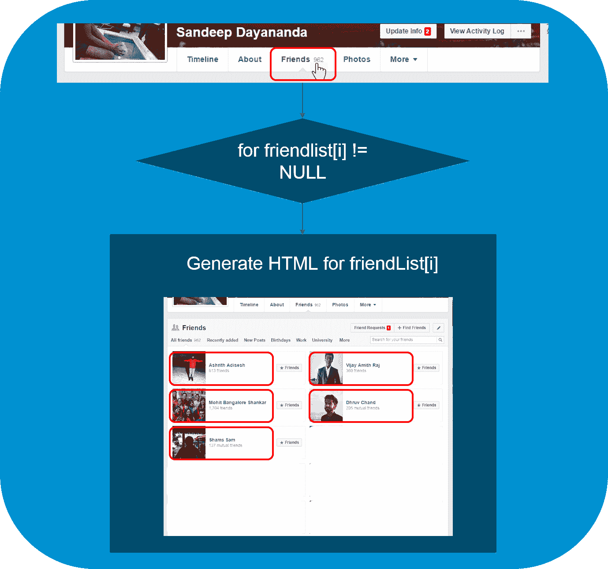  **图:** * Python 编程语言——给朋友举例*

【for】语句可以从上面的例子中理解。

*   从您的个人资料中列出“朋友”将显示您所有朋友的姓名和照片
*   为了做到这一点，脸书得到了你的“好友列表”,其中包含了你所有好友的个人资料
*   脸书然后开始显示所有配置文件的 HTML，直到列表索引达到‘NULL’
*   将所有配置文件填充到您的页面的操作由‘for’语句控制

现在让我们看一个用 Python 编写的示例程序来演示 For 语句。

```
travelling = input("Are you travelling? Yes or No:")
while travelling == 'yes':
   num = int(input("Enter the number of people travelling:"))
   for num in range(1,num+1):
      name = input("Enter Details 
 Name:")
      age = input("Age:")
      sex = input("Male or Female:")
      print("Details Stored 
",name)
      print(age)
      print(sex)
   print("Thank you!")
   travelling = input("Are you travelling? Yes or No:")
print("Please come back again.")

```

输出如下:

```
Are you travelling? Yes or No:Yes
Enter the number of people travelling:1
Enter Details 
Name:Harry
Age:20
Male or Female:Male
Details Stored
Harry
20
Male
Thank you
Are you travelling? Yes or No:No
Please come back again.
```

### **而言** 而言

Python 编程中的 while 语句支持由条件表达式控制的语句或语句块的重复执行。

While 语句的语法:

```
while expression:
     statement (s)

```

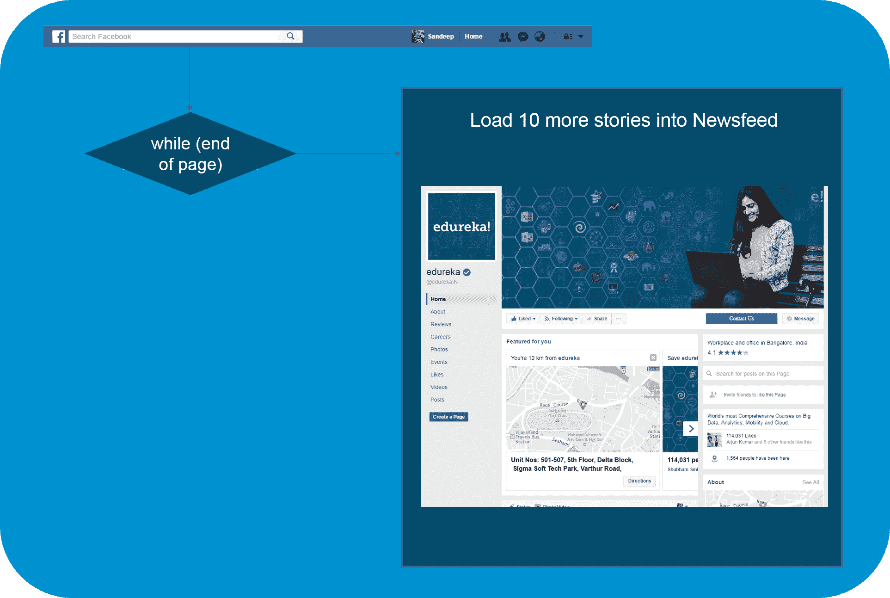  **图:** * Python 编程语言——While——脸书 Newsfeed 示例*

我们将通过上面的脸书 Newsfeed 来了解 while 循环的使用。

*   当我们登录脸书的主页时，我们的新闻订阅上大约有 10 篇报道
*   当我们到达这一页的末尾时，脸书在我们的新闻订阅上加载了另外 10 个故事
*   这演示了如何使用“while”循环来实现这一点

现在让我们看一个用 Python 编写的示例程序来演示 While 语句。

```
count = 0
print('Printing numbers from 0 to 9')
while (count<10):
   print('The count is ',count)
   count = count+1
print('Good Bye')

```

这个程序使用 while 语句打印从 0 到 9 的数字，限制循环直到 9。输出如下:

```
The count is 0
The count is 1
The count is 2
The count is 3
The count is 4
The count is 5
The count is 6
The count is 7
The count is 8
The count is 9
```

### **破言**

break 语句只允许在循环体内部使用。当 break 执行时，循环终止。如果一个循环嵌套在其他循环中，break 只会终止最里面的嵌套循环。

Break 语句的语法:

```
while True:
     x = get_next()
     y = preprocess(x)
     if not keep_looking(x, y): break
     process(x, y)

```

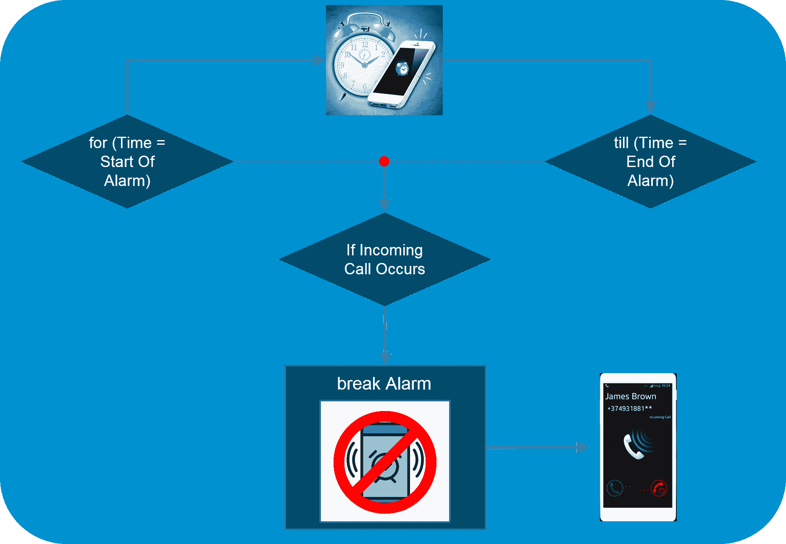  **图:** * Python 编程语言——Break——报警和来电*

从上面的例子可以理解“中断”流控制语句。

*   让我们考虑手机在特定时间响铃报警的情况。
*   假设手机在闹铃响起的时间内接到来电，闹铃立即停止，手机铃声开始响起。
*   这就是 break 的基本工作原理。

现在让我们看一个用 Python 编写的示例程序来演示 Break 语句。

```
for letter in 'The Quick Brown Fox. Jumps, Over The Lazy Dog':
   if letter == '.':
      break
   print ('Current Letter :', letter)

```

这个程序打印给定字符串中的所有字母。每当遇到“.”时，它就会断开。或者一个句号。我们通过使用 Break 语句做到了这一点。输出如下所示。

```
Current Letter : T
Current Letter : h
Current Letter : e
Current Letter : 
Current Letter : Q
Current Letter : u
Current Letter : i
Current Letter : c
Current Letter : k
Current Letter : 
Current Letter : B
Current Letter : r
Current Letter : o
Current Letter : w
Current Letter : n
Current Letter : 
Current Letter : F
Current Letter : o
Current Letter : x
```

### **继续陈述**

continue 语句只允许在循环体内部使用。当 continue 执行时，循环体的当前迭代终止，并继续执行循环的下一次迭代。

*的语法继续*语句:

```
for x in some_container:
    if not seems_ok(x): continue
    lowbound, highbound = bounds_to_test()
    if x<lowbound or x>=highbound: continue
    if final_check(x):
        do_processing(x)

```

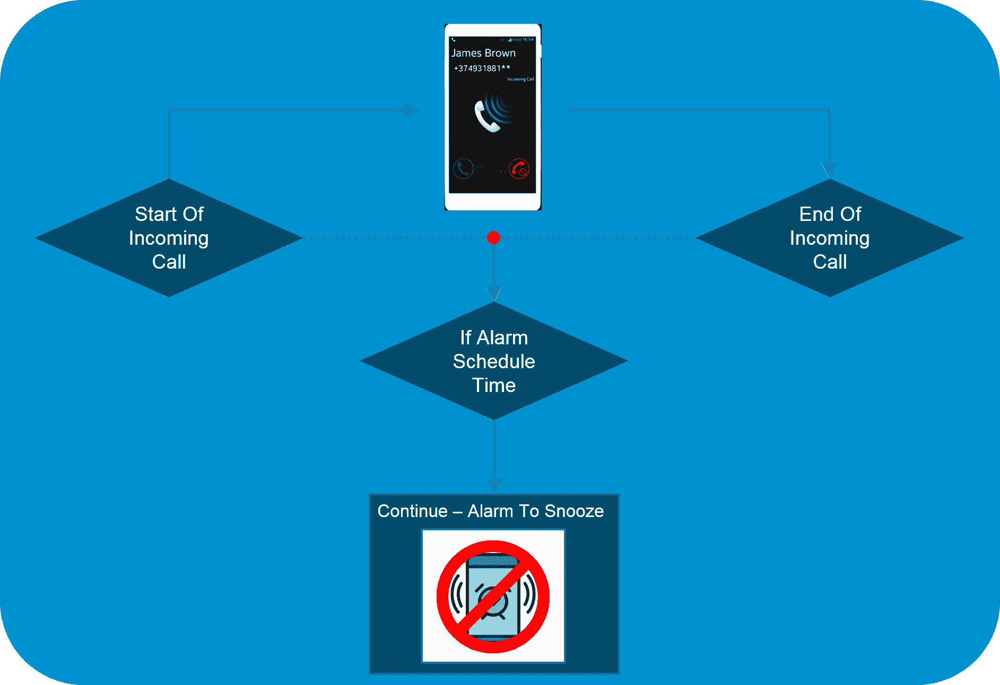  **图:** * Python 编程语言——继续——来电与报警示例*

例如:Continue 语句可以理解为使用来电和报警。

*   假设我们正在通话，并且闹钟被安排在通话时间，那么闹钟触发器识别出通话事件
*   一旦注意到通话事件，手机会在下一个贪睡时段继续响铃

现在让我们看一个用 Python 编写的示例程序来演示 Continue 语句。

```
for num in range(10, 21):
   if num % 5 == 0:
      print ("Found a multiple of 5")
      pass
      num = num + 1
      continue
   print ("Found number: ", num)

```

这个程序打印 10 到 20 中除 5 的倍数以外的所有数字。输出如下。

```
Found a multiple of 5
Found number: 11
Found number: 12
Found number: 13
Found number: 14
Found a multiple of 5
Found number: 16
Found number: 17
Found number: 18
Found number: 19
Found a multiple of 5
```

#### **通语句**

不执行任何操作的 pass 语句可以在语法上需要一个语句，但您没有具体要做的事情时用作占位符。

Pass 语句的语法:

```
if condition1(x):
    process1(x)
elif x>23 or condition2(x) and x<5:
    pass
elif condition3(x):
    process3(x)
else:
    process_default(x)

```

现在让我们来看一个用 Python 编写的示例程序 来演示 Pass 语句。

```
for num in range(10, 21):
   if num % 5 == 0:
      print ("Found a multiple of 5: ")
      pass
      num++
   print ("Found number: ", num)

```

这个程序用一个单独的句子打印 5 的倍数。输出如下。

```
Found a multiple of 5: 10
Found number: 11
Found number: 12
Found number: 13
Found number: 14
Found a multiple of 5: 15
Found number: 16
Found number: 17
Found number: 18
Found number: 19
Found a multiple of 5: 20
```

在学习了上面的六个流量控制语句之后，现在让我们来学习一下什么是函数。

### **功能**

函数在 Python 编程中，是一组执行特定任务的相关语句。函数使我们的程序更有条理，有助于代码的重用。

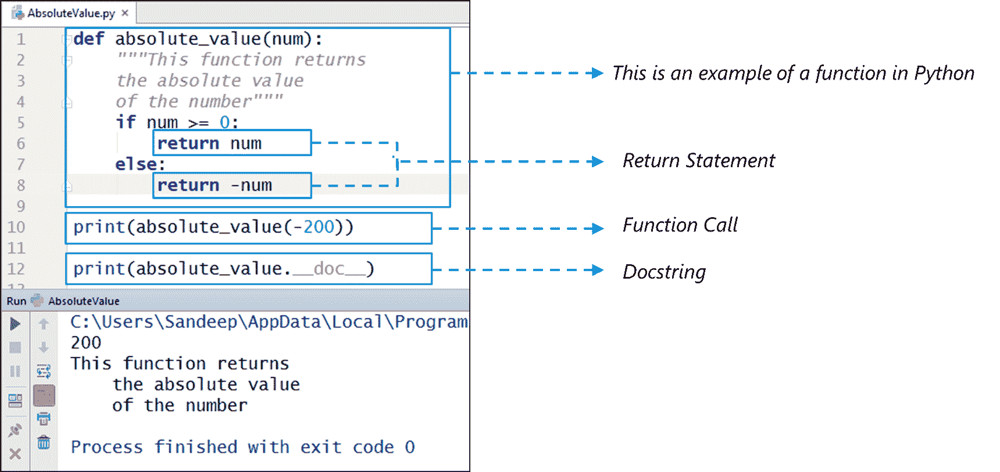  **图:** * Python 编程语言——理解函数*

#### **功能用途:**

1.  函数有助于代码重用
2.  函数为代码提供组织
3.  函数提供抽象
4.  函数有助于扩展性

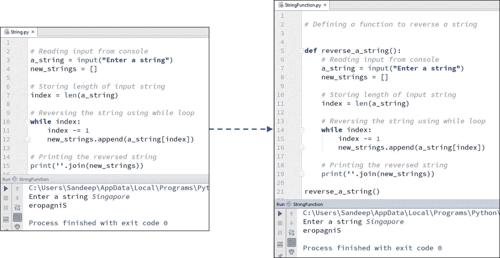  **图:** * Python 编程语言——演示函数的用法*

上例中使用的代码如下:

```
# Defining a function to reverse a string

def reverse_a_string():
    # Reading input from console
    a_string = input("Enter a string")
    new_strings = []

    # Storing length of input string
    index = len(a_string)

    # Reversing the string using while loop
    while index:
        index -= 1
        new_strings.append(a_string[index])

    #Printing the reversed string
    print(''.join(new_strings))

reverse_a_string()

```

我们已经展示了在 Python 中使用函数的威力。

## **文件处理**

文件处理指的是那些用来读或写文件的操作。

要执行文件处理，我们需要执行以下步骤:

1.  打开文件
2.  读/写文件
3.  关闭文件

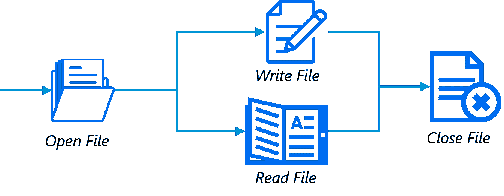 **图:** * Python 编程语言-Python 中的文件处理* 

### **开档**

*   Python 内置函数 open()打开文件
*   该函数返回一个文件对象，也称为句柄，因为它用于相应地读取或修改文件

示例程序:

```
file = open("C:/Users/Edureka/Hello.txt", "r")
for line in file:
   print (line)

```

输出如下:

```
One
Two
Three
```

### **写入文件**

*   为了写入文件，我们需要以写“w”、追加“a”或独占创建“x”模式打开文件
*   我们需要小心“w”模式，因为它会覆盖已经存在的文件。所有先前的数据被删除
*   使用 write()方法写入一个字符串或字节序列(对于二进制文件)

示例程序:

```
with open("C:/Users/Edureka/Writing_Into_File.txt", "w") as f
f.write("First Line
")
f.write("Second Line
")

file = open("D:/Writing_Into_File.txt", "r")
for line in file:
   print (line) 

```

输出如下:

```
First Line
Second Line
```

### **从文件中读取**

*   要读取文件内容，我们必须在阅读模式下打开文件
*   我们可以使用 read(size)方法读入 size 数量的数据
*   如果没有指定大小参数，它读取并返回到文件的末尾

示例程序:

```
file = open("C:/Users/Edureka/Writing_Into_File.txt", "r")
print(file.read(5))
print(file.read(4))
print(file.read())

```

输出如下:

```
First Line
Second Line
```

### **关闭一档**

*   当我们完成对文件的操作后，我们需要正确地关闭它。
*   关闭一个文件将释放与该文件捆绑在一起的资源，这是使用 close()方法完成的。

示例程序:

```
file = open("C:/Users/Edureka/Hello.txt", "r")
text = file.readlines()
print(text)
file.close()

```

输出如下:

```
['One
', 'Two
', 'Three']
```

## **物体&类**

Python 是一种面向对象的编程语言。 对象只是数据(变量)和作用于这些数据的方法(函数)的集合。 类是对象的蓝图。

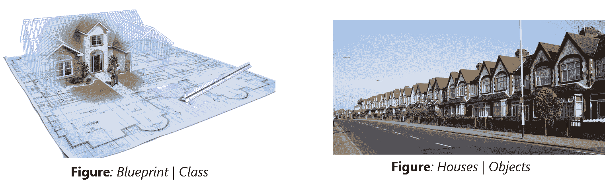

### **定义一类**

我们用关键字“类”来定义一个类。第一个字符串称为 docstring，它有一个关于类的简短描述。

```
class MyNewClass:
'''This is a docstring. I have created a new class'''
pass

```

### **创建对象**

一个类对象可以用来创建该类的新对象实例(实例化)。创建对象的过程类似于函数调用。

```
ob = MyNewClass

```

我们已经学会了如何从一个给定的类中创建一个对象。

我们的 Python 编程博客到此结束。我希望你喜欢阅读这个博客，并发现它的信息量。到目前为止，您一定已经很好地理解了什么是 Python 编程语言。现在开始练习所有的例子。

*有问题吗？请在“Python 编程语言”博客的评论部分提到它，我们会尽快回复您。*

*要深入了解 Python 编程语言及其各种应用，您现在就可以注册参加[最佳 Python 在线课程](https://www.edureka.co/python-programming-certification-training)培训，该培训提供全天候支持和终身访问。*