# AWS S3 教程:深入了解亚马逊简单存储服务

> 原文：<https://www.edureka.co/blog/s3-aws-amazon-simple-storage-service/>

随着存储需求的日益增长，预测您未来可能需要的容量变得非常困难，构建和管理存储库变得既费时又费力。如果你想更好地掌握 AWS，AWS 认证课程将是你的最佳选择。亚马逊考虑到所有这些问题，创建了 *AWS S3* 在线存储解决方案。在这篇 AWS S3 课程的博文中，我们将带您了解这项服务。

**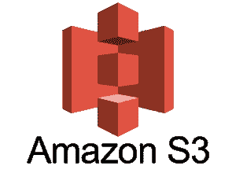 ** **内容**

**什么是 AWS S3？**

亚马逊简单存储服务(S3)是一个面向互联网的存储。它旨在跨多个地理区域提供大容量、低成本的存储。亚马逊 S3 为开发者和 IT 团队提供 **安全** 、 **耐久** 和 **高可扩展** 对象存储。

1。S3 之所以 **安稳** 是因为 AWS 提供了:

*   对您存储的数据进行加密。它可以通过两种方式发生:
    *   客户端加密
    *   服务器端加密
*   维护多个副本，以便在数据损坏的情况下重新生成数据
*   *版本化，*其中每个编辑被存档用于潜在的检索。

2。S3 之所以 **耐久** 是因为:

*   它使用校验和定期验证存储数据的完整性，例如，如果 S3 检测到数据中有任何损坏，它会立即在复制数据的帮助下进行修复。
*   即使在存储或检索数据时，它也会检查传入的网络流量中是否有任何损坏的数据包。

3。S3 是高度可扩展的，因为它会根据您的需求自动扩展您的存储，并且您只需为您使用的存储付费。

*我们想到的下一个问题是，*

## **AWS S3 可以存储什么样的数据以及存储多少数据？**

在 S3，你几乎可以以任何格式存储任何类型的数据，当我们谈到容量时，我们可以在 S3 存储的对象的容量和数量是无限的。

* *一个物体*是 S3 的基本实体。它由数据、键和元数据组成。

当我们谈论数据时，它可以是两种类型-

*   经常被访问的数据。
*   不经常访问的数据。

因此，亚马逊推出了 3 个存储类别，以实惠的价格为客户提供最佳体验。

有了 [AWS 云迁移认证](https://www.edureka.co/migrating-to-aws)可以更好的理解。

**我们来了解一下“医疗保健”用例的 3 个存储类别:**

*1。亚马逊 S3 标准*用于频繁的数据访问 这适用于性能敏感的用例，在这些用例中，延迟应该保持较低。 例如在医院中，经常访问的数据会是入院病人的数据，需要快速检索。

*2。亚马逊 S3 标准* 用于不频繁的数据访问

这适用于数据寿命较长且访问频率较低的使用情形，即数据归档但仍期望高性能。 例如，在同一家医院，已经出院的人，他们的记录/数据将不是每天都需要的，但是如果他们带着任何并发症回来，他们的出院总结应该被快速检索。

*3。Amazon Glacier*适用于数据要存档，且不要求高性能的用例，它的成本比其他两种服务都低。例如，在医院中，患者的检验报告、处方、核磁共振成像、x 光、扫描文件等。在日常运行中不需要超过一年的，即使需要，也不需要更低的延迟。 

**规格快照:** 存储类

## 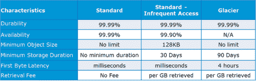 

**S3 的数据是如何组织的？**

S3 的数据是以桶的形式组织的。

## **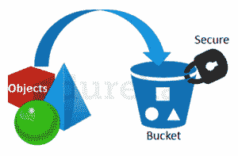**

*   在 S3，桶是存储的逻辑单位。
*   桶包含包含数据和元数据的对象。

在 S3 中添加任何数据之前，用户必须创建一个用于存储对象的桶。

**您的数据在地理位置上存储在哪里？**

您可以自行选择数据存储的位置或区域。为该地区做决定是很重要的，因此应该好好计划。

这是选择最佳区域的 4 个参数—

*   定价
*   用户/客户位置
*   等待时间
*   服务可用性

**我们通过一个例子来理解这个:**

*假设有一家公司必须启动这些存储实例来为美国和印度的客户托管网站。*

*为了提供最好的体验，公司不得不选择一个地区，* *哪个最符合其要求。*

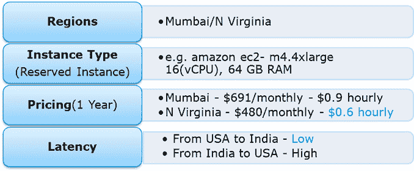

现在看一下上面的参数，我们可以清楚地确定，N Virginia 将是这家公司的最佳地区，因为它的延迟低、价格低。 无论您在哪里，您都可以选择符合您要求的任何地区，因为您可以从任何地方访问您的 S3 存储桶。

谈到区域，我们来看看在其他可用区域进行备份的可能性，或者您可能想要将数据移动到其他区域。 谢天谢地，这个功能最近已经被添加到 AWS S3 系统中，而且非常容易使用。

## **跨区域复制**

顾名思义，跨区域复制使用户可以毫不费力地将数据复制或传输到其他位置。

显然，这是有代价的，本文将对此进行进一步讨论。

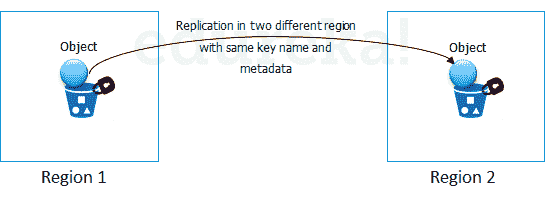

**数据是如何传输的？**

除了传统的互联网传输方式，AWS 还有另外两种方式可以安全、快速地传输数据:

*   传送加速度
*   雪球

**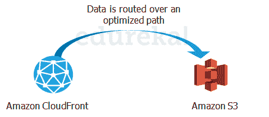 传输加速 **  利用亚马逊的 CloudFront edge 技术，实现快速、轻松、安全的长距离传输。 

**CloudFront** 是 AWS 的一项缓存服务，其中来自客户端站点的数据被传输到最近的边缘位置，并从那里通过优化的网络路径路由到您的 AWS S3 存储桶。

**滚雪球** 是一种物理转移数据的方式。在这种情况下，亚马逊发送一个设备到你的住所，你可以在上面加载数据。它附有一个 kindle，当它从亚马逊发货时，上面有你的发货地址。 当雪球上的数据传输完成后，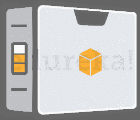 kindle 将发货地址改回雪球必须发往的 AWS 总部。 

雪球非常适合有大量数据移动的客户。Snowball 的平均周转时间为 5-7 天，而在同一时间内，传输加速可以在一条 1Gbps 的专用线路上传输多达 75 TB 的数据。因此，根据使用情形，客户可以做出决定。

显然，会有一些成本，让我们看看 S3 的总体成本。

**查看我们在顶级城市的 AWS 认证培训**

| 印度 | 美国 | 其他国家 |
| [在海德拉巴的 AWS 培训](https://www.edureka.co/aws-certification-training-hyderabad) | [亚特兰大 AWS 培训](https://www.edureka.co/aws-certification-training-atlanta) | [AWS 伦敦培训](https://www.edureka.co/aws-certification-training-london) |
| [班加罗尔的 AWS 培训](https://www.edureka.co/aws-certification-training-bangalore) | [波士顿 AWS 培训](https://www.edureka.co/aws-certification-training-boston) | [阿德莱德的 AWS 培训](https://www.edureka.co/aws-certification-training-adelaide) |
| [钦奈的 AWS 培训](https://www.edureka.co/aws-certification-training-chennai) | [纽约市的 AWS 培训](https://www.edureka.co/aws-certification-training-new-york-city) | [新加坡 AWS 培训](https://www.edureka.co/aws-certification-training-singapore) |

## **定价**

**“AWS 上没有免费的东西吗？”【T2**

***是的！*** 作为 AWS 免费使用层的一部分，你可以免费使用 AWS S3。注册后，AWS 新客户在一年内每月会收到 5 GB 的亚马逊 S3 标准存储、20，000 个 Get 请求、2，000 个 Put 请求和 15GB 的数据传输。

超过这个限度，是有附加成本的，我们来了解一下亚马逊是怎么向你收费的:

## **S3 在 AWS S3 的话单怎么样？**

虽然 AWS S3 拥有如此多的功能，但它的成本低廉且灵活。它作用于 **按使用付费，** 的意思是，你只支付你使用的费用。下表是 S3 特定地区的定价示例:

**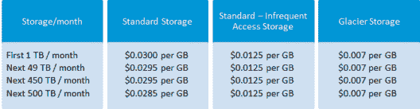**

****来源**:aws.amazon.com 为北弗吉尼亚地区**

跨地区复制话单的方式是:

如果您在不同地区之间复制 1，000 个 1 GB 对象(1，000 GB ),您将为复制 1，000 个对象产生 0.005 美元的请求费用(1，000 个请求 x 每 1，000 个请求 0.005 美元),并为地区间数据传输产生 20 美元的费用(每传输 1gb 0.020 美元 x 1，000 GB)。复制后，1，000 GB 将产生基于目标区域的存储费用。

雪球有 2 个变种:

*   雪球 50 TB : 200 美元
*   雪球 80 TB: 250 美元

这是他们收取的固定服务费。

除此之外，还有现场费用，不包括运输日费用，运输日免费。

前 10 天的上门服务也是免费的，也就是说，从那时起，当雪球到达您的场所，直到它被运回，这 10 天就是上门服务日。它到达的那一天和它被发货的那一天被算作发货日，因此是免费的。

**转移加速** 定价如下表所示:

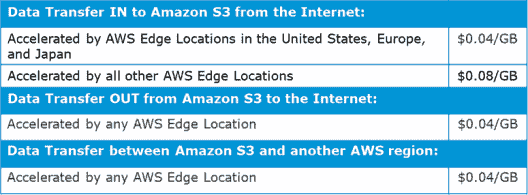

**AWS S3 用例:1**

行业“媒体”

让我们通过一个实时的用例来理解它，来吸收我们到目前为止所学到的一切: *IMDb 互联网电影数据库* 是一个著名的电影、电视节目和电子游戏相关信息的在线数据库。

让我们看看他们是如何利用 AWS 服务的:

*   为了获得尽可能低的延迟，所有可能的搜索结果都是用文档预先计算出来的，用于搜索 中的每个字母组合。 每份文档都被推送到亚马逊简单存储服务(S3)，进而推送到 **亚马逊 CloudFront** ，让文档在物理上离用户更近。要计算的可能搜索的理论数量令人难以置信——一个 20 个字符的搜索有 23 x 1030 种组合
*   但在实践中，利用 IMDb 在电影和名人数据方面的权威，可以将搜索空间缩小到 15 万份左右的文档，亚马逊 S3 和亚马逊 CloudFront可以在短短几个小时内分发。

## **AWS S3 用例:2**

**项目陈述—**在亚马逊 S3 上托管一个静态网站

我们先来了解一下:什么是静态网站？

简言之，它是一个仅由 HTML、CSS 和/或 JavaScript 组成的网站。这意味着不支持服务器端脚本，所以如果你想托管一个 Rails 或 PHP 应用，你需要去别处看看。

为了更简单的目的，欢迎来到 AWS S3 托管网站的奇妙世界！

**第一步:创建一个桶**

要创建存储桶，请在 AWS 管理控制台中导航到 S3，然后点击创建存储桶。系统会提示您输入名称和地区。

如果您计划使用自己的域/子域，请将其用作您的存储桶名称。对于该地区，选择离您最近的一个，然后点击创建。幸运的话，你会看到你的新桶出现在控制台上。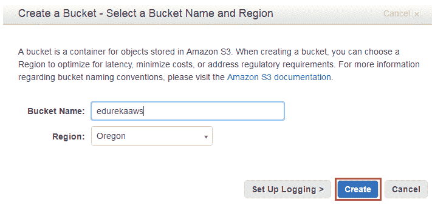

**第二步:验证创建的桶**

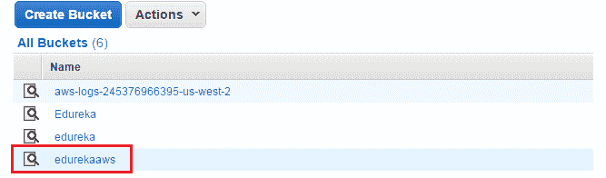

**第三步:启用网站托管**

现在唯一剩下要做的就是，启用静态网站托管。只需从右边的属性面板中选择它。

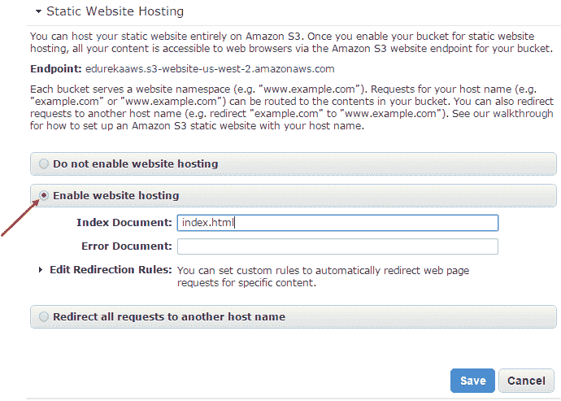

**第四步:创建 Html 文件**

确保将索引文档设置为 index.html。如果你愿意，你也可以 设置一个 错误页面 。完成后，点击保存。

AWS 管理控制台 的一个好处是 你可以直接从浏览器上传文件 到你的 bucket。让我们首先创建一个名为的 index.html。这将是首页的内容:

```
<!doctype html>
<html>
<head>
<title>
Hello, S3!
</title>
<meta name="description" content="My first S3 website">
<meta charset="utf-8">
</head>
<body>
<h2>My first S3 website</h2>
<p>I can't believe it was that easy!</p>
</body>
</html>
```

**第五步:上传水桶中的文件**

要上传文件，选择您的新存储桶并点击开始上传按钮。

一旦你上传了 index.html，它就会出现在你的存储桶中。然而，你还不能在你的浏览器中看到 ，因为 AWS S3 的所有东西在默认情况下都是私有的。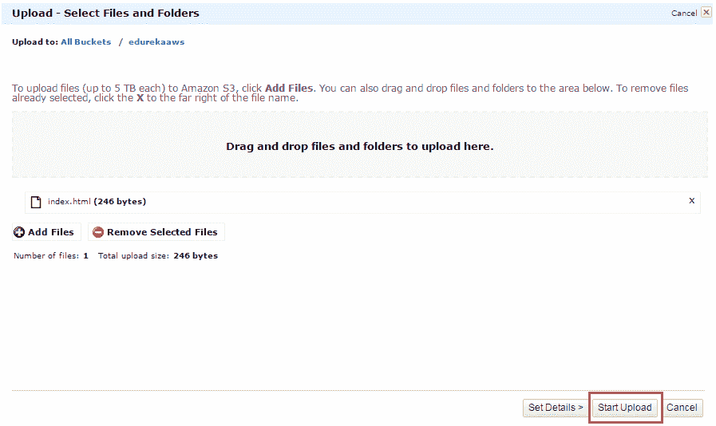 

**第六步:将 Html 文件公开**

要公开 index.html 文件，右击 index.html 并选择公开。(请记住，对您上传到网站的任何其他文件也要这样做！)

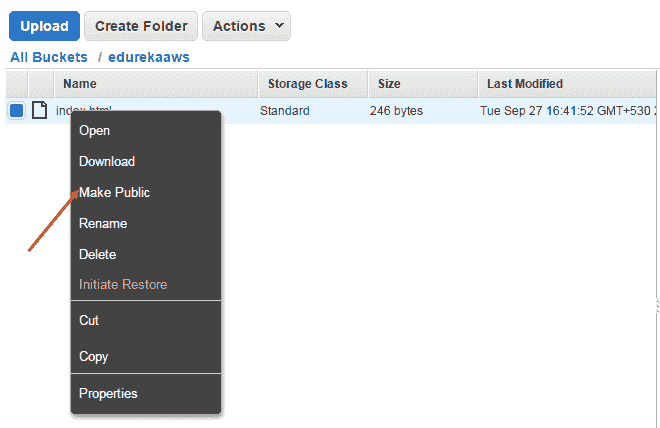

既然你的主页对全世界可见， 是时候测试一下了！

现在，在控制台中选择 index.html，然后转到属性选项卡。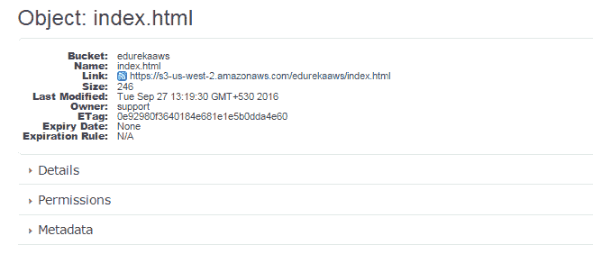

**第七步:验证结果的最后一步** 点击链接将带您进入新主页。

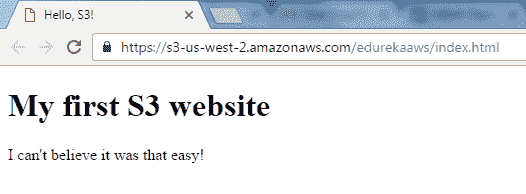

**祝贺你！** 你刚刚使用 S3 在 AWS 中托管了一个 html 网站。

## **AWS S3**中的键值存储

S3 是基于对象的。这些对象包括:

**Key:** 只是对象的名字。举个例子，spreadsheet.xlsx，hello.txt 等。这把钥匙可以用来取回物品。值:它只是由一系列字节组成的信息。实际上，它是文件中的一段数据。

**版本 ID:** 对象由其版本 ID 唯一标识。当一个对象被添加到 S3 桶时，S3 生成这个字符串。关于你正在存储的数据的数据被称为元数据。名称-值对的集合，您可以在其中存储有关对象的详细信息。亚马逊 S3 桶中的对象可以添加元数据。子资源:通过子资源技术存储与对象相关的信息。

这里有一个简短的 AWS S3 教程视频，它解释了:传统存储层、传统云存储的缺点、AWS 存储选项:EBS、S3、Glacier、AWS 连接存储:雪球&存储网关、AWS 命令行界面(CLI)、演示等。对于那些想成为 AWS 认证解决方案架构师的人来说，AWS S3 教程是非常重要的服务。

## [//www.youtube.com/embed/qaAllMDf_rs?rel=0&showinfo=0](//www.youtube.com/embed/qaAllMDf_rs?rel=0&showinfo=0)

我希望你喜欢这篇 AWS S3 教程。这是招聘人员在 AWS 解决方案架构师专业人员中最受欢迎的技能之一。这里收集了 ***[AWS 架构师面试问题](https://www.edureka.co/blog/interview-questions/top-aws-architect-interview-questions-2016/)*** 帮助你准备下一次的 AWS 工作面试。

*有问题吗？请在这篇 AWS S3 教程的评论部分提到它，我们会给你回复。*