# 2023 年 120+数据科学面试问答

> 原文：<https://www.edureka.co/blog/interview-questions/data-science-interview-questions/>

在这篇数据科学面试问题博客中，我将向您介绍最常见的数据科学问答、分析和机器学习面试。这个博客是学习数据科学面试所需的所有概念的完美指南。要获得深入的数据科学知识，您可以报名参加 Edureka 提供的实时 [***数据科学与 Python 课程***](https://www.edureka.co/data-science-python-certification-course) *培训*，24/7 全天候支持和终身访问。

以下是我们面试问题中涉及的主题:

*   **[基础数据科学面试题](#basic)**

*   **[统计面试问题](#statistics)**

*   **[数据分析面试题](#data-analysis)**

*   **[机器学习面试问题](#machine-learning)**

*   **[深度学习面试问题](#deep-learning)**

在继续之前，您可以浏览一下数据科学面试问题和答案的录音，我们的讲师在其中分享了他的经验和专业知识，将帮助您解决任何数据科学问题。

## **数据科学面试问答 2023 | edu reka**

[https://www.youtube.com/embed/tTAieUcNHdY?rel=0&showinfo=0&enablejsapi=1&origin=https%3A%2F%2Fwww.edureka.co](https://www.youtube.com/embed/tTAieUcNHdY?rel=0&showinfo=0&enablejsapi=1&origin=https%3A%2F%2Fwww.edureka.co)

**大一新生基础数据科学面试问题**

### **Q1。什么是数据科学？列出监督学习和非监督学习的区别。**

数据科学融合了各种工具、算法和机器学习原理，目标是从原始数据中发现隐藏的模式。这与统计学家多年来所做的有什么不同？

答案在于解释和预测的区别。


监督学习和非监督学习的区别如下:

| **监督学习** | **无监督学习** |
| 输入数据被标记。 | 输入数据未标记。 |
| 使用训练数据集。 | 使用输入数据集。 |
| 用于预测。 | 用于分析。 |
| 支持分类和回归。 | 支持分类、密度估计和降维 |

### **Q2。什么是选择偏差？**

选择偏倚是研究者在决定谁将被研究时出现的一种错误。它通常与参与者的选择不是随机的研究有关。这有时被称为选择效应。它是统计分析的失真，是由收集样本的方法造成的。如果不考虑选择偏差，那么研究的一些结论可能不准确。

选择偏差的类型包括:

3.  **数据**:当特定的数据子集被选择来支持一个结论或根据任意理由拒绝坏数据，而不是根据先前陈述或普遍同意的标准。

4.  :流失偏倚是一种因流失(参与者流失)导致的选择偏倚，不考虑未完成的试验受试者/测试。

### **Q3。什么是偏差-方差权衡？**

**偏差:**偏差是由于机器学习算法过于简化而在你的模型中引入的误差。这会导致不合身。当你在那时训练你的模型时，模型做出简化的假设，以使目标函数更容易理解。

低偏差机器学习算法—决策树、k-NN 和 SVM 高偏差机器学习算法—线性回归、逻辑回归

**方差:**方差是由于复杂的机器学习算法而在您的模型中引入的误差，您的模型也从训练数据集学习噪声，并且在测试数据集上表现不佳。它会导致高灵敏度和过度拟合。

通常，当您增加模型的复杂性时，您会看到由于模型中较低的偏差而导致的误差减少。然而，这种情况只会发生在特定的点上。随着您继续使您的模型变得更加复杂，您最终会过度拟合您的模型，因此您的模型将开始遭受高方差。

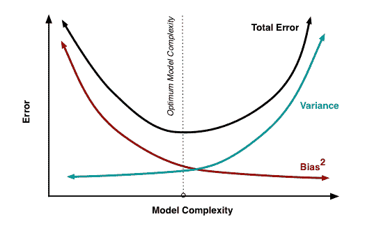

**偏差-方差权衡:**任何有监督的机器学习算法的目标都是具有低偏差和低方差，以达到良好的预测性能。

1.  k-最近邻算法具有较低的偏差和较高的方差，但是可以通过增加 k 的值来改变折衷，k 的值增加了对预测有贡献的邻域的数量，从而增加了模型的偏差。

2.  支持向量机算法具有低偏差和高方差，但是可以通过增加 C 参数来改变折衷，该 C 参数影响训练数据中所允许的违反裕度的次数，这增加了偏差但减少了方差。

在机器学习中，偏差和方差之间的关系是不可避免的。增加偏差会减少方差。增加方差将减少偏差。

**Q4。根据您选择的语言，编写一个程序，打印从 1 到 50 的数字**

打印从 1 到 50 的数字的 python 代码如下

```

For i in range(1,51):

print(i)

```

上述代码的输出将是-

one

Two

three

four

five

six

seven

eight

nine

Ten

Eleven

Twelve

Thirteen

Fourteen

Fifteen

Sixteen

Seventeen

Eighteen

Nineteen

Twenty

Twenty-one

Twenty-two

Twenty-three

Twenty-four

Twenty-five

Twenty-six

Twenty-seven

Twenty-eight

Twenty-nine

Thirty

Thirty-one

Thirty-two

Thirty-three

Thirty-four

Thirty-five

Thirty-six

Thirty-seven

Thirty-eight

Thirty-nine

Forty

Forty-one

forty-two

Forty-three

forty-four

Forty-five

Forty-six

Forty-seven

Forty-eight

forty-nine

Fifty

### **Q5。什么是混淆矩阵？**

混淆矩阵是一个 2X2 的表格，包含由  **二元分类器**提供的 4 个输出。各种测量，如错误率，准确性，特异性，敏感性，精确度和召回率是从它衍生出来的。  *混乱矩阵*

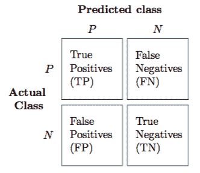

用于性能评估的数据集称为**测试数据集**。它应该包含正确的标签和预测的标签。

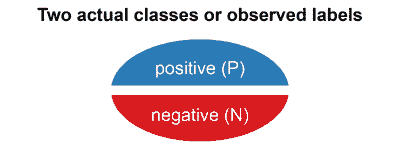

如果二元分类器的性能是完美的，预测的标签将完全相同。

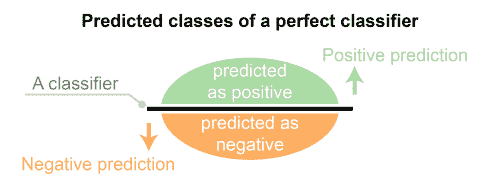

预测的标签通常与真实世界场景中的部分观察到的标签相匹配。

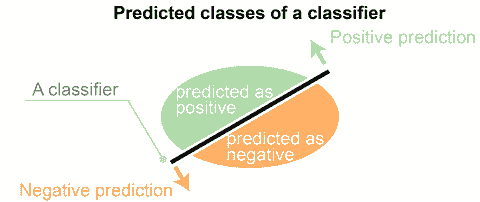

二元分类器将测试数据集的所有数据实例预测为阳性或阴性。这产生了四种结果

1.  **真阳性(TP)** —正确的阳性预测

2.  **假阳性(FP)** —不正确的阳性预测

3.  **真阴性(TN)** —正确的阴性预测

4.  **假阴性(FN)** —不正确的阴性预测

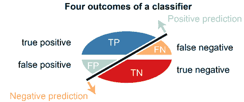

**源自混淆矩阵的基本度量-**

1.  **错误率** = (FP+FN)/(P+N)

2.  **精度** = (TP+TN)/(P+N)

3.  **敏感度(回忆或真阳性率)** = TP/P

4.  **特异性(真阴性率)** = TN/N

5.  **精度(正预测值)** = TP/(TP+FP)

6.  **F-Score(精确度和召回率的调和平均值)** = (1+b)(PREC。REC)/(b PREC+REC)其中 b 通常是 0.5，1，2。

**Q6。描述马尔可夫链？**

马尔可夫链是一种随机过程。在马尔可夫链中，任何状态的未来概率只取决于当前状态。

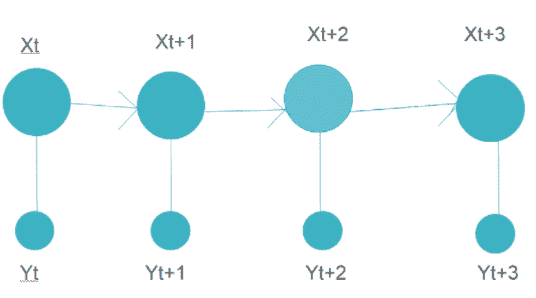

上图代表了一个马尔可夫链模型，其中每一步都有一个仅取决于当前状态的输出。

一个例子可以是单词推荐。当我们键入一个段落时，下一个单词是由模型建议的，它只依赖于前一个单词，而不依赖于它之前的任何东西。马尔可夫链模型先前在相似的段落上被训练，其中给定单词的下一个单词被存储用于训练数据中的所有单词。基于该训练数据输出，建议接下来的单词。

**Q7。你所理解的真阳性率和假阳性率是什么？**

真阳性率(TPR)是真阳性与真阳性和假阴性的比率。它是一个实际阳性被检测为阳性的概率。

TPR=TP/TP+FN

假阳性率(FPR)是假阳性与所有阳性(真阳性和假阳性)的比率。它是一个错误警报的概率，即当它实际上是否定的时，将给出肯定的结果。

FPR=FP/TP+FP

**Q8。数据可视化为什么要用 R？**

r 用于数据可视化，因为它有许多内置的函数和库来帮助数据可视化。这些库包括 ggplot2、fleet、lattice 等。

r 有助于探索性数据分析和特征工程。使用 R，几乎可以创建任何类型的图形。在 R 中定制图形比使用 python 更容易。

**Q9。什么是 ROC 曲线？**

ROC 曲线是 x 轴上的假阳性率和 y 轴上的真阳性率之间的图。真阳性率是真阳性与阳性样本总数的比率。假阳性率是假阳性与阴性样本总数的比率。将 FPR 和 TPR 绘制在几个阈值上以构建 ROC 曲线。ROC 曲线下的面积范围从 0 到 1。完全随机模型的 ROC 为 0.5，用直线表示。ROC 曲线偏离这条直线越多，模型越好。ROC 曲线用于二元分类。下图显示了 ROC 曲线的一个示例。

**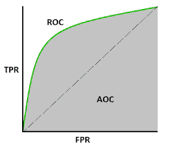**

**Q10。什么是降维及其好处？**

减少给定数据集的要素数量称为降维。有许多技术可以用来降低维数，例如-

### 特征选择方法

### 矩阵分解

### 流形学习

### 自动编码器方法

#### 线性判别分析(LDA)

#### **主成分分析**

降维的一个主要原因是维数灾难。当特征数量增加时，模型变得更加复杂。但是，如果数据点的数量较少，模型将开始学习或过度拟合数据。该模型不会对数据进行归纳。这就是众所周知的维数灾难。

降维的其他好处包括-

*   减少了时间和存储空间。
*   在 2D 或 3D 模式下对数据进行可视化和可视化表示变得更加容易。
*   降低了空间复杂度。

**Q11。如何在线性回归模型中找到 RMSE 和均方误差？**

均方根误差(RMSE)用于测试线性回归模型的性能。它评估有多少数据分布在最佳拟合线周围。它的公式是-

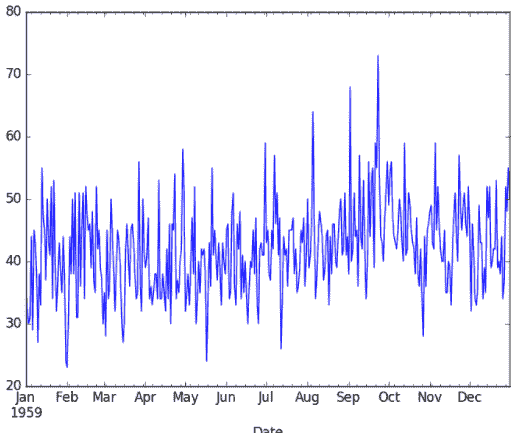

在哪里，

y_hat 是预测值

y_i 是输出变量的实际值。

n 是数据点的数量

均方误差(MSE)表示直线与实际数据的接近程度。取直线与数据点的差值并求平方。对于好的模型，MSE 值应该较低。这意味着实际输出值和预测输出值之间的误差应该很小。计算方法如下-

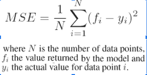

**Q12。如何处理不平衡的二元分类？**

在进行二元分类时，如果数据集不平衡，仅使用 R2 分数无法正确预测模型的准确性。例如，如果属于两个类别之一的数据与另一个类别相比在数量上非常少，则传统精度将占较小类别的非常小的百分比。如果只有 5%的例子属于较小的类别，并且模型将所有属于另一个类别的输出进行分类，则准确度仍然会在 95%左右。但这将是错误的。为了解决这个问题，我们可以做以下事情-

1.  使用其他方法计算模型性能，如精确度/召回率、F1 分数等。
2.  使用欠采样(减少较大类别的样本大小)、过采样(使用重复、SMOTE 和其他类似技术增加较小类别的样本大小)等技术对数据进行重新采样。
3.  使用 K 倍交叉验证
4.  使用集成学习，使得每个决策树考虑较小类的整个样本和较大类的仅一个子集。

**Q13。箱形图和柱状图的区别是什么**

直方图和箱线图都用来直观地表示某个特征的值的频率。下图显示了一个直方图。

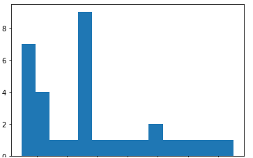

而下图显示了相同数据的箱线图。

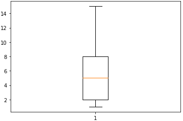

直方图用于了解数据的潜在概率分布。而箱线图更多地用于比较几个数据集。箱线图比直方图具有更少的细节，占用更少的空间。

**Q14。NLP 代表什么？**

NLP 代表自然语言处理。它是对计算机编程学习大量文本数据的研究。自然语言处理的例子包括标记化、停用词去除、词干提取、情感分析等。

**Q15。演练概率基础知识**

在所有可能的结果中，某一事件发生的可能性称为它的概率。一个事件的概率总是介于(包括)0 和 1 之间。

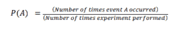

**阶乘**——用来求 n 个数的东西可以不重复地排列在 n 个地方的总方式数。它的值是 n 乘以所有自然数直到 n-1，例如 5！=5X4X3X2X1=120

**排列**–在不允许替换的情况下使用，项目的顺序很重要。它的公式是-

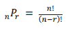

在哪里，

n 是项目的总数

r 是选择项目的方式的数量

**组合**–不允许替换时使用，项目顺序不重要。它的公式是-

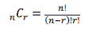

概率的一些规则是-

**加法法则**

P(A 或 B)= P(A)+P(B)-P(A 和 B)

**条件概率**

是事件 B 发生的概率，假设事件 A 已经发生。

P(A 和 B)= P(A)。专业人员

**中心极限定理**

它指出，当我们从大量人口中随机抽取样本，并取这些样本的平均值时，它们形成正态分布。

**Q16。描述不同的正则化方法，如 L1 和 L2 正则化**

有如下 3 种重要的正则化方法

**L2 正则化-(岭回归)**–在 L2 正则化中，我们将所有权重的平方和乘以一个值λ，添加到损失函数中。岭回归的公式如下-

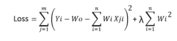

如您所见，如果权重值乘以特定数据点和要素的数据值变得非常大，则原始损失将变小。但是λ乘以权重平方和的附加值也会变大。同样，如果原来的损失价值变得很大，增加的价值也会变小。因此，它将控制最终值变得过大或过小。

**L1 正则化-(拉索回归)**–在 L1 正则化中，我们将所有权重的绝对值之和乘以一个值λ，添加到损失函数中。套索回归的公式如下

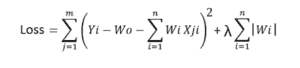

损失函数和优化算法使参数接近于零，但实际上不是零，而 lasso 消除了不太重要的特征，并将各自的权重值设置为零。

#### 拒绝传统社会的人

这用于神经网络中的正则化。完全连接的层更容易过度拟合。在神经网络中，丢弃会遗漏一些具有 1-p 概率的神经元。Dropout 减少了过拟合，提高了训练速度，并使模型更加健壮。

**Q17。您应该如何维护一个已部署的模型？**

模型部署后，需要对其进行维护。输入的数据可能会随时间而变化。例如，在预测房价的模型的情况下，房价可能会随着时间的推移而上涨，或者由于一些其他因素而波动。可以记录模型对新数据的准确性。确保准确性的一些常见方法包括-

1.  应该经常通过输入负面测试数据来检查模型。如果模型在测试数据为负的情况下给出的准确度较低，那也没什么。
2.  应建立自动编码器，使用异常检测技术，AE 模型将计算重建误差值。如果重构误差值很高，则意味着新数据不遵循模型学习的旧模式。

如果模型对新数据显示出良好的预测准确性，则意味着新数据遵循模型对旧数据学习到的模式或归纳。因此，可以根据新数据重新训练模型。如果新数据的准确性不是很好，可以通过对旧数据和数据特征进行特征工程来对新数据重新训练模型。

如果精度不好，可能需要从头开始训练模型。

**Q18。写出方程，计算精度和召回率。**

精度量化了正确的正面预测的数量。精确度的计算方法是将真阳性的数量除以真阳性和假阳性的总数。

**精度=真阳性/(真阳性+假阳性)**

精度被定义为在所有可能做出的肯定预测中做出的正确肯定预测的数量。召回的计算方法是将真阳性的数量除以真阳性和假阴性的总数。

**召回=真阳性/(真阳性+假阴性)**

**Q19。我们为什么要使用汇总函数？**

汇总函数用于给出数据帧中所有数值的汇总。describe()函数可以用来提供给它的所有数据值的汇总。

column_name.describe()将给出列中所有数字数据的以下值-

1.  数数
2.  平均
3.  标准偏差
4.  最小-最小
5.  25%
6.  50%
7.  75%
8.  最大-最大

**Q20。如何在 NumPy 中测量两个数组之间的欧氏距离？**

两个数组 A[1，2，3]和 B[8，9，10]之间的欧氏距离可以通过分别取每个点的欧氏距离来计算。内置函数 numpy.linalg.norm()的用法如下-

**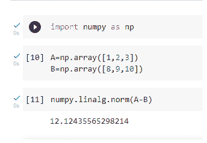**

**Q21。误差和残差有什么区别？**

误差是指预测值和实际值之间的差异。数据科学中计算误差最常用的方法是平均绝对误差(MAE)、均方误差(MSE)和均方根误差(RMSE)。而残差是一组观察值和它们的算术平均值之间的差。误差通常是观察不到的，而剩余误差可以在图上显现出来。误差表示观察数据与实际总体的差异。而残差代表观察数据不同于样本总体数据的方式。

**Q22。规范化和标准化的区别？**

归一化，也称为最小-最大缩放，是一种转换所有数据值使其介于 0 和 1 之间的技术。

归一化的公式是-

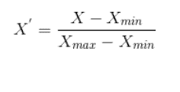

在哪里，

X_max 是特征的最大值

X_min 是特征的最小值

标准化是指转换我们的数据，使数据呈正态分布，均值为 0，标准差为 1。

标准化的公式是-

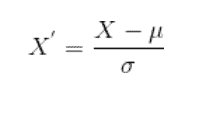

因此，虽然规范化仅将数据重新调整到从 0 到 1 的范围内，但标准化可确保数据遵循标准正态分布。

Want to upskill yourself to get ahead in your career? Check out this video

## **2023 年要学的十大技术| Edureka**

     本数据科学面试问答视频将帮助您为数据科学和大数据分析面试做好准备。该视频非常适合初学者以及希望学习或重温数据科学、大数据分析和机器学习概念的专业人士。

[https://www.youtube.com/embed/M2NyXKxyUGc](https://www.youtube.com/embed/M2NyXKxyUGc)

**了解我们在顶级城市开设的数据科学与 Python 课程**

| 印度 | 美国 | 其他热门城市 |
| [海得拉巴的数据科学与 Python 培训](https://www.edureka.co/data-science-python-certification-course-hyderabad) | [达拉斯的数据科学与 Python 课程](https://www.edureka.co/data-science-python-certification-course-dallas) | [德里的数据科学与 Python 课程](https://www.edureka.co/data-science-python-certification-course-delhi) |
| [班加罗尔的数据科学与 Python 培训](https://www.edureka.co/data-science-python-certification-course-bangalore) | [夏洛特的 Python 数据科学](https://www.edureka.co/data-science-python-certification-course-charlotte) | [孟买的数据科学与 Python 课程](https://www.edureka.co/data-science-python-certification-course-mumbai) |
| [钦奈的数据科学与 Python 培训](https://www.edureka.co/data-science-python-certification-course-chennai) | [纽约的数据科学与 Python 课程](https://www.edureka.co/data-science-python-certification-course-new-york-city) | [西雅图的数据科学与 Python 课程](https://www.edureka.co/data-science-python-certification-course-seattle) |

## **统计面试问题**

### **Q23。“长”和“宽”格式数据有什么区别？**

在**宽格式**中，受试者的重复回答将在一行中，每个回答在单独的一列中。在**长格式**中，每一行是每个科目的一个时间点。您可以通过列通常表示组这一事实来识别宽格式的数据。

**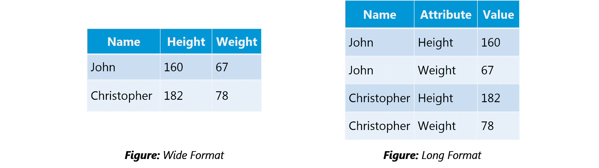**

### **Q24。你对正态分布这个术语的理解是什么？**

数据通常以不同的方式分布，或者偏向左边，或者偏向右边，或者全都混在一起。

然而，数据有可能分布在一个中心值周围，没有任何向左或向右的偏差，并以钟形曲线的形式达到正态分布。

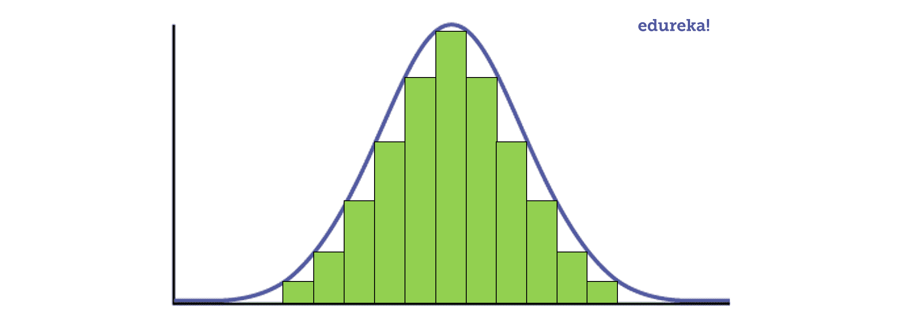

**图:** *呈正态分布的钟形曲线*

随机变量以对称的钟形曲线的形式分布。

正态分布的性质如下:

1.  **单峰**-一种模式

2.  **对称**——左右两半是镜像

3.  **钟形**-平均最高高度(模式)

4.  均值、众数和中值都位于中心

5.  渐近

### **Q25。统计学中的相关和协方差是什么？**

协方差和相关性是两个数学概念；这两种方法在统计学中被广泛使用。相关性和协方差建立了关系，也度量了两个随机变量之间的相关性。虽然这两者之间的工作在数学上是相似的，但它们是不同的。

**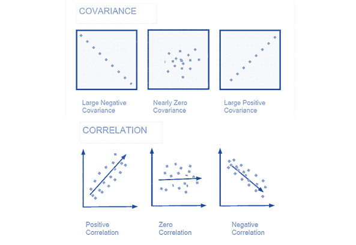相关性**:相关性被认为或被描述为衡量和估计两个变量之间数量关系的最佳技术。相关性衡量两个变量的相关程度。

**协方差**:在协方差中，两个项目一起变化，它是一种度量，表示两个随机变量在周期中变化的程度。它是一个统计学术语；它解释了一对随机变量之间的系统关系，其中一个变量的变化与另一个变量的相应变化相反。

### **Q26。点估计和置信区间有什么区别？**

点估计给我们一个特定的值作为总体参数的估计。矩方法和最大似然估计方法用于导出总体参数的点估计量。

置信区间给出了可能包含总体参数的一系列值。置信区间通常是首选的，因为它告诉我们这个区间包含总体参数的可能性有多大。这种可能性或概率称为置信水平或置信系数，用 1-α表示，其中α是显著性水平。

**Q27。A/B 测试的目的是什么？**

这是对带有两个变量 A 和 b 的随机实验的假设检验。

A/B 测试的目标是识别网页的任何变化，以最大化或增加感兴趣的结果。A/B 测试是为你的企业找出最佳网上推广和营销策略的一个极好的方法。它可以用来测试从网站文案到销售邮件再到搜索广告的所有东西

这方面的一个例子是确定横幅广告的点击率。

**Q28。什么是 p 值？**

在统计中执行假设检验时，p 值可以帮助您确定结果的强度。p 值是一个介于 0 和 1 之间的数字。基于该值，它将表示结果的强度。正在审理的主张被称为无效假设。

低 p 值(≤ 0.05)表示反对零假设的强度，这意味着我们可以拒绝零假设。高 p 值(≥ 0.05)表示零假设的强度，这意味着我们可以接受零假设。p 值为 0.05 表示假设可能是两种情况。换句话说，

高 P 值:您的数据可能为真空值。低 P 值:您的数据不太可能为真空值。

**Q29。在任何 15 分钟的间隔内，有 20%的概率会看到至少一颗流星。你在一小时内看到至少一颗流星的可能性有多大？**

15 分钟内看不到流星的概率是

= 1–P(看到一颗流星)= 1–0.2 = 0.8

一小时内看不到流星的概率

= (0.8) ^ 4 = 0.4096

一小时内看到至少一颗流星的概率

= 1–P(看不到任何星星)= 1–0.4096 = 0.5904

**Q30。你如何用一个骰子产生一个介于 1-7 之间的随机数？**

*   任何骰子都有六个面，从 1 到 6。一次掷骰子不可能得到七个相等的结果。 如果我们掷骰子两次，并考虑两次掷骰子的事件，我们现在有 36 种不同的结果。

*   为了得到 7 个相等的结果，我们必须把 36 减少到能被 7 整除的数。因此，我们只能考虑 35 种结果，排除另一种。

*   一个简单的场景可以是排除组合(6，6)，即如果 6 出现两次，则再次掷骰子。

*   从(1，1)到(6，5)的所有剩余组合可以分成 7 部分，每部分 5 个。这样，所有七组结果的可能性是相等的。

**Q31。某对夫妇告诉你，他们有两个孩子，其中至少有一个是女孩。他们生两个女孩的概率有多大？**

在两个孩子的情况下，有 4 种同样可能的可能性

**BB，BG，GB，GG；**

其中 **B** =男孩 **G** =女孩，第一个字母代表第一个孩子。

从问题中，我们可以排除 BB 的第一种情况。 由此从 **BG** 、 **GB** & **BB** 剩下的 3 种可能性中，我们要找出有两个女孩的情况的概率。

因此，P(有两个女孩给一个女孩)=**1/3**

**Q32。一个罐子有 1000 个硬币，其中 999 个是公平的，1 个是双头的。随机选一枚硬币，掷 10 次。假设你看到 10 个正面，那么下一次掷硬币也是正面的概率是多少？**

有两种选择硬币的方法。一个是选一枚公平的硬币，另一个是选有两个头的。

选择公平币的概率= 999/1000 =**0.999**选择不公平币的概率= 1/1000 = **0.001**

连续选择 10 个头像=选择公平硬币*获得 10 个头像+选择不公平硬币

**p(a)=**0.999 *(1/2)^5 = 0.999 *(1/1024)=**0.000976****p(b)=**0.001 * 1 =**p(a/a+b)=**0.000976/(0.000999)

**选择另一个人头的概率=**P(A/A+B)* 0.5+P(B/A+B)* 1 = 0.4939 * 0.5+0.5061=**0.7531**

**Q33。你所理解的敏感性的统计能力是什么，你是如何计算的？**

灵敏度通常用于验证分类器(逻辑、SVM、随机森林等)的准确性。).

敏感度无非是“预测真实事件/总事件”。这里的真实事件是真实的事件，并且模型也预测它们是真实的。

季节性的计算非常简单。

=(**真阳性** ) / ( **实际因变量中的阳性** )

**Q34。为什么要重新采样？**

在以下任何情况下都会进行重采样:

*   通过使用可访问数据的子集或从一组数据点中随机抽取替换数据来估计样本统计的准确性

*   执行显著性测试时替换数据点上的标签

*   通过使用随机子集验证模型(引导，交叉验证)

**Q35。过拟合和欠拟合有什么区别？**

在统计学和机器学习中，最常见的任务之一就是将*模型*拟合到一组训练数据上，从而能够对一般的未训练数据做出可靠的预测。

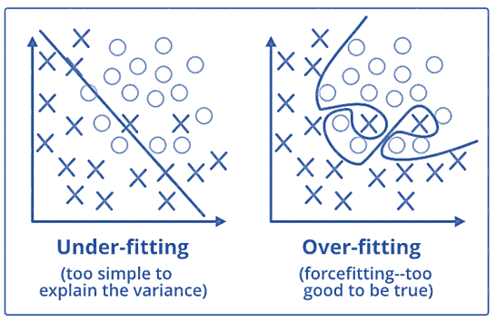

在**过拟合**中，统计模型描述的是随机误差或噪声，而不是潜在的关系。当模型过于复杂时，例如相对于观察值的数量而言参数过多，就会出现过度拟合。过度拟合的模型具有较差的预测性能，因为它对训练数据中的微小波动反应过度。

**当统计模型或机器学习算法无法捕捉数据的潜在趋势时，就会出现欠拟合**。例如，当将线性模型拟合到非线性数据时，会出现欠拟合。这种模型的预测性能也很差。

**Q36。如何对抗过拟合和欠拟合？**

为了应对过度拟合和欠拟合，您可以对数据进行重新采样，以估计模型的准确性(k 倍交叉验证),并通过验证数据集来评估模型。

**Q37。什么是正规化？为什么有用？**

正则化是向模型添加调整参数以诱导平滑度从而防止过度拟合的过程。这通常是通过在现有的权重向量上增加一个常数倍数来实现的。这个常数通常是 L1(套索)或 L2(山脊)。然后，模型预测应该最小化在正则化训练集上计算的损失函数。

**Q38。什么是大数定律？**

这是一个描述多次进行相同实验的结果的定理。这个定理构成了**频率式**思维的基础。它说样本均值，样本方差和样本标准差收敛到他们试图估计的值。

**Q39。什么是混杂变量？**

在统计学中，混杂因素是既影响因变量又影响自变量的变量。

例如，如果你正在研究缺乏锻炼是否会导致体重增加，

**缺乏锻炼=独立变量**

**体重增加=因变量。**

这里的混杂变量可以是影响这两个变量的任何其他变量，例如受试者的年龄。

**Q40。取样过程中可能出现的偏差类型有哪些？**

*   选择偏差

*   覆盖偏差不足

*   生存偏差

**Q41。什么是生存偏差？**

这是一个逻辑错误，聚焦于那些支持幸存下来的进程的方面，而不经意地忽略了那些因为缺乏重要性而不起作用的方面。这可能以多种不同的方式导致错误的结论。

**Q42。什么是选择偏差？**

当获得的样本不能代表要分析的群体时，就会出现选择偏倚。

**Q43。解释 ROC 曲线是如何工作的？**

**ROC** 曲线是各种阈值下真阳性率和假阳性率对比的图形表示。它通常被用作敏感度(真阳性率)和假阳性率之间权衡的替代。

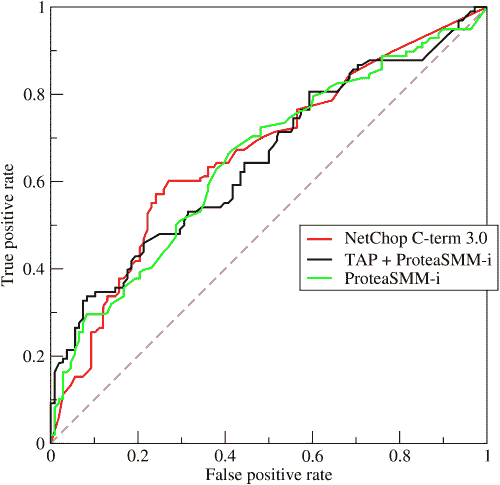

**Q44。什么是 TF/IDF 矢量化？**

TF–IDF 是 term frequency-inverse document frequency 的缩写，是一种数字统计，旨在反映一个词对集合或语料库中的文档有多重要。它经常被用作信息检索和文本挖掘中的加权因子。

TF–IDF 值与某个单词在文档中出现的次数成比例增加，但会被该单词在语料库中的频率抵消，这有助于调整某些单词通常出现频率更高的事实。

**Q45。为什么我们通常使用 Softmax 非线性函数作为网络中的最后操作？**

这是因为它接受一个实数向量，并返回一个概率分布。其定义如下。设 x 是一个实数的向量(正的，负的，随便，没有约束)。

则 Softmax( *x)的第 I 个分量是—*

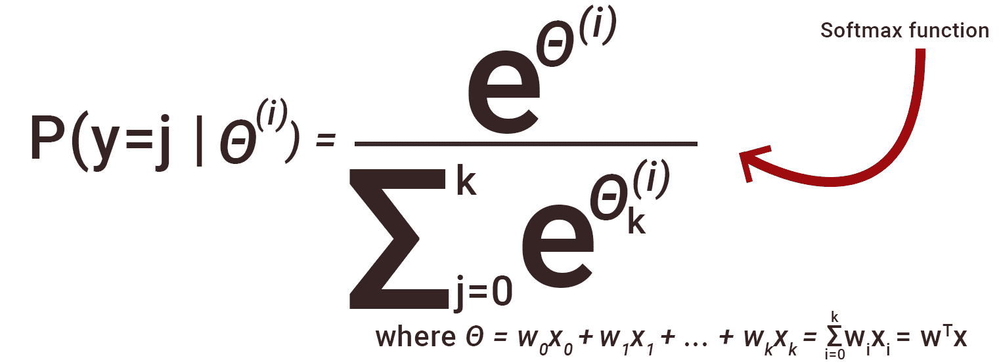

应该清楚的是，输出是一个概率分布:每个元素都是非负的，所有分量的和是 1。

## **数据分析面试题**

**Q46。Python 和 R——对于文本分析，你更喜欢哪一个？**

我们会更喜欢 Python，原因如下:

*   [***Python***](https://www.edureka.co/blog/programming-with-python-tutorial/)将是最好的选择，因为它有 Pandas 库，提供易于使用的数据结构和高性能的数据分析工具。

*   [***R***](https://www.edureka.co/blog/what-is-r-programming/) 比单纯的文本分析更适合机器学习。

*   对于所有类型的文本分析，Python 的执行速度都更快。

**Q47。数据清理如何在分析中发挥至关重要的作用？**

数据清理有助于分析，因为:

*   从多个来源清理数据有助于将数据转换成数据分析师或数据科学家可以使用的格式。

*   数据清洗有助于提高机器学习中模型的准确性。

*   这是一个繁琐的过程，因为随着数据源数量的增加，由于数据源的数量和这些数据源生成的数据量，清理数据所需的时间会呈指数增长。

*   清理数据可能需要 80%的时间，这使其成为分析任务的关键部分。

**Q48。区分单变量、双变量和多变量分析。**

***单变量**分析*是一种描述性统计分析技术，可根据给定时间点涉及的变量数量进行区分。例如，基于地区的销售饼图只包含一个变量，这种分析可以称为单变量分析。

***双变量**分析*试图在散点图中同时了解两个变量之间的差异。 例如，分析销售额和支出额可以被认为是双变量分析的一个例子。

***多变量分析*** 处理两个以上变量的研究，以了解变量对反应的影响。

**Q49。解释星形模式。**

它是一个传统的数据库模式，有一个中央表。附属表将 ID 映射到物理名称或描述，并且可以使用 ID 字段连接到中央事实表；这些表被称为查找表，主要用于实时应用，因为它们节省大量内存。有时，星型模式涉及几层总结，以便更快地恢复信息。

**Q50。什么是整群抽样？**

**整群抽样**是一种在难以研究广泛分布的目标人群且简单的随机抽样无法适用时使用的技术。 聚类样本是一种概率样本，其中每个抽样单元都是元素的集合或聚类。

例如，一位研究人员想调查日本高中生的学习成绩。他可以把整个日本的人口分成不同的集群(城市)。然后，研究人员通过简单或系统的随机抽样，根据他的研究选择一些集群。

让我们继续我们的数据科学面试问题博客，提出更多的统计问题。

**Q51。什么是系统抽样？**

*系统抽样*是一种从有序抽样框架中选取元素的统计技术。I n 系统化采样，列表以循环的方式进行，所以一旦到达列表的末尾，就又从顶部开始进行。系统抽样的最好例子是等概率法。

**Q52。什么是特征向量和特征值？**

*特征向量*用于理解线性变换。 在数据分析中，我们通常计算相关矩阵或协方差矩阵的特征向量。 特征向量是特定线性变换通过翻转、压缩或拉伸而作用的方向。

*特征值*可以指在特征向量方向上变换的强度或者压缩发生的因子。

**Q53。你能举出一些假阳性比假阴性更重要的例子吗？**

我们先来了解一下什么是假阳性和假阴性。

*   假阳性是指你错误地将一个非事件归类为一个事件，也就是一类错误。

*   是指你错误地将事件归类为非事件，也就是第二类错误。

***举例 1:*** 在医疗领域，假设你要给病人化疗。假设一个病人来到医院，根据实验室的预测，他的癌症检测呈阳性，但他实际上没有癌症。这是一个假阳性的例子。在这种情况下，当这个病人实际上没有患癌症时，开始对他进行化疗是非常危险的。在没有癌细胞的情况下，化疗会对他的正常健康细胞造成一定的损害，并可能导致严重的疾病，甚至癌症。

***示例 2:*** 假设一家电子商务公司决定向顾客赠送 1000 美元的礼券，他们假定顾客购买了至少价值 10，000 美元的商品。他们直接向 100 名顾客发送免费的代金券邮件，没有任何最低购买条件，因为他们认为销售价值超过 10，000 美元的商品至少可以获得 20%的利润。现在的问题是，如果我们将价值 1000 美元的礼券发给那些实际上没有购买任何东西，但被标记为购买了价值 10，000 美元的商品的客户。

**Q54。你能举出一些假阴性比假阳性更重要的例子吗？**

***示例 1* :** 假设有一个机场“A”已经接收到高度安全威胁，并且基于某些特征，它们识别特定乘客是否可能是威胁。 由于人手不足，他们决定扫描被预测模型预测为风险阳性的乘客。如果机场模型将真正的威胁客户标记为非威胁客户，会发生什么情况？

***例 2* :** 如果陪审团或法官决定释放一名罪犯，该怎么办？

***例 3* :** 如果你根据自己的预测模型拒绝嫁给一个非常优秀的人，而你几年后碰巧遇到他/她，并意识到自己有假阴性，会怎么样？

**Q55。你能举一些假阳性和假阴性同样重要的例子吗？**

在**银行业**中，发放贷款是赚钱的主要来源，但与此同时，如果你的还款率不好，你将赚不到任何利润，反而会冒巨大损失的风险。

银行不想失去好客户，同时也不想收购坏客户。在这种情况下，误报和漏报都变得非常重要。

**Q56。你能解释一下验证集和测试集的区别吗？**

一个 ***确认** **集合*** 可以被认为是训练集合的一部分，因为它被用于参数选择并且避免被建立的模型的过度拟合。

另一方面， ***测试集*** 用于测试或评估经过训练的机器学习模型的性能。

简单来说，差异可以概括为；训练集用于拟合参数，即权重，t est 集用于评估模型的性能，即评估预测能力和泛化能力。

**Q57。解释交叉验证。**

**交叉验证**是一种模型验证技术，用于评估统计分析的结果如何**将**推广到**独立数据集**。 主要用在目标是预测的背景下，人们希望估计一个模型在实践中会实现多精确。

交叉验证的目标是在训练阶段对数据集(即验证数据集)进行术语化以测试模型，从而限制过度拟合等问题，并深入了解模型将如何推广到独立的数据集。

## **机器学习面试问题**

### **Q58。什么是机器学习？**

[***机器学习***](https://www.edureka.co/blog/machine-learning-tutorial/) 探索研究和构建能够对数据进行学习和预测的算法。 与计算统计学密切相关。 用于设计复杂的模型和算法，这些模型和算法有助于进行预测，在商业应用中称为预测分析。下面给出了一幅图像，代表了机器学习适用的各个领域。

****

### **Q59。什么是监督学习？**

[***监督学习***](https://www.edureka.co/blog/supervised-learning/) 是从标注的训练数据中推断出一个函数的机器学习任务。训练数据由一组训练示例组成。

算法:支持向量机、回归、朴素贝叶斯、决策树、K-最近邻算法和神经网络

*例如，如果你建立了一个水果分类器，标签将会是“这是一个桔子，这是一个苹果，这是一个香蕉”，基于显示苹果、桔子和香蕉的分类器示例。*

### **Q60。什么是无监督学习？**

[***无监督学习***](https://www.edureka.co/blog/unsupervised-learning/) 是一种机器学习算法，用于从没有标记响应的输入数据组成的数据集进行推断。

算法:聚类、异常检测、神经网络和潜在变量模型

*例如，在同一示例中，水果聚类将被分类为“具有软皮和许多酒窝的水果”、“具有闪亮硬皮的水果”和“细长的黄色水果”。*

### **Q61。各种分类算法有哪些？**

该图列出了最重要的[](https://www.edureka.co/blog/classification-algorithms/)分类算法。

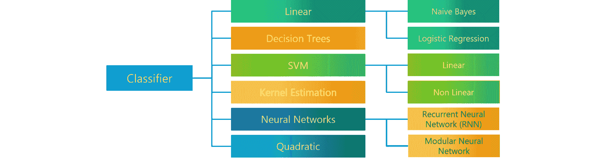

### **Q62。朴素贝叶斯中的“朴素”是什么？**

[***朴素贝叶斯算法***](https://www.edureka.co/blog/naive-bayes-in-r/) 基于贝叶斯定理。贝叶斯定理描述了一个事件发生的概率，基于可能与该事件相关的条件的先验知识。

该算法是“幼稚的”,因为它做出的假设可能是正确的，也可能不是正确的。

**Q63。如何构建随机森林模型？**

随机森林模型将许多决策树模型结合在一起。选择的决策树具有高偏差和低方差。这些决策树并行放置。每个决策树采用替换的行和列的样本子集。记录每个决策树的结果，并且取大多数作为答案，在分类问题的情况下是众数，在回归问题的情况下是平均值和中值。

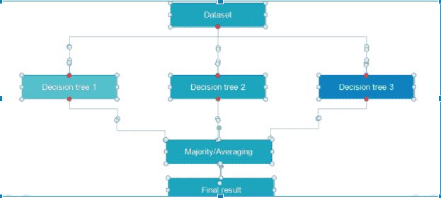

### **Q64。详细解释 SVM 算法。**

[](https://www.edureka.co/blog/support-vector-machine-in-r/)代表支持向量机，它是一种有监督的机器学习算法，既可用于  ***回归*又可用于分类**。如果训练数据集中有 n 个要素，SVM 会尝试在 n 维空间中绘制这些要素，每个要素的值都是特定坐标的值。SVM 基于提供的核函数使用超平面来分离不同的类。

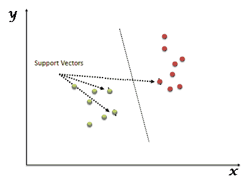

### **Q65。SVM 的支持向量是什么？**

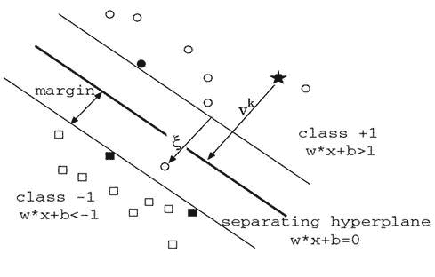

在图中，我们看到较细的线标记了从分类器到最近的数据点的距离，这些数据点称为支持向量(深色数据点)。两条细线之间的距离称为边距。

### **Q66。SVM 有哪些不同的果仁？**

SVM 有四种核仁。

1.  线性核

2.  多项式核

3.  径向基核

4.  Sigmoid 内核

### **Q67。详细讲解决策树算法。**

一种 [***决策树***](https://www.edureka.co/blog/decision-tree-algorithm/) 是一种有监督的机器学习算法，主要用于**回归和分类**。它将一个数据集分解成越来越小的子集，与此同时，一个相关的决策树被增量开发。最终结果是一个有决策节点和叶节点的树。决策树可以处理分类数据和数字数据。

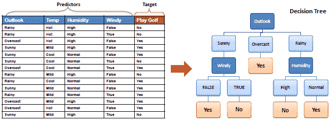

### **Q68。决策树算法中的熵和信息增益是什么？**

构建决策树的核心算法叫做  **ID3** 。  **ID3** 利用  **熵** 和  **信息增益** [***来构造决策树。***](https://www.edureka.co/blog/decision-trees/)

**熵**

决策树是从根节点自上而下构建的，包括将数据划分为同类子集。  **ID3** 使用 enteropy 检查样本的同质性。如果样本是完全均质的，那么熵为零，如果样本是均分的，那么熵为一。


**信息增益**

**信息增益** 基于数据集在属性上拆分后熵的减少。构建决策树就是要找到能获得最高信息增益的属性。

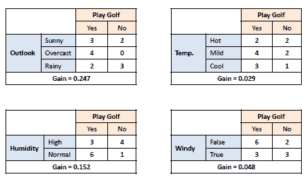

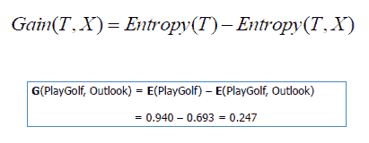

### **Q69。决策树中的剪枝是什么？**

**修剪** 是机器学习和搜索算法中的一种技术，它通过删除树中几乎不提供实例分类能力的部分来减小 **决策树** 的大小。所以，当我们删除一个决策节点的子节点时，这个过程叫做 [***剪枝***](https://www.edureka.co/blog/implementation-of-decision-tree/) 或者相反的分裂过程。

### **Q70。什么是逻辑回归？列举一个你最近使用逻辑回归的例子。**

[***逻辑回归***](https://www.edureka.co/blog/logistic-regression-in-r/) 通常被称为 logit 模型是一种从预测变量的线性组合预测二元结果的技术。

例如，如果你想预测某个特定的政治领袖是否会赢得选举。 在这种情况下，预测的结果是二进制的即 0 或 1(赢/输)。这里的预测变量将是特定候选人竞选活动花费的金额，竞选活动花费的时间等。

### **Q71。什么是线性回归？**

[**线性回归**](https://www.edureka.co/blog/linear-regression-in-python/) 是一种统计技术，根据第二个变量 X 的得分来预测变量 Y 的得分。X 被称为预测变量，Y 被称为标准变量。

**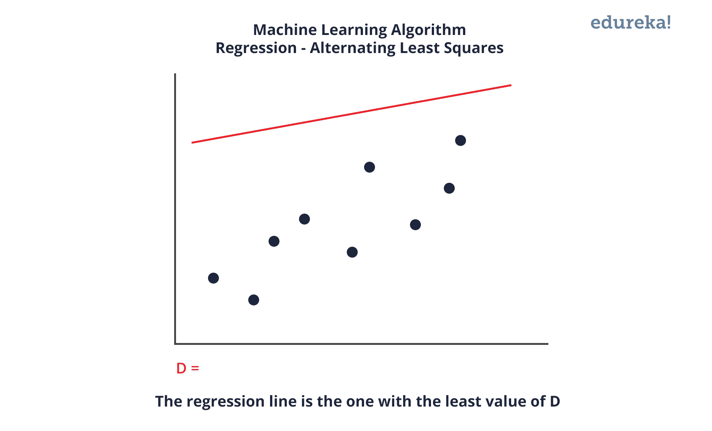**

### **Q72。线性模型的缺点是什么？**

线性模型的一些缺点是:

*   误差的线性假设。

*   它不能用于计数结果或二元结果

*   存在它无法解决的过度拟合问题

### **Q73。回归和分类 ML 技术有什么区别？**

回归和分类机器学习技术都属于  **监督机器学习算法**。在监督机器学习算法中，我们必须使用带标签的数据集来训练模型，而训练我们必须显式地提供正确的标签，并且算法试图从输入到输出学习模式。如果我们的标签是离散值，那么这将是一个分类问题，例如 A，B 等。但是，如果我们的标签是连续值，那么这将是一个回归问题，例如 1.23，1.333 等。

### **Q74。什么是推荐系统？**

[**推荐系统**](https://www.edureka.co/blog/videos/science-behind-product-recommendation-with-r-programming/) 是信息过滤系统的一个子类，旨在预测用户对产品的偏好或评级。 推荐系统广泛应用于电影、新闻、研究文章、产品、社交标签、音乐等。

*例子包括 IMDB 中的电影推荐、网飞& BookMyShow、亚马逊等电子商务网站中的产品推荐、易贝& Flipkart、YouTube 视频推荐和 Xbox 中的游戏推荐。*

### **Q75。什么是协同过滤？**

大多数推荐系统使用的过滤过程，通过协作视点、各种数据源和多个代理来发现模式或信息。

**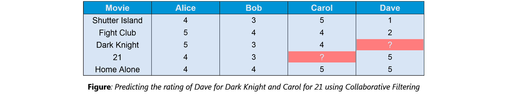**

协作过滤的一个示例可以是基于特定用户对其他电影的评级和其他人对所有电影的评级来预测他/她的评级。这个概念被广泛应用于 IMDB、网飞& BookMyShow 中的电影推荐，亚马逊、易贝& Flipkart 等电商网站中的产品推荐，YouTube 视频推荐以及 Xbox 中的游戏推荐。

### **Q76。如何处理异常值？**

通过使用单变量或任何其他图形分析方法，可以识别异常值。 如果异常值的数量很少，那么它们可以单独评估，但是对于大量异常值，这些值可以替换为第 99 或第 1 百分位值。

所有的极值都不是离群值。 处理离群值的最常见方法

1.  改变数值，使其在一个范围内。

2.  删除该值。

### **Q77。分析项目中涉及的各个步骤是什么？**

以下是分析项目 : 中涉及的各种 [***步骤***](https://www.edureka.co/blog/data-science-projects/)

1.  了解业务问题

2.  探索数据，熟悉数据。

3.  通过检测异常值、处理缺失值、转换变量等为建模准备数据。

4.  数据准备好后，开始运行模型，分析结果并调整方法。这是一个迭代的步骤，直到获得最好的结果。

5.  使用新的数据集验证模型。

6.  开始实施模型并跟踪结果，以分析模型在一段时间内的表现。

### **Q78。在分析过程中，如何处理丢失的值？**

在识别具有缺失值的变量之后，识别缺失值的程度。 如果发现了任何模式，分析师必须专注于它们，因为这可能会带来有趣而有意义的商业见解。

如果没有识别出模式，那么缺失值可以用平均值或中间值代替(插补),或者可以忽略。 指定默认值，可以是平均值、最小值或最大值。进入数据很重要。

如果是分类变量，则分配默认值。缺少的值被赋予默认值。 如果你有一个分布的数据到来，对于正态分布给出平均值。

如果一个变量的 80%的值都丢失了，那么你可以回答你将删除这个变量，而不是处理丢失的值。

### **Q79。如何定义聚类算法中的聚类数？**

虽然没有规定聚类算法，但是这个问题大多是参考 [***K-Means 聚类***](https://www.edureka.co/blog/k-means-clustering/) 其中“K”定义了聚类的个数。

例如，下图显示了三个不同的组。

内平方和一般用于解释聚类内的同质性。如果你为一系列的集群绘制 WSS，你会得到如下图。


*   该图一般被称为。

*   上图中用红色圈出的点，即 ***聚类数=6*** 是 WSS 看不到任何减量的点。

*   该点称为**弯曲**点，在 K-Means 中记为 K。

这是一种广泛使用的方法，但很少有数据科学家首先使用层次聚类来创建树状图，并从中识别不同的组。

### **Q80。什么是集成学习？**

集成学习基本上是将一组不同的学习者(单个模型)组合在一起，以即兴发挥模型的稳定性和预测能力。

### **Q81。简要描述任何类型的集成学习？**

集成学习有许多类型，但下面提到两种更流行的集成学习技术。

**装袋**

Bagging 试图在小样本人群中实现相似的学习器，然后取所有预测的平均值。在广义 bagging 中，您可以对不同的人群使用不同的学习者。如你所料，这有助于我们减少方差误差。

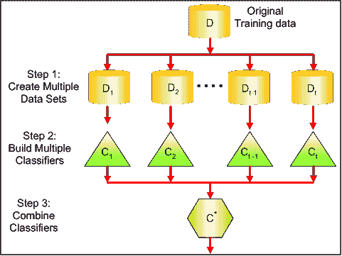

**增压**

[***增强***](https://www.edureka.co/blog/boosting-machine-learning/) 是一种迭代技术，它根据上一次分类调整观察的权重。  如果一个观察被错误分类，它试图增加这个观察的权重，反之亦然。总体来说，增强减少了偏差误差，并建立了强大的预测模型。但是，它们可能会过度适应训练数据。

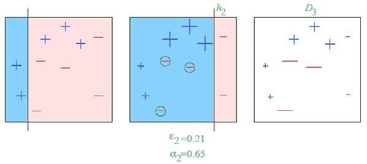

# 

**Q82。什么是随机森林？它是如何工作的？**

[***随机森林***](https://www.edureka.co/blog/random-forest-classifier/) 是一种多功能的机器学习方法，能够执行回归和分类任务。它还用于降维，处理缺失值和异常值。这是一种集成学习方法，其中一组弱模型组合起来形成一个强模型。

在随机森林中，我们种植多棵树，而不是一棵树。为了根据属性对新对象进行分类，每棵树都给出一个分类。森林选择具有最多**票数**(森林中所有树木)的分类，在回归的情况下，它取不同树木输出的平均值。

### **Q83。你是如何走向随机森林的？**

这种技术的基本原理是几个弱学习者联合起来提供一个敏锐的学习者。涉及的步骤有

*   在数据的引导训练样本上建立几个决策树
*   在每棵树上，每次考虑分裂时，从所有 pp 预测值中选择 mm 预测值的随机样本作为分裂候选值
*   经验法则:每次分割时 m=p√m=p
*   预测:在多数人规则下

### **Q84。你会对时间序列数据集使用什么交叉验证技术？**

不要使用 k-fold 交叉验证，您应该意识到这样一个事实，即时间序列不是随机分布的数据-它本质上是按时间顺序排序的。

对于时间序列数据，您应该使用 forward=chaining 这样的技术，即您将基于过去的数据建模，然后查看未来的数据。

**折叠 1:培训[1]，测试[2]**

**折叠 1:训练【1 2】，测试【3】**

**折叠 1:训练[1 2 3]，测试[4]**

**折叠 1:训练[1 2 3 4]，测试[5]**

### **Q85。什么是 Box-Cox 变换？**

回归分析的因变量可能不满足普通最小二乘回归的一个或多个假设。残差可以随着预测的增加而弯曲，也可以遵循偏态分布。在这种情况下，有必要转换响应变量，以便数据满足所需的假设。Box cox 变换是一种将非正态因变量变换为正态形状的统计技术。如果给定的数据是非正态的，那么大多数统计技术都假设是正态的。应用 box cox 转换意味着您可以运行更多的测试。


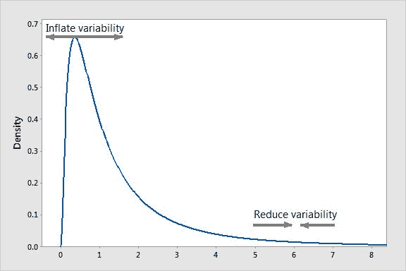


Box-Cox 变换是一种将非正常因变量转换为正常形状的方法。对于许多统计技术来说，正态性是一个重要的假设，如果你的数据不是正态的，应用 Box-Cox 意味着你可以进行更多的测试。博克斯-考克斯变换是以统计学家 ***乔治·博克斯*** 和 ***大卫·罗克斯比·科克斯*** 的名字命名的，他们在 1964 年合作发表了一篇论文并开发了这项技术。

### **Q86。算法必须多久更新一次？**

在以下情况下，您可能需要更新算法:

*   您希望模型像数据流一样通过基础设施发展

*   基础数据源正在发生变化

*   存在非平稳性的情况

*   算法性能不佳/结果缺乏准确性

### **Q87。如果您的机器有 4GB RAM，并且您想在 10GB 数据集上训练您的模型。你会如何处理这个问题？在你迄今为止的机器学习/数据科学经历中，有没有遇到过这种问题？**

首先你要问你想培养哪种 ML 模式？

**对于神经网络:** 批量大小用 Numpy 数组就可以了。

**步骤:**

1.  加载 Numpy 数组中的所有数据。Numpy 数组有一个属性来创建完整数据集的映射，它不在内存中加载完整数据集。

2.  您可以向 Numpy 数组传递一个索引来获取所需的数据。

3.  使用这些数据传递给神经网络。

4.  批量小。

**对于 SVM:** 局部配合会起作用

**步骤:**

1.  将一个大数据集分成小数据集。

2.  使用 SVM 的部分拟合方法，它需要完整数据集的子集。

3.  对其他子集重复步骤 2。

然而，你可能会在现实中面临这样的问题。所以，你可以查看一下 [***最适合机器学习的笔记本电脑***](https://www.edureka.co/blog/best-laptop-for-machine-learning/) 来防止这种情况。说了这么多，接下来说一些关于深度学习的问题。

## **深度学习面试问题**

### **Q88。深度学习是什么意思？**

[***深度学习***](https://www.edureka.co/blog/deep-learning-with-python/) 只不过是近年来展现出令人难以置信前景的机器学习范例。这是因为深度学习与人脑的功能有很大的相似性。

### **Q89。机器学习和深度学习有什么区别？**

机器学习是计算机科学的一个领域，它赋予计算机在没有明确编程的情况下进行学习的能力。机器学习可以分为以下三类。

1.  监督机器学习，

2.  无监督的机器学习，

3.  强化学习

深度学习是机器学习的一个子领域，涉及被称为人工神经网络的大脑结构和功能所启发的算法。

### **Q90。在你看来，最近一段时间深度学习流行的原因是什么？**

虽然深度学习已经存在很多年了，但这些技术的重大突破只是在最近几年才出现。这是因为两个主要原因:

*   通过各种来源生成的数据量的增加

*   运行这些模型所需的硬件资源的增长

GPU 比我们以前需要的时间快好几倍，它们帮助我们在相对较短的时间内建立更大、更深的深度学习模型。

**Q91。解释神经网络基础知识**

数据科学中的神经网络旨在模拟人脑神经元，其中不同的神经元组合在一起并执行一项任务。它从数据中学习归纳或模式，并使用这些知识来预测新数据的输出，而无需任何人工干预。

最简单的神经网络可以是感知器。它包含一个执行 2 个操作的单个神经元、所有输入的加权和以及一个激活函数。

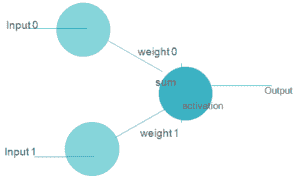

更复杂的神经网络由以下 3 层组成

1.  **输入层**–接收输入
2.  **隐藏层**-这些是输入层和输出层之间的层。最初的隐藏层通常有助于检测低级别模式，而进一步的层组合来自先前层的输出以找到更多的模式。
3.  **输出层**–输出层是输出预测的最后一层。

下图显示了一个神经网络-

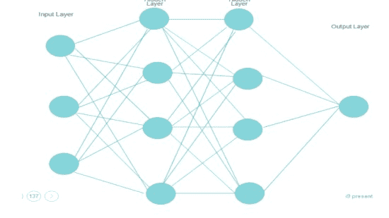

### **Q92。什么是强化学习？**

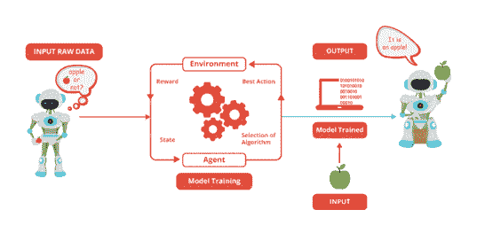 [* **强化学习** *](https://www.edureka.co/blog/q-learning/) 就是学习做什么以及如何将情境映射到行动。最终结果是最大化数字奖励信号。学习者不会被告知采取哪种行动，而是必须发现哪种行动会产生最大的回报。强化学习受人类学习的启发，基于奖惩机制。

### **Q93。什么是人工神经网络？**

人工神经网络是一套特定的算法，它彻底改变了机器学习。他们受到生物神经网络的启发。 [**神经网络**](https://www.edureka.co/blog/neural-network-tutorial/) 能够适应输入的变化，因此网络产生最佳的可能结果，而无需重新设计输出标准。

### **Q94。描述人工神经网络的结构？**

人工神经网络的工作原理与生物神经网络相同。它由输入组成，在激活函数的帮助下，用加权和及偏差进行处理。


### **Q95。网络中的权重是如何初始化的？**

这里有两种方法:我们可以将权重初始化为零，或者随机分配它们。

将所有权重初始化为 0:这使您的模型类似于线性模型。所有的神经元和每一层都执行相同的操作，给出相同的输出，使深网无用。

随机初始化所有权重:这里，权重是通过将它们初始化为非常接近 0 来随机分配的。因为每个神经元执行不同的计算，所以它为模型提供了更好的准确性。这是最常用的方法。

**Q96。成本函数是什么？**

成本函数也称为“损失”或“误差”，是一种评估模型性能好坏的方法。它用于计算反向传播过程中输出层的误差。我们通过神经网络将该误差向后推，并在不同的训练函数中使用。

**Q97。什么是超参数？**

对于神经网络，一旦数据被正确格式化，你通常会使用 ***超参数*** 。超参数是在学习过程开始之前设置其值的参数。它决定了一个网络的训练方式和网络的结构(如隐单元数、学习速率、历元数等。).

**Q98。如果学习率设置不准确(过低或过高)会发生什么？**

当你的学习率太低时，模型的训练将进展非常缓慢，因为我们对权重进行最小的更新。在达到最小值之前，需要进行多次更新。

如果学习率设置得太高，由于权重的剧烈更新，这会导致损失函数出现不希望的发散行为。它可能无法收敛(模型可以给出很好的输出)，甚至发散(数据太混乱，网络无法训练)。

### **Q99。深度学习中的 Epoch、Batch、迭代有什么区别？**

*   epoch–表示整个数据集的一次迭代(训练模型中的所有内容)。

*   批处理–指的是当我们不能一次将整个数据集传递到神经网络中时，因此我们将数据集分成几批。

*   迭代–如果我们有 10，000 张图像作为数据，批量大小为 200。那么一个时期应该运行 50 次迭代(10，000 除以 50)。

### **Q100。CNN 上有哪些不同的层？**

[***CNN***共有四层:](https://www.edureka.co/blog/convolutional-neural-network/)

1.  **卷积层**–执行卷积操作的层，创建几个更小的图片窗口来浏览数据。

2.  **ReLU Layer**–它给网络带来非线性，将所有负像素转换为零。输出是校正的特征图。

3.  **汇集层**–汇集是一种降低特征图维度的下采样操作。

4.  **全连接层**–该层对图像中的物体进行识别和分类。

### **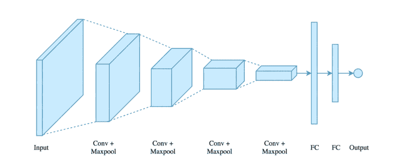 Q101。什么是 CNN 上的共享，它是如何工作的？**

池用于减少 CNN 的空间维度。它执行下采样操作以降低维数，并通过在输入矩阵上滑动过滤矩阵来创建汇集的特征图。

### **Q102。什么是递归神经网络？**

[***RNNs***](https://www.edureka.co/blog/recurrent-neural-networks/) 是一种人工神经网络，用于从时间序列、股票市场和政府机构等数据序列中识别模式。为了理解递归网络，首先，你必须理解前馈网络的基础知识。

这两种网络 RNN 和前馈都是以它们通过在网络节点上执行的一系列数学运算来传递信息的方式命名的。一种是直接传递信息(从不接触同一个节点两次)，另一种是通过循环传递信息，后者称为递归。

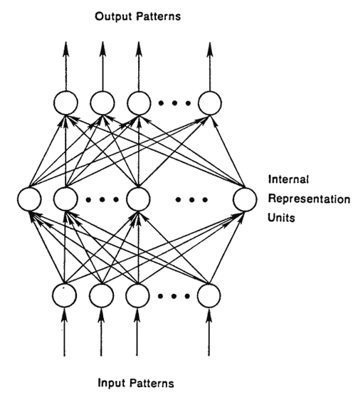

另一方面，循环网络不仅将他们看到的当前输入实例作为输入，还将他们之前感知到的内容作为输入。

递归神经网络在 t-1 时刻做出的决定会影响它在 t 时刻之后做出的决定。因此，递归网络有两个输入源，即现在和最近的过去，它们结合起来决定它们如何对新数据做出反应，就像我们在生活中一样。

它们产生的误差将通过反向传播返回，并用于调整它们的权重，直到误差不能再低。记住，递归网络的目的是准确地对顺序输入进行分类。我们依靠误差的反向传播和梯度下降来做到这一点。

### **Q103。LSTM 网络是如何工作的？**

[***【LSTM】***](https://www.edureka.co/blog/recurrent-neural-networks/#z6)长短期记忆是一种特殊的递归神经网络，能够学习长期依赖关系，将长时间记忆信息作为其默认行为。LSTM 网络有三个步骤:

*   **第一步:** 网络决定忘记什么，记住什么。
*   **第二步:** 它有选择地更新单元格状态值。
*   **第三步:** 网络决定当前状态的哪一部分能够输出。

### **Q104。什么是多层感知器(MLP)？**

如同在 [***神经网络中，MLPs***](https://www.edureka.co/blog/neural-network-tutorial/) 具有输入层、隐藏层和输出层。它与具有一个或多个隐藏层的单层 [***感知器***](https://www.edureka.co/blog/perceptron-learning-algorithm/) 具有相同的结构。单层感知器只能分类二进制输出(0，1)的线性可分类，但 MLP 可以分类非线性类。

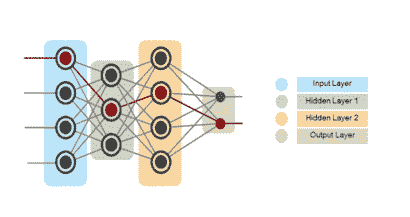除了输入层，其他层的每个节点都使用非线性激活函数。这意味着输入层、传入的数据和激活函数基于所有节点和权重相加，从而产生输出。MLP 使用一种被称为“反向传播”的监督学习方法在 [* **反向传播** *](https://www.edureka.co/blog/backpropagation/) 中，神经网络借助代价函数计算误差。它从错误出现的地方向后传播该错误(调整权重以更准确地训练模型)。

**Q105。时序数据如何声明为文具？**

当时间序列数据的关键参数不随时间变化时，该时间序列被声明为平稳的。这些参数可以是均值或方差。平稳时间序列中没有趋势或季节效应。数据科学模型需要平稳的时间序列数据。下图显示了一个平稳的时间序列。

### ****

### **Q106。解释梯度下降。**

要了解渐变下降，我们先来了解一下什么是 [***渐变***](https://www.edureka.co/blog/gradients-in-css/) 。

一个**梯度**测量一个函数的输出变化有多大，如果你稍微改变输入的话。它只是测量所有重量相对于误差变化的变化。你也可以把梯度想成一个函数的斜率。

**梯度下降**可以认为是向下爬到谷底，而不是爬上一座小山。这是因为它是最小化给定函数的最小化算法(**激活函数**)。

### **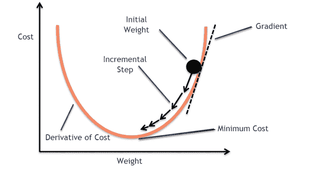 Q107。什么是爆炸渐变？**

在训练 RNN 时，如果您看到  **呈指数增长(非常大)的误差梯度** ，这些误差梯度在训练期间累积并导致神经网络模型权重的非常大的更新，它们被称为爆炸梯度。在极端情况下，权重值可能变得过大，以至于溢出并导致 NaN 值。

这导致你的模型不稳定，无法从你的训练数据中学习。

### **Q108。什么是消失渐变？**

在训练 RNN 时，你的坡度可能会变得太小；这使得训练变得困难。当斜率太小时，这个问题被称为消失梯度。这导致训练时间长、性能差和准确度低。

### **Q109。什么是反向传播并解释它的工作原理。**

[](https://www.edureka.co/blog/backpropagation/)反向传播是一种用于多层神经网络的训练算法。在这种方法中，我们将误差从网络的一端移动到网络内部的所有权重，从而允许有效的梯度计算。

它具有以下步骤:

*   训练数据的前向传播

*   使用输出和目标计算导数

*   用于计算误差输出激活导数的反向传播

*   使用先前计算的输出导数

*   更新权重

### **Q110。反向传播有哪些变种？**

*   **随机梯度下降:** 我们只用单个训练样本来计算梯度和更新参数。

*   **批量梯度下降:** 我们计算整个数据集的梯度，并在每次迭代中执行更新。

*   **小批量梯度下降**:这是最流行的优化算法之一。这是随机梯度下降的一种变体，这里使用的不是单个训练样本，而是小批量样本。

### **Q111。有哪些不同的 [*深度学习框架*](https://www.edureka.co/blog/top-10-machine-learning-frameworks/) ？**

*   [***py torch***](https://www.edureka.co/blog/pytorch-tutorial/)

*   [***张量流***](https://www.edureka.co/blog/tensorflow-image-classification)

*   微软认知工具包

*   Keras

*   咖啡

*   链条机

### **Q112。激活功能的作用是什么？**

***激活函数*** 用于将非线性引入神经网络，帮助其学习更复杂的函数。没有它，神经网络将只能学习线性函数，该函数是其输入数据的线性组合。激活功能是人工神经元中基于输入传递输出的功能。

### **Q113。说出几个 [*机器学习库*](https://www.edureka.co/blog/machine-learning-libraries/)** 各种用途**。**

| **目的** | **图书馆** |
| 科学计算 | Numpy |
| 表格数据 | 熊猫 |
| 数据建模&预处理 | Scikit Learn |
| 时间序列分析 | 状态模型 |
| 文字处理 | 正则表达式，NLTK |
| 深度学习 | Tensorflow, Pytorch |

### **Q114。什么是自动编码器？**

[**自动编码器**](https://www.edureka.co/blog/autoencoders-tutorial/) 是简单的学习网络，旨在以尽可能小的误差将输入转换成输出。这意味着我们希望输出尽可能接近输入。我们在输入和输出之间添加了几层，这些层的尺寸比输入层小。自动编码器接收未标记的输入，然后对其进行编码以重建输入。

### **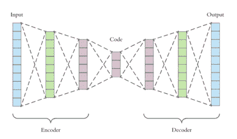 Q115。什么是玻尔兹曼机？**

玻尔兹曼机器有一个简单的学习算法，允许它们发现代表训练数据中复杂规律的有趣特征。玻尔兹曼机器主要用于优化给定问题的权重和数量。在具有多层特征检测器的网络中，学习算法非常慢。“ [**受限玻尔兹曼机器**](https://www.edureka.co/blog/restricted-boltzmann-machine-tutorial/) ”算法有一个单层的特征检测器，这使得它比其他算法更快。

**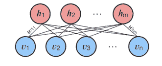 ** ** Q116。什么是退学和批次正常化？**

丢弃是一种随机丢弃网络中隐藏和可见单元的技术，以防止数据过拟合(通常丢弃 20%的节点)。它使收敛网络所需的迭代次数加倍。

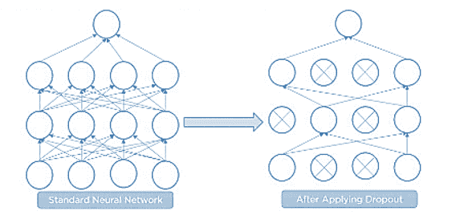

批量标准化是通过标准化每一层中的输入来提高神经网络的性能和稳定性的技术，使得它们具有 0 的平均输出激活度和 1 的标准偏差。

### **Q117。批量梯度下降和随机梯度下降有什么区别？**

| **批量梯度下降** | **随机梯度下降** |
| 批量梯度使用整个数据集计算梯度。 | 随机梯度使用单个样本计算梯度。 |
| 收敛需要时间，因为数据量巨大，权重更新缓慢。 | 它比批梯度收敛得快得多，因为它更频繁地更新权重。 |

### **Q118。为什么 Tensorflow 是深度学习的首选库？**

[***tensor flow***](https://www.edureka.co/blog/install-tensorflow)同时提供 C++和 Python APIs，与 Keras 和 Torch 等其他深度学习库相比，更容易工作，编译时间更快。Tensorflow 同时支持 CPU 和 GPU 计算设备。

**Q119。张量流中的张量是什么意思？**

张量是用更高维数组表示的数学对象。这些作为神经网络输入的具有不同维度和等级的数据阵列被称为“”

### **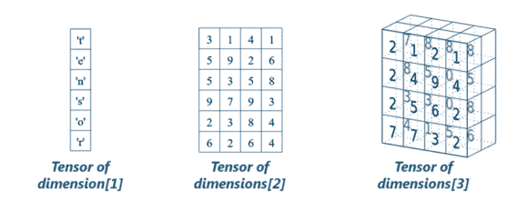 Q120。什么是计算图？**

张量流中的一切都是基于创建一个计算图形。它有一个节点网络，每个节点在其中运算，节点代表数学运算，边代表张量。因为数据以图形的形式流动，所以它也被称为“数据流图”

### **Q121。什么是生成性对抗网络？**

假设有一家葡萄酒商店从经销商那里购买葡萄酒，然后他们再转售出去。但是有些经销商卖假酒。在这种情况下，店主应该能够区分假酒和正宗酒。

伪造者会尝试不同的技术来销售假酒，并确保特定的技术通过店主的检查。店主可能会从葡萄酒专家那里得到一些反馈，说有些葡萄酒不是原装的。酒的主人必须改进他如何判断一瓶酒是假的还是真的。

伪造者的目标是创造出与真品难以区分的葡萄酒，而店主则打算准确地辨别葡萄酒的真假

让我们借助一个图像来理解这个例子。

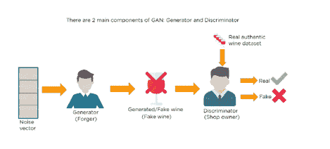有一个噪声向量进入正在生产假酒的伪造者。

在这里，伪造者充当发电机。

店主充当了鉴别者的角色。

鉴别器得到两个输入；一个是假酒，一个是真正的正宗酒。店主必须弄清楚这是真的还是假的。

因此，有两个主要组成部分的生成性对抗网络(GAN)命名为:

1.  发电机

2.  鉴别器

生成器是一个 CNN，它保存产生图像的密钥，在外观上更接近真实图像，而鉴别器试图确定真实图像和虚假图像之间的差异。最终目的是让鉴别器学会识别真实图像和虚假图像。

除了非常技术性的问题，你的面试官甚至可以问你几个简单的问题来检查你的整体信心，比如下面这些。

### **Q122。关于数据分析，Python 中有哪些重要的技能？**

以下是使用 Python 进行数据分析时需要掌握的一些重要技能。

*   对内置数据类型有很好的理解，尤其是列表、字典、元组和集合。

*   精通 N 维 [NumPy 数组](https://www.edureka.co/blog/python-numpy-tutorial/)。

*   掌握[熊猫](https://www.edureka.co/blog/python-pandas-tutorial/)数据帧。

*   能够在 NumPy 数组上执行基于元素的向量和矩阵运算。

*   知道应该使用 Anaconda 发行版和 conda 包管理器。

*   熟悉[sci kit-学习](https://www.edureka.co/blog/scikit-learn-machine-learning/)。* *[**Scikit-Learn Cheat Sheet**](https://www.edureka.co/blog/cheatsheets/python-scikit-learn-cheat-sheet)* *

*   能够编写高效的列表理解，而不是传统的 for 循环。

*   能够编写小而简洁的函数(这对任何开发人员都很重要)，最好是不改变对象的纯函数。

*   了解如何分析 Python 脚本的性能以及如何优化瓶颈。

以下内容将有助于解决数据分析和机器学习中的任何问题。

我希望这组数据科学面试问题和答案能帮助你准备面试。万事如意！

*有问题吗？请在评论区提到它，我们将很快回复您。*

*Edureka 有一个特别策划的[数据科学培训](https://www.edureka.co/masters-program/data-scientist-certification)，帮助你获得机器学习算法的专业知识，如 K-Means 聚类、决策树、随机森林、朴素贝叶斯。您还将学习统计学、时间序列、文本挖掘的概念以及深度学习的介绍。您将解决媒体、医疗保健、社交媒体、航空、人力资源方面的真实案例研究。本课程的新批次即将开始！！*

还有，如果你正在寻找数据科学的在线结构化培训，edureka！拥有专门策划的[数据科学课程](https://www.edureka.co/executive-programs/advanced-program-data-science-course-iitg)，帮助您获得统计学、数据争论、探索性数据分析和机器学习算法(如 K-Means 聚类、决策树、随机森林和朴素贝叶斯)方面的专业知识。您还将学习时间序列、文本挖掘的概念，以及深度学习的介绍。本课程的新批次即将开始！！