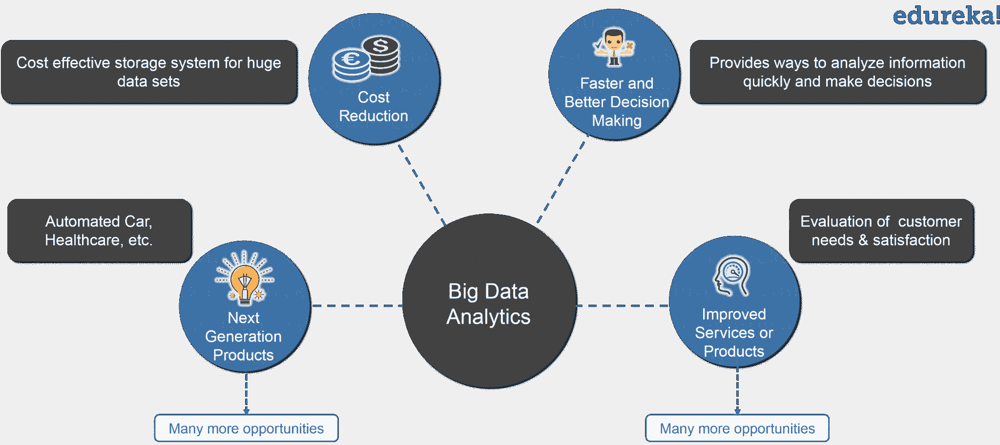
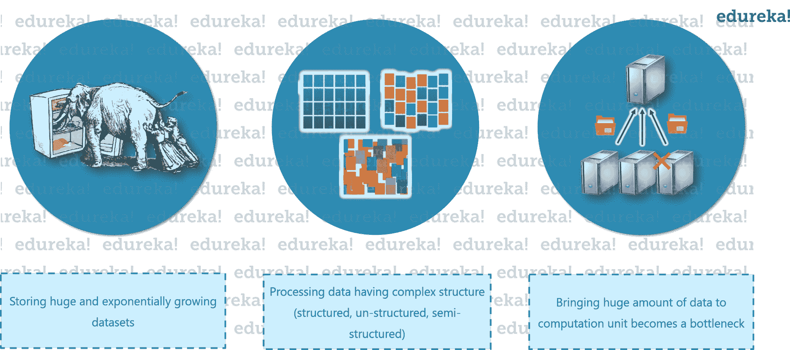
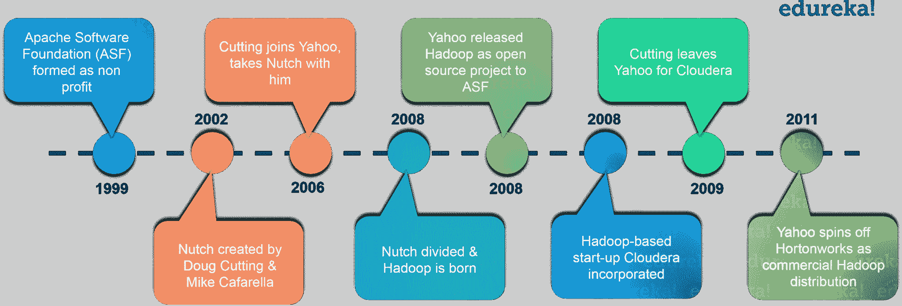
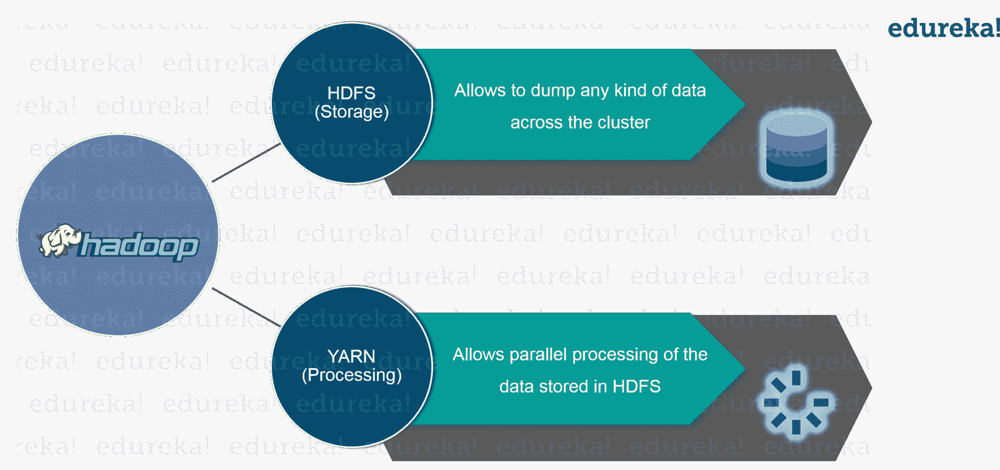
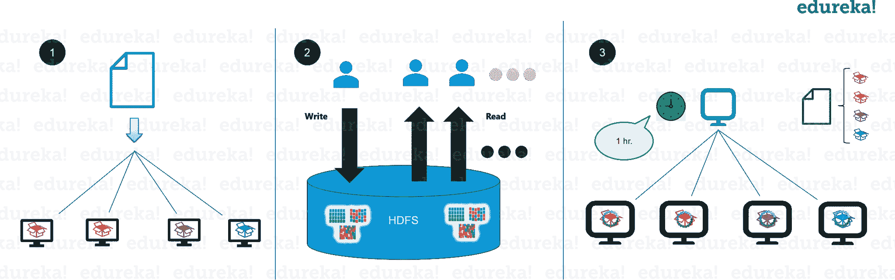
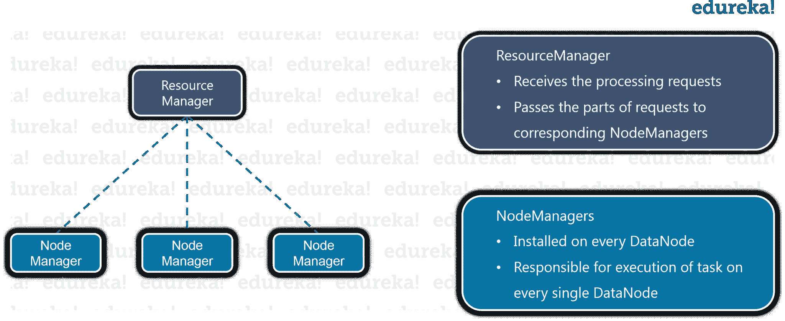
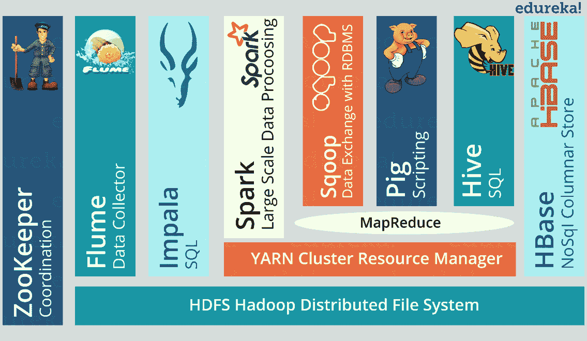
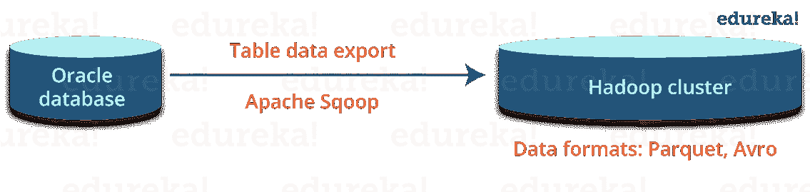
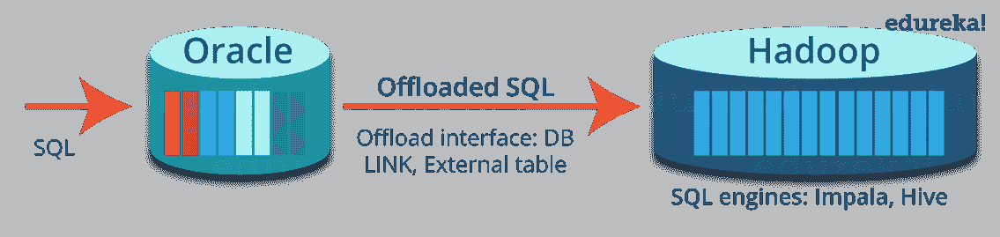
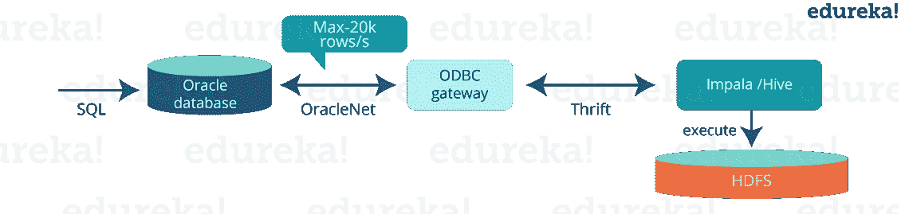

# Hadoop 是什么？大数据和 Hadoop 简介

> 原文：<https://www.edureka.co/blog/what-is-hadoop/>

要了解 Hadoop 到底是什么，我们首先要了解与大数据和传统处理系统相关的问题。接下来，我们将讨论什么是 Hadoop，以及 Hadoop 如何解决与大数据相关的问题。我们还将查看 CERN 案例研究，以突出使用 Hadoop 的优势。更多详情，请参考 [Hadoop 认证](https://www.edureka.co/big-data-hadoop-training-certification)。

在之前的博客即 ***[大数据教程](https://www.edureka.co/blog/big-data-tutorial)*** 中，我们已经详细讨论了大数据以及大数据带来的挑战。在这篇博客中，我们将讨论:

*   [传统方法的问题](#ProblemsWithBigData)
*   [Hadoop 的进化](#HadoopHistory)
*   [Hadoop](#WhatIsHadoop)
*   [Hadoop-as-a Solution](#HadoopAsASolution)
*   [什么时候用 Hadoop？](#HadoopUseCases)
*   [什么时候不用 Hadoop？](#NotToUseHadoop)
*   [CERN 案例研究](#CERNCaseStudy)

大数据正成为组织的一个机遇。现在，组织已经意识到他们正从大数据分析中获益良多，如下图 所示。他们正在检查大型数据集，以发现所有隐藏的模式、未知的相关性、市场趋势、客户偏好和其他有用的商业信息。

这些分析结果有助于组织更有效的营销、新的收入机会和更好的客户服务。他们正在提高运营效率、相对于竞争对手的竞争优势以及其他业务优势。

 **图** : *什么是 Hadoop——大数据分析的好处*

因此，让我们继续前进，了解与利用大数据机会的传统方法相关的问题。

## **传统方法的问题**

在传统方法中，主要问题是处理数据的异构性，即结构化、半结构化和非结构化。RDBMS 主要关注结构化数据，如银行交易、运营数据等。Hadoop 擅长半结构化、非结构化数据，如文本、视频、音频、脸书帖子、日志等。RDBMS 技术是一种经过验证的、高度一致的、成熟的系统，受到许多公司的支持。另一方面，Hadoop 因大数据而受欢迎，大数据主要由不同格式的非结构化数据组成。

现在让我们了解一下与大数据相关的主要问题有哪些。因此，随着时间的推移，我们可以了解 Hadoop 是如何成为一种解决方案的。



**图** : *什么是 Hadoop——大数据的问题*

### ***首要问题是存储海量数据。***

在传统系统中存储如此庞大的数据是不可能的。原因很明显，存储将仅限于一个系统，而数据正以惊人的速度增长。

### ***第二个问题是存储异构数据。***

现在，我们知道储存是个问题，但让我告诉你，这只是问题的一部分。因为我们讨论过，数据不仅巨大，而且以各种格式呈现:非结构化、半结构化和结构化。所以，你需要确保你有一个系统来存储所有这些不同来源的数据。

### ***第三个问题是访问和处理速度*** 。

硬盘容量在增加，但磁盘传输速度或访问速度没有以类似的速度增加。让我用一个例子来解释一下:如果你只有一个 100 Mbps 的 I/O 通道，而你正在处理 1TB 的数据，大约需要 2.91 小时。现在，如果您有四台带有一个 I/O 通道的机器，对于相同数量的数据，大约需要 43 分钟。因此，访问和处理速度是比存储大数据更大的问题。

在了解什么是 Hadoop 之前，让我们先来看看 Hadoop 在一段时间内的演变。

## **Hadoop 的进化**

2003 年，道格·卡丁启动了 Nutch 项目，来处理数十亿次搜索，为数百万个网页编制索引。2003 年 10 月晚些时候——谷歌发布了带有 GFS(谷歌文件系统)的论文。2004 年 12 月，Google 用 MapReduce 发布了论文。2005 年，Nutch 使用 GFS 和 MapReduce 进行操作。2006 年，雅虎与 Doug Cutting 和团队基于 GFS 和 MapReduce 创建了 Hadoop。如果我告诉你，2007 年雅虎开始在 1000 个节点的集群上使用 Hadoop，你会感到惊讶。

2008 年 1 月，雅虎向 Apache 软件基金会发布了 Hadoop 开源项目。2008 年 7 月，Apache 使用 Hadoop 成功测试了一个 4000 节点的集群。2009 年，Hadoop 在不到 17 个小时的时间内成功排序了 1pb 的数据，以处理数十亿次搜索和索引数百万个网页。2011 年 12 月，Apache Hadoop 发布了 1.0 版本。2013 年 8 月晚些时候，2.0.6 版本推出。你甚至可以通过澳洲 [数据工程培训](https://www.edureka.co/microsoft-azure-data-engineering-certification-course-australia) 了解大数据的细节。

当我们讨论这些问题时，我们看到分布式系统可以成为一种解决方案，Hadoop 也提供了同样的解决方案。现在，让我们了解一下什么是 Hadoop。

## **什么是 Hadoop？**

Hadoop 是一个框架，允许您首先在分布式环境中存储大数据，以便您可以并行处理它。Hadoop 中基本上有两个组件:



图:什么是 Hadoop–Hadoop 框架

第一个是用于存储的(Hadoop 分布式文件系统)，它允许您跨集群存储各种格式的数据。第二个是 ***纱*** ，用于 Hadoop 中的资源管理。它允许对数据进行并行处理，即存储在整个 HDFS。

## **什么是 Hadoop | Hadoop 入门| Hadoop 培训| Edureka**

让我们先了解一下 HDFS。

### HDFS

HDFS 创造了一个抽象概念，让我为你简化一下。与虚拟化类似，您可以从逻辑上将 HDFS 视为存储大数据的单个单元，但实际上您是以分布式方式跨多个节点存储数据。HDFS 遵循主从架构。

****

**图** : *什么是 Hadoop——HDFS*

在 HDFS 中，Namenode 是主节点，Datanodes 是从节点。 Namenode 包含关于存储在数据节点中的数据的元数据，例如哪个数据块存储在哪个数据节点中，数据块的副本保存在哪里等。 实际数据存储在数据节点中。

我还想补充一下，我们实际上是复制数据节点中存在的数据块，默认的复制因子是 3。 由于我们使用的是商用硬件，我们知道这些硬件的故障率很高，所以如果其中一个数据节点出现故障，HDFS 仍将拥有这些丢失数据块的副本。您还可以根据自己的需求配置复制因子。可以通过 [***HDFS 教程***](https://www.edureka.co/blog/hdfs-tutorial) 详细了解 *HDFS* 。

让我们了解 Hadoop 如何为我们刚刚讨论的大数据问题提供解决方案。

******

图:什么是 Hadoop–Hadoop 即解决方案

### ***第一个问题是存储大数据*** 。

HDFS 提供了一种存储大数据的分布式方法。您的数据跨 DataNodes 存储在块中，您可以指定块的大小。基本上，如果您有 512MB 的数据，并且您这样配置了 HDFS，它将创建 128 MB 的数据块。 因此，HDFS 将数据分成 4 个块，如 512/128=4，并跨不同的数据节点存储，它还将复制不同数据节点上的数据块。现在，由于我们使用的是商用硬件，因此存储不再是一个难题。

它还解决了缩放问题。它侧重于 ***水平缩放*** 而不是垂直缩放。您可以随时根据需要向 HDFS 集群添加一些额外的数据节点，而不是扩展 DataNodes 的资源。让我为您总结一下，对于存储 1 TB 的数据，您不需要 1TB 的系统。相反，您可以在多个 128GB 或更少的系统上进行。

### ***下一个问题是存储各种数据*** 。

使用 HDFS，您可以存储各种数据，无论是结构化、半结构化还是非结构化数据。因为在 HDFS，没有*预倾销模式验证*。它也遵循一次写入多次读取的模式。因此，您可以只写一次数据，也可以多次读取数据以获得见解。

### ***T***hird 挑战访问&处理数据更快。

是的，这是大数据面临的主要挑战之一。为了解决这个问题，我们将处理转移到数据，而不是将数据转移到处理。这是什么意思？而不是将数据移动到主节点然后处理它。在 MapReduce 中，处理逻辑被发送到各个从节点&，然后数据在不同的从节点上被并行处理。然后，处理后的结果被发送到主节点，在那里结果被合并，响应被发送回客户端。通过 [数据工程课程](https://www.edureka.co/microsoft-azure-data-engineering-certification-course) 可以更好的理解。

在 YARN 架构中，我们有 ResourceManager 和 NodeManager。ResourceManager 可能与 NameNode 配置在同一台计算机上，也可能不在同一台计算机上。 但是，节点管理器应该配置在 DataNodes 所在的同一台机器上。

### **纱**

**纱**通过分配资源和调度任务来执行您所有的处理活动。



图:什么是 Hadoop–YARN

它有两个主要组件，即资源管理器和节点管理器。

资源管理器也是一个主节点。它接收处理请求，然后相应地将部分请求传递给相应的节点管理器，在那里进行实际的处理。每个 DataNode 上都安装了节点管理器。它负责在每个 DataNode 上执行任务。

我希望现在你已经清楚什么是 Hadoop 及其主要组件。让我们继续前进，了解何时使用，何时不使用 Hadoop。

## **Hadoop 用在哪里？**T3

Hadoop 用于:

*   *搜索*——雅虎、亚马逊、Zvents
*   *日志处理*——脸书、雅虎
*   *数据仓库*–脸书，美国在线
*   *视频和图像分析*——纽约时报，eye like

到目前为止，我们已经看到 Hadoop 如何让大数据处理成为可能。但是有一些场景不推荐 Hadoop 的实现。

## **什么时候不用 Hadoop？**

以下是其中一些场景:

*   *低延迟数据访问*:快速访问小部分数据
*   *多重数据修改*:只有当我们主要关心读取数据而不是修改数据时，Hadoop 才是更好的选择。
*   *大量小文件* : Hadoop 适合我们文件少而大的场景。

了解了最合适的使用案例后，让我们继续看一个 Hadoop 创造奇迹的案例研究。

## **Hadoop-CERN 案例研究**

瑞士的*大型强子对撞机*是世界上最大最强的机器之一。它配备了大约 1.5 亿个传感器，每秒钟产生 1pb 的数据，并且数据还在持续增长。

CERN 研究人员表示，这些数据在数量和复杂性方面一直在扩大，其中一项重要任务就是满足这些可扩展的需求。因此，他们建立了一个 Hadoop 集群。通过使用 Hadoop，他们限制了硬件成本和维护复杂性。

***他们集成了 Oracle & Hadoop，他们获得了集成*** 的优势。Oracle 优化了他们的在线交易系统& Hadoop 为他们提供了可扩展的分布式数据处理平台。 他们设计了一个混合系统，首先他们把数据从 Oracle 转移到 Hadoop。然后，他们使用 Oracle APIs 对来自 Oracle 的 Hadoop 数据执行查询。他们还使用 Hadoop 数据格式，如*Avro*&*Parquet*进行高性能分析，而无需更改连接到 Oracle 的最终用户应用。

他们在 CERN-IT Hadoop 服务中使用的主要 Hadoop 组件:

你可以在 [* ** Hadoop 生态系统博客** *](https://www.edureka.co/blog/hadoop-ecosystem) 中了解这些工具。

**Oracle 与 Hadoop 集成技术:**

*   *将数据从 Oracle 导出到 HDFS*

对于大多数情况来说，Sqoop 已经足够好了，他们还采用了一些其他可能的选项，如定制接收、Oracle 数据泵、流等。

*   *从 Oracle* 查询 Hadoop

他们使用 Oracle 中的数据库链接来访问 Hadoop 引擎中的表。它们还通过透明地组合 Oracle 和 Hadoop 中的数据来构建混合视图。

*   *使用 Hadoop 框架处理 Oracle DBs 中的数据*

他们使用 Hadoop 引擎(如 Impala、Spark)处理从 Oracle 导出的数据，然后使用 JDBC 直接从 Spark SQL 读取 RDBMS 中的数据。

**从 Oracle 卸载到 Hadoop**

*第一步:卸载数据到 Hadoop*

*第二步:将查询卸载到 Hadoop* 

*第三步:通过 Oracle 查询访问 Hadoop*

*   使用数据库链接从 Oracle 查询 Apache Hive/Impala 表

```

create database link my_hadoop using 'impala-gateway';

select * from big_table@my_hadoop where col1= :val1;

```

*   通过 ODBC 网关卸载到 Impala(或 Hive)的查询

**在甲骨文上创建混合视图的例子**

```

create view hybrid_view as

&nbsp; &nbsp; &nbsp; &nbsp; &nbsp; select * from online_table where date > '2016-10-01'

&nbsp; &nbsp; &nbsp; &nbsp; &nbsp; union all

&nbsp; &nbsp; &nbsp; &nbsp; &nbsp; select * from archive_table@hadoop where date <= '2016-10-01'

```

基于 CERN 的案例研究，我们可以得出结论:

*   Hadoop 可扩展，非常适合大数据分析
*   Oracle 在并发事务性工作负载方面久经考验
*   集成 Oracle 和 Hadoop 的解决方案已经推出
*   使用混合系统(Oracle + Hadoop)有很大的价值:
    *   面向传统应用和 OLTP 工作负载的 Oracle APIs】
    *   面向分析工作负载的商用硬件可扩展性

我希望这篇博客能提供信息，增加你的知识。在我们 Hadoop 教程系列的下一篇博客，即 [***Hadoop 教程***](https://www.edureka.co/blog/hadoop-tutorial/) 中，我们将更详细地讨论 Hadoop，并详细了解 HDFS & YARN 组件的任务。

*现在您已经了解了什么是 Hadoop，请查看 Edureka 在德里 举办的 **[Hadoop 培训，edu reka 是一家值得信赖的在线学习公司，拥有遍布全球的 250，000 多名满意的学习者。Edureka 的](https://www.edureka.co/big-data-and-hadoop-training-delhi)[大数据工程课程](https://www.edureka.co/masters-program/big-data-architect-training)使用零售、社交媒体、航空、旅游、金融领域的实时用例，帮助学习者成为 HDFS、Yarn、MapReduce、Pig、Hive、HBase、Oozie、Flume 和 Sqoop 领域的专家。***

*有问题吗？请在评论区提到它，我们将回复您或参加我们在英国的 [Hadoop 培训](https://www.edureka.co/big-data-hadoop-training-certification-uk)。*