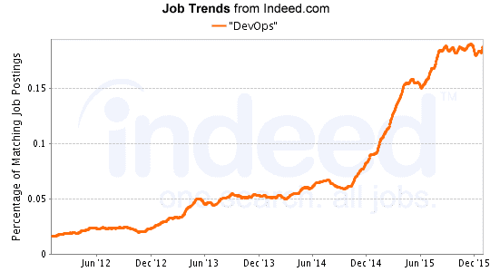
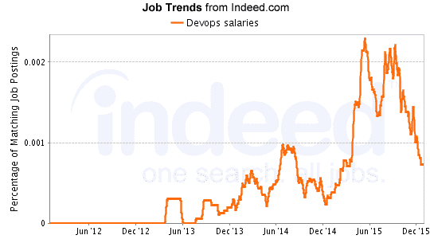
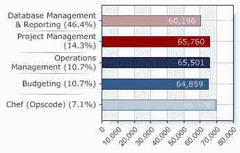

# DevOps 工程师职业道路:顶级 DevOps 工作指南

> 原文：<https://www.edureka.co/blog/devops-engineer-career-path-your-guide-to-bagging-top-devops-jobs>

DevOps 是一种将运营与开发相结合的理念，需要一个链接的技术工具链来促进协作性变革。根据 Gartner 的调查，世界各地的组织越来越多地采用 DevOps 文化，到 2016 年底，25%的全球 2000 强组织将采用 DevOps 作为主流战略。这为 DevOps 职业带来了无数的机会。基于 DevOps 理念，人们可以从事各种各样的一般和专业工作角色。在这篇博文中，我们将讨论 DevOps 工程师的职业道路以及如何获得顶级 DevOps 职位。

尽管 DevOps 仍处于起步阶段，但它已经将整个软件行业带到了一场革命的边缘。随着 IT 行业动态的快速变化，不了解管理或运营的开发人员以及不开发的管理或运营人员对组织的价值将越来越小。

DevOps 将把拥有单一技能的人转变为拥有多学科技能的人，包括编码、基础设施和配置、测试、构建和发布。由于它不局限于任何特定的技术，在 DevOps 环境中工作的人们不断地使用、集成和自动化不同的技术。

## DevOps 工程师职业道路

DevOps 从业者是当今收入最高的 IT 专业人员之一，对他们的市场需求正在快速增长，因为使用 DevOps 实践的组织都是高度功能化的。根据 Puppetlabs 最近发布的一份报告:DevOps 报告的状态，使用 DevOps 方法的组织部署代码的频率是其竞争对手的 30 倍，并且部署失败的几率减少了 50%。

在过去的两年里，Indeed.com 的 DevOps 工作列表增加了 75%。在 LinkedIn.com，将开发工作作为一项技能的提及率上升了 50%。在 Puppetlabs 最近的一项调查中，他们的 4000 多名受访者(来自 90 多个国家)中有一半表示，他们的公司在招聘时会考虑 DevOps 技能。

## DevOps 工资

从下面的 Indeed.com 图表中可以明显看出，DevOps 的工作岗位在 2015 年年中开始飙升，并在年底飙升。

DevOps 相关工作的薪水在美国出现了上涨，与 2015 年的繁荣相吻合。激增仍在继续。

据 PayScale.com 称，在加州从事 DevOps 相关工作的专业人士的薪水超过 94，000 美元。

奇怪的是，与其他技术领域的乔布斯不同，DevOps 正在见证一个有趣的趋势。DevOps 上所有受欢迎的职位都有非常相似的工作机会。例如，如果一个项目管理角色有 65，760 个空缺，预算角色提供 64，859 个空缺。流行的 DevOps 工具——厨师——周围的工作略有增加，为 69478。

## DevOps 角色和职责

围绕 DevOps 理念出现了新的工作角色。其中一些是:

*   DevOps 建筑师
*   自动化工程师
*   软件测试人员
*   安全工程师
*   集成专家
*   发布经理

What began as a framework and ideology for bringing together two diametrically opposite schools of thought within the same organization, is today a popular career path with perks and growth opportunities increasing by the day. There’s never been a better time to explore a DevOps Engineer career path. Because of the enormous demand for DevOps experts, this exciting venture could be exactly what you’re seeking if you’re searching for a demanding and rewarding career. No matter whether you’ve worked in DevOps or are new to the field, the [DevOps Professional Certificate Program](https://www.edureka.co/executive-programs/purdue-devops) is precisely the thing you need to learn the methods to be successful. From the basic to the most advanced methods, we cover everything.*Edureka has specially curated [**DevOps Online Training**](https://www.edureka.co/devops-certification-training) that helps you master concepts around Puppet, Jenkins, Ansible, SaltStack, and Chef among others. New batches are starting soon!!*

有问题要问我们吗？请在评论区提及它们，我们将会回复您。

**相关帖子:**

[2016 年顶尖 DevOps 面试试题](https://www.edureka.co/blog/interview-questions/top-devops-interview-questions-2016/ "Top DevOps Interview Questions")

[关于 DevOps](https://www.edureka.co/blog/devops-tutorial "All you need to know about DevOps") 你需要知道的一切