# Nagios 教程——使用 Nagios 进行持续监控

> 原文：<https://www.edureka.co/blog/nagios-tutorial/>

## **Nagios 教程:**

我相信 Nagios 上的帖子很少，互联网上的相关信息也不多。所以，我认为这篇文章会让你对这个监控工具有一个清晰的认识。Nagios 监控您的整个 IT 基础设施，以确保系统、应用程序、服务和业务流程正常运行。它是 DevOps 生命周期的组成部分，是 ***[DevOps 认证](https://www.edureka.co/devops)*** 的必备。在这个 Nagios 教程中，我将涉及以下主题:

1.  为什么我们需要持续监控？
2.  什么是持续监控？
3.  什么是 Nagios？
4.  如何安装 Nagios？
5.  如何使用 NRPE (Nagios 远程插件执行器)添加远程服务器。

让我们从理解为什么我们需要持续监控开始这个 Nagios 教程，因为任何事物的存在都是有原因的。所以，让我们试着找出原因。

## **为什么我们需要持续监控？**

持续监控工具可解决任何系统错误(内存不足、无法访问服务器等。)以免它们对您的业务效率产生任何负面影响。

使用监控工具的重要原因有:

*   检测任何网络或服务器问题
*   它决定了任何问题的根本原因
*   它维护服务的安全性和可用性
*   监控服务器性能问题并排除故障
*   它使我们能够在过时的系统导致故障之前规划基础设施升级
*   它可以在问题出现的第一时间做出反应
*   可用于在检测到问题时自动修复问题
*   它确保 It 基础设施中断对您组织的底线影响最小
*   它可以监控您的整个基础设施和业务流程

是的，它做了很多很酷的工作，但是它是什么呢？

## **什么是持续监测？**

首先让我告诉你持续监控在 DevOps 生命周期中的位置，请看下图:

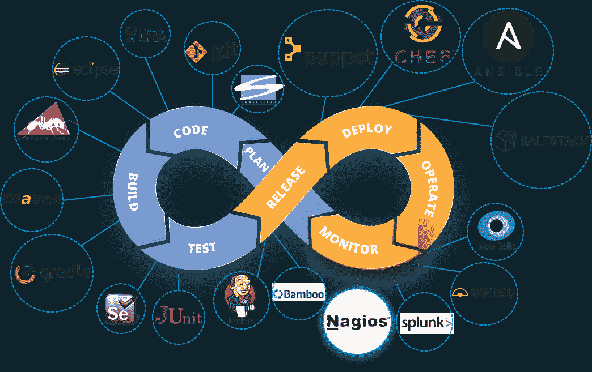

看着图表，你一定认为这是 DevOps 生命周期的最后一个阶段，但事实并非如此。DevOps 的生命周期没有尽头，这就是无限符号的原因。一旦在生产服务器上部署了应用程序，就需要持续的监控。

持续监控是指组织检测、报告、响应、遏制和缓解基础设施中发生的攻击的能力。

连续监测实际上并不新鲜，它已经存在了一段时间。多年来，我们的安全专业人员一直在对系统日志、防火墙日志、IDS 日志、IPS 日志等进行静态分析。但是，它没有提供适当的分析和回应。今天的持续监控方法使我们能够汇总我上面讨论的所有事件，关联它们，比较它们，然后估计组织的风险状况。

如果我们把所有这些零件都拿走，并确保它们之间的相互联系。这就是持续监控的症结所在。

让我用一个用例来解释一下。 考虑下图:

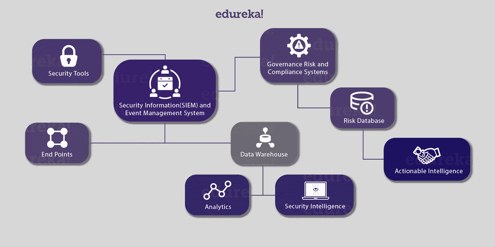现在，让我给你解释一下上面的图:

1.  我们有各种安全工具，如防火墙、入侵检测系统、终端保护等。它们与安全信息和事件管理系统相连。
2.  为了实现持续监控，我们需要让所有部件相互通话，让我来给你解释一下。
3.  因此，我们有了安全工具和一系列“端点”，这可以包括客户端和服务器、路由器、交换机、移动设备等等。
4.  然后，这两个小组可以通过通用语言，以更加自动化的方式与安全信息和事件管理系统(SIEM)对话。
5.  与 SIEM 相关的有两个重要组件，第一个是数据仓库。现在，对于这个数据仓库，我们将连接“分析”和“安全智能”。
6.  安全情报(SI)是与保护组织免受外部和内部威胁相关的信息，以及旨在收集和分析这些信息的流程、策略和工具。
7.  该 SIEM 还与“治理风险和合规系统”相关，它主要提供仪表板。
8.  我们在这个“治理风险和合规系统”上附加了一个风险数据库。这给了我们“可操作的情报”。
9.  可采取行动的情报只不过是可以采取行动的信息，进一步暗示应该采取行动。

因此，我们正在持续监控事件，并确定我们所面临的风险水平。有了这个，我们就能把 SIEM 的事件联系起来。我们可以在“分析引擎”上执行网络行为和异常检测。这就是持续监控的意义所在:

*一个组织的集成 安全工具， 安全工具产生的数据的聚合、 规范化和 关联。基于组织的风险目标和威胁知识的数据分析，以及对已识别风险的近乎实时的响应。*

如果你不能衡量它，你就不能管理它。我希望你知道我在说什么。

在接下来的 Nagios 教程中，我将向您介绍最著名的监控工具之一“Nagios”。

## **什么是 Nagios？**

Nagios 用于持续监控 DevOps 文化中的系统、应用程序、服务和业务流程等。如果出现故障，Nagios 可以向技术人员发出问题警报，允许他们在中断影响业务流程、最终用户或客户之前开始补救过程。使用 Nagios，您不必解释为什么看不见基础设施中断会影响组织的底线。

让我给你解释一下 Nagios 是如何工作的。 考虑下图:

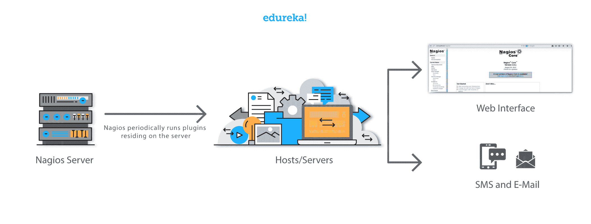 Nagios 运行在服务器上，通常作为守护进程或服务。

它定期运行驻留在同一服务器上的插件，它们联系你的网络或互联网上的主机或服务器。用户可以使用 web 界面查看状态信息。如果有事发生，你也可以收到电子邮件或短信通知。Nagios 守护进程就像一个调度程序，在特定的时刻运行特定的脚本。它存储这些脚本的结果，如果这些结果发生变化，它将运行其他脚本。

*插件:* 这些 都是编译后的可执行文件或脚本(Perl 脚本、shell 脚本等。)可以从命令行运行，以检查主机或服务的状态。Nagios 使用插件的结果来确定网络上主机和服务的当前状态。

现在让我们来讨论一下它的架构。

## **Nagios 架构:**

*   Nagios 建立在服务器/代理架构之上。
*   通常，在网络上，Nagios 服务器运行在一台主机上，插件与本地和所有需要监控的远程主机进行交互。
*   这些插件将信息发送给调度程序，调度程序将信息显示在 GUI 中。

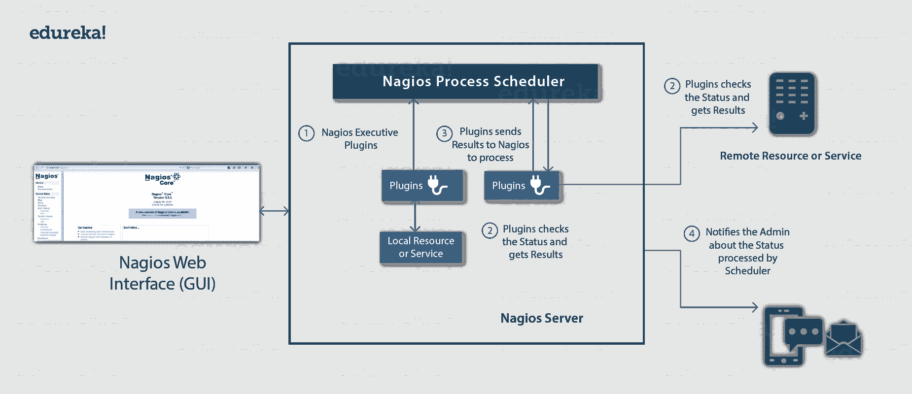

我还需要向你解释一下 NRPE (Nagios 远程插件执行程序)。

NRPE 插件被设计成允许你在远程 Linux/Unix 机器上执行 Nagios 插件。这样做的主要原因是允许 Nagios 监控“本地”资源(如 CPU 负载、内存使用等。)在远程机器上。因为这些公共资源通常不会暴露给外部机器，所以像 NRPE 这样的代理必须安装在远程 Linux/Unix 机器上。

考虑下图:

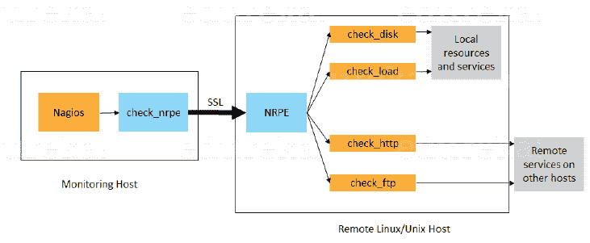

*   check_nrpe 插件驻留在本地监控机器上。
*   运行在远程 Linux/Unix 机器上的 NRPE 守护进程。
*   监控主机和远程主机之间有一个 SSL(安全套接字层)连接，如上图所示。

在这个 Nagios 教程中，是时候进行一些**实践**了。

让我们从安装 Nagios 核心开始

## **安装 Nagios 核心:**

安装 Nagios 的完整过程可以总结为四个步骤:

1.  在监控服务器中安装所需的包
2.  安装 Nagios 核心、Nagios 插件和 NRPE (Nagios 远程插件执行器)
3.  设置 Nagios 密码以访问 Web 界面
4.  在客户端安装 NRPE

## **步骤 1:在监控服务器上安装所需的软件包:**

访问网站:**[【http://dl.fedoraproject.org/pub/epel/6/】](http://dl.fedoraproject.org/pub/epel/6/)**

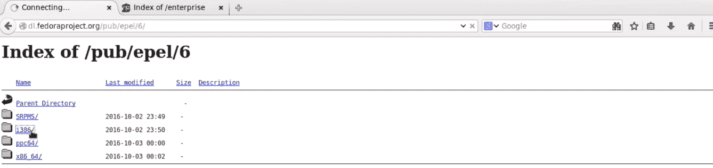

点击 i386，然后你会被重定向到一个页面。

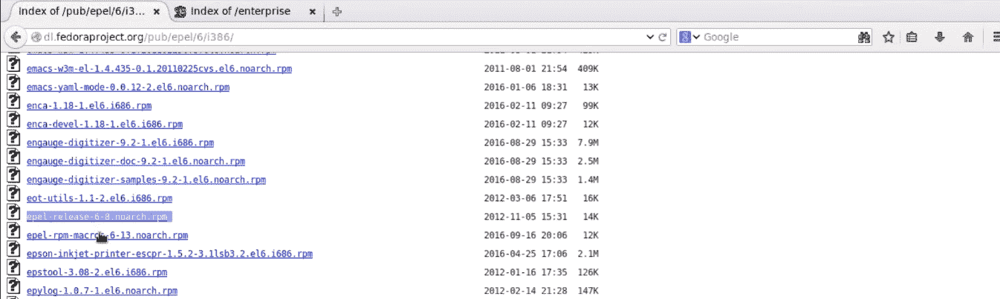

由于我使用的是 CentOS 6，所以我会右击并复制'*epel-release-6-8 . no arch . rpm*'的链接位置，如上图截图所示。

打开终端，使用 *rpm -Uvh* 命令粘贴链接。

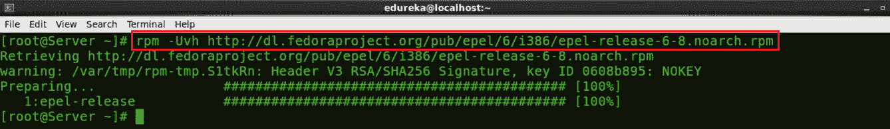

我们需要再下载一个存储库，为此请访问网站'[【http://rpms.famillecollet.com/enterprise/】](http://rpms.famillecollet.com/enterprise/)'

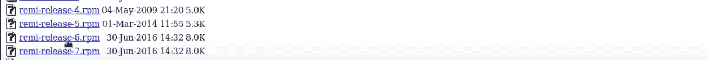

右键复制'*remi-release-6 . rpm*'的链接位置

再次打开终端，使用 *rpm -Uvh* 命令粘贴链接。

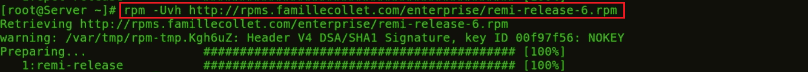

很好，我们已经完成了先决条件。让我们进行下一步。

## **第二步:安装 Nagios 核心、Nagios 插件和 NRPE (Nagios 远程插件执行程序):**

在终端执行以下命令:

```
yum -y install nagios nagios-plugins-all nagios-plugins-nrpe nrpe httpd php
```

这将安装 Nagios、Nagios 插件、NRPE、NRPE、阿帕奇和 PHP 的插件

Apache web 服务器需要监控当前的 web 服务器状态。

Php 用于处理网站日期的动态内容。

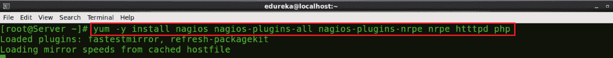

接下来，我们需要启用 Apache 和 Nagios 服务:

```
chkconfig httpd on && chkconfig nagios on
```

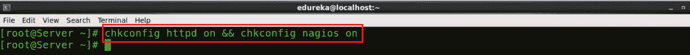

我们的下一步是启动 Nagios 和 Apache:

```
service httpd start && service nagios start
```

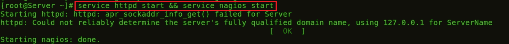

现在，我将启用至少 1GB 的交换内存。是时候使用 dd 命令创建交换文件本身了:

```
dd if=/dev/zero of=/swap bs=1024 count=2097152
```

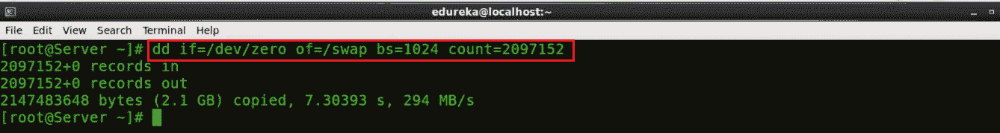 Swap 基本上是用来从 RAM 中释放一些不那么频繁访问的信息，并将其移动到我们硬盘上的特定分区。

现在您已经创建了交换分区，使用命令 *`mkswap`* 来设置交换分区。这将通过创建一个 linux 交换区来准备交换文件。

```
mkswap /swap
```

为了防止文件被全球读取，您应该对交换文件设置正确的权限:

```
chown root. /swap 
chmod 0600 /swap
```

如果您没有看到错误，您的交换空间就可以使用了。要立即激活它，请键入:

```
swapon /swap
```

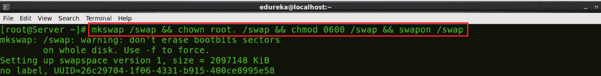

此文件将保存在虚拟专用服务器上，直到机器重新启动。通过将交换添加到 fstab 文件中，可以确保交换是永久性的。

```
echo /swap swap swap defaults 0 0 >> /etc/fstab
```

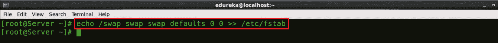

操作系统内核可以通过一个名为**交换度**的配置参数来调整它依赖交换的频率。

要查找当前交换度设置，请键入:

```
cat /proc/sys/vm/swappiness 
```

交换度可以是 0 到 100 之间的一个值。接近 100 的交换率意味着操作系统会经常交换，而且通常交换得太快。虽然交换提供了额外的资源，但 RAM 比交换空间快得多。每当有东西从 RAM 移到 swap 时，它就会变慢。

swappiness 值为 0 表示操作仅在绝对需要时才依赖 swap。我们可以用 sysctl 命令调整交换度。要让您的 VPS 在每次启动时自动应用该设置，您可以将该设置添加到/etc/sysctl.conf 文件:

```
echo vm.swappiness = 0 >> /etc/sysctl.conf && sysctl -p
```

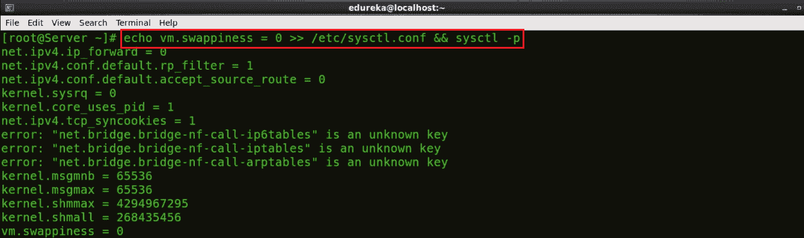

最后，我们完成了第二步。

让我们继续，设置 Nagios 密码来访问 web 界面。

## **第三步:设置 Nagios 密码进入 Web 界面:**

设置访问网络界面的密码，使用以下命令:

```
htpasswd -c /etc/nagios/passwd nagiosadmin
```

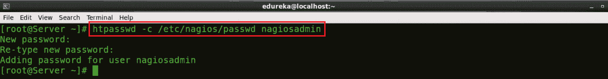

输入密码，并通过再次输入进行确认。

现在，打开浏览器。在这里，键入您的公共 IP 或主机名/nagios。考虑下面的例子:

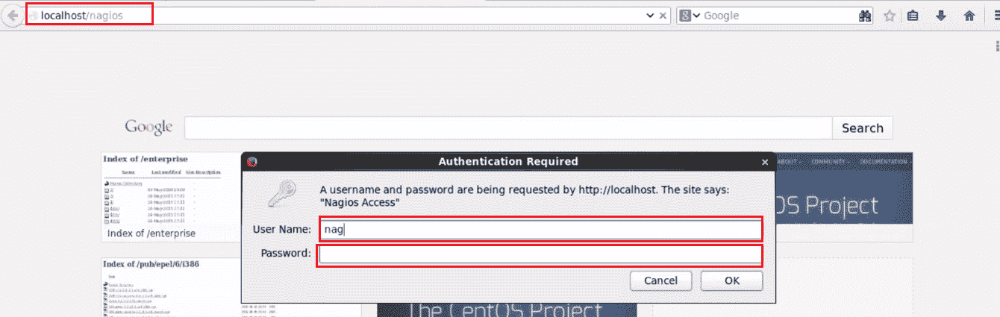

在这里，给出用户名和密码。默认情况下，用户名是 *nagiosadmin，*，密码是您在上一步中设置的。最后，按确定。

在此之后，您将被定向到 Nagios 核心仪表板。

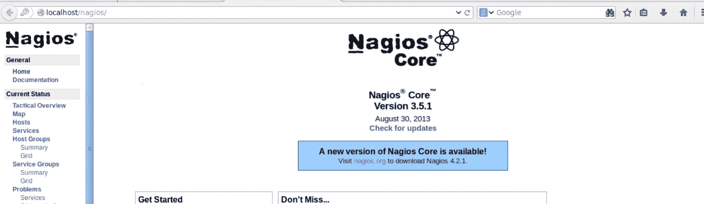

您可以点击 hosts 并查看 Nagios Core 当前正在监控的所有主机。

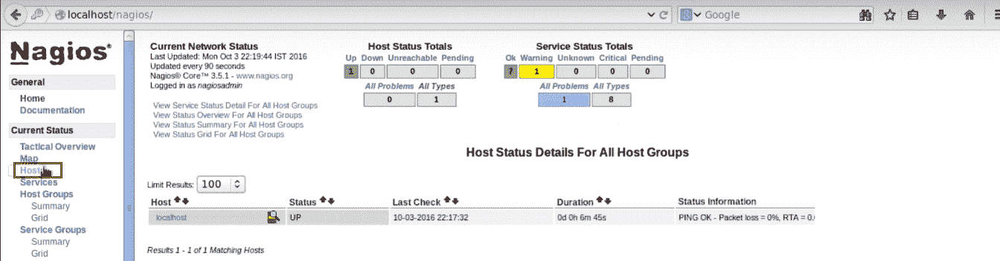

您可以注意到它只监视一台主机，即 localhost。如果我希望我的 Nagios 内核监控一个远程主机，我需要在那个远程主机上安装 NRPE。这将我们带到下一步，在您希望 Nagios 监控的客户机/机器上安装 NRPE。

## **第四步:在客户端安装 NRPE:**

好了，让我们在客户机上安装 NRPE。

首先，你需要像我一样在我的 Nagios 服务器上安装所需的包。所以，只需执行相同的命令，考虑下面的截图:

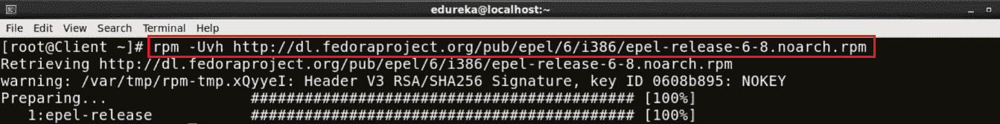

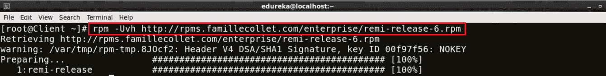

现在在客户端安装 Nagios、Nagios 插件和 NRPE:

```
yum -y install nagios nagios-plugins-all nrpe
```

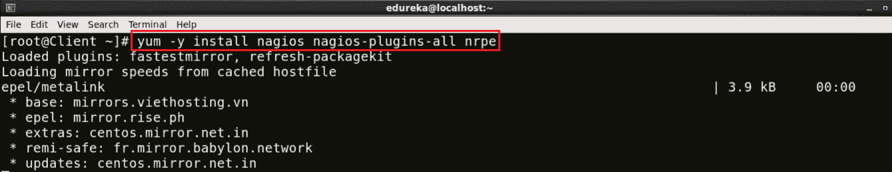

安装后，启用 NRPE 服务:

```
chkconfig nrpe on
```

 我们下一步要编辑的是， *nrpe.cfg* 文件。我将使用 *vi* 编辑器，你也可以选择其他任何编辑器:

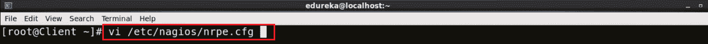

您需要在允许的主机行中添加您的监控服务器的 IP 地址，请考虑下面的截图:

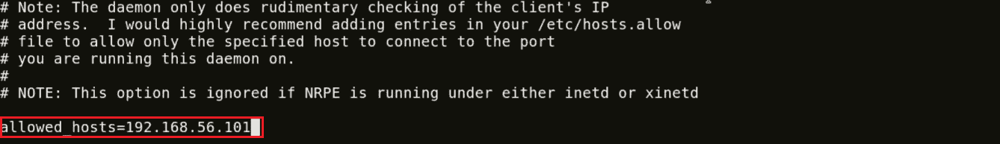

这里，我的监控服务器的 IP 地址是 192.168.56.101。

现在，我们需要设置防火墙规则以允许监控服务器和客户端之间的连接。

```
iptables -N NRPE
```

-一个选项用于将新规则附加到链的末尾。如果您想把它放在链中的其他地方，您可以使用-I 选项，它允许您指定新规则的位置。

以下命令接受端口 5666 上的 tcp 请求。

```
iptables -I INPUT -s 0/0 -p tcp --dport 5666 -j NRPE
iptables -I NRPE -s 192.168.56.101 -j ACCEPT
iptables -A NRPE -s 0/0 -j DROP
```

这将基本上配置 iptables 接受来自特定主机(在我的例子中是 192.168.56.101)的数据包，并丢弃来自其他主机的数据包。

现在，我将保存这些配置:

```
/etc/init.d/iptables save
```

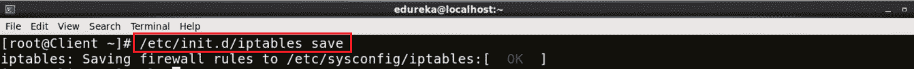

立即开始 NRPE 服务。

```
service nrpe start
```

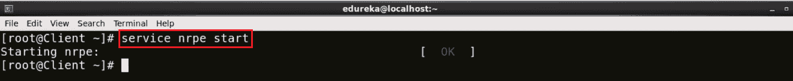

现在回到监控服务器。

在这里，我需要编辑 nagios.cfg 文件。

```
vi /etc/nagios/nagios.cfg
```

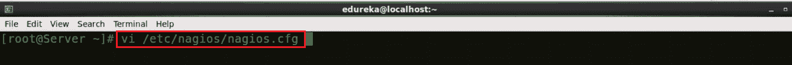

取消注释该行-*CFG _ dir = etc/Nagios/servers*

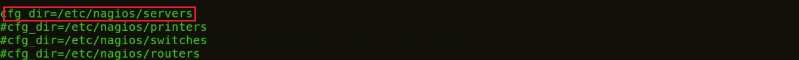

制作‘服务器’目录，以供使用 *mkdir* 命令。

```
mkdir /etc/nagios/servers/
```

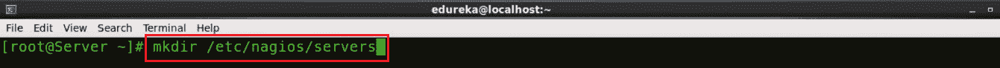

将您的工作目录更改为服务器。

```
cd /etc/nagios/servers
```

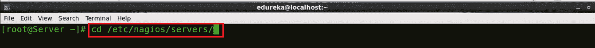

在这个目录下创建一个新文件。cfg 扩展名并编辑它。我将把它命名为 client.cfg，我将使用 **vi** 编辑器。

```
vi /etc/nagios/servers/client.cfg
```

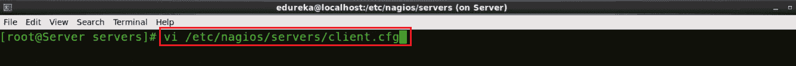

在此添加以下几行:

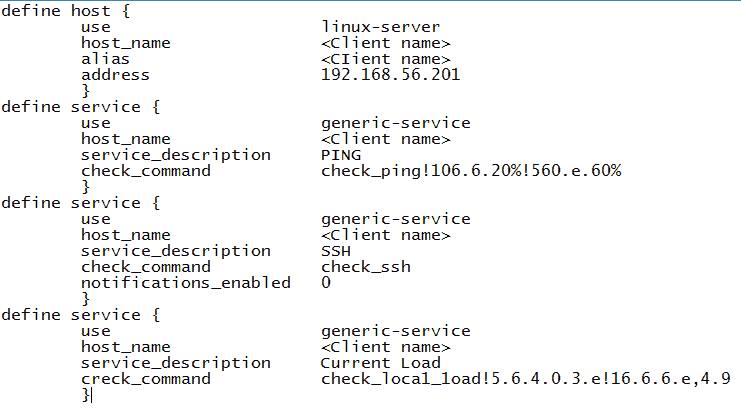 这基本上包括了我想要监控的那种服务。给出您希望 Nagios 监控的机器的主机名及其 ip 地址。

同样，您可以添加想要监控的服务数量。相同的配置可用于添加“n”个客户端。

最后一步伙计们，正确设置文件夹权限，重启 Nagios。

```
chown -R nagios. /etc/nagios/
```

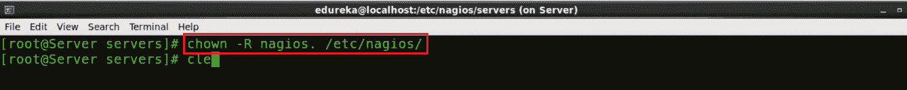

现在，重启 Nagios

```
service nagios restart
```

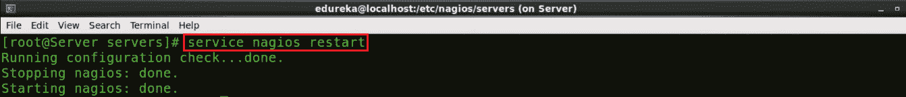

打开浏览器，再次键入*主机名或公共 ip/nagios/。*在我的例子中是 localhost/nagios/。

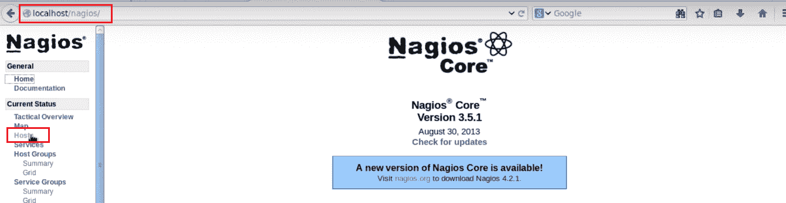

点击 hosts，查看 Nagios 当前正在监控的所有机器。

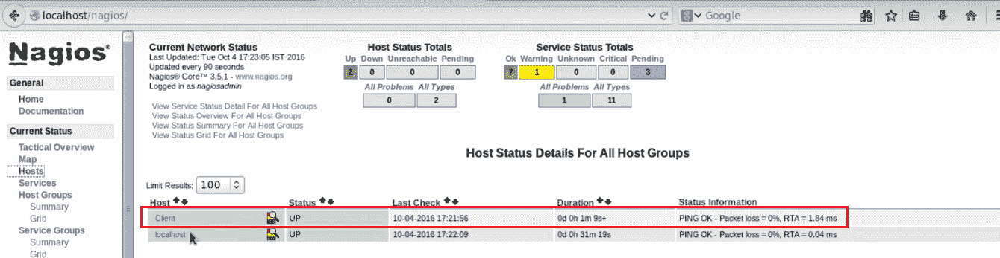

在这里，您可以注意到，它当前正在监控客户机(我希望 Nagios 监控的机器的主机名)。基本上，我们已经添加了一个使用 NRPE 的远程主机。

我希望你喜欢阅读这篇 Nagios 教程，我将很快推出更多关于 Nagios 的博客。

*如果你觉得这是相关的 Nagios 教程，请查看 Edureka 的* *[**DevOps 培训**](https://www.edureka.co/devops/) ，edu reka 是一家值得信赖的在线学习公司，在全球拥有超过 250，000 名满意的学习者。Edureka DevOps 认证培训课程可帮助学员获得各种 DevOps 流程和工具方面的专业知识，例如 Puppet、Jenkins、Nagios、Ansible、Chef、Saltstack 和 GIT，用于自动化 SDLC 中的多个步骤。*

*有问题问我吗？请在评论区提到它，我会回复你。*