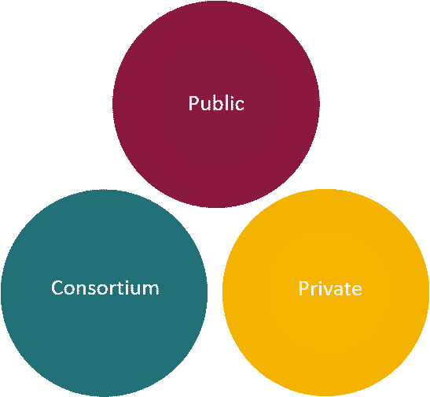
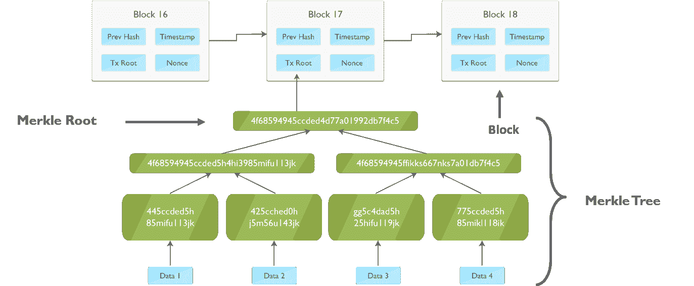
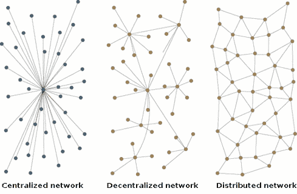
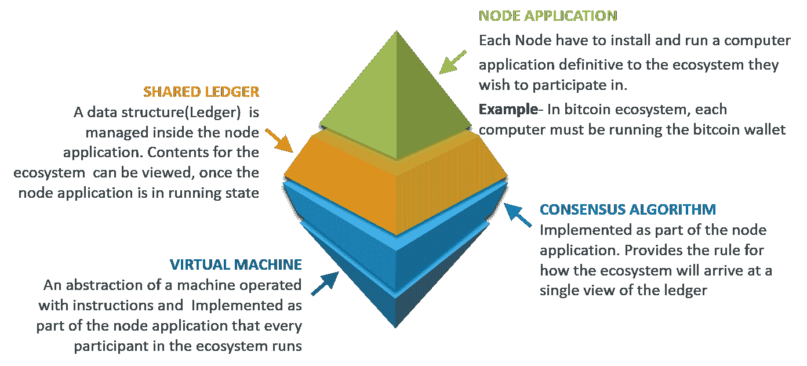
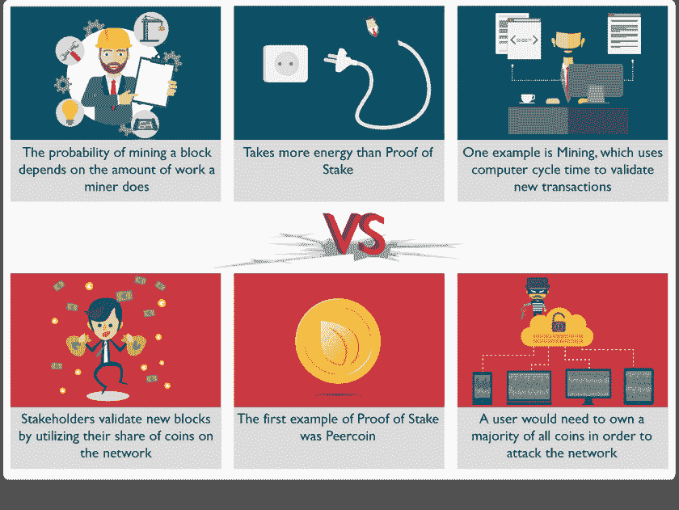
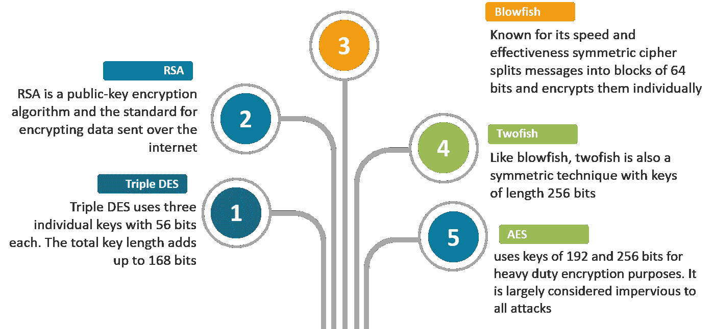
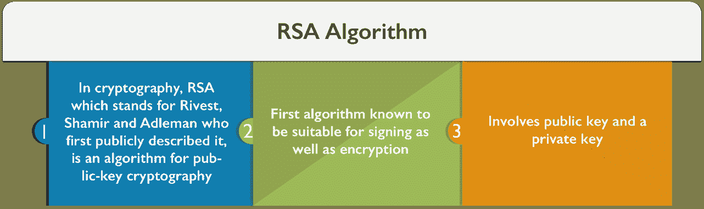
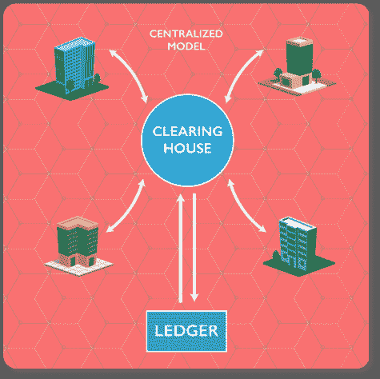
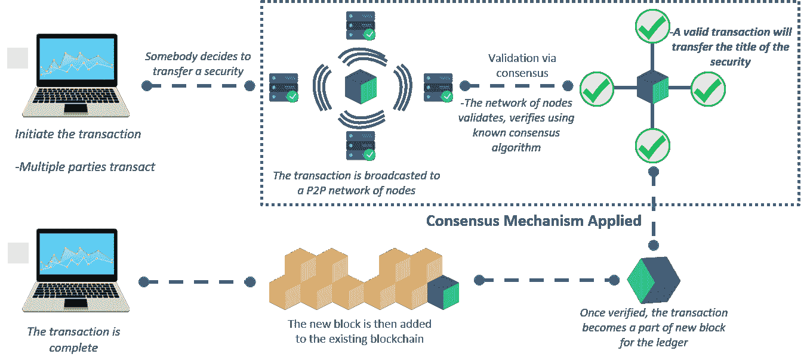

# 2023 年你必须准备的 55 个区块链面试问题

> 原文：<https://www.edureka.co/blog/interview-questions/blockchain-interview-questions/>

***区块链**是市场上最新的流行语。比特币很棒，但其底层技术的潜力是巨大的。一些以进化开始的东西很快会引起一场革命。投资者正在大捞一笔，因为他们明白这项独创性技术的前景相当光明。行业专家和技术爱好者每天都在推出区块链的产品。所以不要等待，用这些区块链面试问题做好行业准备。*

因此，如果你正计划开始你的区块链职业生涯，现在是获得你的[区块链认证](https://www.edureka.co/blockchain-training)并投身其中的正确时机，当这项技术处于萌芽状态时。

在这篇区块链面试问题博客中，我收集了面试官最常问的问题。这些问题是在咨询了区块链&相关技术领域的顶级行业专家后收集的。

为了您的方便和更好的可读性，我将面试问题分成了以下几个部分:

1.  [通用区块链面试题](#GeneralBlock)
2.  [选择题区块链面试题](#Multiple_Block)
3.  [高级区块链面试题](#AdvancedBlock)

您可以浏览区块链面试问题和答案的录音，我们的讲师已经通过示例详细解释了这些主题，这将有助于您更好地理解这一概念。

## **2023 年区块链面试问答|爱德华卡**

[//www.youtube.com/embed/XIDlYm11lCY?rel=0&showinfo=0](//www.youtube.com/embed/XIDlYm11lCY?rel=0&showinfo=0)

## **通用区块链面试题**

### **问 1。你对区块链了解多少？比特币区块链和以太坊区块链有什么区别？**

区块链是一个**不可变记录的分散分布式数据库**。这项技术是随着比特币(第一种加密货币)的发明而被发现的。这是一种值得信赖的方法，目前有很多公司都在使用这种方法。因为一切都是安全的，而且因为它是一种开源方法，所以从长远来看，它很容易被信任。

 <caption>#### **比特币区块链和以太坊区块链**</caption> 
| **话题** | **比特币** | 以太坊 |
| ***概念*** | 数字货币 | 智能合约 |
| ***方正*** | 中本聪 | 白丁维他命 |
| ***发布方法*** | 创世纪区块开采完毕 | 预售 |
| ***使用的加密货币*** | 比特币(Satoshi) | 乙醚 |
| ***算法*** | SHA-256 | Ethash 的缩写 |
| ***街区时间*** | 10 分钟 | 12-14 秒 |
| ***可扩展*** | 还没有 | 是 |

### **问 2。区块链技术的原理是什么？**

它使信息能够在用户之间传播而不被复制。

### **问 3。区块链有哪些不同的类型？**

区块链有三种类型: 

### **问 4。为什么区块链是一种可信的方法？**

*   区块链能被信任，原因太多了。
*   由于其开源特性，它与其他商业应用程序兼容。
*   其安全性。由于它是为网上交易设计的，开发者们特别注意保持安全性。
*   拥有什么类型的企业真的不重要，区块链很容易被考虑。

### **问 5。请说出区块链数据库中两种类型的记录。**

这些记录是块记录和事务记录。这两个记录都可以很容易地访问，最棒的是，可以将它们相互集成，而无需遵循复杂的算法。

### **问 6。B lockchain 是一个分布式数据库。 与传统数据库有何不同？**

| **属性** | **区块链** | **传统数据库** |
| **作战** | 仅插入操作 | 可以执行 C.R.U.D .操作 |
| **复制** | 在每个对等体上完全复制数据块 | 主从 多主 |
| **共识** | 大多数同行同意交易结果 | 分布式事务 (两阶段提交) |
| **不变量** | 任何人都可以通过网络验证交易 | 完整性约束 |

### **问 7。区块链有哪些属性？**

**区块链有四大特色:**

*   分散系统
*   分布式台账
*   更安全的&安全的生态系统
*   铸造

### **问 8。什么是加密？它在区块链中的作用是什么？**

数据安全总是至关重要。加密基本上是一种帮助组织保护数据安全的方法。在发送方将加密数据发送出网络之前，会对其进行一定程度的编码或更改，只有授权方才能访问该信息。在区块链中，这种方法很有用，因为它只是增加了区块的整体安全性和真实性，并有助于保持它们的安全。

### **问 9。你说的区块链技术中的区块是什么意思？**

区块链由记录列表组成。这些记录以块的形式存储。这些区块依次与其他区块链接，从而构成一个称为区块链的链。 

### **Q 10。在区块链方法中，如何识别区块？**

该在线分类账中的每个数据块基本上都包含一个哈希指针，该指针充当指向其之前数据块的链接、交易数据以及实际上的时间戳。

### **Q 11。数据一旦写入块中，还有可能修改吗？**

不，这是不可能的。如果需要任何修改，组织只需从所有其他块中删除信息。正是因为这个原因，在使用这种方法时，数据必须得到特别的关注。

### **问 12。什么是块标识符？**

在区块链中，区块可以通过*区块头哈希*和*区块高度*来识别。

### **Q 13。区块链有可能从网络中移除一个或多个区块吗？**

是的，这是可以做到的。有时，只考虑该在线分类账的特定部分。在默认选项和过滤器的帮助下，这可以很容易地完成，不需要做很多努力。

### **Q 14。你对街区的安全到底了解多少？**

嗯，一个块或整个区块链由一个强大的加密哈希算法保护。每个块都有一个唯一的哈希指针。块成分的任何修改都将导致块的散列标识符的改变。因此，它提供了出色的安全性。因此，不需要担心块中存在的数据的安全性。

### **Q 15。什么是 Merkle 树？Merkle 树在区块链有多重要？**

Merkle 树也称为“哈希树”,是密码学中的一种数据结构，其中每个叶节点是一个数据块的哈希，每个非叶节点是其子节点的哈希。 

在区块链使用 Merkle 树的好处是,“轻客户端”可以只下载块头链，而不是下载每个事务和每个块。

另外，如果有人需要验证块中特定事务的存在，那么他不必下载整个块。下载一套包含这个交易的这个树的一个分支就够了。我们检查刚刚进入分支的散列(与我的事务相关)。如果这些散列检查良好，那么我们知道这个特定的事务存在于这个块中。

### **Q 16。什么是账本？区块链是廉政账本吗？**

区块链被认为是廉洁的。任何居心不良的个人单独行动都是无能为力的。“要接管网络，攻击者必须控制其总计算能力的 50%以上，”奥吉耶解释道。“我们希望这只是理论上的假设，但我们不能确定。如果发生这种情况，这个人会采取一切预防措施避免被注意到。”更不用说为区块链系统工作所需的计算机提供能量了。

### **Q 17。说出区块链中用户可以考虑的常见账本类型？**

这些是: 

**Q 18。区块链总帐和普通总帐有什么不同？**

第一个也是实际上最主要的区别是，区块链是一个数字账本，可以非常容易地去中心化。这种方法出错的几率远低于普通分类账。普通账本是由手工或人工准备的，而区块链会自动执行所有任务。你只需要以正确的方式并遵循所有的指导方针来配置它。

### **Q 19。区块链可以保存什么类型的记录？同一有什么限制吗？**

在区块链方法中，对保留任何类型的记录没有限制。行业正在使用区块链来保护所有类型的记录。

**可以保存在区块链上的记录的常见类型(仅举几个例子)有:**

*   医疗交易记录
*   身份管理
*   交易处理
*   商业交易，
*   管理活动
*   文档

### **问 20。分布式数字账本用于记录区块链中的交易。系统靠什么？**

系统依赖于网络服务协议和网络节点。

### **问 21。能解释一下区块链生态系统的组成吗？**

以下是区块链生态系统的组成部分:

### ****

### **问 22。工作证明&与利益证明的区别？**

<figure id="attachment_59174" aria-describedby="caption-attachment-59174" style="width: 627px" class="wp-caption aligncenter">

<figcaption id="caption-attachment-59174" class="wp-caption-text">*                                                           **Proof-of-work vs proof-of-stake***</figcaption>

</figure>

### **问 23。列举一些开发区块链应用的流行平台**

比特币发展之后，各种区块链平台开始涌现。以太坊紧随比特币的发展而来，是构建基于区块链的应用程序的流行公共平台之一。

此外，还有一个用于构建基于企业的解决方案的 Hyperledger 社区。此外，Qtum、IOTA、EOS 是一些广泛用于构建区块链的平台。

### **问 24。什么是双重消费？在一个区块链系统中有可能双倍消费吗？**

当一个数字令牌被多次使用时，这是一种情况，因为该令牌通常由一个易于克隆的数字文件组成。它只会导致通货膨胀，组织必须承担巨大的损失。区块链技术的主要目标之一是尽可能地消除这种方法。

区块链通过在实际交易被写入总账之前由多方确认一项交易来防止重复支出。毫不夸张地说，比特币的区块链、挖掘、工作证明、难度等系统的整体存在，产生了这种在计算上不切实际的交易历史。

### **问 25。你知道的区块链的好处有哪些？【T2**

## **选择题区块链面试题**

### **问 1。区块链的每个区块由以下哪几个组成？**

指向前一块的哈希指针 时间戳 事务列表 以上全部***【Ans】***

### **问二。以下哪一项是第一个分布式区块链实现？**

<label class="wq_answerTxtCtr">Bitcoin ***[Ans]***</label><label class="wq_answerTxtCtr">Ethereum</label>

### **问三。比特币基于 ________ 区块链？**

<label class="wq_answerTxtCtr">Private</label><label class="wq_answerTxtCtr">Public ***[Ans]***</label><label class="wq_answerTxtCtr">Public Permissioned</label><label class="wq_answerTxtCtr">Permissioned</label>

### **问 4。区块链可以存储为以下哪一种？**

一个平面文件 一个数据库 以上两者都有*【Ans】*以上都没有

### **问 5。在区块链，街区是连接在一起的 ________？**

向后到上一个块***【Ans】***向前到下一个块 彼此没有联系

### **问 6。不变性的首要好处是…**T3

ScalabilityImproved SecurityTamper ProofIncreased Efficiency ***[Ans]***

### **问 7。识别区块链中每个区块的哈希是使用以下哪种加密算法生成的？**

sha 128【sha 256】***【ans】***

### **问 8。区块链中的一个块不能有多个父块？**

True ***[Ans]***False 

### **问 9。区块链分叉会导致以下哪种情况？**

多个父块 多个子块***【Ans】***

### **问 10。以下哪一项是非对称加密算法？**

BlowfishTwofish RSA ***[Ans]*** Tripple DEA

## **高级区块链面试题**

### **问 1。能告诉我一些广泛使用的密码算法吗？**

****

### **问 2。再讲讲 RSA 算法？这个算法有多安全？**

### ****

**攻击 RSA 算法有不同的方法:**

*   **蛮力:**它涉及所有可能的秘钥
*   **数学攻击:**在数学攻击中，我们使用不同的技术，这类似于对两个素数的乘积进行因式分解

### **问 3。解释盲签名的意义和它的用处？**

它是数字签名的一种形式，其中消息的内容在被签名之前被伪装(隐藏)。可以以常规数字签名的方式，对照原始的未隐藏的消息，公开验证所得到的盲签名。

盲签名通常用于与隐私相关的协议中，其中签名者和消息作者是不同的当事人。例子包括加密选举系统和[数字现金](https://en.wikipedia.org/wiki/Digital_cash "Digital cash")方案。

### **问 4。什么是秘密共享？在区块链技术上有什么好处吗？**

众所周知，安全在数字交易中非常重要。秘密共享也是一种方法。在区块链技术中，这是一种将秘密或个人信息分成不同单元并将其发送给网络用户的方法。

只有当被分配了一份秘密的参与者同意和其他人一起组合原始信息时，原始信息才能被组合。区块链技术可以提供几个与安全相关的好处。

### **问 5。你能解释一下什么是外链交易吗？**

链外交易是指价值在区块链之外的移动。虽然链上交易(通常简称为“交易”)会修改区块链，并依赖区块链来确定其有效性，但链外交易依赖于其他方法来记录和验证交易。

### **问 6。你对高管会计到底了解多少？区块链是否同样支持？**

执行会计只不过是一种特殊类型的会计，专门为向人们提供服务的企业而设计。服务没有严格的上限，企业可以通过管理会计来管理任何服务。区块链有专门用于处理高管会计的算法。事实上，它减少了许多与此相关的问题。

### **问 7。你所熟悉的信息面临哪些威胁？**

在目前的情况下，信息面临许多威胁。由于互联网上在线交易的增加，许多黑客变得活跃，并采用新的方法来侵入信息和包含金融信息的服务器。

主要威胁是软件攻击、身份盗窃、信息勒索以及蓄意破坏。除此之外，特洛伊木马、蠕虫和病毒也是麻烦制造者。

### **问 8。当涉及到保护交易记录时，您将如何处理风险管理？**

基本上，这是一个发现组织财务记录的威胁和所有漏洞的过程。用这种方法能做的最好的事情是立即对他们采取正确的对策。

另一种方法是注意后备计划。基于信息的价值，可以简单地考虑更多的方法，例如购买新的风险管理软件。信息的主要风险来自黑帽黑客。

### **问 9。什么是 51%攻击？**

51%攻击是指一群拥有超过 50%网络散列率的矿工可以操纵新的交易(停止交易以继续进行或获得构象)或能够撤销最近确认的交易并进行重复花费。今天要做到这一点几乎不可能，但这是可能的。

### **Q 10。信息泄露会给组织带来哪些挑战？**

信息泄露会在很大程度上降低一个组织的声誉。除此之外，它还可能成为组织承受巨大损失的原因。许多未能实施安全协议来保护数据安全的组织已经失去了客户的信任，并且正在努力重新获得同样的声誉。如果不注意网上交易安全，任何组织的整体利润都会减少 80%。

### **Q 11。你认为什么是信息处理？与之相关的主要挑战是什么？**

信息经常在网络上共享。在通过网络实际传输之前，需要将其转换为符合信道标准的格式(信道是发送方和接收方之间的链接)。

发送方和接收方转换信息的工作通常被认为是信息处理。信息处理面临的最大挑战是在此期间保护信息。另一个挑战是处理大量信息会限制性能。

### **问 12。说出可以使用区块链技术的组织？**

可以考虑这种方式的业务类别没有严格的上限。事实是，几乎所有的企业都在从事网上或金融交易，他们需要使这些过程顺利进行。大型企业、金融机构、私营企业、政府部门甚至国防组织都可以非常轻松地信任这项技术。

### **Q 13。商业区块链的核心要求是什么？**

商业区块链需要共享账本、智能合约功能、隐私和信任。

**Q 14。区块链中有哪些有助于消除安全威胁的关键原则需要遵循？**

是的，在时间方面需要遵循一些原则。他们是:1。审计 2。保护应用程序 3。安全测试和类似方法 4。数据库安全 5。连续性规划 6。数字化劳动力培训

所有这些原则都是基本的，很容易实现。它们有助于使交易记录变得有用。

### **Q 15。什么是安全策略？**

安全策略定义了系统上到底需要保护什么。它将网络用户限制在一些核心协议之下，用户都必须同意并遵守这些协议以增强整体安全性。当涉及到组织的信息或财务记录时，需要实施多个安全策略，而不仅仅是一个。

### **问 16。区块链和银行账本有区别吗？**

银行和会计系统使用分类账来跟踪和标记交易。不同的是，区块链是完全去中心化和开源的。这意味着人们不必依赖或信任中央银行来跟踪交易。点对点区块链技术可以跟踪所有的交易，而不用担心交易被删除或丢失。

此外，区块链由于其开源的性质，比中央银行总账更加通用和可编程。如果程序员在区块链上需要新的功能，他们可以简单地通过协商在已经存在的软件上进行创新。这对于央行来说很难，因为它们有很多监管规定和主要的失败点。

** Q 17.  Can you list some of the popular consensus algorithms? Why we need different consensus mechanisms?**Some of the popular consensus algorithms are:

*   PBFT(实用拜占庭容错)
*   工作证明
*   股权证明
*   委托股权证明
*   经过时间证明

现在，我们比“工作证明”更需要共识机制的可能原因是“

*   不同的业务需求
*   不同的用例
*   也:
    *   密码术/算法强度
    *   法规要求
    *   实施
    *   性能
    *   标记化
    *   安全
    *   隐私

### **Q 18。在组织中使用区块链技术有什么网络特定条件吗？**

没有具体的使用条件。然而，该网络必须是相关协议下的对等网络。它简单地验证了新块，并帮助组织在这一问题上保持同步，而无需投资第三方应用。

### **Q 19。说出区块链项目实施中涉及的步骤？**

嗯，这个过程一共涉及六个步骤，它们是:

1.  需求识别
2.  屏幕创意考虑
3.  区块链项目开发
4.  安全性可行性研究
5.  实施
6.  控制和监控项目

### **问 20。解释一个使用区块链的真实用例？【T2**

**股市中的区块链**

**目前股市存在的问题:**

**集中而昂贵**

*   存管机构和转移代理是单点故障
*   注册、转账、分发、监票、快递费
*   持股越广泛，管理成本越高

**有限** **透明**

*   信息不对称导致市场优势
*   伪造证券仍令人担忧
*   交易对手风险是系统性的

**区块链如何解决问题**

可以取消集中的网络中心，使用区块链在投资者之间直接转让股权。****

几分钟内更新的分类账可以节省数百万的抵押和结算成本，同时也自动化了银行陈旧而昂贵的后台办公系统。

***好样的！您对这项重要的新兴技术有着深刻的理解！！***

*******Hope these Blockchain Interview Questions would help you in your Blockchain developer Interviews. *

*有问题吗？请在评论区提到它，我们会尽快回复您。*

*如果你希望在区块链领域建立职业生涯，并获得区块链技术方面的专业知识，请在这里报名参加在线直播的 [**区块链培训**](http://www.edureka.co/blockchain-training-bangalore) ，它将提供 24*7 支持，在整个学习期间为你提供指导。*