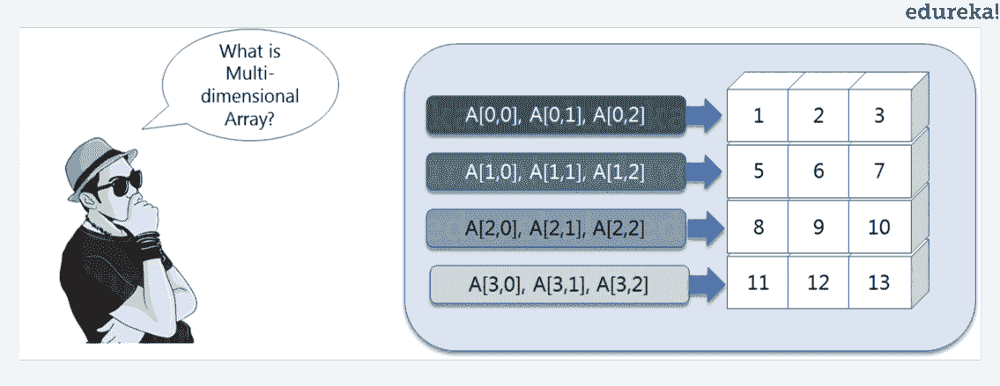
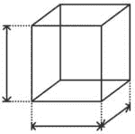
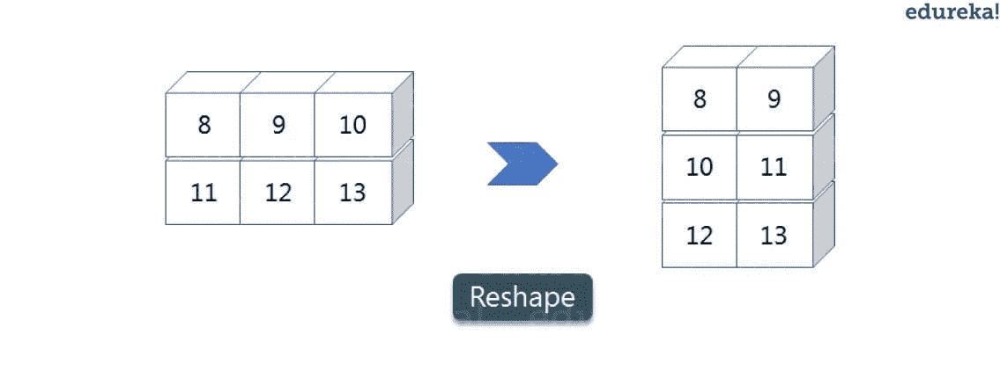
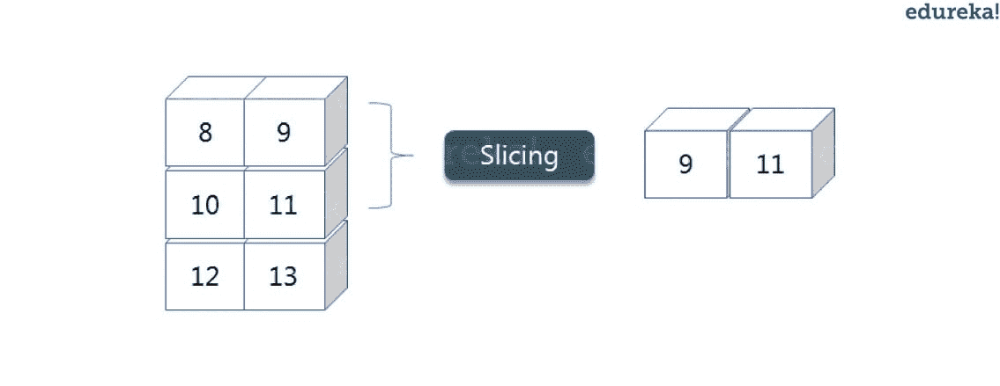
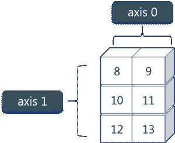
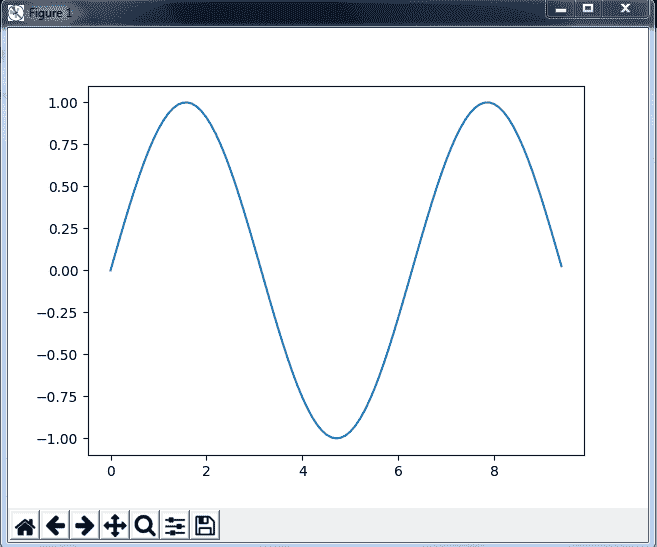
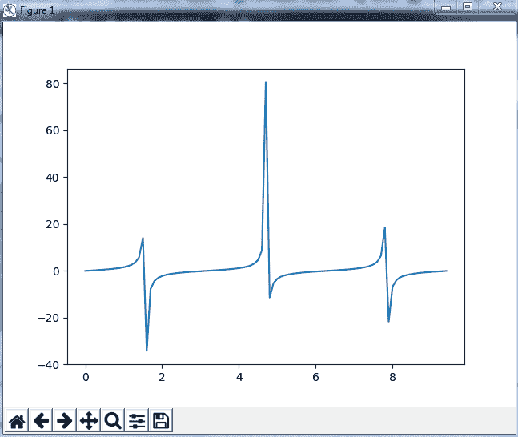

# Python NumPy 教程——通过示例学习 NumPy 数组

> 原文：<https://www.edureka.co/blog/python-numpy-tutorial/>

在我之前的[博客](https://www.edureka.co/blog/arrays-in-python/)中，你已经学习了关于 Python 中数组的和它的各种基础知识，比如函数、列表和数组以及它的创建。但是，这些只是基础知识，随着 ***[Python 认证](https://www.edureka.co/python-programming-certification-training)*** 成为当今编程领域最受欢迎的技能，显然还有很多东西要学。在本 Python NumPy 教程中，您将按以下顺序理解 NumPy 的各个方面:

 So, let’s get started! :-)

## **什么是 NumPy 数组？**

NumPy 是一个 Python 包，代表“数字 Python”。它是科学计算的核心库，包含一个强大的 n 维数组对象。

### **NumPy 用在哪里？**

Python NumPy 数组提供了集成 C、C++等的工具。这也是有用的线性代数，随机数能力等。NumPy 数组也可以用作通用数据的高效多维容器。现在，让我告诉你什么是 Python NumPy 数组。

**Python NumPy 数组:** Numpy 数组是一个功能强大的 N 维数组对象，以行和列的形式出现。我们可以从嵌套的 Python 列表中初始化 NumPy 数组，并访问它的元素。为了执行这些 NumPy 操作，您脑海中出现的下一个问题是:

### **如何安装 NumPy？**

要安装 Python NumPy，请在命令提示符下输入“pip install numpy”。安装完成后，转到您的 IDE(例如:PyCharm)并通过键入“import numpy as NP”简单地导入它

继续学习 python numpy 教程，让我们了解什么是多维 numpy 数组。

这里，我有不同的元素，分别存储在各自的内存位置。之所以说它是二维的，是因为它既有行也有列。在上图中，我们有 3 列 4 行可用。

### 如何启动 NumPy？

让我们看看它是如何在 PyCharm 中实现的:

### **一维 Numpy 数组:**

```
import numpy as np
a=np.array([1,2,3])
print(a)

```

输出—[1 2 3]

### **多维数组:**

```
a=np.array([(1,2,3),(4,5,6)])
print(a)

```

O/P-[[1 2 3][4 5 6]]

你们中的许多人一定想知道，如果我们已经有了 Python list，为什么还要使用 python NumPy？所以，让我们用这个 python NumPy 教程中的一些例子来理解一下。

## **Python NumPy 数组 v/s 列表**

### **为什么在 Python 中使用 NumPy？**

我们使用 python NumPy 数组而不是链表，原因如下:

1.  内存不足
2.  快
3.  方便

选择 python NumPy 数组的第一个原因是它比 list 占用更少的内存。然后，它在执行方面非常快，同时，使用 NumPy 非常方便。这就是 Python NumPy 数组相对于 list 的主要优势。别担心，我将在 PyCharm 中实际地逐一证明以上观点。考虑下面的例子:

```

import numpy as np

import time
import sys
S= range(1000)
print(sys.getsizeof(5)*len(S))

D= np.arange(1000)
print(D.size*D.itemsize)

```

O/P–14000

Four thousand

上面的输出显示 list(用 S 表示)分配的内存是 14000，而 NumPy 数组分配的内存只有 4000。由此，您可以得出结论，这两者之间有一个主要的区别，这使得 Python NumPy 数组成为优于 list 的首选。

接下来，我们来谈谈 python NumPy 数组与 list 相比如何更快更方便。

```

import time
import sys

SIZE = 1000000

L1= range(SIZE)
L2= range(SIZE)
A1= np.arange(SIZE)
A2=np.arange(SIZE)

start= time.time()
result=[(x,y) for x,y in zip(L1,L2)]
print((time.time()-start)*1000)

start=time.time()
result= A1+A2
print((time.time()-start)*1000)

```

O/P–1998848688486868617

在上面的代码中，我们定义了两个列表和两个 numpy 数组。然后，我们比较了查找列表和 numpy 数组的和所需的时间。如果您看到上述程序的输出，这两个值有显著的变化。List 用了 380 毫秒，而 numpy 数组用了将近 49 毫秒。因此，numpy 数组比 list 要快。 现在，如果你注意到我们为一个列表运行了一个“for”循环，返回两个列表的连接，而对于 numpy 数组，我们只是通过简单地打印 A1+A2 来添加两个数组。这就是为什么与列表相比，使用 numpy 要容易和方便得多。

因此，上面的例子证明了为什么你应该使用 python numpy 数组而不是 list！

继续学习 python numpy 教程，我们来关注一下它的一些操作。

您可以浏览 Python NumPy 教程的录音，我们的讲师已经用示例详细解释了这些主题，这将有助于您更好地理解这个概念。

## **Python NumPy 教程| NumPy 数组| Python 培训| Edureka**

[https://www.youtube.com/embed/8JfDAm9y_7s?rel=0&;showinfo=0](https://www.youtube.com/embed/8JfDAm9y_7s?rel=0&;showinfo=0)

## **Python NumPy 操作**

*   **ndim**:可以求出数组的维数，无论是二维数组还是一维数组。让我们来看看，实际上我们是如何找到维度的。在下面的代码中，借助' ndim '函数，我可以知道数组是一维的还是多维的。

```
import numpy as np
a = np.array([(1,2,3),(4,5,6)])
print(a.ndim)

```

输出–2

由于输出是 2，所以是二维数组(多维)。

*   **itemsize**:你可以计算出每个元素的字节大小。在下面的代码中，我定义了一个一维数组，在“itemsize”函数的帮助下，我们可以找到每个元素的大小。

```
import numpy as np
a = np.array([(1,2,3)])
print(a.itemsize)

```

输出–4

所以在上面的 numpy 数组中，每个元素占用 4 个字节。

*    ** dtype: ** 可以找到数组中存储的元素的数据类型。所以，如果你想知道一个特定元素的数据类型，你可以使用' dtype '函数，它将打印数据类型和大小。在下面的代码中，我定义了一个数组，并在其中使用了相同的函数。

```
import numpy as np
a = np.array([(1,2,3)])
print(a.dtype)

```

输出–int 32

可以看到，数组的数据类型是整数 32 位。同样，您可以分别使用' size '和' shape '函数找到数组的大小和形状。

```
import numpy as np
a = np.array([(1,2,3,4,5,6)])
print(a.size)
print(a.shape)

```

输出–6(1，6)

接下来，让我们向前看，看看使用 python numpy 模块还可以执行哪些操作。我们还可以使用 python numpy 操作来执行整形和切片操作。但是，什么是重塑和切割呢？所以让我在这个 python numpy 教程里一个一个的解释一下。

*   **重塑:** 重塑是当你改变行数和列数时，给一个对象一个新的视图。现在，让我们举一个例子来重塑下面的数组:

    正如你在上面的图片中看到的，我们有 3 列 2 行，现在已经变成了 2 列 3 行。让我给你演示一下这是怎么做的。

    ```
    import numpy as np
    a = np.array([(8,9,10),(11,12,13)])
    print(a)
    a=a.reshape(3,2)
    print(a)

    ```

    输出-[[8 9 10][11 12 13]][[8 9][10 11][12 13]]

*   **切片:**可以看出‘重塑’功能已经显示出它的神奇之处。现在，让我们来看另一个操作，即切片。切片基本上是从数组中提取一组特定的元素。这个切片操作与列表中的操作非常相似。考虑下面的例子:

    

    在进入上面的例子之前，我们先来看一个简单的例子。我们有一个数组，我们需要一个给定数组中的特定元素(比如 3 个)。让我们考虑下面的例子:

    ```
    import numpy as np
    a=np.array([(1,2,3,4),(3,4,5,6)])
    print(a[0,2])

    ```

    输出–3

    这里，数组(1，2，3，4)是你的索引 0，(3，4，5，6)是 python numpy 数组的索引 1。因此，我们打印了从第零个索引开始的第二个元素。向前一步，假设我们需要数组第 0 个和第 1 个索引的第 2 个元素。让我们看看你如何执行这个操作:

    ```
    import numpy as np
    a=np.array([(1,2,3,4),(3,4,5,6)])
    print(a[0:,2])

    ```

    输出-【3 5】

    这里冒号代表所有行，包括零。现在，为了获得第二个元素，我们将从这两行中调用 index 2，这将分别为我们提供值 3 和 5。

    接下来，为了消除混淆，假设我们还有一行，我们不想让它的第二个元素像上图一样打印出来。在这种情况下我们能做什么？ 考虑下面的代码:

    ```
    import numpy as np
    a=np.array([(8,9),(10,11),(12,13)])
    print(a[0:2,1])

    ```

    输出-【9 11】

    从上面的代码中可以看出，只打印了 9 和 11。当我写 0:2 时，这不包括数组第三行的第二个索引。因此，只有 9 和 11 被打印出来，否则你将得到所有的元素，即[9 11 13]。

*   **linspace** 这是 python numpy 中的另一个操作，它返回指定间隔内均匀分布的数字。考虑下面的例子:

    ```
    import numpy as np
    a=np.linspace(1,3,10)
    print(a)

    ```

    输出-【1。1.22222222 1.44444444 1.66666667 1.88888889 2.11111111 2.33333333 2.55555556 2.77777778 3.]

    从结果中可以看到，它打印了 1 到 3 之间的 10 个值。

*   **max/ min** 接下来，我们在 numpy 中有更多的操作，比如找到 numpy 数组的最小值、最大值以及和。让我们继续学习 python numpy 教程，并实际执行它。

    ```
    import numpy as np

    a= np.array([1,2,3])
    print(a.min())
    print(a.max())
    print(a.sum())

    ```

    输出–1 3 6

    你一定觉得这些都是很基本的，但是在这些知识的帮助下，你还可以完成更多更大的任务。现在，让我们理解 python numpy 中的**轴**的概念。

    

    如图所示，我们有一个 2*3 的 numpy 数组。这里，行被称为轴 1，列被称为轴 0。现在你一定想知道这些轴有什么用？

    假设你想计算所有列的总和，那么你可以使用 axis。让我实际演示一下，如何在 PyCharm 中实现 axis:

    ```
    a= np.array([(1,2,3),(3,4,5)])
    print(a.sum(axis=0))

    ```

    输出-【4 6 8】

    因此，所有列的总和相加，其中 1+3=4，2+4=6，3+5=8。类似地，如果您将轴替换为 1，那么它将打印[6 12]，其中所有行都被添加。

*   **平方根&标准差**

    使用 python numpy 可以执行各种数学函数。你可以找到数组的平方根，标准差。所以，让我们实现这些操作:

    ```
    import numpy as np
    a=np.array([(1,2,3),(3,4,5,)])
    print(np.sqrt(a))
    print(np.std(a))

    ```

    输出-[[1。1.41421356 1.73205081]【1.73205081 2。2.23606798]]1.29099444874

    从上面的输出可以看出，所有元素的平方根都被打印出来了。此外，打印上述数组的标准偏差，即每个元素与 python numpy 数组的平均值相差多少。

*   **加法运算** 您可以对 numpy 数组执行更多运算，即两个矩阵的加、减、乘、除。让我先从 python numpy 教程开始，实际展示给你看:

    ```
    import numpy as np
    x= np.array([(1,2,3),(3,4,5)])
    y= np.array([(1,2,3),(3,4,5)])
    print(x+y)

    ```

    输出-[[2 4 6][6 8 10]]

    这极其简单！对吗？同样，我们可以执行其他操作，如减法、乘法和除法。考虑下面的例子:

    ```
    import numpy as np
    x= np.array([(1,2,3),(3,4,5)])
    y= np.array([(1,2,3),(3,4,5)])
    print(x-y)
    print(x*y)
    print(x/y)

    ```

    输出-[[0 0 0][0 0 0]][[1 4 9][9 16 25]][[1。1.1.] [ 1.1.1.]]

*   **垂直&水平堆叠** 接下来，如果你想连接两个数组，而不仅仅是将它们相加，你可以使用两种方式来执行——*垂直堆叠*和*水平堆叠*。我就在这个 python numpy 教程里一个一个展示吧。

    ```
    import numpy as np
    x= np.array([(1,2,3),(3,4,5)])
    y= np.array([(1,2,3),(3,4,5)])
    print(np.vstack((x,y)))
    print(np.hstack((x,y)))

    ```

    输出-[[1 2 3][3 4 5][1 2 3][3 4 5]][[1 2 3 1 2 3][3 4 5 3 4 5]]

*   **ravel** 还有一个操作可以将一个 numpy 数组转换成一个单列，即 *ravel* 。让我展示一下它是如何实际实现的:

    ```
    import numpy as np
    x= np.array([(1,2,3),(3,4,5)])
    print(x.ravel())

    ```

    

    输出-【1 2 3 3 4 5】

    让我们继续学习 python numpy 教程，看看它的一些特殊功能。

    ## **Python Numpy 特殊函数**

    numpy 中有各种特殊功能，如正弦、余弦、正切、对数等。首先，让我们从正弦函数开始，我们将学习绘制它的图形。为此，我们需要导入一个名为 *matplotlib* 的模块。要了解这个模块的基础知识和实际实现，可以参考 **[Matplotlib 教程](https://www.edureka.co/blog/python-matplotlib-tutorial/)** 。继续学习 python numpy 教程，让我们看看这些图表是如何绘制的。

    ```
    import numpy as np
    import matplotlib.pyplot as plt
    x= np.arange(0,3*np.pi,0.1)
    y=np.sin(x)
    plt.plot(x,y)
    plt.show()

    ```

    输出—

    

    类似地，你可以绘制任何三角函数的图形，如 cos、tan 等。我再给你看一个例子，你可以画出另一个函数的图形，比如说*。*

    ```
    import numpy as np
    import matplotlib.pyplot as plt
    x= np.arange(0,3*np.pi,0.1)
    y=np.tan(x)
    plt.plot(x,y)
    plt.show()

    ```

    输出-

    继续 python numpy 教程，让我们看看 numpy 数组中的一些其他特殊功能，如指数和对数函数。现在在指数中， *e* 值等于 2.7，在对数中，它实际上是以 10 为底的*对数*。当我们谈到自然对数，即以 e 为底的对数时，它被称为 Ln。所以我们来看看实际上是怎么实现的:

    ```
    a= np.array([1,2,3])
    print(np.exp(a))

    ```

    输出-【2.71828183 7.3890561 20.08553692】

    正如你在上面的输出中看到的，指数值被打印出来，即 *e* 的 1 次幂是 *e，*得出的结果是 2.718……类似地， *e* 的 2 次幂得出的值接近 7.38，依此类推。接下来，为了计算 log，我们来看看如何实现:

    ```
    import numpy as np
    import matplotlib.pyplot as plt
    a= np.array([1,2,3])
    print(np.log(a))

    ```

    输出-【0。0.69314718 1.09861229]

    这里，我们计算了自然对数，给出了如上所示的值。现在，如果我们想要以 10 为基数的对数，而不是 Ln 或自然对数，你可以遵循下面的代码:

    ```
    import numpy as np
    import matplotlib.pyplot as plt
    a= np.array([1,2,3])
    print(np.log10(a))

    ```

    输出-【0。0.30103 0.47712125]

    到此，我们结束了这个 python numpy 教程。我们已经介绍了 python numpy 的所有基础知识，所以您现在可以开始练习了。你练习得越多，你学到的就越多。

    如果你想在这个令人兴奋的领域拓展你的业务，试试我们的[人工智能课程](https://www.edureka.co/executive-programs/machine-learning-and-ai)。它是与瓦朗加尔的国家技术学院 E & ICT 学院合作提供的。这个执行硕士课程为学生提供了推进职业发展所需的工具、技术和工具的信息。

    *有问题吗？请在这篇“Python Numpy 教程”的评论部分提到它，我们会尽快回复您。*

    *要深入了解 Python 及其各种应用程序，您可以注册参加 Python 在线实时培训，该培训提供全天候支持和终身访问。*