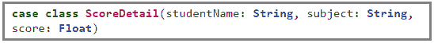
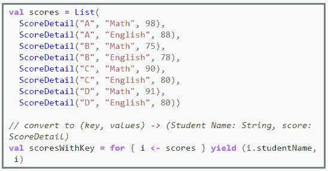
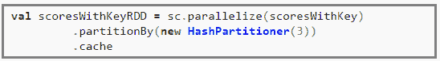
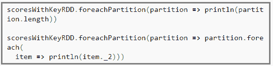
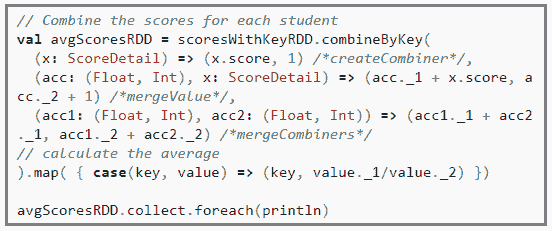

# Apache Spark combineByKey 解释说

> 原文：<https://www.edureka.co/blog/apache-spark-combinebykey-explained>

*供稿:Prithviraj Bose*

Spark 是一个为快速计算而设计的快如闪电的集群计算框架，目前市场上对拥有 ***[Apache Spark 和 Scala 认证](https://www.edureka.co/apache-spark-scala-training)*** 的专业人士的需求很大。Spark 中有一个强大的 API，它是 **combineByKey** 。

Scala API:[org . Apache . spark . pairrddfunctions . combinebykey](http://spark.apache.org/docs/latest/api/scala/index.html#org.apache.spark.rdd.PairRDDFunctions "Scala API")。

Python API: [pyspark。RDD.combineByKey](http://spark.apache.org/docs/latest/api/python/pyspark.html#pyspark.RDD) 。

API 采用三个函数(如 *Python* 中的 *lambda 表达式*或 *Scala* 中的*匿名函数*，即，

1.  创建组合器函数:x
2.  合并值函数:y
3.  合并组合器函数:z

并且 API 格式为 ***combineByKey(x，y，z)*** 。

让我们看一个例子(在 Scala 中)。完整的 Scala 源码可以在这里找到。

我们的目标是找出每个学生的平均分。

这里有一个占位符类 *ScoreDetail* ,存储学生姓名和某一科目的分数。

一些测试数据被生成并转换成密钥对值，其中 *key =学生姓名*和 *value = ScoreDetail* 实例。

然后我们创建一对 RDD，如下面的代码片段所示。只是为了实验，我已经创建了一个大小为 3 的哈希分割器，所以这三个分区将分别包含 2、2 和 4 个键值对。这一点在我们研究每个分区的部分中得到了强调。

现在我们可以探索每个分区。第一行打印每个分区的长度(每个分区的键值对的数量)，第二行打印每个分区的内容。

这是最后一个动作，我们计算每个学生的平均分，将所有分区的分数结合起来。

上面的代码流程如下… 首先我们需要创建一个组合器函数，本质上是一个 tuple = (value，1)用于每个分区中遇到的每个键。在这个阶段之后，分区中每个(key，value)的输出是(key，(value，1))。

然后，在下一次迭代中，使用每个键的合并值函数来合并每个分区的组合器函数。在这个阶段之后，每个分区中每个(key，(value，1))的输出是(key，(total，count))。

最后，合并组合器函数合并执行器中跨分区的所有值，并将数据发送回驱动程序。在这个阶段之后，每个分区的 every (key，(total，count))的输出是 (key，(totalAcrossAllPartitions，countAcrossAllPartitions))。

该映射将 (key，tuple) = (key，(totalAcrossAllPartitions，countAcrossAllPartitions)) 转换为(key，tuple)计算每个键的平均值。_ 1/元组。_2).

最后一行打印驱动程序端所有学生的平均分数。

有问题要问我们吗？在评论区提到它们，我们会回复你。

**相关帖子:**

[开始使用 Apache Spark 和 Scala](https://www.edureka.co/apache-spark-scala-training "Get started with Apache Spark and Scala")

[揭开 Spark 中分区的神秘面纱](https://www.edureka.co/blog/demystifying-partitioning-in-spark "Demystifying partitioning in Spark")