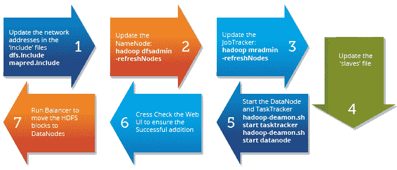

# 在 Hadoop 集群中调试和停用节点

> 原文：<https://www.edureka.co/blog/commissioning-and-decommissioning-nodes-in-a-hadoop-cluster/>

Hadoop 框架最吸引人的特性之一是其对商用硬件的**利用。然而，这导致 Hadoop 集群中频繁的 DataNode 崩溃。Hadoop 框架的另一个显著特征是根据数据量的快速增长**的**易扩展性。由于这两个原因，Hadoop 管理员最常见的任务之一就是**委托**(添加)和**退役**(移除)Hadoop 集群中的数据节点。**

## **Hadoop 集群中节点的试运行和退役:**

[ Data Nodes in a Hadoop Cluster")](https://www.edureka.co/blog/commissioning-and-decommissioning-nodes-in-a-hadoop-cluster/)

上图显示了停用集群中的 DataNode 的逐步过程。

第一个任务是更新**【HDFS】**(HDFS-site . XML)和**MapReduce**(mapred-site . XML)的' **exclude** '文件。

“排除”文件:

*   jobtracker 的包含 jobtracker 应该排除的主机列表。如果该值为空，则不排除任何主机。
*   Namenode 的 *包含不允许连接到 Namenode 的主机列表。*

**以下是 hdfs-site.xml 和 mapred-site.xml 中排除文件的示例配置:**

**hdfs-site.xml**

*<属性>* *<名称>DFS . hosts . exclude</名称>* *<值>/home/Hadoop/excludes</值>* *<最终>真</最终>**</属性>*

**mapred-site.xml**

*<属性>* *<名称>mapred . hosts . exclude</名称>* *<值>/home/Hadoop/excludes</值>* *<最终>真</最终>**</属性>*

**注意:**必须指定文件的完整路径名。

### **同样，我们有“包含”文件:**

*   *用于 jobtracker* 包含可能连接到 jobtracker 的节点列表。如果该值为空，则允许所有主机。
*   *用于 Namenode* ，包含允许连接到 Namenode 的主机列表。如果该值为空，则允许所有主机。

' **dfsadmin** 和' **mradmin** '命令用更改刷新配置，使它们知道新节点。

主服务器上的'**从站**'文件包含所有数据节点的列表。这也必须更新，以确保在未来的 hadoop 守护进程启动/停止的任何问题。

**数据节点调试过程中的重要步骤是运行集群平衡器。**

> hadoop 平衡器-阈值 40

**平衡器**试图通过将块数据从旧节点复制到新委托的节点，在数据节点之间提供某种阈值的平衡。

所以，这就是你可以做的——在 Hadoop 集群中**调试**和**停用**节点。

通过[大数据课程](https://www.edureka.co/big-data-hadoop-training-certification)更好地了解 Hadoop 集群。

有问题要问我们吗？请在评论区提到它，我们会给你回复。

**相关链接:**

[学习 Hadoop 的 5 个理由](https://www.edureka.co/blog/5-reasons-to-learn-hadoop)

[大数据入门&Hadoop](https://www.edureka.co/big-data-and-hadoop)