# Java 数组教程——Java 中的一维与多维数组

> 原文：<https://www.edureka.co/blog/java-array/>

在之前的博客中，你已经了解了 ***[Java 字符串](https://www.edureka.co/blog/java-string/)*** 。通过这篇关于 Java 数组的博客，我将向您解释 Java 中数组的概念以及单个&多维数组是如何工作的。学习 Java 数组对于获得 ***[java 认证](https://www.edureka.co/java-j2ee-soa-training)*** 至关重要。

在这篇 Java Array 博客中，我将讨论以下主题:

*   [什么是 Java 数组？](#WhatisJavaArray?)
*   [访问 Java 数组中的特定元素](#AccessingaSpecificElementinaJavaArray)
*   [Java 中的多维数组](#MultidimensionalArraysinJava)
*   [将 Java 数组传递给一个方法](#PassingJavaArraytoaMethod)

在我们继续之前，让我们看看为什么我们需要 Java 数组:

*   数组是保存数据的重要结构。
*   Java 允许我们用数组来保存很多同类型的对象。
*   它可以在一个循环的帮助下通过索引来访问元素。


现在，让我们从这篇关于 Java 数组的文章开始，了解数组到底是什么。

## **什么是 Java 数组？**

Java 中的数组是作为对象在 Java 中实现的同构数据结构。数组存储一个或多个特定数据类型的值，并提供索引访问来存储这些值。数组中的特定元素通过其索引来访问。数组提供了一种对相关信息进行分组的便捷方式。

获取数组是一个两步的过程。

*   首先，你必须声明一个期望数组类型的变量
*   其次，你必须使用 **new** 来分配保存数组的内存，并将它分配给数组变量

那么，让我们看看如何以不同的方式声明数组。

### **Java 数组初始化的一般形式**

### 

**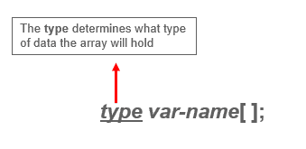例子*:-****int month _ days[]；* 

### **Java 数组初始化的一般形式**

**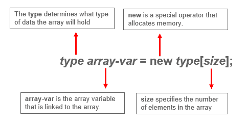举例:-** 

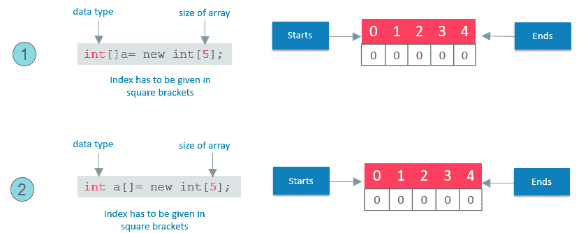

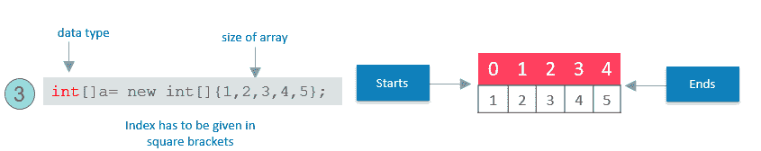数组可以在声明的时候初始化。该数组将自动创建得足够大，以容纳您在数组初始值设定项中指定的元素数量。有**没有**需要用**新**。现在，让我们看看如何实现这一点。

### **Java 数组初始化的一般形式**

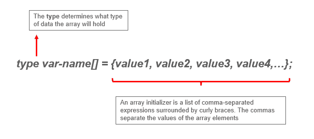

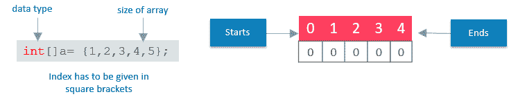下面的代码创建一个初始化的整数数组:

```

class MyArray{

public static voide main(String args[]){

int month_days[ ] = {31,28,31,30,31,30,31,30,31,30,31};

System.out.println("April has " + month+days[3] + "days.");

}

}

```

只有我解释了如何访问 Java 数组中的元素，这才公平。

## **访问 Java 数组中的特定元素**

在数组中，我们可以通过方括号中的索引来访问特定的元素。

**举例:-**

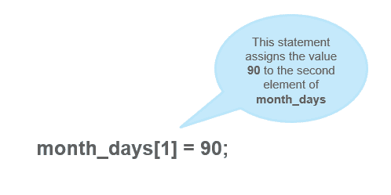

把所有的碎片拼在一起，

```
public static void main(String args[]) {
   int month_days[];
    month_days = new int[12];
    month_days[0] = 31;
    month_days[1] = 28;
    month_days[2] = 31;
    month_days[3] = 30;
    month_days[4] = 31;
    month_days[5] = 30;
    month_days[6] = 31;
    month_days[8] = 30;
    month_days[9] = 31;
    month_days[10] = 30;
    month_days[11] = 31;
     System.out.println("April has " + month_days[3] + " days.");
     }
}

```

所以，这就是关于数组及其声明以及如何使用一维数组的全部内容。

如果我告诉你，数组里面可以有数组。我知道这听起来有点复杂，但别担心，我知道如何让你变得简单。

**Java 多维数组**

多维数组有 ***数组*** 数组。

### **声明多维数组**

为了声明它，我们必须使用另一组方括号来指定每个额外的索引。

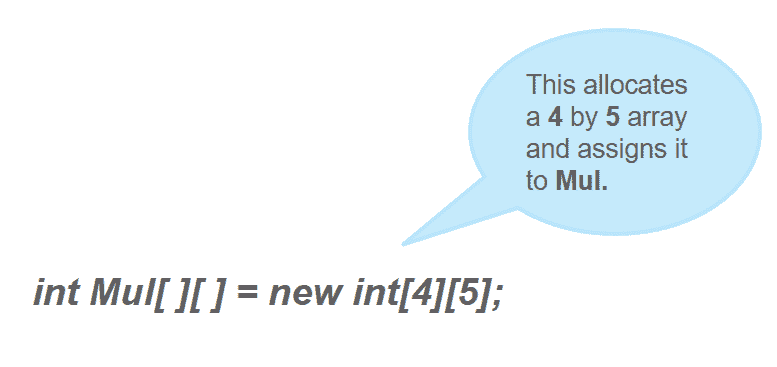从概念上来说，上面声明的数组将如图所示:-

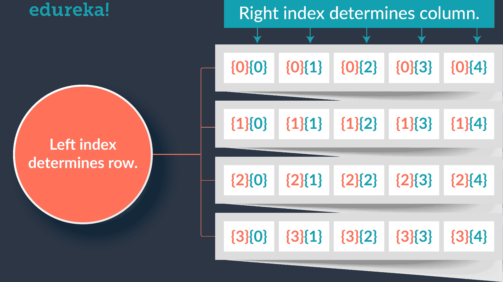现在让我们演示一下多维数组。

下面的程序从左到右、从上到下对数组中的每个元素进行编号，然后显示这些值:

```
class Mul2D{
 public static void main(String args[]) {
       int mul2d[][]= new int[4][5];
        int i, j, k = 0;
     for(i=0; i<4; i++)
       for(j=0; j<5; j++) {
       Mul2D[i][j] = k;
       k++;
}
for(i=0; i<4; i++) {
    for(j=0; j<5; j++);
       System.out.print(mul2d[i][j] + " ");
       System.out.println();
       }
   }
}

```

该程序生成以下输出:

```
 0 1 2 3 4 5 6 7 8 9 10 11 12 13 14 15 16 17 18 19 
```

这些是其他多维数组表示的其他数据类型。

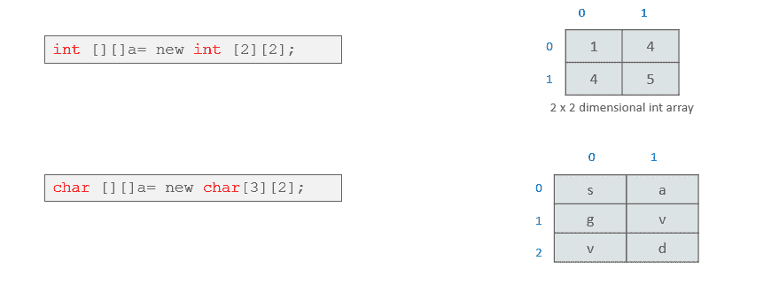

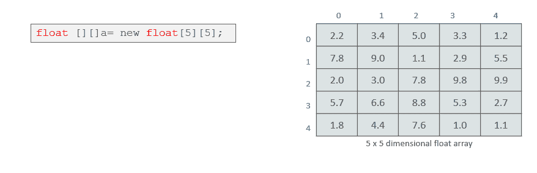

所以，这都是关于多维数组的。现在，让我们看看，如何像其他数据类型一样将数组作为参数传递给方法。

## **将 Java 数组传给一个方法**

我们也可以将数组传递给方法，就像我们可以将原始类型值传递给方法一样。

**举例:-**

```
public class PMethods{
public static void display(int y[])
     {
             System.out.println(y[0]);
             System.out.println(y[1]);
             System.out.println(y[2]);

     }
public static void main(String args[])
     {
     int x[] = { 1, 2, 3 };
     display(x);
     }
}

```

这将是程序的输出

```
1

2

3
```

这就把我们带到了 Java Array 博客的结尾。我希望你喜欢这篇关于 Java Array 的文章。如果你正在寻找深入的 Java 知识，d o 阅读 ***[Java 教程](https://www.edureka.co/blog/java-tutorial/)*** 博客在那里你将会对下面的主题和例子进行详细的解释。

*   Java 中的数据类型和操作
*   控制语句
*   阶级&对象
*   阵列
*   基础哎呀概念

**你也可以通过我们的 YouTube [*Java 教程*](https://www.youtube.com/playlist?list=PL9ooVrP1hQOFR25JoQW3h3n5pBs77e6KU) 播放列表学习 Java。快乐学习！！**

*如果您发现“**Java Array”**上的这篇博客很有用，请查看 Edureka 的 **[Java 认证培训](https://www.edureka.co/java-j2ee-soa-training)** ，edu reka 是一家值得信赖的在线学习公司，在全球拥有超过 250，000 名满意的学习者。有问题吗？请在评论区提到它，我们会给你回复。*

*有问题吗？请在评论区提到它，我们会给你回复。*