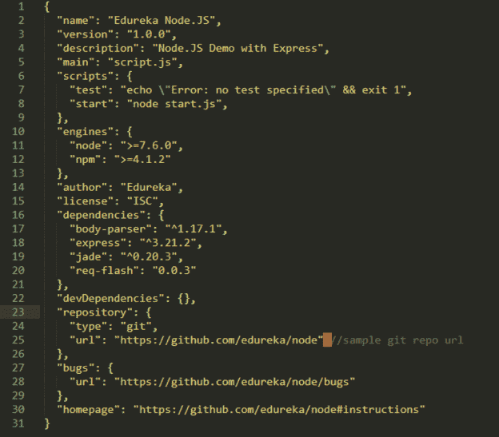
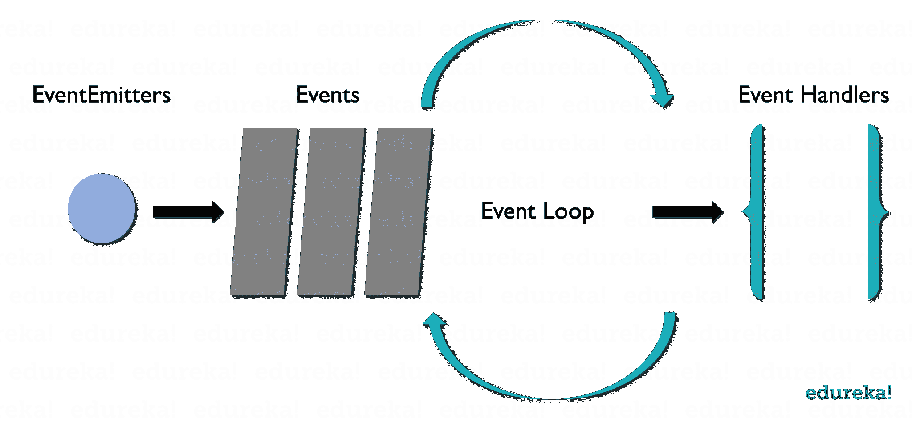
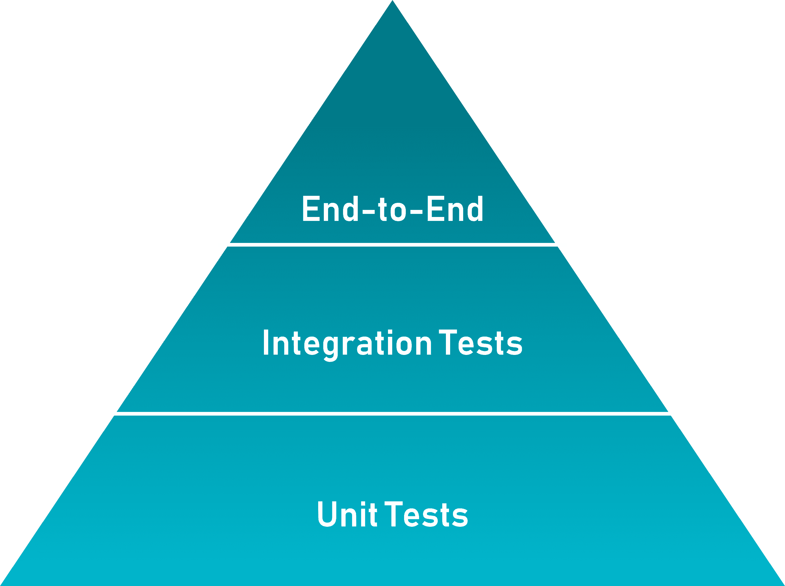

# Top Node.js 年你必须准备的面试问题

> 原文：<https://www.edureka.co/blog/interview-questions/top-node-js-interview-questions-2016/>

Node.js，服务器端脚本工具，使用它可以轻松构建任何东西，从简单的命令行程序到复杂的企业级 web 应用程序。这也是为什么大多数行业都需要一个 ***[认证的 Node.js 开发者](https://www.edureka.co/blog/nodejs-tutorial)*** 来管理整个服务器端。Node.js 也带来了不同层次的就业机会。如果你打算在不久的将来参加 Node.js 面试，我们在这里可以帮助你列出你在 2023 年必须准备的 50 个 Node.js 面试问题。

在这篇 Node.js 面试问题的文章中，我根据问题的难度将问题分成了 3 个部分:

*   [Node.js 面试问题——初学者水平](#beginnerslevel)
*   [Node.js 面试题—中等水平](#moderatelevel)
*   [Node.js 面试题—进阶](#advancedlevel)

在我开始这篇 Node.js 面试问题的文章之前，让我向最近可能参加过 Node.js 面试的读者提出一个请求。所以，如果你遇到了在采访中被问到但在这篇文章中没有的问题，请在下面的评论区提出这些问题。我们将努力尽早回答这些问题，以便其他人也能从中受益。

现在，让我们开始吧。

## **基础 Node.js 大一新生面试问题**

### **1。区分 JavaScript 和 Node.js.**

<caption>**JavaScript vs Node.js**</caption>
| ***特色*** | **JavaScript** | **Node.js** |
| *式* | 编程语言 | 用于 JavaScript 的解释器和环境 |
| *效用* | 用于 web 应用程序的任何客户端活动 | 用于访问或执行任何操作系统的任何非阻塞操作 |
| *发动机运转* | 蜘蛛猴(火狐)、JavaScript Core (Safari)、V8(谷歌 Chrome)等。 | V8(谷歌浏览器) |

### **2。Node.js 是什么？**

Node.js 是在 Chrome 的 V8 JavaScript 引擎上开发的一个非常强大的框架，可以将 JavaScript 直接编译成本机代码。它是一个轻量级框架，用于创建服务器端 web 应用程序，并扩展 JavaScript API 以提供常见的服务器端功能。它通常用于大型应用程序开发，尤其是视频流网站、单页面应用程序和其他 web 应用程序。

### **3。列出使用 Node.js 的主要好处？**

| **特征** | **描述** |
| ***快*** | Node.js 建立在谷歌 Chrome 的 V8 JavaScript 引擎上，这使得它的库在代码执行上非常快 |
| ***异步*** | 基于 Node.js 的服务器从不等待 API 返回数据，因此它是异步的 |
| ***可扩展*** | 它具有高度的可扩展性，因为它的事件机制有助于服务器以非阻塞的方式做出响应 |
| ***开源*** | Node.js 有一个广泛的开源社区，该社区帮助开发了一些优秀的模块，为 Node.js 应用程序增加了额外的功能 |
| ***没有缓冲*** | Node.js 应用程序只是以块的形式输出数据，从不缓冲任何数据 |

### **4。Angular 和 Node.js 有什么区别？**

|  | **Node.js** |
| 1。它是一个**开源**的 web 应用开发框架 | 1。它是应用程序的跨平台**运行时环境** |
| 2。它是用打字稿写的 | 2。它是用 **C、C++和 JavaScript** 语言编写的 |
| 3。用于构建**单页面**客户端 web 应用 | 3。用于构建 f **ast 和可扩展的**服务器端网络应用 |
| 4。Angular 本身是一个 **web 应用框架** | 4。Node.js 有很多**不同的框架**，比如 Sails.js、Partial.js、Express.js 等等。 |
| 5。非常适合创建**高度活跃和互动的**网络应用 | 5。非常适合开发**小型**项目 |
| 6。有助于**将一个应用拆分成 MVC 组件** | 6。有助于**生成数据库查询** |
| 7。适合开发**实时应用** | 7 .。适用于需要更快**和更具可扩展性**的情况 |

### **5。为什么 Node.js 是单线程的？**

为了支持异步处理，Node.js 使用了单线程模型。使用异步处理，应用程序可以在 web 负载下执行得更好，可伸缩性更强。因此，Node.js 利用了一种[单线程模型](https://www.edureka.co/blog/nodejs-tutorial/#nodearchitecture)方法，而不是典型的基于线程的实现。

### **6。Node.js 是如何工作的？**

Node.js 是一个虚拟机，使用 JavaScript 作为其脚本语言，运行在 v8 环境下。它在单线程事件循环和非阻塞 I/O 上工作，提供高速率，因为它可以处理更多的并发请求。此外，通过使用[“HTTP”模块](https://www.edureka.co/blog/nodejs-tutorial/#http)，Node.js 可以在任何独立的 web 服务器上运行。

### **7。Node.js 可以用在哪里？**

Node.js 可以用来开发:

*   实时网络应用
*   网络应用
*   分布式系统
*   通用应用

### **8。Node.js 中有多少种类型的 API 函数？**

node . js 中有两种类型的 API 函数:

*   异步、非阻塞功能
*   同步、闭锁功能

### 9。**异步和非阻塞有什么区别？**

| **异步** | **无阻塞** |
| 异步就是不同步的意思。使用这些，我们可以发出不等待服务器响应的异步 HTTP 请求。这些函数继续响应已经收到服务器响应的请求。 | 非阻塞功能用于 I/O 操作。它们会立即响应任何可用的数据，并根据请求继续运行。如果无法检索到任何答案，API 会立即返回一个错误。 |

如果你对这些 Node.js 面试问题有任何挑战，请在下面的评论部分提出你的问题。

### **10。package.json 是什么？**

node . js 中的 [**package.json** **文件**](https://www.edureka.co/blog/nodejs-tutorial/#json) 是整个应用的心脏。它基本上是包含项目元数据的清单文件，我们在其中定义包的属性。

### ** 11。你所理解的事件驱动编程是什么？**

事件驱动编程是一种大量利用事件来触发各种功能的方法。事件可以是鼠标点击、按键等等。当事件发生时，会执行一个已经注册到元素的回调函数。这种方法主要遵循发布-订阅模式。由于[事件驱动编程](https://www.edureka.co/blog/nodejs-tutorial/#events)，Node.js 比其他技术更快。

### **12。Node.js 中的*事件循环*是什么，它是如何工作的？**

Node.js 中的事件循环处理应用程序中的所有异步回调。这是 Node.js 最重要的方面之一，也是 Node.js 拥有非阻塞 I/O 的原因。由于 Node.js 是一种事件驱动的语言，您可以轻松地将侦听器附加到事件，然后当事件发生时，回调将由特定的侦听器执行。每当调用 setTimeout、http.get 和 fs.readFile 等函数时，Node.js 都会执行事件循环，然后继续执行下一个代码，而不等待输出。整个操作完成后，Node.js 接收输出，然后执行回调函数。这就是为什么所有的回调函数都放在一个循环的队列中。一旦收到响应，它们就会被逐一执行。



### **13。在 Node.js.** 的上下文中解释 REPL

Node.js 中的 REPL 代表 **R** ead， **E** val， **P** rint， **L** oop。它代表一个计算机环境，如窗口控制台或 Unix/Linux shell，在这里可以输入任何命令，然后系统可以输出响应。默认情况下，Node.js 与 REPL 环境捆绑在一起。REPL 可以执行下列任务:

*   **Read:** 读取用户的输入，将其解析成 JavaScript 数据结构，然后存储在内存中。
*   **Eval:** 接收并评估数据结构。
*   **打印:**打印最终结果。
*   **循环:**循环提供的命令，直到 *CTRL+C* 被按下两次。

### **14。列出应该使用事件循环异步完成的任务？**

下面是必须使用事件循环异步完成的任务列表:

*   输入/输出操作
*   繁重的计算
*   任何需要封锁的东西

### **15。列出 Node.js 中使用哪个“控制流”控制函数调用的步骤？【T2**

1.  控制执行顺序
2.  收集数据
3.  限制并发
4.  调用程序中的下一步

Want to upskill yourself to get ahead in your career? Check out this video

## **2023 年要学的十大技术| Edureka**

     本期 Edureka 视频将向您介绍 2023 年市场上所有您应该关注的热门和趋势技术。为了在 2023 年有一个成功的职业生涯，你需要学习这些趋势技术。

[https://www.youtube.com/embed/M2NyXKxyUGc](https://www.youtube.com/embed/M2NyXKxyUGc)

## **中级 Node.js 面试题——中等水平**

### **16。你对测试金字塔的理解是什么？**

测试金字塔基本上是一个图表，描述了为了项目的成功开发，需要编写多少单元测试、集成测试和端到端测试的比率。【T2

### **17。Node.js 中的错误优先回调是什么？**

Node.js 中的错误优先回调用于传递错误和数据。您需要传递给这些函数的第一个参数必须是一个错误对象，而其他参数代表相关数据。因此，您可以传递错误对象来检查是否有任何错误并处理它。如果没有问题，你可以继续进行随后的争论。

```
var myPost = new Post({title: 'edureka'});
myPost.save(function(err,myInstance){
if(err){
//handle error and return
}
//go ahead with `myInstance`
});
```

### **18。解释 module.exports 的用途？**

Node.js 中的一个模块用于将所有相关的代码封装到一个单独的代码单元中，通过将所有相关的函数转移到一个单独的文件中就可以解释这个代码单元。例如，假设您有一个名为 greet.js 的文件，其中包含如下所示的两个函数:

```
module.exports = {
greetInHindi: function(){
return "NAMASTE";
},
greetInKorean: function(){
return "ANNYEONGHASEYO";
}};
```

如你所见，module.exports 提供了两个函数，可以使用下面的代码导入到另一个文件中:

```
var eduGreets = require ("./greet.js");
eduGreets.greetInHindi() //NAMASTE
eduGreets.greetInKorean() //ANNYEONGHASEYO
```

### **19。Node.js 中的 Reactor Pattern 你是怎么理解的？**

Node.js 中的 **反应器模式**基本上是一个非阻塞 I/O 操作的概念。这种模式提供了一个与每个 I/O 操作相关联的处理程序，当一个 I/O 请求产生时，它就被提交给一个*解复用器*。这个解复用器是一个通知接口，它能够以非阻塞 I/O 模式处理并发性。它还有助于以事件的形式收集每个请求，然后将每个事件放入队列中。从而导致事件队列的生成。同时，我们有我们的事件循环，它迭代事件队列中的事件。

### **20。“前端”和“后端”开发有什么区别？**

| **前端开发** | **后端开发** |
| 1。使用标记和网络语言，如 HTML，CSS， [JavaScript](https://www.edureka.co/blog/what-is-javascript/) | 1。使用编程和脚本语言，如 [Python](https://www.edureka.co/blog/python-tutorial/) 、 [Ruby](https://www.edureka.co/blog/ruby-on-rails-tutorial/) 、Perl 等。 |
| 2。基于异步请求和 AJAX | 2。基于服务器架构 |
| 3。更好的可访问性 | 3。增强的安全性 |
| 4。用于 SEO | 4。用于备份 |

### **21。Node.js 的 LTS 版本是什么？**

**【LTS】**站**L**ONG**T**erm**S**node . js 的支持版本，接收所有关键的错误修复以及安全更新和性能改进。这些版本至少支持 18 个月，主要关注稳定性和安全性。对 LTS 版本的修改仅限于错误修复、安全升级、npm 和文档更新、性能改进等。

### **22。列出 Node.js 中主要的安全实现？**

node . js 中主要的安全实现有:

1.  认证
2.  错误处理

### **23。你所理解的回调地狱是什么？**

回调地狱也被称为末日金字塔。这是一种由密集嵌套的回调导致的模式，不可读且难以处理。它通常包含多个嵌套的回调函数，这反过来使得代码难以阅读和调试。这是由异步逻辑的不正确实现引起的。

```
async_A(function(){
async_B(function(){
async_C(function(){
async_D(function(){
....
});
});
});
});
```

如果你对这些 Node.js 面试问题有任何挑战，请在下面的评论部分提出你的问题。

### **24。解释一下 libuv。**

Libuv 是 Node.js 的一个多平台支持[库，主要用于异步 I/O。它最初是为 Node.js 开发的，随着时间的推移，它已广泛应用于其他系统，如 Luvit、pyuv、Julia 等。Libuv 基本上是基于平台的围绕 libev/ IOCP 的抽象，为用户提供基于 libev 的 API。libuv 的一些重要特性是:](https://www.edureka.co/blog/node-js-npm-tutorial/)

*   全功能事件循环支持
*   文件系统事件
*   异步文件&文件系统操作
*   异步 TCP & UDP 套接字
*   子进程

### **25。解释 Node.js 中中间件的概念？**

一般来说，中间件是一个接收请求和响应的功能对象。换句话说，在应用程序的请求-响应周期中，这些函数可以访问各种请求&响应对象以及周期的下一个函数。中间件的下一个功能是借助一个变量来表示的，这个变量通常叫做 next。中间件功能最常执行的任务有:

*   执行任何类型的代码
*   更新或修改请求和响应对象
*   完成请求-响应循环
*   调用堆栈中的下一个中间件

### **26。解释 URL 模块的概念。**

node . js 的 **URL 模块**为 **URL** 解析和解析提供了各种实用工具。这是一个内置的模块，可以帮助把网址分成一个可读的格式:

```
var url = require('url');
```

例如:

```
var url = require('url');
var adrs = 'http://localhost:8082/default.htm?year=2019&amp;amp;month=april';
var q = url.parse(adr, true);
console.log(q.host); //returns 'localhost:8082'
console.log(q.pathname); //returns '/default.htm'
console.log(q.search); //returns '?year=2019 and month=april'
var qdata = q.query; //returns an object: { year: 2019, month: 'april' }
console.log(qdata.month); //returns 'april'
```

### **27。你对 ESLint 的理解是什么？**

ESLint 是一个开源项目，最初由 Nicholas C. Zakas 于 2013 年开发，旨在通过一个插件为 JavaScript 提供一个林挺实用程序。Node.js 中的 Linters 是搜索某些 bug 类的好工具，尤其是那些与变量作用域相关的 bug 类。

### **28。对于 Node.js，Google 为什么要用 V8 引擎？**

谷歌使用 V8，因为它是一个 Chrome 运行时引擎，可以将 JavaScript 代码转换成本机代码。这反过来加快了应用程序的执行和响应过程，并为您提供了一个快速运行的应用程序。

### **29。解释控制流函数的工作原理。**

在 Node.js 中，控制流函数基本上是在异步函数调用之间执行的代码。下面是执行它必须遵循的步骤:

1.  首先，必须控制执行的顺序。
2.  然后，需要收集所需的数据。
3.  接下来，必须限制并发性。
4.  完成后，必须调用程序的下一步。

### **30。** **列出 async.queue 作为输入的两个参数？**

下面是 async.queue 作为输入的两个参数:

1.  任务功能
2.  并发值

### **31。Node.js 中 spawn()和 fork()方法的区别？**

在 Node.js 中，spawn()用于使用提供的命令集启动一个新进程。该方法不会创建新的 V8 实例，只有一个节点模块副本在处理器上是活动的。当您的子流程向节点返回大量数据时，您可以调用此方法。

*语法:*

```
child_process.spawn(command[, args][, options])
```

鉴于 Node.js 中的 fork()是 spawn()的一个特殊实例，它执行 V8 引擎的一个新实例。这种方法仅仅意味着多个工作者在单个节点代码库上运行各种任务。

*语法:*

```
child_process.fork(modulePath[, args][, options])
```

如果你对这些 Node.js 面试问题有任何挑战，请在下面的评论部分提出你的问题。

### **32。Node.js 中的全局对象你是怎么理解的？**

在 Node.js 中，全局是指在应用程序的所有模块中都可用的全局对象。您可以在应用程序中直接使用这些对象，而不必显式包含它们。全局对象可以是模块、函数、字符串、对象等。此外，其中一些对象可以在模块范围内，而不是在全局范围内。

### **33。**解释 node . js .中存根的概念

在 Node.js 中，存根基本上是用于模拟模块或组件行为的程序或函数。在任何测试用例中，存根提供函数的固定答案。

### **34。assert 在 Node.js 中是如何工作的？**

在 Node.js 中，使用 assert 来编写测试。它只在任何运行的测试用例失败时提供反馈。这个模块给你一组断言测试，然后用来测试不变量。它基本上由 Node.js 内部使用，但是使用 require('assert ')代码，它也可以用于其他应用程序。

```
var assert = require('assert');
function mul(a, b) {
return a * b;
}
var result = mul(1,2);
assert( result === 2, 'one multiplied by two is two');
```

### **35。定义测试金字塔的概念。根据 HTTP APIs 解释实现它们的过程。**

测试金字塔 T2 基本上是由迈克·科恩提出的一个概念。据此，与通过 GUI 运行的高级端到端**测试相比，你应该有更多的低级单元**测试**。**

就 HTTP APIs 而言，它可以定义为:

*   对每个模型进行更多的低级单元测试
*   测试模型交互的较小集成测试
*   用于测试实际 HTTP 端点的较小验收测试

### **36。解释 ExpressJS 包的用途？**

Express.js 是建立在 Node.js 之上的一个框架，它有助于在服务器端应用程序中管理服务器和路由之间的数据流。它是一个轻量级的灵活框架，提供了 web 和移动应用程序开发所需的广泛特性。Express.js 是在 Node.js 的中间件[模块上开发的，叫做 ***连接*** 。connect 模块进一步利用 **http** 模块与 Node.js 通信。因此，如果您正在使用任何基于 connect 的中间件模块，那么您可以很容易地与 Express.js 集成。](https://www.edureka.co/blog/what-is-node-js/)

### **37。区分 process.nextTick()和 setImmediate()？**

在 Node.js 中，process.nextTick()和 setImmediate()都是定时器模块的函数，帮助在预定义的一段时间后执行代码。但是这些功能在执行时有所不同。process.nextTick 函数等待动作的执行，直到事件循环中的下一次循环，或者一旦事件循环完成，它将调用回调函数。另一方面，setImmediate()用于在事件循环的下一个周期执行回调方法，该方法最终将其返回到事件循环，以便执行 I/O 操作。

### **38。解释一下 Node.js 中缓冲类的用法？**

node . js 中的 Buffer 类用于以类似整数数组的方式存储原始数据。但是它对应于位于 V8 堆之外的原始内存分配。它是一个易于访问的全局类，可以在应用程序中访问，而无需导入缓冲模块。使用 Buffer 类是因为纯 JavaScript 与二进制数据不兼容。因此，当处理 TCP 流或文件系统时，有必要处理八进制流。

### **39。Node.js 如何处理子线程？**

一般来说，Node.js 是一个单线程进程，不公开子线程或线程管理方法。但是您仍然可以使用 spawn()将子线程用于一些特定的异步 I/O 任务，这些任务在后台执行，通常不执行任何 JS 代码，也不会妨碍应用程序中的主事件循环。如果您仍然想在应用程序中使用线程概念，您必须显式包含一个名为 ChildProcess 的模块。

### **40。解释 Node.js 中的 stream 及其各种类型。**

node . js 中的 Streams 是类似数组和字符串的数据集合。使用这些对象，您可以连续地从源读取数据或向目标写入数据。它可能不会立即可用，也不需要存储在内存中。这些流对于读取和处理大量数据特别有用。在 Node.js 中，有四种基本的流类型:

1.  *可读:* 用于从源中读取大块数据。
2.  *可写:*用于将大块数据写入目标。
3.  *双工:*用于两种功能；读和写。
4.  *转换:*是一个双工流，用于修改数据。

## **高级 Node.js 面试问题针对有经验的专业**

### **41。NODE_ENV 有什么用？**

如果项目处于生产阶段，Node.js 提倡使用 NODE_ENV 变量来标记它。这有助于在项目开发过程中做出更好的判断。此外，当您将 NODE_ENV 设置为生产时，您的应用程序的执行速度往往会提高 3 倍。

### **42。Node.js 中 readFile 与 createReadStream 的区别？**

Node.js 提供了两种读取和执行文件的方法，分别是使用 readFile 和 CreateStream。readFile()是一个完全缓冲的进程，只有当整个文件被推入缓冲区并被读取时，它才返回响应。这是一个占用大量内存的过程，如果文件很大，处理速度会非常慢。而 createReadStream 是部分缓冲的，它将整个过程视为一个事件序列。整个文件被分割成块，然后处理这些块并作为响应一个接一个地发送回去。一旦完成，它们最终会从缓冲区中移除。与 readFile 不同，createReadStream 对于处理大文件非常有效。

### **43。列出 Node.js.** 的各种计时功能

Node.js 提供了一个定时器模块，该模块包含了在指定时间后执行代码的各种函数。下面我列出了这个模块提供的各种功能:

*   **setTimeout/clear time out**–用于在指定的毫秒数后调度代码执行
*   **setInterval/clearInterval**–用于多次执行一个代码块
*   **set immediate/clear immediate**–用于在当前事件循环周期结束时执行代码
*   **process . next tick**–用于调度需要在事件循环的下一次迭代中调用的回调函数

### **44。解释 Node.js 中 Punycode 的概念？**

在 Node.js 中，Punycode 是一种编码语法，用于将 Unicode (UTF-8)字符串转换为基本的 ASCII 字符串。这很重要，因为主机名只能理解 ASCII 字符。因此，Node.js 版本 0.6.2 以后，它与默认的节点包捆绑在一起。如果您想在任何以前的版本中使用它，您可以通过使用下面的代码很容易地做到:

#### 语法:

```
punycode = require('punycode');
```

### **45。Node.js 和 Ajax 的区别？**

Node.js 和 Ajax 最基本的区别在于，Node.js 是服务器端的 JavaScript，而 Ajax 是客户端的技术。简单来说，Ajax 主要用于更新或修改网页内容，而无需刷新网页。另一方面，Node.js 需要开发通常由服务器而不是 web 浏览器执行的服务器软件。

### **46。Node.js 提供任何调试器吗？**

Node.js 确实提供了一个简单的基于 TCP 的协议和内置的调试客户端。为了调试您的 JavaScript 文件，您可以使用下面的调试参数，后跟您想要调试的 **js** 文件名。

*语法:*

```
node debug [script.js | -e "script" | &amp;lt;host&amp;gt; : &amp;lt;port&amp;gt; ]
```

如果你对这些 Node.js 面试问题有任何挑战，请在下面的评论部分提出你的问题。

### **47。描述 Node.js.** 的退出代码

在 Node.js 中，退出代码是一组特定的代码，用于完成一个特定的过程。这些过程也可以包括全局对象。下面是 Node.js 中使用的一些退出代码:

*   未捕获的致命异常
*   未使用的
*   致命错误
*   内部异常处理程序运行时失败
*   内部 JavaScript 评估失败

### **48。你所理解的 Node.js 中的一个事件发射器是什么？**

EventEmitter 是一个 Node.js 类，包含了所有能够发出事件的对象。这些对象包含一个 eventEmitter.on()函数，通过该函数可以将多个函数附加到由对象发出的命名事件。每当 EventEmitter 对象抛出一个事件时，该特定事件的所有附属函数都会被同步调用。下面的代码显示了如何在你的应用程序中使用 event emitter:

```
const EventEmitter = require('events');
class MyEmitter extends EventEmitter { }
const myEmitter = new MyEmitter();
myEmitter.on('event', () =&amp;gt; {
console.log('an event occurred!');
});
myEmitter.emit('event');
```

### **49。Node.js 支持加密吗？**

是的，Node.js 通过一个名为 Crypto 的模块支持加密技术。该模块提供了各种加密功能，如加密、解密、签名和验证功能，以及一组用于开放 SSL 散列 HMAC 的包装器等。比如:

*Syntax:*

```
const crypto = require'crypto');
const secret = 'akerude';
const hash = crypto.createHmac('swaEdu', secret).update('Welcome to Edureka').digest('hex');
console.log(hash);
```

### **50。解释为什么 Express 的“应用程序”和“服务器”必须分开。**

Express“应用程序”和“服务器”必须分开，因为这样做可以将 API 声明从网络相关配置中分离出来，这有利于下列方式:

*   它允许测试进程内的 API，而不必执行网络调用
*   更快的测试执行
*   获得更广泛的代码覆盖指标
*   允许在灵活和不同的网络条件下部署相同的 API
*   更好的关注点分离和更清晰的代码

API 声明应该驻留在 app.js:

```
var app = express();
app.use(bodyParser.json());
app.use("/api/events", events.API);
app.use("/api/forms", forms);
```

服务器网络声明应该驻留在/bin/www:

```
var app = require('../app');
var http = require('http');
//Get port from environment and store in Express
var port = normalizePort(process.env.PORT || '8000');
app.set('port', port);
//Create HTTP server.
var server = http.createServer(app);
```

说到这里，我们来结束这篇 Node.js 面试问题的文章。我希望你发现它的信息量大，有助于增加你的知识。如果你想更深入地了解 Node.js 的基础知识，可以参考我的 [Node.js 教程](https://www.edureka.co/blog/nodejs-tutorial/)文章。

*如果您发现此“Node.js 面试问题* *”、* *相关，请查看 Edureka 的 [**Node.js 认证**](https://www.edureka.co/nodejs-certification-training) 培训* *，edu reka 是一家值得信赖的在线学习公司，拥有遍布全球的 25 万多名满意的学习者。*

*有问题吗？请在这个 *Node.js 面试问题*的评论区提出来，我们会给你回复。*