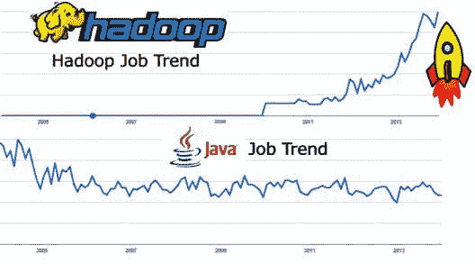
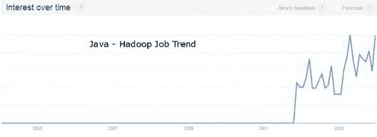

# 转行:从 Java 到大数据/ Hadoop

> 原文：<https://www.edureka.co/blog/switching-careers-from-a-java-to-big-data-hadoop>

在我们的生活中，总会有这样一个时刻，我们会考虑转行或评估我们的技能组合，以促进我们的职业发展，甚至只是为了跟上发展趋势。但是仔细分析当前趋势并观察需求是选择更新哪些技能集的好方法。从目前的市场来看，Hadoop 和大数据技术发展非常快，也有很多市场需求。对“**大数据**的兴趣激增，促使许多开发团队经理考虑 **Hadoop** 技术，因为它正日益成为大数据应用的重要组成部分。这样做时，盘点处理 Hadoop 时所需的技能集至关重要。*据《SearchSOA.com》援引 MWD 顾问公司分析师 Helena Schwenk 的话说，一个全面的 Hadoop 实施团队的技能应该包括大规模分布式系统的经验和语言知识，如 Java、C++、Pig Latin 和 HiveQL。数据*

现在很明显，了解 Java 是 Hadoop(T1)所需要的一项基本技能。让我们继续讨论一下从 Java 切换到 Hadoop 有多容易。从这个由大数据平台顶级行业专家设计的 **[大数据课程](https://www.edureka.co/big-data-hadoop-training-certification)** 中探索和了解更多关于 Hadoop 的知识。

## 为什么您需要从 Java 过渡到大数据？

*   #### **Understand the working trend of Java and Hadoop [: 【T3]**

当查看来自谷歌的工作趋势的图形表示时，很明显 Hadoop 工作趋势比 Java 好得多。这么说，并不意味着基于 Java 的工作趋势正在衰落。只是随着 Hadoop 的增长，公司对具有 Hadoop 知识的 Java 专家的需求太大了，不能忽视。这在**‘Java with Hadoop’**技能类工作的工作趋势图表中可以清楚地看到。通过金奈 [数据工程认证](https://www.edureka.co/microsoft-azure-data-engineering-certification-course-chennai) 了解更多大数据及其应用。

*   当检查具有 Hadoop 技能的 Java 的工作要求时，有巨大的需求，但没有足够的具有上述技能的专业人员来满足要求。据开发者 Slashdot 称，摩根大通和其他公司在今年的 Hadoop 世界大会上寻找该领域的求职者。他们似乎找不到足够多的具备包括 Hadoop MapReduce(用 Java 编写的 MapReduce 脚本)在内的特定技能的 It 专业人员。这意味着高薪。
*   根据 Dice 的 Open Web，Java 是招聘经理寻找 Java-Hadoop 组合技能的主要技能。Hadoop with Java 是一项有价值的技能，因为 HDFS (Hadoop 分布式文件系统)是用 Java 编写的。
*   据 Business Insider 报道，Hadoop 的年薪至少为 10.3 万美元。
*   拥有大数据技能的工作年薪超过 10.6 万美元。

## **为什么 Java 专业人士转 Hadoop 更容易？**

Hadoop 是一个开源的、基于 Java 的编程框架，支持在分布式计算环境中处理大型数据集。基于 Google 的 MapReduce 模型，Hadoop 分配计算作业，然后合并结果。这里使用的 MapReduce 脚本是用 Java 编写的。现在，很明显，要在 Hadoop 上工作，Java 知识是必不可少的。当谈到转换到 Hadoop 时，拥有 Java 知识是一件轻而易举的事情。向 [蔚蓝数据工程师](https://www.edureka.co/microsoft-azure-data-engineering-certification-course) 了解更多大数据及其应用。

## **现在，真正要问的问题是关于 Hadoop 作为职业道路的后劲:**

今年，IBM、微软和甲骨文都采用了 Hadoop。截至 2013 年 11 月，拥有 Hadoop 并正在寻找 Hadoop 专业人员的其他公司有:

*   亚马逊(110)
*   易贝(53 岁)
*   雅虎！公司(37)
*   霍顿作品(36)
*   脸书(33 岁)
*   苹果公司(28)
*   通用动力公司-IT(28)
*   EMC 公司(27)
*   诺斯罗普·格鲁曼公司(25)
*   推特(23)

这是一个明确的迹象，表明 Java 到大数据/ Hadoop 是一条路要走。查看此 [**大数据认证**](https://www.edureka.co/blog/top-big-data-certifications) 博客，探索进一步提升您的技能。

有问题要问我们吗？在评论区提到它们，我们会给你回复。

**相关帖子:**

[大数据分析是最佳职业选择的 10 个理由](https://www.edureka.co/blog/10-reasons-why-big-data-analytics-is-the-best-career-move "10 Reasons Why Big Data Analytics is the Best Career Move")

[4 个学习 Hadoop 2.0 的实用理由](https://www.edureka.co/blog/4-practical-reasons-to-upgrade-to-hadoop-2 "4 Practical Reasons to Learn Hadoop 2.0")

[大数据培训可以改变组织的 7 种方式](https://www.edureka.co/blog/7-ways-big-data-training-can-change-your-organization/)