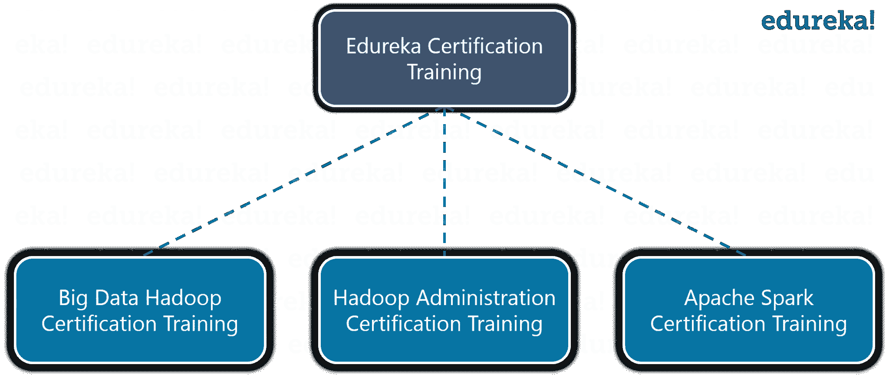
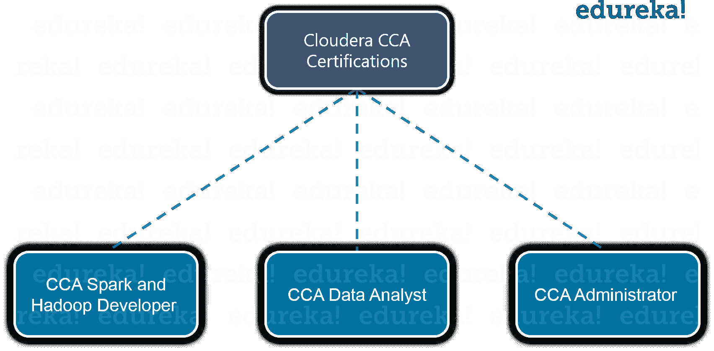
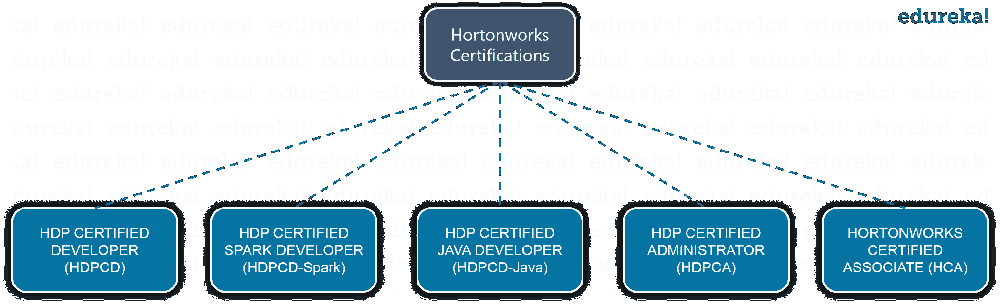

# 三大大数据认证:成为大数据 Hadoop 专家

> 原文：<https://www.edureka.co/blog/top-big-data-certifications>

在当今快节奏的 IT 世界中，技术发展日新月异，每天都会产生大量的数据。由于数据的增长，越来越多的组织采用 Hadoop、Spark、Kafka 等大数据技术来存储和分析大数据。因此，关于这些技术的就业机会也在以更快的速度增加。这导致了对拥有大数据认证的专业人士的需求。我们来看看一些预测:

*   *大数据& Hadoop 市场预计到 2022 年将达到 991 亿美元，从 2015 年开始以 42.1%的 CAGR 增长——福布斯*
*   *麦肯锡预测，到 2018 年将短缺 150 万数据专家——麦肯锡报告*
*   *大数据 Hadoop 开发者的平均薪资为 135 万美元——Indeed.com 薪资数据。*

## ***但是，为什么需要大数据认证呢？***

如果你完成了 Edureka 的 [Hadoop 认证](https://www.edureka.co/big-data-hadoop-training-certification) ，你就是业内公认的有能力、合格的大数据专家。此 大数据分析认证有助于您在顶级 跨国 公司 中快速晋升。它会给你一个偏好，给你的简历增加价值，这将帮助你在大数据领域抓住工作机会& Hadoop。Hadoop 中有两大大大数据认证，分别是 Cloudera 和 Hortonworks。

在这篇大数据 Hadoop 博客中，我 将按以下顺序详细讨论 Edureka、Cloudera 和 Hortonworks 提供的不同大数据认证:

*   **[Edureka 认证培训](#EdurekaCertificationTraining)**
    *   **[大数据 Edureka 认证培训&Hadoop](#EdurekaBigDataHadoopCertificationTraining)**
    *   **[Edureka Hadoop 管理认证培训](#HadoopAdministrationCertificationTraining)**
    *   **[Edureka 阿帕奇星火认证培训](#ApacheSparkCertificationTraining)**
*   **[Cloudera 认证](#ClouderaCertification)**
    *   **[CCA Spark 和 Hadoop 开发者](#CCASpark&HadoopDeveloper)**
    *   **[CCA 数据分析师](#CCADataAnalyst)**
    *   **[CCA 管理员](#CCAAdministrator)**
*   **[Hortonworks 认证](#HortonworksCertifications)**
    *   **[【HDPCD】](#HDPCD)**
    *   **[【HDP 认证 Apache Spark 开发者(HDPCD-Spark)](#HDPCD_Spark)**
    *   **[【HDP 认证 Java 开发者(HDPCD-Java)](#HDPCD_JAVA)**
    *   **[【HDPCA】](#HDPCA)**

**大数据认证| Cloudera 认证| Edureka**

[//www.youtube.com/embed/Tt2GRh3eFMs?rel=0&showinfo=0](//www.youtube.com/embed/Tt2GRh3eFMs?rel=0&showinfo=0)

## **Edureka 大数据认证在线培训**

Edureka 提供 3 次与大数据相关的大数据 Hadoop 认证培训& Hadoop。

*   ***Edureka 大数据 Hadoop 认证培训***
*   ***Hadoop 管理认证培训***
*   ***阿帕奇星火认证培训***

## **Edureka 大数据 Hadoop 认证培训**

Hadoop 培训旨在通过为您提供丰富的 Hadoop 生态系统实践培训以及关于 HDFS、MapReduce、HBase、Hive、Pig、Oozie、Sqoop 的最佳实践，让您成为认证大数据从业者。本大数据 认证课程是您大数据之旅的敲门砖，您将有机会参与多个大数据& Hadoop 项目，使用不同的数据集，如社交媒体、客户投诉、航空公司、电影、贷款数据集等。

项目完成后你还将获得 Edureka 大数据 Hadoop 认证，为你的简历增值。 基于 Edureka 培训及其对齐的事实课程，您可以轻松清除 Cloudera 或 Hortonworks 认证。

### **大数据 Hadoop 课程介绍**

在本次大数据认证课程中，我们的专家讲师将培训您:

*   掌握 HDFS 和 MapReduce 框架的概念
*   了解 Hadoop 2.x 架构
*   安装 Hadoop 集群，编写复杂的 MapReduce 程序
*   使用 Sqoop 和 Flume 学习数据加载技术
*   使用猪、蜂箱和纱线进行数据分析
*   实施 HBase 和 MapReduce 集成
*   实现高级使用和索引
*   使用 Oozie 安排工作
*   实施 Hadoop 开发的最佳实践
*   了解 Spark 及其生态系统
*   在 Spark 了解如何在 RDD 工作
*   参与大数据分析的真实项目

Edureka 还在 Bangalore 提供 [Hadoop 培训，涵盖类似的课程，根据行业实际情况进行更新，并帮助您轻松通过 Cloudera & Hortonworks Hadoop 认证。](https://www.edureka.co/big-data-hadoop-training-certification-bangalore)

### **大数据 Hadoop 课程课程表**

本最佳大数据认证课程分为多个模块，在每个模块中，您将学习新的大数据工具&架构。请告诉我们哪个模块涵盖了哪些主题:

*   ***了解大数据和 Hadoop***——在本模块中，您将了解大数据、现有大数据问题解决方案的局限性、Hadoop 如何解决大数据问题、常见的 Hadoop 生态系统组件、Hadoop 架构、HDFS、文件读写剖析、MapReduce 框架的工作原理。

*   ***Hadoop 架构和 HDFS***–在本模块中，您将了解 Hadoop 集群架构、Hadoop 集群中的重要配置文件、数据加载技术以及如何设置单节点和多节点 Hadoop 集群。

*   ***Hadoop MapReduce 框架***——在本模块中，您将了解 Hadoop MapReduce 框架以及 MapReduce 对存储在 HDFS 的数据的处理。你将理解像 MapReduce 中的输入分割，合并器&分割器和使用不同数据集的 MapReduce 演示这样的概念。

*   ***高级 MapReduce***–在本大数据认证模块中，您将学习高级 MapReduce 概念，如计数器、分布式缓存、MRunit、Reduce Join、自定义输入格式、序列输入格式和 XML 解析。

*   ***PIG***–在本模块中，您将学习 Pig、我们可以使用的用例类型、Pig 和 MapReduce 之间的紧密耦合、Pig 拉丁脚本、Pig 运行模式、PIG UDF、Pig 流、测试 Pig 脚本。医疗数据集演示。

*   ***Hive***——本大数据工程课程模块将帮助您理解 Hive 概念、Hive 数据类型、加载和查询 Hive 中的数据、运行 Hive 脚本和 Hive UDF。

*   ***高级 Hive 和 h base***–在本模块中，您将了解高级 Hive 概念，如 UDF、动态分区、Hive 索引和视图、Hive 中的优化。您还将深入了解 HBase、HBase 架构、运行模式及其组件。

*   ***高级 HBase***–本模块将介绍高级 h base 概念。我们将看到关于批量装载、过滤器的演示。您还将了解 Zookeeper 是什么，它如何帮助监控集群，HBase 为什么使用 Zookeeper。

*   ***用 Apache Spark*** 处理分布式数据——在这个 B est 大数据认证课程模块中，你将学习 Spark 生态系统及其组件，Scala 如何在 Spark、SparkContext 中使用。你将学习如何在 RDD 工作。演示将在 Spark 集群上运行应用程序，比较 MapReduce 和 Spark 的性能。

*   ***Oozie 和 Hadoop 项目***—在本模块中，您将了解多个 Hadoop 生态系统组件在一个 Hadoop 实施中共同工作，以解决大数据问题。我们将讨论项目的多个数据集和规范。本模块还将涵盖 Flume & Sqoop 演示、用于 Hadoop 作业的 Apache Oozie 工作流调度程序以及 Hadoop Talend 集成。

通过[大数据工程师认证](https://www.edureka.co/masters-program/big-data-architect-training)，熟练掌握大数据专家使用的工具和系统。

**了解我们在顶级城市的大数据课程**

| 印度 | 美国 | 其他国家 |
| **[班加罗尔](https://www.edureka.co/big-data-hadoop-training-certification-bangalore)大数据课程 ** | **[达拉斯大数据课程](https://www.edureka.co/big-data-and-hadoop-dallas)** | [**英国大数据课程**](https://www.edureka.co/big-data-hadoop-training-certification-uk) |
| **[金奈](https://www.edureka.co/big-data-hadoop-training-certification-chennai)** 大数据课程 | [**华府大数据课程**](https://www.edureka.co/big-data-and-hadoop-washington) | [**新加坡大数据课程**](https://www.edureka.co/big-data-hadoop-training-certification-singapore) |
| **[海得拉巴](https://www.edureka.co/big-data-and-hadoop-training-hyderabad)大数据课程** | **[旧金山大数据课程](https://www.edureka.co/big-data-and-hadoop-san-francisco)** | [**加拿大大数据课程**](https://www.edureka.co/big-data-hadoop-training-certification-canada) |

### **大数据 Hadoop 课程项目**

我们已经了解了 Hadoop 认证考试，因此您需要很好的实践来通过 Hadoop 认证考试。因此，我们提供各种项目，你可以工作，并得到一个关于实际执行的清晰想法。在这一在线大数据认证课程的末尾，您将参与一个实时项目，在该项目中，您将使用 PIG、HIVE、HBase 和 MapReduce 来执行大数据分析。您将经历的几个大数据 Hadoop 认证项目是:成为数据工程师 si 的最佳方式是在钦奈参加 [Azure 数据工程课程](https://www.edureka.co/microsoft-azure-data-engineering-certification-course-chennai) 。

***项目#1*** **:** 分析社交书签网站寻找见解

***数据* :** 它包括从 reddit.com、stumbleupon.com 等网站收集的信息，这些网站是书签网站，允许你对任何 topic.reddit.com、stumbleupon.com 等网站的各种链接进行书签、评论、评级和搜索。

***问题陈述* :** 分析 Hadoop 生态系统中的数据到:

*   获取数据到 HDFS，并在 MapReduce、Pig 和 Hive 的帮助下进行分析，根据用户评论、喜欢等找到评分最高的链接。
*   使用 MapReduce，将半结构化格式(XML 数据)转换为结构化格式，并对一千个链接中的每一个链接将用户评级分为正面和负面。
*   将输出推入 HDFS，然后喂入 PIG，PIG 将数据分成两部分:类别数据和评级数据。
*   编写一个奇特的 Hive 查询来进一步分析数据，并使用 Sqoop 将输出结果推入一个关系型数据库(RDBMS)。

***项目二* :** 客户投诉分析

***数据*** **:** 公开可用的数据集，包含几十万个具有如下属性的观察值:客户 Id、支付方式、产品详情、投诉、位置、投诉状态等。

***问题陈述* :** 分析 Hadoop 生态系统中的数据到:

*   获取每种产品的投诉数量
*   获取从特定位置提交的投诉总数
*   获取未及时回复的按地点分组的投诉清单

***项目#3* :** 旅游数据分析

***数据* :** 数据集包含城市对(往返组合)、成人旅游、老年人旅游、儿童旅游、机票预订价格、汽车预订价格等属性。

***问题陈述* :** 从数据中找到以下感悟:

*   人们最常去的 20 个目的地，根据给定的数据，我们可以找到人们经常去的最受欢迎的目的地，根据特定目的地预定的具体初始旅行次数
*   根据预订的旅行次数，前 20 个地点是大多数旅行的起点
*   前 20 个高航空收入目的地，即 20 个为旅行带来高航空收入的城市，以便提供折扣优惠，吸引更多人预订这些目的地的机票。

***项目#4* :** 航线数据分析

***数据* :** 公开可用的数据集，包含各航空公司的航班详细信息，如的机场 id、机场名称、机场服务的主要城市、机场所在的国家或地区、机场代码、十进制度、与 UTC 的小时偏差、时区等。

***问题陈述* :** 分析航空公司数据到:

*   查找该国运营的机场列表
*   查找无经停站的航空公司列表
*   代码共享运营的航空公司列表
*   哪个国家(或地区)的机场数量最多
*   查找美国活跃航空公司列表

***项目#5* :** 分析贷款数据集

***数据* :** 公开可用的数据集，包含所有已发放贷款的完整详细信息，包括当前贷款状态(当前、逾期、已全部付清等)。)和最新付款信息。

***问题陈述* :**

*   查找每个地点的案例数，并根据获得贷款的原因对计数进行分类，并显示平均风险分数。

***项目#6* :** 分析电影收视率

***数据* :** 来自烂番茄、IMDB 等网站的公开数据。

***问题陈述* :** 分析不同用户对电影的评分来:

*   获得对电影评分最多的用户
*   获取对电影评分最少的用户
*   获得属于特定职业的用户评价的电影总数的计数
*   获取未成年用户数量

***项目#7* :** 分析 YouTube 数据

***数据* :** 关于 YouTube 视频，包含如 VideoID、上传者、年龄、类别、长度、浏览量、评分、评论等属性。

***问题陈述* :**

*   确定上传视频数量最多的前 5 个类别、评分最高的前 10 个视频和观看次数最高的前 10 个视频。

## **Edureka Hadoop 管理认证培训**

【Edureka 的 [Hadoop 管理培训](https://www.edureka.co/hadoop-administration-training-certification)为参与者提供操作和维护 Hadoop 集群所需的所有步骤的专业知识，即从规划、安装和配置到负载平衡、安全和调优。Edureka 的培训将为 Hadoop 管理员面临的现实挑战提供实践准备。在各种大数据认证 课程 中，这个 Hadoop Administration 最推荐给初学者。

### **Hadoop Admin 课程描述**

课程设置遵循 Apache Hadoop 发行版。在 Hadoop 管理在线培训期间，您将掌握:

*   Hadoop 架构、HDFS、Hadoop 集群和 Hadoop 管理员的角色
*   规划和部署 Hadoop 集群
*   加载数据并运行应用程序
*   配置和性能调整
*   如何管理、维护、监控 Hadoop 集群并排除故障
*   集群安全、备份和恢复
*   关于 Hadoop 2.0、名称节点高可用性、HDFS 联盟、YARN、MapReduce v2 的见解
*   Oozie、Hcatalog/Hive 和 HBase 管理和动手项目

### **Hadoop 管理培训项目**

课程快结束时，您将有机会参与一个实际项目，该项目将使用不同的 Hadoop 生态系统组件在 Hadoop 实施中协同工作，以解决大数据问题。

**1。*设置一个最小 2 节点的 Hadoop 集群***

*   节点 1–NameNode、ResourceManager、DataNode、NodeManager
*   节点 2–二级命名节点、数据节点、节点管理器

**2。*创建一个简单的文本文件并复制到 HDFS***

*   找出它去的那个节点的位置。
*   查找输出文件写入哪个数据节点。

**3。*创建一个大的文本文件，复制到 HDFS，块大小为 256 MB。***

*   将所有其他文件保持在默认的块大小，并找出块大小对性能的影响。

**4。*为项目设置 200MB 的空间配额，用 replication=2*** 复制 70MB 的文件

*   确定系统不允许您复制文件的原因？
*   在不增加空间配额的情况下，您将如何解决这个问题？

**5。*配置机架感知并将文件复制到 HDFS***

*   找到它的机架分布并识别用于它的命令。
*   了解如何更改现有文件的复制因子。

edu reka 提供的上一次大数据认证培训完全基于 Apache Spark。让我们知道细节。

## **Edureka 阿帕奇星火认证培训**

本次 [Apache Spark 认证培训](https://www.edureka.co/apache-spark-scala-training)将帮助学员了解 Spark 如何执行内存数据处理，以及如何比 Hadoop MapReduce 运行得更快。学员将掌握 Scala 编程，并将接受 Spark 提供的不同 API 的培训，如 Spark Streaming、Spark SQL、Spark RDD、Spark MLlib 和 Spark GraphX。学完 这门 大数据认证课程后，你将彻底了解关于OOPS的概念。

### **阿帕奇星火课程描述**

本 Edureka 课程是大数据开发人员学习道路的重要组成部分。完成 Apache Spark 培训后，您将能够:

*   了解 Scala 及其实现
*   掌握 Scala 编程中 Traits 和 OOPS 的概念
*   在火花外壳上安装火花并实施火花操作
*   了解星火 RDD 的作用
*   在 YARN 上实现 Spark 应用(Hadoop)
*   学习 Spark Streaming API
*   在 Spark MLlib API 中实现机器学习算法
*   分析 Hive 和 Spark SQL 架构
*   了解 Spark GraphX API 并实现图形算法
*   实现用于性能调整的广播变量和累加器
*   项目

### **阿帕奇星火培训项目**

在 Spark Hadoop 大数据认证培训中，Edureka 有多个项目，很少是:

**项目#1:** 设计一个系统，使用 Spark 回放 HDFS 的交易实时回放。

**使用的技术:**

1.  火花流
2.  卡夫卡(用于信息传递)
3.  HDFS(用于存储)
4.  核心 Spark API(用于聚合)

**项目#2:** 漫游时信号掉页

**问题陈述:**你会得到一个 CDR(通话详细记录)文件，你需要找出漫游时经常掉线的前 10 名客户。这是一份非常重要的报告，电信公司通过回叫客户，同时联系他们的漫游合作伙伴来改善特定区域的连接问题，从而防止客户流失。

因此，在参加 Edureka 大数据认证课程培训的过程中，您将处理多个用例以及实时场景，这将帮助您通过 Cloudera 和 Hortonworks 提供的各种 Hadoop 认证。

## **Cloudera 认证**

CCA 考试测试你的基本技能，并为申请人获得 CCP 项目认证奠定基础。 Edureka 的大数据认证课程 帮助 您深入了解所有大数据工具和应用。 Cloudera 有 3 个 CCA 级别的认证考试(Cloudera Certified Associate)。

1.  ***[CCA Spark 和 Hadoop 开发者](https://www.cloudera.com/more/training/certification/cca-spark.html)***
2.  [***CCA 数据分析师***](https://www.cloudera.com/more/training/certification/cca-data-analyst.html)
3.  [***CCA 管理员***](https://www.cloudera.com/more/training/certification/cca-admin.html)

## **CCA Spark 和 Hadoop 开发者(CCA175)**

通过 CCA Spark 和 Hadoop 开发人员认证的人员已经证明了其使用 Apache Spark 和核心 Cloudera 企业工具获取、转换和处理数据的核心技能。出现 CCA 175 的基本细节是:

*   *问题数量*:cloud era 企业集群上 8–12 项基于性能的(动手)任务
*   *时限* : 120 分钟
*   *及格分数* : 70%
*   *价格*:295 美元

每个 CCA 问题都要求你解决一个特定的场景。在某些情况下，可能会使用 Impala 或 Hive 等工具，而在其他情况下，则需要编码。为了加快 Spark 问题的开发时间，通常会提供一个包含解决方案框架的模板，要求候选人填写功能代码中缺少的行。这个模板是用 Scala 或者 Python 编写的。

使用模板不是强制性的。你可以用编程语言来解决这个问题。但是，你应该意识到，从头开始编写每个问题的代码可能比分配给考试的时间要多。

您的考试在提交后会立即评分，并在考试当天通过电子邮件向您发送分数报告。您的分数报告显示您尝试的每个问题的问题编号以及该问题的等级。如果您通过了考试，您将在考试后几天内收到第二封电子邮件，其中包含您的 PDF 格式数字证书、您的许可证号、LinkedIn 个人资料更新，以及下载您的 CCA 徽标以便在您的社交媒体个人资料中使用的链接。在你完成了这个由 Hadoop 平台顶级专家开发的 Edureka 大数据认证培训课程后，很容易通过 CCA 考试。从 [数据工程师认证](https://www.edureka.co/microsoft-azure-data-engineering-certification-course) 了解更多大数据及其应用。

现在，让我们了解一下通过 CCA 175 认证所需的技能。

### **所需技能:**

#### **数据摄取**

在外部系统和集群之间传输数据的技能。这包括以下:

*   使用 Sqoop 将数据从 MySQL 数据库导入 HDFS
*   使用 Sqoop 将数据从 HDFS 导出到 MySQL 数据库
*   使用 Sqoop 在导入期间更改数据的分隔符和文件格式
*   将实时和接近实时的流数据摄取到 HDFS
*   处理加载到集群上的流数据
*   使用 Hadoop 文件系统命令将数据加载到 HDFS 和从其中取出

#### **变换、登台、存储**

将存储在 HDFS 的一组数据值转换成新的数据值或新的数据格式并写入 HDFS 的技能。

*   从 HDFS 加载 RDD 数据，用于 Spark 应用
*   使用 Spark 将 RDD 的结果写回 HDFS
*   读写多种文件格式的文件
*   对数据执行标准的提取、转换、加载(ETL)过程

#### **数据分析**

使用 Spark SQL 在您的应用程序中以编程方式与 metastore 进行交互。通过对加载的数据使用查询来生成报告。

*   使用 metastore 表作为 Spark 应用的输入源或输出接收器
*   了解 Spark 中查询数据集的基础知识
*   使用 Spark 过滤数据
*   编写计算聚合统计数据的查询
*   使用 Spark 连接不同的数据集
*   产生分级或分类数据

让我们继续看第二个 Cloudera 认证，即 CCA 数据分析师。

## **CCA 数据分析师**

通过 CCA 数据分析师认证的人员已经证明了他在加载、转换和建模 Hadoop 数据以定义关系和从原始输入中提取有意义的结果方面的核心分析师技能。出现 CCA 数据分析师的基本信息是:

*   *问题数量*:CDH 5 集群上 8–12 个基于绩效的(动手)任务
*   *时限* : 120 分钟
*   *及格分数* : 70%
*   *语言*:英语

对于每个问题，你必须实现一个满足所有需求的高精度的技术解决方案。您可以在集群上使用任何工具或工具组合。你必须拥有足够的知识来分析问题，并在给定的时间内得出一个最佳的方法。

以下是通过 CCA 数据分析师认证所需的技能。

### **所需技能:**

#### **准备数据**

使用提取、传输、加载(ETL)流程为查询准备数据。

*   使用 Sqoop 将数据从 MySQL 数据库导入 HDFS
*   使用 Sqoop 将数据从 HDFS 导出到 MySQL 数据库
*   在 metastore 中的表之间移动数据
*   在分析前转换输入数据的值、列或文件格式

#### **为数据提供结构**

使用数据定义语言(DDL)语句创建或改变 metastore 中的结构，供 Hive 和 Impala 使用。

*   使用各种数据类型、分隔符和文件格式创建表格
*   使用现有表格创建新表格，以定义模式
*   通过在 metastore 中创建分区表来提高查询性能
*   更改表以修改现有模式
*   创建视图以简化查询

#### **数据分析**

在 Hive 和 Impala 中使用查询语言(QL)语句来分析集群上的数据。

*   使用选择命令准备报告，包括联合和子查询
*   在查询期间计算聚合统计数据，如总和和平均值
*   使用连接命令创建针对多个数据源的查询
*   使用内置函数转换查询的输出格式
*   使用窗口函数对一组行执行查询

CCA 数据分析师的候选人可以是 SQL 开发人员 T2、数据分析师、商业智能专家、开发人员、系统架构师和数据库管理员。没有先决条件。

现在，让我们讨论第三个 Cloudera Hadoop 大数据认证，即 CCA 管理员。

## **CCA 管理员考试(CCA 131)**

获得 CCA 管理员认证的个人已经展示了在企业中部署 Cloudera 的公司和组织所寻求的核心系统和集群管理员技能。

*   *问题数量*:在预配置的 Cloudera 企业集群上执行 8–12 项基于性能的任务
*   *时限* : 120 分钟
*   *及格分数* : 70%
*   *语言*:英语
*   *价格*:295 美元

每个 CCA 问题都要求你解决一个特定的场景。一些任务需要通过 Cloudera Manager 进行配置和服务更改，而其他任务则需要命令行 Hadoop 实用程序的知识和 Linux 环境的基本能力。评估&分数报告与 CCA 175 认证相似。完成由顶级 行业 专家 开发的 Edureka 大数据认证课程后，你将获得大数据工具和技术的深度 知识 。所需技能如下:

### **所需技能:**

#### **安装**

展示对 CDH cloud era Manager 安装流程和生态系统项目的理解。

*   建立本地 CDH 存储库
*   为 Hadoop 安装执行操作系统级配置
*   安装 Cloudera Manager 服务器和代理
*   使用 Cloudera Manager 安装 CDH
*   向现有集群添加新节点
*   使用 Cloudera Manager 添加服务

#### **配置**

执行有效管理 Hadoop 集群所需的基本和高级配置

*   使用 Cloudera Manager 配置服务
*   创建一个 HDFS 用户的主目录
*   配置 NameNode HA
*   配置资源管理器 HA
*   为 Hiveserver2/Impala 配置代理

#### **理**

维护和修改集群以支持企业的日常运营

*   重新平衡集群
*   设置过量磁盘填充的警报
*   定义并安装机架拓扑脚本
*   在集群中安装新型 I/O 压缩库
*   根据用户反馈修改纱线资源分配
*   启用/停用一个节点

#### **安稳**

启用相关服务并配置集群以满足安全策略定义的目标；展示基本安全实践知识

*   配置 HDFS ACL
*   安装并配置哨兵
*   配置色调用户授权和认证
*   启用/配置日志和查询还原
*   在 HDFS 创建加密区域

#### **测试**

测试集群运行指标，测试系统配置的运行和效率

*   通过 HTTP-FS 执行文件系统命令
*   在集群内/集群间高效复制数据
*   创建/恢复 HDFS 目录的快照
*   获取/设置文件或目录结构的 ACLs】
*   对集群(I/O、CPU、网络)进行基准测试

#### **故障排除**

展示找到问题根源、优化低效执行和解决资源争用情况的能力

*   在 Cloudera Manager 中解决错误/警告
*   解决集群操作中的性能问题/错误
*   确定应用失败的原因
*   配置公平调度程序以解决应用程序延迟

以上是 Cloudera 与 Hadoop 相关的三项 Hadoop 大数据认证。接下来，让我们讨论一下 Hortonworks 认证。

有有五大数据认证由[***Hortonworks***](https://hortonworks.com/services/training/certification/)提供与 Hadoop 相关:

*   [**【HDP 认证开发者(HDPCD)**](https://hortonworks.com/services/training/certification/hdpcd-certification/) :针对使用 Pig、Hive、Sqoop、Flume 等框架的 Hadoop 开发者。

*   [**HDP 认证 APACHE SPARK 开发者(HDPCD-Spark)**](https://hortonworks.com/services/training/certification/hdp-certified-spark-developer/) :面向负责用 Scala 或 Python 开发 Spark Core 和 Spark SQL 应用的开发者。

*   **【HDP 认证 Java 开发人员(HDPCD-JAVA)】**:面向设计、开发和架构用 JAVA 编程语言编写的基于 Hadoop 的解决方案的开发人员。

*   [**【HDP 认证管理员(HDPCA)**](https://hortonworks.com/services/training/certification/hdpca-certification/) :针对部署和管理 Hadoop 集群的管理员。

*   [**HORTONWORKS 认证助理(HCA)**](https://hortonworks.com/services/training/certification/hca-certification/) :获得进入 HORTONWORKS 认证计划更高级别所需的入门点和基本技能。

考试费用为每次 250 美元，持续时间为 2 小时。Hortonworks 有一个基于您尝试的问题和您采取的方法的动态标记方案。因此，现在我们将重点关注通过不同 Hortonworks 认证所需的技能。 Edureka 的大数据认证 是第一步 清除这一切 Hortonworks 认证更多 关于题目的知识

## **所需技能:**

### **HDPCD 考试**

#### **数据摄取**

*   *SQOOP-IMPORT* :将关系数据库中的一个表中的数据导入到 HDFS
*   *自由格式查询导入*:将关系数据库中的查询结果导入 HDFS
*   *将数据导入 HIVE* :将一个表从关系数据库导入到一个新的或现有的 HIVE 表
*   *SQOOP-EXPORT* :将来自 HDFS 的数据插入或更新到关系数据库的表中
*   *水槽代理*:给定一个水槽配置文件，启动一个水槽代理
*   *内存通道*:给定一个配置好的汇和源，配置一个指定容量的水槽内存通道

#### **数据转换**

*   编写并执行 Pig 脚本
*   将数据加载到没有模式的 Pig 关系中
*   将数据加载到带有模式的 Pig 关系中
*   将 Hive 表中的数据加载到 Pig 关系中
*   使用 Pig 将数据转换成指定的格式
*   转换数据以匹配给定的配置单元模式
*   将一个或多个 Pig 关系的数据分组
*   使用 Pig 从关系中删除空值记录
*   将 Pig 关系的数据存储到 HDFS 的文件夹中
*   将 Pig 关系中的数据存储到 Hive 表中
*   对 Pig 关系的输出进行排序
*   删除 Pig 关系的重复元组
*   指定 Pig MapReduce 作业的 reduce 任务数
*   使用 Pig 连接两个数据集
*   使用 Pig 执行复制连接
*   使用技术开发中心运行清管作业
*   在 Pig 脚本中，注册一个用户自定义函数的 JAR 文件
*   在 Pig 脚本中，为用户定义的函数定义一个别名
*   在 Pig 脚本中，调用用户定义的函数

#### **数据分析**

*   编写并执行一个配置单元查询
*   定义一个 Hive 管理的表
*   定义一个 Hive 外部表
*   定义一个分区的配置单元表
*   定义一个分桶的配置单元表
*   从选择查询中定义一个配置单元表
*   定义一个使用 ORCFile 格式的 Hive 表
*   从现有的非 ORCFile 配置单元表中的数据创建一个新的 ORCFile 表
*   指定 Hive 表的存储格式
*   指定配置单元表的分隔符
*   从本地目录加载数据到 Hive 表
*   将数据从 HDFS 目录加载到 Hive 表中
*   将数据作为查询结果加载到配置单元表中
*   将压缩数据文件加载到 Hive 表中
*   更新配置单元表中的一行
*   从配置单元表中删除一行
*   在配置单元表中插入新行
*   连接两个蜂巢表
*   使用 Tez 运行配置单元查询
*   使用矢量化运行配置单元查询
*   输出配置单元查询的执行计划
*   在配置单元查询中使用子查询
*   从一个配置单元查询中输出数据，该查询在多个 reducers 中完全排序

*   在配置单元查询中设置 Hadoop 或配置单元配置属性

### **hdpa 考试**

#### **安装**

*   配置本地 HDP 存储库
*   安装 Ambari 服务器和 Ambari 代理
*   使用 Ambari 安装向导安装 HDP
*   向现有集群添加新节点
*   停用一个节点
*   使用 Ambari 向集群添加 HDP 服务

#### **配置**

*   定义并部署机架拓扑脚本
*   使用 Ambari 更改服务的配置
*   配置产能调度器
*   为用户创建主目录并配置权限
*   配置包含和排除 DataNode 文件

#### **故障排除**

*   重启 HDP 服务
*   查看应用程序的日志文件
*   配置和管理警报
*   对失败的作业进行故障排除

#### **高可用性**

*   配置 NameNode HA
*   配置资源管理器 HA
*   使用 distcp 在两个集群之间复制数据
*   创建 HDFS 目录的快照
*   恢复快照
*   配置 HiveServer2 高可用性

*   安装和配置 Knox
*   安装和配置 Ranger

*   配置 HDFS ACL

### **HDPCD: JAVA 考试**

*   用 Java 写一个 Hadoop MapReduce 应用
*   在 Hadoop 集群上运行 Java MapReduce 应用
*   为 MapReduce 作业编写并配置合并器
*   为 MapReduce 作业编写和配置自定义分区程序
*   对 MapReduce 作业的输出进行排序
*   为 MapReduce 作业编写和配置自定义键类
*   配置 MapReduce 作业的输入和输出格式
*   执行两个或多个数据集的连接

*   执行两个数据集的地图端连接

### **HDPCD:星火考试**

### **核心火花**

*   用 Python 或 Scala 写一个 Spark 核心应用
*   初始化火花应用
*   在纱线上运行火花作业
*   创建一个 RDD
*   从 HDFS 的文件或目录中创建一个 RDD
*   将 RDD 保存在内存或磁盘上
*   对 RDD 进行火花变换
*   在 RDD 上执行火花动作
*   创建和使用广播变量和累加器
*   配置火花属性

### **火花 SQL**

*   从现有的 RDD 创建 Spark 数据帧
*   对数据帧进行操作
*   编写一个 Spark SQL 应用程序
*   使用带有来自 Spark SQL 的 ORC 的 Hive】
*   编写一个 Spark SQL 应用程序，从配置单元表中读取和写入数据

现在，我们知道了通过各种 Hadoop 认证所需的技能和考试模式。因此，您可以根据您想要获得的 Hadoop 认证，在三个 Edureka 的 Hadoop 认证培训项目中进行选择。Edureka 大数据培训课程与 Cloudera & Hortonworks Hadoop 认证保持一致。

我希望这篇大数据认证博客能够提供丰富的信息，并有助于了解各种 Hadoop 认证及其培训。现在，请选择*大数据认证*并获得大数据 Hadoop 认证，这将促进您的职业生涯。万事如意！

Edureka 是一个实时互动的电子学习平台，正在彻底改变专业在线教育。它提供由在线资源支持的讲师指导课程，以及全天候按需支持。Edureka 数据工程师认证课程由专家特别策划，他们以鹰眼监控 IT 行业，并对行业的期望、变化和要求做出响应，并将它们融入课程中。

*现在您已经了解了各种大数据 Hadoop 认证，请参加 Edureka 在钦奈举办的 [Hadoop 培训](https://www.edureka.co/big-data-hadoop-training-certification-chennai)，edu reka 是一家值得信赖的在线学习公司，拥有遍布全球的 250，000 多名满意的学习者。Edureka 大数据 Hadoop 认证培训课程使用零售、社交媒体、航空、旅游和金融领域的实时用例，帮助学员成为 HDFS、Yarn、MapReduce、Pig、Hive、HBase、Oozie、Flume 和 Sqoop 领域的专家。*