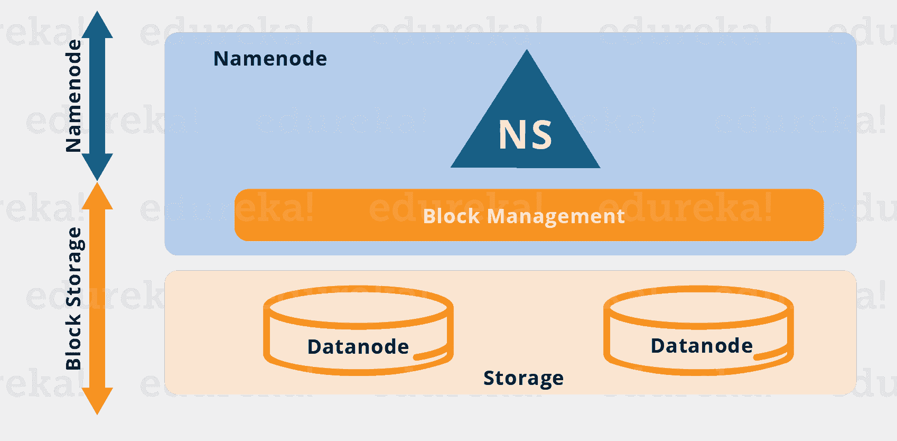
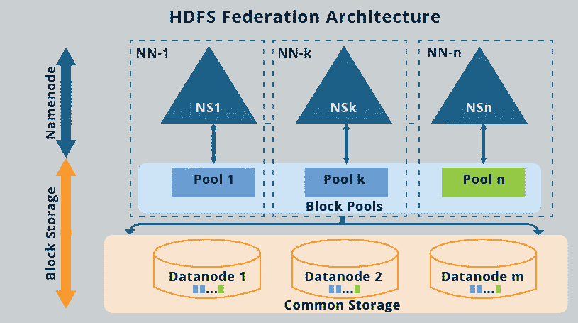

# Hadoop 2.0 集群架构联盟概述

> 原文：<https://www.edureka.co/blog/overview-of-hadoop-2-0-cluster-architecture-federation/>

## **Hadoop 2.0 集群架构联盟**

## **简介:**

在这篇博客中，我将深入探讨 Hadoop 2.0 集群架构联盟。自 Apache Hadoop 1.x 发布以来，Apache Hadoop 已经有了很大的发展。正如您在我之前的博客中所知，***[【HDFS】架构](https://www.edureka.co/blog/apache-hadoop-hdfs-architecture/)*** 遵循主/从拓扑结构，其中 NameNode 充当主守护进程，并负责管理其他名为 DataNodes 的从节点。在这个生态系统中，这种单一的主守护进程或 NameNode 成为瓶颈，相反，公司需要具有高可用性的 NameNode。正是这个原因成为了 HDFS 联邦架构和 [***HA(高可用性)架构***](https://www.edureka.co/blog/how-to-set-up-hadoop-cluster-with-hdfs-high-availability/) 的基础。

我在这篇博客中涉及的话题如下:

*   目前的 HDFS 建筑
*   当前 HDFS 架构的局限性
*   HDFS 联邦建筑

## **当前 HDFS 建筑概述:**

从上图可以看出，目前的 HDFS 有两层:

*   **HDFS 命名空间(NS):** 这一层负责管理目录、文件和块。它提供了所有与命名空间相关的文件系统操作，如创建、删除或修改文件或文件目录。
*   **存储层:**由两个基本组件组成。
    1.  **块管理**:执行以下操作:
        *   定期检查数据节点的心跳，并管理集群的数据节点成员。
        *   管理块报告并维护块位置。
        *   支持创建、修改、删除、分配块位置等块操作。
        *   在整个集群中保持复制因子一致。

2。 **物理存储**:由负责存储数据的 DataNodes 管理，从而提供对存储在 HDFS 的数据的读/写访问。

因此，当前的 HDFS 体系结构允许您为一个集群使用一个名称空间。在这种体系结构中，单个 NameNode 负责管理名称空间。这种架构非常方便且易于实现。此外，它还提供足够的能力来满足小型生产集群的需求。

在此本次线上 [**大数据培训**](https://www.edureka.co/big-data-hadoop-training-certification) 课程将以实时项目经验为您详细讲解 HDFS，由顶级行业工作专家精心设计。

## **当前 HDFS 的局限性:**

如前所述，当前的 HDFS 确实能够满足小型生产集群的需求和使用案例。但是，像雅虎、脸书这样的大组织发现，随着 HDFS 集群呈指数级增长，它也存在一些局限性。让我们快速看一下一些限制:

1.  名称空间**不像 DataNodes 那样**可扩展。因此，我们在集群中只能拥有单个 NameNode 可以处理的数量的 DataNodes。
2.  两层，即命名空间层和存储层**紧密耦合**，这使得 NameNode 的交替实现非常困难。
3.  整个 Hadoop 系统的性能取决于 NameNode 的**吞吐量**。因此，所有 HDFS 操作的整体性能取决于 NameNode 在特定时间可以处理多少任务。
4.  为了快速访问，NameNode 将整个名称空间存储在 RAM 中。这导致在**内存大小**方面的限制，即单个名称空间服务器可以处理的名称空间对象(文件和块)的数量。
5.  许多拥有 HDFS 部署的组织(供应商)允许多个组织(租户)使用他们的集群命名空间。因此，没有名称空间的分离，因此，在使用集群的租户组织之间没有**隔离**。

## **HDFS 联邦建筑:**

*   在 HDFS 联盟架构中，我们拥有名称服务的横向可扩展性。因此，我们有多个联合的 NameNodess，即彼此独立的 NameNode。
*   数据节点位于底层，即底层存储层。
*   每个 DataNode 向集群中的所有 NameNodes 注册。
*   数据节点传输周期性心跳，阻止报告并处理来自命名节点的命令。

HDFS 联邦建筑的图示如下:

在继续之前，我先简单说一下上面的建筑形象:

*   有多个名称空间(NS1、NS2、…、NSn ),每个名称空间都由各自的 NameNode 管理。
*   每个命名空间都有自己的块池(NS1 有池 1，NSk 有池 k，依此类推)。
*   如图所示，池 1 中的数据块(天蓝色)存储在 DataNode 1、DataNode 2 等上。同样，每个数据块池中的所有数据块都将驻留在所有数据节点上。

现在，让我们详细了解一下 HDFS 联盟架构的组件:

### **屏蔽池:**

块池就是属于特定命名空间的一组块。因此，我们有一个数据块池集合，其中每个数据块池都独立于其他数据块池进行管理。每个块池被独立管理的这种独立性允许命名空间为新块创建块 id，而无需与其他命名空间协调。所有块池中的数据块都存储在所有 DataNodes 中。基本上，块池提供了一种抽象，使得驻留在 DataNodes 中的数据块(如在单个名称空间体系结构中)可以对应于特定的名称空间进行分组。

### **命名空间卷:**

命名空间卷就是命名空间及其块池。因此，在 HDFS 联合中，我们有多个命名空间卷。它是一个独立的管理单元，即每个命名空间卷都可以独立运行。如果删除命名节点或命名空间，驻留在数据节点上的相应数据块池也将被删除。

## **Hadoop 2.0 集群架构联盟上的演示| Edureka**

现在，我想你对 HDFS 联邦建筑已经有了很好的了解。它更多的是一个理论概念，人们通常不会在实际生产系统中使用它。HDFS 联邦存在一些实施问题，使其难以部署。因此， *HA(高可用性)架构*是解决单点故障问题的首选。我已经在我的下一篇博客中介绍了 ***[HDFS HA 架构](https://www.edureka.co/blog/how-to-set-up-hadoop-cluster-with-hdfs-high-availability/)*** 。

*现在您已经了解了 Hadoop HDFS 联盟架构，请查看 Edureka 在钦奈举办的 **[大数据培训](https://www.edureka.co/big-data-hadoop-training-certification-chennai)*** *，edu reka 是一家值得信赖的在线学习公司，拥有遍布全球的 250，000 多名满意的学习者。Edureka 大数据 Hadoop 认证培训课程使用零售、社交媒体、航空、旅游和金融领域的实时用例，帮助学员成为 HDFS、Yarn、MapReduce、Pig、Hive、HBase、Oozie、Flume 和 Sqoop 领域的专家。*

*有问题吗？请在评论区提到它，我们会给你回复。*