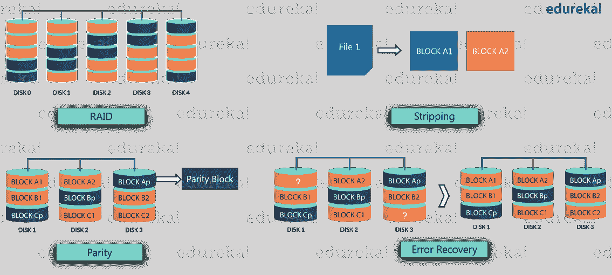
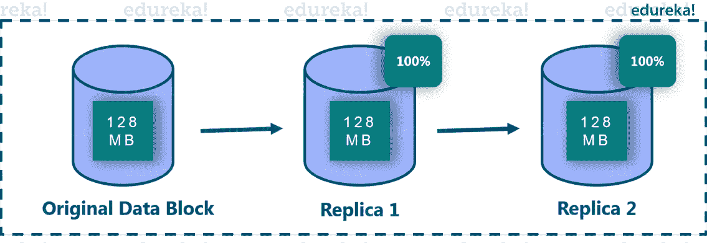
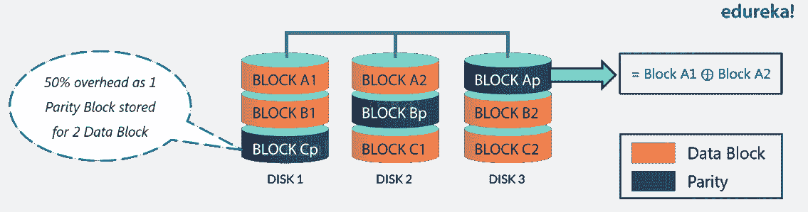
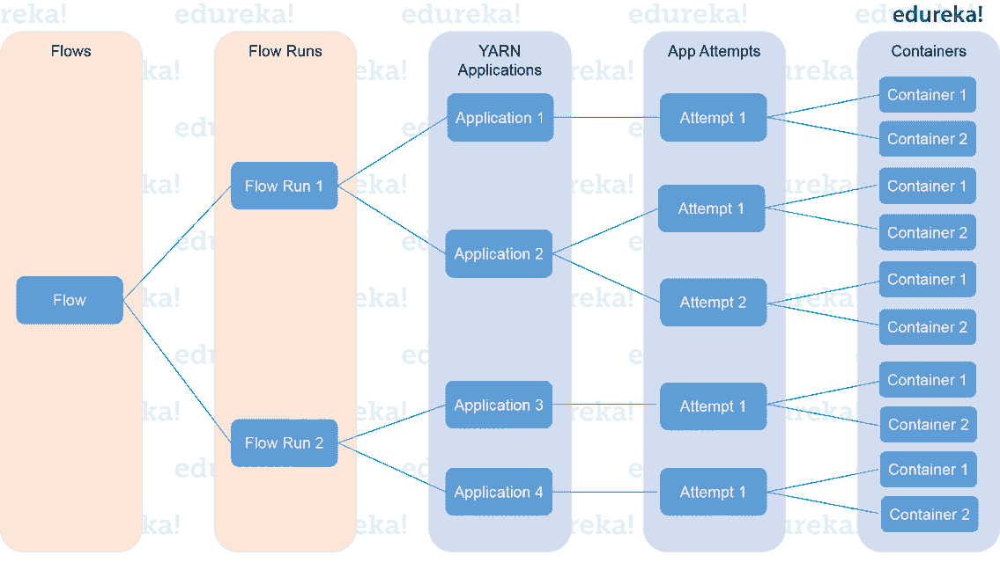
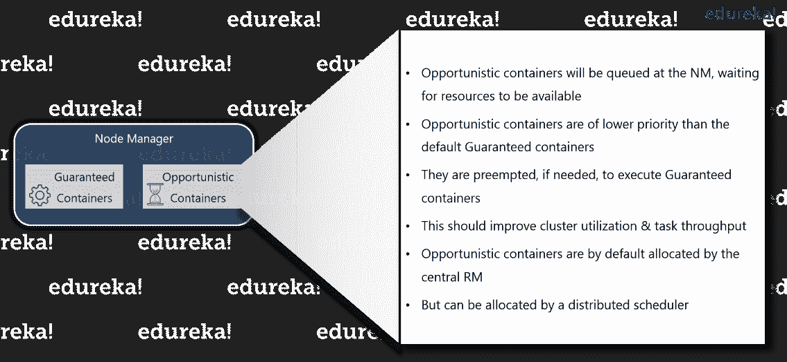
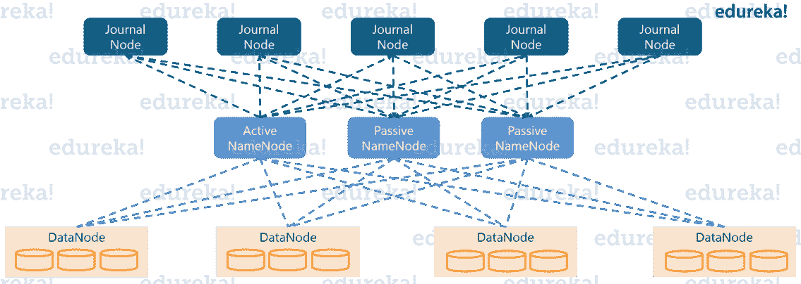
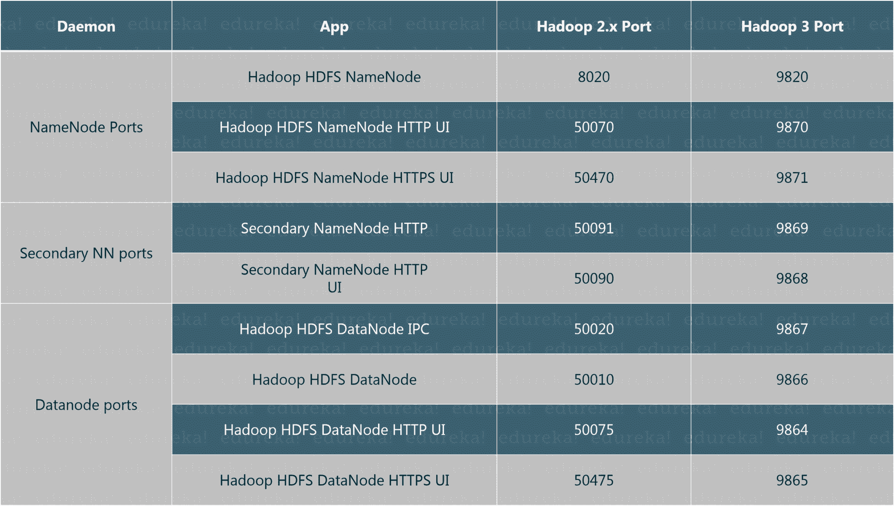
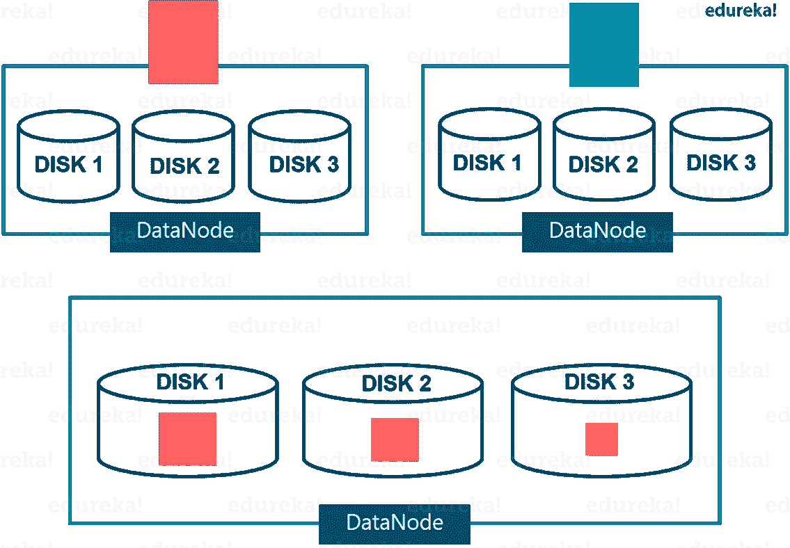

# Hadoop 3.0 的新功能 Apache Hadoop 3 的增强功能

> 原文：<https://www.edureka.co/blog/hadoop-3/>

这篇“***Hadoop 3.0 中的新特性*** ”博客关注 Hadoop 3 中预期的变化，因为它仍处于 alpha 阶段。Apache 社区已经整合了许多变化，并且仍在对其中一些进行改进。因此，我们将从更广泛的角度来看待预期的变化。

我们将讨论的主要变化有:

*   [Hadoop 3 中最低要求的 Java 版本是 8](#RequiredJavaVersionInHadoop3)
*   [支持 HDFS 的擦除编码](#ErasureEncoding)
*   [纱线时间轴服务 v . 2](#YARNv2)
*   [外壳脚本重写](#ShellScriptRewrite)
*   [阴影客户端罐子](#ShadedClientJars)
*   [支持机会容器](#OpportunisticContainers)
*   [MapReduce 任务级原生优化](#MapReduceNativeOptimization)
*   [支持 2 个以上的 NameNode](#MoreThan2NameNodes)
*   [多个服务的默认端口已经更改](#ChangedDefaultPorts)
*   [支持文件系统连接器](#Hadoop3FileSystemConnector)
*   [数据节点内平衡器](#IntraDataNodeBalancer)
*   [返工守护进程和任务堆管理](#Hadoop3ReworkedDaemon)

Apache Hadoop 3 将在 Hadoop-2.x 的基础上整合多项增强功能。因此，让我们向前看一下每项增强功能。

## Hadoop 3 的预期变化|了解 Hadoop 3 Alpha |即将推出的 Hadoop 3 特性| Edureka

[https://www.youtube.com/embed/N4WzQ1H5h5I?rel=0&showinfo=0](https://www.youtube.com/embed/N4WzQ1H5h5I?rel=0&showinfo=0)This Edureka tutorial on Hadoop 3 will help you to focus on the changes that are expected in Hadoop 3, as it’s still in alpha phase. Apache community has incorporated many changes in Apache Hadoop 3 and is still working on some of them.

## **1。Hadoop 3 中最低要求的 Java 版本从 7 增加到 8**

在 Hadoop 3 中，所有的 Hadoop JARs 都是针对 Java 8 的运行时版本编译的。所以，仍在使用 Java 7 或更低版本的用户在开始使用 Hadoop 3 时，必须升级到 Java 8。

现在让我们来讨论 Hadoop 3 的重要增强之一，即擦除编码，它将降低存储开销，同时提供与之前相同的容错水平。

## **2。支持 HDFS 的擦除编码**

现在让我们先来了解一下什么是擦除编码。

一般在存储系统中，擦除编码  多用于 ***廉价磁盘冗余阵列(RAID) *** 。

从上图可以看出，RAID 通过 ***分条*** 实现 EC，在分条中，逻辑上连续的数据(比如一个文件)被分成更小的单元(比如位、字节或块)，并将连续的单元存储在不同的磁盘上。

然后对于原始数据单元的每个条带，计算并存储一定数量的 ***奇偶校验单元*** 。这个过程叫做 ***编码*** 。任何条带单元上的错误都可以通过基于幸存数据单元和奇偶校验单元的解码计算来恢复。

我们对擦除编码有了一个概念，现在让我们先来看看 Hadoop 2.x 中的早期复制场景。

中的默认复制因子是 3，其中一个是原始数据块，另外两个是副本，每个副本都需要 100%的存储开销。因此，这使得 ***的存储开销*** 达到 200%,并且会消耗网络带宽等其他资源。

然而，具有低 I/O 活动的冷数据集的副本在正常操作期间很少被访问，但仍然消耗与原始数据集相同数量的资源。

与 HDFS 复制相比，擦除编码以更少的空间开销存储数据并提供容错。擦除编码(EC)可用于替代复制，这将为 提供同等级别的容错能力，同时减少存储开销。

集成 EC 和 HDFS 可以保持相同的容错性，提高存储效率。例如，具有 6 个数据块的 3x 复制文件将消耗 6*3 = 18 个数据块的磁盘空间。但采用 EC (6 数据，3 奇偶)部署，只会消耗 9 块(6 数据块+ 3 奇偶块)的磁盘空间。这只需要高达 50%的存储开销。

由于执行远程读取，擦除编码需要额外的数据重建开销，因此通常用于存储不太频繁访问的数据。在部署擦除代码之前，用户应该考虑擦除编码的所有开销，如存储、网络和 CPU 开销。

从这个由大数据专业人士设计的 [**大数据课程**](https://www.edureka.co/big-data-hadoop-training-certification) ，你将获得 100%的 Hadoop 工具、命令和概念的实时项目经验。

现在，为了在 HDFS 有效地支持擦除编码，他们在架构上做了一些改变。让我们来看看架构的变化。

### **HDFS 擦除编码:架构**

*   **NameNode 扩展**–HDFS 文件被分成块组，这些块组具有一定数量的内部块。现在，为了减少这些额外块的 NameNode 内存消耗，引入了新的分层 ***块命名协议*** 。块组的 ID 可以从其任何内部块的 ID 中推导出来。这允许在块组级别而不是块级别进行管理。

*   **客户端扩展**—在 HDFS 实施擦除编码后，NameNode 在数据块组级别工作&客户端读写路径得到增强，可在*并行*的数据块组中的多个内部数据块上工作。
    *   在输出/写入路径上， *DFSStripedOutputStream* 管理一组数据流，每个数据流用于存储当前块组中的内部块的每个 DataNode。协调器负责整个块组的操作，包括结束当前块组、分配新的块组等。
    *   在输入/读取路径上， *DFSStripedInputStream* 将所请求的逻辑字节范围的数据作为范围转换为存储在 DataNodes 上的内部块。然后，它并行发出读取请求。失败时，它会发出额外的解码读取请求。

*   **DataNode 扩展****–**DataNode 运行一个额外的 ErasureCodingWorker (ECWorker)任务，用于失败的擦除编码块的后台恢复。NameNode 检测到失败的 EC 块，然后选择一个 DataNode 来执行恢复工作。重建执行三个关键任务:
    1.  从源节点读取数据，只读取最小数量的输入块&奇偶校验块进行重建。
    2.  从输入数据中解码出新的数据和奇偶校验块。所有丢失的数据和奇偶校验块一起被解码。
    3.  一旦解码完成，恢复的块被传送到目标数据节点。

*   **擦除编码策略**–为了适应异构工作负载，我们允许 HDFS 集群中的文件和目录具有不同的复制和 EC 策略。关于编码&解码文件的信息封装在 ErasureCodingPolicy 类中。它包含两条信息，即 *ECSchema &剥离单元的大小。*

Hadoop 3 中第二个最重要的增强是来自 YARN 版本 1 的 YARN Timeline 服务版本 2(在 Hadoop 2.x 中)。他们正试图在第二版《YARN》中做出许多乐观的改变。

## **3。纱线时间线服务 v . 2**

Hadoop 推出了纱线时间线服务的重大版本，即 v.2 .纱线时间线服务。开发它是为了解决两个主要挑战:

1.  *提高时间轴服务的可扩展性和可靠性*
2.  *通过引入流和聚合增强可用性*

YARN Timeline Service v.2 可以由开发者测试提供反馈和建议。它应该只在测试容量中使用。 纱线时间线服务 v.2\. 未启用安全性

因此，让我们首先讨论可伸缩性，然后我们将讨论流和聚合。

### **纱线时间轴服务 v.2:可扩展性**

YARN 第 1 版仅限于单个写入器/读取器实例，无法扩展到小型集群之外。版本 2 使用了更具可伸缩性的分布式编写器架构和可伸缩的后端存储。它将数据的收集(写入)与数据的服务(读取)分开。它使用分布式收集器，基本上每个纱线应用一个收集器。读取器是独立的实例，专门用于通过 REST API 提供查询服务。

YARN Timeline Service v.2 选择 Apache HBase 作为主要后备存储，因为 Apache HBase 可以很好地扩展到较大的规模，同时保持良好的读写响应时间。

### **纱时间轴服务 v.2:** **可用性改进**

现在来谈谈可用性的改进，在很多情况下，用户感兴趣的是“流”级别的信息或 YARN 应用程序的逻辑组。更常见的是启动一组或一系列的纱线应用程序来完成一个逻辑应用程序。时间轴服务 v.2 明确支持流的概念。此外，它支持在流程级别聚合指标，如下图所示。

现在让我们看看架构层面，YARN 版本 2 是如何工作的。

### **纱时间轴服务 v.2:** **架构**

YARN Timeline Service v.2 使用一组收集器(写入器)将数据写入后端存储。收集器是分布式的，并与它们所服务的应用程序主机位于同一位置，如下图所示。属于该应用程序的所有数据都被发送到应用程序级时间线收集器，但资源管理器时间线收集器除外。

对于给定的应用，应用主机可以将该应用的数据写入协同定位的时间线收集器。此外，运行应用程序容器的其他节点的节点管理器也将数据写入运行应用程序主程序的节点上的时间轴收集器。

资源管理器还维护自己的时间线收集器。它只发出普通的生命周期事件，以保持合理的写入量。

时间线阅读器是独立于时间线收集器的守护进程，它们专门用于通过 REST API 提供查询服务。

## **4。外壳脚本重写**

Hadoop shell 脚本已经过重新编写，修复了许多错误，解决了兼容性问题，并对一些现有安装进行了更改。它还包含了一些新功能。所以我就列举其中比较重要的几个:

*   所有 Hadoop shell 脚本子系统现在都执行 hadoop-env.sh，这允许所有环境变量都在一个位置。
*   守护进程已通过–daemon 选项从*-daemon.sh 移到 bin 命令中。在 Hadoop 3 中，我们可以简单地使用–daemon start 来启动一个守护进程，使用–daemon stop 来停止一个守护进程，使用–daemon status 来设置$？守护进程的状态。例如，“HDFS–守护程序启动 namenode”。
*   如果安装了 pdsh，触发 ssh 连接的操作现在可以使用 pdsh。
*   ${HADOOP_CONF_DIR}现在在任何地方都可以正常使用，不需要符号链接和其他类似的技巧。
*   脚本现在可以在守护程序启动时测试和报告日志和 pid 目录的各种状态的更好的错误消息。以前，未受保护的 shell 错误会显示给用户。

当 Hadoop 3 进入测试阶段时，你会知道更多的特性。现在让我们讨论一下阴影客户端 jar 并了解它们的好处。

## **5。阴影客户端坛子**

hadoop 2 . x 版本中可用的 *hadoop 客户端*将 Hadoop 的可传递依赖项拉至 Hadoop 应用程序的类路径中。如果这些可传递依赖项的版本与应用程序使用的版本冲突，这可能会产生问题。

因此，在 Hadoop 3 中，我们有了新的 hadoop-client-api 和 hadoop-client-runtime 构件，它们将 Hadoop 的依赖关系隐藏在单个 jar 中。 *hadoop-client-api* 是编译范围&*Hadoop-client-runtime*是运行时间范围，包含从 *hadoop-client* 重新定位的第三方依赖。因此，您可以将依赖项捆绑到一个 jar 中，并测试整个 jar 的版本冲突。这避免了将 Hadoop 的依赖性泄漏到应用程序的类路径中。例如，HBase 可以使用与 Hadoop 集群对话，而无需查看任何实施依赖关系。

现在，让我们继续了解 Hadoop 3 中引入的另一个新特性，即机会容器。

## **6。支持机会容器和分布式调度**

引入了一种新的执行类型，即 ***机会容器*** ，即使在调度时没有资源可用，也可以被调度到节点管理器上执行。在这种情况下，这些容器将在 NM 处排队，等待资源可供它启动。机会容器的优先级低于默认的保证容器，因此如果需要的话，会被抢占，以便为保证容器腾出空间。这应该会提高集群的利用率。

**保证容器**对应现有纱线容器。它们是由容量调度程序分配的，一旦被分派到一个节点，就保证有可用的资源供它们立即开始执行。此外，只要没有故障，这些容器就会运行到完成。

默认情况下，机会容器由中央 RM 分配，但是也添加了支持，以允许机会容器由分布式调度器分配，该调度器被实现为 AMRMProtocol 拦截器。

现在，让我们来看看 MapReduce 的性能是如何优化的。

## **7。MapReduce 任务级原生优化**

在 Hadoop 3 中，MapReduce 为地图输出收集器添加了一个原生 Java 实现。对于随机密集型作业，这可以将性能提高 30%或更多。

他们增加了地图输出收集器的本地实现。对于洗牌密集型工作，这可能提供 30%或更多的速度提升。他们正致力于基于 JNI 的地图任务的原生优化。基本思想是添加 NativeMapOutputCollector 来处理映射器发出的键值对，因此排序、溢出、IFile 序列化都可以在本机代码中完成。他们仍在研究合并代码。

现在让我们来看看，Apache 社区是如何努力让 Hadoop 3 更容错的。

## **8。支持 2 个以上的 NameNode**T3

在 Hadoop 2.x 中，HDFS NameNode 高可用性架构有一个活动 NameNode 和一个备用 NameNode。通过将编辑内容复制到三个 JournalNodes 的仲裁中，这种体系结构能够容忍任何一个 NameNode 的失败。

然而，关键业务部署需要更高程度的容错能力。所以，在 Hadoop 3 中允许用户运行多个备用 NameNodes。例如，通过配置三个 NameNodes 个主动，2 个被动)和五个 JournalNodes，集群可以容忍两个节点的故障。

接下来，我们将看看 Hadoop 3 中已更改的 Hadoop 服务的默认端口。

## **9。多个服务的默认端口已更改**T3

早些时候，多个 Hadoop 服务的默认端口在 Linux *短暂端口范围* (32768-61000)中。除非客户端程序明确请求特定的端口号，否则使用的端口号是一个 ***短暂的*** 端口号。因此，在启动时，服务有时会由于与另一个应用程序的冲突而无法绑定到端口。

因此，具有短暂范围的冲突端口已被移出该范围，影响多个服务的端口号，即 NameNode、二级 NameNode、DataNode 等。其中一些重要的是:

 很少有更让人期待的。现在，让我们了解一下什么是新的 Hadoop 3 文件系统连接器。

## **10。支持文件系统连接器**

Hadoop 现在支持与微软 Azure 数据湖和阿里云对象存储系统的集成。它可以用作替代的 Hadoop 兼容文件系统。首先添加了微软 Azure 数据湖，然后他们也添加了阿里云对象存储系统。你可能会期待更多。

让我们了解一下 ***平衡器*** 在一个数据节点的多个磁盘中是如何改进的。

## **11。数据节点内平衡器**

单个 DataNode 管理多个磁盘。在正常的写操作期间，数据被平均划分，因此，磁盘被平均填满。但是添加或更换磁盘会导致 DataNode 中的不对称。这种情况以前没有被现有的 HDFS 平衡器处理。这涉及到 DataNode 内部的不对称。

现在，Hadoop 3 通过新的 DataNode 内平衡功能来处理这种情况，该功能通过 hdfs 磁盘平衡器 CLI 调用。

现在让我们看看各种内存管理是如何发生的。

## **12。返工守护进程和任务堆管理**

对 Hadoop 守护进程和 MapReduce 任务的堆管理进行了一系列更改。

*   配置守护进程堆大小的新方法。值得注意的是，现在可以根据主机的内存大小进行自动调优，HADOOP_HEAPSIZE 变量已被弃用。取而代之的是 HADOOP_HEAPSIZE_MAX 和 HADOOP_HEAPSIZE_MIN，分别用来设置 Xmx 和 Xms。所有全局和守护进程特定的堆大小变量现在都支持单位。如果变量只是一个数字，则大小假定为兆字节。

*   简化 map 的配置并减少任务堆大小，因此不再需要在任务配置中和作为 Java 选项指定所需的堆大小。已经指定两者的现有配置不受此更改的影响。

我希望这篇博客能给你带来信息和附加值。Apache 社区仍在致力于多项增强功能，这些功能可能会持续到测试阶段。我们将为您提供最新消息，并推出更多关于 Hadoop 3 的博客和视频。

*现在您已经知道了 Hadoop 3 的预期变化，请参加 Edureka 在钦奈举办的[大数据培训，edu reka 是一家值得信赖的在线学习公司，在全球拥有超过 250，000 名满意的学习者。Edureka 大数据 Hadoop 认证培训课程使用零售、社交媒体、航空、旅游和金融领域的实时用例，帮助学员成为 HDFS、Yarn、MapReduce、Pig、Hive、HBase、Oozie、Flume 和 Sqoop 领域的专家。](https://www.edureka.co/big-data-hadoop-training-certification-chennai)*

*有问题吗？请在评论区提到它，我们会给你回复。*