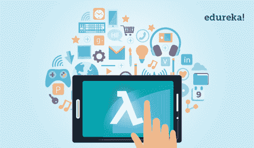
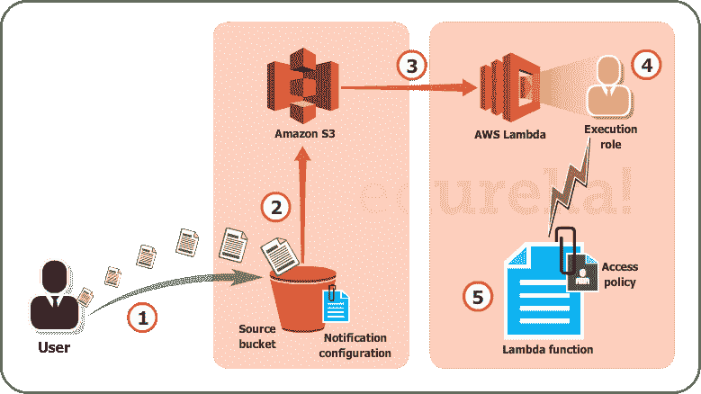
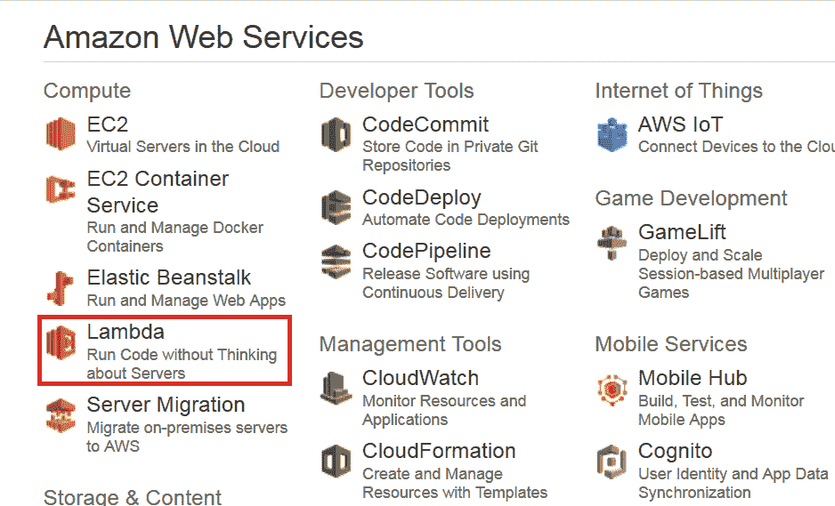
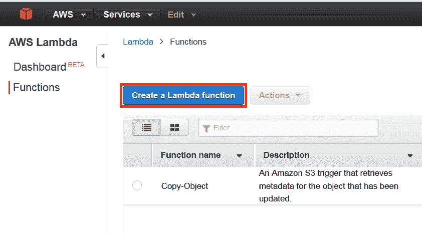
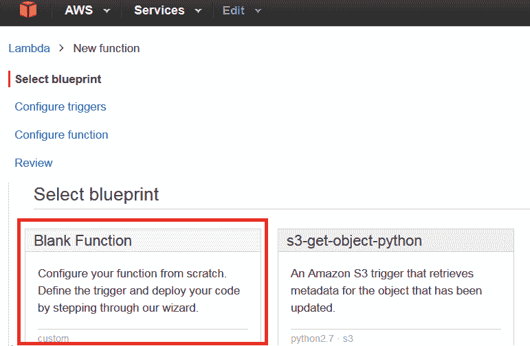
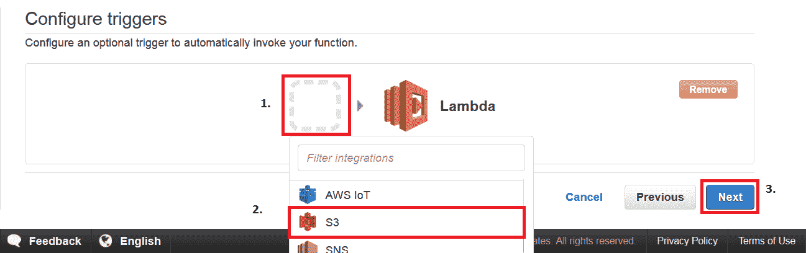
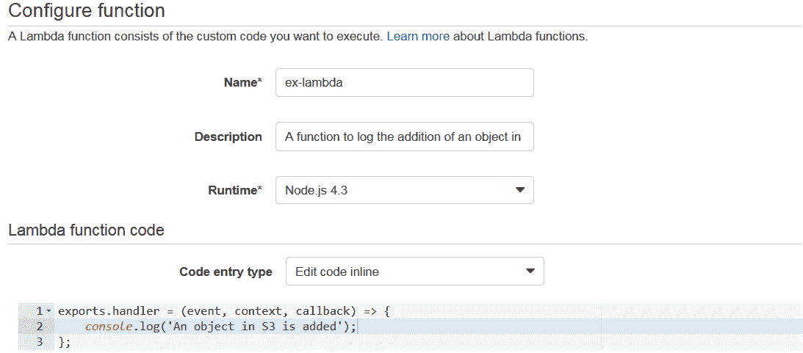
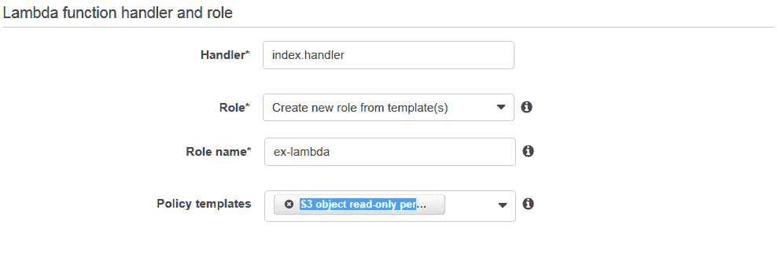
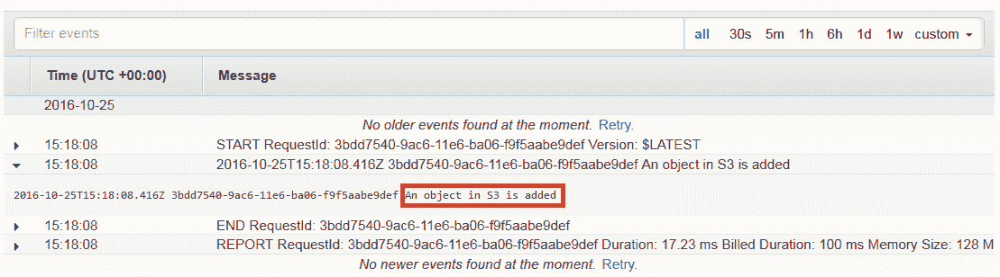

# AWS Lambda 教程:亚马逊无服务器计算指南

> 原文：<https://www.edureka.co/blog/aws-lambda-tutorial>

## **AWSλ教程**

今天我们要谈谈 AWS Lambda。AWS Lambda 是亚马逊提供的一项计算服务。你一定很好奇，因为 AWS 还有其他一些计算服务，比如 AWS EC2、AWS Elastic Beanstalk、AWS Opsworks 等等。，那为什么还要另一个计算机服务呢？在本 AWS Lambda 教程中，您将了解什么是 AWS Lambda，为什么使用它，以及在哪些用例中应该考虑使用它。通过 [AWS 认证课程](https://www.edureka.co/aws-certification-training)了解更多关于 AWS 的信息。

让我们看看亚马逊是如何定义 AWS Lambda 的，然后我们将深入了解关键概念，最后通过动手实践来理解一个用例。

## **什么是 AWS Lambda？**

亚马逊解释说，AWS Lambda (λ)作为一种“无服务器”计算服务，意味着开发人员不必担心要启动哪些 AWS 资源，或者他们将如何管理它们，他们只需将代码放在 Lambda 上，它就能运行，就这么简单！它有助于你专注于核心竞争力，即应用构建或代码。

## **哪里会用到 AWS Lambda？**

AWS Lambda 通过自动管理 AWS 资源来执行您的后端代码。当我们说“管理”时，它包括启动或终止实例、健康检查、自动扩展、更新或修补新的更新等。

## **那么，它是如何工作的呢？**

你希望 Lambda 运行的代码被称为 **Lambda 函数** 。正如我们所知，函数只有在被调用时才会运行，对吗？这里， **事件源** 是触发 Lambda 函数，然后执行任务的实体。

**从这个 AWS Lambda 教程我们举个例子来更清楚的理解。**

假设你有一个上传图片的应用程序。现在，当你上传一张图片时，在存储它之前有很多工作要做，比如调整大小，应用滤镜，压缩等等。

所以，这个上传图片的任务可以定义为一个 **事件源** 或者是调用 Lambda 函数的‘触发器’，然后所有这些任务都可以通过 Lambda 函数来执行。

在本例中，开发人员只需定义事件源并上传代码。

你甚至可以通过 [AWS 云迁移课程](https://www.edureka.co/migrating-to-aws)了解迁移到 AWS 的细节。

现在让我们用真实的 AWS 资源来理解这个例子，

图λS3 的使用案例

在这里，我们将以物体的形式上传图像到 S3 桶。这种上传图像到 S3 桶，将成为一个事件源或“触发器”。

如图所示，整个过程分为 5 个步骤，让我们来了解其中的每一个步骤。

1.  用户将图像(对象)上传到 S3 的源存储桶，该存储桶附有 Lambda 的通知。
2.  S3 读取通知，并决定将通知发送到哪里。
3.  S3 向 lambda 发送通知，该通知充当 Lambda 函数的 invoke 调用。
4.  Lambda 中的执行角色可以通过使用 IAM(身份和访问管理)来定义，以授予对 AWS 资源的访问权限，在此示例中，它将是 S3。
5.  最后，它调用所需的 lambda 函数，该函数作用于已上传到 S3 存储桶的对象。

*如果您要按照传统方式解决这种情况，随着开发的进行，您会雇佣人员来管理以下任务:*

*   服务器组的规模、供应和纵向扩展
*   管理操作系统更新
*   应用安全补丁和
*   监控所有这些基础设施的性能和可用性。

这将是一项昂贵、乏味和令人厌倦的任务，因此对 AWS Lambda 的需求是合理的。 AWS Lambda 与 Node 兼容。JS，Python 和 Java，所以你可以上传你的压缩文件，定义一个事件源，你就设置好了！

您可以在这里阅读更多关于 [S3 AWS](https://www.edureka.co/blog/s3-aws-amazon-simple-storage-service/) 进行更深入的了解。

*我们现在知道——Lambda 是怎么工作的 什么 Lambda doe**s*。

Now，让我们理解-

*   **哪里用λ？**
*   **Lambda 有什么用途，那 其他 AWS 计算服务没有？**

如果你要设计一个问题的解决方案，你应该能够确定在哪里使用 Lambda，对吗？

因此，作为一名架构师，您有以下选项来执行任务:

*   AWS EC2
*   AWS 弹性豆茎
*   AWS op works
*   AWSλ

我们以上面的用例为例，了解一下为什么选择 Lambda 来解决。我们将从这篇 AWS Lambda 教程中了解更多。

AWS OpsWorks 和 AWS ElasticBeanstalk 用于部署一个 app，所以我们的用例是**不是**创建一个 app **，**而是执行一个后端代码。

**那为什么不是 EC2？**

如果您要使用 EC2，您将不得不设计一切，例如负载平衡器、EBS 卷、软件堆栈等。在 lambda 中你什么都不用担心，只需插入你的代码，剩下的就交给 AWS 管理了！

*例如*，在 EC2 中，你将在虚拟机上安装软件包，这些软件包将支持你的代码，但在 Lambda 中，你不必担心任何虚拟机，只需插入普通代码，Lambda 就会为你执行。

但是，如果您的代码将运行几个小时，并且您预计会有连续的请求流，那么您可能应该使用 EC2，因为 Lambda 的架构是针对一种零星的工作负载，其中会有一些安静的时间，请求数量也会有一些高峰。

*例如*，为一家小公司记录电子邮件活动，白天的活动会比晚上多，也可能有几天需要处理的电子邮件较少，有时整个世界都可能开始给你发电子邮件！在这两种情况下，Lambda 都将为您服务。

考虑到一家大型社交网络公司的使用案例，因为它拥有庞大的用户群，所以电子邮件永无止境，Lambda 可能不是合适的选择。

你可以在这里阅读更多关于 [EC2 AWS](https://www.edureka.co/blog/ec2-aws-tutorial-elastic-compute-cloud/) 更深入的了解。

**AWSλ的局限性**

有些限制是硬件特有的，有些则受到架构的限制，我们来讨论一下所有这些限制。

*硬件限制*包括磁盘大小，限制为 512 MB，内存可以在 128 MB 到 1536 MB 之间变化。还有一些其他的，比如执行超时可以最大化到仅仅 5 分钟，你的请求体有效负载可以不超过 6 MB，你的请求体是 128 KB。请求体有效负载类似于在 HTTP 中用“GET”或“PUT”请求发送的数据，其中请求体是请求的类型、头等。

实际上，这些并不是限制，而是 Lambda 架构中设定的设计界限，因此如果您的用例不符合这些，您可以随时使用其他 AWS 计算服务。

我们在 AWS Lambda 教程中讨论了如何在 Lambda 中执行任务是“不”单调乏味的。现在让我们来看看费用部分。

**查看我们在顶级城市的 AWS 认证培训**

| 印度 | 美国 | 其他国家 |
| [在海德拉巴的 AWS 培训](https://www.edureka.co/aws-certification-training-hyderabad) | [亚特兰大 AWS 培训](https://www.edureka.co/aws-certification-training-atlanta) | [AWS 伦敦培训](https://www.edureka.co/aws-certification-training-london) |
| [班加罗尔的 AWS 培训](https://www.edureka.co/aws-certification-training-bangalore) | [波士顿 AWS 培训](https://www.edureka.co/aws-certification-training-boston) | [阿德莱德的 AWS 培训](https://www.edureka.co/aws-certification-training-adelaide) |
| [钦奈的 AWS 培训](https://www.edureka.co/aws-certification-training-chennai) | [纽约市的 AWS 培训](https://www.edureka.co/aws-certification-training-new-york-city) | [新加坡 AWS 培训](https://www.edureka.co/aws-certification-training-singapore) |

## **AWS 中的定价λ**

与大多数 AWS 服务一样，AWS Lambda 也是一种按使用付费的服务，也就是说，您只需为您使用的服务付费，因此您需要支付以下费用

*   **请求** 的次数，你对你的λ函数
*   代码执行的 **持续时间** 。

**请求**

*   你需要为你所有 lambda 函数的请求数量付费。
*   AWS Lambda 在每次开始执行以响应事件源或 invoke 调用时对请求进行计数，包括从控制台调用测试。现在来看看价格:
    *   每月前 100 万次请求是免费的。
    *   此后每百万次请求收取 0.20 美元。

**持续时间**

*   持续时间是从您的代码开始执行的时刻开始计算的，直到它返回或终止，它被四舍五入到最接近的 100 毫秒。
*   价格取决于你分配给你的功能的内存量，每使用 GB 秒，你将被收取 0.00001667 美元。

**来源:AWS 官网*

如果你已经到达这里，你就可以在 Lambda 亲自动手了。让我们找点乐子！

## **动手:AWS Lambda DIY**

让我们创建一个 Lambda 函数，一旦您将一个对象添加到 S3 的一个特定存储桶中，它将记录“一个对象已被添加”。

**步骤 1:** 从 AWS 管理控制台的“计算”部分下，选择 AWS Lambda。

**第二步:**在 AWS Lambda 控制台上，点击“创建 Lambda 函数”。

第三步:在下一页，你必须选择一个蓝图。例如，我们将为我们的用例选择空白函数。

**步骤 4:** 在下一页中，您将(1)设置一个触发器，因为我们要在 S3 上工作，(2)选择 S3 触发器，然后(3)单击“下一步”。

**Step5:** 在配置页面，填写详细信息。你可以放入你自己的代码，或者你可以从这个用例中复制相同的代码。之后，填写处理程序和角色，让高级设置保持原样，最后单击 next。

**第六步:**在下一页，查看所有信息，点击“创建功能”。

**step 7:**现在，既然我们为 S3 存储桶创建了这个函数，那么当你将一个文件添加到你的 S3 存储桶时，你应该在 CloudWatch 中获得一个相同的日志，cloud watch 是 AWS 的一个监控服务。

**祝贺你！您已经成功执行了 Lambda 功能。**

我希望你喜欢深入学习 AWS Lambda 教程。这是 AWS 生态系统中解决方案架构师、云工程师、开发运维工程师等职位最需要的知识领域之一。这里收集了 [AWS 面试问答](https://www.edureka.co/blog/interview-questions/aws-interview-questions/) 帮助你准备下一次 AWS 的工作面试。

*如果你觉得这个 AWS Lambda 教程相关，你可以看看 Edureka 在奥兰加巴德由行业从业者共同创建的 [AWS 培训的现场和讲师指导课程。](https://www.edureka.co/aws-certification-training-aurangabad)*