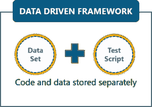
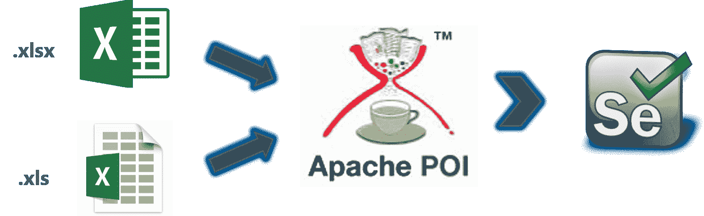
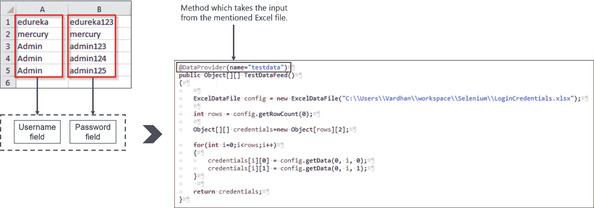
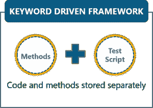
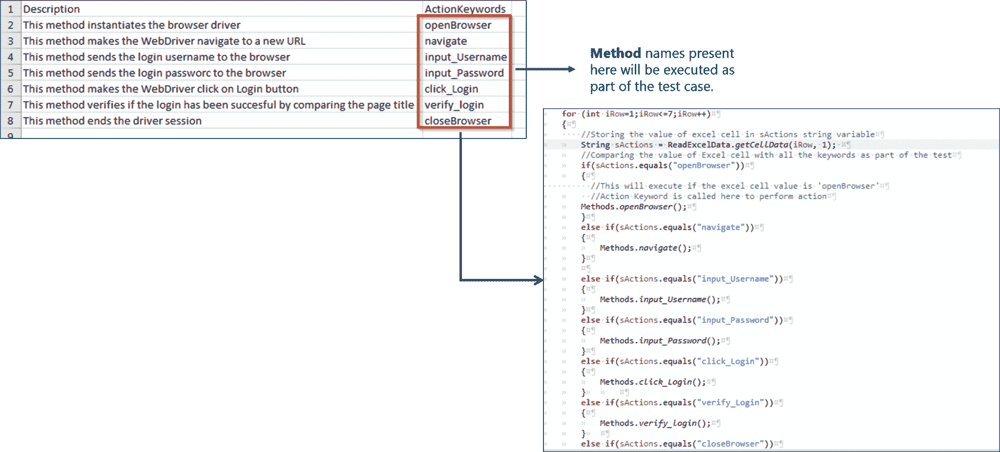

# 构建数据驱动、关键字驱动和混合 Selenium 框架

> 原文：<https://www.edureka.co/blog/selenium-framework-data-keyword-hybrid-frameworks>

本系列之前的 ***[硒博客](https://www.edureka.co/blog/selenium-tutorial)*** 已经让你接触了硒测试的基本概念。然而，在这篇博客中，我将告诉你如何使用 Selenium 框架来优化你的代码结构，这将使你更接近获得 [Selenium 认证](https://www.edureka.co/selenium-certification-training)。

## **什么是硒框架？**

Selenium framework 是一个代码结构，用于使代码维护更简单，代码可读性更好。框架包括将整个代码分解成更小的代码段，这些代码段测试特定的功能。

代码的结构是这样的,“数据集”与实际的“测试用例”是分离的，测试用例将测试 web 应用程序的功能。它也可以以这样的方式构建，其中需要执行的测试用例从外部应用程序(如. csv)中调用。

现在有很多框架，但是 3 个常用的 Selenium 框架是:

*   [数据驱动框架](#DataDrivenFramework)
*   [关键字驱动框架](#KeywordDrivenFramework)
*   [混合框架](#HybridFramework)

在这篇博客中，我们将通过一个演示来讨论这些框架。但是在继续之前，让我告诉你为什么需要一个 Selenium 框架，以及使用它们会有什么好处。

## **我们为什么需要一个 Selenium 框架？**

如果没有一个合适的框架，将会有一个包含整个测试功能的测试用例。可怕的是，这个测试用例有能力产生多达一百万行代码。所以很明显，如此庞大的测试用例很难阅读。即使你以后想修改任何功能，修改代码也会很困难。

既然一个框架的实现，会产生更小但多个代码块，有各种好处。

### **硒的好处**

*   增加代码重用
*   提高代码可读性
*   更高的便携性
*   缩减脚本维护

现在你已经知道了框架的基础，让我来详细解释一下它们。

## **数据驱动框架**

Selenium 中的数据驱动框架是一种将“数据集”与实际“测试用例”(代码)分离的技术。这个框架完全依赖于输入的测试数据。测试数据来自外部源，如 excel 文件。CSV 文件或任何数据库。



由于测试用例是从数据集中分离出来的，我们可以很容易地修改特定功能的测试用例，而不需要对你的代码进行大规模的修改。例如，如果您想要修改登录功能的代码，那么您可以只修改它，而不必修改同一代码中的任何其他相关部分。

除此之外，您还可以轻松控制需要测试多少数据。通过向 excel 文件(或其他来源)添加更多的用户名和密码字段，您可以很容易地增加测试参数的数量。

例如，如果我必须检查一个网页的登录，那么我可以在一个 excel 文件中保存一组用户名和密码凭证，并在一个单独的 Java 类文件中将凭证传递给代码以在浏览器上执行自动化。

### **使用 Apache POI 与 Selenium WebDriver**

WebDriver 不直接支持 excel 文件的读取。因此，我们使用 **Apache POI** 来读写任何 Microsoft office 文档。你可以从[这里](https://poi.apache.org/download.html)下载 Apache POI(JAR 文件集)。根据您的要求下载 zip 文件或 tar 文件，并将它们与 Selenium JARs 放在一起。



主代码和数据集之间的协调将由 *TestNG 数据提供者*负责，这是一个作为 Apache POI JAR 文件一部分的库。出于演示目的，我创建了一个名为“LoginCredentials”的 excel 文件，其中用户名和密码存储在不同的列中。



看一下下面的代码来理解测试用例。这是一个简单的代码，用于测试航班预订应用程序的登录功能。

```
package DataDriven;

import org.openqa.selenium.By;
import org.openqa.selenium.chrome.ChromeDriver;
import org.testng.Assert;
import org.testng.annotations.AfterMethod;
import org.testng.annotations.DataProvider;
import org.testng.annotations.Test;

public class DDTExcel
{
 ChromeDriver driver;

 @Test(dataProvider="testdata")
 public void DemoProject(String username, String password) throws InterruptedException
 {
 System.setProperty("webdriver.chrome.driver", "C:UsersVardhanDownloadschromedriver.exe");
 driver = new ChromeDriver();

 driver.get("http://newtours.demoaut.com/");

 driver.findElement(By.name("userName")).sendKeys(username);
 driver.findElement(By.name("password")).sendKeys(password);
 driver.findElement(By.name("login")).click();

 Thread.sleep(5000);

 Assert.assertTrue(driver.getTitle().matches("Find a Flight: Mercury Tours:"), "Invalid credentials");
 System.out.println("Login successful");
 }

 @AfterMethod
 void ProgramTermination()
 {
 driver.quit();
 }

@DataProvider(name="testdata")
 public Object[][] TestDataFeed()
 {

 ReadExcelFile config = new ReadExcelFile("C:UsersVardhanworkspaceSeleniumLoginCredentials.xlsx");

 int rows = config.getRowCount(0);

 Object[][] credentials = new Object[rows][2];

for(int i=0;i<rows;i++)
 {
 credentials[i][0] = config.getData(0, i, 0);
 credentials[i][1] = config.getData(0, i, 1);
 }

 return credentials;
 }
}

```

如果你从上面注意到了，我们有一个名为“TestDataFeed()”的方法。在这个方法中，我创建了另一个名为“ReadExcelFile”的类的对象实例。在实例化这个对象时，我已经输入了包含数据的 excel 文件的路径。我还定义了一个 for 循环来从 excel 工作簿中检索文本。

但是，为了从给定的表号、列号和行号中读取数据，调用了“ReadExcelFile”类。我的“ReadExcelFile”的代码如下。

```
package DataDriven;

import java.io.File;
import java.io.FileInputStream;

import org.apache.poi.xssf.usermodel.XSSFSheet;
import org.apache.poi.xssf.usermodel.XSSFWorkbook;

public class ReadExcelFile
{
 XSSFWorkbook wb;
 XSSFSheet sheet;

 public ReadExcelFile(String excelPath)
 {
 try
 {
 File src = new File(excelPath);
 FileInputStream fis = new FileInputStream(src);
 wb = new XSSFWorkbook(fis);
 }

 catch(Exception e)
 {
 System.out.println(e.getMessage());
 }
 }

 public String getData(int sheetnumber, int row, int column)
 {
 sheet = wb.getSheetAt(sheetnumber);
 String data = sheet.getRow(row).getCell(column).getStringCellValue();
 return data;
 }

 public int getRowCount(int sheetIndex)
 {
 int row = wb.getSheetAt(sheetIndex).getLastRowNum();
 row = row + 1;
 return row;
 }
}

```

首先注意我已经导入的库。我已经导入了 *Apache POI XSSF* 库，用于读取/写入数据到 excel 文件。这里，我创建了一个构造函数(相同方法的对象)来传递值:表号、行号和列号。为了更好地理解这个框架，我请求你浏览下面的视频，在那里我以结构化的方式解释了这一点。

## **Selenium web driver | Selenium 教程** 中的数据驱动框架

[https://www.youtube.com/embed/K9VQWQ7KnHk?rel=0&showinfo=0](https://www.youtube.com/embed/K9VQWQ7KnHk?rel=0&showinfo=0)

现在让我们继续讨论框架，即关键字驱动的框架。

## **关键词驱动框架**

关键字驱动框架是一种技术，其中所有要执行的操作&指令都是与实际测试用例分开编写的。它与数据驱动框架的相似之处在于，要执行的操作再次存储在外部文件中，如 Excel 表。

我所说的操作只不过是需要作为测试用例的一部分来执行的方法。关键字驱动框架的好处是你可以很容易地控制你想要测试的功能。您可以在 excel 文件中指定测试应用程序功能的方法。因此，只有那些在 excel 中指定的方法名称才会被测试。

例如，对于登录 web 应用程序，我们可以在主测试用例中编写多个方法，其中每个测试用例将测试某些功能。为了实例化浏览器驱动程序，可以有一种方法，为了找到用户名&密码字段，可以有多种方法，为了导航到网页，可以有另一种方法，等等。



看一下下面的代码来理解这个框架的样子。如果您不理解，下面代码中注释掉的行可以作为解释。

```
package KeywordDriven;

import org.openqa.selenium.chrome.ChromeDriver;
import org.testng.Assert;
import org.testng.annotations.Test;

import java.util.concurrent.TimeUnit;
import org.openqa.selenium.By;
import org.openqa.selenium.WebDriver;

public class Actions 
{
 public static WebDriver driver;

 public static void openBrowser()
 { 
 System.setProperty("webdriver.chrome.driver", "C:UsersVardhanDownloadschromedriver.exe");
 driver=new ChromeDriver();
 }

 public static void navigate()
 { 
 driver.manage().timeouts().implicitlyWait(10, TimeUnit.SECONDS);
 driver.get("http://newtours.demoaut.com");
 }

 public static void input_Username()
 {
 driver.findElement(By.name("userName")).sendKeys("mercury"); 
 }

 public static void input_Password()
 {
 driver.findElement(By.name("password")).sendKeys("mercury");
 }

 public static void click_Login()
 {
 driver.findElement(By.name("login")).click();
 }

@Test
 public static void verify_login()
 {
 String pageTitle = driver.getTitle();
 Assert.assertEquals(pageTitle, "Find a Flight: Mercury Tours:");
 }

 public static void closeBrowser()
 {
 driver.quit();
 }
}

```

如你所见，需要测试的不同功能存在于等待调用的不同方法中。现在，根据 excel 文件中存在的方法名，将从另一个类调用这些方法。类似地，为了读取 excel 文件并发回结果，我编写了另一个类。它们都显示在下面。

调用这些方法的类文件是这样的。

```
package KeywordDriven;

public class DriverScript
{
 public static void main(String[] args) throws Exception 
 {
 //Declaring the path of the Excel file with the name of the Excel file
 String sPath = "C:UsersVardhanworkspaceSelenium Frameworks DemodataEngine.xlsx"; 

 //Here we are passing the Excel path and SheetName as arguments to connect with Excel file
 ReadExcelData.setExcelFile(sPath, "Sheet1");

 //Hard coded values are used for Excel row & columns for now     
 //Hard coded values are used for Excel row & columns for now    
 //In later chapters we will replace these hard coded values with varibales    //This is the loop for reading the values of the column 3 (Action Keyword) row by row
 for (int iRow=1;iRow<=7;iRow++)
 {
 String sActions = ReadExcelData.getCellData(iRow, 1); 

 //Comparing the value of Excel cell with all the keywords in the "Actions" class
 if(sActions.equals("openBrowser"))
 { 
 //This will execute if the excel cell value is 'openBrowser'    
 //Action Keyword is called here to perform action
 Actions.openBrowser();
 }
 else if(sActions.equals("navigate"))
 {
 Actions.navigate();
 }
 else if(sActions.equals("input_Username"))
 {
 Actions.input_Username();
 }
 else if(sActions.equals("input_Password"))
 {
 Actions.input_Password();
 }
 else if(sActions.equals("click_Login"))
 {
 Actions.click_Login();
 } 
 else if(sActions.equals("verify_Login"))
 {
 Actions.verify_login();
 } 
 else if(sActions.equals("closeBrowser"))
 {
 Actions.closeBrowser();
 } 
 }
 }
}

```

读取 Excel 值的类文件是这样的。

```
package KeywordDriven;

import java.io.FileInputStream;
import org.apache.poi.xssf.usermodel.XSSFSheet;
import org.apache.poi.xssf.usermodel.XSSFWorkbook;
import org.apache.poi.xssf.usermodel.XSSFCell;

public class ReadExcelData
{
 private static XSSFSheet ExcelWSheet;
 private static XSSFWorkbook ExcelWBook;
 private static XSSFCell Cell; 

 //This method is to set the File path and to open the Excel file
 //Pass Excel Path and SheetName as Arguments to this method
 public static void setExcelFile(String Path,String SheetName) throws Exception 
 {
 FileInputStream ExcelFile = new FileInputStream(Path);
 ExcelWBook = new XSSFWorkbook(ExcelFile);
 ExcelWSheet = ExcelWBook.getSheet(SheetName);
 }

 //This method is to read the test data from the Excel cell
 //In this we are passing parameters/arguments as Row Num and Col Num
 public static String getCellData(int RowNum, int ColNum) throws Exception
 {
 Cell = ExcelWSheet.getRow(RowNum).getCell(ColNum);
 String CellData = Cell.getStringCellValue();
 return CellData;
 }
}

```

现在，让我们进入 Selenium 框架博客的最后一部分，我将向您展示如何构建一个混合框架。

## **混合框架**

混合框架是一种技术，在这种技术中，我们可以充分利用数据驱动的 Selenium 框架。使用本博客中的例子，我们可以通过在 excel 文件中存储要执行的方法(关键字驱动方法)并将这些方法名传递给 *Java 反射类*(数据驱动方法)来构建一个混合框架，而不是在“DriverScript”类中创建一个 **If/Else** 循环。

看看下面代码片段中修改后的“DriverScript”类。 这里，不使用多个 If/ Else 循环，而是使用数据驱动的方法从 excel 文件中读取方法名。

```
package HybridFramework;

import java.lang.reflect.Method;

public class DriverScriptJava
{
 //This is a class object, declared as 'public static'
 //So that it can be used outside the scope of main[] method
 public static Actions actionKeywords;

 public static String sActions;

 //This is reflection class object, declared as 'public static' 
 //So that it can be used outside the scope of main[] method
 public static Method method[];

 public static void main(String[] args) throws Exception 
 {
 //Declaring the path of the Excel file with the name of the Excel file
 String sPath = "C:UsersVardhanworkspaceSelenium Frameworks DemodataEngine.xlsx";

 //Here we are passing the Excel path and SheetName to connect with the Excel file     
 //This method was created previously
 ReadExcelData.setExcelFile(sPath, "Sheet1");

 //Hard coded values are used for Excel row & columns for now     
 //Later on, we will use these hard coded value much more efficiently    
 //This is the loop for reading the values of the column (Action Keyword) row by row 
 //It means this loop will execute all the steps mentioned for the test case in Test Steps sheet
 for (int iRow=1;iRow<=7;iRow++)
 {
 sActions = ReadExcelData.getCellData(iRow, 1);
 //A new separate method is created with the name 'execute_Actions'
 //You will find this method below of the this test 
 //So this statement is doing nothing but calling that piece of code to execute
 execute_Actions(); 
 }
 }

//This method contains the code to perform some action 
//As it is completely different set of logic, which revolves around the action only, it makes sense to keep it separate from the main driver script 
//This is to execute test step (Action)
private static void execute_Actions() throws Exception 
 {
 //Here we are instantiating a new object of class 'Actions'
 actionKeywords = new Actions();

 //This will load all the methods of the class 'Actions' in it. 
 //It will be like array of method, use the break point here and do the watch 
 method = actionKeywords.getClass().getMethods();

 //This is a loop which will run for the number of actions in the Action Keyword class 
 //method variable contain all the method and method.length returns the total number of methods
 for(int i = 0;i<method.length;i++)
 {
  //This is now comparing the method name with the ActionKeyword value received from the excel
  if(method[i].getName().equals(sActions))
 { //In case of match found, it will execute the matched method 
  method[i].invoke(actionKeywords);
   //Once any method is executed, this break statement will take the flow outside of for loop
  break;
 }
 }
 }
}

```

为了更好地理解数据驱动、关键字驱动&混合驱动框架的概念，我请求您观看下面的视频。

## **硒框架使用 Java |硒教程|硒培训在线**

[https://www.youtube.com/embed/PgZ5UqVs-0c?rel=0&showinfo=0](https://www.youtube.com/embed/PgZ5UqVs-0c?rel=0&showinfo=0)

我希望这篇博客对你有用，让你清楚地了解什么是 Selenium 框架，它有什么好处，以及如何使用这三个 Selenium 框架构建你的代码结构。请继续关注本系列的更多博客。

*如果您希望学习 Selenium 并在测试领域建立自己的事业，那么请在此处查看我们的交互式在线直播 **[Selenium 认证培训](https://www.edureka.co/selenium-certification-training)** ，它提供 24*7 支持，在整个学习期间为您提供指导。与“Selenium 框架”相关的概念在 Edureka 的课程中有深入的介绍。*

*有问题吗？请在评论区提到它，我们将会回复你或者今天就参加我们在丹佛的[硒培训。](https://www.edureka.co/selenium-certification-training-denver)*