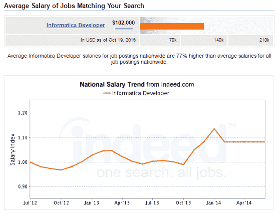
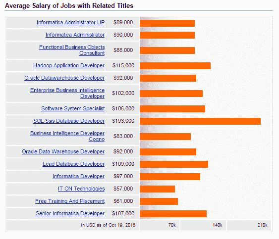
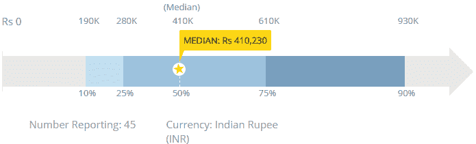
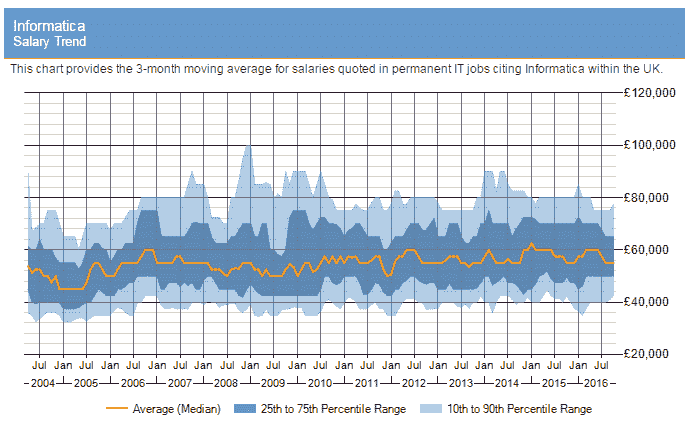

# Informatica 职业发展:你需要知道的一切

> 原文：<https://www.edureka.co/blog/career-progression-with-informatica-all-you-need-to-know>

使用数据仓库来报告和分析数据已经有十多年的历史了，但是最近，企业发现需要从数据中检索可操作的见解。数据质量从未如此重要！如今，企业正在大力投资于有效的数据仓库解决方案，以帮助他们理解自己的数据，尤其是对业务有直接影响的以客户为中心的数据。这就为 ***[的职业发展和](https://www.edureka.co/informatica)*** 提供了大量的机会。因此，现在是您开始 Informatica 职业发展的最佳时机。

在最近接受《信息周刊》采访时，领先的数据仓库和 ETL 巨头 Informatica 的新任首席执行官 Anil Chakravarthy 提到，2016 年，公司正在将精力集中在六项技术上；大数据、云、数据集成、主数据管理、数据质量和数据安全性。在找到如何将云与大数据相结合的方法后，Informatica 现在下大赌注，向全球企业提供关于大数据的可行见解。Informatica 宣称几乎 100%的上线率，这在 IT 行业是闻所未闻的。此外，Informatica 工具还享有 94%的客户忠诚度，毫无疑问，Informatica 将重新定义 ETL 和数据仓库。

这开启了新的职业机会，并催生了更多 ETL、数据处理和 Informatica 仓储方面的工作岗位。在这篇博文中，我们将讨论如何通过 Informatica 实现职业发展。

学习 Informatica 的先决条件包括 SQL 知识，尤其是函数、连接、子查询等。

虽然任何新生都可以学习 Informatica，但 ETL、SQL 和数据仓库概念的知识会有所帮助。此外，最好具备数据存储系统/应用程序的知识，尽管这不是强制性的，因为 Informatica Powercenter 是一种用于从/向数据存储系统(如 RDBMS、BigData、CRM、社交媒体、web 服务、平面文件等)提取/加载数据的应用程序。

## **谁可以转 Informatica？**

Although any professional who is passionate about data integration can switch careers to Informatica, the most common job profiles to opt for Informatica careers are:1\. Software Developers2\. Analytics Professionals 3\. BI/ETL/DW Professionals4\. Mainframe developers and Architects5\. Individual Contributors in the field of Enterprise Business Intelligence

## **信息化岗位角色**

最受欢迎的信息工具是 Informatica PowerCenter、Informatica Power Exchange 和 Informatica Reporting Services。Informatica PowerCenter 是当今使用最广泛的 ETL 工具。凭借其高效的数据分区、并行处理、创新的缓存技术和批量提取能力，Informatica PowerCenter 正被所有业务领域的企业所采用。

一些最受欢迎的信息类工作简介有:

*   信息开发者
*   分析师
*   信息顾问
*   MDM 开发者
*   信息管理员
*   信息应用开发者
*   下午

## **职业发展与信息化**

作为一名初学者，你可能会被聘为初级 Informatica ETL 开发人员，然后逐步晋升为高级/首席开发人员。

经过 7-10 年的工作经验，你可以晋升到信息管理员或信息架构师的职位。其他 BI 和数据仓库技能也可以给你额外的优势，帮助你成为 ETL 架构师或 BI/数据架构师。

## **信息化职位简介**

根据 JobGraphs.com 的调查，Informatica 公司 37.3%的职位是开发人员，尽管分析师、建筑师和顾问也有同等的机会。在过去的几个月里，这些职位的基本工资一直在稳步增长，这种上涨趋势很可能会在接下来的几周内持续下去。根据 ITJobsWatch 的数据，在 2015 年 11 月至 2016 年 2 月期间，Informatica 开发人员职位增加了 24 个百分点，成为数据仓库领域最热门的职位之一。

这里有一份谷歌趋势报告，记录了 Informatica 开发人员工作简介越来越受欢迎的情况。

来源:谷歌趋势

Informatica 工具的用途远不止 ETL，这反映在有超过 100，000 名训练有素的 Informatica 开发人员，以及对同等或更熟练的劳动力加入该领域的需求。它是 It 中最普遍的技能之一，因为大多数领先的组织都依赖 Informatica 来为应用程序和分析环境管理数据。

信息类工作的薪水也呈上升趋势，这反映了拥有信息技能的专业人士的机会越来越多。对 Indeed.com 的一项快速调查显示，美国 Informatica 开发人员的平均工资为 102，000 美元，随经验的不同而不同。

事实上，除了工作年限之外，薪水还会随着职位和技能水平的不同而不同。这是一张显示工资和职位的图表。

资料来源:Indeed.com

这种趋势在印度也有所反映，那里初级 Informatica 开发人员的平均工资是卢比。Payscale.com 报告的 4，10，230 人。工资根据工作年限和职位不同而不同。

资料来源:Payscale.com

在英国，信息类工作的平均工资也在 5.5 万英镑以上。这张图表显示了这一趋势。

资料来源:itjobswatch.co.uk

许多全球金融集团和其他大型跨国公司投资于信息工具，并利用更有意义和业务相关的数据。这些公司包括西联、安联、荷兰国际集团、西门子、亚洲涂料、EMC 和三星等。随着这些公司的足迹扩展到印度和世界上的其他国家，就业机会正在迅速增加，迫切需要受过培训的信息工具人员。

Edureka 有一个特别策划的课程，帮助你掌握 Informatica 工具的开发和管理功能。该培训将使您成为使用 Informatica PowerCenter Designer 进行 ETL 和数据挖掘的大师。该课程涵盖了信息开发技术、错误处理、数据迁移、性能调优等等。新的批次即将出现；所以在这里查看一下 [信息论培训](https://www.edureka.co/informatica) 。

*有问题吗？请在评论区提到它，我们会给你回复。*

**相关帖子:**

[Informatica power center 9 入门。x 开发者&管理员](https://www.edureka.co/informatica "Get started with Informatica")

[顶级信息类面试题](https://www.edureka.co/blog/interview-questions/top-informatica-interview-questions-2016/ "Top Informatica interview questions")

[什么是 Informatica:Informatica power center 初学者指南](https://www.edureka.co/blog/what-is-informatica/)