# 15 大 Docker 命令–Docker 命令教程

> 原文：<https://www.edureka.co/blog/docker-commands/>

在我之前的博客中，我已经介绍过 **[什么是 Docker](https://www.edureka.co/blog/what-is-docker-container)** ，以及如何使用它。今天，在这篇博客中，我将谈论你在使用 Docker 时经常使用的 15 个 Docker 命令。Docker 容器的趋势一直在不可阻挡地发展，组织积极寻找拥有 ***[Docker 认证](https://www.edureka.co/docker-training)*** 的专业人员，对这些 Docker 命令的良好了解将为您提供所需的专业知识。

以下是包含的命令:

*   **[docker——版本](#version)**
*   **[码头工人拉](#pull)**
*   **[码头工人运行](#run)**
*   **[docker PS](#ps)**
*   **[docker PS-a](#psa)**
*   **[【坞站执行】](#exec)**
*   **[停靠](#stop)**
*   **[码头工人杀](#kill)**
*   **[码头工人提交](#commit)**
*   **[【坞站登录】](#login)**
*   **[码头工人推](#push)**
*   **[docker 图片](#images)**
*   ****
*   **[【RMI 坞站】](#rmi)**
*   ****

那么，我们开始吧:

## **Docker 命令**

1。**docker–版本**

该命令用于获取当前安装的 docker 版本

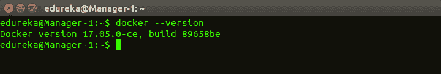

2。**码头工人拉**

**用法:码头工拉<形象名称>**

该命令用于从 **docker 存储库【hub.docker.com **中提取图像

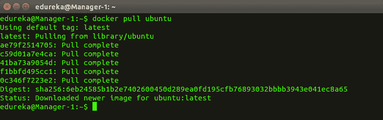   3。 **docker 运行**

**用法:坞站运行-it -d <图像名称>**

该命令用于从图像中创建一个容器

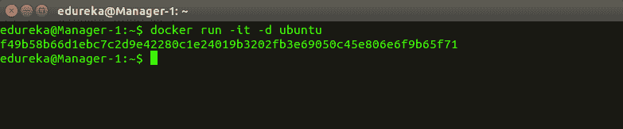   4。**docker PS**

该命令用于列出正在运行的容器

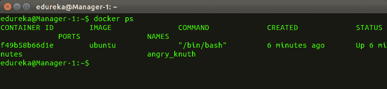   5。**docker PS-a**

该命令用于显示所有运行和退出的容器

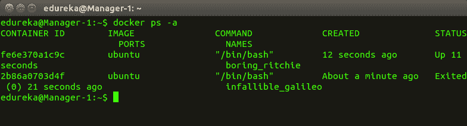   6。**码头执行部**

**用法:docker exec -it <容器 id>bash**

该命令用于访问正在运行的容器

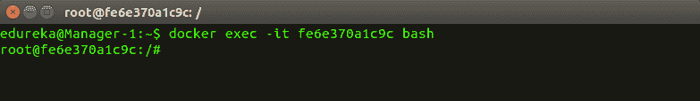   7。**docker stop**

**用法:停靠站<集装箱标识>**

该命令停止一个正在运行的容器

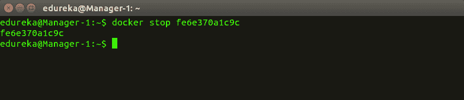   8。

**用法:码头杀手<集装箱标识>**

该命令通过立即停止执行来终止容器。“docker kill”和“docker stop”的区别在于,“docker stop”为容器提供了正常关闭的时间，在花费太多时间让容器停止的情况下，可以选择杀死它

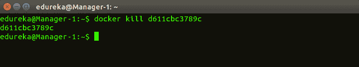   9。 **docker 提交**

**用法:坞站确认<【柯南 id】><【用户名/图像名称】>**

该命令在本地系统上创建一个已编辑容器的新图像

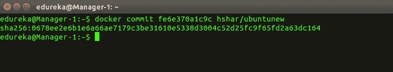   10。 **【码头登录】**

该命令用于登录 docker hub 库

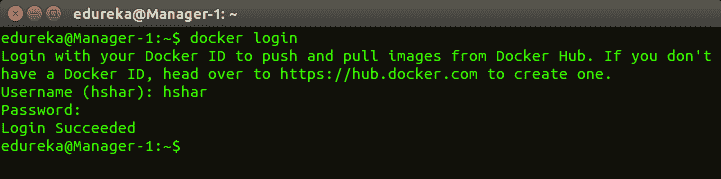   11。 **docker 推送**

**用法:坞站推<【用户名/图像名称】>**

该命令用于将图像推送到 docker hub 库

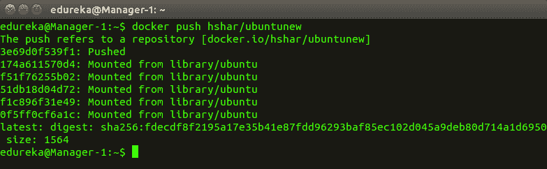   12。 **docker 图片**

该命令列出所有本地存储的 docker 图像

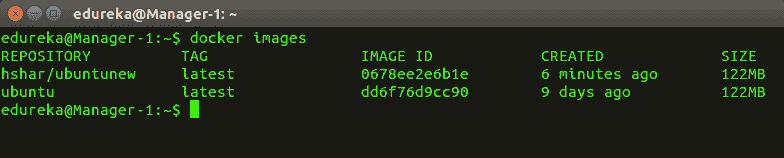   13。**docker RM**

**用法:坞站 rm <【容器 id】>**

该命令用于删除停止的容器

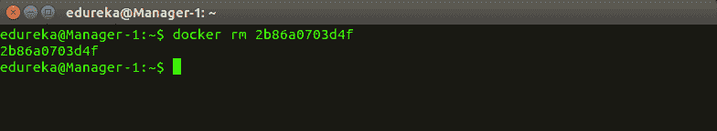   14。**RMI 坞站**

**用法:rmi 坞站<图像 id >**

该命令用于从本地存储器中删除图像

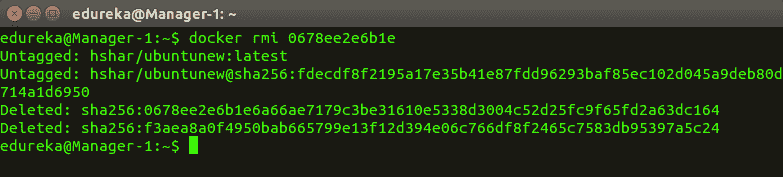   15。**docker build**

**用法:坞站建设<【坞站文件路径】**

该命令用于从指定的 docker 文件构建图像

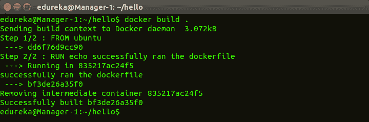

想了解更多关于 docker 命令的信息吗？这里有一个 **[码头工人教程](https://www.edureka.co/blog/docker-tutorial)** 让你入门。或者，您可以采用自上而下的方法，从本 **[Devops 教程开始。](https://www.edureka.co/blog/devops-tutorial)**

*既然你已经了解了什么是 DevOps，那就来看看我们的* ***[DevOps 认证培训](https://www.edureka.co/devops/)** 由 Edureka 提供，edu reka 是一家值得信赖的在线学习公司，拥有遍布全球的 250，000 多名满意的学习者。Edureka DevOps 认证培训课程可帮助学员获得各种 DevOps 流程和工具方面的专业知识，例如 Puppet、Jenkins、Nagios、Ansible、Chef、Saltstack 和 GIT，用于自动化 SDLC 中的多个步骤。*

*有问题吗？请在评论区提到它，我们会给你回复。*