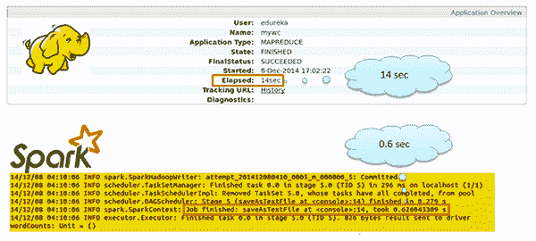
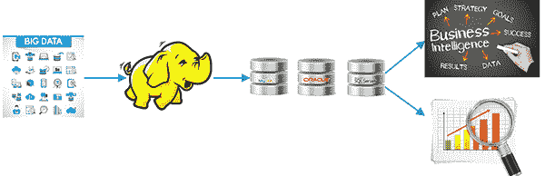
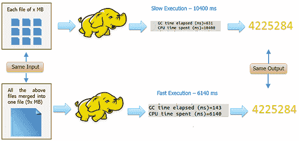
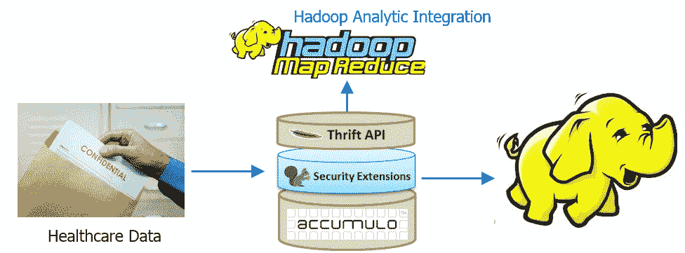
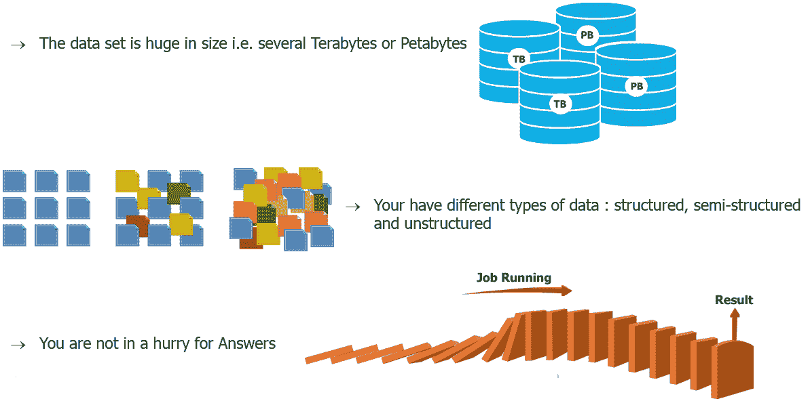
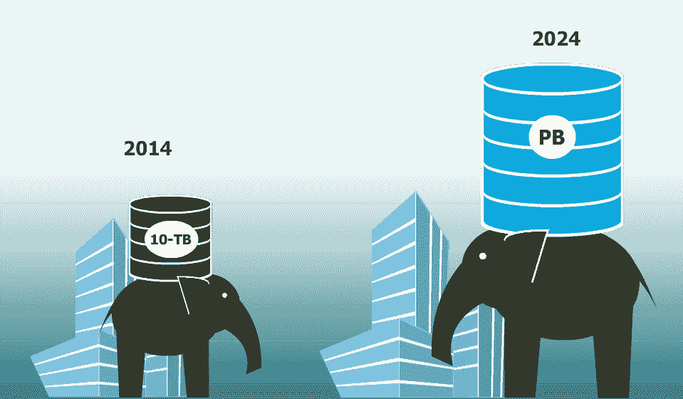
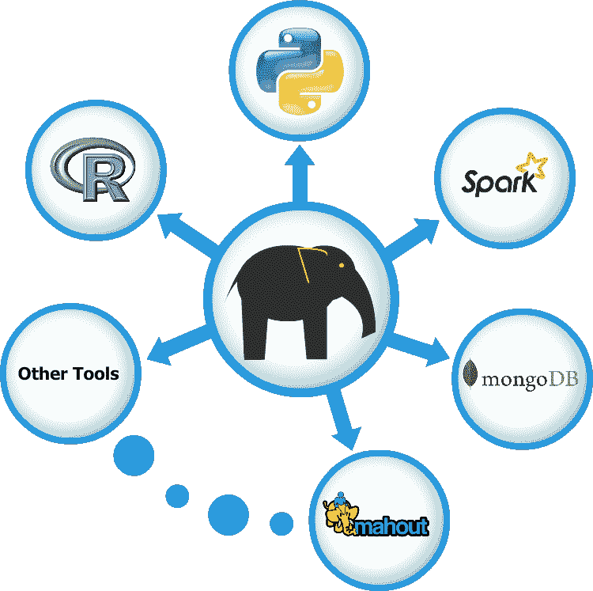
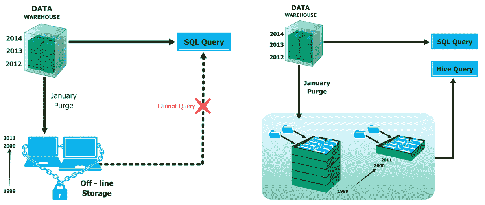

# 何时使用、何时不使用 Hadoop 的 5 个理由

> 原文：<https://www.edureka.co/blog/5-reasons-when-to-use-and-not-to-use-hadoop/>

坚持住！在加入竞赛并成为 Hadoop 狂热者之前，请等一等，好好想想。Hadoop 已经成为 IT 行业的热门词汇有一段时间了。每个人似乎都急于学习、实施和采用 Hadoop。为什么他们不应该呢？IT 行业是一个充满变化的行业。当其他人利用 Hadoop 时，您不会喜欢落在后面。然而，仅仅学习 Hadoop 是不够的。在我看来，大多数人忽略的是最重要的方面，即“何时使用、何时不使用 Hadoop”

**参考资源:**

*   [学习 Hadoop 的 5 个理由](https://www.edureka.co/blog/5-reasons-to-learn-hadoop)
*   [关于 Hadoop 你需要知道的一切](https://www.edureka.co/blog/hadoop-tutorial/)
*   [大数据分析是最佳职业选择的 10 个理由](https://www.edureka.co/blog/10-reasons-why-big-data-analytics-is-the-best-career-move)
*   [对大数据和 Hadoop 感兴趣–查看课程](https://www.edureka.co/big-data-and-hadoop)

您也可以浏览一下这个视频的录制，我们的 [***Hadoop 培训***](https://www.edureka.co/big-data-hadoop-training-certification) 专家已经用例子详细地解释了这些主题。

[//www.youtube.com/embed/qmV81YkSVok](//www.youtube.com/embed/qmV81YkSVok)

在这篇博客中，您将了解直接使用 Hadoop 不是最佳选择，但使用行业认可的方式会有好处的各种场景。此外，您将了解 Hadoop 应该是首选的场景。因为你的时间对我来说太宝贵了，我不能浪费，所以我现在将从这个博客的讨论主题开始。如果你知道什么时候使用 Hadoop，那么你很容易理解其中的概念，并获得[大数据认证](https://www.edureka.co/blog/top-big-data-certifications)。

[下载 Hadoop 安装指南](https://edureka.wistia.com/medias/kkjhpq0a3h/download?media_file_id=67707771%20course_id=13)

首先，我们将看到不应该直接使用 Hadoop 的场景/情况！

## **在不使用 Hadoop 的时候**

### **# 1。实时分析**

如果您希望进行一些实时分析，并且希望快速得到结果，则不应直接使用 Hadoop。这是因为 Hadoop 工作在批处理上，因此响应时间很长。

下图解释了如何在 Hadoop 中使用 MapReduce 进行处理。

**实时分析——行业认可的方式**

由于 Hadoop 无法用于实时分析，人们探索并开发了一种新的方法，可以利用 Hadoop (HDFS)的优势，实现实时处理。因此，业界公认的方法是将大数据存储在 HDFS，并在其上安装 Spark。通过使用 spark，处理可以在一瞬间实时完成(真正快速)。

声明一下，据说 Spark 比 Hadoop 快 100 倍。哦，是的，我说快 100 倍，这不是一个打印错误。下图显示了 MapReduce 处理和 Spark 处理之间的比较

我取了一个数据集，执行了一个用 Mapreduce 和 Spark 写的行处理代码，一个接一个。在保持数据集大小、逻辑等指标不变的情况下，下面是 MapReduce 和 Spark 分别花费的时间。

*   MapReduce–14 秒
*   火花-0.6 秒

这是一个很好的区别。然而，好还不够好。为了实现 Spark 的最佳性能，我们必须采取更多措施，如微调集群等。

[buttonleads form_title= "下载安装指南" redirect _ URL = https://edu reka . wistia . com/medias/kkjhpq 0 a 3h/Download？media _ file _ id = 67707771 course _ id = 166 button _ text = "下载 Spark 安装指南"]

**参考资源:**

*   [蜂巢&纱线被火花充电](https://www.edureka.co/blog/yarn-hive-get-electrified-by-spark/)
*   [Apache 与 Hadoop 擦出火花——为什么重要？](https://www.edureka.co/blog/apache-spark-with-hadoop-why-it-matters/)
*   [对星火感兴趣——见其内容](https://www.edureka.co/apache-spark-scala-training)

### **# 2。不是现有基础设施的替代品**

Hadoop 不是您现有数据处理基础设施的替代品。但是，您可以将 Hadoop 与它一起使用。

**行业公认的方式:**

所有的历史大数据都可以存储在 Hadoop HDFS 中，并可以处理和转换成结构化的可管理数据。在 Hadoop 中处理数据后，您需要将输出发送到关系数据库技术，用于 BI、决策支持、报告等。通过 [蔚蓝数据工程认证](https://www.edureka.co/microsoft-azure-data-engineering-certification-course) 可以更好的理解。

下面的图表会让你更清楚这一点，这是一个行业公认的方式。

**给聪明人的话:**

*   Hadoop 不会取代你的数据库，但是你的数据库也不可能取代 Hadoop。
*   不同的工作用不同的工具，就这么简单。

**参考资源:**

*   [大数据培训可以改变组织的 7 种方式](https://www.edureka.co/blog/7-ways-big-data-training-can-change-your-organization/)
*   [甲骨文-HDFS 使用 Sqoop](https://www.edureka.co/blog/hdfs-using-sqoop/)

### **# 3。多个较小的数据集**

不建议将 Hadoop 框架用于小型结构化数据集，因为市场上有其他工具可以轻松完成这项工作，而且速度比 Hadoop 更快，如 MS Excel、RDBMS 等。对于小型数据分析，Hadoop 可能比其他工具更昂贵。

**行业公认的方式:**

我们是聪明人。我们总能找到更好的方法。在这种情况下，由于所有的小文件(例如，服务器每日日志)都是相同的格式、结构，并且要对它们进行的处理也是相同的，所以我们可以将所有的小文件合并成一个大文件，然后在其上运行我们的 MapReduce 程序。

为了证明上述理论，我们进行了一个小实验。

你甚至可以在金奈 参加 [数据工程培训，了解大数据的细节。](https://www.edureka.co/microsoft-azure-data-engineering-certification-course-chennai)

下图解释了同样的情况:

我们取了 9 个文件，每个文件 x mb。因为这些文件很小，我们把它们合并成一个大文件。整个大小为 9x mb。(非常简单的数学:9 * x mb = 9x mb)

最后，我们编写了一个 MapReduce 代码，并执行了两次。

1.  第一次执行(作为小文件输入):

*   输入数据:9 个文件，每个文件 x mb
*   输出:4225284 条记录
*   所用时间:10400 毫秒

2.  第二次执行(作为一个大文件输入):

*   输入数据:1 个文件，每个 9x mb
*   输出:4225284 条记录
*   耗时:6140 毫秒

如你所见，第二次执行比第一次花费的时间少。因此，它证明了这一点。

**参考资源:**

*   [Map-Reduce 设计模式课程](https://www.edureka.co/mapreduce-design-patterns-sp)

### **# 4。Hadoopers 新手**

除非你对 Hadoop 框架有更好的理解，否则不建议使用 Hadoop 进行生产。Hadoop 是一项应该附带免责声明的技术:“小心处理”。你应该在使用它之前知道它，否则你会像下面的孩子一样结束。

学习 Hadoop 及其生态系统工具，并决定哪种技术适合您的需求，这又是一个不同层次的复杂性

**参考资源:**

*   [Hadoop 开发者岗位职责&技能](https://www.edureka.co/blog/hadoop-developer-job-responsibilities-skills/)
*   [大数据培训如何改变组织的 7 种方式](https://www.edureka.co/blog/7-ways-big-data-training-can-change-your-organization/)

### **# 5。安全是首要考虑的问题。**

许多企业(尤其是在处理敏感数据的高度监管行业中)无法像他们希望的那样快速实施大数据项目和 Hadoop。

**行业公认的方式**

有多种方法可以确保您的敏感数据在大象(Hadoop)中是安全的。

1.  迁移到 Hadoop 时加密您的数据。您可以使用任何加密算法轻松编写一个 MapReduce 程序，将数据加密并存储在 HDFS 中。

最后，您使用数据进行进一步的 MapReduce 处理，以获得相关的见解。

另一种我知道并且用过的方法是在 Hadoop 上使用 Apache Accumulo。Apache Accumulo 是一个排序的、分布式的键/值存储，是一个健壮的、可伸缩的、高性能的数据存储和检索系统。

ref:[【https://accumulo.apache.org/】T2](https://accumulo.apache.org/)

他们在定义中没有提到的是，它实现了一种称为单元级安全的安全机制，因此在安全性受到关注的情况下，它是一个很好的选择。 

**参考资源:**

*   [在银行领域实施 R 和 Hadoop](https://www.edureka.co/blog/implementing-hadoop-and-r-analytic-skills-in-banking-domain/)

## **何时使用 Hadoop**

### **# 1。数据大小和数据多样性**

当您处理来自各种来源、各种格式的海量数据时，您可以说您正在处理大数据。在这种情况下，Hadoop 是适合您的技术。

### 

**参考资源:**

*   [改变游戏规则的大数据用例](https://www.edureka.co/blog/game-changing-big-data-use-cases/)

### **# 2。未来规划**

这是关于为你将来可能面临的挑战做好准备。如果您预计 Hadoop 是未来的需求，那么您应该做出相应的规划。要在您的数据上实施 Hadoop，您应该首先了解数据的复杂程度及其增长速度。所以，你需要一个集群规划。它可以从根据目前可用的数据(以 GB 或几 TB 为单位)在您的行业中构建一个小型或中型集群开始，并在未来根据您的数据增长来扩展您的集群。

**参考资源:**

*   [大数据分析是最佳职业选择的 10 个理由](https://www.edureka.co/blog/10-reasons-why-big-data-analytics-is-the-best-career-move)

### **# 3。大数据的多种框架**

有不同的工具用于不同的目的。Hadoop 可以与多种分析工具集成以充分利用它，如用于机器学习的 Mahout、用于分析和可视化的 R 和 Python、用于实时处理的 Python、Spark、用于 Nosql 数据库的 MongoDB 和 Hbase、用于 BI 的 Pentaho 等。

我不会在这个博客中展示集成，但会在 Hadoop 集成系列中展示。我对此已经很兴奋了，我希望你也有同样的感觉。

**参考资源:**

*   [用看象人课程检查机器学习](https://www.edureka.co/mahout-self-paced)
*   [结帐业务分析同 R 课程](https://www.edureka.co/r-for-analytics)
*   [Python for Analytics 教程](https://www.edureka.co/python)
*   [MongoDB:NoSQL 数据库简介](https://www.edureka.co/blog/introduction-to-nosql-database/)
*   [h base 存储架构概述](https://www.edureka.co/blog/overview-of-hbase-storage-architecture/)
*   [MongoDB vs h base vs Cassandra](https://www.edureka.co/blog/mongodb-vs-hbase-vs-cassandra/)

### **# 4。终生数据可用性**

当您希望您的数据永远保持实时运行时，可以使用 Hadoop 的可扩展性来实现。您可以拥有的集群大小没有限制。您可以根据需要随时增加大小，只需以最低的成本向其中添加 datanodes。

**底线是根据您的需求使用合适的技术。**

edu reka 的[大数据架构师课程](https://www.edureka.co/masters-program/big-data-architect-training)使用零售、社交媒体、航空、旅游、金融领域的实时用例，帮助学习者成为 HDFS、Yarn、MapReduce、Pig、Hive、HBase、Oozie、Flume 和 Sqoop 领域的专家。

有问题要问我们吗？请在评论区提到它，我们会给你回复。

**相关帖子:**

[关于 Hadoop 你需要知道的一切](https://www.edureka.co/blog/hadoop-tutorial/ "All you need to know about Hadoop")

[大数据入门& Hadoop](https://www.edureka.co/big-data-and-hadoop)