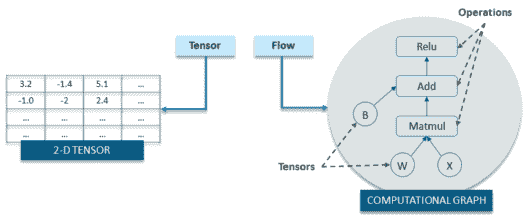
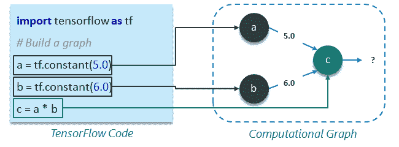
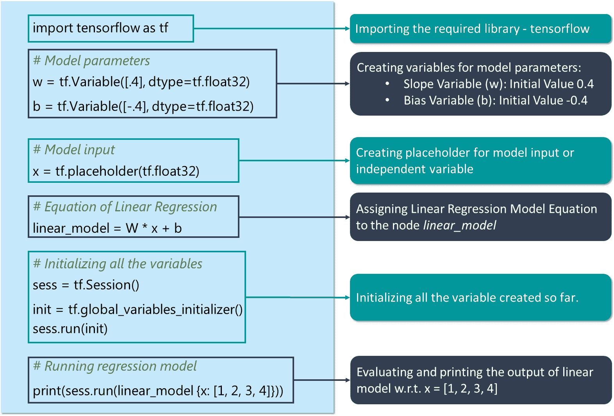
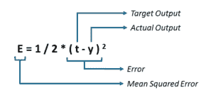
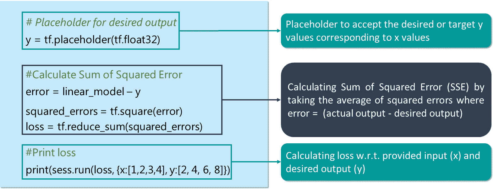
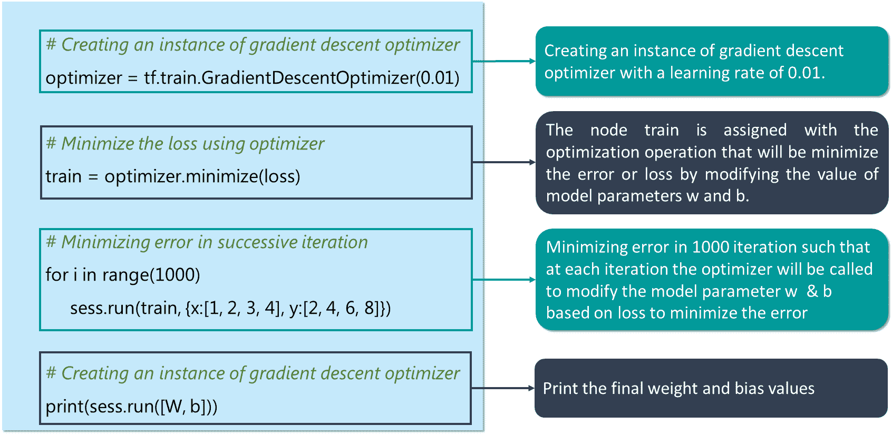

# TensorFlow 教程–使用 TensorFlow 进行深度学习

> 原文：<https://www.edureka.co/blog/tensorflow-tutorial/>

我为有兴趣使用 TensorFlow 应用深度学习算法解决各种问题的专业人士和爱好者设计了这篇 TensorFlow 教程。TensorFlow 是一个开源的深度学习库，它基于数据流图的概念来构建模型。它允许您创建具有许多层的大规模神经网络。学习本库的使用也是 ***[AI &深度学习课程课程表](https://www.edureka.co/ai-deep-learning-with-tensorflow#curriculum)*** 的基础部分。以下是这篇 TensorFlow 教程博客将要讨论的主题:

*   **什么是张量流**
*   **张量流代码基础知识**
*   **张量流用例**

## **什么是张量？**

在这篇 TensorFlow 教程中，在讲 TensorFlow 之前，我们先来了解一下*什么是张量*。张量只不过是深度学习中表示数据的事实。

如上图所示，张量只是多维数组，它允许你表示更高维的数据。一般来说，深度学习处理高维数据集，其中维度指的是数据集中存在的不同特征。事实上,“张量流”这个名字来源于神经网络对张量执行的操作。它实际上是一个张量流。既然，你已经理解了什么是张量，让我们在这个张量流教程中继续前进，去理解——*什么是张量流？*

## **什么是 TensorFlow？**

TensorFlow 是一个基于 Python 的库，为实现深度学习模型提供了不同类型的功能。如前所述，术语张量流由两个术语组成——张量&流:



在 TensorFlow 中，术语张量指的是多维数组形式的数据表示，而术语流指的是对张量执行的一系列操作，如上图所示。

现在我们已经介绍了足够多的关于 TensorFlow 的背景知识。

接下来，在本 TensorFlow 教程中，我们将讨论 TensorFlow 代码基础。

## **TensorFlow 教程:代码基础**

基本上，编写 TensorFlow 程序的整个过程包括两个步骤:

1.  构建计算图
2.  运行计算图

我来给你一一解释一下以上两个步骤:

### **1。建筑计算图**

那么，*什么是计算图？*嗯，计算图是一系列排列成图中节点的张量流运算。每个节点取 0 个或多个张量作为输入，并产生一个张量作为输出。我举一个简单的计算图的例子，它由三个节点组成——***a***，***b***&***c***如下所示:



#### **以上计算图说明:**

*   常量节点用于存储常量值，因为它采用零输入，但产生存储的值作为输出。在上面的例子中，a 和 b 分别是值为 5 和 6 的常量节点。

*   节点 c 代表常量节点 a 与 b 相乘的运算，因此，执行节点 c 将导致常量节点 a 的乘法运算& b.

基本上，人们可以把计算图看作是一种将张量流程序中发生的数学计算概念化的替代方式。分配给计算图的不同节点的操作可以并行执行，因此在计算方面提供了更好的性能。

这里我们只是描述计算，它不计算任何东西，它不保存任何值，它只是定义你的代码中指定的操作。

### **2。运行计算图**

让我们以之前的计算图为例，了解如何执行它。下面是上一个例子中的代码:

#### **例 1:**

```
import tensorflow as tf

# Build a graph
a = tf.constant(5.0)
b = tf.constant(6.0)
c = a * b

```

现在，为了获得节点 c 的输出，我们需要在**会话**中运行计算图。Session 将图形操作放到设备上，如 CPU 或 GPU，并提供执行它们的方法。

会话封装了 TensorFlow 运行时的控制和状态，即它存储了有关所有操作执行顺序的信息，并将已计算操作的结果传递给管道中的下一个操作。让我向您展示如何在一个会话中运行上面的计算图(每行代码的解释已作为注释添加):

```
# Create the session object
sess = tf.Session()

#Run the graph within a session and store the output to a variable
output_c = sess.run(c)

#Print the output of node c
print(output_c)

#Close the session to free up some resources
sess.close()

```

```
**Output:**
30
```

所以，这都是关于会话和在会话中运行计算图。现在，让我们谈谈在使用 TensorFlow 构建深度学习模型时我们将广泛使用的变量和占位符。

## **常量，占位符和变量**

在 TensorFlow 中，常量、占位符和变量用于表示深度学习模型的不同参数。因为我之前已经讨论过常量，所以我将从占位符开始。

### **占位符:**

TensorFlow 常量允许您存储一个值，但是，如果您希望您的节点在运行时接受输入，该怎么办？对于这种功能，使用占位符允许您的图形将外部输入作为参数。基本上，占位符是对以后或运行时提供一个值的承诺。我举个例子让事情简单一点:

```
import tensorflow as tf

# Creating placeholders
a = tf. placeholder(tf.float32)
b = tf. placeholder(tf.float32)

# Assigning multiplication operation w.r.t. a &amp;amp; b to node mul
mul = a*b

# Create session object
sess = tf.Session()

# Executing mul by passing the values [1, 3] [2, 4] for a and b respectively
output = sess.run(mul, {a: [1,3], b: [2, 4]})
print('Multiplying a b:', output)

```

```
**Output:**
[2\. 12.]
```

#### **点记关于*占位符:***

*   占位符未初始化，不包含任何数据。
*   必须向占位符提供运行时需要考虑的输入或反馈。
*   在没有输入的情况下执行占位符会产生错误。

现在，让我们向前看，了解一下—*什么是变量？*

### **变量**

在深度学习中，占位符用于在你的模型或图表中获取任意输入。除了接受输入之外，您还需要修改图形，以便它可以根据相同的输入产生新的输出。为此，您将使用变量。简而言之，变量允许您将这样的参数或节点添加到图形中，这些参数或节点是可训练的，即值可以在一段时间内修改。变量通过提供它们的初始值和类型来定义，如下所示:

```
var = tf.Variable( [0.4], dtype = tf.float32 )

```

**注:**

*   *如果您没有明确提供数据类型，TensorFlow 将从初始化的值中推断常量/变量的类型。*
*   TensorFlow 有许多自己的数据类型，如 *tf.float32* 、 *tf.int32* 等。*你可以在这里参考[以上的全部。](https://www.tensorflow.org/api_docs/python/tf/DType)*

常数在你调用 *tf.constant* 时被初始化，它们的值永远不能改变。相反，当你调用 *tf 时，变量不会被初始化。可变*。要初始化 TensorFlow 程序中的所有变量，您**必须**显式调用如下所示的特殊操作:

```
init = tf.global_variables_initializer()
sess.run(init)

```

永远记住，在第一次使用图形之前，必须对变量进行初始化。

**注:** *TensorFlow 变量是包含张量的内存缓冲区，但与仅在图形运行时实例化并在运行后立即删除的普通张量不同，变量在图形的多次执行中仍然存在。*

现在我们已经介绍了足够多的 TensorFlow 基础知识，让我们继续了解如何使用 TensorFlow 实现线性回归模型。

## **使用 TensorFlow 的线性回归模型**

线性回归模型用于根据一个变量(自变量)的已知值预测另一个变量(因变量)的未知值，使用如下所示的线性回归方程:


因此，为了创建一个线性模型，你需要:

1.  因变量或输出变量(Y)
2.  斜率变量(w)
3.  Y–截距或偏差(b)
4.  独立或输入变量(X)

那么，让我们开始使用 TensorFlow 建立线性模型:



点击下面的按钮复制代码:

```
# Creating variable for parameter slope (W) with initial value as 0.4
W = tf.Variable([.4], tf.float32)

#Creating variable for parameter bias (b) with initial value as -0.4
b = tf.Variable([-0.4], tf.float32)

# Creating placeholders for providing input or independent variable, denoted by x
x = tf.placeholder(tf.float32)

# Equation of Linear Regression
linear_model = W * x + b

# Initializing all the variables
sess = tf.Session()
init = tf.global_variables_initializer()
sess.run(init)

# Running regression model to calculate the output w.r.t. to provided x values
print(sess.run(linear_model {x: [1, 2, 3, 4]})) 

```

**输出:**

```
[ 0\.     0.40000001 0.80000007 1.20000005]

```

上述代码仅代表了回归模型实现背后的基本思想，即如何遵循回归线方程，以获得与一组输入值相关的输出。但是，在这个模型中还有两个东西需要添加，以使它成为一个完整的回归模型:

*   首先，我们需要提供一种机制，通过这种机制，我们的模型可以根据给定的一组输入和相应的输出自动训练自己。
*   我们需要做的第二件事是，根据给定的一组 x 值，将模型输出与期望或目标输出进行比较，从而验证我们训练好的模型。

现在，让我们了解如何将上述功能整合到我的回归模型代码中。

### **损失函数–模型验证**

损失函数衡量模型的当前输出与期望输出或目标输出之间的差距。我将为我的线性回归模型使用一个最常用的损失函数，称为误差平方和或 SSE。SSE 计算 w.r.t .模型输出(由 linear_model 表示)和期望或目标输出(y)为: 



```
y = tf.placeholder(tf.float32)
error = linear_model - y
squared_errors = tf.square(error)
loss = tf.reduce_sum(squared_errors)
print(sess.run(loss, {x:[1,2,3,4], y:[2, 4, 6, 8]})

```

```
**Output:**
90.24
```

如你所见，我们的损失价值很高。 因此，我们需要调整我们的权重(W)和偏差(b)以减少我们接收到的误差。

### **tf . train API——训练模型**

TensorFlow 提供**优化器**，缓慢改变每个变量，以最小化损失函数或误差。最简单的优化器是**梯度下降**。它根据该变量的损失导数的大小来修改每个变量。



```
#Creating an instance of gradient descent optimizer
optimizer = tf.train.GradientDescentOptimizer(0.01)

train = optimizer.minimize(loss)

for i in range(1000):
     sess.run(train, {x:[1, 2, 3, 4], y:[2, 4, 6, 8]})
print(sess.run([W, b]))

```

```
Output: [array([ 1.99999964], dtype=float32), array([ 9.86305167e-07], dtype=float32)]
```

这就是如何使用 TensorFlow 创建一个线性模型，并训练它以获得所需的输出。

*既然你已经了解了深度学习，那就来看看 Edureka 的* ***[深度学习与 TensorFlow 培训](https://www.edureka.co/ai-deep-learning-with-tensorflow/)*** *吧，edu reka 是一家值得信赖的在线学习公司，拥有遍布全球的 250，000 多名满意的学习者。Edureka 深度学习 TensorFlow 认证培训课程使用实时项目和任务以及 SoftMax 函数、自动编码器神经网络、受限玻尔兹曼机器(RBM)等概念，帮助学习者成为培训和优化基本和卷积神经网络的专家。*

*有问题吗？请在评论区提到它，我们会给你回复。*