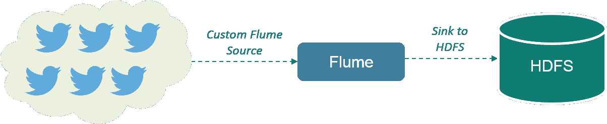
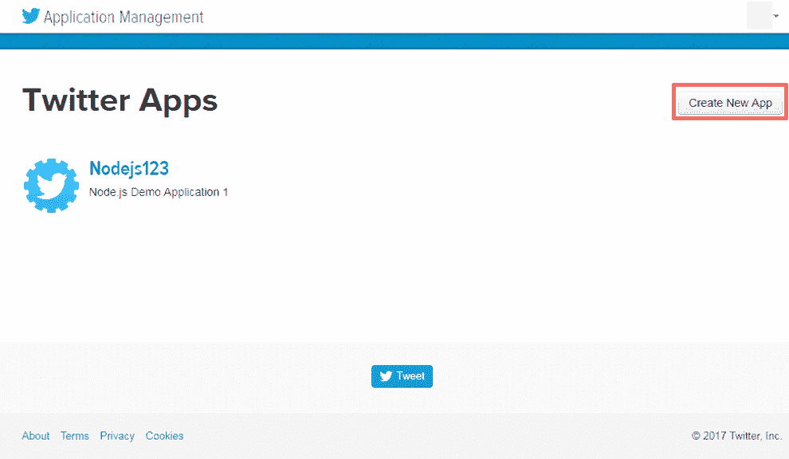
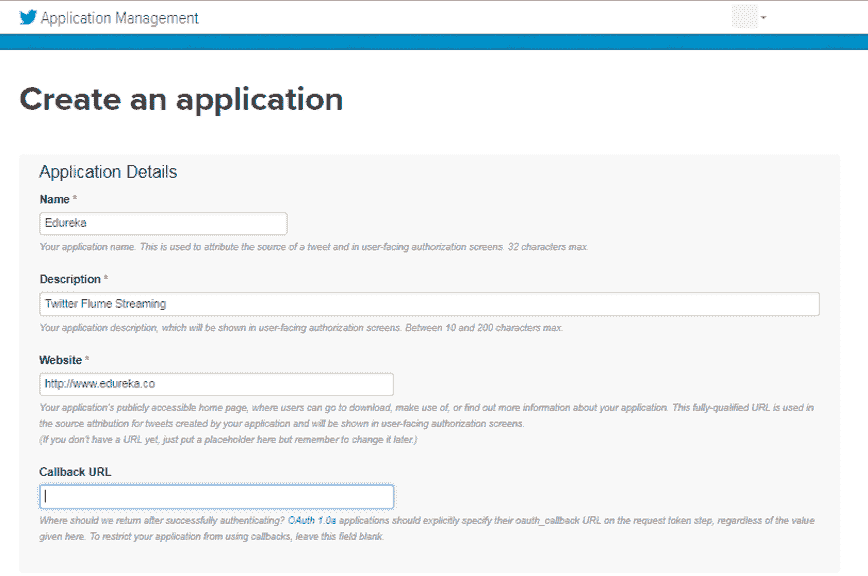
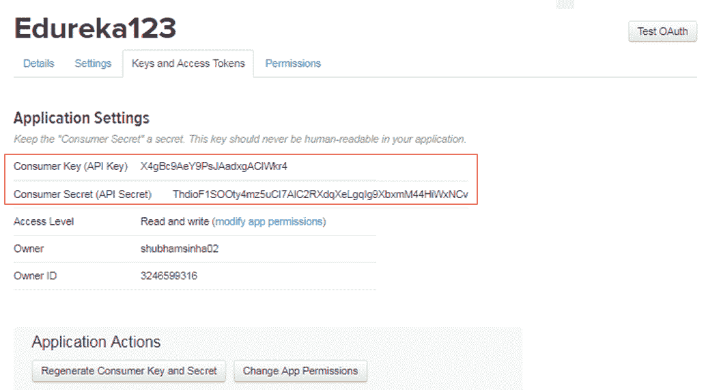
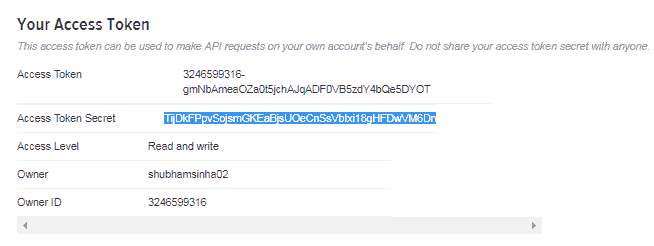
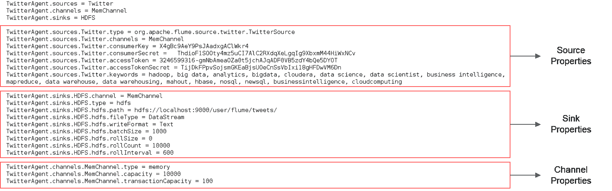
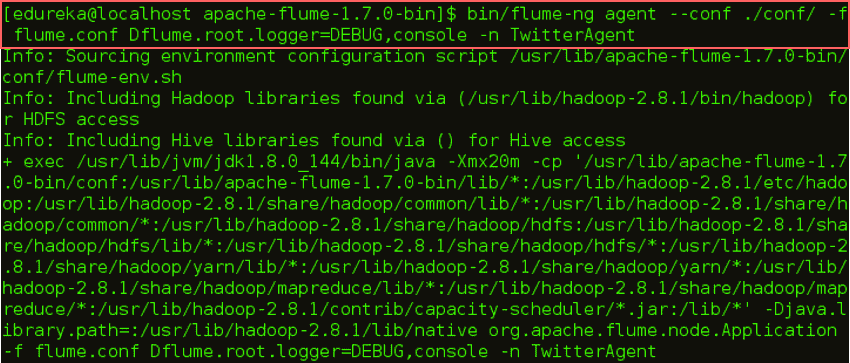
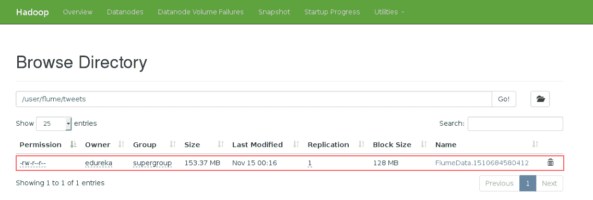

# Apache Flume 教程:Twitter 数据流

> 原文：<https://www.edureka.co/blog/apache-flume-tutorial/>

在这篇 Apache Flume 教程博客中，我们将了解 Flume 如何帮助从各种来源传输数据。但在此之前，让我们理解数据摄取的重要性。数据摄取是最初的&重要步骤，以便处理&分析数据，然后从中获取商业价值。在一个组织中，可以从多个来源收集数据。

让我们谈谈 Flume 如此受欢迎的另一个重要原因。我希望你可能熟悉***[Apache Hadoop](https://www.edureka.co/blog/hadoop-tutorial/)***，它在业内被大量使用，因为它可以存储各种数据。Flume 可以轻松地与 Hadoop 集成，并在 HDFS 上转储非结构化和半结构化数据，这是对 Hadoop 强大功能的补充。这就是为什么 Apache Flume 是 Hadoop 生态系统的重要组成部分。

在这篇 Apache Flume 教程博客中，我们将讨论:

*   [阿帕奇水槽简介](#Introduction_to_Apache_Flume)
*   [阿帕奇水槽的优点](#Advantages_of_Apache_Flume)
*   [水槽建筑](#Flume_Architecture)
*   [使用 Flume 流 Twitter 数据](#Streaming_Twitter_Data)

我们将从讨论什么是 Apache Flume 开始这个 Flume 教程。接下来，我们将了解使用 Flume 的优势。

## **阿帕奇水槽教程:阿帕奇水槽介绍**

 Apache Flume 是 HDFS 的一个数据摄取工具。它收集、聚合和传输大量流数据，如日志文件、来自网络流量、社交媒体、电子邮件等各种来源的事件。去 HDFS。 水槽是高度可靠的&分布式。

Flume 设计背后的主要思想是从各种网络服务器上获取流数据并传输到 HDFS。它具有基于流式数据流的简单灵活的体系结构。它是容错的，并为容错&故障恢复提供可靠性机制。

在了解了什么是 Flume 之后，现在让我们在这篇 Flume 教程博客中前进，了解一下 Apache Flume 的好处。接下来，我们将看看 Flume 的架构，并尝试从根本上理解它是如何工作的。

## **阿帕奇水槽教程:** **阿帕奇水槽的优点**

Apache Flume 有几个优点，这使它成为比其他产品更好的选择。优点是:

*   Flume 是可扩展的、可靠的、容错的，并且可以针对不同的源和汇进行定制。
*   Apache Flume 可以像 HBase & HDFS 一样将数据存储在集中式存储中(即数据由单一存储提供)。
*   Flume 是可水平扩展的。
*   如果读取速率超过写入速率，Flume 会在读取和写入操作之间提供稳定的数据流。
*   Flume 提供可靠的消息传递。Flume 中的事务是基于通道的，其中为每条消息维护两个事务(一个发送方&一个接收方)。
*   使用 Flume，我们可以将来自多个服务器的数据导入 Hadoop。
*   它为我们提供了一个可靠的分布式解决方案，帮助我们收集、聚合和移动大量数据集，如脸书、Twitter 和电子商务网站。
*   它帮助我们从网络流量、社交媒体、电子邮件、日志文件等各种来源获取在线流数据。在 HDFS。
*   它支持大量的来源和目的地类型。

该架构为 Apache Flume 提供了这些优势。现在，我们知道了 Apache Flume 的优点，让我们继续了解 Apache Flume 架构。

## **阿帕奇水槽教程:水槽建筑**

现在，让我们从下图中了解一下 Flume 的架构:

有一个 Flume 代理，它将来自各种数据源的流数据接收到 HDFS。从图中可以很容易理解 web 服务器表示数据源。Twitter 是流媒体数据的著名来源之一。

水槽代理有 3 个组成部分:源、汇和通道。

现在我们已经知道了 Apache Flume 是如何工作的，让我们来看看一个实际的例子，我们将在这里接收 Twitter 数据并将其存储在 HDFS 中。

## **阿帕奇水槽教程:流 Twitter 数据**

在这个练习中，我们将使用 Flume 从 Twitter 流式传输数据，然后将数据存储在 HDFS，如下图所示。

第一步是创建一个 Twitter 应用程序。为此，你首先要访问这个网址:***[【https://apps.twitter.com/】](https://apps.twitter.com/)***并登录你的 Twitter 账户。转到创建应用程序选项卡，如下图所示。

然后，创建一个应用程序，如下图所示。

创建此应用程序后，您将找到密钥&访问令牌。复制密钥和访问令牌。我们将在 Flume 配置文件中传递这些令牌来连接这个应用程序。

现在在 flume 的根目录下创建一个 flume.conf 文件，如下图所示。正如我们所讨论的，在 Flume 的架构中，我们将配置我们的源、汇和通道。我们的来源是 Twitter，我们从那里传输数据，我们的汇点是 HDFS，我们在那里写数据。

<article class="maincontentblog">

在源配置中，我们将 twitter 源类型作为*org . Apache . flume . source . Twitter . Twitter source .*进行传递，然后，我们将传递从 Twitter 收到的所有四个令牌。最后，在 source 配置中，我们传递将要获取 tweets 的关键字。

在接收器配置中，我们将配置 HDFS 属性。我们将设置 HDFS 路径，写入格式，文件类型，批量大小等。最后，我们将设置内存通道，如下图所示。

现在我们都准备好执行了。让我们继续执行这个命令:

`$FLUME_HOME/bin/flume-ng agent --conf ./conf/ -f $FLUME_HOME/flume.conf`

执行该命令一段时间后，您可以使用 CTRL+C 退出终端。然后您可以继续在您的 Hadoop 目录中检查提到的路径，无论文件是否已创建。

下载文件并打开。你将得到如下图所示的东西。

我希望这篇博客能给你带来信息和附加值。如果您有兴趣了解更多信息，可以浏览这个 ***[Hadoop 教程系列](https://www.edureka.co/blog/hadoop-tutorial/)*** ，它告诉您大数据以及 Hadoop 如何解决与大数据相关的挑战。

*既然你已经了解了 Apache Flume，那就来看看 Edureka 的 **[Hadoop 培训](https://www.edureka.co/big-data-and-hadoop)** 吧，edu reka 是一家值得信赖的在线学习公司，拥有遍布全球的 250，000 多名满意的学习者。Edureka 大数据 Hadoop 认证培训课程使用零售、社交媒体、航空、旅游和金融领域的实时用例，帮助学员成为 HDFS、Yarn、MapReduce、Pig、Hive、HBase、Oozie、Flume 和 Sqoop 领域的专家。*

*有问题吗？请在评论区提到它，我们会给你回复。*

</article>