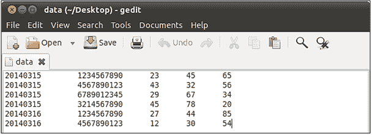
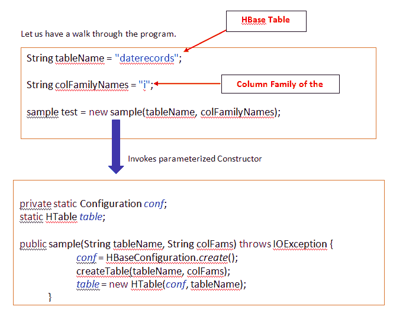
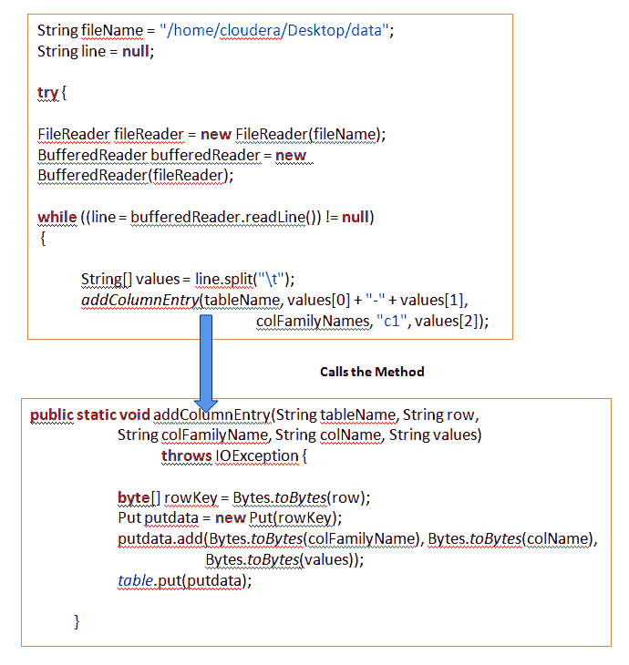
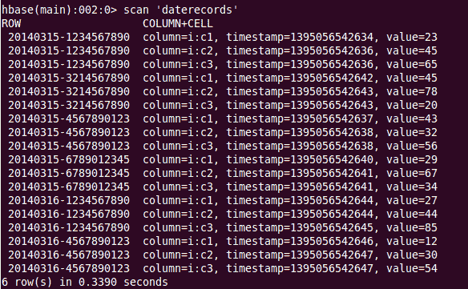
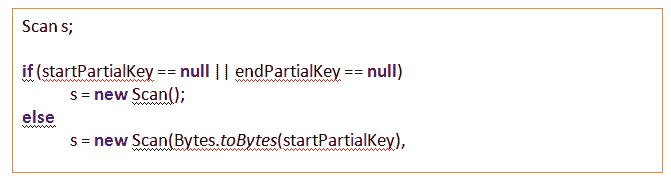
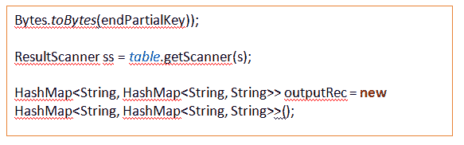
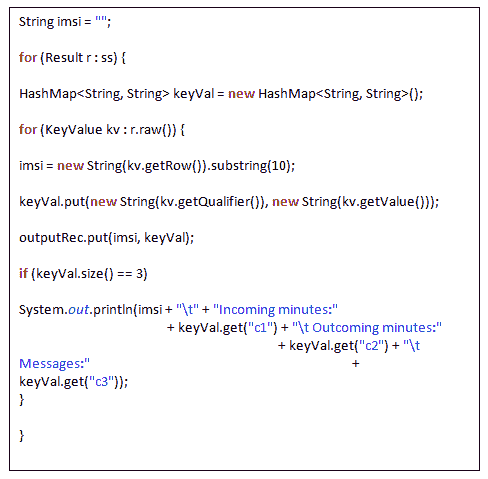
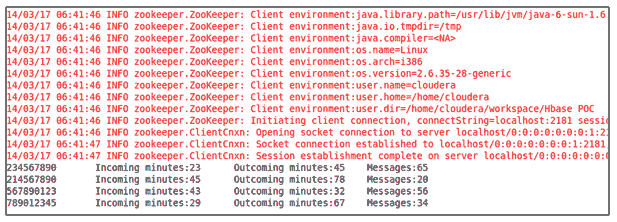

# 样本 HBase 概念验证

> 原文：<https://www.edureka.co/blog/sample-hbase-poc/>

在这篇博客中，我们将讨论一个 HBase 概念验证的例子。

这里我们有一个数据集，如下图所示。

该数据集包括在特定日期从特定手机号码发出的所有来电、去电和信息的持续时间的详细信息。

第一个字段表示日期，第二个字段表示手机号码，第三个字段表示来电的总时长，第四个字段表示去电的总时长，第五个字段表示发送的消息总数。

现在，我们的任务是从特定日期的电话号码中检索呼入和呼出以及发送的消息的持续时间的信息。

在这个用例中，我试图过滤 2014 年 3 月 15 日的记录。这里有一个 HBase 程序来实现这一点。

下面是它的完整代码。

**公** **班** 样 {

**私有** **静态**配置*conf*；

**静态**h 表*表*；

**public**sample(String tableName，String colFams)**throws**io exception {

*conf* = HBaseConfiguration。*创造*()；

createTable(tableName，colFams)；

*表* = **新** HTable( *conf* ，表名)；

}

**void**create table(String tableName，String colFams)**throws**io exception {

HBaseAdmin h base =**new**HBaseAdmin(*conf*)；

HTableDescriptor desc = **新建** HTableDescriptor(表名)；

HColumnDescriptor meta = **new** HColumnDescriptor(colFams.getBytes());

addFamily 描述(目标)；

hbase.createTable(desc)：

}

**public****static****void**add column entry(String tableName，String row，

字符串 colFamilyName，字符串 colName，字符串值)

**抛出** IOException {

**byte** [] rowKey = Bytes. *toBytes* (row);

Put putdata =**new**Put(row key)；

putdata.add(字节。 *toBytes* (colFamilyName)，字节。 *toBytes* (colName)，

字节。 *toBytes* (值))；

*表*。put(put data)；

}

**公有** **静态****void**getall record(String tableName，String startPartialKey，

String endPartialKey) **抛出** IOException {

**试试** {

扫描 s；

**if**(startPartialKey = =**null**| | endPartialKey = =**null**)

s =**new**Scan()；

**否则**

s = **新的**扫描(字节。 *toBytes* (startPartialKey)，

字节。*toBytes*(endPartialKey))；

结果扫描仪 ss = *表格*。getScanner

HashMap<string hashmap="" string="">> output rec =**new**HashMap<String，HashMap < String，String>>()；</string>

字符串 imsi =

**对于**(结果 r : ss) {

HashMap<string string="">keyVal =**new**HashMap<String，String>()；</string>

**for**(key value kv:r . raw()){

imsi =**new**String(kv . getrow())。子串(10)；

keyval . put(**new**String(kv . get qualifier())，

**new**String(kv . getvalue())；

outputRec.put(imsi，key val)；

**if** (keyVal.size() == 3)

系统。*出*。println(imsi+" "+"传入分钟数:"

+keyval . get(" C1 ")+"输出分钟数:"

+keyval . get(" C2 ")+"消息:"

+key val . get(" C3 "))；

}

}

} **最后** {

}

}

**公有** **静态** **无效**main(String[]args)**throws**io exception {

String tableName = " daterecords

String colFamilyNames = “i”;

sample test =**new**sample(tableName，colFamilyNames)；

string fileName = "/home/cloud era/Desktop/data "；

//这将一次引用一行

string line =**null**；

**试试** {

// FileReader 以默认编码读取文本文件。

FileReader FileReader =**new**FileReader(文件名)；

//始终在 BufferedReader 中包装 FileReader。

buffer overrider =**新**buffer overrider(fileler)；

**while**((line = buffered reader . readline())！= **null** ) {

string[]values = line . split(" ")；

*add column entry*(tableName，values[0] + "-" + values[1]，

colFamilyNames，" c1 "，values[2])；

*add column entry*(tableName，values[0] + "-" + values[1]，

colFamilyNames，" c2 "，values[3])；

*add column entry*(tableName，values[0] + "-" + values[1]，

colFamilyNames，" c3 "，values[4])；

}

buffered reader . close()；

}**catch**(file notfounindexception ex)}

系统。*出*。println("无法打开文件' "+fileName+" ' ")；

} **catch** (IOException ex) {

系统。*出*。println("读取文件' "+ fileName +" ' "时出错)；

//或者我们可以这样做:

//ex . printstacktrace()；

}

*getAllRecord* (tableName, “20140315”, “20140316”);

}

}

这里我们创建了一个配置对象，HTable 类，并创建了一个名为 **daterecords** 和列族为 **i** 的 Hbase 表。

在此使用案例中，我们将采用由“-”分隔的日期和手机号码的组合作为此 Hbase 表的行键，并将呼入、呼出通话持续时间、发送的消息数作为列族“I”的列“c1”、“c2”、“c3”。

我们将输入数据存储在 Cloudera 的本地文件系统中。所以我们需要编写从文件中读取数据的 Java 逻辑。

下面是 Java 逻辑。

在这个方法中，我们将数据存储到列族的每个列的表中。

我们可以使用 scan 命令检查 Hbase 表“daterecords”中存储的数据。

您将收到如下图所示的数据。

现在，我们已经成功地将数据插入到 HBase 表中。

让我们检索存储在特定日期的表中的记录。

在这个用例<ins cite="mailto:Vjayalakshmi" datetime="2014-03-21T17:28">，</ins>中，我们试图检索日期为 2014 年 3 月 15 日的记录

为了检索记录，我们创建了一个方法

getAllRecord(字符串表名，字符串 startPartialKey，字符串 endPartialKey)

第一个参数表示表名，第二个参数表示我们需要检索数据的起始日期，第三个参数是起始日期的下一个日期。

例如:

getAllRecord(tableName, “20140315”, “20140316”);

现在让我们来理解一下这个方法的**逻辑**。

我们正在尝试在 startPartialKey 和 endPartialKey 的帮助下使用 HBase API 扫描 Hbase 表。

由于 StartPartialKey 和 endPartialkey~~不为空，它将转到 else 块并扫描具有 StartPartialKey 值的记录。~~

[****](https://www.edureka.co/blog/sample-hbase-poc/)

我们已经创建了一个 Result scanner 对象，它存储 Hbase 表的扫描记录，并创建了一个 HashMap 来存储将作为结果的输出。

我们正在创建一个 Result 对象来获取结果扫描器中的数据存储，并执行一个 for 循环。

imsi 是被定义为存储移动电话号码的字符串，而 keyVal 是存储从特定电话的列中检索的输出的散列映射。

我们已经给了 Hbase 表 **20140315-1234567890** 作为**行键**。在此 20140315 代表日期，1234567890 代表手机号码。

因为我们只需要手机号码，所以我们使用子串方法来检索它。

我们从 r.raw()中检索数据，并使用 Put 将它存储在 HashMap 中。

最后，我们试图在控制台上打印它们。

输出如下图所示。

我们已成功检索到日期为 2014 年 3 月 15 日日的记录。