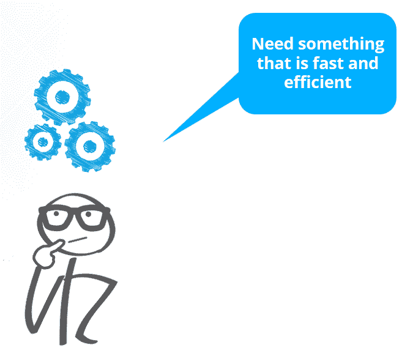
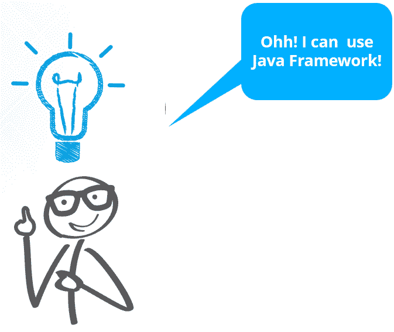
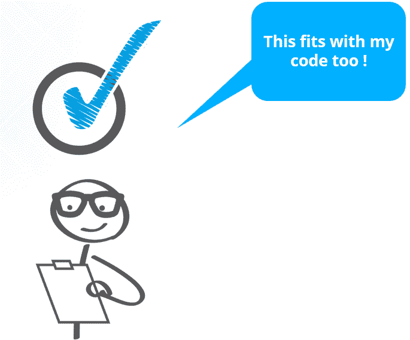
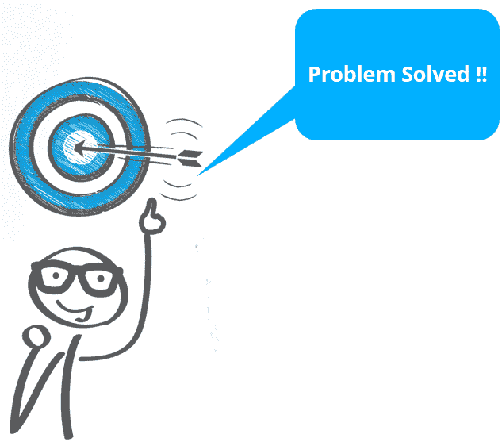
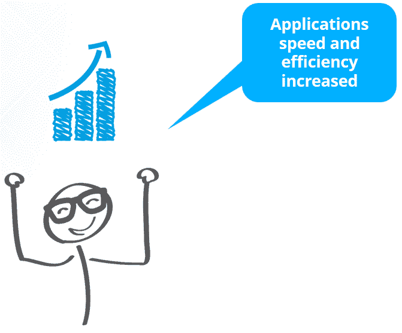
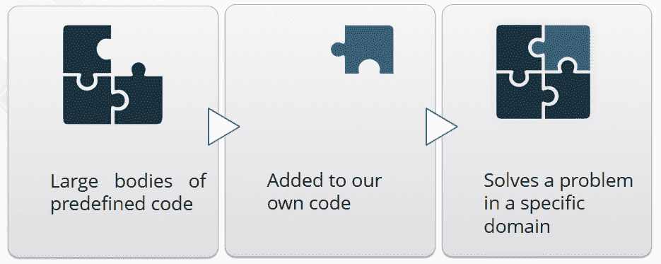
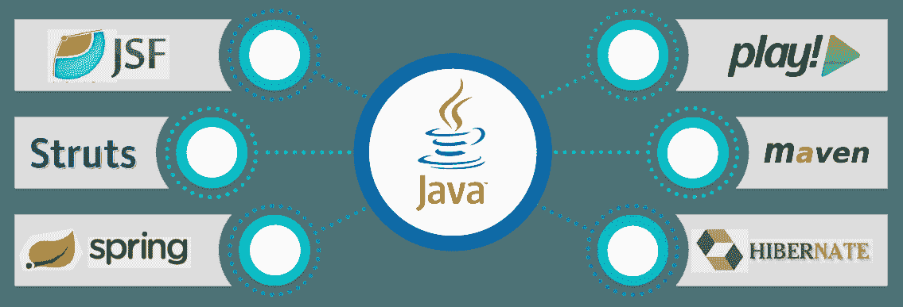
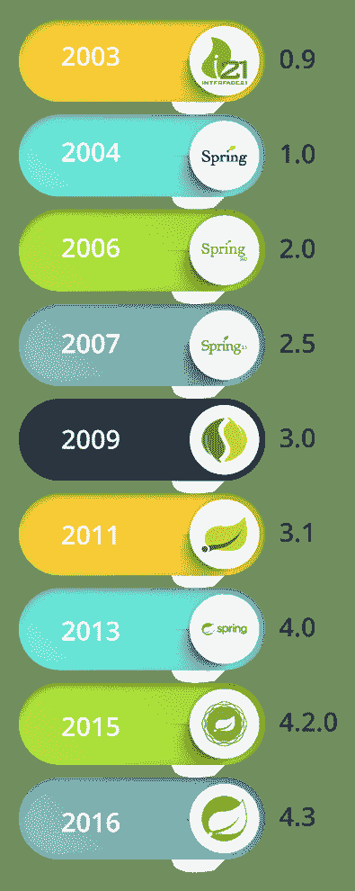
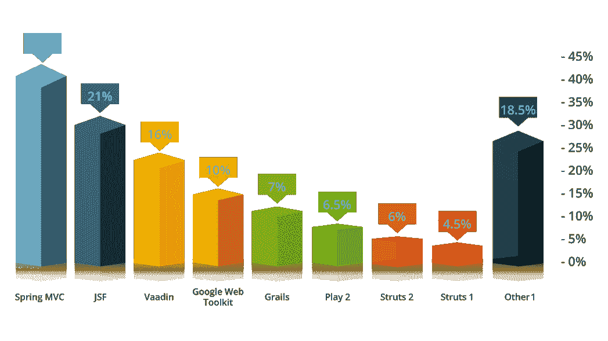
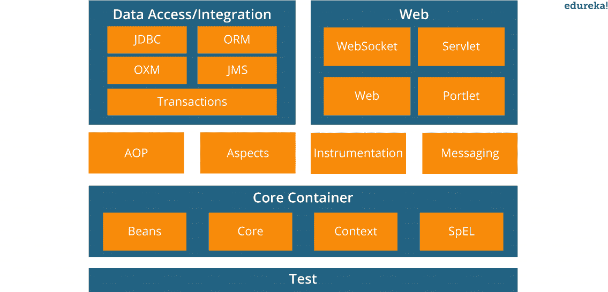

# 什么是 Spring 框架？–高效发展之路

> 原文：<https://www.edureka.co/blog/what-is-spring-framework/>

在当今快节奏的世界中，我们需要一切都快。我们不想让自己长时间从事一项工作，让它像旅游、购物、学习或工作一样。当涉及到编码时，我们希望我们的应用程序在最短的时间内被开发出来，但是要提供最大的效率。我们可能很匆忙，但是我们不能在质量上妥协，也不想在质量上花太多精力。那么解决办法是什么呢？框架在这种情况下工作得最好。市场上有各种可用的框架，其中很少有人使用，比如:Spring、Hibernate、Struts 等等。通过这个博客，让我们来看看什么是 Spring 框架，为什么它在市场上如此受欢迎！

在开始之前，让我们先来看看我将在这个博客中讨论的话题:

*   [Java 框架](#JavaFrameworks)
*   [什么是 Spring 框架？](#WhatIsSpring)
*   [为什么是 Spring 框架？【T2](#WhySpringFramework)
*   [弹簧框架架构](#SpringFrameworkArch)

## **Java 框架**

为什么我们应该选择框架？让和我们的朋友 *Coddy* 一起了解一下吧。


科迪被分配了一个开发应用程序的任务，但是分配的时间不足以完成它。他要自己写很多行代码(LOC)。很费时间，很累。他不知道他应该做什么！他应该从哪里开始！



乖乖女开始思考解决问题的方法。他需要快速高效的东西；像现成的东西一样，省时省力。



突然，他想到了使用框架的想法。框架是快速、高效和轻量级的。它们是大量预定义的代码，我们可以很容易地将它们添加到我们自己的代码中来解决特定的问题。



他用这个框架编码。令人惊讶的是，代码很容易与框架相适应。



*Coddy* 现在，可以更快地编写代码，并在给定的时间框架内完成他的应用程序。此外，他不必编写成千上万行非功能性代码。



在部署了使用该框架开发的应用程序后，他发现与未使用该框架开发的其他应用程序相比，该应用程序的执行速度更快，吞吐量也有所增加。

那么，现在让我们从 Java 框架开始。

## **Java 框架是如何产生的？**

在 20 世纪 90 年代后期，应用程序使用 JEE 标准被广泛开发。J2EE 的前提是多平台/多厂商，如果你能根据 J2EE 标准编码，你就能在任何 J2EE 应用服务器上部署你的应用，而不用考虑平台。在任何应用服务器上运行您的代码都会给您带来很多好处，比如事务管理、消息传递、邮件、目录接口等。但是在这个世界上没有什么是容易的，与 J2EE 一起工作也有一些困难。

*   **非常复杂**:企业 Java Bean 是为了降低 J2EE 应用程序的复杂性而开发的。但是它没有成功地实现它的目标。背后的原因是，在编写组件时，需要编写一组 XML 文件、home 接口、远程/本地接口等。

*   **【查找】问题:** 每当一个组件依赖另一个组件时，它必须自己查找它所依赖的组件。这种组件“查找”只通过名称进行，因此依赖项的名称被硬编码在组件中。

*   **重量级:**作为一个 ll 的特性像集群、远程处理等。被支持，您必须配置它们，不管您是否需要它们。这将使你的应用程序变得臃肿。

Java 框架就是这样产生的。Java 框架不过是大量预定义的代码，您可以将它们应用到自己的代码中，以解决特定领域中的问题。您可以通过调用框架的方法、继承、提供“回调”、监听器或其他 *观察者* 模式的实现来使用框架。

让我们通过一个图示来理解:



但是它们到底是如何减少我们的工作并使我们的代码高效的呢？通过下面这些框架的 优点和缺点来理解它。先说 **优点** 。


**效率:**

通常需要几个小时和数百行代码才能完成的任务，现在可以通过预建的功能在几分钟内完成。开发变得容易多了，所以如果它容易多了，它就会快得多，并且随之更加有效。


**安全:**

一个广泛使用的框架通常会有大型的安全应用。最大的好处是框架背后的邻居，那里的用户通常会成为长期测试者。如果你发现了一个漏洞或安全漏洞，你可以去框架的网站让他们知道，这样就可以修复了。

 **费用:** 

大多数流行的结构都是免费的，这有助于开发者更快地编码。如果编码完成得更快，最终客户的费用在各个方面肯定会更少，无论是时间还是精力。而且维护费用也低。


**支持:**

与任何其他分布式工具一样，框架通常包括文档、支持小组或大型社区在线论坛，在那里你可以获得快速响应。

尽管有所有这些优点，Java 框架也有一些缺点 T2，比如 T3

** **   **限制:**

框架的根本行为是不能改变的，表示当你使用一个框架时，要求你尊重它的局限性，并按照要求的方式工作。因此，您必须确保选择符合您需求的框架。【T2

**代码公开:** **** 

**既然框架人人唾手可得，我 t 也提供给居心不良的人。可以对它进行研究，以便了解事物是如何工作的，并发现可以用来对付你的缺陷。**


**定制** **特色 :**

当你在使用一个框架时，你对它背后的语言知之甚少，因为它的特性是定制的。当你使用定制的特性时，你很可能不得不根据框架的标准来使用它们，而这些标准可能与最初的概念不同。

现在那你知道框架的优缺点，根据你的需要选择你的框架。市场上有各种各样的可用框架。下图显示了其中的几个:

  所以，在这篇博客中我们将重点介绍 Spring 框架。

**什么是 Spring 框架？**

这里出现了一个问题“什么是 Spring 框架”？

*Spring Framework 是一个强大的轻量级应用开发框架，用于企业 Java (JEE)。*

Spring 框架的核心特性可以用于开发任何 Java 应用程序。 它可谓是 完整而模块化的框架。Spring 框架可以用于实时应用程序的所有层实现。与 Struts 和 Hibernate 不同，它还可以用于开发实时应用程序的特定层，但使用 Spring，我们可以开发所有层。

这是关于什么是 Spring Framework，以及它是如何开发的？这背后有一段有趣的历史。让我们看一下 Spring Framework 的历史和起源。

【2002 年 10 月，**澳大利亚计算机专家 Rod Johnson** 写了一本名为《专家一对一 J2EE 设计与开发》的书。在这本书中，他提出了一个基于普通 Java 类(POJO)和依赖注入的更简单的解决方案。他编写了 30，000 多行基础设施代码，其中包括许多用于开发应用程序的可重用 java 接口和类。大约在 2003 年 2 月，Rod、Juergen 和 Yann 开始合作 Spring 项目。“春天”这个名字的由来是因为它意味着传统 J2EE“冬天”之后的一个新的开始。

以下是 Spring 历史上主要发布的时间表:



| 它被命名为 Interface 21，作为对 21 世纪的参考，并在 Apache 2.0 许可下发布。 |
| 这是第一个里程碑版本。从这个版本开始，Spring 框架迅速发展。Interface21 与 Spring 框架并行支持 AspectJ。 |
| 添加了新特性——可扩展的 XML 配置、对 Java 5 和动态语言的支持、IoC 扩展点和 AOP 增强。 |
| 增加了新特性——支持 Java 6/ JEE5、注释配置、类路径中的组件自动检测和 OSGi 兼容包。 |
| 增加了新特性——支持重组模块系统、SpEL、JavaConfig、嵌入式数据库、REST 支持和对 Java EE 6 的支持。 |
| Spring 数据共享空间项目发布。2012 年晚些时候，罗德·约翰逊离开了春季团队。 |
| 所有 Spring 项目都转移到了 Pivotal。添加了新的特性——对 Java 8 的完全支持、websockets、更高的第三方库依赖性、用于 bean 定义的 groovy DSL。 |
| 它与 Java 6、7 和 8 兼容，专注于核心改进和现代网络功能。 |
| 它将是一般 Spring 4 系统要求内的最终一代。4.3.8 是当前版本。 |

## **为什么是 Spring 框架？**

下面的图表展示了 Spring 和其他各种框架之间的比较。**T3T5**

下图是基于 2016 年 5 月的一项调查。从图表中可以看出，Spring Framework 在其领域内非常受欢迎，并且自 2014 年以来一直在 t op 上保持着自己的地位。 

**春架理由作品人气**

Spring Framework 的流行通常有三个主要原因。

1.  简单
2.  测试性
3.  松耦合

让我们详细讨论这些话题。

**简单:** Spring 框架之所以简单，是因为它使用了 POJO 和 POJI 模型，所以是非侵入性的。<>

*   POJO (Plain Old Java Objects):一个没有耦合任何技术或者任何框架的 Java 类被称为 POJO。
*   POJI (Plain Old Java Interfaces):一个没有结合任何技术或任何框架的 Java 接口被称为【POJI】。

**可测试性** **:** 对于编写 Sspring应用程序，服务器不是强制的。但是对于 struts 和 EJB 应用程序，如果你想测试应用程序，你需要一个服务器。它可能需要在源代码中进行大量的更改，并且每次都必须重新启动服务器才能查看这些更改。这变得乏味且耗时。对于 Spring 框架，它有自己的容器来运行应用程序应用程序。 

**松耦合:** Spring 框架是松耦合的，因为它有依赖注入、AOP 等概念。这些特性有助于减少代码中的依赖性和增加模块性。让我们通过一个例子来理解这一点。

这里我有一个 Bike 接口，它有一个 start()方法。它进一步由三个类实现，即:雅马哈、本田和 Bajaj。

```
public interface Bike
{
public void start();
}

```

这里一个类 Rider 创建了一个实现 Bike 接口的任何类的对象。

```
class Rider
{
Bike b;
public void setBike(Bike b)
{
this.b = b;
}
void ride()
{
b.start();
}
}

```

现在 Spring 框架容器可以根据需求注入任何实现 Bike 接口的类的对象。这就是松耦合的工作方式。

## **弹簧框架架构**



从上图可以看出，Spring 有一个分层的架构，由不同的模块组成，这些模块有各自的功能。这些模块概括为以下几层:

*   核心容器
*   数据访问/集成
*   网页
*   AOP(面向方面编程)
*   仪器仪表
*   测试。

您可能想知道，Spring Framework 拥有分层架构的优势是什么？让我们通过以下几点来了解一下:

*   Spring 框架有效地组织了中间层对象。
*   不考虑运行时环境，Spring Framework 的配置管理服务可以用于任何架构层。
*   Spring Framework 在整个应用程序中以一致的方式处理配置。这消除了使用各种自定义属性文件格式的需要。
*   Spring Framework 的设计方式是，用它构建的应用程序将尽可能少地依赖于它的 API。
*   因为使用了接口， Spring 框架方便了良好的编程实践。

为了完全理解什么是 Spring Framework，让我们看一个简单的 Spring Framework 应用程序。遵循五个简单的步骤:

**步骤一:创建 Bean 类**

```

package org.edureka.firstSpring;

public class StudentBean 
{ 
 String name; 
 public String getName()
 { 
 return name; 
 } 
 public void setName(String name) 
 { 
 this.name = name; 
 } 
 public void displayInfo()
 { 
 System.out.println("Hello: "+ name); 
 } 
}

```

**第二步:创建 XML 文件**

```

<xml version="1.0" encoding="UTF-8">
<beans  xmlns:xsi="http://www.w3.org/2001/XMLSchema-instance" xmlns:p="http://www.springframework.org/schema/p" xsi:schemaLocation="http://www.springframework.org/schema/beans http://www.springframework.org/schema/beans/spring-beans-3.0.xsd"> 
<bean id="studentbean" class="org/edureka/firstSpring/StudentBean"> 
<property name="name" value="Edureka"></property>
</bean>
</beans>

```

**步骤三:创建主类**

```

 package org.edureka.firstSpring;
 import org.springframework.context.ApplicationContext;
 import org.springframework.context.support.ClassPathXmlApplicationContext;
 public class StudentDemo
 {
 public static void main(String[] args)
 {
 ApplicationContext appCon=new ClassPathXmlApplicationContext("StudentConfig.xml");
 StudentBean factory=(StudentBean)appCon.getBean("studentbean");
 factory.displayInfo();
 }
 }
```

**第四步:加载 jar 文件**

加载以下 jar 文件。

*   commons-logging-1.2.jar
*   javax . servlet-API-3 . 1 . 0 . jar
*   jstl-1.2.jar
*   spring-AOP-4 . 2 . 2 . release . jar
*   spring-beans-4 . 2 . 2 . release . jar
*   spring-context-4 . 2 . 2 . release . jar
*   弹簧芯 4.2.2.RELEASE.jar
*   spring-expression-4 . 2 . 2 . release . jar
*   spring-we b-4 . 2 . 2 . release . jar
*   spring-web MVC-4 . 2 . 2 . release . jar

*注意:如果需要 jar 文件，请在下面评论。*

**步骤五:运行程序**

在你的服务器上运行程序来测试应用程序。

希望我能够解释清楚，什么是 Spring 框架，它到底是如何工作的，它是用来做什么的。你也可以参考“什么是 Spring Framework”的视频，其中讲师描述了本博客中讨论的主题以及实际演示。

## **什么是 Java 中的 Spring 框架| Spring 框架教程| Edureka**

[https://www.youtube.com/embed/210tVT2uPvI?rel=0&showinfo=0](https://www.youtube.com/embed/210tVT2uPvI?rel=0&showinfo=0)

如果你有兴趣了解更多关于 Spring 框架的知识，那么请继续关注我的这个博客系列，因为我将推出另一个关于 Spring 教程的博客[](https://www.edureka.co/blog/spring-tutorial/)，它将讨论 Spring 中更高级的概念。

*如果你想学习 Spring，并希望在开发 Java 应用程序时使用它，那么就去看看 Edureka 的 [**Spring 框架课程**](https://www.edureka.co/spring-certification-course) ，edu reka 是一家值得信赖的在线学习公司，拥有遍布全球的 250，000 多名满意的学习者。*

*有问题吗？请在评论区提到它，我们会给你回复。*