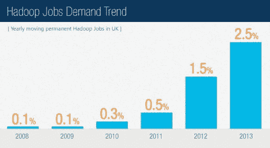

# 为什么大型机专业人员应该转向大数据和 Hadoop？

> 原文：<https://www.edureka.co/blog/move-from-mainframe-to-big-data-hadoop/>

您的组织是否使用大型机来管理数据？您是大型机专家吗？如果是，那么你可能要为房间里的大象做好准备！您的组织，像许多其他组织一样，可能很快会将大型机批量卸载到 [Hadoop](https://www.edureka.co/blog/what-is-hadoop/) 。如果发生这种情况，作为大型机专业人员，您也必须为 Hadoop 做好准备。

让我们快速了解为什么它对于大型机专业人员来说是智能的，并通过 [Hadoop 认证](https://www.edureka.co/big-data-hadoop-training-certification)为这一转变做好准备。

## 积极主动可以帮助你在轮班后获得更多的工作责任

由于最近计算技术的进步，许多在大型机上运行的面向批处理的核心业务正在向现代平台转移。大型机过渡的思想是灵活地适应业务需求的变化。之前，我们捕获的数据是结构化的，非常简单，例如:销售数据、采购订单和其他标准企业数据。但现在，大数据的进入，以及更多的非结构化信息，如文本、文档、图像等，对我们的企业系统提出了挑战。大型机生活在结构化数据的世界中，处理大量非结构化数据既耗时又昂贵。幸运的是，Hadoop 这种开源平台似乎是大型机的可行替代品，可以处理企业生成的大量各种数据。开源使得 Hadoop 成本低廉且易于使用。因此，已经有超过 150 家企业在使用这个开源的大数据管理系统，其余的企业也急于加入进来。因此，如果你比你的组织更早了解 Hadoop，那么你已经准备好承担新的角色和更多的责任。

假设您的组织最近将其数据管理迁移到了 Hadoop。在此过渡之后，他们将需要具备 Hadoop 知识和技能的员工。如果您事先掌握了大数据和 Hadoop 的工作知识，您对组织的价值将会成倍增加。

#### **作为大型机专业人员，迁移到 Hadoop 会是一项优势的其他重要原因是:**

*   正如我们所见，许多组织转向 Hadoop 的主要原因是大型机无法处理企业工作负载。而 Hadoop 处理企业工作负荷，减少应变，主要是降低成本。
*   Hadoop 具有处理复杂业务逻辑的能力。这将使您更加高效，因为您已经掌握了使用大型机的知识。
*   在某种程度上，使用大型机可能会阻碍您满足服务级别协议。这是因为数据量不断增长。如果你了解 Hadoop 及其其他特性，如 PIG、Hive、Sqoop、Hbase 等，你将能够在不同条件下处理任何数量和速度的数据。
*   一般来说，大型机使用批处理需要较长的时间来处理数据。这导致报告及其分析的延迟。有了 Hadoop，批处理将变得更加简单。
*   当你掌握了大型机，学习 Hadoop 对你来说会很容易，因为它有简单而简短的代码。

许多 IT 专业人士预测，Hadoop 将是数据管理系统的未来。不仅仅是 It 公司，其他行业，如零售、食品制造、咨询公司、电子学习业务、金融公司在线旅游、保险公司等等，都在将他们的数据管理系统从大型机迁移到 [**大数据和 Hadoop**](https://www.edureka.co/blog/the-hype-behind-big-data/) 。所以 Hadoop 成为了新兴技能，需求量很大。

## **对大数据专业人才的巨大需求**

企业对 Hadoop 及其技术越来越感兴趣，这推动了对具有大数据技能的专业人员的巨大需求。我们可以说，*大数据正在为**大型机专业人员*** **创造巨大的职业机会。**正在迁移到 Hadoop 的组织正在寻找具有 Hadoop 及其 MapReduce 和 r 等方法的知识和经验的人员。因此，随着 Hadoop 技能集过渡到大数据空间的大型机专业人员将会有很好的职业前景。

据 Dice.com 董事总经理爱丽丝·希尔称，*“Hadoop 职位的发布比一年前增加了 64%，Hadoop 是大数据职位发布类别的领导者。”*

学习或使用 Hadoop 需要一定水平的分析专业知识。Pune 的 [Hadoop 培训让这变得更加容易。以大型机知识为基础，您学习 Hadoop 的尝试将使您更有效、更稳健地应对不同的和不断变化的技术。作为一名技术人员，我相信你会沉迷于并构建新的东西，目前，大数据和数据分析正在获得很大的动力，并将成为一个更大的未来。所以，如果你有 Hadoop 的知识，会对你的职业生涯大有裨益。](https://www.edureka.co/big-data-hadoop-training-certification-pune)

那么，当 IT 专业人员可以让大数据变得更大、更有优势时，他们为什么不应该从大型机迁移到大数据 Hadoop 呢！

有问题吗？请在评论区提及它们，我们将会回复您。

**相关帖子:**

[大数据分析是最佳职业选择的 10 个理由](https://www.edureka.co/blog/10-reasons-why-big-data-analytics-is-the-best-career-move "10 Reasons Why Big Data Analytics is the Best Career Move")

[4 个学习 Hadoop 2.0 的实用理由](https://www.edureka.co/blog/4-practical-reasons-to-upgrade-to-hadoop-2 "4 Practical Reasons to Learn Hadoop 2.0")

[大数据培训可以改变组织的 7 种方式](https://www.edureka.co/blog/7-ways-big-data-training-can-change-your-organization/)