# Oozie 教程:学习如何调度 Hadoop 作业

> 原文：<https://www.edureka.co/blog/apache-oozie-tutorial/>

在开始这篇 Apache Oozie 教程之前，让我们了解一下调度系统在哪里使用。在实时场景中，一个作业依赖于其他作业，例如 MapReduce 任务的输出可能会传递给 Hive job 以供进一步处理。下一个场景可以是，根据时间(如每天、每周、每月)或根据数据可用性安排一组任务。Apache Oozie 为您提供了轻松处理这类场景的能力。这也是为什么 Apache Oozie 是 [***Hadoop 生态系统***](https://www.edureka.co/blog/hadoop-ecosystem) 的重要组成部分。

在这个 Apache Oozie 教程博客中，我们将讨论:

*   Apache Oozie 简介
*   Oozie 工作流程
*   Oozie 协调员
*   Oozie 包
*   字数统计工作流程作业
*   基于时间的字数统计协调器作业

我们将从介绍 Apache Oozie 开始这个 Oozie 教程。接下来，我们将了解使用 Apache Oozie 执行的&可以创造的工作类型。

## **Apache Oozie 教程:Apache Oozie 简介**

 Apache Oozie 是一个调度系统，用于管理&在分布式环境中执行 Hadoop 作业。我们可以通过组合不同类型的任务来创建所需的管道。它可以是你的 Hive，Pig，Sqoop 或者 MapReduce 任务。使用 Apache Oozie，您还可以安排您的工作。在一个任务序列中，两个或多个作业也可以被编程为彼此并行运行。这是一个可升级的、可靠的和可扩展的系统。

Oozie 是一个开源的 Java web 应用，负责触发工作流动作。反过来，它使用 Hadoop 执行引擎来执行任务。

Apache Oozie 通过回调和轮询来检测任务的完成。当 Oozie 启动一个任务时，它向该任务提供一个惟一的回调 HTTP URL，并在任务完成时通知该 URL。如果任务调用回调 URL 失败，Oozie 可以轮询任务是否完成。

在 Apache Oozie 中有三种类型的工作:

*   **Oozie 工作流作业**——这些是有向无环图(Dag ),指定了要执行的一系列动作。
*   **Oozie 协调员工作**—这些工作由时间和数据可用性触发的工作流工作组成。
*   **oo zie Bundles**——这些可以被称为多个协调器和工作流任务的包。 从 [Azure 数据工程师](https://www.edureka.co/microsoft-azure-data-engineering-certification-course) 了解更多大数据及其应用。

现在，让我们逐一了解这些工作。

## **Apache Oozie 教程:Oozie 工作流程**

工作流是以直接无环图(DAG)排列的一系列动作。这些操作相互依赖，因为下一个操作只能在当前操作输出后执行。工作流动作可以是 Pig 动作、Hive 动作、MapReduce 动作、Shell 动作、Java 动作等。可以使用决策树来决定作业应该如何运行以及在什么条件下运行。

我们可以根据工作创建不同类型的操作，每种类型的操作都有自己的标签。 在执行工作流之前，应该将工作流和脚本或 jar 放在 HDFS 路径中。

**命令:***oo zie job–oo zie http://localhost:11000/oo zie-config job . properties-run*

要查看作业的状态，可以去 Oozie web 控制台，即*[http://host _ name:11000](http://host_name:11000)*。通过单击作业，您将看到作业的状态。

在我们想要并行运行多个任务的场景中，我们可以使用 *Fork* 。每当我们使用 fork 时，我们都必须使用 Join 作为 fork 的端节点。对于每个分叉都应该有一个连接。Join 假设所有并行执行的节点都是一个 fork 的子节点。例如，我们可以同时并行创建两个表。

如果我们想基于决策的输出运行一个动作，我们可以添加决策标签。例如，如果我们已经有了 hive 表，我们就不需要再创建它了。在这种情况下，我们可以添加一个决策标记，如果表已经存在，就不运行创建表步骤。决策节点有一个类似于开关案例的开关标签。

可以直接传递 job-tracker、name-node、script 和 param 的值。但是，这变得难以管理。这是配置文件(即。属性文件)就派上了用场。

## **阿帕奇 Oozie 教程:Oozie 协调员**

您可以安排复杂的工作流程，也可以使用 Coordinator 定期安排工作流程。Oozie 协调器基于时间、数据或事件谓词触发工作流作业。当满足给定条件时，作业协调器中的工作流就会启动。

协调员工作所需的定义有:

*   **开始**—作业的开始日期时间。
*   **结束**—作业的结束日期时间。
*   **时区**—协调应用程序的时区。
*   **频率**—执行作业的频率，以分钟为单位。

更多的属性可用于控制信息:

*   **超时**—动作在被丢弃之前等待满足附加条件的最长时间，以分钟为单位。0 表示如果在动作具体化时没有满足所有的输入事件，那么动作应该立即超时。-1 表示没有超时，操作将永远等待。默认值为-1。
*   **并发**—可以并行运行的作业的最大操作数。默认值为 1。
*   **执行**–指定协调器作业的多个实例满足其执行标准时的执行顺序。可以是:

***命令:*** *oozie 作业——oo zie http://localhost:11000/oo zie-config<coordinator . properties 文件路径>——运行*

如果在提交协调器作业时，作业配置没有提供定义中使用的配置属性，作业提交将失败。

孟买 的 [数据工程认证可以让你更好的理解。](https://www.edureka.co/microsoft-azure-data-engineering-certification-course-mumbai)

## **阿帕奇 Oozie 教程:Oozie 捆绑**

Oozie Bundle 系统 允许你定义和执行一组协调器应用，通常称为数据管道。在 Oozie 包中，协调器应用程序之间没有明确的依赖关系。但是，您可以使用协调器应用程序的数据依赖性来创建隐式数据应用程序管道。 您可以启动/停止/暂停/恢复/重新运行捆绑包。它提供了更好和更容易的操作控制。

**开始时间**—捆绑包应该开始并提交协调者申请的时间。

在本 Apache Oozie 教程中，我们将了解如何创建工作流作业。

## **Apache Oozie 教程:字数统计工作流作业**

在这个例子中，我们将使用 Apache Oozie 执行一个字数统计作业。这里我们不讨论如何编写一个 MapReduce 字数统计程序。所以，在阅读这篇 Apache Oozie 教程之前，你需要下载这个[字数统计 jar](https://goo.gl/voo4Kv) 文件。现在，创建一个 WordCountTest 目录，我们将在其中放置所有文件。创建一个 lib 目录，我们将在其中放置 word count jar，如下图所示。

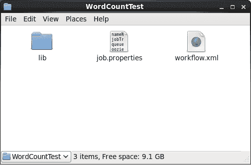

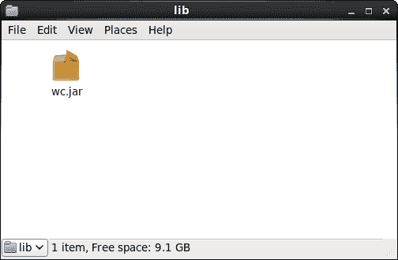

现在，让我们继续前进&创建***job . properties***&***workflow . XML***文件，我们将在其中指定作业及其相关参数。

首先，我们创建一个 *job.properties* 文件，在这里我们定义了 NameNode & ResourceManager 的路径。解析工作流目录路径需要 NameNode 路径& jobTracker 路径将有助于向 YARN 提交作业。我们需要提供 *workflow.xml* 文件的路径，该文件应该存储在 HDFS。

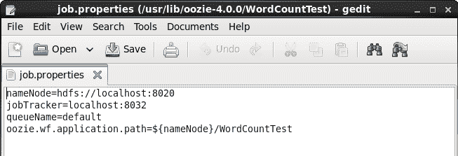

### ***workflow.xml***

接下来，我们需要创建 *workflow.xml* 文件，在这里我们将定义并执行所有的动作。首先，我们需要指定工作流应用程序的名称，即 *WorkflowRunnerTest* 。然后，我们指定**开始节点**。开始节点*(*开始到*标签 *)* 是工作流作业的入口点。它指向作业应该开始的第一个工作流节点。如下图所示，下一个节点是 ***交叉点 0*** ，作业将从这里开始。*

接下来，我们在动作节点中指定要执行的任务。我们正在执行 MapReduce WordCount 任务。我们需要指定执行这个 MapReduce 任务所需的配置。我们正在定义作业跟踪器&的 NameNode 地址。

接下来是准备好的元素，它专门用于在执行动作之前清理目录。这里我们在 HDFS 执行删除操作，删除已经创建的 *out1* 文件夹。准备标签用于在执行作业之前创建或删除文件夹。然后，我们指定 MapReduce 属性，如作业队列名称、映射器类、缩减器类、输出键类&输出值类。

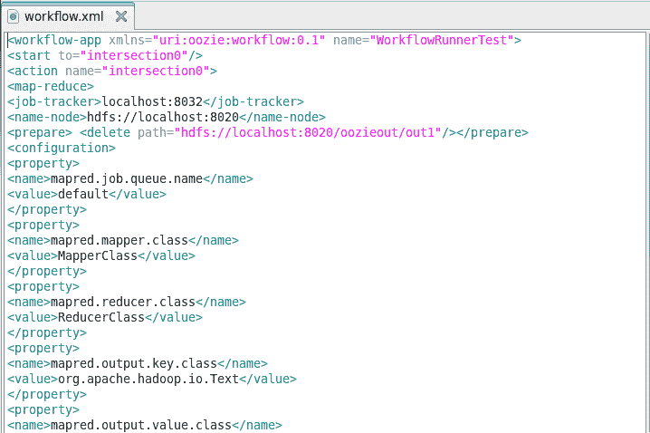

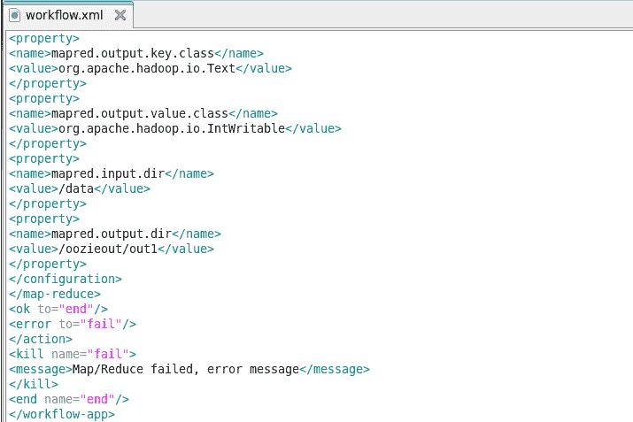

最后一个 MapReduce 任务配置是在 HDFS 输入&输出目录。输入目录是*数据*目录，存储在 NameNode *的根路径中。*最后，如果任务失败，我们将指定 kill 元素。

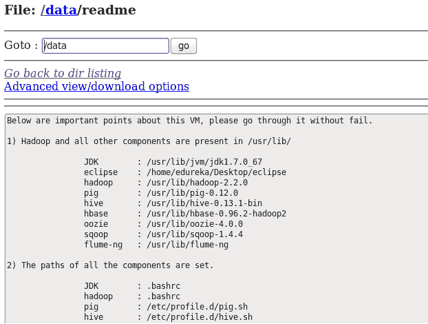

现在我们需要移动位于 HDFS 的 *WordCountTest* 文件夹，因为我们已经在 *job.properties* 文件中的*oo zie . wf . application . path*属性中指定了。因此，我们正在复制 Hadoop 根目录中的 *WordCountTest* 文件夹。

***命令:***Hadoop fs-put word count test/

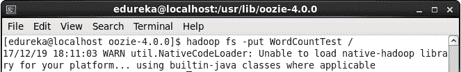

为了验证，你可以进入 NameNode Web UI，检查文件夹是否已经上传到 HDFS 根目录。

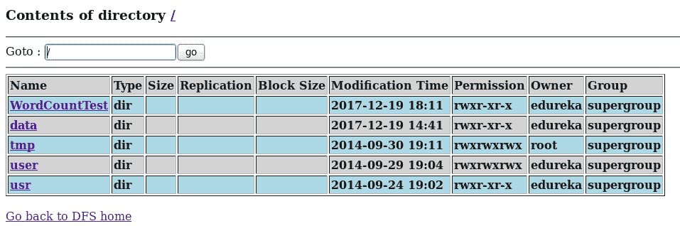

现在，我们已经准备好继续前进，执行工作流作业。

***命令:*** *oozie 作业–oo zie http://localhost:11000/oo zie-config job . properties-run*

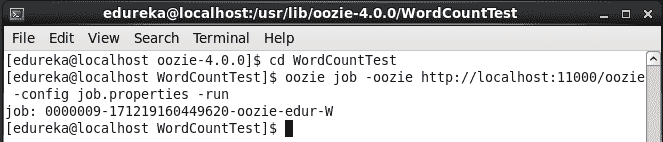

执行完任务后，我们将得到任务 id(即*0000009-171219160449620-oo zie-edur-W*)，如上图所示。您可以在 Oozie Web UI 中查看您提交的作业，即 *localhost:11000* 。您可以在下图中看到，我们提交的工作已列出。

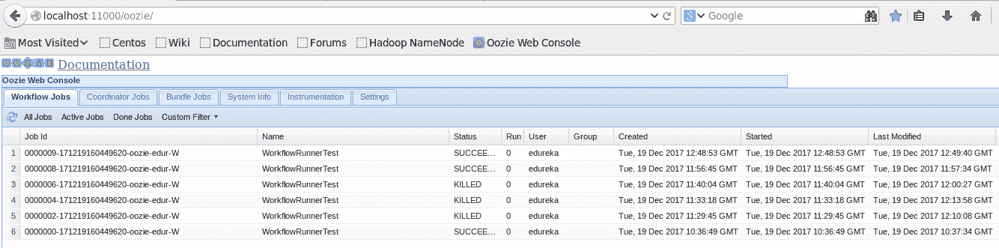

如果你仔细观察上图，你会看到作业 ID、作业名称、作业状态、提交作业的用户、创建时间、开始&最后修改。您可以点击工作获取更多详情，如:

*   工作信息

*   工作定义

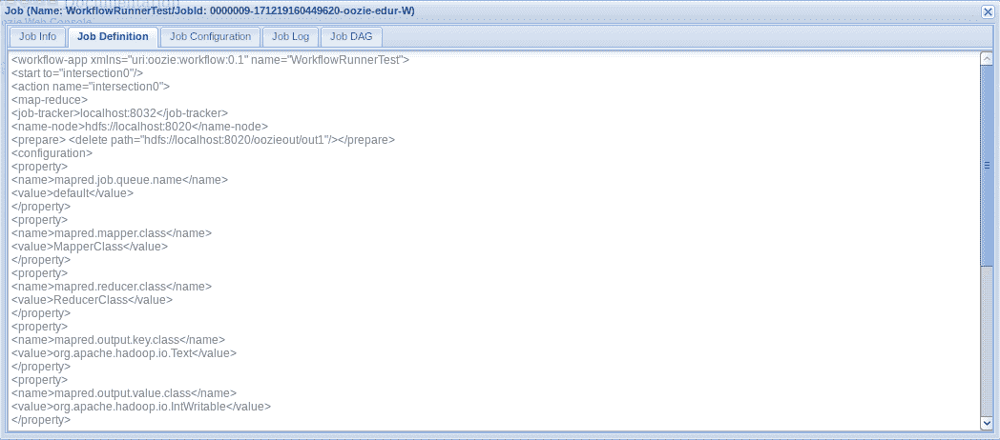

*   工作配置

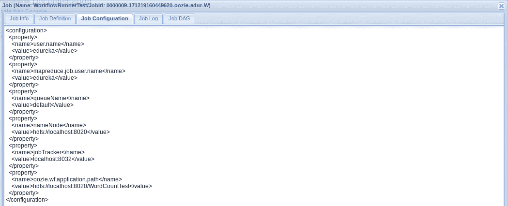

由于作业的状态是成功，所以我们需要去 HDFS 根目录，检查输出目录是否已经创建。

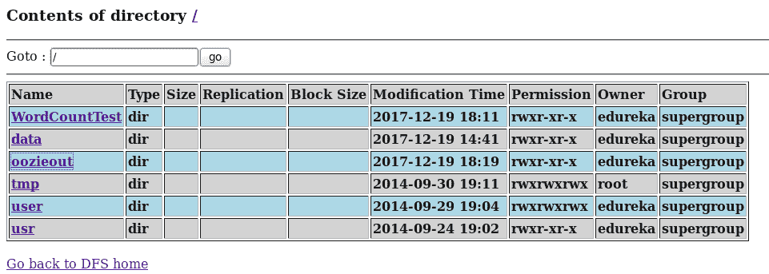

正如您所看到的，已经在 HDFS 中创建了 *oozieout* 目录，现在让我们来看看已经创建的输出文件。

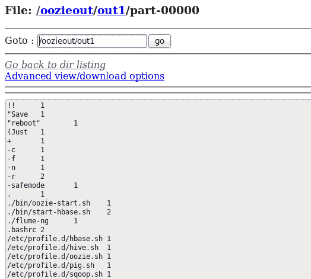

由于我们已经了解了如何创建 Oozie 工作流作业，现在我们将继续学习 Apache Oozie 教程博客，了解如何创建协调者作业。

## **Apache Oozie 教程:基于时间的字数统计协调员工作**

在本例中，我们将创建一个基于时间的字数统计协调作业，该作业将在特定的时间间隔后执行。您可以使用 Apache Oozie 创建和调度需要每天或定期执行的作业。

让我们在这个 Apache Oozie 教程中快速前进，创建一个协调员职位。这里我们将创建三个文件，即 *coordinator.properties* 、*coordinator . XML*&*workflow . XML*文件。同样，这里我们将把 w *ordcount* jar 放在 *lib* 目录中，如下图所示。

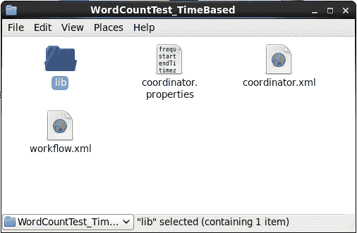

现在让我们分别看一下这些文件。首先，我们将从 coordinator.properties 文件开始。

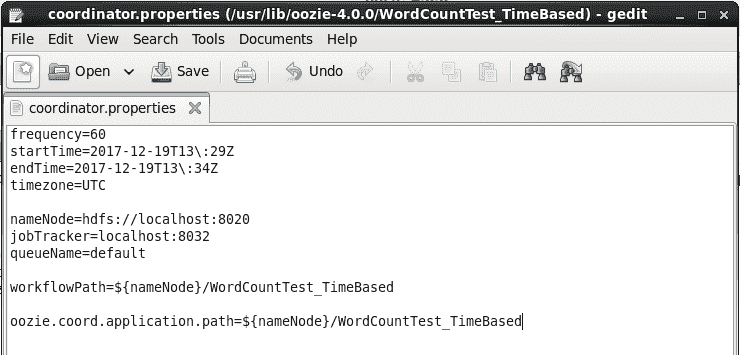

这里，我们指定了工作流的执行频率。频率总是以分钟表示。在我们的例子中，这个协调器作业将在指定时间内每小时执行一次。Frequency 用于捕获产生数据集的周期性间隔，以及协调器应用程序的运行计划。

用分钟、小时、天&月定义频率使用以下格式:

| `${coord:minutes(int n)}` | *n* | `${coord:minutes(45)}`–>`45` |
| `${coord:hours(int n)}` | *n * 60* | `${coord:hours(3)}`—>`180` |
| `${coord:days(int n)}` | *变量* | `${coord:days(2)}`–>从当前日期算起整整两天内的分钟数 |
| `${coord:months(int n)}` | *变量* | `${coord:months(1)}`–>从当前日期起一个整月内的分钟数 |

接下来，我们定义作业的开始&结束时间，如上图所示。*开始时间*是作业的开始日期时间& *结束时间*是作业的结束日期时间。

接下来，我们指定 NameNode & ResourceManager url，它将用于引用 HDFS 的 workflow.xml 文件&分别向 YARN 提交作业。最后，我们正在指定 workflow.xml 路径，它将存储在 HDFS。我们还将指定应用程序路径，所有文件都将存储在& lib 目录中。

第二个文件是 *coordinator.xml* ，我们将在这里使用我们在 *coordinator.properties* 文件中指定的所有属性。现在，首先，我们将指定协调应用程序的属性，即名称、频率&时区。接下来，我们将逐一指定工作流。在这里，我们只有一个工作流程。因此，在 action 元素中，我们将创建 workflow 元素，并在其中指定应用程序路径。

接下来，我们必须创建 *workflow.xml* 文件，我们将在其中指定任务。它类似于我们在工作流作业中创建的 *workflow.xml* 文件。

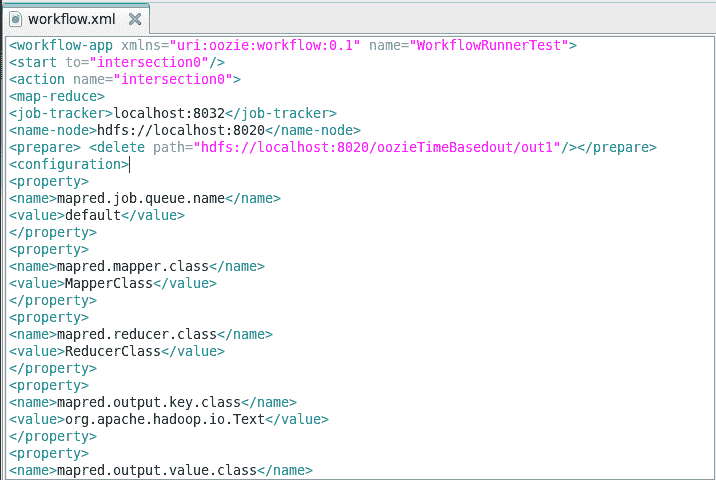

现在，我们再次将这个基于*word count test _ timedbase*的目录移动到 HDFS。

**命令**:*Hadoop fs-put word count test _ time based/*

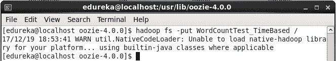

现在，我们已经准备好继续前进，执行 Oozie 教程中的协调工作。让我们继续执行它。

**命令** : *oozie 作业-oo zie http://localhost:11000/oo zie-config coordinator . properties-run*

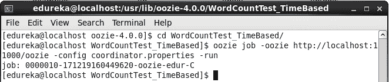

记下该协调员的工作 id(即 0000010-171219160449620-oo zie-edur-C)。它将帮助你在 Oozie Web UI 中找到你的工作。

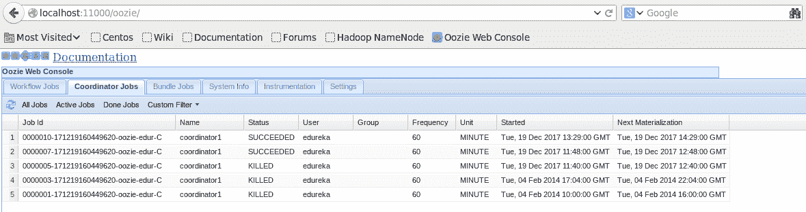

在 Oozie Web UI 中，您可以在协调员工作选项卡中看到列出的工作。类似于工作流作业，我们有作业的名称、状态、用户、频率、开始&和结束时间。当您单击某个特定作业时，将会看到该作业的详细信息，如下图所示。

*   协调员工作信息

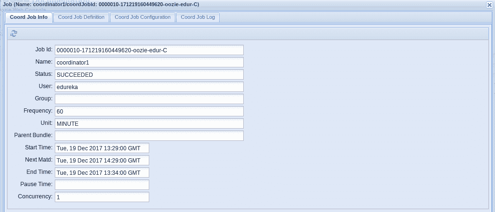

*   协调员工作定义

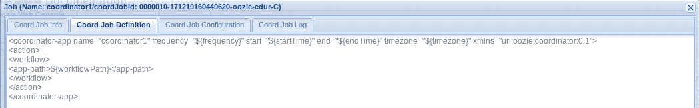

*   协调员工作配置

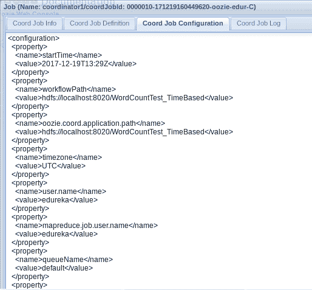

现在，我们已经浏览了不同的选项卡。我们将返回到将创建输出文件夹的 HDFS 根目录。如下图所示， *oozieTimeBasedout* 目录已经创建，正如我们在 *workflow.xml* 文件中指定的那样。

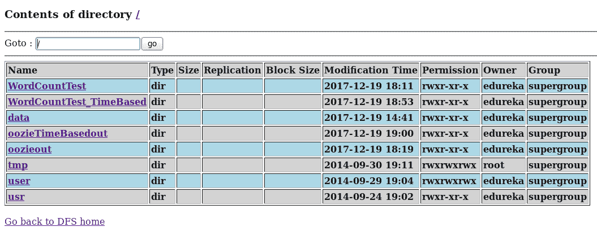

现在，让我们看看已经创建的输出文件。

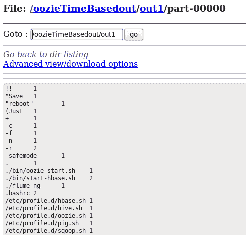

我希望你觉得这篇 Apache Oozie 教程博客内容丰富。如果您有兴趣了解更多信息，可以浏览这个 ***[Hadoop 教程系列](https://www.edureka.co/blog/hadoop-tutorial/)*** ，它告诉您大数据以及 Hadoop 如何解决与大数据相关的挑战。

*现在您已经了解了 Apache Oozie，请查看 Edureka 的 **[Hadoop 培训](https://www.edureka.co/big-data-and-hadoop)** ，edu reka 是一家值得信赖的在线学习公司，拥有遍布全球的 250，000 多名满意的学习者。Edureka 大数据 Hadoop 认证培训课程使用零售、社交媒体、航空、旅游和金融领域的实时用例，帮助学员成为 HDFS、Yarn、MapReduce、Pig、Hive、HBase、Oozie、Flume 和 Sqoop 领域的专家。*

*有问题吗？请在评论区提到它，我们将会回复您或者参加我们在艾哈迈达巴德的 [Hadoop 培训。](https://www.edureka.co/big-data-hadoop-training-certification-ahmedabad)*