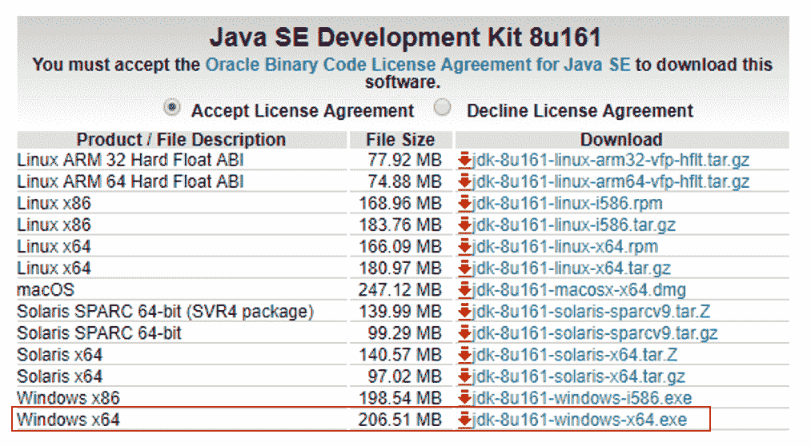
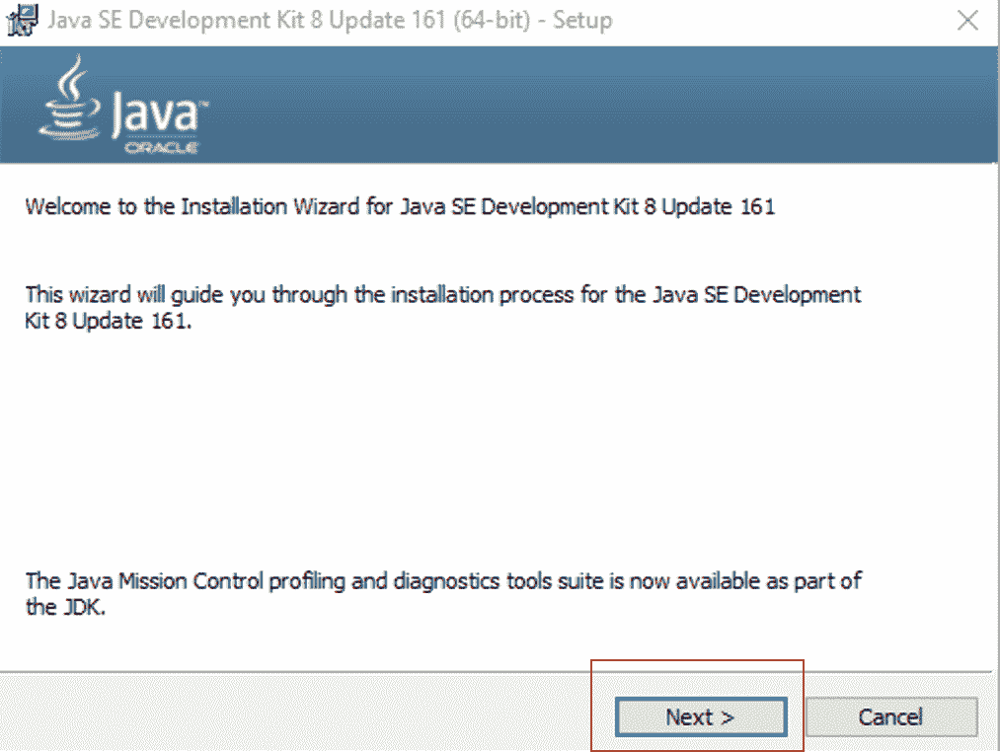
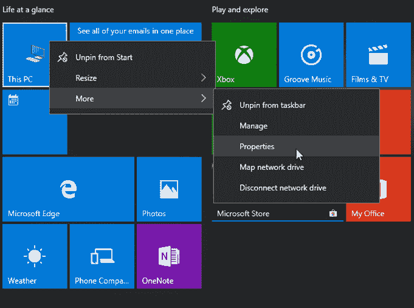
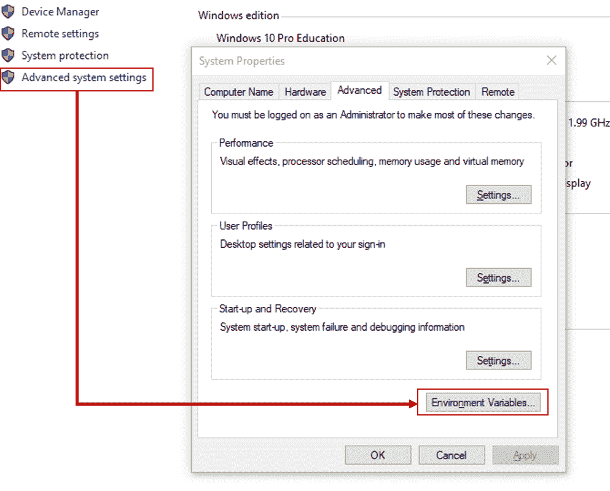
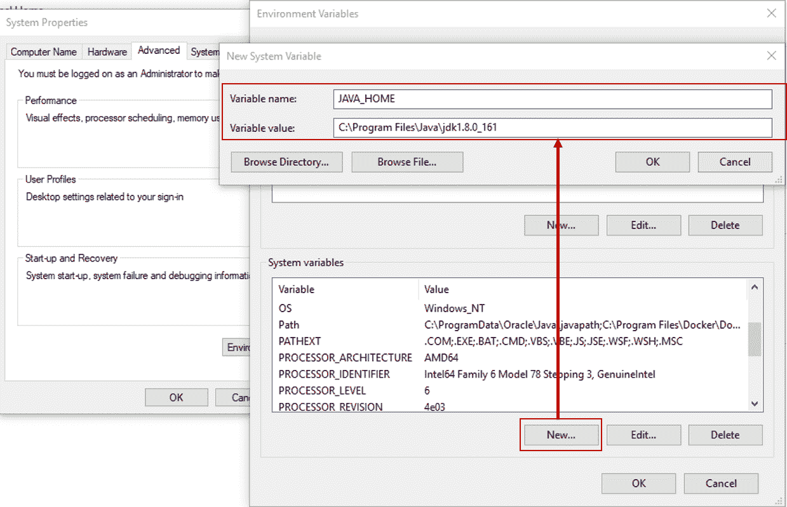
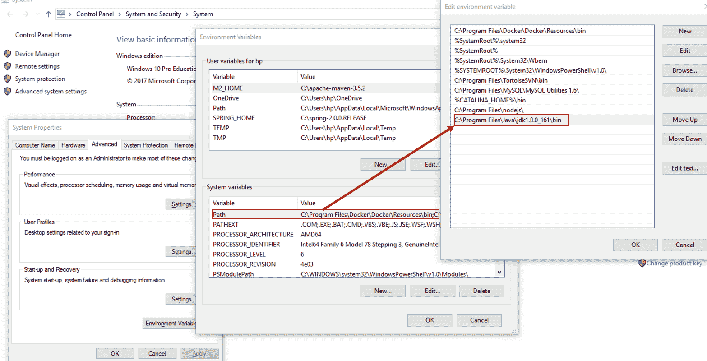
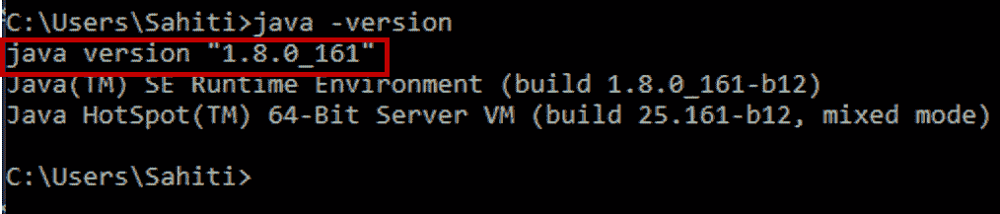
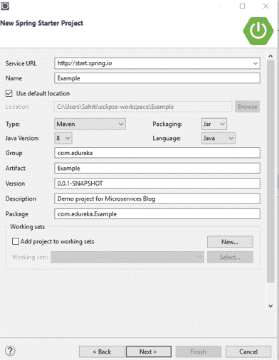
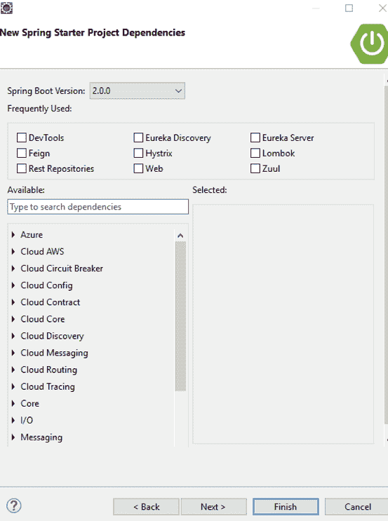
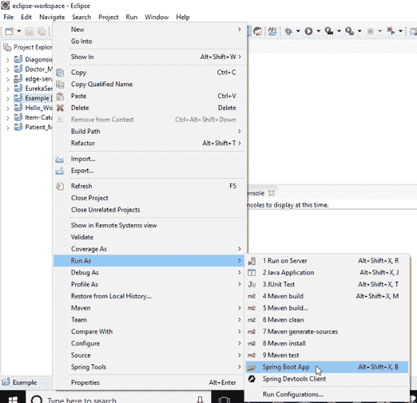

# 运行 Spring Boot 应用程序的 Spring Boot Eclipse 和 CLI 设置

> 原文：<https://www.edureka.co/blog/spring-boot-setup-helloworld-microservices-example/>

可以通过多种方式创建 Spring Boot 项目。这是 [***微服务认证***](https://www.edureka.co/microservices-architecture-training) 所要求的一个至关重要的概念，是其课程设置的一个组成部分。在这篇 **Spring Boot Eclipse 和 CLI 设置**博客中，我将探索用 Eclipse & Maven 创建 Spring Boot 项目的两种不同选择。它们如下:

*   [在 Eclipse 中安装 Spring 工具套件(STS)](#InstallSpringToolSuite(STS)inEclipse)
*   [Spring Boot CLI 设置](#RunApplicationsUsingSpringBootCLI&Maven)
*   [Spring Boot 你好天下例](#SpringBootHelloWorldExample)

在博客的最后，我还将展示一个使用 **Spring Boot** 的 **Hello World 示例**。

## **安装 Spring Boot CLI & Spring 工具套件| Hello World 示例| edu reka**

[//www.youtube.com/embed/Q6zUfJSsdP8?rel=0&showinfo=0](//www.youtube.com/embed/Q6zUfJSsdP8?rel=0&showinfo=0)

现在让我们探讨第一种选择。

## **在 Eclipse 中安装 Spring 工具套件(STS)**

**第一步:**要在 Windows 上使用 Eclipse，需要先安装 **Java 开发工具包(JDK)** 。你可以从甲骨文网站下载 JAVA。

**第二步**:接受**许可协议**，选择操作系统的可执行文件。在这里，我将下载 64 位的 Windows。请参考下面的快照。

**第三步:**下载完成后，**运行 exe 安装 JDK** 。然后点击**下一步**。请参考下面的快照。

**第四步:**安装完成后点击**关闭**。

**第五步:**现在，用 Java 设置环境变量。

**步骤 5.1:** 右键**我的电脑/这台 PC**->-**更多**->-**属性。**

**步骤 5.2:** 进入**高级系统设置**->-**环境变量。**

**步骤 5.3:** 在 Windows 环境下添加 **JAVA_HOME** 变量，并指向你的 Java JDK 文件夹。请参考下面的快照。

**步骤 5.4:** 更新**路径**变量，追加 Java bin 文件夹。请参考下面的快照。

**步骤 5.6:** 要验证是否安装了 Java，在命令提示符下键入 **java -version** 。

**第六步:**JAVA 在你的 PC 上配置好之后，你就可以下载 [**Eclipse IDE for JAVA JEE 开发者**](https://www.eclipse.org/downloads/) 并将这些文件解压到特定的文件夹中。

**第七步:**一旦你在个人电脑上安装完 Eclipse，进入**帮助**->**Eclipse market place**。将打开一个对话框，列出所有可用的软件。搜索**弹簧工具套件(STS)** 并**安装**它。

**第八步:**工具安装好后，点击**文件**->-**新建** - > **其他**。将打开一个对话框。在此，选择 Spring Boot 选项下的 **Spring Boot 启动项目**，点击**下一步**。

**第 9 步:**在打开的下一个屏幕中，为您的项目选择以下选项:

*   组 ID
*   工件 ID
*   根包
*   版本
*   描述
*   Java 版本
*   语言
*   包装

在这里，确保选择 **Maven** 作为 **Type** ，点击 **Next** 。请参考下面的快照。

**第十步:**在下一个出现的对话框中，选择您想要添加到您的 Spring Boot Eclipse 项目中的**依赖项**，并点击**完成**。参考下面的快照。

**步骤 11:** 现在，您将会看到您的 SpringBoot Eclipse 项目已经在 Eclipse IDE 的左侧创建好了。

**第十二步:**项目创建完成后，根据需要为你的应用配置类。

**第十三步:**要运行这个新创建的 Spring Boot Eclipse 项目，右键单击项目，选择 **运行为**–>**Spring Boot App**。在内部，这个方法在默认端口 8080 创建一个嵌入式 Tomcat 服务器的实例，并在其中运行应用程序。请参考下面的快照。

#### 订阅我们的 youtube 频道以获取新的更新..！