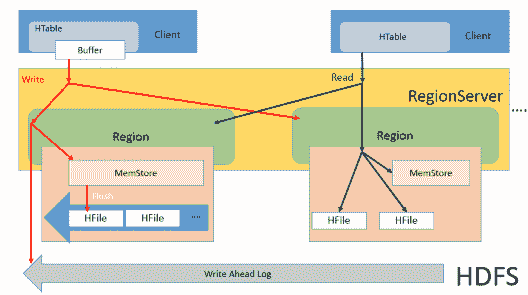

# 对 HBase 架构的见解

> 原文：<https://www.edureka.co/blog/insights-on-hbase-architecture>

在今天的帖子中，我们来讨论一下 HBase 架构。在深入研究 HBase 架构之前，让我们先复习一下 HBase 的基础知识。

## h base–基础:

HBase 是一个开源的、NoSQL 的、分布式的、非关系的、版本化的、多维的、面向列的商店，它是模仿运行在 HDFS 之上的 Google BigTable 而设计的。“NoSQL”是一个宽泛的术语，意思是数据库不是支持 SQL 作为其主要访问语言的 RDBMS。但是有许多类型的 NoSQL 数据库，Berkeley DB 是本地 NoSQL 数据库的一个很好的例子，而 HBase 是一个非常分布式的数据库。

HBase 提供了 Google BigTable 的所有特性。它始于 Powerset 的一个项目，为自然语言搜索处理大量数据。它是作为 Apache 的 Hadoop 项目的一部分开发的，运行在 HDFS (Hadoop 分布式文件系统)之上。它提供了存储大量稀疏数据的容错方式。HBase 与其说是“数据库”,不如说是“数据存储”,因为它缺少 RDBMS 中的许多功能，如类型化列、二级索引、触发器和高级查询语言等。

在面向列的数据库中，数据表存储为数据列的一部分，而不是数据行。面向列的数据库的数据模型由表名、行键、列族、列、时间戳组成。在 HBase 中创建表时，行将在行键和时间戳的帮助下被唯一标识。在这个数据模型中，列族是静态的，而列是动态的。现在让我们来看看 HBase 架构。

## **什么时候去 HBase？**

只有当有几亿或几十亿行时，HBase 才是一个好的选择。当考虑从 RDBMS 迁移到 HBase 时，HBase 也可以用于完全重新设计，而不是端口。换句话说，HBase 并没有针对经典的事务性应用甚至关系分析进行优化。在进行大批量 MapReduce 时，它也不能完全替代 HDFS。那你为什么要选择 HBase 呢？？如果您的应用程序有一个可变模式，其中每一行都略有不同，那么您应该查看 HBase。

## h 基本架构:

下图清楚地解释了 HBase 架构。

在 HBase 中，有三个主要组件: ***主机、区域服务器和动物园管理员*。**其他组件是 ***Memstore、HFile 和 WAL。***

由于 HBase 运行在 HDFS 之上，因此它采用主从架构，其中 HMaster 是主节点，而区域服务器是从节点。当客户端发送一个写请求时，HMaster 获取该请求并将其转发给相应的区域服务器。

#### **地区服务器:**

它是一个类似于数据节点的系统。当区域服务器(RS)接收到写请求时，它将该请求定向到特定区域。每个区域存储一组行。行数据可以分隔在多个列族(CFs)中。特定 CF 的数据存储在 HStore 中，h store 由 Memstore 和一组 HFiles 组成。

#### Memstore 是做什么的？

Memstore 跟踪在该特定区域服务器中执行的读写操作的所有日志。由此我们可以说，它的行为类似于 Hadoop 中的名称节点。Memstore 是内存存储，因此 Memstore 利用每个数据节点的内存存储来存储日志。当达到一定的阈值时，Memstore 数据被刷新到 HFile 中。

使用 Memstore 的主要目的是需要在按行键排序的 DFS 上存储数据。由于 HDFS 是为顺序读/写而设计的，不允许修改文件，HBase 不能有效地将收到的数据写入磁盘:写入的数据将不会被排序(当输入未被排序时)，这意味着没有为将来的检索进行优化。为了解决这个问题，HBase 将最后接收到的数据缓存在内存中(在 Memstore 中)，在刷新之前对其进行“排序”，然后使用快速顺序写入写入 HDFS。因此，HFile 包含一个已排序的行列表。

每次内存存储刷新发生时，为每个 CF 创建一个 HFile，频繁的刷新可能会创建大量的 HFile。由于在读取过程中，HBase 将不得不查看许多 HFiles，因此读取速度会受到影响。为了防止打开过多的 hfile 并避免读取性能下降，使用了 HFiles 压缩过程。HBase 会定期(当达到某些可配置的阈值时)将多个较小的 HFiles 压缩成一个较大的 HFiles。显然，Memstore 刷新创建的文件越多，系统的工作(额外负载)就越多。此外，虽然压缩过程通常与处理其他请求并行执行，并且当 HBase 无法跟上压缩 HFiles 的速度时(是的，也为此配置了阈值)，它将再次阻止 RS 上的写入。就像我们上面讨论的，这是非常不可取的。

我们不能保证数据在 Memstore 中始终是持久的。假设一个特定的 datanode 关闭了。则驻留在该数据节点内存中的数据将会丢失。

为了克服这个问题，当请求来自主机时，它也写给 WAL。WAL 只不过是驻留在 HDFS 上的*预写日志*，这是一种永久存储。现在，我们可以确保即使数据节点关闭，数据也不会丢失，也就是说，我们拥有您应该在 WAL 中执行的所有操作的副本。当数据节点启动时，它将再次执行所有活动。一旦操作完成，所有的东西都会从 Memstore 和 WAL 中被清空，并写入 HFile 中，以确保我们不会耗尽内存。

让我们举一个简单的例子，我想添加第 10 行，然后写请求进来，它说它把所有的元数据给内存和内存。一旦特定的行被写入 HFile，Memstore 和 WAL 中的所有内容都将被清空。

#### 动物园管理员:

HBase 与动物园管理员集成在一起。当我启动 HBase 时，Zoo keeper 实例也被启动。原因是动物园管理员帮助我们跟踪 HBase 的所有区域服务器。Zoo keeper 跟踪有多少区域服务器，哪些区域服务器从哪个数据节点到哪个数据节点。它跟踪 Hadoop 遗漏的较小数据集。它减少了 Hadoop 上的开销，Hadoop 跟踪大部分元数据。因此，HMaster 通过实际联系动物园管理员来获得区域服务器的详细信息。

有问题要问我们吗？在评论区提到它们，我们会给你回复。

**相关帖子:**

[大数据和 Hadoop 入门](https://www.edureka.co/big-data-and-hadoop)

[义气蜂巢](https://www.edureka.co/blog/hive-commands-with-examples "Hive Commands")

[关于 Hadoop 你需要知道的一切](https://www.edureka.co/blog/hadoop-tutorial/)