# ServiceNow 教程:ServiceNow 入门

> 原文：<https://www.edureka.co/blog/servicenow-tutorial>

自动化、直观的消费者体验、机器学习和互联设备的爆炸式增长正在颠覆和改变每个行业。现在，为了跟上步伐，企业需要更快地前进，但是过时的模式会减慢它的速度。其他因素，如 IT 事故、客户请求、人力资源案例都遵循其路径，并增加了这一缓慢的过程。那么企业如何克服这些问题呢？有没有一种方法来构建和自动化这些流程，以加快工作速度？有了 ServiceNow，是的，企业一定可以实现这个目标。在这篇 ServiceNow 教程博客中，我将带您了解这个云平台的细节，所以请继续阅读以了解更多信息。

在这篇 ServiceNow 教程博客中，我将涉及以下主题:

1.  [为什么 ServiceNow 及其需要](#WhyServiceNowAndItsNeed)
2.  [什么是 ServiceNow？](#WhatIsServiceNow)

4.  [ServiceNow Demo](#ServiceNowDemo)

因此，让我们不要浪费任何时间，开始这篇 ServiceNow 教程博客吧。

## **为什么 ServiceNow 及其需要**

通过 ServiceNow 行动系统，您可以用未来的智能工作流程取代过去的非结构化工作模式。企业中或与 it 相关的每个员工、客户和机器都可以在单个云平台上发出请求。处理这些请求的所有部门都可以分配任务并确定优先级、协作、着手解决根本原因问题、获得实时见解并采取行动。这将有助于员工更好地工作，最终提高服务水平。ServiceNow 将帮助您以光速工作，让您的工作流程更智能、更快速。

ServiceNow 为整个企业提供云服务。让我们看看为什么 ServiceNow 对企业如此重要的几个原因:

**IT:** ServiceNow 通过将传统工具整合到一个现代化的、易于使用的云中服务管理解决方案，帮助提高灵活性并降低成本。

**安全选项:**安全部门可以与 IT 部门合作，更快地解决真正的威胁。为此，它使用结构化响应引擎来根据服务影响确定事件的优先级并解决事件。

**客户服务:**客户服务可以通过实时评估产品服务状况和跨部门合作来快速解决服务问题，从而减少案例数量，提高客户忠诚度。

**人力资源:**人力资源可以通过自助服务门户将员工服务体验消费化，并获得持续改进服务交付所需的洞察力。

**构建业务应用:** ServiceNow 帮助任何部门快速构建业务应用并实现流程自动化——使用可重用组件帮助加速创新。

**Now 平台:**Now 平台为企业提供了一个行动系统。使用单一数据模型，可以轻松创建上下文相关的工作流并自动化任何业务流程。从商业用户到专业开发人员，任何人都可以轻而易举地构建应用程序。Now 平台上的任何应用用户都可以通过服务目录提出请求，在常用知识库中查找信息，并被通知他们最关心的动作和信息。部门、工作组甚至设备都可以进行分配、优先排序、协作、找到问题的根源，并且 可以智能地协调行动。现在，您的业务发展更快了。

**不间断云:**service now 不间断云始终开启。没有客户实例会因为任何原因而离线或关闭。独特的多实例架构确保每个客户都可以完全定制云服务，并按照自己的计划执行升级。Nonstop Cloud 高度安全，符合最高级别的合规性和全球法规。行业领先的高级高可用性基础架构确保了每个地理位置的两个数据中心集群之间的实例冗余，可扩展以满足最大的全球企业的需求。

既然我们已经了解了为什么需要 ServiceNow，让我们继续这篇 ServiceNow 教程博客，了解什么是 ServiceNow:

## **什么是 ServiceNow？**

ServiceNow 是一个软件平台，支持 IT 服务管理和常见业务流程的自动化。它包含许多模块化应用程序，这些应用程序会因实例和用户而异。它是由软件公司如百富勤系统公司和补救公司的前首席技术官弗雷德·乐迪于 2004 年创立的。ServiceNow 是一个集成的**云**解决方案，它在一个单一的记录系统中结合了五个主要的服务。

ServiceNow 从提供服务目录管理的 IT 服务管理应用程序开始了它的旅程。后来，当事件、问题或变更的规模更大时，其他项目管理应用程序随之出现，帮助管理整个项目。它并没有就此停止，很快，配置管理数据库(CMDB)就进入了应用程序列表。如今，ServiceNow 拥有面向 IT 服务管理流程和 IT 企业的应用，如人力资源管理、安全管理和 PPM 等。

以下特点使 ServiceNow 优于其竞争对手:

*   基于实例的实现
*   易于定制
*   更好的支持和更低的维护成本
*   实时分析和报告

接下来，在这篇 ServiceNow 教程博客中，我们将深入了解 ServiceNow 功能的本质:

### **认证**

单点登录(SSO)功能是任何工具的精髓，ServiceNow 也不例外。该工具具有多种提供者 SSO 功能。一个组织可以使用多个 SSO IDPs(身份提供商)来管理身份认证。 *SSO* 使用户无需提供任何用户 ID 或密码即可登录应用程序。它使用 Windows ID 和密码。

### 

公司可以出于各种目的使用活动目录。无论是提供对应用程序的访问还是维护 Outlook 通讯组列表；有很多。LDAP 集成对于 ServiceNow 工具来说是小菜一碟，最棒的是您不必编写任何代码。一切都是简单的配置！

ServiceNow 提供了在远程服务器上编排或自动化简单或复杂任务的能力。一旦在任何 IT 公司中实现了编排，整个工作就需要更少的技能和劳动力。它可以自动化 VMware、Microsoft Exchange 邮件服务器等系统。

###  **网络服务**

平台同时提供发布或消费 API 的能力。SOAP、WSDL 或 REST API 是支持的协议。您可以创建无代码 API，也可以创建脚本 API。

### **企业门户**

对于任何组织来说，最重要的要求之一就是拥有一个门户网站，用户可以在这里请求访问、服务或支持。服务门户正在给不同的组织插上翅膀。 如今，企业正在开发他们的 ServicePortal 来展示他们的 ServiceNow 功能。ServicePortal 还取代了过时的 CMS 网站，这是旧版本的门户网站，但功能不如 ServicePortal。

### **移动就绪**

今天，大多数人都希望企业应用/服务/解决方案支持移动。他们需要随时随地做出改变的能力。 ServiceNow 让这一切成为可能。 ServiceNow 的表单和应用程序都是手机友好的，可以直接发布到手机上，不需要专门为手机开发。ServiceNow 为移动设备提供基于网络的应用程序，并为 iOS 和 Android 提供移动原生应用程序。

这是关于 ServiceNow 及其功能。接下来，在本 ServiceNow 教程中，让我们看看这将有助于我们的另一个重要概念。

## **ServiceNow 教程:导入集演示**

**导入集**是另一个重要概念。虽然很简单，但对于 ServicNow 的顺利运行却是非常重要和不可或缺的。

**导入集**允许管理员从各种数据源导入数据，然后将这些数据映射到 ServiceNow 表中。导入集完成后，您可以查看已完成的导入并清理导入集表格。查看导入日志在导入日志中，您可以找到有关导入过程中发生的内部处理的信息。

让我们试着实际地做这件事。我将导入一个“sample.xlsx”数据集，然后将该数据集映射到 ServiceNow 表。你可以在这里下载数据集 ***[。](https://goo.gl/iec4Te)*** 您将需要一个 ServiceNow 实例来在您的系统上执行此演示。对 ServiceNow 完全陌生的人可以参考这篇 **[*博客*](https://www.edureka.co/blog/what-is-servicenow/)** ，它深入讨论了创建实例的问题。我想你们现在都有一个 ServiceNow 实例了。因此，让我们继续本 ServiceNow 教程的最后一部分。

在系统导入器械包模块下，搜索**导入器械包**，选择**加载数据**。选择您想要导入的文件(在本例中是上面链接中共享的“sample.xlsx ”),然后点击**提交**

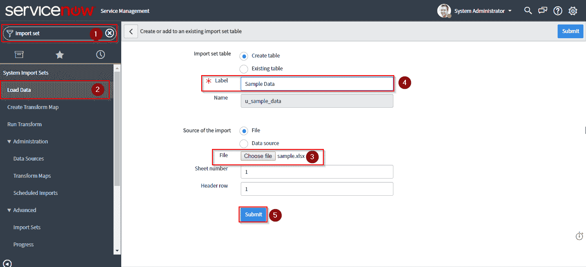

点击**加载数据**查看导入的数据

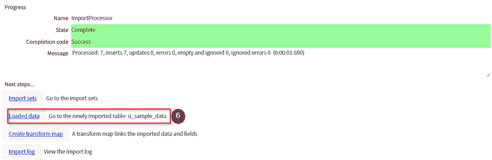

这是导入的数据集的样子。您可以点击设置符号，根据自己的需要对表格栏进行个性化设置。

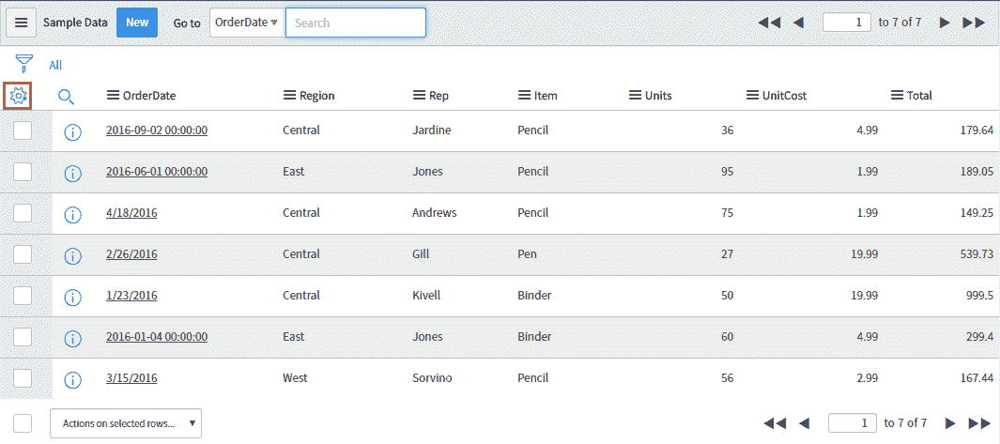

下一步是创建一个导入集合表。

让我们为导入设置创建一个目标表，为此转到**过滤导航器**并键入系统定义，点击**表**，然后点击**新建**

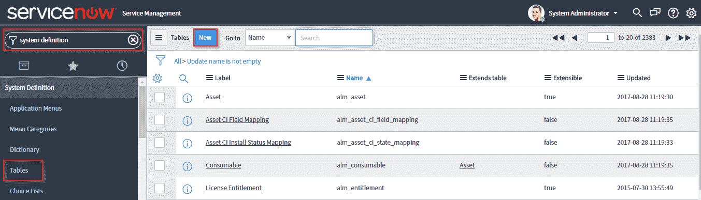

我已经将该标签表命名为**样表。**接下来点击**列**字段，将列名添加到表格中。

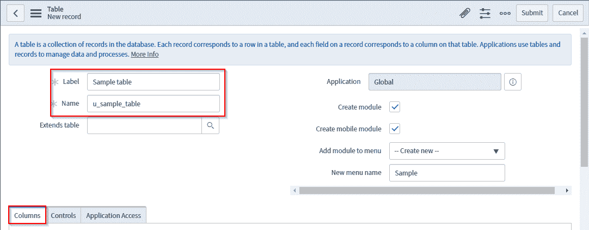

我已经将列名添加到我想要映射的表中。完成后，点击**提交。**

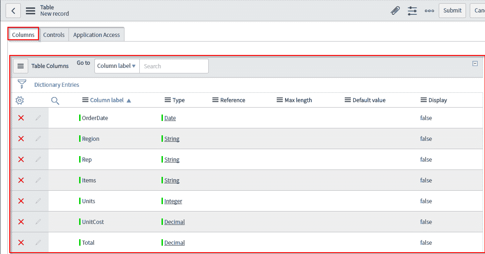

您的表格已创建。然而，它仍然没有记录。这就是记录字段现在的样子。如果你在**过滤导航器中搜索。**

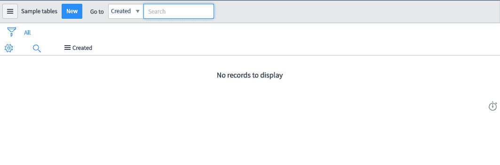

接下来，让我们加载导入的数据集。遵循下图中提到的步骤。

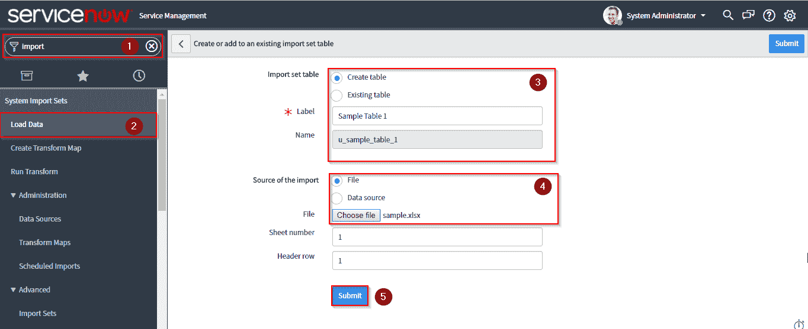

数据加载后，状态字段显示**完成**。您可以点击**加载的数据**标签查看

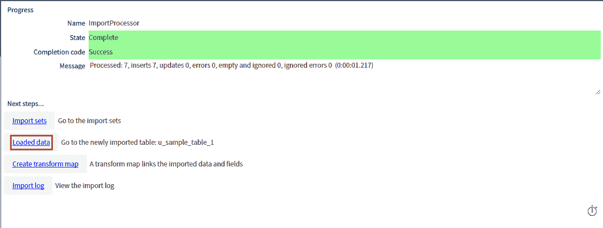

这是数据的样子。

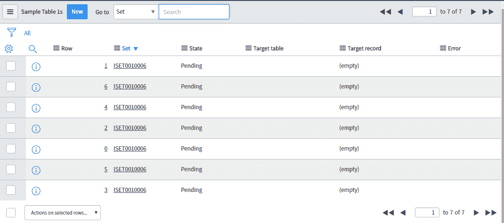

为了简单起见，让我们对列列表进行个性化设置

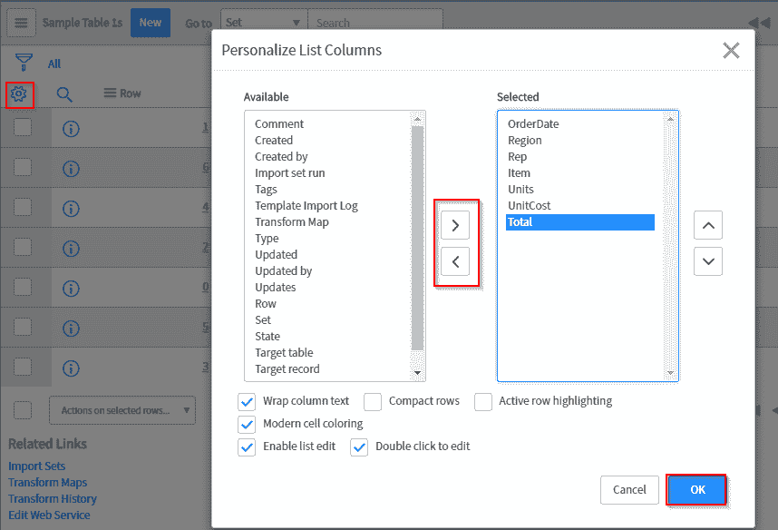

下图显示了我们导入的数据的个性化视图

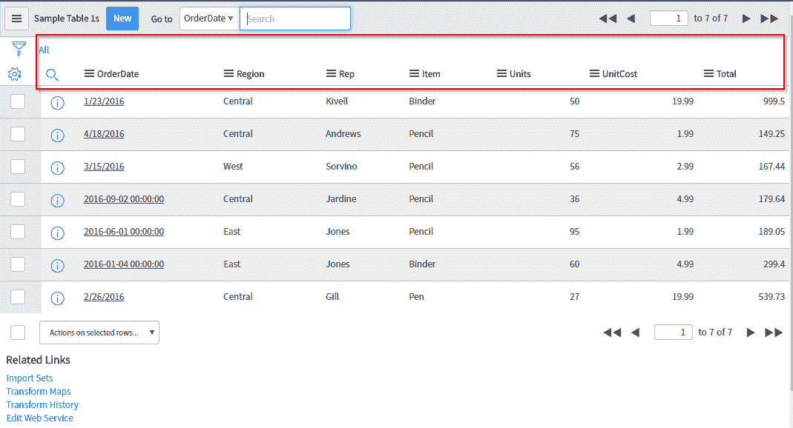

### **ServiceNow 教程:变换地图**

返回上一页，点击创建变换图

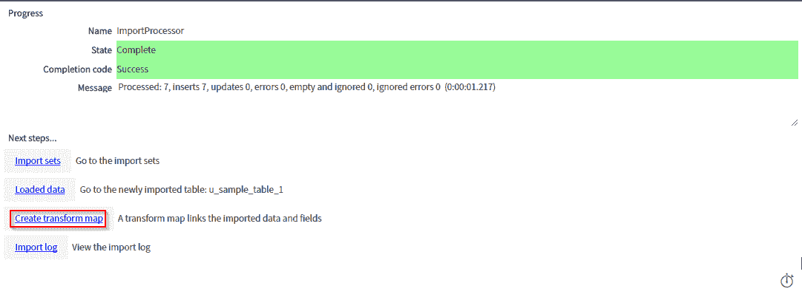

提供**名称**，选择**源表**和**目标表**进行映射。点击**映射助手**映射字段。您也可以通过点击**自动映射匹配字段** 来自动映射字段

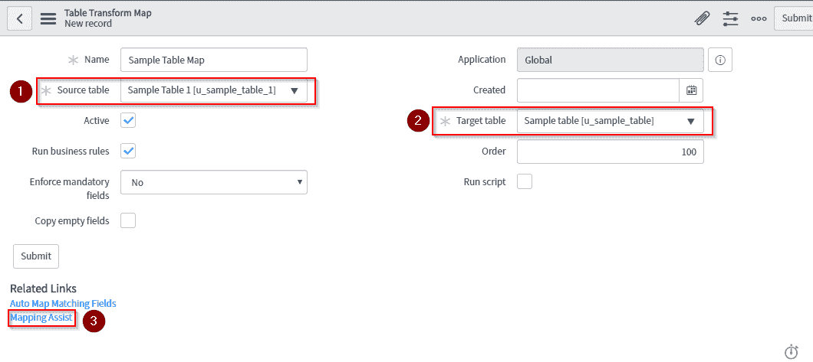

点击映射助手后，源表和目标表均可用于手动映射您想要的字段。

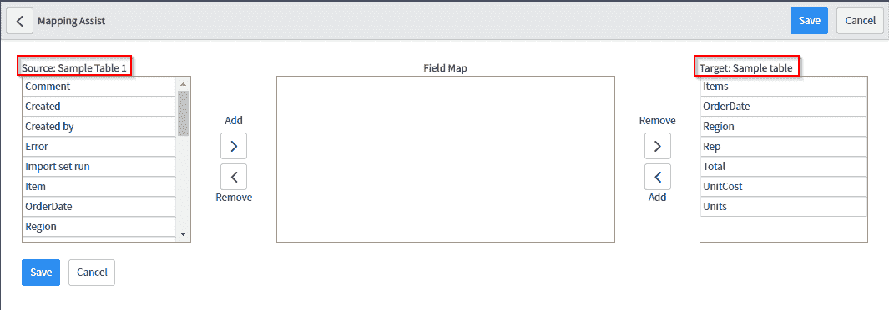

让我们继续绘制如下图所示的字段，并点击**保存**

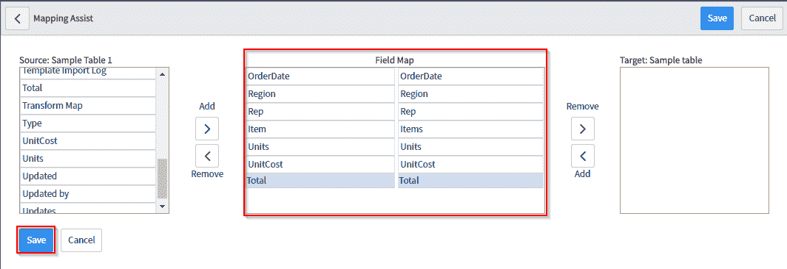

保存进度后，点击以下两步中的转换

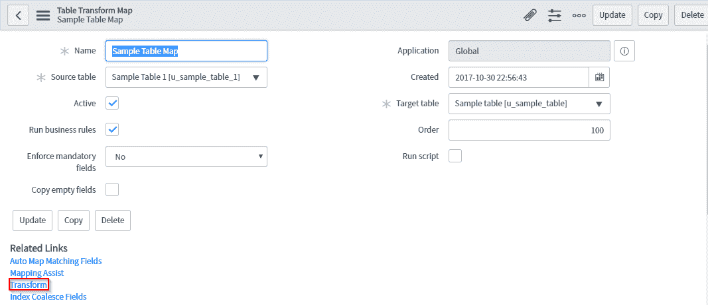

再次点击变换确认

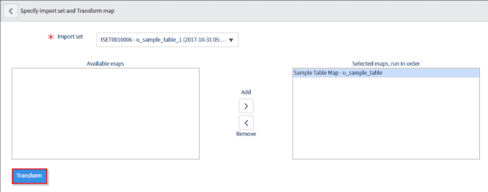

状态字段具有值**完成，**指示转换完成

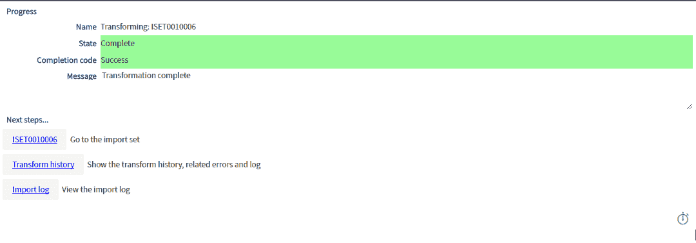

您可以在**过滤导航器**中输入表的名称(在本例中为“样本表”)，以查看所需的字段和记录。下图显示了同样的情况。因此，我们成功地导入了数据集，并将其映射到 ServiceNow 中的一个表中

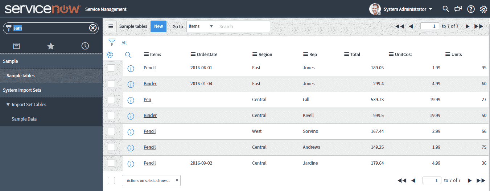这就把我们带到了 *** ServiceNow 教程*** 博客的结尾。希望这是信息和帮助你。快乐学习！！

*有问题吗？请在评论区提到它，我们会给你回复。*