# 如何实现 Python 库

> 原文：<https://www.edureka.co/blog/learn-python-for-data-science/>

对于数据分析领域的专业人员来说，Python 是一项必须学习的技能。随着 IT 行业的发展，对熟练的数据科学家[和](https://youtu.be/M3m52htoNns)的需求越来越大，Python 已经发展成为数据驱动开发的最受欢迎的编程语言。通过本文，您将学习基础知识，如何分析数据，然后使用 Python 创建一些漂亮的可视化效果。

在我们开始之前，让我先列出我将在这篇文章中涉及的主题。

*   [什么是数据科学？](#whatisdatascience)
*   [为什么是 Python？](#why)
*   [数据科学家乔布斯](#jobs)
*   [数据科学家工资趋势](#salary)
*   [数据科学的公司趋势](#company)
*   [Python 基础知识](#basics)
    *   [加载数据](#load)
    *   [清理数据](#clean)
    *   [可视化](#visual)
*   [数据科学中使用的 Python 库](#lib)
    *   [Numpy](#numpy)
    *   熊猫
    *   [Matplotlib](#matplotlib)
    *   [Seaborn](#seaborn)
    *   [Scikit-Learn](#scikit)
*   [主数据科学–用例](#usecase)
    *   [使用国际足联数据集评选最佳球队](#fifa)
    *   [个股预测](#singlestock)

你可以浏览 Python 库的视频讲座，我们的专家正在讨论每一个&技术的细节。

## 


[https://www.youtube.com/embed/LepMvJdr2-w](https://www.youtube.com/embed/LepMvJdr2-w)*This Edureka video on ‘Python Libraries’ will help you understand how we can use python along with various use cases.*

## **什么是数据科学？**

数据科学已经成为技术专业人员非常有前途的职业道路。数据科学最真实的本质在于解决问题的能力，以提供由数据驱动的见解和解决方案。当谈到数据科学时，有很多误解，数据科学生命周期是获得更清晰的视角来理解数据科学到底是什么的一种方式。

**数据科学生命周期**

## **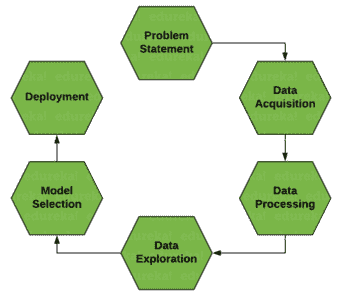**

数据科学考虑了从理解业务需求开始到为模型构建准备数据并最终部署洞察力的整个过程。整个过程由不同的专业人员负责，包括[数据分析师](https://www.edureka.co/blog/data-analyst-roles-and-responsibilities/)、数据工程师和[数据科学家](https://www.edureka.co/blog/how-to-become-a-data-scientist/)。这个角色取决于公司的规模，有时所有的流程都由一个专业人员完成。让我们试着理解为什么 python 是数据科学的合适编程语言。

## **为什么是 Python？**

毫无疑问，Python 是最适合数据科学家的语言。我列出了几个要点来帮助你理解为什么人们会选择 Python:

*   Python 是一种自由、灵活、强大的开源语言
*   Python 以其简单易读的语法将开发时间缩短了一半
*   使用 Python，您可以执行数据操作、分析和可视化
*   Python 为机器学习应用和其他科学计算提供了强大的库

**了解我们在顶级城市开设的数据科学与 Python 课程**

| 印度 | 美国 | 其他热门城市 |
| [海得拉巴的数据科学与 Python 培训](https://www.edureka.co/data-science-python-certification-course-hyderabad) | [达拉斯的数据科学与 Python 课程](https://www.edureka.co/data-science-python-certification-course-dallas) | [德里的数据科学与 Python 课程](https://www.edureka.co/data-science-python-certification-course-delhi) |
| [班加罗尔的数据科学与 Python 培训](https://www.edureka.co/data-science-python-certification-course-bangalore) | [夏洛特的 Python 数据科学](https://www.edureka.co/data-science-python-certification-course-charlotte) | [孟买的数据科学与 Python 课程](https://www.edureka.co/data-science-python-certification-course-mumbai) |
| [钦奈的数据科学与 Python 培训](https://www.edureka.co/data-science-python-certification-course-chennai) | [纽约的数据科学与 Python 课程](https://www.edureka.co/data-science-python-certification-course-new-york-city) | [用 Python 进行数据科学西雅图](https://www.edureka.co/data-science-python-certification-course-seattle) |

## **数据科学家乔布斯**

数据科学家是目前市场上最热门的职位，仅在 2020 年就有超过 250，000 到 170 万个职位空缺，这对任何学习数据科学的专业人士来说都是非常有前途的。

与任何其他职位空缺相比，数据科学家职位概况在任何门户网站上多保留 5 天。

据消息人士称，未来看起来也很有希望，数据科学就业市场将大幅增长，预计到 2025 年将进一步增加 50 万到 1100 万个工作岗位。

随着数据流量的不断增加，很明显，数据市场正在蓬勃发展。它将对几乎所有地方产生影响，因此范围不仅仅与特定的领域相关。数据科学是任何组织、企业等不可或缺的一部分。

## **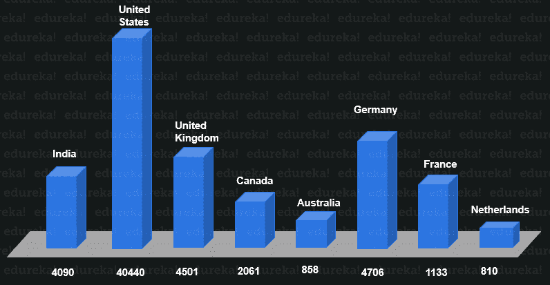**

让我们来看看与数据科学相关的工作档案在市场上获得的辛勤劳动的成果。

## **数据科学薪资趋势**

数据科学就业市场充满了工作简介，因此为了让您有一个更清晰的视角，这里是市场上数据科学相关工作的前 3 个工作简介，以及它们在美国和印度的平均工资。

## **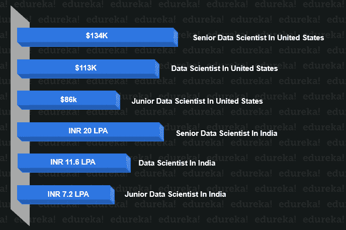**

让我们来看看围绕数据科学就业市场的公司趋势。

## **数据科学的公司趋势**

数据科学是任何组织、企业等不可或缺的一部分。市场上的一些主要参与者已经列出来了，但我们必须清楚，这些只是更大的冰山一角。世界上流动的数据量几乎让每个组织都为数据驱动的开发对业务的影响而紧张。因此，即使是较小的企业也在数据科学市场蓬勃发展，并在行业中留下了自己的印记。

## ****

让我们来看看掌握数据科学必须掌握的基础知识。

## **Python 基础知识**

现在是你接触 [Python 编程](https://www.edureka.co/blog/python-programming-language)的时候了。但为此，您应该对以下主题有一个基本的了解:

*   [**变量** :](https://www.edureka.co/blog/variables-and-data-types-in-python/) 变量是指用来存储值的预留内存位置。在 Python 中，在使用变量之前不需要声明变量，甚至不需要声明变量的类型。
*   [**数据类型** :](https://www.edureka.co/blog/collections-in-python/) Python 支持众多的数据类型，定义了对变量可能的操作和存储方式。数据类型列表包括–数字、列表、字符串、元组、集合和字典。
*   [**运算符** :](https://www.edureka.co/blog/operators-in-python/) 运算符有助于操纵操作数的值。Python 中的运算符列表包括算术、比较、赋值、逻辑、按位、成员和标识。
*   [**条件语句** :](https://www.edureka.co/blog/if-else-in-python/) 条件语句帮助执行一组基于条件的语句。即有三个条件语句——If、Elif 和 Else。
*   [**循环** :](https://www.edureka.co/blog/loops-in-python/) 循环用于迭代小段代码。有三种类型的循环，即 While、for 和嵌套循环。
*   [**函数** :](https://www.edureka.co/blog/python-functions) 函数用于将你的代码分成有用的块，让你对代码进行排序，使其更具可读性，重用它&节省一些时间。

更多信息和实际实现，可以参考本博客: [**Python 教程**](https://www.edureka.co/blog/python-tutorial/) 。

### **加载数据**

首先，第一步是将数据加载到程序中。我们可以通过使用 Python panda 库中的 read_csv()来做到这一点。

```
import pandas as pd
data = pd.read_csv("file_name.csv")

```

将数据加载到您的程序后，您可以浏览这些数据。

### **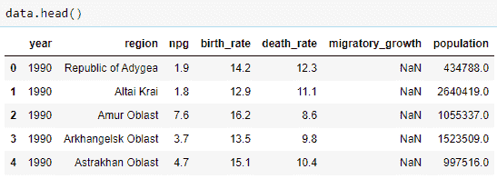**

### **清理数据**

下一步是通过做一些数据探索来寻找数据中的不规则性。这个阶段涉及找出空值并用其他值替换它们，或者完全删除该行。

```
data.describe()

```

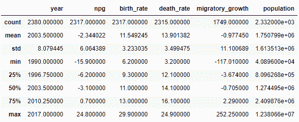

```
#to check for null values
data.isnull().sum()
#drop the null values
df = data.dropna()
#checking again to be double sure
df.isnull().sum()

```

### **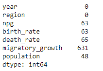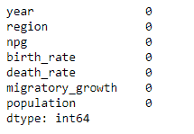**

### **可视化**

完成清理后，我们可以继续进行一些可视化工作，以了解数据集各个方面之间的关系。

```
sns.scatterplot(x=df["npg"], y=df["birth_rate"])

```

## **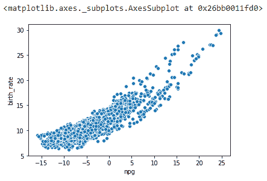**

根据我们的分析，我们可以得出结论，并对问题和数据驱动的洞察力提供见解。

## **数据科学中使用的 Python 库**

这是 Python 真正强大之处。 Python 附带了许多用于科学计算、分析、可视化等的库。其中一些列举如下:

### **Numpy**

[NumPy](https://www.edureka.co/blog/python-numpy-tutorial/) 是 Python 的核心库，代表“数值 Python”。用于科学计算，包含强大的 n 维数组对象，提供集成 C，C++等的工具。它还可以用作通用数据的多维容器，在其中可以执行各种数字 [操作](https://www.edureka.co/blog/python-numpy-tutorial/#NumpyOperations) 和特殊 [功能](https://www.edureka.co/blog/python-numpy-tutorial/#SpecialFunctions) 。

### 熊猫

[Pandas](https://www.edureka.co/blog/python-pandas-tutorial/) 是 Python 中一个重要的库。它用于数据操作和分析。非常适合不同的数据，如表格、有序和无序、T5【时间序列】 、矩阵数据等。

### **MatplotLib**

Matplotlib 是 Python 中一个强大的可视化库。它可以用在 Python 脚本、shell、web 应用服务器和其他 GUI 工具包中。您可以使用不同类型的 [图](https://www.edureka.co/blog/python-matplotlib-tutorial/#types) 以及 [多个图](https://www.edureka.co/blog/python-matplotlib-tutorial/#multiplePlots) 如何使用 Matplotlib 工作。

### **Seaborn**

[Seaborn](https://www.edureka.co/blog/python-seaborn-tutorial/) 是 Python 中的一个统计绘图库。所以无论何时你使用 Python，你都会使用(用于 2D 可视化)和 Seaborn，它们有漂亮的默认样式和高级接口来绘制统计图形。

### **Scikit-Learn**

[Scikit learn](https://www.edureka.co/blog/scikit-learn-machine-learning/) 是主要的吸引力之一，在这里你可以使用 Python 实现机器学习。这是一个免费的库，包含用于数据分析和挖掘目的的简单有效的工具。您可以使用 scikit-learn 实现各种算法，如 [逻辑回归、](https://youtu.be/VCJdg7YBbAQ) [时间序列算法](https://youtu.be/e8Yw4alG16Q) 。建议您在继续之前，在 [Scikit-learn](https://youtu.be/bwZ3Qiuj3i8) 上浏览本教程视频，了解机器学习和各种技术。

## **掌握数据科学和用例**

让我们借助几个例子继续学习。这些示例是由问题陈述驱动的，我们将根据数据科学生命周期流程得出我们的结论。

**问题陈述一**

### **使用国际足联数据集评选最佳球队**

我们有一个由不同球员组成的数据集，包括他们的技能、国籍、俱乐部等统计数据。我们的目标是为某个特定的团队组建一个在所有球员中最好的团队。

所以我们的方法是在不同的位置寻找最好的球员。我们将要建立的阵型是 4-3-3。因此，我们要寻找的位置是——(' LCB '，' CB '，' CB '，' RCB '，' LCM '，' RCM '，' CDM '，' LW '，' RW '，' ST ')

为了打造最好的团队，我们将遵循以下步骤。

1.  加载数据集
2.  清理数据集
3.  探索数据
4.  形象化
5.  结论

**加载数据集**

```
import pandas as pd
import numpy as np
import seaborn as sns
import matplotlib.pyplot as plt

data = pd.read_csv(r"C:UsersWaseemDesktopdatasetsfifa-20-complete-player-datasetplayers_20.csv")

fifa = pd.DataFrame(data, columns=['short_name', 'age', 'height_cm', 'nationality', 'club', 'weight_kg', 'overall', 'potential','team_position',
           'team_jersey_number'])

fifa.head()

```

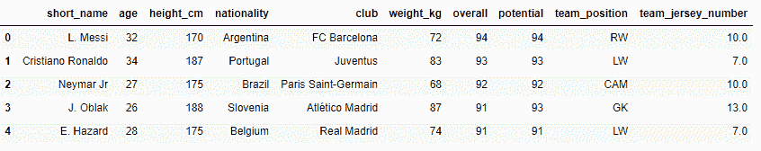

我们制作了一个单独的数据框，其中仅包含我们得出结论所需的列。整体和潜力将是一个非常重要的约束，以决定任何位置的最佳球员。

**清理数据**

我们将从空值中清除数据集。

```
fifa.isnull().sum()
fifa = fifa.dropna()

```

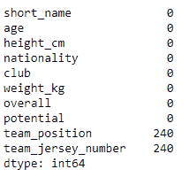

大多数空值都在团队位置和团队球衣列中，对于我们的问题陈述，团队位置是驱动因素，因此我们将只删除那些空值。

**探索数据**

我们可以探索这些数据，以获得关于这些数据的一些见解。

```
top = fifa.short_name[(fifa.overall > 88) & (fifa.potential >89 )]
print(top)

```

上面的代码给出了总积分超过 88，潜力超过 89 的玩家的名字。

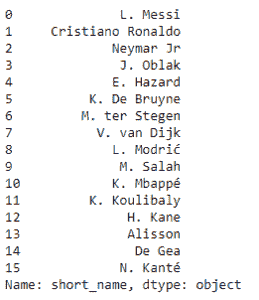

现在，我们将继续进行一些可视化操作，以理解数据集中各列之间的关系。

**可视化**

```

sns.catplot(x='team_position', kind='count', data=fifa, height=5, aspect=3)

```

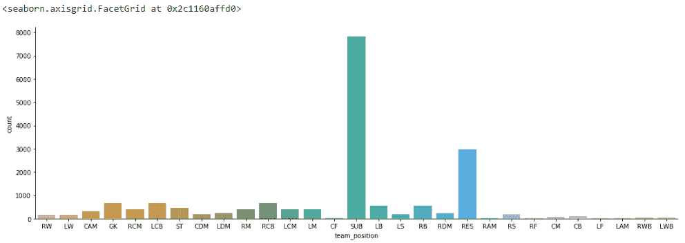

```

sns.catplot(x='overall', kind='count', data=fifa, height= 5, aspect= 3)

```

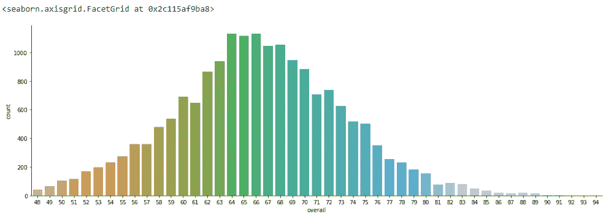

```

sns.catplot(x='club', y='overall',kind='box', data=fifa[0:20], height= 5, aspect= 3)

```

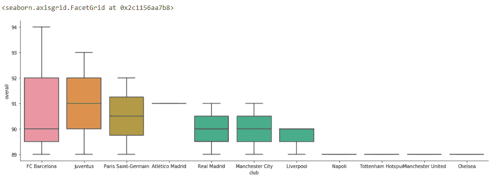

从上面的图像中，我们可以算出玩家的总体分布。俱乐部中的球员数量和球队位置及其数量。这对于我们的问题陈述来说就足够了。

基于此，我们将为各种球队位置找到最佳球员。

**LW 位置最佳球员**

```
plt.figure(figsize=(15,6))
sd = fifa[(fifa['team_position'] == 'LW')].sort_values('overall', ascending=False)[:5]
x2 = np.array(list(sd['short_name']))
y2 = np.array(list(sd['overall']))
sns.barplot(x2, y2, palette=sns.color_palette("Blues_d"))
plt.ylabel("LW Score")

```

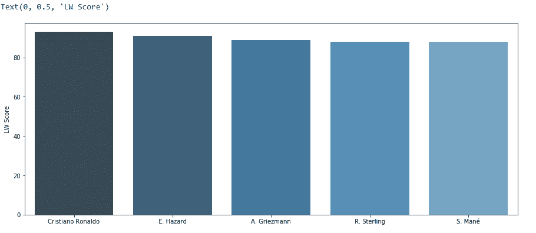

同样，我们也可以为其他位置挑选最佳球员。

**结论**

根据国际足联的数据，4-3-3 阵型的最佳阵容是:

```
fifa_skills = pd.DataFrame(data, columns= ['short_name','team_position','pace','shooting','passing','dribbling','defending','overall'
                                          ])

team = fifa_skills[(fifa_skills.short_name == 'L. Messi')|
                    (fifa_skills.short_name == 'H. Kane')|
                    (fifa_skills.short_name == 'Cristiano Ronaldo')|
                    (fifa_skills.short_name == 'K. de Bruyne')|
                    (fifa_skills.short_name == 'Sergio Busquets')|
                    (fifa_skills.short_name == 'David Silva')|
                    (fifa_skills.short_name == 'F. Acerbi')|
                   (fifa_skills.short_name == 'S. de Vrij')|
                   (fifa_skills.short_name == 'V. van Dijk')|
                   (fifa_skills.short_name == 'Pique')]

print(team)

```

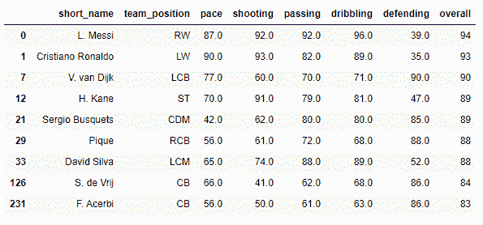

### **问题陈述二**

### **个股预测**

在这个问题陈述中，我们有一个包含单一股票价值的干净数据集。我们将使用 python 制作一个预测模型来预测特定日期的单一股票价格。

```
import pandas as pd
import numpy as np
from sklearn.linear_model import LinearRegression 
import matplotlib.pyplot as plt
import datetime

df = pd.read_csv("trainset.csv")
df.head()

```

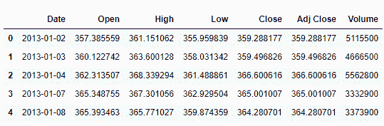

```
df.isnull().sum()

```

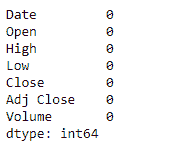

```
df['Date'] = df.Date.astype(str)
df['Date'] = df.Date.str.replace("-","").astype(float)

dates = df['Date']
x = dates.values.reshape(-1,1)
prices = df.Open
y = prices.values.reshape(-1,1)
reg = LinearRegression()
reg.fit(x,y)
pred = reg.predict(x[[0]])
print(pred)

plt.scatter(x,y,color='red')
plt.plot(x, reg.predict(x))

```

**输出:** `array([[415.36098414]])`

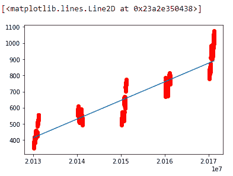

在上面的示例中，我们使用线性回归建立了一个预测模型来预测单只股票的价格。同样，我们可以用更大的数据集为许多复杂的问题建立预测模型。

这就把我们带到了本文的结尾，在这里我们学习了如何使用 Python。我希望你清楚本教程中与你分享的所有内容。如果你觉得这篇关于“如何实现 Python 库”的文章很有意义，可以看看 Edureka 的[数据科学与 Python 课程](https://www.edureka.co/data-science-python-certification-course)，这是一家值得信赖的在线学习公司，拥有遍布全球的 250，000 多名满意的学习者。

*还有，如果你正在寻找数据科学的在线结构化培训，edureka！有一个专门策划的 **[数据科学培训](https://www.edureka.co/masters-program/data-scientist-certification)** 课程，帮助您获得统计学、数据争论、探索性数据分析、机器学习算法(如 K 均值聚类、决策树、随机森林、朴素贝叶斯)方面的专业知识。您将学习时间序列、文本挖掘的概念，以及深度学习的介绍。本课程的新批次即将开始！！*

*我们在这里帮助你踏上旅程的每一步，并为想成为  [Python 开发者](https://www.edureka.co/blog/how-to-become-a-python-developer/)的学生和专业人士设计课程。该课程旨在让您在 Python 编程方面有一个良好的开端，并训练您掌握核心和高级 Python 概念以及各种  [Python 框架](https://www.edureka.co/blog/python-frameworks/) ，如  [Django。](https://www.edureka.co/blog/django-tutorial/)*

如果你遇到任何问题，请在“如何实现 Python 库”的评论部分提出你的问题。我们团队很乐意回答。