# AWS 认证:亚马逊网络服务职业机会的关键

> 原文：<https://www.edureka.co/blog/aws-certification-career-opportunities-in-amazon-web-services>

云市场正在快速增长，对于零售和 IT 巨头来说，这是一个重要的机会。 [AWS](https://www.edureka.co/blog/what-is-aws/) 在云服务行业扮演着越来越重要的角色，已经成为亚马逊的重要收入来源。2013 年，AWS 的收入刚刚超过 30 亿美元，这个数字一直在膨胀，截至 2018 年，已经超过**250 亿美元**。这绝对是在 AWS 开始职业生涯的正确时机。在本文中，我们将按以下顺序讨论 aws 认证以及它将如何促进您的职业发展:

*   [AWS 认证](#aws)
*   [职业机会](#career)
*   [AWS 工作角色&薪水](#job)

## **AWS 认证-什么，为什么&如何认证？**

需要特定的基于云的技能的大型企业通常致力于特定服务提供商(如 AWS)的解决方案。这些企业拥有各种各样的技能，并不时得到更新。因此，保持自我更新以促进你在 AWS 的职业生涯是很重要的，AWS 认证将为你的简历加分。那么，这个 [AWS 认证](https://www.edureka.co/aws-certification-training)是什么，你打算从中学习什么？

### **AWS 认证的目的是什么？**

AWS 认证是根据行业要求和需求策划的。它帮助您在 AWS 上有效地部署安全和健壮的应用程序。此外，它还可以帮助您根据数据、计算或安全要求确定合适的 AWS 服务。

完成 AWS 认证培训后，您将能够:

*   在 AWS 上设计和部署可扩展、高可用性和容错系统
*   高效处理进出 AWS 的数据
*   根据数据、计算、数据库或安全要求确定合适的 AWS 服务
*   确定 AWS 架构最佳实践的适当用法
*   估计 AWS 定价并确定成本控制机制
*   你甚至可以通过 [AWS 云迁移认证](https://www.edureka.co/migrating-to-aws)查看迁移到 AWS 的细节。

### **您为什么要参加 AWS 认证培训？**

AWS 在云计算领域处于领先地位。无论你是网络开发人员、数据库或系统管理员、大数据分析师还是物联网开发人员，你都有可能使用过这项服务。AWS 认证有助于您走上职业道路，如 AWS 解决方案架构师、AWS 工程师、 [DevOps 工程师](https://www.edureka.co/blog/aws-certified-devops-engineer/)、云架构师等。

为了利用这些机会，您需要结构化的 AWS 培训，并根据当前的行业要求和最佳实践更新课程。除了强大的理论理解，你还需要参与各种现实生活中的项目，并为存储、计算等提供不同的服务。

此外，你还需要一位目前在该行业工作并应对现实生活挑战的专家的建议。

### AWS 认证对你的职业生涯有什么帮助？

AWS 认证将促进您的职业发展，因为:

*   **亚马逊网络服务** (CSA)认证被评为全球最有价值的 IT 认证。
*   在 Gartner 发布的最新魔力象限报告中，AWS 保持了其作为云基础设施即服务(IaaS)提供商之王的地位
*   AWS 架构师的平均工资是**$ 125，000**
*   在 CAGR 为 22%的情况下，AWS 市场预计到 2020 年将达到**236 亿美元**

**查看我们在顶级城市的 AWS 认证培训**

| 印度 | 美国 | 其他国家 |
| [在海德拉巴的 AWS 培训](https://www.edureka.co/aws-certification-training-hyderabad) | [亚特兰大 AWS 培训](https://www.edureka.co/aws-certification-training-atlanta) | [AWS 伦敦培训](https://www.edureka.co/aws-certification-training-london) |
| [班加罗尔的 AWS 培训](https://www.edureka.co/aws-certification-training-bangalore) | [波士顿 AWS 培训](https://www.edureka.co/aws-certification-training-boston) | [阿德莱德的 AWS 培训](https://www.edureka.co/aws-certification-training-adelaide) |
| [钦奈的 AWS 培训](https://www.edureka.co/aws-certification-training-chennai) | [纽约市的 AWS 培训](https://www.edureka.co/aws-certification-training-new-york-city) | [新加坡 AWS 培训](https://www.edureka.co/aws-certification-training-singapore) |

## **职业机会**

在很短的时间内，亚马逊网络服务认证专家被列为薪酬最高的 IT 认证持有者。根据 Global Knowledge 最近的一项薪资调查，持证员工的平均薪资为**113，932 美元**，最高可达**201，000 美元**。根据 IDC 的数据，到 2019 年，几乎一半的 IT 支出都是基于云的，到 2020 年，包括所有软件、服务和技术在内的支出将占到 60%到 70%。据 **Forbes 报道，到 2020 年，83%的企业工作负载将在云中，到 2020 年，受欢迎的云服务提供商的市场份额将由亚马逊网络服务占 50%，微软 Azure 占 21%，谷歌云平台占 18%。**

以下是基于 AWS 认证的一些主要招聘人员及其薪资:

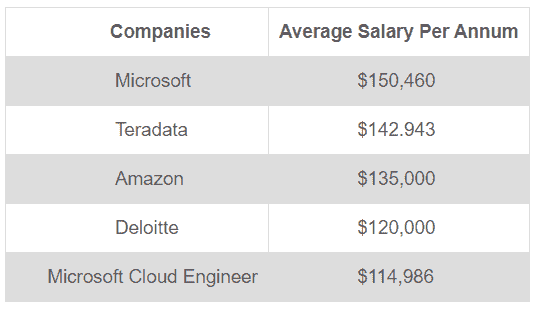

## **AWS 认证工作角色&薪资**

亚马逊网络服务(AWS)认证打开了许多高薪工作的大门。它帮助你克服职业不稳定的风险。如果你是 AWS 认证的，有很多工作角色可以申请。以下是基于你的 AWS 认证和薪水的 5 大工作角色:

### **AWS 云架构师**

AWS Cloud Architect 直接与工程师和客户联系，提供了与利益相关者和技术领导的接口。云架构师提供主要的实现工作和技术架构，确保新技术的分散被采用。

**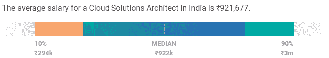**

薪酬也因亚马逊网络服务(AWS)、云计算、微软 Azure、企业解决方案和系统架构方面的技能而异。

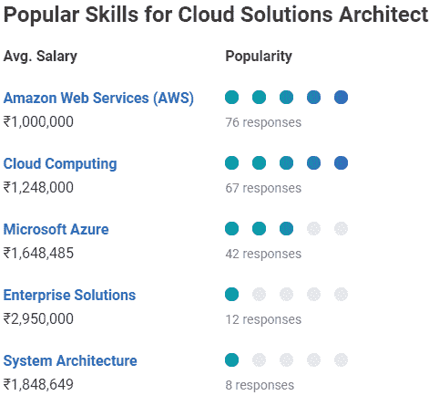

### **云开发者**

云开发者负责为企业开发软件应用和解决方案。拥有丰富的软件开发经验和一些 AWS 平台知识，可以申请不同的 AWS 角色。此外，AWS 认证将帮助您将云开发人员的职业生涯提升一个层次。

印度云开发人员或解决方案工程师的平均工资是₹701,049.

**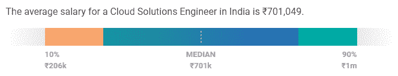**

工资根据亚马逊网络服务(AWS)、云计算、Linux 和微软 Azure 的技能而有所不同。

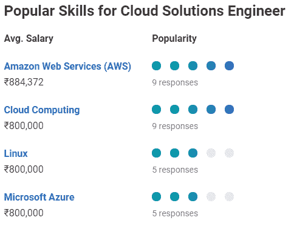

### **云开发工程师**

DevOps 工程师是指在网络运营和系统部署方面拥有开发以外的专业技能的人。这样，在 AWS 平台上拥有深厚知识和实践经验的多种技能可以打开各种工作机会。此外，如果你已经通过 AWS 认证验证了你的技能，你获得 AWS 工作的机会几乎会翻倍。

根据工资等级表，印度开发运营工程师的平均工资是₹667,182.

**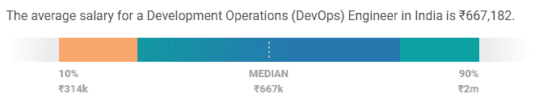**

AWS 是云计算开发工程师薪酬最高的技能之一。

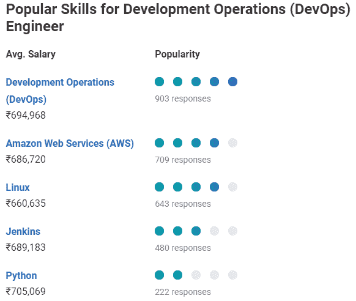

### **云软件工程师**

如果你是一名用 Python、T2、Ruby、T4、JavaScript 或 C++编程的软件工程师，你将有很大的机会在亚马逊网络服务领域发展。您在 AWS 平台上设计、开发和实施系统/软件的能力可以带来更多获得 AWS 工作的机会。所以，用 AWS 认证来验证你的软件设计和开发技能，在就业市场中脱颖而出。

印度云软件工程师的平均工资是₹669,476.

**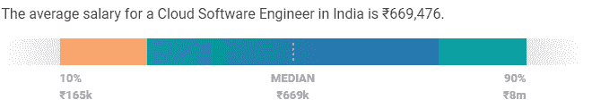**

*来源- [薪级](https://www.payscale.com/research/IN/Country=India/Salary)*

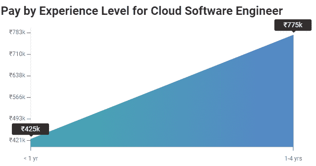

### **系统运行管理员**

AWS SysOps 管理员负责在 AWS 平台上部署、操作和管理系统。因此，如果您拥有在 AWS 云上管理和部署生产运营的专业知识，请通过 [**AWS SysOps 管理员认证**](https://www.edureka.co/aws-sysops-certification-training) 来验证您的专业知识。获得 AWS 认证会在你的简历中增加一个凭证，从而帮助你获得更高的薪水。

印度系统管理员的平均工资是₹399,285.

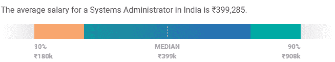

## 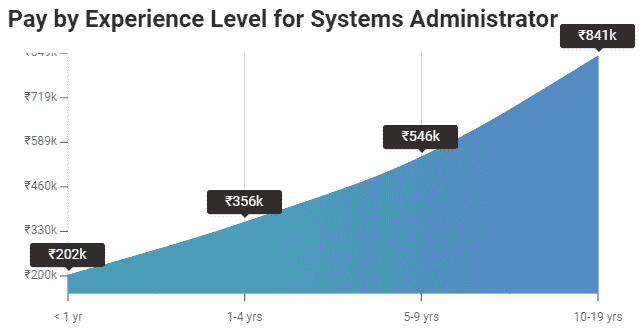

这就是拥有 AWS 解决方案架构师认证的一些好处，以及基于各个方面的工资。说到这里，我们的文章就到此为止了。

有问题要问我们吗？请在评论区提到它，我们会给你回复。